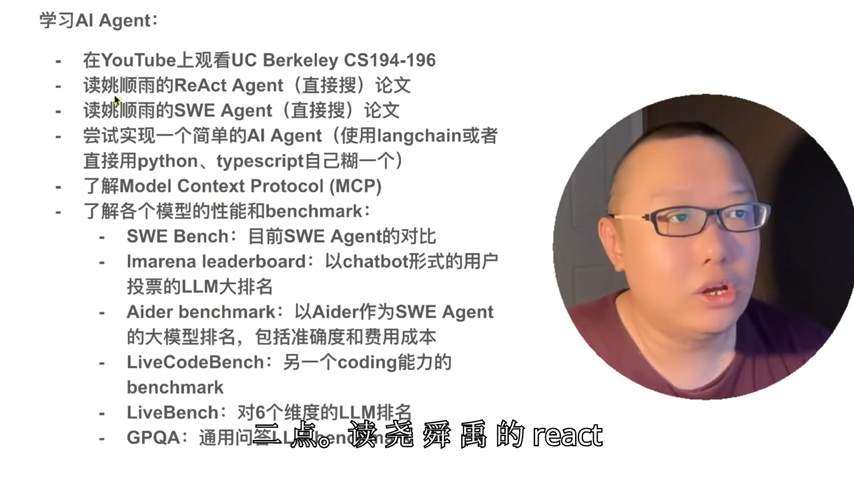
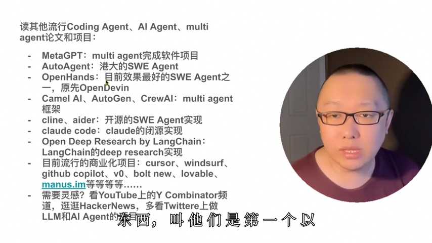

# 收藏

## SEU
[邮箱](https://mail.seu.edu.cn/)、[选课](https://yjsxk.urp.seu.edu.cn/yjsxkapp/sys/xsxkapp/index.html)、[信息科学与工程学院](https://radio.seu.edu.cn/)、[办事服务大厅](https://ehall.seu.edu.cn/new/index.html)、[研究生综合服务系统](https://yjs.seu.edu.cn/gsapp/sys/yjsemaphome/portal/index.do)

## 科研相关

### 通信与感知
- 知乎资源：[通信感知一体化偏信息论方向](https://www.zhihu.com/question/3203612397/answer/24797391704)、[通信 MATLAB 仿真合集](https://zhuanlan.zhihu.com/p/385096476)、[通信感知一体化开源代码和数据论文汇总](https://zhuanlan.zhihu.com/p/651958439)
- 学者主页：[刘凡知乎](https://www.zhihu.com/people/lf92)、[刘凡谷歌学术](https://scholar.google.com.hk/citations?user=kj2PE40AAAAJ&hl=zh-CN&oi=sra)、[许威谷歌学术](https://scholar.google.com/citations?hl=en&user=lNWf6Z4AAAAJ&view_op=list_works)
- [论文池](https://papers.cool/arxiv/search?highlight=1&query=ai+communicattion)

### 学术资源
- 学者主页：[Zheng Wang](https://seu-zheng-wang.github.io/)、[Chenhao Qi](https://signal.seu.edu.cn/multimedia/chenhao/main.psp#anchor=block_34418)、[Rang Liu](https://rangliu0706.github.io/)、[Zhiyong Feng](https://ieeexplore.ieee.org/author/37536937000)、[Jie Xu](https://scholar.google.com/citations?hl=en&user=HPUG2jwAAAAJ&view_op=list_works&sortby=pubdate)、[清华论文](https://oa.ee.tsinghua.edu.cn/dailinglong/publications/publications.html)、[Geoffrey Li](https://profiles.imperial.ac.uk/geoffrey.li/publications)
- 代码资源：[massivemimobook](https://github.com/emilbjornson/massivemimobook)

### 会议与资源
[2024 全球通信会议](https://edas.info/p31420#top)、[黄大年直播](https://www.chaspark.com/#/s/202306091530)、[水论文的科技猿](https://www.cnblogs.com/nickchen121)

### 工具与模板
[北航毕设论文 LaTeX 模板](https://github.com/BHOSC/BUAAthesis)、[vim 指令汇总](https://www.cnblogs.com/softwaretesting/archive/2011/07/12/2104435.html)

> 通信之道 289/441

## 码农

> Al工具应用 agent开发 私有大模型部署调优暴露接口解决业务问题
>
> 大并发+大数据+大模型

### 编程工具
[代码可视化运行](https://pythontutor.com/python-compiler.html)、[开发人员备忘录](https://wangchujiang.com/reference/)、[算法笔记](https://www.zhihu.com/column/c_1182444932760125440)、[AI对比](https://artificialanalysis.ai/leaderboards/providers)

### 比赛平台
[Kaggle](https://www.kaggle.com/competitions)、[阿里云天池比赛](https://tianchi.aliyun.com/competition/gameList/activeList)、[AI Challenger](https://challenger.ai/?lan=zh)、[和鲸HeyWhale](https://www.kesci.com/home/competition)

### 深度学习

#### 学习路线
> 吴恩达《机器学习》-> 吴恩达《深度学习》->李沐《动手学深度学习》->李宏毅相关课程挑感兴趣的看->李沐《论文精读》，到这一步基本上就知道自己喜欢做什么了，继续去 google 上找自己找感兴趣的相关论文。深度学习用 python 和 C++。
>
> deep learning相关：
> a.专注于Al Agent:UC Berkeley CS194-196, LLM Agent
> b.经典bayesian ML（可选）：coursera machine learning,Stanford CS229
> C.经典deep learning（可选）：coursera deep learning,Stanford CS231n

#### 学习资源
[顶级的机器学习 Python 库列表](https://github.com/ml-tooling/best-of-ml-python)、[AI Learning](https://ailearning.apachecn.org/#1text-classification)、[神经网络详细代码](https://nn.labml.ai/zh/)、[各类 AI 模型详讲](https://colah.github.io/)、[多模态大模型文章梳理](https://zhuanlan.zhihu.com/p/677768053)、[机器学习的学习路径及知识总结](https://github.com/loveunk/machine-learning-deep-learning-notes)

#### 课程资源
[李宏毅 2021/2022/2023 春季机器学习课程课件及作业](https://github.com/Fafa-DL/Lhy_Machine_Learning)、**understanding deep learning**

#### 动手学深度学习
[习题解答](https://datawhalechina.github.io/d2l-ai-solutions-manual/#/ch04/ch04)、[课程安排](https://courses.d2l.ai/zh-v2/)、[进度](https://zh-v2.d2l.ai/chapter_recurrent-modern/gru.html)

#### 其他资源
[《Pytorch 实用教程》](https://github.com/TingsongYu/PyTorch-Tutorial-2nd)、[技术分享笔记网站](https://www.sharetechnote.com/)

#### 面试资源
[DeepLearning-Interview-Awesome-2024](https://github.com/315386775/DeepLearing-Interview-Awesome-2024)、[AIGC 求职](https://github.com/EmbraceAGI/AIGC_Interview)

#### 学习笔记
[西瓜书学习笔记](https://github.com/Vay-keen/Machine-learning-learning-notes)、[王喆的机器学习笔记](https://zhuanlan.zhihu.com/wangzhenotes)

#### 强化学习
[简单实现](https://github.com/FareedKhan-dev/all-rl-algorithms)、[书](https://datawhalechina.github.io/easy-rl/#/)、[配套代码](https://github.com/datawhalechina/easy-rl)

### Transformer
[Transformer 模型详解](https://zhuanlan.zhihu.com/p/338817680)、[分析 transformer 模型](https://zhuanlan.zhihu.com/p/624740065)、[Vision Transformer LLM Diffusion Model 超详细解读](https://zhuanlan.zhihu.com/p/348593638)、[VIT 入门](https://blog.csdn.net/qq_37541097/article/details/118242600)、[大模型超详细解读](https://zhuanlan.zhihu.com/p/625926419)

### AI-agent

[10 Lessons](https://github.com/microsoft/ai-agents-for-beginners/tree/main/translations/zh)

### LLM

#### 0x00 学习路径

本文分为三个章节，各章节的学习目标如下。

- 入门篇：
	- 了解大语言模型的基础知识和常见术语。
	- 学会使用编程语言访问 OpenAI API 等常见大语言模型接口。
	- 面向非专业背景的大模型普及知识。
- 应用篇：
	- 可以在本地环境搭建开源模型的推理环境。
	- 大语言模型应用开发框架（如 LangChain、Dify等）。
	- Prompt 工程、 RAG、Agent 等大模型应用开发范式。
- 深入篇：
	- 大模型技术原理、训练微调、数据工程、推理优化等。
	- 大模型应用范式（RAG、Agent等）前沿进展。

读者可以根据自己需要选择对应的章节，如对大语言模型的原理不感兴趣，可只关注入门篇和应用篇。
考虑到阅读背景，本文尽可能提供中文资料或有中文翻译的资料。

标记为【必看】的是我认为只要你对这个主题感兴趣，必须要看的资料。

#### 0x10 入门篇

> 在入门之前，请申请 OpenAI API，并具备良好的国际互联网访问条件。  
> 推荐注册 https://openrouter.ai/ 可一站式访问大量闭源和开源模型。

- [ChatGPT Prompt Engineering for Developers](https://learn.deeplearning.ai/chatgpt-prompt-eng/lesson/1/introduction)
	- 虽然是 Prompt 工程，但是内容比较简单，适合入门者。
	- 中英双语字幕： https://github.com/GitHubDaily/ChatGPT-Prompt-Engineering-for-Developers-in-Chinese
- [OpenAI Quickstart](https://platform.openai.com/docs/quickstart) 【必看】
	- OpenAI 官方 Quickstart 文档。以及 [API Reference](https://platform.openai.com/docs/api-reference)
- State of GPT：Andrej Karpathy 做的演示，极好的总结了 GPT 的训练和应用。 【必看】
	- 视频： https://www.youtube.com/watch?v=bZQun8Y4L2A
	- PPT： https://karpathy.ai/stateofgpt.pdf
- Deep Dive into LLMs like ChatGPT: Andrej Karpathy 最新的长达3小时的入门视频【必看】
	- 视频：https://www.youtube.com/watch?v=7xTGNNLPyMI
	- 中英双语字幕：https://b23.tv/vF2vS6t

#### 0x20 应用篇

- [Building Systems with the ChatGPT API](https://learn.deeplearning.ai/chatgpt-building-system/lesson/1/introduction)
  -  中文字幕： https://www.bilibili.com/video/BV1gj411X72B/
- [Langchain](https://python.langchain.com/)
	- Langchain 是大语言模型最火的应用框架。即使不使用，也可以借鉴。
	- [LangChain for LLM Application Development](https://learn.deeplearning.ai/langchain/lesson/1/introduction)
	    - 中文字幕： https://www.bilibili.com/video/BV1Ku411x78m/ 
- [dify](https://dify.ai/)：开源的应用编排工具。
- [GPT best practices](https://platform.openai.com/docs/guides/gpt-best-practices/gpt-best-practices)：OpenAI 官方出的最佳实践。
- [openai-cookbook](https://github.com/openai/openai-cookbook)：OpenAI 官方 Cookbook。
- [Brex's Prompt Engineering Guide](https://github.com/brexhq/prompt-engineering)：Prompt 工程简介

#### 0x30 深入篇

**0x31 大模型技术基础方向**

- [《动手学深度学习》](https://zh.d2l.ai/)：配合[B站李沐的视频]( https://courses.d2l.ai/zh-v2/)，是我个人认为最好的深度学习入门课程。【必看】
- [深度学习：台湾大学李宏毅](https://www.bilibili.com/video/BV1J94y1f7u5/)：台湾大学李宏毅，讲的很清楚，也比较有趣。
- [3brown1blue 系列视频](https://www.youtube.com/watch?v=wjZofJX0v4M)：动画做的很好，可反复回顾 【必看】

**0x32 大模型技术原理方向**

- [大语言模型综述](https://github.com/RUCAIBox/LLMSurvey)【必看】
	- 大语言模型迄今为止最好的学术向中文综述。
- [大语言模型](https://github.com/LLMBook-zh/LLMBook-zh.github.io)【必看】
	- 大语言模型迄今为止最好的书籍。
- [大规模语言模型：从理论到实践](https://intro-llm.github.io/)：另一本不错的中文书籍。
- [清华大模型公开课第二季](https://www.bilibili.com/video/BV1pf421z757)：系统的了解大模型的历史、原理和前沿进展。【必看】
- [GPT，GPT-2，GPT-3 论文精读](https://www.bilibili.com/video/BV1AF411b7xQ)：GPT 系列模型论文精读
- [Llama3.1 论文精读](https://www.bilibili.com/video/BV1WM4m1y7Uh)：最好的开源大模型论文精读
- [复杂推理：大语言模型的北极星能力](https://yaofu.notion.site/6dafe3f8d11445ca9dcf8a2ca1c5b199) ：略学术，解释大语言模型能力的来源。
- [ICML 2024 Tutorial: Physics of Language Models by Zeyuan Allen-Zhu](https://www.bilibili.com/video/BV1TPpbeVEUi/)：使用黑盒研究大模型的原理，非常有参考价值。【必看】

**0x33 大模型训练微调方向**

- [Build a Large Language Model (From Scratch)](https://github.com/rasbt/LLMs-from-scratch)：从零构建大模型。【必看】
- [LLaMA-Factory](https://github.com/hiyouga/LLaMA-Factory)：个人最推荐的微调大模型的工具。【必看】
- [MAP-NEO](https://github.com/multimodal-art-projection/MAP-NEO)：唯一全过程开源的中文大模型（包括数据处理工具、预训练数据、微调数据等）
- [The Ultra-Scale Playbook: Training LLMs on GPU Clusters](https://huggingface.co/spaces/nanotron/ultrascale-playbook)：大规模集群训练大模型的经验，前面部分对模型训练的显存占用、4D并行做了很详细的说明。[中文翻译](https://huggingface.co/spaces/Ki-Seki/ultrascale-playbook-zh-cn)。【必看】

**0x34 大模型数据工程方向**

- [How to Generate and Use Synthetic Data for Finetuning](https://eugeneyan.com/writing/synthetic/)：如何合成微调数据。
- [中文行业预训练语料 IndustryCorpus 2.0](https://data.baai.ac.cn/details/BAAI-IndustryCorpus-v2)：亮点是预训练数据处理流比较科学。[数据处理工具 FlagData](https://github.com/FlagOpen/FlagData/blob/main/README_zh.md)

0x35 大模型推理优化方向

- [Challenges in Deploying Long-Context Transformers: A Theoretical Peak Performance Analysis](https://arxiv.org/abs/2405.08944)：大模型推理速度计算和瓶颈分析。【必看】
- [A Visual Guide to Quantization](https://newsletter.maartengrootendorst.com/p/a-visual-guide-to-quantization)：大模型量化解析。

**0x36 大模型应用方向**

- [A Survey of Prompt Engineering Methods in Large Language Models for Different NLP Tasks](https://arxiv.org/abs/2407.12994): Prompt 工程综述
- [Modular RAG: Transforming RAG Systems into LEGO-like Reconfigurable Frameworks](https://arxiv.org/pdf/2407.21059)：高级 RAG 优化方法。
- [LLM Powered Autonomous Agents](https://lilianweng.github.io/posts/2023-06-23-agent/)：Agent 早期的很不错的文章。

### 编程开发

#### 面试资源
[后端开发校面试笔记本](https://github.com/wolverinn/Waking-Up)、[互联网 Java 工程师进阶知识完全扫盲](https://github.com/doocs/advanced-java)、[程序员最佳网站列表](https://github.com/sdmg15/Best-websites-a-programmer-should-visit)

#### 剑指 offer
[LeetCode Wiki](https://doocs.github.io/leetcode/)、[笔试真题](https://kamacoder.com/contest.php)、[八股文的安排](https://mp.weixin.qq.com/s/7xNVqCBIpqL6THUSDoIRyw)

#### Java 教程
[韩顺平 Java](https://github.com/timerring/backend-tutorial/tree/main)、[OpenJDK 8](https://devdocs.io/openjdk~8/)

#### 学习教程
[廖雪峰](https://liaoxuefeng.com/)、[Java 学习路线 1](https://javabetter.cn/xuexiluxian/java/yitiaolong.html)、[路线 2](https://thinkingme.github.io/coding-road/home.html)、[Javaguide](https://javaguide.cn/)、[Java 全栈知识体系](https://pdai.tech/)、[算法图解](https://www.hello-algo.com/)、[小崔的刷题笔记](https://vernon97-io.gitbook.io/untitled)、[大学四年学习指南](https://books.halfrost.com/leetcode/)

### 技术博客
[通信博士的笔记](https://zlearning.netlify.app/)、[沉睡的海洋](https://sleepyocean.github.io/)、[哈工大大佬 Pion1eer](https://www.ruanx.net/)、[Levitate](https://levitate-qian.github.io/)、[ziheng's Blog](https://zihengcat.github.io/archives/)、[美团](https://tech.meituan.com/)、[人工智能教程](https://www.captainbed.net/blog-neo/)

## 实用资源

### 学习资源
[Quantumult X 账号](https://shenhouyun.com/QuantumultX/)、[free-programming-books](https://ebookfoundation.github.io/free-programming-books/)、[Programming Notes for Professionals books](https://book.goalkicker.com/)

### 视频资源
[食贫道](https://www.alipan.com/s/C8DFhqR3ueW/folder/65ac32ca0bff99a1cf4b4c2ca67a3bf857437eda)、[b 站付费课程大合集](https://bbs.alipansou.com/d/39134-b%E7%AB%99%E4%BB%98%E8%B4%B9%E8%AF%BE%E7%A8%8B%E5%A4%A7%E5%90%88%E9%9B%86)

### 工具资源
[传输文件(小于 10GB)](https://ydray.com/en/)、[github 的推荐](https://github.com/explore)、[cloudflare tunnel内网穿透](https://zhuanlan.zhihu.com/p/621870045)、[windows docker 里安装并使用 mysql](https://blog.csdn.net/u012643122/article/details/125899829)

### 苹果相关
- 快捷指令：[jiejingku](https://jiejingku.net)、[rcuts](https://rcuts.com)、[sspai](https://sspai.com/page/playbook/zh-CN)、[ae85](https://ae85.cn/gz.html)、[mrlin](https://lin.mrlin.vip/index.php?m=home&c=Lists&a=index&tid=70&page=2)、[kejicut](https://www.kejicut.com)、[routinehub](https://routinehub.co)、[shortcutsgallery](https://shortcutsgallery.com)、[applefans](https://applefans.today/category/applefans-classroom/apple-shortcuts/)
- [苹果账号](https://www.iios.club/)
