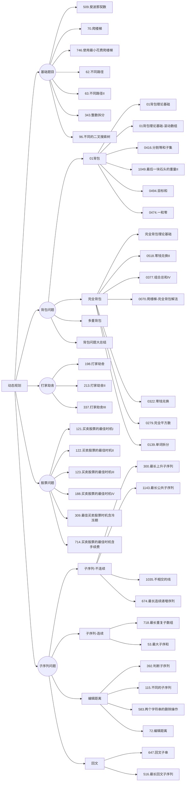

# 动态规划

## 基础知识

题目分类：

动态规划，英文：Dynamic Programming，简称DP，如果某一问题有很多重叠子问题，使用动态规划是最有效的。

所以动态规划中每一个状态一定是由上一个状态推导出来的，**这一点就区分于贪心**，贪心没有状态推导，而是从局部直接选最优的，

动态规划的三要素:

1. 最优子结构
2. 状态转移方程((包含最优子结构))
3. 边界

##  509. 斐波那契数

[力扣题目链接(opens new window)](https://leetcode.cn/problems/fibonacci-number/)

斐波那契数，通常用 F(n) 表示，形成的序列称为 斐波那契数列 。该数列由 0 和 1 开始，后面的每一项数字都是前面两项数字的和。也就是： F(0) = 0，F(1) = 1 F(n) = F(n - 1) + F(n - 2)，其中 n > 1 给你n ，请计算 F(n) 。

未完待续~~~