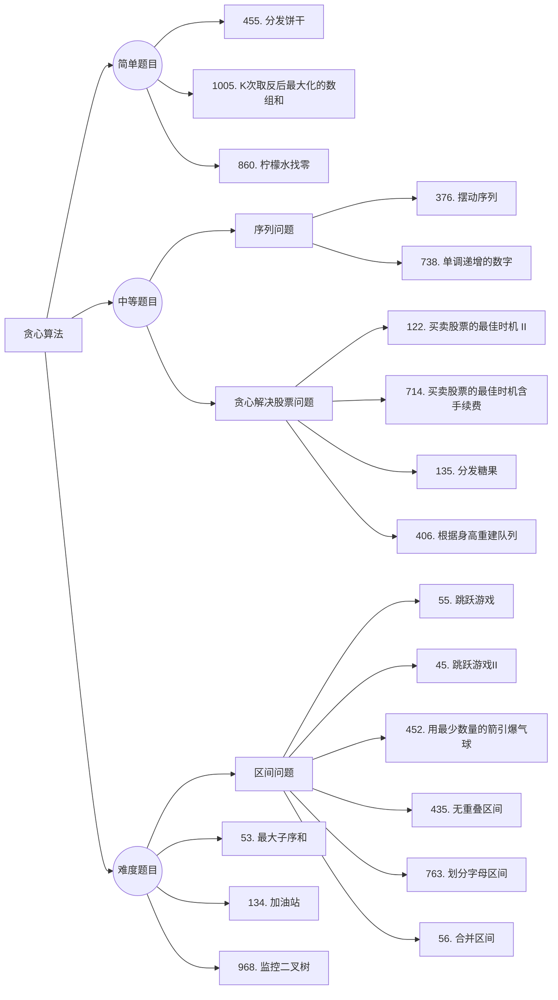

 # 动态规划

## 题目分类



##  理论基础

贪心的本质是选择每一阶段的局部最优，从而达到全局最优。

###  贪心的套路

唯一的难点就是如何通过局部最优，推出整体最优。

最好用的策略就是举反例，如果想不到反例，那么就试一试贪心。

有时候通过（accept）了贪心的题目，但都不知道自己用了贪心算法，**因为贪心有时候就是常识性的推导，所以会认为本应该就这么做！

题目：[链表：环找到了，那入口呢？ (opens new window)](https://programmercarl.com/0142.环形链表II.html)，这种题目确实需要数学简单推导。

贪心一般解题步骤：想清楚**局部最优**是什么，如何推导出全局最优。

## 455.分发饼干

[力扣题目链接(opens new window)](https://leetcode.cn/problems/assign-cookies/)

假设你是一位很棒的家长，想要给你的孩子们一些小饼干。但是，每个孩子最多只能给一块饼干。

对每个孩子 i，都有一个胃口值  g[i]，这是能让孩子们满足胃口的饼干的最小尺寸；并且每块饼干 j，都有一个尺寸 s[j] 。如果 s[j] >= g[i]，我们可以将这个饼干 j 分配给孩子 i ，这个孩子会得到满足。你的目标是尽可能满足越多数量的孩子，并输出这个最大数值。

解答：

```java
class Solution {
    public int findContentChildren(int[] g, int[] s) {
        int cnt = 0;
        Arrays.sort(g);
        Arrays.sort(s);
        int j = 0;
        for(int i = 0; i < s.length; i++){
            if(j < g.length && s[i] >= g[j]){
                cnt++;
                j++;
            }
        }
        return cnt;
    }
}
```

## 376. 摆动序列

[力扣题目链接](https://leetcode.cn/problems/wiggle-subsequence/)

如果连续数字之间的差严格地在正数和负数之间交替，则数字序列称为摆动序列。第一个差（如果存在的话）可能是正数或负数。少于两个元素的序列也是摆动序列。

解答：

```java
class Solution {
    public int wiggleMaxLength(int[] nums) {
        if(nums == null || nums.length == 0) return 0;
        if(nums.length == 1) return nums.length;
        int cnt = 0;
        int i = 1;
        while(i < nums.length && nums[i] == nums[i -1]) i++;
        if(i == nums.length) return 1;
        boolean flag = (nums[i-1] > nums[i]);
        for(; i < nums.length; i++){
            if(nums[i-1] == nums[i]) continue;
            if(flag == (nums[i-1] > nums[i])){
                flag = !flag;
                cnt++;
            }
        }
        return ++cnt;
    }
}

//D
```


未完待续~~~