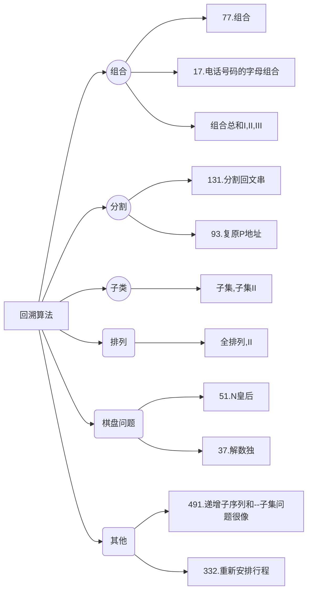

# 回溯

## 回溯算法理论基础

题目分类：




回溯法也可以叫做回溯搜索法，它是一种搜索的方式。回溯是**递归**的副产品，只要有递归就会有回溯。

### 回溯法的效率

虽然回溯法很难，很不好理解，但是回溯法并不是什么高效的算法。因为回溯的**本质是穷举**，穷举所有可能，然后选出我们想要的答案，如果想让回溯法高效一些，可以加一些剪枝的操作，但也改不了回溯法就是穷举的本质。

组合无序，排列有序

### 理解回溯法

所有回溯法的问题都可以抽象为**树形结构**，因为回溯法解决的都是在集合中递归查找子集，**集合的大小就构成了树的宽度，递归的深度就构成了树的深度**。

递归要有终止条件，所以必然是一棵高度有限的树（N叉树）。

###  回溯法模板

回溯三部曲：

1. 返回值以及参数
   函数返回值一般为void，参数一般是先写逻辑才能确定
2. 终止条件
   终止条件从树中就可以看出，一般来说是搜到叶子节点
3. 遍历过程
   一般是在集合中递归搜索，集合的大小构成了树的宽度，递归的深度构成的树的深度


## 第77题. 组合

[力扣题目链接(opens new window)](https://leetcode.cn/problems/combinations/)

给定两个整数 n 和 k，返回 1 ... n 中所有可能的 k 个数的组合。

示例: 输入: n = 4, k = 2 输出: [ [2,4], [3,4], [2,3], [1,2], [1,3], [1,4], ]

解答：

```java
class Solution {
    List<List<Integer>> res = new ArrayList<>();
    Deque<Integer> deque = new LinkedList<>();
    public List<List<Integer>> combine(int n, int k) {
        backtracking(n, k, 1);
        return res;

    }
    private void backtracking(int n, int k, int startindex){
        if(deque.size() == k){
            res.add(new ArrayList<>(deque));
            return;
        }

        for(int i = startindex; i <= n - (k - deque.size() - 1); i++){
            deque.offer(i);
            backtracking(n, k, i+1);
            deque.pollLast();
        }
    }
}
```

## 216.组合总和III

[力扣题目链接(opens new window)](https://leetcode.cn/problems/combination-sum-iii/)

找出所有相加之和为 n 的 k 个数的组合。组合中只允许含有 1 - 9 的正整数，并且每种组合中不存在重复的数字。

说明：

- 所有数字都是正整数。
- 解集不能包含重复的组合。

解答：

```java
class Solution {
    List<List<Integer>> res = new ArrayList<>();
    Deque<Integer> deque = new LinkedList<>();
    public List<List<Integer>> combinationSum3(int k, int n) {
        backtracking(k, n, 1);
        return res;
    }
    private void backtracking(int k, int n, int startindex){
        if(k == 0 || n == 0){
            if(k == 0 && n == 0) res.add(new ArrayList<>(deque));
            return;
        }

        for(int i = startindex; i <= Math.min(n, 9); i++){
            deque.offer(i);
            backtracking(k-1, n-i, i+1);
            deque.pollLast();
        }
    }
}
```

## 17.电话号码的字母组合

[力扣题目链接(opens new window)](https://leetcode.cn/problems/letter-combinations-of-a-phone-number/)

给定一个仅包含数字 2-9 的字符串，返回所有它能表示的字母组合。

给出数字到字母的映射如下（与电话按键相同）。注意 1 不对应任何字母。

解答：

```java
```

未完待续~~~