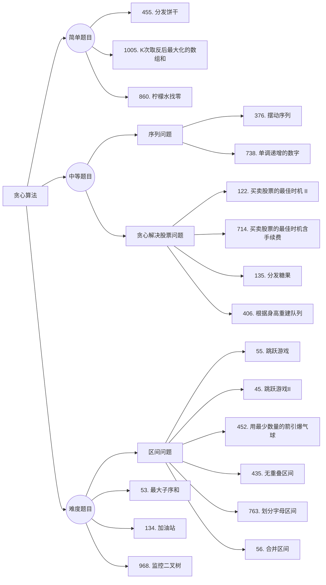

 # 贪心算法

## 题目分类



##  理论基础

贪心的本质是选择每一阶段的局部最优，从而达到全局最优。

###  贪心的套路

唯一的难点就是如何通过局部最优，推出整体最优。

最好用的策略就是举反例，如果想不到反例，那么就试一试贪心。

有时候通过（accept）了贪心的题目，但都不知道自己用了贪心算法，**因为贪心有时候就是常识性的推导，所以会认为本应该就这么做！

题目：[链表：环找到了，那入口呢？](https://programmercarl.com/0142.环形链表II.html)，这种题目确实需要数学简单推导。

贪心一般解题步骤：想清楚**局部最优**是什么，如何推导出全局最优。

## 455.分发饼干

[力扣题目链接](https://leetcode.cn/problems/assign-cookies/)

假设你是一位很棒的家长，想要给你的孩子们一些小饼干。但是，每个孩子最多只能给一块饼干。

对每个孩子 i，都有一个胃口值  g[i]，这是能让孩子们满足胃口的饼干的最小尺寸；并且每块饼干 j，都有一个尺寸 s[j] 。如果 s[j] >= g[i]，我们可以将这个饼干 j 分配给孩子 i ，这个孩子会得到满足。你的目标是尽可能满足越多数量的孩子，并输出这个最大数值。

解答：

```java
class Solution {
    public int findContentChildren(int[] g, int[] s) {
        int cnt = 0;
        Arrays.sort(g);
        Arrays.sort(s);
        int j = 0;
        for(int i = 0; i < s.length; i++){
            if(j < g.length && s[i] >= g[j]){
                cnt++;
                j++;
            }
        }
        return cnt;
    }
}
```

## 376. 摆动序列

[力扣题目链接](https://leetcode.cn/problems/wiggle-subsequence/)

如果连续数字之间的差严格地在正数和负数之间交替，则数字序列称为摆动序列。第一个差（如果存在的话）可能是正数或负数。少于两个元素的序列也是摆动序列。

解答：

```java
class Solution {
    public int wiggleMaxLength(int[] nums) {
        if(nums == null || nums.length == 0) return 0;
        if(nums.length == 1) return nums.length;
        int cnt = 0;
        int i = 1;
        while(i < nums.length && nums[i] == nums[i -1]) i++;
        if(i == nums.length) return 1;
        boolean flag = (nums[i-1] > nums[i]);
        for(; i < nums.length; i++){
            if(nums[i-1] == nums[i]) continue;
            if(flag == (nums[i-1] > nums[i])){
                flag = !flag;
                cnt++;
            }
        }
        return ++cnt;
    }
}

//DP
class Solution {
    public int wiggleMaxLength(int[] nums) {
        // 0 i 作为波峰的最大长度
        // 1 i 作为波谷的最大长度
        int dp[][] = new int[nums.length][2];//记录摆动序列的最大长度
        dp[0][0] = dp[0][1] = 1;
        for(int i = 0; i < nums.length; i++){

            dp[i][0] = dp[i][1] = 1;

            for(int j = 0; j < i; j++){
                if(nums[j] > nums[i]){
                    dp[i][1] = Math.max(dp[i][1], dp[j][0] + 1);
                }

                if(nums[j] < nums[i]){
                    dp[i][0] = Math.max(dp[i][0], dp[j][1] + 1);
                }       
            }
        }
        return Math.max(dp[nums.length-1][0], dp[nums.length-1][1]);
    }
}

//j
class Solution {
    public int wiggleMaxLength(int[] nums) {
        if(nums.length <= 1) return nums.length;  //如果数组长度为0或1，则返回数组长度
        
        int up = 1, down = 1;  //记录上升和下降摆动序列的最大长度
        for(int i = 1; i < nums.length; i++){
            if(nums[i] > nums[i-1]) up = down + 1;
            else if(nums[i] < nums[i-1]) down = up + 1;
        }
        return Math.max(up, down); //返回上升和下降摆动序列的最大长度
    }
}
```

## 53. 最大子序和

[力扣题目链接(opens new window)](https://leetcode.cn/problems/maximum-subarray/)

给定一个整数数组 nums ，找到一个具有最大和的连续子数组（子数组最少包含一个元素），返回其最大和。

解答：

```java
class Solution {
    public int maxSubArray(int[] nums) {
        if(nums.length == 0) return 0;
        int maxSum = nums[0];
        int curSum = nums[0];
        for(int i = 1; i < nums.length; i++){
            curSum = Math.max(nums[i], curSum + nums[i]);
            maxSum = Math.max(curSum, maxSum);
        }
        return maxSum;
    }
}
```

## 122.买卖股票的最佳时机 II

[力扣题目链接(opens new window)](https://leetcode.cn/problems/best-time-to-buy-and-sell-stock-ii/)

给定一个数组，它的第  i 个元素是一支给定股票第 i 天的价格。

设计一个算法来计算你所能获取的最大利润。你可以尽可能地完成更多的交易（多次买卖一支股票）。

注意：你不能同时参与多笔交易（你必须在再次购买前出售掉之前的股票）。

解答：

```java
class Solution {
    public int maxProfit(int[] prices) {
        int[] dp = new int[prices.length];//存放第i天时的最大收益
        dp[0] = 0;
        for(int i = 1; i < prices.length; i++){
            dp[i] = dp[i-1] + Math.max(0, prices[i]-prices[i-1]);
        }
        return dp[prices.length-1];
    }
}
```

## 55. 跳跃游戏

[力扣题目链接(opens new window)](https://leetcode.cn/problems/jump-game/)

给定一个非负整数数组，你最初位于数组的第一个位置。

数组中的每个元素代表你在该位置可以跳跃的最大长度。

判断你是否能够到达最后一个位置。

解答：

```java
//DP
class Solution {
    public boolean canJump(int[] nums) {
        int len = nums.length;
        boolean[] dp = new boolean[len];
        dp[0] = true;
        for(int i = 0; i < len-1; i++){
            int j = 1;
            while(dp[i] && j+i < len && j <= nums[i]){
                dp[j+i] = true;
                if(j++ +i == len-1) return true;
            }
        }
        return dp[len-1];
    }
}

class Solution {
    public boolean canJump(int[] nums) {
        if(nums.length == 1) return true;
        int coverage = 0;

        for(int i = 0; i <= coverage; i++){//判断的条件很关键
            coverage = Math.max(coverage, nums[i] + i);
            if(coverage >= nums.length-1) return true;
        }

        return false;
    }
}
```

## 45.跳跃游戏 II

[力扣题目链接(opens new window)](https://leetcode.cn/problems/jump-game-ii/)

给定一个非负整数数组，你最初位于数组的第一个位置。

数组中的每个元素代表你在该位置可以跳跃的最大长度。

你的目标是使用最少的跳跃次数到达数组的最后一个位置。

解答：

```java
class Solution {
    public int jump(int[] nums) {
        if(nums == null || nums.length == 0 || nums.length == 1) return 0;
        int maxcoverage = nums[0], curcoverage = 0;
        int cnt = 0;
        for(int i = 0; i < nums.length; i++){
            maxcoverage = Math.max(maxcoverage, nums[i] + i);
            if(maxcoverage >= nums.length-1) return ++cnt;//达到条件就跳出
            if(curcoverage == i){//超过覆盖范围就跳转，其他情况是还在范围内可以不跳转
                curcoverage = maxcoverage;
                cnt++;
            }
        }

        return 0;
    }
}
```

##  1005.K次取反后最大化的数组和

[力扣题目链接(opens new window)](https://leetcode.cn/problems/maximize-sum-of-array-after-k-negations/)

给定一个整数数组 A，我们只能用以下方法修改该数组：我们选择某个索引 i 并将 A[i] 替换为 -A[i]，然后总共重复这个过程 K 次。（我们可以多次选择同一个索引 i。）

以这种方式修改数组后，返回数组可能的最大和。

解答：

```java
//常规做法
class Solution {
    public int largestSumAfterKNegations(int[] nums, int k) {
        if(nums == null || nums.length == 0) return 0;
        int negative_cnt = 0;//负数
        int sum = 0;
        Arrays.sort(nums);
        
        for(int i = 0; i < nums.length; i++){
            if(nums[i] < 0){
                negative_cnt++;
                if(negative_cnt <= k) nums[i] = -nums[i];
            } 

            if(i == negative_cnt){//此时i为第一个正数的索引
                if(negative_cnt < k){
                    if(i > 0){
                        if(nums[i] > nums[i-1]){
                            sum -= nums[i-1];
                            sum += (((k-negative_cnt) & 1) == 0) ? nums[i-1] : -nums[i-1];
                        } else {
                            nums[i] = (((k-negative_cnt) & 1) == 0) ? nums[i] : -nums[i];
                        }
                    } else {//全为正数
                        nums[0] = (((k-negative_cnt) & 1) == 0) ? nums[0] : -nums[0];
                    }
                    
                }
            }
            sum += nums[i];
        }
        if(negative_cnt == nums.length && k > negative_cnt) sum =  (((k-negative_cnt) & 1) == 0) ? sum : sum-2*nums[nums.length-1];//全为负数
        return sum;
    }
}

//贪心算法
class Solution {
    public int largestSumAfterKNegations(int[] nums, int k) {
        if(nums == null || nums.length == 0) return 0;
        int sum = 0;
        nums = IntStream.of(nums)
                .boxed()
                .sorted((a, b) -> Math.abs(b) - Math.abs(a))
                .mapToInt(Integer::intValue)
                .toArray();//按照绝对值排序
        
        for(int i = 0; i < nums.length; i++){
            if(nums[i] < 0 && k > 0){
                k--;
                nums[i] = -nums[i];
            }
            
            if(i == nums.length-1){//消化剩余的k
                nums[i] = ((k & 1) == 0) ? nums[i] : -nums[i];
            }

            sum += nums[i];

        }
        
        return sum;
    }
}

class Solution {
    public int largestSumAfterKNegations(int[] nums, int k) {
        if(nums == null || nums.length == 0) return 0;
        int negative_cnt = 0;//负数
        int sum = 0;
        Arrays.sort(nums);
        
        for(int i = 0; i < nums.length; i++){
            if(nums[i] < 0 && k > 0){
                k--;
                nums[i] = -nums[i];
            }
        }
        Arrays.sort(nums);
        if(k > 0){//消化剩余的k
            nums[0] = ((k & 1) == 0) ? nums[0] : -nums[0];
        }
        sum = Arrays.stream(nums).sum();//
        return sum;
    }
}
```

Absolute value sorting:

1. `IntStream.of(nums)`: Creates an IntStream from the input array `nums`
2. `.boxed()`: Converts the IntStream of primitive `int` values into a Stream<Integer> of wrapped Integer objects. This is necessary because the next operation (sorting) needs to work with objects, not primitives.
3. `.sorted((o1, o2) -> Math.abs(o2) - Math.abs(o1))`:
   - Sorts the stream using a custom comparator
   - `Math.abs()` takes the absolute value of each number
   - The comparison `o2 - o1` (rather than `o1 - o2`) creates a descending order
   - So numbers are sorted by their absolute values in descending order
   - For example: [-5, 2, -3, 1] would be sorted as [-5, -3, 2, 1]
4. `.mapToInt(Integer::intValue)`: Converts the Stream<Integer> back to an IntStream by extracting the primitive int value from each Integer object
5. `.toArray()`: Finally converts the IntStream into a regular int array

## 134. 加油站

[力扣题目链接(opens new window)](https://leetcode.cn/problems/gas-station/)

在一条环路上有 N 个加油站，其中第 i 个加油站有汽油 gas[i] 升。

你有一辆油箱容量无限的的汽车，从第 i 个加油站开往第 i+1 个加油站需要消耗汽油 cost[i] 升。你从其中的一个加油站出发，开始时油箱为空。

如果你可以绕环路行驶一周，则返回出发时加油站的编号，否则返回 -1。

说明:

- 如果题目有解，该答案即为唯一答案。
- 输入数组均为非空数组，且长度相同。
- 输入数组中的元素均为非负数。


未完待续~~~