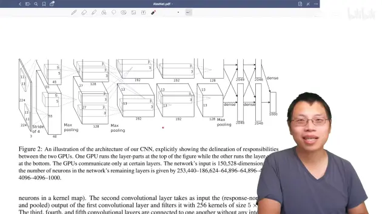
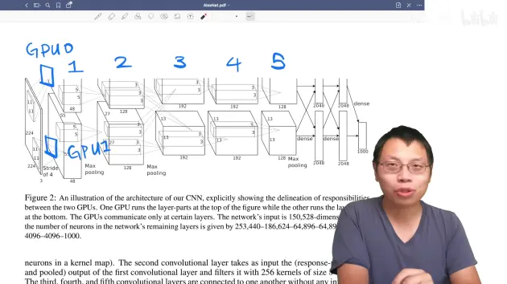
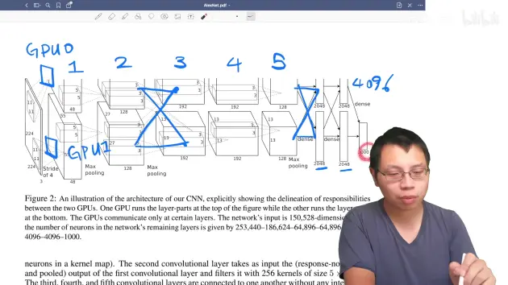
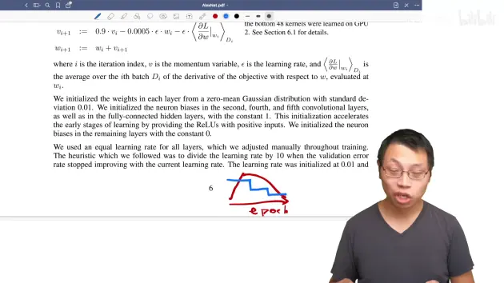

# ImageNet Classification with Deep Convolutional Neural Networks

> [论文](https://papers.nips.cc/paper_files/paper/2012/hash/c399862d3b9d6b76c8436e924a68c45b-Abstract.html)

深度学习要使用正则来避免过拟合

> 写论文时要提到别人的研究，进行对比，这个文章只提到了CNN来做图像分类

使用一个很大的模型，如何来避免

**AlexNet**

**1、introduction**

**第一段**

一篇论文的第一段通常是讲个故事

- 做什么研究
- 哪个方向
- 这个方向有什么东西
- 为什么很重要

**第二段**

描述了怎么做神经网络，这里只介绍了CNN

写论文的时候，千万不要只说自己这个领域这个小方向大概怎么样，还要提到别的方向怎么样

**第三段**

CNN虽然很好，但是很难训练，但是现在有GPU了，GPU算力能够跟上，所以能够训练很大的东西，而且数据集够大，确实能够训练比较大的CNN

前三段基本描述了

- 我做了什么东西
- 为什么能做

**第四段**

paper的贡献

- 训练了一个最大的的神经网络，然后取得了特别好的结果
- 实现了GPU上性能很高的一个2D的卷积
- 网络有一些新的和不常见的一些特性，能够提升性能，降低模型的训练时间
- 使用了什么过拟合的方法使得模型变得更好
- 模型具有5个卷积层，3个全连接层，发现深度很重要，移掉任何一层都不行

结果很好，但是还是有新东西在里面的，如果就结果很好，没有新东西，大概是不会称为奠基作

**2、the dataset**

大概描述了一下所用的数据集

重点是最后一段：ImageNet中图片的分辨率是不一样的，因此将每张图片变成了一个256*256的图片：

- 将图片的短边减少到256，长边是保证高宽比不变的情况下也往下降，长边如果依然多出来的话，如果多于256的话，就以中心为界将两边裁掉，裁成一个256*256的图片
- 没有做任何的预处理，只是对图片进行了裁剪
- 网络是在raw RGB Value上训练的
- 当时做计算机视觉都是将特征抽出来，抽SIFT也好，抽别的特征也好（imagenet数据集也提供了一个SIFT版本的特征），这篇文章说不要抽特征，直接是在原始的Pixels上做了
- 在之后的工作里面基本上主要是**end to end（端到端）**：及那个原始的图片或者文本直接进去，不做任何的特征提取，神经网络能够帮助你完成这部分工作

**3、the architecture**

讲整个网络的架构

- relu非线性激活函数
- 使用了多GPU进行训练
- 正则化、归一化
- overlapping pooling
- 总体架构

- 方框表示每一层的输入和输出的数据的大小
- 输入的图片是一个高宽分别为224*224的3通道RGB图片
- 第一层卷积：卷积的窗口是11*11，有48个输出通道，stride等于4
- 有两个GPU，GPU1和GPU0都有自己的卷积核参数

- 第一个卷积层在两个GPU上各有一个
- 第二个卷积层是在每个GPU把当前的卷积结果拿过来（GPU0的第二个卷积层读的是GPU0的第一个卷积层的卷积结果，GPU0和GPU1之间没有任何通讯）
- 到第三个卷积层的时候，GPU还是每个GPU上有自己的卷积核，但是每个卷积核会同时将第二个卷积层中GPU0和GPU1的卷积结果作为输入，两个GPU之间会通讯一次
- 第4、5个卷积层之间没有任何通讯
- 每个卷积层的通道数是不一样的，通道数有所增加，高和宽也有所变化
- 高宽慢慢变小、深度慢慢增加，随着深度的增加，慢慢地将空间信息压缩，直到最后每一个像素能够代表前面一大块的像素，然后再将通道数慢慢增加，可以认为每个通道数是去看一种特定的模式（例如192个通道可以简单地认为，能够识别图片中的192种不同的模式）
- 慢慢将空间信息压缩，语义空间慢慢增加，到最后卷积完之后，进入全连接层
- 全连接层中又出现了GPU之间的通讯，全连接层的输入是每个GPU第五个卷积的输出合并起来做全连接

- 最后进入分类层的时候，变成了一个4096长的向量，每一块来自两个GPU，每片是2048，最后拼起来，所以一张图片会表示成一个4096维的向量，最后用一个线性分类做链接
- 深度学习的主要作用是将一张输入的图片，通过卷积、池化、全连接等一系列操作，将他压缩成一个长为4096的向量，这个向量能够将中间的语义信息都表示出来（将一个人能够看懂的像素通过一系列的特征提取变成了一个长为4096的机器能够看懂的东西，这个东西可以用来做搜索、分类等）
- 整个机器学习都可以认为是一个知识的压缩过程，不管是图片、语音还是文字或者视频，通过一个模型最后压缩成一个向量，然后机器去识别这个向量，然后在上面做各种事情
- 模型并行（model parallel）：现在在计算机视觉里面用的不多，但是在自然语言处理方面又成为主流了（将模型切开进行训练）

**4、reducing overfitting**

第四章讲述了如何降低过拟合

数据增强（data augmentation）

- 把一些图片人工地变大
- 在图片中随机地抠出一部分区域，做一张新的图片
- 把整个RGB的颜色通道channel上做一些改变，这里使用的是一个**PCA（主成分分析）**的方法，颜色会有不同，因此每次图片跟原始图片是有一定的不同的

dropout

- 随机的把一些隐藏层的输出变成用50%的概率设为0，每一次都是把一些东西设置为0，所以模型也就发生了变化，每次得到一个新的模型，但是这些模型之间权重是共享的除了设置成0的，非0的东西都是一样的，这样就等价于做了模型融合
- 后来大家发现dropout其实也不是在做模型融合，更多的dropout就是一个正则项（dropout在现行模型上等价于一个L2正则项）
- 这里将dropout用在了前面的两个全连接层上面
- 文章说没有dropout的话，overfitting会非常严重，有dropout的话，训练会比别人慢两倍
- 现在CNN的设计通常不会使用那么大的全连接层，所以dropout也不那么重要，而且GPU、内存也没那么吃紧了
- dropout在全连接上还是很有用的，在RNN和Attension中使用的非常多

**5、details of learning**

讲述了模型是如何训练的

- 使用SGD（随机梯度下降）来进行训练，SGD调参相对来说可能会比较难调，后来发现SGD里面的噪音对模型的泛化性其实是有好处的，所以现在深度学习中普遍使用SGD对模型进行训练。在这个文章之后SGD基本上在机器学习界成为了最主流的一个优化算法
- 批量大小是128
- momentum是0.9
- weight decay是0.0005，也就是L2正则项，但是这个东西不是加在模型上，而是加在优化算法上，虽然他们两个是等价关系，但是因为深度学习的学习，所以大家现在基本上把这个东西叫做weight decay了
- momentum也是因为这篇文章之后用的特别多，虽然在2010年的时候有大量的加速算法，里面有很fancy的各种加速SGD算法，但是现在看起来似乎用一个简单的momentum也是不错的
- momentum实际上是，当优化的表面非常不平滑的时候，冲量使得不要被当下的梯度过多的误导，可以保持一个冲量从过去那个方向，沿着一个比较平缓的方向往前走，这样子不容易陷入到局部最优解
- 权重用的是一个均值为0，方差为0.01的高斯随机变量来初始化（0.01对很多网络都是可以的，但是如果特别深的时候需要更多优化，但是对于一些相对简单的神经网络，0.01是一个不错的选项）
- 现在就算是比较大的那些BERT，也就是用了0.02作为随机的初始值的方差
- 在第二层、第四层和第五层的卷积层把初始的偏移量初始化成1，剩下的全部初始化成0
- 每个层使用同样的学习率，从0.01开始，然后呢如果验证误差不往下降了，就手动的将他乘以0.1，就是降低十倍
- ResNet中，每训练120轮，学习率每30轮就下降0.1另外一种主流的做法就是，前面可以做得更长一点，必须能够60轮或者是100轮，然后再在后面下降
- 在Alex之后的很多训练里面，都是做规则性地将学习率往下下降十倍，这是一个非常主流的做法，但是现在很少用了，现在使用更加平滑的曲线来降低学习率，比如果用一个cos的函数比较平缓地往下降。一开始的选择也很重要，如果选的太大可能会发生爆炸，如果太小又有可能训练不动，所以现在主流的做法是学习率从0开始再慢慢上升，慢慢下降

- 模型训练了90个epoch，然后每一遍用的是ImageNet完整的120万张图片，需要5-6天在两个GTX GPU上训练

