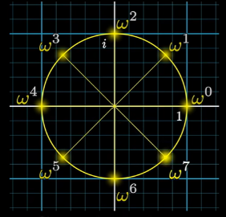
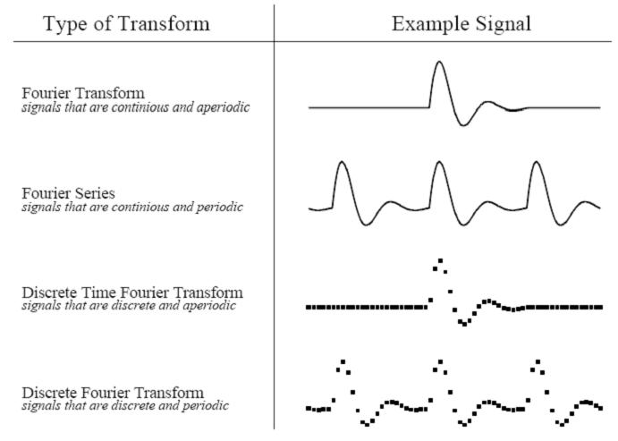
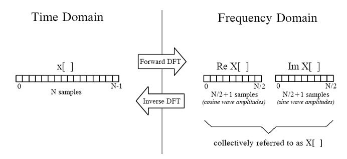

# DFT

## 基本知识

### 正交

[正交](https://zh.wikipedia.org/wiki/%E6%AD%A3%E4%BA%A4)(Orthogonality)是[线性代数](https://zh.wikipedia.org/wiki/线性代数)的概念，是[垂直](https://zh.wikipedia.org/wiki/垂直)这一直观概念的推广。作为一个形容词，只有在一个确定的[内积空间](https://zh.wikipedia.org/wiki/内积空间)中才有意义。若内积空间中两[向量](https://zh.wikipedia.org/wiki/向量)的[内积](https://zh.wikipedia.org/wiki/內積)为0，则称它们是**正交**的。如果能够定义向量间的夹角，则正交可以直观的理解为垂直。

### 单位根

> 快速傅里叶变换的核心就是利用的单位根的一些独特的性质来快速实现的

**单位根的定义**：方程 $z^n=1$ 在复数范围内的 n 个根。

那么，不经过证明的给出，每一个根应该为 $e^{\frac{j2\pi k}{n}}$。

这里我们记 $\omega _n$ 为主 n 次单位根， $\omega _n^{k}=e^{\frac{j2\pi k}{n}}$

举个例子，主 8 次单位根的 8 个值改写为形如 (r,θ) 的极坐标后，位置类似于下图：

### 三个引理

-   消去定理：$\omega_{dn}^{dk}=\omega_n^k$

-   折半引理：$(\omega_n^{k+\frac n2})^2=(\omega _n^k)^2=\omega_{\frac n2}^k$

> 这个引理是快速傅里叶变化的核心

-   求和引理：$\sum_{i=0}^{n-1}(\omega_n^k)^i=0$

### 多项式

一元多项式一般形式：$F(x)=a_0+a_1x+a_2x^2+\cdots+a_nx^n=\sum_{i=0}^na_ix^i$

定义两个多项式如下：
$$
A(x)=\sum_{i=0}^na_ix^i,\\ B(x)=\sum_{i=0}^nb_ix^i
$$

-   加法：$A(x)+B(x)=\sum_{i=0}^n(a_i+b_i)x^i$

-   乘法

> 一般情况下，我们可以通过补零的方式，将两个次数不同的多项式调整到次数相同。这里我们都补充到 n 的长度

$$
c_i=\sum_{j=0}^ia_jb_{i-j},\\  A(x)B(x)=\sum_{i=0}^{2n}c_ix^i
$$

我们称这个系数向量 c 为向量 a,b 的卷积，记作 $a\otimes b$

**表示方法**

- **系数表示**

  它将一个多项式表示成由其**系数构成的向量**的形式，如$A=[a_0,a_1,a_2,\ldots,a_n]^T$

  加法的时间复杂度为 O(n)

  乘法则做**向量卷积**，一般来说，时间复杂度为 $O(n^2)$

- **点值表示**

  用至少 n 个多项式上的点来表示，一般形式如 $\{(x_0,A(x_0)),(x_1,A(x_1),\ldots,(x_n,A(x_n))\}$

  进行运算是，一般要保证两个多项式在**同一位置取值**相同，即 $x_i$ 相同

  加法运算直接将**两点坐标相加**即可，时间复杂度为 $O(n)$

  乘法运算只需要将两点纵坐标相乘即可，时间复杂度为 $O(n)$

  如果我们需要 $A(x)$ ，这个过程叫做**插值**，可以通过拉格朗日插值公式进行计算，复杂度为 $O(n^2)$.

## DFT(角度一)

> 变换操作是对于一个向量而言（也就是多项式的系数表示法），相当于求出这个多项式在 $x$ 为单位根时的取值

定义:
$$
C=[c_0,c_1,c_2,\ldots,c_{n-1}]^T,\\  h(x)=\sum_{i=0}^{n-1}c_ix^i
$$
令$x=\omega$代入后得$[\mathrm{~}h(\omega^0),h(\omega^1),h(\omega^2),\ldots,h(\omega^{n-1})\mathrm{~}]^T$，两个多项式的乘积的可用点值表示，DFT 实际上所做的事情是**插值**

范德蒙德矩阵为
$$
V=\begin{pmatrix}1&1&\cdots&1\\  x_0&x_1&\cdots&x_{n-1}\\  x_0^2&x_1^2&\cdots&x_{n-1}^2\\  \vdots&\vdots&&\vdots\\  x_0^{n-1}&x_1^{n-1}&\cdots&x_{n-1}^{n-1}\end{pmatrix}
$$
于是变换后的矩阵可以用范德蒙德矩阵表示为
$$
\begin{bmatrix}h(\omega^0)\\  h(\omega^1)\\  h(\omega^2)\\ \vdots\\ h(\omega^{n-1})\end{bmatrix}=\begin{bmatrix}1&1&1&1&\cdots&1\\ 1&\omega_n^1&\omega_n^2&w_n^3&\cdots&\omega_n^{n-1}\\ 1&\omega_n^2&\omega_n^{2\times2}&\omega_n^{2\times3}&\cdots&\omega_n^{2\times(n-1)}\\ \vdots&\vdots&\vdots&\vdots&\ddots&\cdots\\ 1&\omega_n^{(n-1)\times2}&\omega_n^{(n-1)\times3}&\omega_n^{(n-1)\times2}&\cdots&\omega_n^{(n-1)\times(n-1)}\end{bmatrix}\begin{bmatrix}c_0\\ c_1\\ c_2\\ \vdots\\ c_{n-1}\end{bmatrix}
$$

## DFT(角度二)

### Real DFT

四种原信号图例如下：

一个长度为N的信号可以分解成N/2+1个正余弦信号：

#### 合成运算方法(Real IDFT)

合成等式：

$$
x[i] = \sum_{k=0}^{N/2} Re\bar{X}[k ] \cos(2\pi ki/N) + \sum_{k=0}^{N/2} Im\bar{X}[k] \sin(2\pi ki/N)
$$
其中$Re\bar{X}\left[k\right] = \frac{ReX\left[k\right]}{N/2},Im\bar{X}\left[k\right] = -\frac{ImX\left[k\right]}{N/2}$，当k=0或N/2时，$Re\bar{X}\left[0\right] = \frac{ReX\left[0\right]}{N},Im\bar{X}\left[0\right] = -\frac{ImX\left[N/2\right]}{N}$，N是时域中点的总数，k是从0到N/2的序号。

#### 分解运算方法（Real DFT）

两种方式进行DFT：

1. 利用信号的相关性（correlation）进行计算

   **信号的相关性**(correlation)可以从噪声背景中检测出已知的信号，利用这个方法检测信号波中是否含有某个频率的信号波，信号波与某个频率波内积不为零，则认为信号中含有这个频率波，反之亦然。

   相应地，可以通过把输入信号和每一种频率的正余弦信号做内积，从而得到原始信号与每种频率的关联程度，这个结果便是我们所要的傅立叶变换结果：
   $$
   ReX[k] = \sum_{k=0}^{N-1} x[i]\cos(2\pi ki/N)
   ,\\ ImX[k]=-\sum_{k=0}^{N-1} x[i]\sin(2\pi ki/N)
   $$
   第二个式子中加了个负号，是为了保持复数形式的一致

   要确保关联性算法是正确的，则必须使得与原始信号相乘的信号的函数形式是正交的。由于所有的正弦或余弦函数是正交的，所以我们可以通过关联的方法把原始信号分离出正余弦信号。

2. FFT
   

### Complex DFT

#### DFT

在实数傅立叶变换中，它的频谱是0 ~ π(0 ~ N/2),但无法表示-π~ 0的频谱，可以预见，如果把正余弦表示成复数形式，则能够把负频率包含进来。

复数形式的DFT正向变换等式:
$$
X[k]=\frac{1}{N}\sum_{n=0}^{N-1}x[n](\cos(2\pi kn/N)-j\sin(2\pi kn/N))
,\\ =\frac{1}{N}\sum_{n=0}^{N-1}x[n]e^{-j2\pi kn/N}
$$
其中，k的取值范围是0 ~ N-1 (也可以表达成0 ~ 2π)，当中的0 ~ N/2（或0 ~ π）是正频部分，N/2 ~ N-1（π~ 2π）是负频部分，由于正余弦函数的对称性，所以我们把 –π~ 0表示成π~ 2π，这是出于计算上方便的考虑。

复数DFT的频谱特征具有周期性：-N/2 ~ 0与N/2 ~ N-1是一样的，实域频谱呈偶对称性（表示余弦波频谱），虚域频谱呈奇对称性（表示正弦波频谱）。

## FFT

对于$f(x)=c_0+c_1x+c_2x^2+\cdots+c_{n-1}x^{n-1}$，分离其奇数项和偶数项，构造出另外两个向量

$$
f_{even}(x)=c_0+c_2x+c_4x^2+\cdots+c_{n-2}x^{\frac n2-1},\\ f_{odd}(x)=c_1+c_3x+c_5x^2+\cdots+c_{n-1}x^{\frac n2-1}
$$
不难发现：$f(x)=f_{even}(x^2)+xf_{odd}(x^2)$

所以$x=\omega$代入得
$$
f(\omega_n^k)=f_{even}(\omega_{\frac n2}^k)+\omega_n^kf_{odd}(\omega_{\frac n2}^k),\\ f(\omega_n^{k+\frac n2})=f_{even}(\omega_{\frac n2}^k)-\omega_n^kf_{odd}(\omega_{\frac n2}^k)
$$
于是，可以递归分治，其时间为 $T(n)=2T(n/2)+O(n)$，故复杂度为 $T(n)=O(nlogn)$。还要考虑一点，要保证长度为 $2^k$ 才能保证可以正确的分治

> 只有长度相等的区间才能合并（考虑此时单位根才一样）

所以说，我们要把两个多项式**通过补 0 的方式**补齐到 $2^k$项，合并之后就是 $2^k+1$ 项。

