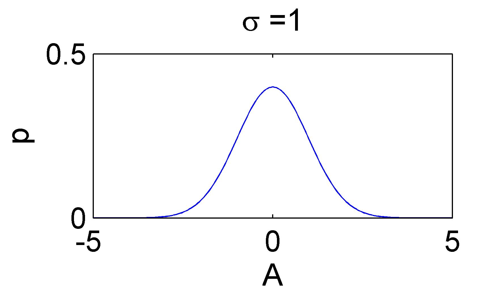
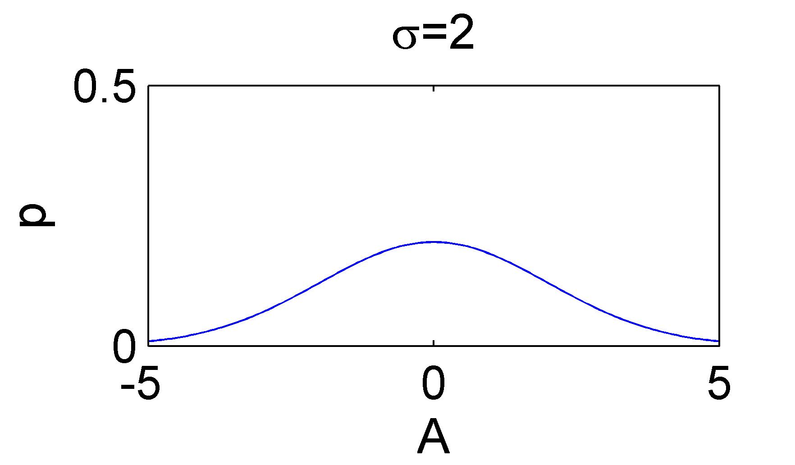

# Cramer-Rao Lower Bound

## 参数估计

什么是参数估计问题？

设未知参数$\theta$，估计器模型的估计量为 $\hat{\theta}$ 如，衡量一个估计器（estimator, 也称估计量或估计算法）的性能，主要考量以下三个方面：

1. 无偏性（unbiased）。满足$\mathbb{E}[\hat{\theta}] = \mathbb{E}[\theta]$的估计量为无偏估计量。
2. 有效性（availability）。刻画估计量到真实值的偏离程度，$D(\hat{\theta}) = \mathbb{E}[(\hat{\theta} - \mathbb{E[\hat{\theta}]})^2]$。
   若存在多种无偏估计器，我们称 估计量方差最小 的估计器是最有效的。
3. 一致性（consistency）。当样本数$N \rightarrow \infty$时，对于任意的$\epsilon > 0$，有$\lim_{N \rightarrow \infty} P\{|\hat{\theta} - \theta|\} < \epsilon$= 1$，我们称 $\hat{\theta}$ 与 $\theta$ 是一致的。
   一致性所体现的是，当样本总数逐渐增加时，估计量逐渐收敛于真实值。

上述三点考量，我们来看第二点：如何衡量一个无偏估计器是否是有效的？

——统计信号处理理论中的 克拉美-罗下界（[Cramer-Rao Lower Bound](https://en.wikipedia.org/wiki/Cram%C3%A9r%E2%80%93Rao_bound)，CRLB） 就是衡量一个无偏估计器的有力工具。

举一种最简单的情况：

一个物理量为$A$，我们使用某种方式去观测它，观测值为$x$，由于存在噪声，此时 $x=A+w$ ，$w$ 为高斯噪声$w \sim N(0, \sigma^2)$。由于我们很自然地会直接使用观测值$x$去估计$A$，所以这时候就会存在估计误差。直观地理解，噪声$w$的方差$\sigma^2$越大，估计就可能越不准确。

## 为什么要讨论克拉美-罗界？

上面例子的方式，使用 $A^ = x \hat{A}=x$ 去估计 $A$，

按第1个标准，它是无偏的，估计值会在真实值附近波动；

按第2个标准，这个估计值波动的剧烈程度，也就是方差。在这个例子里，克拉美-罗界就等于方差。

**为什么不直接讨论方差而要去计算克拉美-罗界呢？**

因为方差是针对某一种特定的估计量（或理解为估计方式）而言的，上面的例子中方差是估计量 $\hat{A}=x$ 的方差，在更复杂的问题里，对 $A$ 可以有各种不同的估计量，他们分别的方差是不同的，显然，对于无偏估计量而言，方差越小的估计方式性能越好，但是这些方差都有一个下界，就是克拉美-罗界。

**直观地理解克拉美-罗界**

克拉美-罗界本身不关心具体的估计方式，只是去反映：利用已有信息所能估计参数的最好效果。

还是上面那个参数估计的例子：

我们用 $\hat{A}=x$估计真实值 $A$，$x=A+w$，高斯噪声 $w \sim N(0, \sigma^2)$，所以也可以认为 $A = x+w$ ，也就是说：

当我们观察到$x$的时候，可以知道真实值$A$的概率密度分布（pdf）是以 $x$为均值，$\sigma^2$为方差的正态分布，即 $A \sim N(x, \sigma^2)$，
$$
p(x;A) = \frac{1}{\sqrt{2\pi}\sigma} e^{-\frac{(x-A)^2}{2\sigma^2}}
$$

下面两幅图给出两个似然函数的例子：

>似然函数$L(\theta;X)$;在观测到样本$X$的情况下，参数是$\theta$的可能性。

在这里，似然函数表示：在我观测到 $X=x=0$ 的情况下，我要估计的参数$A=x=0$ 的可能性是多少？

似然函数的值 = 已知真实的参数 $A=0$ 的情况下，观测到 $x=0$ 的概率（即概率密度函数）

直观地看，似然函数的“尖锐”性决定了估计参数的精度。

这个“尖锐”性可以用 对数似然函数峰值处的 负的 二阶导数 来度量，即对数似然函数的曲率。（用对数是为了便于计算。）曲率越大，越“尖锐”。

这里算出来的结果为 $\sigma^2$，是噪声的方差的倒数。也就是说噪声越小，曲率越大，对数似然函数越尖锐。

似然函数：$L(A;X) = p(X|A) = \frac{1}{\sqrt{2\pi}\sigma} e^{-\frac{(X - A)^2}{2\sigma^2}}$

取对数：$\ln L(A;X) = \ln \left( \frac{1}{\sqrt{2\pi}\sigma} \right) - \frac{(X - A)^2}{2\sigma^2}$

对参数 $A $ 求一阶导：$\frac{\partial \ln L(A;X)}{\partial A} = \frac{-2(X - A)}{2\sigma^2} = \frac{X - A}{\sigma^2}$

对参数 $A$ 求二阶导：$\frac{\partial^2 \ln L(A;X)}{\partial A^2}=-\frac{1}{\sigma^2}$

再取负号得：$\frac{1}{\sigma^2}$

## 不同的估计量（估计方式）的含义

举一个稍微复杂一点点的参数估计问题：

一个物理量为 $A$ ，我们使用某种方式去观测它，第一次观测值为 $x_1$ ，第二次观测值为 $x_2$ ，这是两个不同时刻的观测结果，一样的高斯噪声 $w \sim N(0, \sigma^2)$。

这时候不同的人不同的考虑方式可能产生不同的估计方式，例如：

- 甲：采用估计量 $\hat{A} = 0.5x_1 + 0.5x_2$，即两次观测的平均；
- 乙：可能觉得甲的计算量有点大了，直接采取估计量 $\hat{A} = x_1$;
- 丙：可能认为第二次观测值可能会受到系统影响而不准确，他更相信前面的观测值，于是采取估计量 $\hat{A} = 0.8x_1 + 0.2x_2$

上述三个估计量都是无偏的，来看下他们各自的方差：

- 甲估计量的方差：$\sigma^2 + (0.5)^2$
- 乙估计量的方差：$\sigma^2$
- 丙估计量的方差：$\sigma^2 + (0.8)^2 + (0.2)^2$

可以发现，甲估计量的方差最小，他的估计效果较好。

但是！如果第二个观测值真的不太准确，也就是后一个高斯噪声比较大，那有可能就是丙估计量更加合适了！

所以，对同一个待估计值，不同估计方式产生的方差是不一样的.

但是数学家们已经证明了：任何无偏估计量的方差必定大于等于克拉美-罗界。

## 克拉美-罗界的基本计算
假设两次观察相互独立，仅受相同的高斯白噪声影响，则真实参数A AA的似然函数应该为两个正态的概率密度分布相乘：
$$
L(A;X) = \prod_{i=1}^N \frac{1}{\sqrt{2\pi}\sigma} e^{-\frac{(x_i-A)^2}{2\sigma^2}}
$$

计算出来的对数似然函数的曲率为$\sigma^2$

两次观测：$X = [x_1, x_2]$

似然函数：

$$
\begin{align*}
L(A;X) &= P(X=x_1|A) \cdot P(X=x_2|A)
\\ &= \frac{1}{\sqrt{2\pi}} e^{-\frac{(x_1-A)^2}{2\sigma^2}} \cdot \frac{1}{\sqrt{2\pi}} e^{-\frac{(x_2-A)^2}{2\sigma^2}}
\\ &= \frac{1}{2\pi\sigma^2} e^{-\frac{(x_1-A)^2 + (x_2-A)^2}{2\sigma^2}}
\end{align*}
$$

取对数：$\ln L(A;X) = \ln\frac{1}{2\pi\sigma^2} - \frac{(x_1-A)^2 + (x_2-A)^2}{2\sigma^2}$

一阶导：$\frac{\partial \ln L(A;X)}{\partial A} = \frac{(x_1-A) + (x_2-A)}{\sigma^2}$

二阶导：$\frac{\partial^2 \ln L(A;X)}{\partial A^2} = \frac{-2}{\sigma^2}$

取负号：$\frac{2}{\sigma^2}$

实际上，当观测样本数为$N$时，这个值为 $N/\sigma^2$ —— 观测样本数越多，获取的信息越多，曲率越大，对数似然函数越"尖锐"。

这个二阶导数（曲率）更一般的度量是（下面用 $\theta$ 来表示要估计的参数）：
$$
-\mathbb{E}[\frac{\partial^2 \ln p(x;\theta)}{\partial \theta^2}]
$$
——它度量了对数似然函数的平均曲率（很多情况下曲率与$x$有关，所以取数学期望使它仅为$\theta$的函数），，

——被称为数据 $x$ 的 Fisher信息 $I(\theta)$，，——具有信息测度的基本性质（非负性、独立观测的可加性）

一般来说，Fisher 信息的倒数就是⭐克拉美-罗界了！任何无偏估计量 $\hat{\theta}$ 的方差满足：
$$
var(\hat{\theta}) \geq \frac{1}{- \mathbb{E}[\frac{\partial^2 \ln p(x;\theta)}{\partial \theta^2}]}
$$

我的理解是：

- Fisher信息值是所有无偏估计方案中方差最小的一个（最有效的一个），是所有无偏估计量的方差的下界，，
- 任何一个无偏估计量的方差都不会比它小，，也就是不会比它更好，离它越近表示估计越好，越有效
- 另外，🍎信息越多，Fisher信息值越大，这个下界越低，表示估计越有效！

## 克拉美-罗界 正式定义

> 克拉美-罗界的标准定义
> 【定理】Cramer-Rao 下界——Scale Parameter（标量参数）
> 
> 对于估计的参数$\theta$ 为标量时， 假定PDF $p(x;\theta)$ 满足“正则”条件（对所有的 $\theta$）：
> $$
> \mathbb{E}[\frac{\partial \ln p(x;\theta)}{\partial \theta}] = 0
> $$
> 
> 其中数学期望是对 $p(x;\theta)$ 求取的。
> 
> 那么，任何无偏估计量 $\hat{\theta}$ 的方差必定满足：
> $$
> var(\hat{\theta}) \geq \frac{1}{- \mathbb{E}[\frac{\partial^2 \ln p(x;\theta)}{\partial \theta^2}]}
> $$
> 
> 其中导数是在 $\theta$ 的真值处计算的，数学期望是对 p ( x ; θ ) p(x;\theta)p(x;θ) 求取的。
> 
> 而且，对于某个函数 $g$ 和 $I$，当且仅当 $\frac{\partial \ln p(x;\theta)}{\partial \theta} = I(\theta)(g(x)-\theta)$ 时，对所有 $\theta$ 达到下限的无偏估计量就可以求得。这个估计量是 $\hat{\theta} = g(x)$，它是MVU估计量（最小方差无偏估计），最小方差是 $1/I(\theta)$。

小结
估计一个参数，根据已有信息得到了似然函数（或者pdf），这个pdf的“尖锐”性，或者，符合似然函数分布的这组数据的方差，就是克拉美罗界，它可以通过对对数似然函数求二阶导再取负号再取倒数得到。

克拉美罗界的计算不依赖具体的估计方式，它可以用来作为一个衡量估计方式好坏的标准——估计量的方差越靠近克拉美罗界，效果越好。

在参数估计和统计中，Cramer-Rao界限（Cramer-Rao bound, CRB）或者Cramer-Rao下界（CRLB），表示一个确定性参数的估计的方差下界。

它的最简单形式是：**任何无偏估计的方差至少大于Fisher信息的倒数**。

一个达到了下界的无偏估计被称为 完全高效的（fully efficient）。这样的估计达到了所有无偏估计中的最小均方误差（MSE，mean square error），因此是最小方差无偏（MVU，minimum variance unbiased）估计。