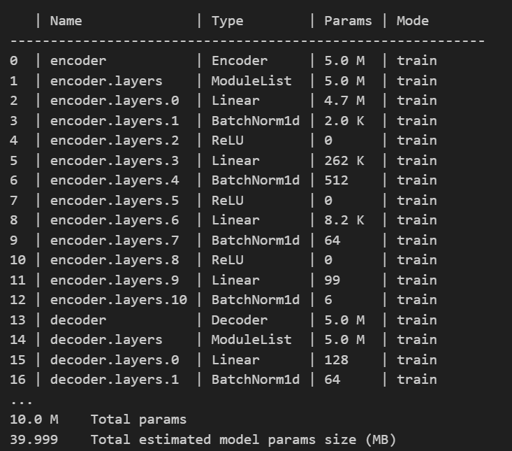
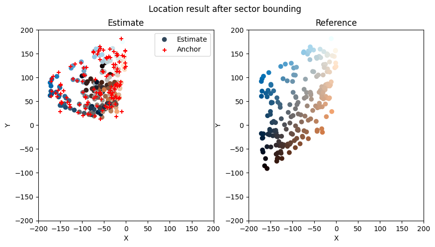

# 华为杯笔记

## CNN

**参数初始化**

1. 使用wandblogger来分析（初始化，配置）

2. 预处理数据集

   将数据保存为.joblib存到磁盘

   使用tqdm库来显示进度条

3. 训练cnn神经网络

   trainer.fit方法来训练模型

4. 模型评估

   model.eval()
   锚点+参考点与预测点比较

5. 将扇区外面的点拽回边界
6. 输出预测点的坐标
7. 计算MSE
8. 关闭wandb分析

### CNN架构

模型由 `CNN` 类和 `LitCNN` 类组成。以下是详细的模型架构解释：

#### 1. `CNN` 类

`CNN` 类是基础的卷积神经网络模型，包含卷积层、批量归一化层（Batch Normalization）、激活函数层（ReLU）、全连接层（Fully Connected Layers）和可选的残差块（ResNetBlock2D）。

**构造函数** (`__init__` 方法)

```python
def __init__(self, fc_dims: list, norms: list = [], dropout: float = 0):
    super(CNN, self).__init__()
    # input shape: (4, 64, 408)
    self.conv_layers = nn.Sequential(
        nn.Conv2d(in_channels=4, out_channels=128, kernel_size=[8, 8], stride=[8, 8]), # output shape: (128, 8, 51)
        nn.BatchNorm2d(128),
        nn.ReLU(),
        ResNetBlock2D(128, 128),
        nn.Conv2d(in_channels=128, out_channels=256, kernel_size=[4, 4], stride=4), # output shape: (256, 2, 12)
        nn.BatchNorm2d(256),
        nn.ReLU(),
        nn.Flatten(),
    )
    fc_dims = [256 * 2 * 12] + fc_dims
    self.fc_layers = nn.ModuleList()
    for i in range(len(fc_dims) - 2):
        self.fc_layers.append(nn.Linear(fc_dims[i], fc_dims[i+1]))
        if dropout > 0:
            self.fc_layers.append(nn.Dropout(p=dropout))
        self.fc_layers.append(nn.ReLU())
    self.fc_layers.append(nn.Linear(fc_dims[-2], fc_dims[-1]))
```

- **输入形状**: `(4, 64, 408)`，表示输入数据有 4 个通道，每个通道的大小为 64x408。
- **卷积层 (`conv_layers`)**:
  - 第一个卷积层：`nn.Conv2d(in_channels=4, out_channels=128, kernel_size=[8, 8], stride=[8, 8])`，输出形状为 `(128, 8, 51)`。
  - 批量归一化层：`nn.BatchNorm2d(128)`。
  - 激活函数层：`nn.ReLU()`。
  - 残差块：`ResNetBlock2D(128, 128)`。
  - 第二个卷积层：`nn.Conv2d(in_channels=128, out_channels=256, kernel_size=[4, 4], stride=4)`，输出形状为 `(256, 2, 12)`。
  - 批量归一化层：`nn.BatchNorm2d(256)`。
  - 激活函数层：`nn.ReLU()`。
  - 展平层：`nn.Flatten()`，将多维张量展平为一维向量。
- **全连接层 (`fc_layers`)**:
  - `fc_dims` 列表包含了全连接层的维度，例如 `[1024, 256, 128, 64, 2]`。
  - 初始维度由卷积层的输出形状决定，即 `256 * 2 * 12 = 6144`。
  - 根据 `fc_dims` 列表，构建了一系列全连接层，中间可以包含 `Dropout` 和 `ReLU` 层以减少过拟合和引入非线性。

**前向传播** (`forward` 方法)

```python
def forward(self, x: torch.Tensor) -> torch.Tensor:
    x = self.conv_layers(x)
    for layer in self.fc_layers:
        x = layer(x)
    return x
```

- 首先通过卷积层 `conv_layers` 处理输入 `x`。
- 然后依次通过全连接层 `fc_layers` 进行处理。
- 最终返回网络的输出。

#### 2. `LitCNN` 类

`LitCNN` 类继承自 `lightning` 库的 `L.LightningModule`，用于将 `CNN` 模型集成到 `lightning` 的训练框架中。

**构造函数** (`__init__` 方法)

```python
def __init__(self, lr: float = 1e-3, **kwargs):
    super(LitCNN, self).__init__()
    self.model = CNN(**kwargs)
    self.lr = lr
```

- **`lr`**: 学习率，默认为 `1e-3`。
- **`\**kwargs`**: 传递给 `CNN` 类的其他参数，如 `fc_dims`、`norms` 和 `dropout`。
- **`self.model`**: 创建一个 `CNN` 模型实例。

**前向传播** (`forward` 方法)

```python
def forward(self, x: torch.Tensor) -> torch.Tensor:
    return self.model(x)
```

- 简单地调用 `CNN` 模型的前向传播方法。

**训练步骤** (`training_step` 方法)

```python
def training_step(self, batch, batch_idx):
    x, y = batch

    # Add noise to the input
    x += torch.randn_like(x) * 0.1

    # Add TA
    x = add_ta(x, torch.randint(-2, 2, (x.shape[0],)))
    
    y_hat = self(x)
    loss = F.mse_loss(y_hat, y)
    self.log('train_loss', loss)
    return loss
```

- **输入和目标**: `batch` 包含输入数据 `x` 和目标数据 `y`。
- **添加噪声**: `x += torch.randn_like(x) * 0.1`，在输入数据中添加少量噪声。
- **添加 TA**: `x = add_ta(x, torch.randint(-2, 2, (x.shape[0],)))`，调用 `add_ta` 函数对输入数据进行处理，添加某种形式的变换或增强。
- **前向传播**: `y_hat = self(x)`，通过 `CNN` 模型进行前向传播，得到预测结果 `y_hat`。
- **计算损失**: `loss = F.mse_loss(y_hat, y)`，使用均方误差（MSE）作为损失函数，计算预测结果与目标数据之间的损失。
- **日志记录**: `self.log('train_loss', loss)`，记录训练损失。
- **返回损失**: `return loss`，返回损失值供 `lightning` 的训练循环使用。

**配置优化器** (`configure_optimizers` 方法)

```python
def configure_optimizers(self):
    return torch.optim.Adam(self.parameters(), lr=self.lr)
```

- **Adam 优化器**: 使用 Adam 优化器进行参数更新，学习率为 `self.lr`。

**效果好**

## cov_ae_ls

1. 使用auto encode（非监督）来降维：
   

2. 使用LS来修正坐标点

**效果不佳**

## cov_ae_mlp

采用MLP来修正坐标点

**效果不佳**

## cov_pca_ls

1. PCA降维
2. 使用LS来修正坐标点

**效果不佳**

## cov_tsne_ls

[T-SNE](https://medium.com/@sachinsoni600517/mastering-t-sne-t-distributed-stochastic-neighbor-embedding-0e365ee898ea)降维

效果不佳

## DNN



不知道出了什么问题

预训练:

1. 加噪处理

   添加随机时延噪声和多径噪声

2. 图像化处理

   以图像形式模拟CSI，转换绝对坐标为距离与角度，统一输出空间

3. 2D-FFT处理

   对CSI图像进行2D-FFT处理，增强子载波与天线间的特征差异。

半监督迭代训练阶段:

1. 模型微调

   线性插值生成数据，微调预训练模型

2. 深度集成学习

   度量预测差异，选取差异小的点，平均后作为高置信度伪标签

3. 扇区微调

   使用伪标签在各扇区微调模型并获得预测

4. 迭代优化

   迭代替换低分结果，逐步提升模型精度
