# JVM

## 知识点汇总


## 什么是Java虚拟机？为什么Java被称作是“平台无关的编程语言”？
Java虚拟机是一个可以执行Java字节码的虚拟机进程。Java源文件被编译成能被Java虚拟机执行的字节码文件。Java被设计成允许应用程序可以运行在任意一个安装了Java虚拟机的平台上，而不需要程序员为每一个平台单独重写或者是重新编译,Java虚拟机知道底层硬件平台的指令长度和其他特性。


## JMM(Java Memory Model)
> 为什么要有内存模型？
> 在传统计算机硬件内存架构中由于 CPU 和主内存间存在数量级的速率差，于是就引入了多级高速缓存来解决这个问题,但是多级缓存的引入又带来了缓存一致性的问题,为了解决缓存一致性问题,就抽象出了 JMM.

JMM 同步规定：
- 线程解锁前，必须把共享变量的值刷新回主内存
- 线程加锁前，必须读取主内存的最新值到自己的工作内存
- 加锁解锁是同一把锁

由于 JVM 运行程序的实体是**线程**，而每个线程创建时 JVM 都会为其创建一个**工作内存**(每个线程的私有数据区域)，而 Java 内存模型中规定所有变量都存储在主内存，主内存是**共享内存区域**，所有线程都可访问，但线程对变量的操作必须在工作内存中进行。

首先要将变量从主内存拷贝到自己的工作空间，然后对变量进行操作，操作完成再将变量写回主内存，不能直接操作主内存中的变量，不同的线程无法访问对方的工作内存，线程之间的通讯必须通过主内存来完成，其简要访问过程如下图:

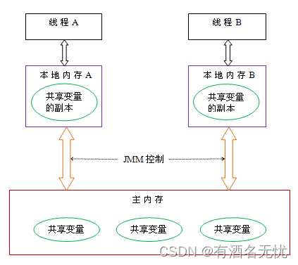

为了更精准控制工作内存和主内存间的交互，JMM 还定义了八种操作：

```text
lock（锁定）：作用于主内存的变量，把一个变量标识为一条线程独占的状态。
unclock（解锁）：作用于主内存的变量，把一个处于锁定的状态释放出来。
read（读取）：作用于主内存的变量，把一个变量的值从主内存传输到线程的工作内存中
load（载入）：作用于工作内存的变量，把read操作从主内存得到的变量值放入工作内存的变量副本中。
use（使用）：作用于工作内存的变量，把工作内存中一个变量的值传递给执行引擎
assign（赋值）：作用于工作内存的变量，把一个从执行引擎接收到的值赋值给工作内存的变量
store（存储）：作用于工作内存的变量，把工作内存中的一个变量的值传递到主内存，以便write操作使用。
write（写入）：作用于主内存的变量，把store操作从工作内存中得到的变量的值放入主内存的变量中。
```

JMM 是定义程序中变量的访问规则,线程对于变量的操作只能在自己的工作内存中进行,而不能直接对主内存操作。由于**指令重排**,读写的顺序会被打乱,因此 JMM 需要保证原子性,可见性,有序性。主内存可以认为就是物理内存，而工作内存就是CPU缓存
    ```mermaid
    flowchart LR
    2["`基本数据类型读写,除long、double`"]
    3["`synchronized`"]
    4["`volatile`"]
    5["`happens-before`"]
    6(("`原子性`"))
    7(("`可见性`"))
    8(("`有序性`"))
    2-->6
    3-->6
    3-->7
    4-->7
    4-->8
    5-->8
    ```

**原子性**：Java内存模型通过**上述8种操作**(基本数据类型读写)来保证原子性操作，其中 lock 和 unlock 对应着 synchronized 关键字
**可见性**：当一个线程修改了某个变量的值,其他线程立即可以看到这个修改,这就是内存的可见性。通过volatile、synchronized、final来保证可见性。
**有序性**：由于处理器和编译器的重排序导致的有序性问题，通过volatile和happens-before来保证。

happens-before 原则：
1. 程序次序规则：一个线程内，按照代码顺序运行
2. 锁定规则：一个unLock操作先行发生于后面对同一个锁lock操作
3. volatile 变量规则：对一个volatile变量的写操作先行发生于后面对这个变量的读操作
4. 传递规则：如果操作A先行发生于操作B，而操作B又先行发生于操作C，则可以得出操作A先行发生于操作C
5. 线程启动规则：Thread对象的start()方法先行发生于此线程的每个一个动作
6. 线程中断规则：对线程interrupt()方法的调用先行发生于被中断线程的代码检测到中断事件的发生
7. 线程终结规则：线程中所有的操作都先行发生于线程的终止检测，我们可以通过Thread.join()方法结束、Thread.isAlive()的返回值手段检测到线程已经终止执行
8. 对象终结规则：一个对象的初始化完成先行发生于他的finalize()方法的开始

### 线程私有区和线程共享区
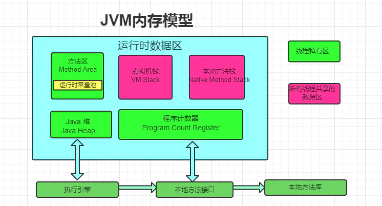

- 线程独占:栈、本地方法栈、程序计数器 
- 线程共享:堆、方法区

1. 栈：又称方法栈,线程私有的,线程在执行 Java 方法时都会创建一个栈帧,用来存储局部变量表,操作栈,动态链接,方法出口等信息,调用方法时执行入栈,方法返回时执行出栈
2. 本地方法栈:与栈类似,也是用来保存执行方法的信息,执行Java方法是使用栈,执行Native方法时使用本地方法栈
3. 程序计数器:保存着当前线程执行的字节码位置,每个线程工作时都有独立的计数器,只为执行Java方法服务,执行Native方法时,程序计数器为空
4. 堆:JVM内存管理最大的一块,对被线程共享,目的是存放对象的实例,几乎所有的对象实例都会放在这里,当堆没有可用空间时,会抛出OOM异常。根据对象的存活周期不同,JVM把对象进行分代管理,然后由垃圾回收器进行垃圾的回收管理
5. 方法区：又称非堆区,用于存储已被虚拟机加载的类信息、常量、静态变量、即时编译器优化后的代码等数据。1.7的永久代和1.8的元空间都是方法区的一种实现

### 栈和堆的区别
栈是运行时单位，代表着逻辑，内含基本数据类型和堆中对象引用，所在区域连续，没有碎片；堆是存储单位，代表着数据，可被多个栈共享（包括成员中基本数据类型、引用和引用对象），所在区域不连续，会有碎片。
- 异常错误不同:栈空间不足：java.lang.StackOverFlowError;堆空间不足：java.lang.OutOfMemoryError
- 空间大小:栈的空间大小远远小于堆的

### 说说对象分配规则
- 对象优先分配在Eden区，如果Eden区没有足够的空间时，虚拟机执行一次Minor GC
- 大对象直接进入老年代（大对象是指需要大量连续内存空间的对象）。这样做的目的是避免在Eden区和两个Survivor区之间发生大量的内存拷贝（新生代采用复制算法收集内存）。
- 长期存活的对象进入老年代。虚拟机为每个对象定义了一个年龄计数器，如果对象经过了1次Minor GC那么对象会进入Survivor区，之后每经过一次Minor GC那么对象的年龄加1，直到达到阀值对象进入老年区。
- 动态判断对象的年龄。如果Survivor区中相同年龄的所有对象大小的总和大于Survivor空间的一半，年龄大于或等于该年龄的对象可以直接进入老年代。

### ## 说一下JVM 的主要组成部分及其作用？ 
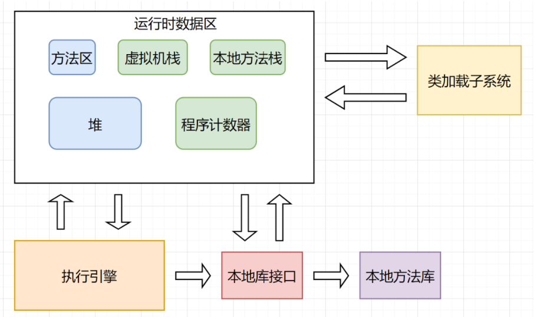

JVM包含两个子系统和两个组件，分别为 
- Class loader(类装载子系统) :根据给定的全限定名类名(如：java.lang.Object)来装载class文件到运行时数据区的方法区中。 
- Execution engine(执行引擎子系统):执行class的指令
- Runtime data area(运行时数据区组件) :JMM
- Native Interface(本地接口组件)。:与native lib交互，是其它编程语言交互的接口

首先通过编译器把 Java 源代码转换成**字节码**，Class loader(类装载)再把字节码**加载到内存**中，将其放在运行时数据区的方法区内，而字节码文件只是 JVM 的一套指令集规范，并不能直接交给底层操作系统去执行，因此需要特定的命令解析器执行引擎（Execution Engine），**将字节码翻译成底层系统指令**，再交由 CPU 去执行，而这个过程中需要**调用其他语言的本地库接口**（Native Interface）来实现整个程序的功能。 


## 类加载与卸载
类加载过程:
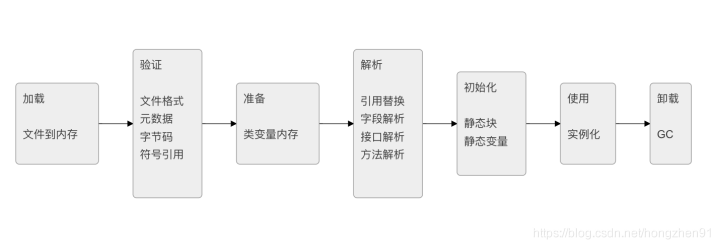

其中验证,准备,解析合称链接

- 加载:通过类的**完全限定名**查找此类字节码文件,再创建该字节码文件对应的Class对象
- 验证:确保Class文件符合当前虚拟机的要求
- 准备:进行内存分配,为static修饰的类变量分配内存(不包含final修饰的静态变量,因为final变量在编译时分配),并设置初始值
- 解析:将常量池中的符号引用替换为直接引用的过程,直接引用为直接指向目标的指针或者相对偏移量等.
- 初始化:主要完成静态块执行以及静态变量的赋值;当类被主动使用时时,先初始化父类,再初始化当前类(触发条件包括创建类的实例;访问类的静态方法或静态变量;使用Class.forName反射类;子类初始化)
- 卸载:Java自带的加载器加载的类,在虚拟机的生命周期中是不会被卸载的,**只有**用户自定义的加载器加载的类才可以被卸载

### 什么是类加载器？   
类加载器是一个用来加载类文件的类。Java 源代码通过 javac 编译器编译成类 文件。然后 JVM 来执行类文件中的字节码来执行程序。类加载器负责加载文件系统、网络或其他来源的类文件。 

### 加载机制-双亲委派模型
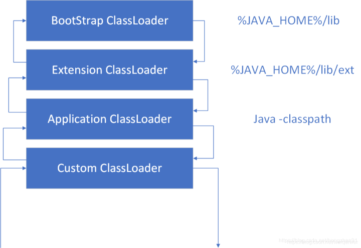

双亲委派模式:即加载器加载类时先把请求委托给自己的父类加载器执行,直到顶层的启动类加载器,父类加载器能够完成加载则成功返回,不能则子类加载器自己尝试加载

优点：
1. 避免类的重复加载
2. 避免Java的核心API被篡改

### 描述一下JVM加载class文件的原理机制？
JVM中类的装载是由类加载器（ClassLoader）和它的子类来实现的，Java中的类加载器是一个重要的Java运行时系统组件，它负责在**运行时查找和装入**类文件中的类。由于Java的跨平台性，经过编译的Java源程序并不是一个可执行程序，而是一个或多个类文件。当Java程序需要使用某个类时，JVM会确保这个类已经被加载、连接（验证、准备和解析）和初始化。类的加载是指把类的.class文件中的数据读入到内存中，通常是创建一个字节数组读入.class文件，然后产生与所加载类对应的
Class对象。加载完成后，此时Class对象还不完整;进入连接阶段，这一阶段包括验证、准备（为静态变量分配内存并设置默认的初始值）和解析（将符号引用替换为直接引用）。最后JVM对类进行初始化，包括：如果类存在直接的父类且还没有被初始化，就先初始化父类；如果类中存在初始化语句，就依次执行这些初始化语句。类的加载是由类加载器完成的，类加载器包括：根加载器（BootStrap）、扩展加载器（Extension）、系统加载器（System）和用户自定义类加载器（java.lang.ClassLoader的子类）。从Java 2（JDK 1.2）开始，类加载过程采取了双亲委派机制（PDM）。PDM更好的保证了Java平台的安全性，在该机制中，JVM自带的Bootstrap是根加载器，其他的加载器都有且仅有一个父类加载器。类的加载首先请求父类加载器加载，父类加载器无能为力时才由其子类加载器自行加载。JVM**不会**向Java程序提供对Bootstrap的引用。下面是关于几个类加载器的说明：
- Bootstrap：一般用本地代码实现，负责加载JVM基础核心类库（rt.jar）；
- Extension：从java.ext.dirs系统属性所指定的目录中加载类库，它的父加载器是Bootstrap；
- System：又叫应用类加载器，其父类是Extension。它是应用最广泛的类加载器。它从环境变量classpath或者系统属性java.class.path所指定的目录中记载类，是用户自定义加载器的默认父加载器。

### 说说Java对象创建过程
1. JVM遇到一条新建对象的指令时首先去检查这个指令的参数是否能在常量池中定义到一个类的符号引用。然后加载这个类
2. 为对象分配内存。一种办法“指针碰撞”、一种办法“空闲列表”，最终常用的办法“本地线程缓冲分配(TLAB)”
3. 将除对象头外的对象内存空间初始化为0
4. 对对象头进行必要设置

### 什么是指针碰撞？ 
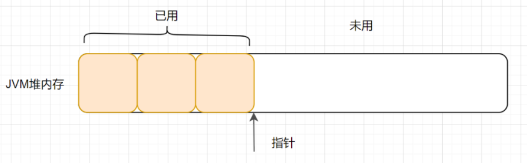

一般情况下，JVM的对象都放在堆内存中（发生逃逸分析除外）。当类加载检查通过后，Java虚拟机开始为新生对象分配内存。如果Java堆中内存是绝对规整的，即所有被使用过的的内存都被放到一边，空闲的内存放到另外一边，中间放着一个指针作为分界点的指示器。分配内存仅仅是把那个指针向空闲空间方向挪动一段与对象大小相等的实例，这种分配方式就是指针碰撞。 

### 什么是空闲列表？   

如果Java堆内存中的内存并不是规整的，已被使用的内存和空闲的内存相互交错在一起，不可以进行指针碰撞，此时,虚拟机必须维护一个列表，记录哪些内存是可用的，在分配的时候从列表找到一块大的空间分配给对象实例，并更新列表上的记录，这种分配方式就是空闲列表。 

### 什么是TLAB？   

可以把内存分配的动作按照线程划分在不同的空间之中进行，每个线程在Java堆中预先分配一小块内存,这就是TLAB（Thread Local Allocation Buffer，本地线程分配缓存）。虚拟机通过-XX:UseTLAB 设定它。 

### 知道类的生命周期吗？ 
类的生命周期包括加载、连接、初始化、使用和卸载，其中前三部是类的加载的过程

加载，查找并加载类的二进制数据，在Java堆中也创建一个java.lang.Class类的对象 连接，连接又包含三块内容：验证、准备、初始化。验证，文件格式、元数据、字节码、符号引用验证；准备，为类的静态变量分配内存，并将其初始化为默认值；解析，把类中的符号引用转换为直接引用初始化，为类的静态变量赋予正确的初始值;使用;卸载，执行垃圾回收 

### 简述Java的对象结构
Java对象由三个部分组成：对象头、实例数据、对齐填充。对象头由两部分组成，第一部分为对象自身运行时所需的数据，也被称为Mark Word：hashcode、GC分代年龄、锁标识状态、线程持有的锁、偏向线程ID（一般占32/64 bit）。第二部分是指针类型，指向对象的类元数据类型 （即对象是属于哪个类的实例）。如果是数组对象，则对象头中还有一部分用来记录数组长度。实例数据用来存储对象真正的有效信息（包括父类继承下来的和自己定义的）;对齐填充：JVM 要求对象起始地址必须是8字节的整数倍（8字节对齐）

### 什么是 tomcat 类加载机制？ 
在 tomcat 中类的加载稍有不同，如下图： 
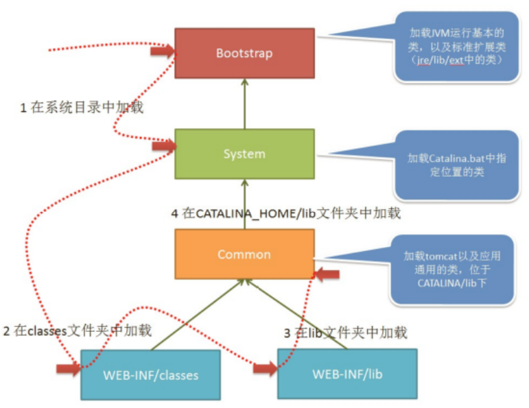

当 tomcat 启动时，会创建几种类加载器： Bootstrap 引导类加载器加载 JVM启动所需的类，以及 标准扩展类（位于`jre/lib/ext`下） System 系统类加载器加载 tomcat 启动的类，比如 bootstrap.jar，通常在 catalina.bat 或者 catalina.sh 中指定。位于CATALINA_HOME/bin


## 垃圾回收

### 分代回收
分代回收基于两个事实:
1. 大部分对象很快就不使用了
2. 还有一部分不会立即无用,但也不会持续很长时间

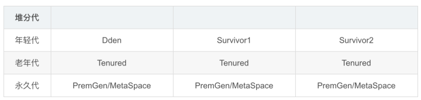

### 什么时候会触发FullGC
1. 老年代空间不足:只有在新生代对象转入和创建大对象、大数组时才会出现不足的现象。当执行Full GC后空间仍然不足，则抛出如下错误： java.lang.OutOfMemoryError: Java heap space,为避免出错,调优时应尽量做到让对象在Minor GC阶段被回收、让对象在新生代多存活一段时间及不要创建过大的对象及数组。
2. Permanet Generation空间满:PermanetGeneration中存放一些class的信息等，当系统中要加载的类、反射的类和调用的方法较多时，Permanet Generation可能会被占满，在未配置为采用CMS GC的情况下会执行Full GC。如果经过Full GC仍然回收不了，会抛出如下错误信息：java.lang.OutOfMemoryError: PermGen space,为避免出错，可增大Perm Gen空间或转为使用CMS GC。
3. CMS GC时出现promotion failed和concurrent mode failure:对于采用CMS进行老年代GC的程序，promotionfailed是在进行Minor GC时，survivor space放不下,而此时老年代也放不下造成的；concurrent mode failure是在执行 CMS GC的过程中同时有对象要放入老年代，而此时空间不足造成的.应对措施为：增大 survivor space、老年代空间或调低触发并发GC的比率
4. 在进行Minor GC时,统计得到的Minor GC晋升到老年代的平均大小大于老年代的剩余空间

### Minor GC与Full GC分别在什么时候发生？   
新生代内存不够用时候发生MGC也叫YGC，JVM内存不够的时候发生FGC 

### 垃圾回收算法
**G1算法**
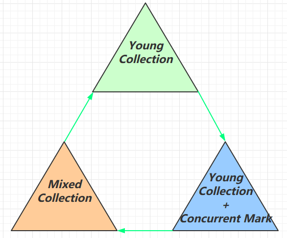

1.9后默认的垃圾回收算法,特点:同时注重高吞吐量(回收率)的低延迟(减少停顿),采用每次只清理一部分,而非全部来保证 STW 时间不会过长

其取消了幸存区与老年代的物理划分,但仍属于分代收集器,算法将堆分为若干个逻辑区域(region),整体分为四种：Eden、Survioor、Old、Humongous(存储大对象)

整体上是**标记+整理**算法，两个区域之间是**复制**算法

G1垃圾收集过程主要分为4个阶段：
1. 初始标记(Initial Marking):标记 GC Roots 直接关联到的对象,会 STW
2. 并发标记(Concurrent Marking):GC 线程和应用线程并发执行,标记出所有回收对象
3. 最终标记(Final Marking):处理和标记并发标记后新产生的对象,会 STW
4. 筛选回收(Live Data Counting and Evacuation):根据回收价值和成本(暂停时间),选择性回收 region,回收时采用标记复制算法,多条收集器线程并发执行,不追求全部清理完,会 STW

CMS(Concurrent Mark-Sweep)以低延迟为目标的垃圾收集器
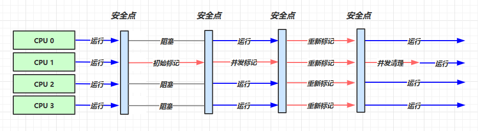

### 如何判断对象可以被回收？   
判断对象是否存活一般有两种方式： 1
1. 引用计数：每个对象有一个引用计数属性，新增一个引用时计数加1，引用释放时计数减1，计数为0时可以回收。此方法简单，但是无法解决对象相互循环引用的问题。 
2. 可达性分析（Reachability Analysis）：从GC Roots开始向下搜索，搜索所走过的路径称为引用链。当一个对象到GC Roots没有任何引用链相连时，则证明此对象是不可用的

### JVM的永久代中会发生垃圾回收么？ 
永久代会发生垃圾回收，如果永久代满了或者是超过了临界值，会触发Full GC。这就是为什么正确的永久代大小对避免Full GC是非常重要的原因。

### 你知道哪些垃圾收集算法
GC最基础的算法有三种： 标记-清除算法、复制算法、标记-整理算法，常用的垃圾回收器一般都采用**分代收集**算法。 
- 标记-清除（Mark-Sweep）算法:首先标记出所有需要回收的对象，在标记完成后统一回收掉所有被标记的对象。 
- 复制算法，将可用内存按容量划分为大小相等的两块(from和to)，每次只使用其中的一块。当这from内存用完了，就将还存活着的对象复制到to上面，然后 再把from的内存空间一次清理掉,然后交换from和to。 
- 标记-整理算法，标记过程仍然与“标记-清除”算法一样，但后续步骤不是直接对可回收对象进行清理，而是让所有存活的对象都向一端移动，形成一块连续的内存空间,然后直接清理掉端边界以外的内存
- 分代收集算法（Generational Collection），把Java堆分为新生代和老年代， 这样就可以根据各个年代的特点采用最适当的收集算法。 

### 说一下 JVM 有哪些垃圾回收器？ 
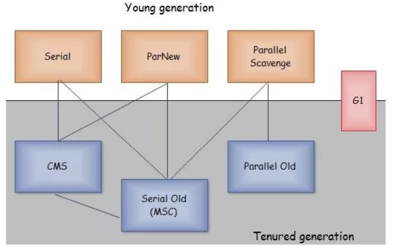

如果说垃圾收集算法是内存回收的方法论，那么垃圾收集器就是内存回收的具体实现。下图展示了 7 种作用于不同分代的收集器:
- 新生代收集器：Serial、ParNew 、Parallel Scavenge 
- 老年代收集器：CMS 、Serial Old、Parallel Old 
- 整堆收集器：G1 ，ZGC (因为不涉年代不在图中)。 

每个收集器的特点:
- Serial收集器(复制算法): 新生代单线程收集器，标记和清理都是单线程，优点是简单高效； 
- ParNew收集器 (复制算法): 新生代收并行集器，实际上是Serial收集器的多线程版本，在多核 CPU环境下有着比Serial更好的表现； 
- Parallel Scavenge收集器 (复制算法): 新生代并行收集器，追求高吞吐量，高效利用 CPU。吞 吐量 = 用户线程时间/(用户线程时间+GC线程时间)，高吞吐量可以高效率的利用CPU时间，尽快完成程序的运算任务，适合后台应用等对交互相应要求不高的场景； 
- Serial Old收集器 (标记-整理算法): 老年代单线程收集器，Serial收集器的老年代版本； 
- Parallel Old收集器 (标记-整理算法)： 老年代并行收集器，吞吐量优先，Parallel Scavenge收 集器的老年代版本； 
- CMS(Concurrent Mark Sweep)收集器（标记-清除算法）： 老年代并行收集器，以获取最短回收停顿时间为目标的收集器，具有高并发、低停顿的特点，追求最短GC回收停顿时间。 
- G1(Garbage First)收集器 (标记-整理算法)： Java堆并行收集器，G1收集器是JDK1.7提供的一个新收集器，G1收集器基于“标记-整理”算法实现，也就是说不会产生内存碎片。此外，G1收集器不同于之前的收集器的一个**重要特点**是：G1回收的范围是整个Java堆(包括新生代，老年代)，而前六种收集器回收的范围仅限于新生代或老年代。 
- ZGC （Z Garbage Collector）是一款由Oracle公司研发的，以低延迟为首要目标的一款垃圾收 集器。它是基于动态Region内存布局，（暂时）不设年龄分代，使用了读屏障、染色指针和内存多重映射等技术来实现可并发的标记-整理算法的收集器。在JDK 11 新加入，还在实验阶段，主要特点是：回收TB级内存（最大4T），停顿时间不超过10ms。**优点**：低停顿，高吞吐 量，ZGC 收集过程中额外耗费的内存小。**缺点**：浮动垃圾目前使用的非常少，真正普及还是需要写时间的。 

### 如何选择垃圾收集器？ 
- 堆大小不是很大（比如 100MB ），选择串行收集器一般是效率最高的。 参数：-XX:+UseSerialGC 。 
- 应用运行在单核的机器上，或者你的虚拟机核数只有单核，选择串行收集器依然是合适的，这时候启用一些并行收集器没有任何收益。 参数：-XX:+UseSerialGC 。 
- 应用是“吞吐量”优先的，并且对较长时间的停顿没有什么特别的要求。选择并行收集 器是比较好的。 参数：-XX:+UseParallelGC
- 应用对响应时间要求较高，想要较少的停顿。甚至 1 秒的停顿都会引起大量的请求失败，那么选择G1 、ZGC 、CMS 都是合理的。虽然这些收集器的 GC 停顿通常都比较短，但它需要一些额外的资源去处理这些工作，通常吞吐量会低一些。 参数： -XX:+UseConcMarkSweepGC 、 -XX:+UseG1GC 、 -XX:+UseZGC等。 
  平常的 Web 服务器，都是对响应性要求非常高的。选择性其实就集中在 CMS 、G1 、ZGC 上。而对于某些定时任务，使用并行收集器，是一个比较好的选择。 


## 调优
### 调优命令有哪些？
Sun JDK监控和故障处理命令有jps jstat jmap jhat jstack jinfo 
- jps，JVM Process Status Tool,显示指定系统内所有的HotSpot虚拟机进程。 
- jstat，JVM statistics Monitoring是用于监视虚拟机运行时状态信息的命令，它可以显示出虚拟 机进程中的类装载、内存、垃圾收集、JIT编译等运行数据。 
- jmap，JVM Memory Map命令用于生成heap dump文件 
- jhat，JVM Heap Analysis Tool命令是与jmap搭配使用，用来分析jmap生成的dump，jhat内 置了一个微型的HTTP/HTML服务器，生成dump的分析结果后，可以在浏览器中查看 
- jstack，用于生成java虚拟机当前时刻的线程快照。 
- jinfo，JVM Configuration info 这个命令作用是实时查看和调整虚拟机运行参数。 

### 常见调优工具有哪些 
常用调优工具分为两类,jdk自带监控工具：jconsole和jvisualvm，第三方有：MAT(Memory Analyzer Tool)、GChisto。 

- jconsole，Java Monitoring and Management Console是从java5开始，在JDK中自带的java监控和管理控制台，用于对JVM中内存，线程和类等的监控 
- jvisualvm，jdk自带全能工具，可以分析内存快照、线程快照；监控内存变化、GC变化等。 
- MAT，Memory Analyzer Tool，一个基于Eclipse的内存分析工具，是一个快速、功能丰富的 Java heap分析工具，它可以帮助我们查找内存泄漏和减少内存消耗 
- GChisto，一款专业分析gc日志的工具 

### 你知道哪些JVM性能调优参数？（简单版回答） 
- 设定堆内存大小 -Xmx：堆内存最大限制。 
- 设定新生代大小。 新生代不宜太小，否则会有大量对象涌入老年代 
  -XX:NewSize：新生代大小 
  -XX:NewRatio 新生代和老生代占比 
  -XX:SurvivorRatio：伊甸园空间和幸存者空间的占比 
- 设定垃圾回收器 
  年轻代用 -XX:+UseParNewGC 
  年老代用-XX:+UseConcMarkSweepGC 

## 对象一定分配在堆中吗？有没有了解逃逸分析技术？   
**对象一定分配在堆中吗？** 不一定的，JVM通过**逃逸分析**，那些逃不出方法的对象会在栈上分配。 

如果一个对象的指针被多个方法或者线程引用时，那么就称这个对象的指针发生了**逃逸**。 

**什么是逃逸分析？** 逃逸分析(Escape Analysis)，是一种可以有效减少Java 程序中同步负载和内存堆分配压力的跨函数全局数据流分析算法。通过逃逸分析，Java Hotspot编译器能够分析出一个新的对象的引用的使用范围，从而决定是否要将这个对象分配到堆上。 

**逃逸分析的好处** 

- 栈上分配，可以降低垃圾收集器运行的频率。 
- 同步消除，如果发现某个对象只能从一个线程可访问，那么在这个对象上的操作可以不需要同步。 
- 标量替换，把对象分解成一个个基本类型，并且内存分配不再是分配在堆上，而是分配在栈上。这样的好处有，一、减少内存使用，因为不用生成对象头。二、程序内存回收效率高，并 且GC频率也会减少。 


## 虚拟机为什么使用元空间替换了永久代？ 
> HotSpot 是 Java 虚拟机（JVM）的一种高性能实现，由 Sun Microsystems 开发（现属 Oracle），目前是 OpenJDK 和 Oracle JDK 的默认虚拟机
- 方法区:和堆一样，是各个线程共享的内存区域，它用于存储已被虚拟机加载的类信息、常量、 静态变量、即时编译后的代码等数据。 
- 永久代:如果在HotSpot虚拟机上开发、部署，把方法区称作永久代。可以说方法区是规范，永久代是Hotspot针对该规范进行的实现。在Java7及以前的版本，方法区都是永久代实现的。 
- 元空间:对于Java8，HotSpots取消了永久代，取而代之的是元空间(Metaspace)。换句话说，就是方法区还是在的，只是实现变了，从永久代变为了元空间.

永久代的方法区，和堆在物理内存上是连续的。 对于**永久代**，如果动态生成很多class的话，就很可能出现**java.lang.OutOfMemoryError: PermGen space错误**，因为永久代空间配置有限嘛。最典型的场景是，在web开发比较多jsp页面的时候。 JDK8之后，方法区存在于元空间(Metaspace)。物理内存不再与堆连续，而是直接存在于本地内存中，理论上机器**内存有多大，元空间就有多大**。 

因此,表面上看是为了避免OOM异常。因为通常使用PermSize和MaxPermSize设置永久代的大小就决定了永久代的上限，但是不是总能知道应该设置为多大合适, 如果使用默认值就很容易遇到 OOM 错误。而使用元空间的话，加载多少类的元数据就不再由MaxPermSize控制, 而由系统的实际可用空间来控制啦。 

**永久代**通过两个参数配置大小
- -XX:PremSize：设置永久代的初始大小
- -XX:MaxPermSize：设置永久代的最大值，默认是64M

设置元空间的大小：
- -XX:MetaspaceSize，初始空间大小，达到该值就会触发垃圾收集进行类型卸载，同时GC会对该值进行调整：如果释放了大量的空间，就适当降低该值；如果释放了很少的空间，那么在不超过MaxMetaspaceSize时，适当提高该值。
- -XX:MaxMetaspaceSize，最大空间，默认是没有限制的。
- -XX:MinMetaspaceFreeRatio，在GC之后，最小的Metaspace剩余空间容量的百分比，减少为分配空间所导致的垃圾收集
- -XX:MaxMetaspaceFreeRatio，在GC之后，最大的Metaspace剩余空间容量的百分比，减少为释放空间所导致的垃圾收集

## 什么是 Stop The World ?  什么是OopMap？什么是安全点？
进行垃圾回收的过程中，会涉及对象的移动。为了保证对象引用更新的正确性，必须暂停所有的用户线程，像这样的停顿，虚拟机设计者形象描述为**Stop The World**。也简称为STW。 

在HotSpot中，有个数据结构（映射表）称为**OopMap**。一旦类加载动作完成的时候，HotSpot就会把对象内什么偏移量上是什么类型的数据计算出来，记录到OopMap。在即时编译过程中，也会在**特定的位置**生成 OopMap，记录下栈上和寄存器里哪些位置是引用。 

这些特定的位置主要在： 
1. 循环的末尾（非 counted 循环） 
2. 方法临返回前 / 调用方法的call指令后 
3. 可能抛异常的位置 

这些位置就叫作「安全点(safepoint)」 用户程序执行时并非在代码指令流的任意位置都能够在停顿下来开始GC，而是必须是执行到安全点才能够暂停。 


未完待续...