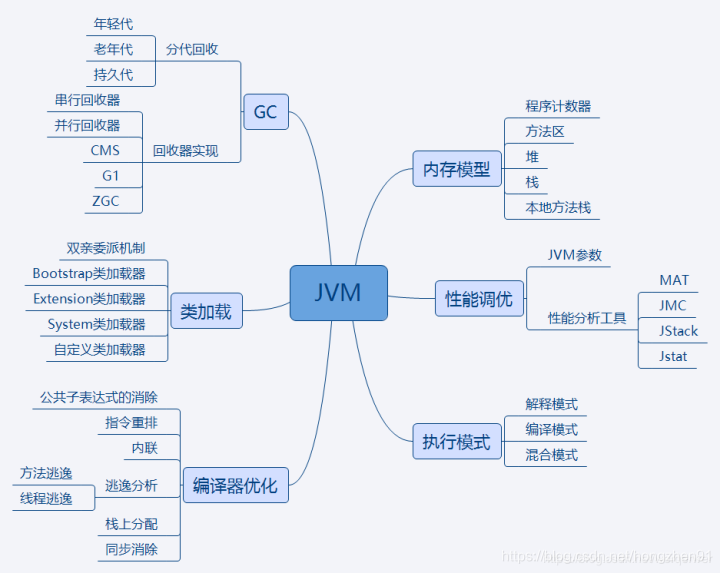

# JVM

## 知识点汇总

## JVM内存模型
- 线程独占:栈、本地方法栈、程序计数器 
- 线程共享:堆、方法区

1. 栈：又称方法栈,线程私有的,线程在执行 Java 方法时都会创建一个栈帧,用来存储局部变量表,操作栈,动态链接,方法出口等信息,调用方法时执行入栈,方法返回时执行出栈
2. 本地方法栈:与栈类似,也是用来保存执行方法的信息,执行Java方法是使用栈,执行Native方法时使用本地方法栈
3. 程序计数器:保存着当前线程执行的字节码位置,每个线程工作时都有独立的计数器,只为执行Java方法服务,执行Native方法时,程序计数器为空
4. 堆:JVM内存管理最大的一块,对被线程共享,目的是存放对象的实例,几乎所有的对象实例都会放在这里,当堆没有可用空间时,会抛出OOM异常。根据对象的存活周期不同,JVM把对象进行分代管理,然后由垃圾回收器进行垃圾的回收管理
5. 方法区：又称非堆区,用于存储已被虚拟机加载的类信息、常量、静态变量、即时编译器优化后的代码等数据。1.7的永久代和1.8的元空间都是方法区的一种实现

未完待续...