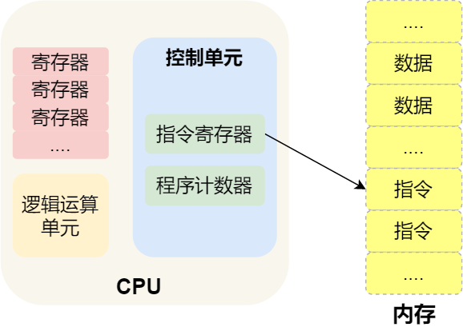

# 操作系统

## 冯诺依曼模型

最重要的是定义计算机基本结构为 5 个部分，分别是**运算器、控制器、存储器、输入设备、输出设备**，这 5 个部分也被称为**冯诺依曼模型**。

运算器、控制器是在中央处理器里的，存储器就我们常见的内存，输入输出设备则是计算机外接的设备，比如键盘就是输入设备，显示器就是输出设备。

[链接](https://xiaolincoding.com/os/1_hardware/how_cpu_run.html)

## 中央处理器

中央处理器也就是我们常说的 CPU，32 位和 64 位 CPU 最主要区别在于一次能计算多少字节数据,CPU 内部还有一些组件，常见的有**寄存器、控制单元和逻辑运算单元**等。其中，控制单元(还包含指令寄存器、程序计数器)负责控制 CPU 工作，逻辑运算单元负责计算

CPU 中的[寄存器](https://blog.csdn.net/weixin_27015733/article/details/119164499)主要作用是存储计算时的数据，由于紧挨着控制单元和逻辑运算单元，自然计算时速度会很快,这也就是为什么有了内存还需要寄存器

常见的寄存器种类：

- *通用寄存器*，用来存放需要进行运算的数据，比如需要进行加和运算的两个数据。
- *程序计数器*，用来存储 CPU 要执行下一条指令「所在的内存地址」，注意不是存储了下一条要执行的指令，此时指令还在内存中，程序计数器只是存储了下一条指令「的地址」。
- *指令寄存器*，用来存放当前正在执行的指令，也就是指令本身，指令被执行完成之前，指令都存储在这里。

## 如何让程序跑的更快？

要想程序跑的更快，优化这三者即可：

- *指令数*，表示执行程序所需要多少条指令，以及哪些指令。这个层面是基本靠编译器来优化，因为同样的代码，在不同的编译器编译出来的指令会有不同的表示方式
- *每条指令的平均时钟周期数 CPI*，表示一条指令需要多少个时钟周期数，现代大多数 CPU 通过流水线技术（Pipeline），让一条指令需要的 CPU 时钟周期数尽可能的少；
- *时钟周期时间*，表示计算机主频，取决于计算机硬件。有的 CPU 支持超频技术，打开了超频意味着把 CPU 内部的时钟给调快了，但是会带来散热问题

## 32位和64位CPU对比

> 64 位相比 32 位 CPU 的优势在哪吗？64 位 CPU 的计算性能一定比 32 位 CPU 高很多吗？

64 位相比 32 位 CPU 的优势主要体现在两个方面：

- 对于计算超过 32 位的数字，64 位 CPU 可以只计算一次，而 32 位 CPU 则要分多步骤进行计算，效率就没那么高。但是大部分应用程序很少会计算那么大的数字，所以有时候两者差别不大
- 通常来说 64 位 CPU 的地址总线是 48 位，而 32 位 CPU 的地址总线是 32 位，所以 64 位 CPU 可以**寻址更大的物理内存空间**。如果一个 32 位 CPU 最大寻址能力是 4G，即使你加了 8G 大小的物理内存，也还是只能寻址到 4G 大小的地址，而如果一个 64 位 CPU 的地址总线是 48 位，那么该 CPU 最大寻址能力是 `2^48`，远超于 32 位 CPU 最大**寻址能力**。

> 你知道软件的 32 位和 64 位之间的区别吗？再来 32 位的操作系统可以运行在 64 位的电脑上吗？64 位的操作系统可以运行在 32 位的电脑上吗？如果不行，原因是什么？

64 位和 32 位软件，实际上代表指令是 64 位还是 32 位的：

- 如果 32 位指令在 64 位机器上执行，需要一套兼容机制，就可以做到兼容运行了。但是**如果 64 位指令在 32 位机器上执行，就比较困难了，因为 32 位的寄存器存不下 64 位的指令**；
- 操作系统其实也是一种程序，被分成 32 位操作系统、64 位操作系统，其同样代表意义就是操作系统中程序的指令是多少位

未完待续~~~