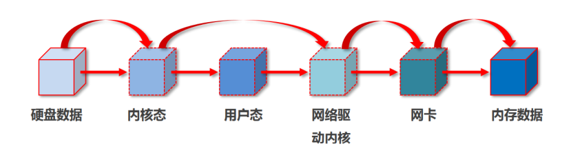
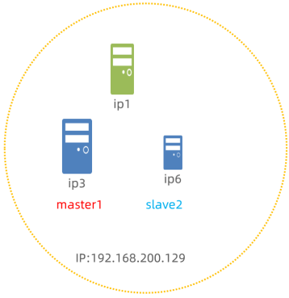

# RocketMQ

## 为什么要使用MQ

**核心**：解耦,异步,削峰

1. 解耦:如果不用MQ,那么在A系统向其他系统发送数据时,就会导致A系统与其他系统产生严重耦合,A系统需要向多个系统发送数据,而且多个系统(包含新的系统)也需要A的数据;而使用MQ之后,A系统不需要知道其他系统的存在,只需要向MQ提供数据,其他系统(包含新的系统)也不需要知道发送者的存在,只需要订阅MQ或者进MQ里消费数据即可。就是一个系统或者一个模块，调用了多个系统或者模块,互相之间的调用很复杂,维护起来很麻烦。**但是其实这个调用是不需要直接同步调用接口的**,所以可以用 MQ 给它异步化解耦。
2. 异步:如果不用MQ,假设 A 系统接收一个请求，需要在自己本地写库，还需要在 BCD 三个系统写库,那么 A 系统的响应时间就是四个系统的整个处理时间的总和。而使用 MQ 之后,A 系统只需要把请求发送到 MQ,处理完自己的业务逻辑后就可以返回给用户响应,响应时间大大缩短。其他系统则可以在 MQ 里面消费后再处理自己的业务逻辑。
3. 削峰:对高峰期流量进行缓冲

## MQ有什么优缺点

**优点**就是上面的核心

**缺点**:

- 系统可用性降低:系统引入的依赖越多,越容易出现系统崩溃,一旦MQ出现问题,整个系统都会瘫痪。
- 系统复杂度提升:引入MQ之后,系统的复杂度也会提升,还需要考虑消息的重复消费,消息的丢失,消息的传递的顺序等问题
- 一致性问题:MQ的消息传递是异步的, 无法保证MQ后面的系统消费的消息与处理的结果一致,也就是与生产者发送消息不能完全保持一致性。

## Kafka、ActiveMQ、RabbitMQ、RocketMQ 都有什么区别

- 对于吞吐量来说kafka和RocketMQ支撑高吞吐，ActiveMQ和RabbitMQ比他们低一个数量级。
- 对于延迟量来说RabbitMQ是最低的。
- 对于持久化消息,ActiveMQ和RabbitMQ支持持久化,持久化消息是指机器在不可抗力下掉电后,消息不丢失
- 对于高并发,RabbitMQ和RocketMQ都支持，RabbitMQ的并发量更高,原因是它的实现语言是天生具备高并发高可用的 erlang 语言。

## 一、消息队列模型(保证消息的顺序性)

消息有序指的是可以按照消息的发送顺序来消费(FIFO)。RocketMQ可以严格的保证消息有序，可以分为分区有序或者全局有序。

消息错乱的原因:在默认的情况下消息发送会采取Round Robin轮询方式把消息发送到不同的queue(分区队列)；而消费消息的时候从多个queue上拉取消息，这种情况发送和消费是不能保证顺序。

保证顺序性:控制发送的顺序消息只依次(FIFO)发送到同一个queue中，消费的时候只从这个queue上依次拉取，则就保证了顺序

1. 全局有序：发送和消费参与的queue只有一个
2. 分区有序：多个queue参与，相对每个queue，消息都是有序的

## 二、高效读写机制

RocketMQ采用多种技术实现高效的消息存储和读写：

1. **文件系统存储**：
   - 相比数据库存储(如ActiveMQ)，避免了数据库瓶颈
   - 采用**消息刷盘机制**进行持久化存储

2. RocketMQ通过顺序写入大幅提高吞吐量

3. **零拷贝技术**：
   
   - 数据传输(从磁盘到网卡)由传统4次复制简化为3次复制,跳过了用户态这个环节,使用MappedByteBuffer实现
   - 预留存储空间，用于保存数据（1G存储空间起步）

4. **存储结构优化**：

   - 消息数据存储区域：包含topic、queueId和message
   - 消费逻辑队列：维护minOffset、maxOffset和consumerOffset
   - 索引系统：包括key索引和创建时间索引 -->

## 三、刷盘机制

RocketMQ提供两种消息刷盘方式：

1. **同步刷盘**：
   - 流程：
     1. 生产者发送消息到MQ
     2. MQ挂起生产者线程
     3. 将消息写入内存
     4. 内存数据写入硬盘
     5. 磁盘存储成功后返回ACK
     6. 恢复生产者线程
     7. 返回ACK给生产者
   - 特点：安全性高，效率低，速度慢

2. **异步刷盘**：
   - 流程：
     1. 生产者发送消息到MQ
     2. MQ立即返回ACK
     3. 异步将消息写入内存和磁盘
   - 特点：安全性较低，效率高，速度快

## 四、死信队列机制

1. **死信消息定义**：消息消费重试达到指定次数(默认16次)后,无法被正常消费的消息成为死信消息
2. **死信队列特征**：首次出现死信时才在该group下创建死信队列，归属消费者组(GroupId)，不属于特定Topic,可以包含多个Topic的消息。
3. **死信处理**：消息不会被重复消费,3天后自动清除,可通过监控平台查找死信的messageId进行精准消费

## 如何保证高可用的
1. NameServer作为轻量级路由中心，无状态且不存储消息数据，多个NameServer节点相互独立，任何节点宕机都不会影响整体服务,生产者和消费者配置多个NameServer地址，自动切换可用节点

2. Broker的主从架构与自动切换
   - 主从同步:同步复制（SYNC_MASTER）​​：消息需同时写入主节点和从节点才返回成功，确保数据不丢失;异步复制（ASYNC_MASTER）​​：主节点写入后立即返回，从节点异步复制
   - 故障自动切换：基于Raft协议实现自动选主。当主节点宕机时，从节点通过多数派选举成为新主，切换时间可缩短至秒级;若同步副本数不足（如备节点故障），可自动降级为异步模式，优先保证可用性
3. 多Master架构
   - 消息生产:生产者将相同的topic绑定到多个group组，保障master挂掉后，其他master仍可正常进行消息接收。
   - 消息消费:RocketMQ自身会根据master的压力确认是否由master承担消息读取的功能，当master繁忙时候，自动切换由slave承担数据读取的工作

## 如何保证消息的可靠传输？如果消息丢了怎么办
RocketMQ 通过全链路的多层次机制确保数据不丢失，涵盖生产者发送、Broker存储、消费者消费三个阶段
1. 生产者发送消息：采用同步发送，等待Broker返回写入成功响应，确保消息不丢失;或者采用事务消息,发送half消息，等待Broker返回写入成功响应，再发送commit消息，否则回滚。
2. Broker存储消息：采用持久化存储和主从复制机制
3. 消费者消费消息：手动ACK确认消费,采用死信队列(失败转入人工处理),通过唯一标识符(msgId)来实现幂等性。

## MQ消息积压以及处理方案
1. 消费者方:首先修复消费者处理速度慢的根本原因,停止现有所有消费者实例，避免继续低效消费
2. 生产者方:新建topic引流，将消息引导到别的程序中,类似于洪水

## 让你来设计一个消息队列，你会怎么设计
可以从以下几个角度来考虑一下：
1. 首先这个 mq 得支持可伸缩性，就是在需要的时候能快速扩容，就可以增加吞吐量和容量:可以设计个分布式的系统，参照一下 kafka 的设计理念，broker -> topic -> partition，每个partition 放一个机器，就存一部分数据。如果现在资源不够了，简单啊，给 topic 增加 partition，然后做数据迁移，增加机器，这样就可以存放更多数据，提供更高的吞吐量了
2. 其次,将 mq 的数据刷到磁盘中,采用顺序写来提高性能，这样就没有磁盘随机读写的寻址开销，
3. 再考虑高可用,brocker 主从架构。
4. 最后,消息的可靠传输,采用事务消息和死信队列来确保消息不丢失。

双主双从集群搭建架构：

以上机制共同构成了RocketMQ高可靠、高性能的消息处理能力，开发者可根据业务需求选择合适的配置组合。

完结!!!