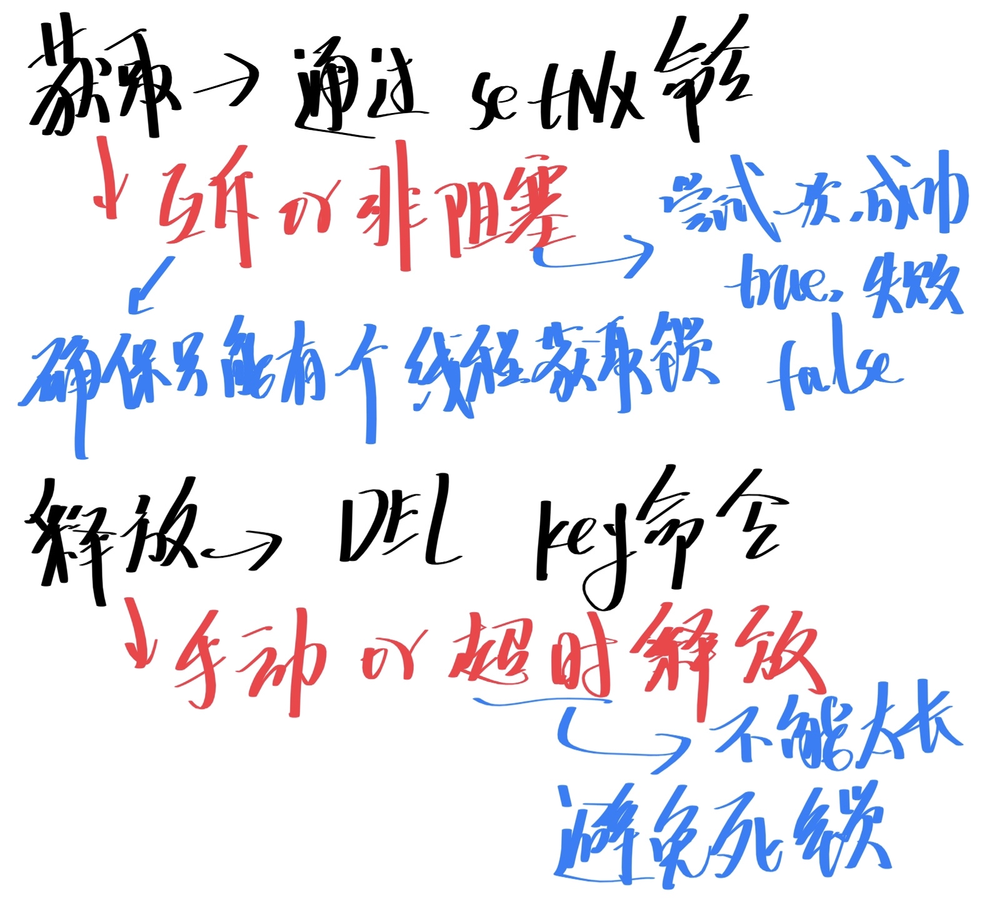
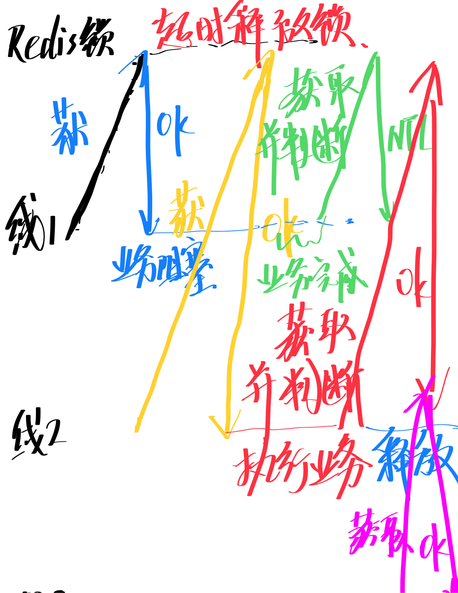
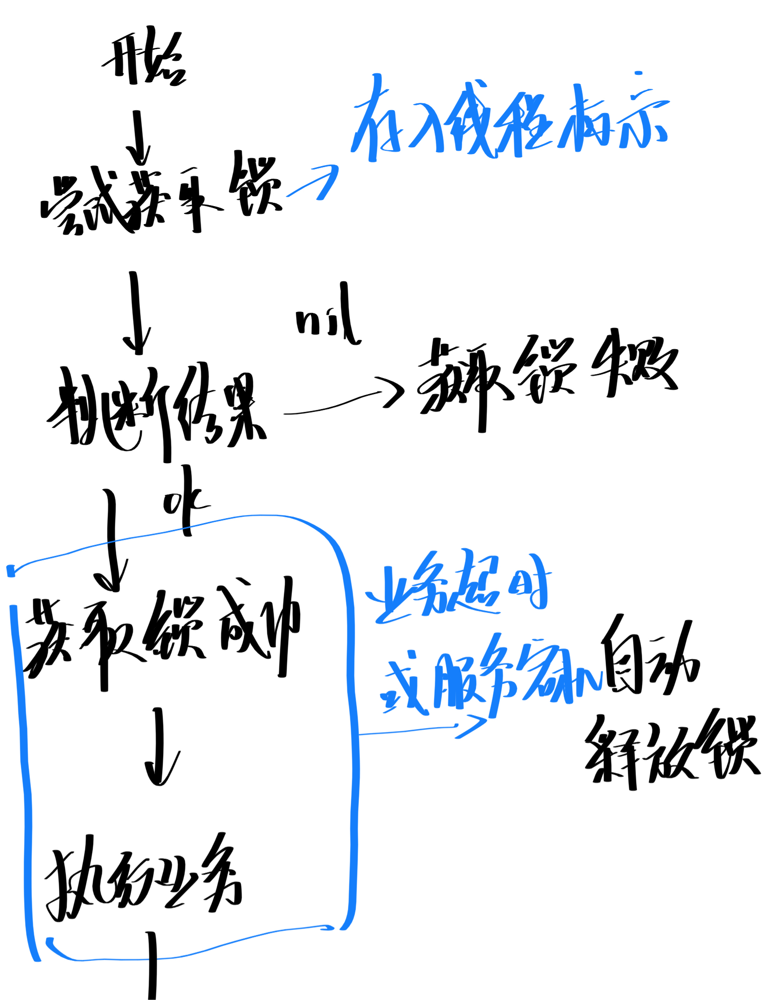
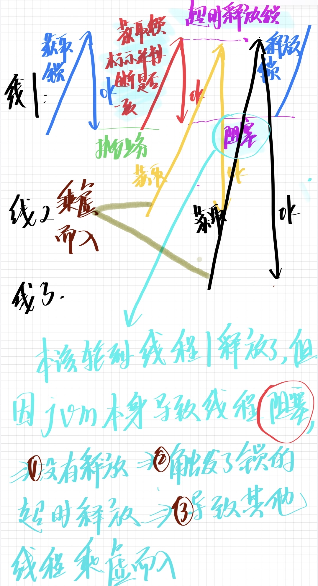
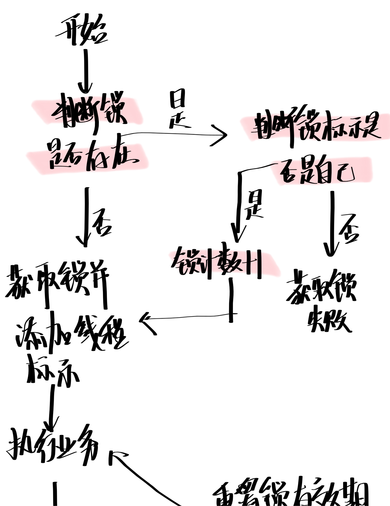
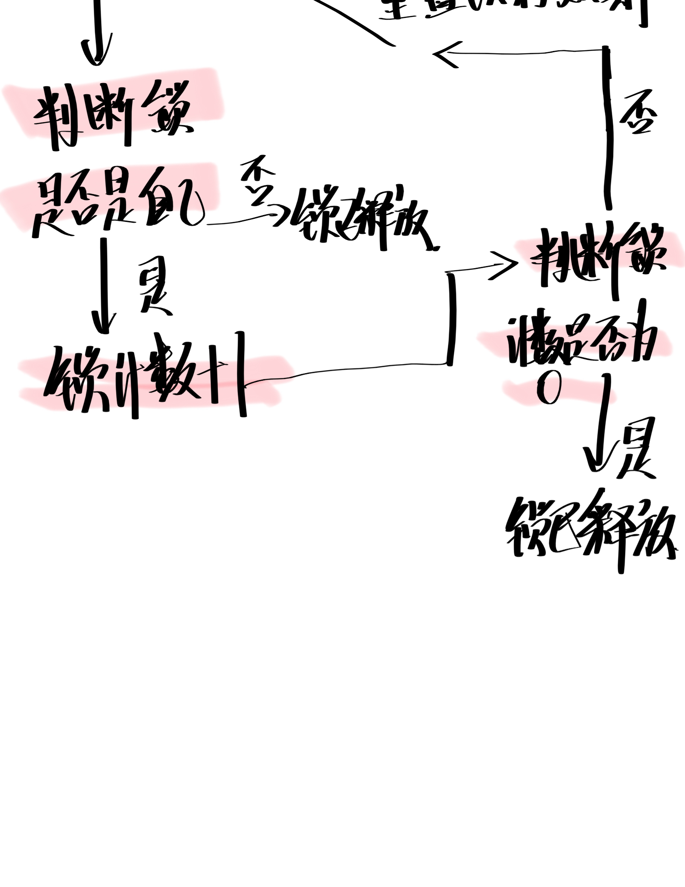
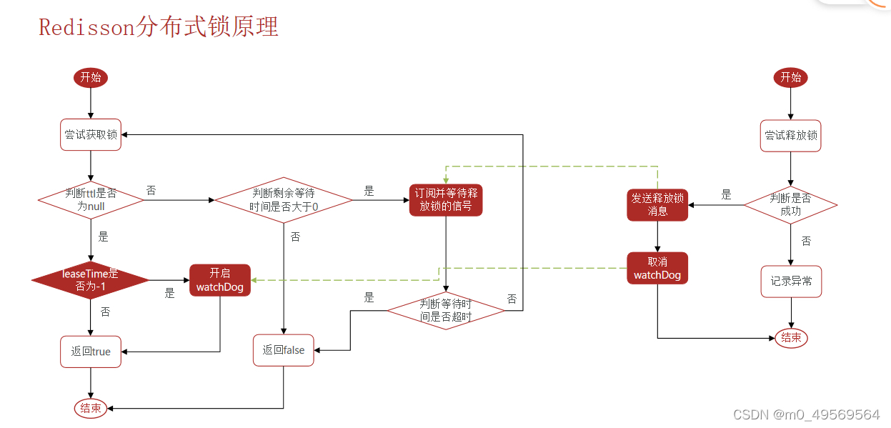

# 黑马点评

参考文章：

[图解Redis介绍 | 小林coding (xiaolincoding.com)](https://xiaolincoding.com/redis/)

[黑马点评面试题-CSDN博客](https://blog.csdn.net/WU18948905539/article/details/132192954)

### **介绍一下你写的这个项目**

我做的这个项目是一个以用户点评和商户信息为主的生活服务平台，实现了商户点评、优惠券秒杀、好友关注和粉丝关注博主后，主动推送博主的相关评价等多个模块；用户可以浏览首页的推荐内容，搜索附近商家， 查看商家的详情和评价以及发表探店评价。 

### **在这个项目中你实现了哪些功能**

登录注册，缓存一致性问题，缓存穿透、缓存击穿问题的落地解决，商品库存超卖问题，使用Redisson分布式锁解决了一人一单问题。接口手工测试，秒杀接口进行压力测试等功能

### **为什么要用redis替代session实现登录注册功能，有什么好处？**

session的数据是存储于服务器端的，服务端的数据量非常大的时候，就容易造成内存不足

redis是基于内存的高性能数据库，他的读写速率非常快和session相似

### **如何解决集群的session共享问题？**

用redis替代session实现登录注册功能啊，分布式系统下每一个服务器的session都是独立的，就是说你切换到其他服务器，比如你要切换到发布帖子，查看评论什么的，再次调回来登录界面又要重新登录了，多次重复登录多麻烦啊，这得使用redis可以保证多个服务器访问的是同一个redis，则保证了不会再重复登录了，实现了数据的共享；此外redis集群内部的数据一致性也很棒

好了，上面的大部分都是参考文章写的，下面的都是我自己在看完[图解Redis介绍](https://xiaolincoding.com/redis/)之后按照自己的思路总结的哈哈哈。

### **如何解决了缓存穿透、缓存击穿和缓存雪崩问题？**

**一，缓存穿透是什么：**

表示缓存和数据库里面根没有用户想要请求的数据，但是大量用户还是要来缓存和数据库里请求，给数据库带来巨大的压力,数据库可能会挂掉

解决方法：

给这个数据一个空对象放在缓存中，并给这个空对象设置一个过期时间

但是这样干也是有缺点的，什么缺点呢，就是需要给这么多空对象换份存储空间吧，过多也是很占内存，即使给这些空对象设置了一个很短的过期时间，还会导致这一段时间内数据库和缓存中数据库数据不一样

要么就是使用布隆过滤器：一种数据结构用来快速判断用户请求的数据是否属于某个集合中，判断速度很快的不会占用多少内存

**二，缓存击穿是什么：**

就是类似于秒杀这些数据，属于热点数据，大量用户又热衷于这个数据就会来缓存里请求，但是该热点数据都没了，所以他们就会直接去数据库请求，会给数据库造成巨大压力

解决方案：

设置key永不过期，针对性解决问题嘛，要么就是正常给key设置过期时间，后台同时启动一个定时任务去定时更新这个缓存

要么使用互斥锁保证同一时刻只能有一个查询请同一时刻只能有一求加载热点数据到缓存中，（意思就是，使用加锁的方式，锁定的对象key，然后大量用户同时来请求同一个数据，只能有一个请求能获得锁，他带着锁去数据库与读取这个数据，然后写入缓存中，然后释放锁；好，其他正在等着请求这个数据的依次来，因为现在缓存中有了数据，就不会直接跑到数据库里面请求了，从缓存中请求到数据返回）

**三，缓存雪崩是什么：**

当redis缓存里面的大量数据都是在同一时间过期失效的，同时大量用户来缓存里面请求数据请求不到，就会直接去数据库里面请求数据，会给数据库带来巨大的压力，容易系统奔溃

缓存雪崩解决方案：

1 打散缓存数据的过期时间：这样就不会同时过期失效了

2 数据预热

### **乐观锁和悲观锁是什么？是用来干什么的？（超卖问题）**

乐观锁比较乐观，他认为别人不会同时修改数据，乐观锁就不上锁了，只有在发现别人修改了数据，就放弃执行数据，不再执行操作了

悲观锁比较悲观，他认为别人会同时修改数据，悲观锁就在执行数据的时候加上锁，只有在执行完数据之后，才释放锁，像syn，lock这些就是悲观锁的代表

**超卖问题的产生：**

超卖的意思就是说明明库存已经没有了，但是居然海卖出去了，比卖出去-1件东西

**解决方案：**

悲观锁是行不通的了，他会导致秒杀业务变成串行执行严重降低并发性（想想MySQL事务隔离级别解决方案里的串行化就知道了）

得用乐观锁：在更新库存的时候判断一下 是否和查询库存的时候的结果一样，如果一样，说明数据没有被修改

### **redis分布式锁是什么？是如何实现一人一单的？（优惠卷秒杀业务）**

分布式锁：满足分布式系统或者集群模式下多线程可见并且互斥。

1分布式系统 集群模式

2多线程可见 互斥

### **分布式锁的实现和四个特性？**

可靠性，安全性，对称性，互斥性。

可靠：不管做什么都要考虑它可靠不可靠吧

互斥：就是要保证每一个竞争者都有自己的锁

补充：锁的目的是获取资源的使用权，所以只让一个竞争者持有锁，这一点要保证啊，

当一个竞争者在持有锁期间，由于意外崩溃---->而导致未能主动解锁，不要慌，其持有的锁也能被正常释放 并保证后续其他竞争者也能加锁

对称性：同一个锁，加锁和解锁都要在同一个竞争者上，不能其他的竞争者释放了锁，

### **可不可以用一条语句来完成加锁操作**

可以。

补充：Redis的set命令有个NX参数可以实现（key不存在才插入），所以可以用它来实现分布式锁

key不存在，则插入成功，加锁成功

key存在，则插入不成功，加锁失败

### **redis锁的实现思路**

获取锁：通过SetNx命令————互斥或非阻塞

释放锁：DEL key命令———-手动释放或者超时释放，给锁添加一个超时时间，避免类似死锁的情况发生

### **redis分布式锁误删问题**

这个问题实际上就是一个线程删除了本来不属于自己的锁

极端情况：

业务阻塞导致锁提前释放

其他线程一旦上来 业务没执行完 线程1把这时候执行完了 把线程2的锁删掉

so要在释放锁的时候要判断 锁的标志是否一致，别的线程不能删

还有一个线程三获取锁并执行业务的

**怎么解决？**

修改之前的分布式锁实现

1 在获取锁时存入线程标示 UUID

2 在释放锁的时候判断锁的标志是否一致（为的就是判断这把锁是不是他自己加上的）

### 分布式锁原子性问题

解决：

通过lua脚本执行多个redis命令

##### 基于redis分布式锁的实现思路（总结）

利用set nx ex 获取锁（set nx充满互斥性）（利用set ex保证故障时锁依然能释放，记住这句话，就是为了避免死锁 提高安全性）（利用redis集群保证高可用和高并发特性）并设置过期时间，保存线程标示

释放锁时先判断线程标示是否一致，一致则删除锁

### **Redission分布式锁**

可重入是指在同一线程可以多次获取同一把锁

比如a要调用b，同时a要获取锁，b也要获取同一把锁，如果不可重入，则b就获取不了锁，要等a释放锁，b才可以获取锁，如果可重入，则能同时获取锁

**造成死锁的情况：**

不可重入：同一线程不可以获取同一把锁

不可重试：获取锁只尝试一次就返回false，没有重试机制

超时释放

### **Redission可重入锁的原理**

看图

举个例子：a，b在同一线程上都是获取同一把锁，当a拿到锁，计数器+1，b也拿到锁，计数器+1，当a执行完，计数器-1，b同理，直到计数器为0，释放锁

Redission 锁可重试和看门狗机制watchdog

**Redission分布式锁原理**

**总结：**

1 可重入：基于hash结构，hash里filed存储线程标识，value存储重入次数，每一次获取锁的时候先判断锁是否存在，不存在直接获取锁，如果存在，不代表获取锁失败了。再去判断线程的标识是不是当前线程threald,是当前线程，可以再次获取，重入次数+1

释放锁的时候重入次数-1，直到重入次数为0，所有业务结束，再真正释放锁，实现锁的可重入

### **黑马点评项目测试面经总结：**

##### **一，怎么使用Postman进行接口测试？**

1，安装Postman

2\. 创建请求： 打开Postman，点击"New"按钮创建一个新的请求。在弹出的窗口中，选择请求的类型（GET、POST等），填入请求的URL，选择请求的Header、Body等信息。

3\. 设置请求Header： 如果接口需要传递Header信息，可以在Postman中设置。点击请求的Headers选项卡，添加需要的Header信息，比如Authorization等。

4\. 设置请求Body： 对于POST请求或者其他需要传递Body的请求，可以在Postman中设置请求的Body。可以选择不同的Body格式，比如form-data、raw、x-www-form-urlencoded等，并填入相应的参数。

5\. 发送请求： 填好请求信息后，点击Send按钮发送请求。Postman会显示请求的响应信息，包括状态码、响应体等。

6\. 查看响应： 在发送请求后，可以查看Postman显示的响应信息，包括响应的状态码、响应体等。可以根据需要进行断言、验证响应的正确性。

7\. 保存请求： 如果需要保存请求，可以点击Save按钮保存请求信息，方便以后再次使用。

通过这些步骤，你可以使用Postman进行接口测试，验证接口的正确性和稳定性。

##### **JMeter：秒杀系统如何做接口压力测试？**

确定性能测试目标和指标：

在进行性能测试之前，我们需要先确定测试的目标和指标。在秒杀系统中，我们主要关注以下指标：

系统的吞吐量：即在一定时间内能够处理的请求数量；

系统的响应时间：即从发起请求到接收响应的时间；

系统的并发数：即同时处理的请求数量；

系统的错误率：即请求失败的比例。

通过确定这些指标，我们可以更好地了解系统的性能瓶颈，并进行优化

1，创建测试计划：

首先，我们需要创建一个测试计划。在 jmeter 中，测试计划是一个顶层元素，包含了所有的测试元素。

在测试计划中，我们需要添加线程组和 HTTP 请求。

线程组是一组并发请求的集合，它定义了一组并发用户，并指定了每个用户的行为。在秒杀系统中，我们可以将线程组的数量设置为需要测试的并发数。

HTTP 请求是一个发送 HTTP 请求的元素，它可以模拟客户端向服务器发送请求的过程。我们需要使用 HTTP 请求来模拟秒杀系统的请求。

在添加 HTTP 请求时，我们需要填写请求的 URL 和请求参数。在秒杀系统中，我们需要将登录参数化，以便模拟多个用户同时登录的场景。同时，我们需要使用循环控制器来模拟循环请求接口并发 100

2，设置测试参数和参数化

在 jmeter 中，我们可以使用 CSV 数据文件来设置测试参数和参数化。CSV 文件是一个以逗号分隔的文本文件，可以包含多个行和列，每个单元格都可以包含一个值。

在 CSV 文件中，我们可以存储多个用户名和密码，然后在测试中使用变量引用这些值。这样就可以模拟多个用户同时登录的场景。

3，运行测试并分析结果：

在设置完测试参数和参数化之后，我们可以运行测试并分析结果。在测试运行期间，我们可以使用 jmeter 的图表和报告功能来监测系统的性能指标，并查找性能瓶颈。

在测试结束后，我们需要对测试结果进行分析和总结。通过对测试结果的分析，我们可以找到系统的性能瓶颈。

好了，over。