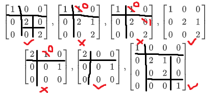

## Jordan标准形

**Jordan 块**

定义形如 $J (\lambda_i)\begin {bmatrix}\lambda_i&1\\&\lambda_i&\ddots\\&&\ddots&1\\&&&\lambda_i\end {bmatrix}_{k\times k}$ 的矩阵称为 **Jordan 块**。Jordan 块是一个上三角矩阵，其主对角线上的元素均相等；主对角线上面一条斜线的元素均为 1；其余元素均为 0

特殊地，当 $k=1$ 时，一阶 Jordan 块是 $[\lambda_i]$

**Jordan 形矩阵**

形如 $J=\begin {bmatrix} J (\lambda_1)\\&J (\lambda_2)\\&&\ddots\\&&&J (\lambda_s)\end {bmatrix}$（其中 $J (\lambda_i)$ 均为 Jordan 块）的矩阵称为 **Jordan 形矩阵**。Jordan 形矩阵是一个分块对角阵，其中每一个小分块都是 Jordan 块

**Jordan 标准形**

若矩阵 $A$ 与 Jordan 形矩阵 $J$ 相似，则称 $J$ 是 $A$ 的 Jordan 标准形

___

例 1

判断下列矩阵是否为 Jordan 形矩阵

$$
\begin{bmatrix}1&0&0\\0&2&0\\0&0&2\end{bmatrix},\begin{bmatrix}1&1&0\\0&2&1\\0&0&2\end{bmatrix},\begin{bmatrix}1&1&0\\0&2&0\\0&0&2\end{bmatrix},\begin{bmatrix}1&0&0\\0&2&1\\0&0&2\end{bmatrix}\\
\begin{bmatrix}2&1&0\\0&0&1\\0&0&0\end{bmatrix},\begin{bmatrix}2&0&0\\0&0&1\\0&0&0\end{bmatrix},\begin{bmatrix}1&0&0&0\\0&2&1&0\\0&0&2&0\\0&0&0&1\end{bmatrix}
$$

**解：**对于正确的 Jordan 形矩阵，用黑线给出了分块形式；对于错误的 Jordan 形矩阵，指出了需要修改的元素

 