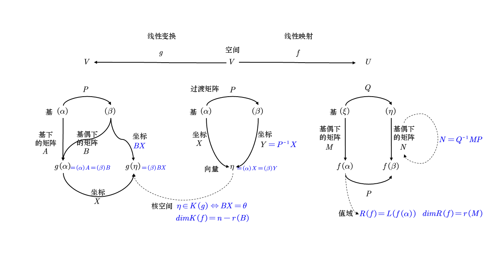
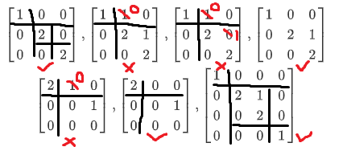

# 工程矩阵

## 工程矩阵的定义

| **定义** | **性质、定理与推论** |
|----------|------------------------|
| **分块矩阵**   $AB = \begin{pmatrix} A_{11} & A_{12} \\ A_{21} & A_{22} \end{pmatrix} \begin{pmatrix} B_{11} & B_{12} \\ B_{21} & B_{22} \end{pmatrix}$    $= (A\beta_1, \beta_2, \cdots, \beta_s) = (A\beta_1, A\beta_2, \cdots, A\beta_s)$ | $\begin{pmatrix} A \\ B \end{pmatrix}^* = (A^*, B^*)$ |
| **矩阵方程组** 设方程组 $Ax = b$, $A = (a_{ij})_{m \times n}$, $b = (b_i)_{m \times 1}$，则有：  (1) 有解 $\Leftrightarrow r(A) = r(A,b)$  (2) 若 $r(A) = r(A,b) = r < n$，则有解且有 $n-r$ 个自由未知量  (3) 若 $r(A) = r(A,b) = r = n$，则有唯一解 | |
| **齐次线性方程组的基础解系** 对齐次线性方程组 $Ax = 0, A = (a_{ij})_{m \times n}$，则有：  (1) 非零解 $\Leftrightarrow r(A) < n$  (2) 若 $r(A) = r < n$，则其基础解系中含有 $n - r$ 个解向量  (3) 若 $r(A) = r < n$，则其任意 $n - r$ 个线性无关的解向量就是其基础解系 | **定理（高斯消元法）**  (1) 用初等行变换将 $A$ 逐步化成阶梯形矩阵  (2) 确定自由未知量  (3) 用回代法找出通解 |
| **极大无关组** 设向量组 $\alpha_1, \alpha_2, \cdots, \alpha_m$ 的所有极大线性无关组 $\alpha_{i_1}, \alpha_{i_2}, \cdots, \alpha_{i_r}$ 满足：  (1) $\alpha_{i_1}, \alpha_{i_2}, \cdots$ 线性无关  (2) $\alpha_1, \alpha_2, \cdots, \alpha_m$ 中每个向量都可由 $\alpha_{i_1}, \alpha_{i_2}, \cdots, \alpha_{i_r}$ 线性表示  则称 $\alpha_{i_1}, \alpha_{i_2}, \cdots, \alpha_{i_r}$ 是 $\alpha_1, \cdots, \alpha_m$ 的一个极大无关组 | **定理**  (1) 若向量组的秩为 $r$，则该向量组中任意 $r$ 个线性无关的向量组是其极大无关组  (2) 如果一向量组的极大无关组中含 $r$ 个向量，则称该向量组的秩为 $r$ |
| **矩阵的等价标准形**  $s \times n$ 矩阵 $A$ 的秩等于 $r$ $\Rightarrow$ 存在可逆矩阵 $P_{s \times s}, Q_{n \times n}$ 使得  $A = P \begin{pmatrix} I_r & 0 \\ 0 & 0 \end{pmatrix} Q$ | |
| **消去分解**  $s \times n$ 矩阵 $A$ 的秩为 $r$，存在 $s \times r$ 矩阵 $B$ 和 $r \times n$ 矩阵 $C$ 使得 $A = BC$，即矩阵的消去分解 | **定理**  (1) $r(A + B) \leq r(A) + r(B)$  (2) $r(AB) \leq r(A), r(B)$  (3) $r(A) + r(B) \leq r\left( \begin{pmatrix} A_{kk}, B_{kk} \end{pmatrix} \right) + n$ |

## 线性空间和线性变换

| **线性空间** | **性质** |
|--------------|----------|
| **线性空间的定义**  线性空间满足下述三个要求建立的八条公理：  (1) 一个数域 $K$，一个非空集合 $V$（V 中的元素称为向量）；  (2) 两个运算：加法：$\forall x, y \in V$, 记作：$x + y \in V$；   数乘运算：$\forall a \in K, x \in V$, 记作：$ax \in V$；  (3) 这两个运算满足如下八条公理：  加法交换律：$\forall \alpha, \beta \in V, \ \alpha + \beta = \beta + \alpha$  加法结合律：$\forall \alpha, \beta, \gamma \in V, \ (\alpha + \beta) + \gamma = \alpha + (\beta + \gamma)$  零元存在性：存在 $0 \in V$, 使得 $\forall \alpha \in V$, 有 $\alpha + 0 = \alpha$  负元存在性：$\forall \alpha \in V$, 存在 $\beta \in V$, 使得 $\alpha + \beta = 0$  数乘结合律：$\forall \lambda \in K, \alpha \in V, \ \lambda \alpha \in V$  乘法结合律：$\forall k_1, k_2 \in K, \forall \alpha \in V$, 有 $k_1(k_2 \alpha) = (k_1 k_2)\alpha$  分配律一：$\forall k \in F, \forall \alpha, \beta \in V$, 有 $k(\alpha + \beta) = k\alpha + k\beta$  分配律二：$\forall k_1, k_2 \in F, \forall \alpha \in V$, 有 $(k_1 + k_2)\alpha = k_1\alpha + k_2\alpha$ | 设 V 是数域 F 上的线性空间，$\forall \alpha, \beta, \gamma \in V, k \in K$，则：  (1) V 中的零元是唯一的，通常记为 0；  (2) 任何一个向量的负向量是唯一的，通常记为 $-a$；  (3) 加法满足消去律：若 $\alpha + \gamma = \beta + \gamma$，则 $\alpha = \beta$；  (4) 若 $\alpha + \beta = 0$ 且 $\alpha = -\beta$，则 $\beta = -\alpha$；  (5) $k \cdot 0 = 0$, $0 \cdot \alpha = 0$；  (6) $(-k)\alpha = -k\alpha$, 特别地, $(-1)\alpha = -\alpha$ |
| **线性相关与线性无关**  设 $\alpha_1, \alpha_2, \cdots, \alpha_n \in V$，若有不全为 0 的数 $k_1, k_2, \cdots, k_n$ 使得 $k_1\alpha_1 + k_2\alpha_2 + \cdots + k_n\alpha_n = 0$，则向量组 $\alpha_1, \alpha_2, \cdots, \alpha_n$ 线性相关。否则，称线性无关。 | **性质**  (1) 若 $n \geq 2$，则 $\alpha_1, \alpha_2, \cdots, \alpha_n$ 线性相关当且仅当存在向量 $\alpha_i$ 使得它可由其余向量线性表示；  (2) 向量 $\alpha_1, \alpha_2, \cdots, \alpha_n$ 能否无关，但 $\alpha_1, \alpha_2, \cdots, \alpha_n, \alpha_{n+1}$ 线性相关，则可知 $\alpha_{n+1}$ 可由前面线性表示，而且，线性表示的方式是唯一的；  **推论**：  (1) 若 $\beta_1, \beta_2, \cdots, \beta_n$ 线性相关，$\alpha_1, \alpha_2, \cdots, \alpha_n$ 线性无关，则 $\beta_1, \cdots, \beta_n$ 不能都由 $\alpha_1, \cdots, \alpha_n$ 线性表示；  (2) 若 $\beta_1, \beta_2, \cdots, \beta_n$ 线性无关，$\alpha_1, \alpha_2, \cdots, \alpha_n$ 线性相关，则 $\alpha_i \neq \beta_i$ |
| **基**  若 $\alpha_1, \alpha_2, \cdots, \alpha_n \in V$ 满足：  (1) 向量组 $\alpha_1, \cdots, \alpha_n$ 线性无关；  (2) $\forall \beta \in V$，均可由 $\alpha_1, \cdots, \alpha_n$ 线性表示；  则称 $\alpha_1, \cdots, \alpha_n$ 是 V 的一组**基**。 | **性质**  (1) 线性空间的基不一定存在，**仅当一个空间由有限向量系生成**，基相当于可以**简明生成**的最简集；  **注意**：  有限维线性空间 $V$ 中任意线性无关向量组均可扩展成基 |
| **维数**  若 V 的某一组基中含 n 个向量，则 V 的任一组基中都含 n 个向量。称 V 是 n 维空间，记为 $\dim V = n$，规定零空间的维数为 0。 | **性质**  若 $\dim V = n$，则 V 中任意 $n + 1$ 个向量线性相关。  **定理**：  若 $\dim V = n$，则 V 中任意 $n$ 个线性无关向量均构成 V 的一组基。 |
| **坐标**  设 $\alpha_1, \alpha_2, \cdots, \alpha_n$ 是 V 的一组基，$\beta \in V$，且 $\beta = x_1\alpha_1 + x_2\alpha_2 + \cdots + x_n\alpha_n$，则称 $(x_1, x_2, \cdots, x_n)$ 是 $\beta$ 在基 $\alpha_1, \cdots, \alpha_n$ 下的坐标。 | **定义**  假设 $\eta_i \in V$ 是基 $\alpha_1, \cdots, \alpha_n$ 下的坐标分析对应关系，及 $X_i$, $i = 1, 2, \cdots, n$，则：  (1) $n = 0 \Rightarrow X = 0$；  (2) 若 $\eta_1 = x_1 \alpha_1 + \cdots + x_n \alpha_n$, 则 $X = (x_1, x_2, \cdots, x_n)^T$；  (3) $\eta_1, \cdots, \eta_n$ 线性相关 $\Leftrightarrow X_1, \cdots, X_n$ 线性相关 |
| **形式记导**  $X = \begin{pmatrix} x_1 \\ x_2 \\ x_3 \end{pmatrix}$ 是在基 $\alpha_1, \alpha_2, \alpha_3$ 下的坐标，  则可形式记成 $\beta = (\alpha_1, \alpha_2, \alpha_3) X$ | **性质**  若 $\beta_i = (\alpha_1, \alpha_2, \cdots, \alpha_n) A$，$\beta_1, \beta_2, \cdots, \beta_n$ 线性无关 $\Leftrightarrow A$ 是可逆矩阵  **性质**：  若有 $(\beta_1, \beta_2, \cdots, \beta_n) = (\alpha_1, \alpha_2, \cdots, \alpha_n) A$    $(\eta_1, \eta_2, \cdots, \eta_n) = (\beta_1, \beta_2, \cdots, \beta_n) B$  则有 $(\eta_1, \eta_2, \cdots, \eta_n) = (\alpha_1, \alpha_2, \cdots, \alpha_n)(AB)$ |
| **过渡矩阵** 设 $\alpha_1, \cdots, \alpha_n$ 和 $\beta_1, \cdots, \beta_n$ 都是 $V$ 的基，且 $(\beta_1, \cdots, \beta_n) = (\alpha_1, \cdots, \alpha_n)A$，则称从基 $\alpha_1, \cdots, \alpha_n$ 到基 $\beta_1, \cdots, \beta_n$ 的矩阵 $A$ 为过渡矩阵。 | (1) 过渡矩阵一定是可逆的 (2) 由 $\beta_1, \cdots, \beta_n$ 到 $\alpha_1, \cdots, \alpha_n$ 的过渡矩阵是 $A^{-1}$ (3) 若 $\beta_1, \cdots, \beta_n$ 到 $\gamma_1, \cdots, \gamma_n$ 的过渡矩阵是 $B$，那么 $\alpha_1, \cdots, \alpha_n$ 到 $\gamma_1, \cdots, \gamma_n$ 的过渡矩阵是 $AB$ **变换公式** 设 $X$ 为 $\eta$ 在基 $\alpha_1, \cdots, \alpha_n$ 下的坐标，$Y$ 在基 $\beta_1, \cdots, \beta_n$ 下的坐标，若 $(\beta_1, \cdots, \beta_n) = (\alpha_1, \cdots, \alpha_n)P$，则 $Y = PX$ |
| **子空间** 设 $V$ 是域 $F$ 上的线性空间，$W$ 是 $V$ 的非空子集。若 $W$ 关于 $V$ 的运算也构成 $F$ 上的线性空间，则称 $W$ 为 $V$ 的子空间，记为 $W \leq V$。 | 子空间与 $V$ 的运算规则相同。 **定理** 设 $W \subseteq V$ 非空，则 $W$ 是 $V$ 的子空间 $\Leftrightarrow$ $W$ 关于线性运算封闭。 |
| **解空间** 设 $A \in F^{m \times n}$，$V = \{\eta \in F^n \mid A\eta = 0\}$ 称为齐次方程组 $A\eta = 0$ 的解空间。 | 基础解系是一组基，维数为$n-r$，解集是一个子空间。 |
| **生成的子空间** 设 $V$ 是 $F$ 上的线性空间，$\alpha_1, \cdots, \alpha_n \in V$，集合 $W = \{\sum k_i \alpha_i \mid k_i \in F\}$ 称为 $\alpha_1, \cdots, \alpha_n$ 生成的子空间，记为 $W = L(\alpha_1, \cdots, \alpha_n)$。 | (1) $W = L(\alpha_1, \cdots, \alpha_n)$ 是 $V$ 的子空间 (2) $L(\alpha_1, \cdots, \alpha_n)$ 的基是 $\alpha_1, \cdots, \alpha_n$ 的极大无关组，即 $\dim L(\alpha_1, \cdots, \alpha_n) = r(\alpha_1, \cdots, \alpha_n)$ $L(\alpha_1, \cdots, \alpha_n)=L(\beta_1, \cdots, \beta_n) \Leftrightarrow$ $\alpha_1, \cdots, \alpha_n$与$\beta_1, \cdots, \beta_n$等价 |
| **子空间的交** $V_1 \cap V_2 = \{\eta \in V \mid \eta \in V_1, \eta \in V_2\}$ | $V_1 \cap V_2$ 仍为 $V$ 的子空间 |
| **子空间的和** $V_1 + V_2 = \{\eta \in V \mid \exists \eta_1 \in V_1, \eta_2 \in V_2, \eta = \eta_1 + \eta_2\}$ | $V_1 + V_2$ 是 $V$ 的子空间 **定理** 若 $V_1 = L(\alpha_1, \cdots, \alpha_s)$，$V_2 = L(\beta_1, \cdots, \beta_t)$，则 $V_1 + V_2 = L(\alpha_1, \cdots, \alpha_s, \beta_1, \cdots, \beta_t)$ **维数公式** $\dim(V_1 + V_2) = \dim V_1 + \dim V_2 - \dim(V_1 \cap V_2)$ |
| **直和** 设 $V_1, V_2 \leq V$，若 $\forall \eta \in V_1 + V_2$，存在唯一的 $\eta_1 \in V_1, \eta_2 \in V_2$，使得 $\eta = \eta_1 + \eta_2$，则称 $V_1 + V_2$ 是 $V$ 的直和，记为 $V_1 \oplus V_2$。 | **定理** 若 $V_1, V_2 \leq V$，则下述条件等价： (1) $V_1 + V_2$ 直和 (2) $0$的表示方式唯一 (3) $V_1 \cap V_2 = \{0\}$ (4) $\dim(V_1 + V_2) = \dim V_1 + \dim V_2$ (5) $V_1, V_2$ 的基合在一起就是 $V_1 + V_2$ 的基 |
| **多个空间的直和** 设 $V_1, V_2, \cdots, V_s \leq V$，若 $\forall \eta \in V_1 + V_2 + \cdots + V_s$，存在唯一的 $\eta_i \in V_i$，使得 $\eta = \sum_{i=1}^s \eta_i$，则称 $V_1 \oplus V_2 \oplus \cdots \oplus V_s$ 是 $V$ 的直和。 | **定理** 若 $V_1, V_2, \cdots, V_s \leq V$，则下述条件等价： (1) $V_1 + V_2 + \cdots + V_s$ 直和 (2) $0$的表示方式唯一 (3) $V_i \cap (\sum_{j \neq i} V_j) = \{0\}$ (4) $\dim(\sum_{i=1}^s V_i) = \sum_{i=1}^s \dim V_i$ (5) $V_1, V_2, \cdots, V_s$ 的基合在一起就是 $V_1 + \cdots + V_s$ 的基 |
| **映射、象、值域** 设 $f: A \to B$ ,$A,B$是两个集合，$f$ 是一个映射，$a \in A$，$f(a)$ 是 $B$ 中的元素，$f$ 的值域记为 $f(A) = \{f(a) \mid a \in A\}$。 | 若 $f(x)=y$，则$y$是$x$的象，则$x$是$y$的原象,$B$在映射 下的全体象记为 $f(A)$，称为$f$的值域。 |
| **恒等变换** 集合 $S$ 到自身的映射 $I: S \to S; x\mapsto x$ 称为 $S$ 上的恒等变换。 | |
| **单射、满射、双射** 设映射 $f: S \to T$。 若 $f(S) = T$，则称 $f$ 是满射； 若由 $f(a) = f(b)$ 必能推得 $a = b$，则称 $f$ 是单射； 若 $f$ 既是满射又是单射，则称 $f$ 是双射。 | **定理** $f: S \to T$ 是双射 $\Leftrightarrow f$ 是可逆映射。 |
| **线性映射** 设 $V, U$ 是数域 $F$ 上的线性空间，若映射 $f: V \to U$ 满足条件：  (1) $\forall v \in V, k \in F, f(kv) = k f(v)$；  (2) $\forall x, y \in V, f(x+y) = f(x) + f(y)$。 则称 $f$ 是从 $V$ 到 $U$ 的线性映射。 从 $V$ 到 $U$ 的线性映射全体记为 $\text{Hom}(V, U)$。 $V$ 到 $V$ 自身的线性映射称为 $V$ 上的线性变换。 | **性质**  (1) $f(0) = 0$  (2) 若 $\alpha_1, \dots, \alpha_n \in V, k_1, \dots, k_n \in F$，则 $f(\sum_{i=1}^n k_i \alpha_i) = \sum_{i=1}^n k_i f(\alpha_i)$  (3) 若 $\alpha_1, \dots, \alpha_n \in V$ 线性相关，则 $f(\alpha_1), \dots, f(\alpha_n) \in U$ 线性相关。 **定理（线性变换的运算）** 设 $f, f' \in \text{Hom}(V, U), g \in \text{Hom}(U, W), k \in F$，定义 $kf, f+f', gf$ 如下：  (1)$kf: V \to U$, $(kf)(x) = k f(x)$；  (2)$f+f': V \to U$, $(f+f')(x) = f(x) + f'(x)$；  (3)$gf: V \to W$, $(gf)(x) = g(f(x))$。 则 $kf, f+f', gf$ 都是线性映射。 |
| **$f$ 的值域** 若 $V = L(\alpha_1, \dots, \alpha_s)$，则 $f$ 的值域为 $R(f) = \{f(v) \mid v \in V\} = L(f(\alpha_1), \dots, f(\alpha_s))$。 | **定理** 设 $f \in \text{Hom}(V, U)$，则 $f$ 是满射 $\Leftrightarrow R(f) = U$。 **定理** 若 $f \in \text{Hom}(V, U)$，在基 $V: \alpha_1, \dots, \alpha_n$; $U: \beta_1, \dots, \beta_s$ 下的矩阵是 $A$，即$(f(\alpha_1),f(\alpha_2),\cdots,f(\alpha_n))=(\beta_1,\beta_2,\cdots,\beta_s)A$，由于 $R(f) = L(f(\alpha_1), \dots, f(\alpha_n))$   $f(\alpha_1), \dots, f(\alpha_n)$ 的极大无关组是 $R(f)$ 的基，且 $\dim R(f) = r(A)$。 |
| **$f$ 的核空间** $K(f) = \{v \in V \mid f(v) = 0\}$ 是 $V$ 的子空间，称为 $f$ 的核空间。 | **定理** 设 $f \in \text{Hom}(V, U)$，则 $f$ 是单射 $\Leftrightarrow K(f) = \{0\}$。 **定理** 若 $f \in \text{Hom}(V, U)$ 在基 $V: \alpha_1, \dots, \alpha_n$; $U: \beta_1, \dots, \beta_s$ 下的矩阵是 $A$，$\eta \in V$ 在 $\alpha_1, \dots, \alpha_n$ 下的坐标是 $X$，则 $f(\eta)$ 在 $\beta_1, \dots, \beta_s$ 下的坐标是 $AX$。因此，$\eta \in K(f) \Leftrightarrow AX = 0$。 从而，若 $X_1, \dots, X_{n-r}$ 是 $AX=0$ 的基础解系，则 $\eta_1, \dots, \eta_{n-r}$ 是 $K(f)$ 的基。$\dim K(f) = n - r(A)$。 **定理（维数定理）** 设 $\dim V < \infty, f \in \text{Hom}(V, U)$，则 $\dim R(f) + \dim K(f) = \dim V$。 **推论** 设 $\dim V < \infty, f \in \text{Hom}(V, V)$，则 $f$ 可逆 $\Leftrightarrow f$ 是单射 $\Leftrightarrow f$ 是满射。 |
| **基下的矩阵** 设 $f \in \text{Hom}(V, U)$，选定基 $V: \alpha_1, \dots, \alpha_n$; $U: \beta_1, \dots, \beta_s$。若 $(f(\alpha_1), f(\alpha_2), \dots, f(\alpha_n)) = (\beta_1, \beta_2, \dots, \beta_s)A$，则称 $A$ 是 $f$ 在选定基下的矩阵。 **特别如果 $U = V$，且 $\alpha_i = \beta_i$，则称 $A$ 是线性变换 $f$ 在所选基下的矩阵。** | **定理** 若 $f \in \text{Hom}(V, U)$ 在基 $V: \alpha_1, \dots, \alpha_n$; $U: \beta_1, \dots, \beta_s$ 下的矩阵是 $A$，$\eta \in V$ 在 $\alpha_1, \dots, \alpha_n$ 下的坐标是 $X$，则 $f(\eta)$ 在 $\beta_1, \dots, \beta_s$ 下的坐标是 $AX$。 **定理** 设 $f \in \text{Hom}(V, U)$ 在基 $V: \alpha_1, \dots, \alpha_n$; $U: \beta_1, \dots, \beta_s$ 下的矩阵是 $A$；在基 $V: \alpha'_1, \dots, \alpha'_n$; $U: \beta'_1, \dots, \beta'_m$ 下的矩阵是 $B$。若从基 $\alpha$ 到基 $\alpha'$ 的过渡矩阵是 $P$，从基 $\beta$ 到基 $\beta'$ 的过渡矩阵是 $Q$，则 $B = Q^{-1}AP$。 **定理** 设 $f \in \text{Hom}(V, V)$ 在基 $\alpha_1, \dots, \alpha_n$ 下的矩阵是 $A$；在基 $\alpha'_1, \dots, \alpha'_n$ 下的矩阵是 $B$。若从基 $\alpha$ 到基 $\alpha'$ 的过渡矩阵是 $P$，则 $B = P^{-1}AP$。 **定理** 设 $f, g \in \text{Hom}(V, V)$ 在 $V$ 的基 $\alpha_1, \dots, \alpha_n$ 下的矩阵分别是 $A, B$，设 $k \in F$，则在该基下：  (1) $kf$ 的矩阵是 $kA$；  (2) $f+g$ 的矩阵是 $A+B$；  (3) $fg$ 的矩阵是 $AB$；  (4) $f$ 可逆 $\Leftrightarrow A$ 可逆，$f^{-1}$ 的矩阵是 $A^{-1}$。 |
| **$f$ 的不变子空间** 设 $f \in \text{Hom}(V,V), W \subseteq V$, 若 $\forall \eta \in W$, 有 $f(\eta) \in W$, 则称 $W$ 是 $f$ 的不变子空间。 | (1) 设 $f \in \text{Hom}(V,V)$, 则 $R(f), K(f)$ 均是 $f$ 的不变子空间 (2) $W$ 是关于 $f$ 的不变子空间, 则 $f\|_W$ 可以看成是 $W$ 上的线性变换; (3) 如果 $V=V_1 \oplus V_2$, 其中, $V_1, V_2$ 都是关于 $f$ 的不变子空间, 则取 $V_1$ 的基 $\alpha_1,\dots,\alpha_s$, 取 $V_2$ 的基 $\alpha_{s+1},\dots,\alpha_n$, 则 $\alpha_1,\dots,\alpha_s,\alpha_{s+1},\dots,\alpha_n$ 是 $V$ 的基,  这组基下, $f$ 的矩阵为 $\begin{pmatrix} A & O \\ O & B \end{pmatrix}$ **定理** 线性变换在不同的基下的矩阵是相似的 |
| **同构** 设 $U,V$ 都是数域 $F$ 上的线性空间。如果 $f \in \text{Hom}(V,U)$ 是双射, 则称 $f$ 是线性空间 $U,V$ 之间的同构映射。 如果 $U,V$ 之间存在同构映射, 则称 $U,V$ 是同构的。记为 $V \cong U$。 | **定理** 设 $f: V \to U$ 是线性空间 $U,V$ 之间的同构, $\alpha_1,\alpha_2,\dots,\alpha_s \in V$, 则 $\alpha_1,\alpha_2,\dots,\alpha_s$ 线性相关当且仅当 $f(\alpha_1), f(\alpha_2), \dots, f(\alpha_s) \in U$ 线性相关。 **定理** 设 $U,V$ 都是数域 $F$ 上的线性空间, 则 $V \cong U$ 当且仅当 $\dim V = \dim U$。 |

## 内积空间和等距变换

| **定义** | **性质、定理与推论** |
|----------|------------------------|
|**内积** 设 $V$ 是数域 $F$ 上的线性空间，在 $V$ 上定义了一个二元函数 $\langle \alpha, \beta \rangle$，若满足： (1) 共轭对称性：$\langle \alpha, \beta \rangle = \overline{\langle \beta,\alpha \rangle}$ (2) 可加性：$\forall \alpha, \beta, \gamma \in V$, $\langle \alpha+\beta, \gamma \rangle = \langle \alpha,\gamma \rangle + \langle \beta,\gamma \rangle$ (3) 齐次性：$\forall \alpha, \beta \in V, k \in F$, $\langle k\alpha, \beta \rangle = k\langle \alpha,\beta \rangle$ (4) 正定性：$\forall \alpha \in V, \langle \alpha,\alpha \rangle \geq 0$; 且等号成立当且仅当 $\alpha = 0$。 则称 $\langle \alpha, \beta \rangle$ 是 $\alpha, \beta$ 的内积。 | **性质** (1) $\langle \alpha, \beta + \gamma \rangle = \langle \alpha, \beta \rangle + \langle \alpha,\gamma \rangle$ (2) $\langle \alpha, k\beta \rangle = \overline{k}\langle \alpha, \beta \rangle$ (3) $\langle \sum_{i=1}^s k_i \alpha_i, \sum_{j=1}^t l_j \beta_j \rangle = \sum_{i=1}^s \sum_{j=1}^t k_i \overline{l_j} \langle \alpha_i,\beta_j \rangle$ (4) 对任意 $\alpha \in V, \langle \alpha, 0 \rangle = \langle 0,\alpha \rangle = 0$ |
| **标准内积** 实数域：$\langle\alpha, \beta\rangle = \beta^T \alpha = \sum_{i=1}^n a_i b_i$ 复数域：$\langle\alpha, \beta\rangle = \beta^H \alpha = \sum_{i=1}^n a_i \overline{b_i}$ |  |
| **内积空间** 定义了内积的线性空间称为内积空间。 当 $F=\mathbb{R}$ 时，称 $V$ 是欧几里德空间，简称欧氏空间； 当 $F=\mathbb{C}$ 时，称 $V$ 是酉空间。 |  |
| **度量矩阵** 设 $\epsilon_1, \epsilon_2, \dots, \epsilon_n$ 是 $V$ 的基，$\alpha, \beta \in V$ 的坐标是 $X = (x_1, x_2, \dots, x_n)^T, Y = (y_1, y_2, \dots, y_n)^T$ 则 $\langle \alpha, \beta \rangle = \sum_{i=1}^n \sum_{j=1}^n x_i \overline{y_j} \langle \epsilon_i,\epsilon_j \rangle = X^T A Y$ 其中，$A = (( \langle \epsilon_i, \epsilon_j \rangle ))_{n\times n}$，称 $A$ 是 $V$ 在基 $\epsilon_1, \epsilon_2, \dots, \epsilon_n$ 下的度量矩阵。 | **性质** 若 $F=\mathbb{R}$，则度量矩阵是实对称矩阵：$A=A^T$； 若 $F=\mathbb{C}$，则度量矩阵是 Hermite 矩阵：$A=A^H$ |
| **长度** 设 $\alpha \in V$，$\alpha$ 的模 (长度) 定义为 $\parallel  \alpha  \parallel = \sqrt{\langle \alpha,\alpha \rangle}$ 若 $\parallel \alpha \parallel =1$，则称 $\alpha$ 是单位向量。 | **性质** (1) $\forall \alpha \in V, \parallel \alpha \parallel \geq 0$, 且 $\parallel \alpha \parallel = 0 \Leftrightarrow \alpha = 0$; (2) $\parallel k\alpha \parallel = |k| \parallel \alpha \parallel$; 故若 $\alpha \neq 0$, 则称 $\frac{1}{ \parallel \alpha \parallel }\alpha$ 是单位向量。 **定理(C-B不等式)** $\forall \alpha,\beta \in V, |\langle \alpha, \beta \rangle| \leq \parallel \alpha \parallel \parallel \beta \parallel$ 等号成立当且仅当 $\alpha, \beta$ 线性相关。 **定理(三角不等式)** $\forall \alpha,\beta \in V, \parallel \alpha + \beta \parallel \leq \parallel \alpha \parallel + \parallel \beta \parallel$ |
| **距离** 向量 $\alpha, \beta$ 间的距离定义为 $d\langle \alpha, \beta \rangle = \parallel \alpha - \beta \parallel$ | **定理 (三角不等式)** $\forall \alpha, \beta, \gamma \in V, d( \alpha,\gamma ) \leq d(\alpha,\beta) + d( \beta,\gamma )$ |
| **正交** 若向量 $\alpha, \beta$ 的内积为零，则称 $\alpha, \beta$ 是正交的。记 $\alpha \perp \beta$ 由两两正交的非零向量组成的向量组称为正交向量组。 由两两正交的单位向量组成的向量组称为标准正交向量组 由正交向量组组成的基称为是正交基。 由标准正交向量组组成的基称为是标准正交基。 | **性质** 设 $\epsilon_1, \epsilon_2, \dots, \epsilon_n$ 是 $V$ 的标准正交基，此时度量矩阵 $A=(\langle \epsilon_i,\epsilon_j \rangle)_{n\times n} = I_n$ $\alpha, \beta \in V$ 在 $\epsilon_1, \epsilon_2, \dots, \epsilon_n$ 下的坐标是 $X, Y$，则 $\langle \alpha, \beta \rangle = Y^H X = \langle X, Y \rangle_{\mathbb{C}^n}$ **定理 (勾股定理)** 若 $\alpha \perp \beta$, 则 $\parallel \alpha + \beta  \parallel ^2 = \parallel \alpha  \parallel ^2 + \parallel \beta  \parallel ^2$ **定理 (基扩充定理)** 假设 $W$ 是 $V$ 的子空间，$\alpha_1, \alpha_2, \dots, \alpha_s$ 是 $W$ 的标准正交基，则存在 $\alpha_{s+1}, \alpha_{s+2}, \dots, \alpha_n$，使得 $\alpha_1, \alpha_2, \dots, \alpha_s, \alpha_{s+1}, \alpha_{s+2}, \dots, \alpha_n$ 是 $V$ 的标准正交基。 |
| **Schmidt 正交化** 若 $\alpha_1, \alpha_2, \dots, \alpha_s \in V$ 是线性无关的，可以通过以下步骤正交化： ① $\beta_1 = \alpha_1$ ② $\beta_k = \alpha_k - \sum_{j=1}^{k-1} \frac{\langle \alpha_k, \beta_j \rangle}{\langle \beta_j, \beta_j \rangle} \beta_j$ for $k=2, \dots, s$ 单位化：$\gamma_i = \frac{1}{ \parallel \beta_i \parallel } \beta_i, i=1,2,\dots,s$ |  |
| **酉矩阵** 若 $A^H A = I$，则 $n$ 阶方阵 $A$ 称为酉矩阵 酉矩阵本质上是正交矩阵在复数域的推广 酉矩阵的特征值都是模为 1 | **性质** (1) A是酉矩阵$\Leftrightarrow A^H A = I \Leftrightarrow A^{-1} = A^H \Leftrightarrow A$ 的行 (列) 向量组是 $\mathbb{C}^n$ 的标准正交基。 (2) 若 $A, B$ 是同阶酉矩阵，则 $A^{-1}, AB$ 都是酉矩阵。 (3) 设 $A$ 是上 (下) 三角矩阵，若 $A$ 是酉矩阵，则 $A$ 是对角阵，且其主对角元的模均等于 1。若 $A$ 的主对角元均为实数，则 $A=I$。 **定理** 设 $\alpha_1, \alpha_2, \dots, \alpha_n$ 是 $V$ 的标准正交基，$(\gamma_1, \gamma_2, \dots, \gamma_n) = (\alpha_1, \alpha_2, \dots, \alpha_n)U$，则 $\gamma_1, \gamma_2, \dots, \gamma_n$ 是标准正交基 $\Leftrightarrow U$ 是酉矩阵。 |
| **可逆矩阵的 UT 分解** 设 $A$ 是 $n$ 阶可逆矩阵，则存在酉矩阵 $U$ 及主对角元均大于零的上三角矩阵 $T$，使得 $A=UT$，而且，满足上述条件的矩阵 $U, T$ 是唯一的。 |  |
| **正交补空间** 若 $W_1, W_2 \leq V$，对 $\forall \alpha_1 \in W_1, \alpha_2 \in W_2$, $\alpha_1 \perp \alpha_2$，称 $W_1 \perp W_2$。 设 $W \leq V$，记 $W^\perp = \{\alpha \in V \mid \alpha \perp W\}$， $W^\perp$ 是 $V$ 的子空间，称为 $W$ 在 $V$ 中的正交补空间。 | **定理** (1) 设 $W=L(\alpha_1,\alpha_2,\dots,\alpha_s)$，$\eta\in V$，则 $\eta\perp W \Leftrightarrow \eta\perp \alpha_j$, $\forall j$. (2) 设 $V$ 是内积空间， $W$ 是 $V$ 的有限维子空间，则 $V=W\oplus W^\perp$。 (3) 若 $V=W\oplus U$，且 $W\perp U$，则 $U=W^\perp$。 (4) 设 $A\in \mathbb{C}^{s\times n}$，定义线性映射 $f:\mathbb{C}^n \to \mathbb{C}^s$ 满足 $f(x)=Ax$, $\forall x\in \mathbb{C}^n$， $f$ 的值域和核空间分别为 $R(A), K(A)$。可得 $R(A)^\perp=K(A^H)$, $K(A)^\perp=R(A^H)$。 **推论** 设 $V$ 是内积空间， $W$ 是 $V$ 的有限维子空间，则 $(W^\perp)^\perp=W$。 |
| **正投影** 已知 $W\leq V,\alpha\in V$，若 $\eta\in W$ 满足 $d(\alpha,\eta) = \min_{\xi\in W} d(\alpha,\xi)$，则称 $\eta$ 为 $\alpha$ 在 $W$ 中的正投影。 | **定理** 设 $W\leq V, \alpha\in V$，则： (1) $\eta\in W$ 是 $\alpha$ 在 $W$ 中的正投影当且仅当 $\eta-\alpha\perp W$; (2) 若 $\alpha$ 在 $W$ 中的正投影存在，则正投影必定是唯一的； (3) 设 $W$ 是内积空间 $V$ 的有限维子空间，则 $V$ 中任意向量在 $W$ 中的正投影一定存在； |
| **等距变换** $V$ 是内积空间，$f\in \text{Hom}(V,V)$，若 $\langle f(\alpha),f(\beta) \rangle = \langle \alpha,\beta \rangle$, $\forall \alpha, \beta \in V$，称 $f$ 是等距变换。 | **性质** 若 $F=\mathbb{R}$，称 $f$ 是正交变换； 若 $F=\mathbb{C}$，称 $f$ 是酉变换。 **定理** 设 $V$ 是内积空间，$f\in \text{Hom}(V,V)$，下述条件等价： (1) $f$ 保持长度不变 $\parallel f(\alpha)\parallel =  \parallel \alpha\parallel$； (2) $f$ 保持内积不变 $\langle f(\alpha),f(\beta) \rangle = \langle \alpha,\beta \rangle$； (3) $f$ 将标准正交基变为标准正交基； (4) $f$ 在标准正交基下的矩阵是酉矩阵。 |
| **欧氏空间中的镜像变换** 设 $V$ 是一个欧氏空间，$\omega\in V$ 是一个单位向量，映射 $f:V\to V$, $\alpha\mapsto \alpha-2\langle \alpha,\omega \rangle\omega$，则 $f$ 是 $V$ 上的等距变换 (镜像变换)。 | $\alpha\to \beta$ 正交变换 (镜像变换) 的单位向量 $\omega = \frac{1}{ \parallel \alpha-\beta_0 \parallel }(\alpha-\beta_0) = \frac{1}{\parallel \alpha - \frac{ \parallel \alpha \parallel }{ \parallel \beta \parallel }\beta \parallel } (\alpha - \frac{ \parallel \alpha \parallel }{ \parallel \beta \parallel }\beta)$ |

---

## Hermite 二次型

| **定义** | **性质与定理** |
|---|---|
| **Hermite 矩阵** 设 $A \in \mathbb{C}^{n \times n}$，若有 $A^H = A$，称为 Hermite 矩阵，简称为H矩阵。 若 $\forall j, i$，有 $a_{ij} = \overline{a_{ji} }$，特别地，若 $\forall i$, 有$a_{ii} \in \mathbb{R}$ 设 $A \in \mathbb{C}^{n \times n}$，若有 $A^H = -A$，称为H矩阵。 | **性质（实对称矩阵）** 1. 实对称矩阵的特征值都为实数。 2. 实对称矩阵的属于不同特征值的特征向量相互正交。 3. 存在正交矩阵 $Q$，使得 $Q^T A Q$ 为对角阵。 **性质（Hermite 矩阵）** 1. 所有特征值均为实数。 2. 不同特征值的特征向量相互正交。 3. 存在酉矩阵 $U$，使得 $U^H A U$ 为对角阵。 |
| **Hermite 二次型** $f(X) = X^H A X = \sum_{i=1}^n \sum_{j=1}^n a_{ij} \overline{x_i} x_j$ 为 Hermite 二次型。 |(1)若 $A,B$都是H阵,且对$\forall X \in  \mathbb{C}^n,X^H AX=X^H BX$,则$A=B$ (2)设$f(X)=X^H AX,g(Y)=Y^H BY$,C是可逆矩阵,若在$X=CY$下,$f(X)=g(Y)$,则$B=C^H AC$  |
| **共轭合同** 设 $A, B$ 是矩阵，若有可逆矩阵 $C$，使得 $B = C^H A C$，则称 $A$ 与 $B$ 是共轭合同的。 | **性质** 反身性：$A$ 与 $A$ 共轭合同。 对称性：若 $A$ 与 $B$ 共轭合同，则 $B$ 与 $A$ 共轭合同。 传递性：若 $A$ 与 $B$，$B$ 与 $C$ 共轭合同，则 $A$ 与 $C$ 共轭合同。 |
| **正规阵** 设 $A \in \mathbb{C}^{n \times n}$，若有 $A^H A = A A^H$，则称 $A$ 是正规阵。 | **定理** 若 $A$ 是上三角的，又是正规阵，则 $A$ 是对角阵。  Hermite 矩阵酉矩阵都是正规阵。 $A \in \mathbb{C}^{n \times n}$ 是 Hermite 矩阵 $\Leftrightarrow$ $A$ 酉相似于对角阵。 $A \in \mathbb{C}^{n \times n}$ 是正规阵 $\Leftrightarrow$ $A$ 有 $n$ 个两两正交的单位特征向量。 **引理（Shur 引理）** 对于任意矩阵 $A$，存在酉矩阵 $U$，使得 $U^H A U$ 是上三角阵。 |
| **Hermite 二次型的标准形** 假设 Hermite 二次型 $f(X)$ 有可逆线性变换 $X = C Y$ 变成只含平方项的形式，则 $g(Y) = f(X) = Y^H D Y$ 的标准型。 $g(Y) = d_1 \mid y_1 \mid ^2 + d_2  \mid y_2 \mid ^2 + \cdots + d_n  \mid y_n \mid ^2$，其中 $d_i$ 为实数，且 $d_1 \geq d_2 \geq \cdots \geq d_n$。 |  |
| **惯性定理** 若$f(X)$在可逆线性变换$X=CY$和$X=DZ$的标准形分别为 Hermite 二次型标准型中的正项数 $p$ 和负项数 $q$ 称为其正惯性指数，负项个数称为其负惯性指数。 | **惯性定理** 若 $n \times n$ Hermite 矩阵 $A, B$ 共轭合同，则 $A, B$ 有相同的正、负惟一性指数。 若 $A_1 = \begin{pmatrix} a_1 & & \\ & \ddots & \\ & & a_p \end{pmatrix}$，$A_2 = \begin{pmatrix} b_1 & & \\ & \ddots & \\ & & b_q \end{pmatrix}$，其都合同，则 $a_1, ..., a_p, b_1, ..., b_q$ 均正、负项数相同。 |
| **规范形** 如 $n \times n$ Hermite 矩阵 $A$ 的正、负惟一性指数分别是 $p, q$，则 $A$ 共轭合同于 $\begin{pmatrix} I_p & 0 & 0 \\ 0 & -I_q & 0 \\ 0 & 0 & 0 \end{pmatrix}$ 称此矩阵为 $A$ 的规范形。 | **性质** $r(A) = p + q$ |
| **正定性** 设$A$是H阵，$f(X)=X^HAX$，若对$\forall X\neq 0,f(X)>0$，则称$A$是正定的。 | 1) $D=\begin{pmatrix}d_1&&\\&\ddots&\\&&d_n\end{pmatrix}$，$D$正定$\Leftrightarrow \forall d_i>0$ 2) 若有阵$A,B$共轭合同，则$A$正定$\Leftrightarrow B$正定 3) 若有阵$A$与$D$共轭合同，$A$正定$\Leftrightarrow \forall d_i>0$ |
| **半正定性** 若$\forall X, f(X)\geq 0$，则称$A$是半正定的。 | 1) $D$半正定$\Leftrightarrow \forall d_i\geq 0$ 2) 若有阵$A,B$共轭合同，则$A$半正定$\Leftrightarrow B$半正定 3) 若有阵$A$与$D$共轭合同，$A$半正定$\Leftrightarrow \forall d_i\geq 0$ |
| **某些有定性** 设$A$是H阵，$f(X)=X^HAX$ | 1) 若$\forall X\neq 0, f(X)<0$，则$A$是负定的 2) 若$\forall X\neq 0, f(X)\leq 0$，则$A$是半负定的 |
| **奇异值标准形** 假设$A$为$n\times n$矩阵，$A=V^HDV$，$D=\mathrm{diag}(d_1,\dots,d_n)$ | 一定存在酉矩阵$V$和对角阵$D$，使$A=\begin{pmatrix}D&0\\0&0\end{pmatrix}$ |
| **Rayleigh商** 设$A$是H阵，$X\in\mathbb{C}^n$ | $R(X)=\frac{X^HAX}{X^HX}$，称为A的Rayleigh商 |
| **正定的变换条件** 设$A$是$n\times n$ Hermite阵 | 1) $A$正定 2) $A$特征值均$>0$ 3) $A$与$D$共轭合同，$d_i>0$ 4) 存在可逆$P$使$A=P^HP$ 5) $A$各阶主子式$>0$ |
| **注意（正定的变换条件）** | 1) $A$正定 2) $A$特征值均$>0$ 3) $A$与$\begin{pmatrix}I_r&0\\0&0\end{pmatrix}$共轭合同 4) 存在可逆$P$使$A=P^HP$ 5) $A$全主子式$>0$ |
| **半正定的变换条件** | 1) $A$半正定 2) $A$特征值均$\geq 0$ 3) $A$与$\begin{pmatrix}I_r&0\\0&0\end{pmatrix}$共轭合同 4) 存在$P$使$A=P^HP$ 5) $A$全主子式$\geq 0$ |
| **推论** | 正定矩阵$A,B$的和一定正定：$f(X)=X^H(A+B)X>0$ 否定：正定矩阵$A,B$的和不一定正定，$f(X)=X^H(A+B)X$不恒$>0$ |
| **极值定理** 设$A\in\mathbb{C}^{n\times n}$，特征值$\lambda_1\leq\cdots\leq\lambda_n$ | $\lambda_1=\min_{X\neq 0}R(X)$，$\lambda_n=\max_{X\neq 0}R(X)$ |
| **第二极值定理** 特征向量$u_1,\dots,u_n$，$S_k=L(u_1,\dots,u_k)$，$T_k=L(u_{k+1},\dots,u_n)$ | $\lambda_k=\min_{X\in T_{k-1},X\neq 0}R(X)=\max_{X\in S_k,X\neq 0}R(X)$ |
| **Courant极大极小原理** 特征值$\lambda_1\geq\lambda_2\geq\cdots\geq\lambda_n$ | $\lambda_k=\max_{\dim S=k}\min_{X\in S,X\neq 0}R(X)=\min_{\dim T=n-k+1}\max_{X\in T,X\neq 0}R(X)$ |

## 矩阵的相似标准形

## $\lambda$矩阵和 Jordan 分块

**多项式**

定义：$n$ 是非负整数，$\mathbb {F}$ 是一个数域，$a_0,a_1,...,a_n\in\mathbb {F}$

$$
f(\lambda)=a_n\lambda^n+a_{n-1}\lambda^{n-1}+···a_1\lambda+a_0
$$

称为数域上关于 $\lambda$ 的一元多项式

如果 $a_n\neq 0$，则称 $a_n\lambda^n$ 为 $f (\lambda)$ 的首项，$n$ 称为多项式的次数，记为 $\partial (f (\lambda))$，于是 $\partial (f (\lambda))=n$

如果 $a_0=a_1=・・・=a_n=0$，称该多项式为**零多项式**，规定 $\partial (f (\lambda))=-∞$

如果 $a_0\neq 0, a_1=・・・=a_n=0$，称该多项式为**零次多项式**，$\partial (f (\lambda))=0$，即该多项式为非零常数

**多项式的带余除法**

定义：$f (\lambda),g (\lambda)\in\mathbb {F}[\lambda]$，如果 $g (\lambda)\neq 0$，则存在 $q (\lambda),r (\lambda)\in \mathbb {F}[\lambda]$，使得

$$
f(\lambda)=g(\lambda)q(\lambda)+r(\lambda)
$$

其中，要么 $r (\lambda)=0$，要么 $r (\lambda)\neq 0$ 且 $\partial (r (\lambda))<\partial (g (\lambda))$

$q (\lambda)$ 称为 $g (\lambda)$ 除 $f (\lambda)$ 的商，$r (\lambda)$ 称为余式

如果 $r (\lambda)=0$，则称 $g (\lambda)$ 整除 $f (\lambda)$，记为 $g (\lambda)|f (\lambda)$

**多项式的公因式，公倍式**

-   $f (\lambda),g (\lambda),d (\lambda)\in \mathbb {F}[\lambda]$，如果 $d (\lambda)|f (\lambda)$ 且 $d (\lambda)|g (\lambda)$，则称 $d (\lambda)$ 为 $f (\lambda),g (\lambda)$ 的公因式
-   $f (\lambda),g (\lambda),d (\lambda)\in \mathbb {F}[\lambda]$，如果 $f (\lambda)|d (\lambda)$ 且 $g (\lambda)|d (\lambda)$，则称 $d (\lambda)$ 为 $f (\lambda),g (\lambda)$ 的公倍式
-   最大公因式 GCD：次数最大的公因式
-   最小公倍式 LCM：次数最小的公倍式

如果 $GCD (f (\lambda),g (\lambda))=1$，$f (\lambda)$ 和 $g (\lambda)$ 称为互质

**质因式分解**

$$
f(\lambda)=(q_1(\lambda))^{r_1}(q_2(\lambda))^{r_2}···(q_s(\lambda))^{r_s}
$$

其中 $q_i (\lambda)$ 为不可约多项式，即 $q_i (\lambda)$ 不能表示成两个次数比 $q_i (\lambda)$ 低的多项式的乘积

> 类比实数域中的，任何一个合数都可以分解为几个质数的乘积

一个多项式是否可约，关键要看数域 $\mathbb {F}$，例如

$$
\mathbb {F}=\mathbb {R},\ \lambda^2+1,\ 不可约 \\
\mathbb {F}=\mathbb {C},\ \lambda^2+1=(\lambda+i)(\lambda-i),\ 可约
$$

**常见数域的不可约多项式**

$\mathbb {R}[\lambda]$ 上不可约多项式只有两种

$$
\begin{aligned}
&a\lambda+b \ \ (a,b\in \mathbb{R}\  \&\ a\neq 0)\\
&a\lambda^2+b\lambda+c \ \ (a, b, c\in \mathbb{R} \  \& \ a\neq 0 \ \& \ b^2-4ac < 0)
\end{aligned}
$$

$\mathbb {C}[\lambda]$ 上不可约多项式只有一种

$$
a\lambda+b \ \ (a,b\in \mathbb{C}\ \&\ a\neq 0)
$$

___

**$\lambda$ 矩阵**

以多项式为元素的矩阵称为多项式矩阵，简称为 $\lambda$ 矩阵。记号 $\mathbb {F}^{m\times n}[\lambda]$ 表示所有 $m$ 行 $n$ 列的 $\lambda$ 矩阵的集合，矩阵的元素是系数在 $\mathbb {F}$ 中的 $\lambda$ 的多项式。也就是说，$A (\lambda)\in \mathbb {F}^{m\times n}[\lambda]$ 表示 $A (\lambda)=[a_{ij}(\lambda)]_{m\times n}$，其中，$a_{ij}(\lambda)\in \mathbb {F}[\lambda]$

方阵 $A$ 的特征矩阵 $\lambda I-A$ 也是 $\lambda$ 矩阵，例如

$$
A = (a_{ij})_{n\times m}\\
\lambda I-A = \begin{bmatrix}\lambda-a_{11}&-a_{12}&\cdots &-a_{1n}\\-a_{21}&\lambda-a_{22}&\cdots & -a_{2n}\\ \vdots \\-a_{n1}&-a_{n2}&\cdots & \lambda-a_{nn}\end{bmatrix}
$$

**数字矩阵是 $\lambda$ 矩阵的特例（由零多项式或零次多项式为元素构成的矩阵）**

**以多项式为元素的矩阵和以矩阵为系数的多项式**

如

$$
A(\lambda)=\begin{bmatrix}\lambda^2+\lambda+1&\lambda-1\\2\lambda&1\end{bmatrix}
$$

可以写成

$$
A(\lambda)=\begin{bmatrix}1&0\\0&0\end{bmatrix}\lambda^2+\begin{bmatrix}1&1\\2&0\end{bmatrix}\lambda+\begin{bmatrix}1&-1\\0&1\end{bmatrix}
$$

多项式矩阵和通常矩阵的主要区别在于：其元素所在的运算系统 —— 多项式环 $\mathbb {F}[x]$—— 不是一个域，所以通常矩阵的性质中，涉及到除法的，对于多项式矩阵不再成立

**$\lambda$ 矩阵的秩**

$\lambda$ 矩阵的秩，也用 rank 表示，是指其值为非零多项式的子行列式的最大阶数。换言之，多项式矩阵的秩为 $r$ 是指：存在 $r$ 阶子行列式，其值为非零多项式；且所有阶数 $≥r+1$ 的子行列式的值均为零多项式。零矩阵的秩为 0

**可逆的 $\lambda$ 矩阵**

一个 $n$ 阶 $\lambda$ 矩阵是可逆的，若存在多项式矩阵 $V (\lambda)\in \mathbb {F}^{n\times n}[\lambda]$ 使得

$$
U(\lambda)V(\lambda)=V(\lambda)U(\lambda)=I_n
$$

这里 $I_n$ 是 $n$ 阶单位阵，其中称为 $U (\lambda)$ 的逆矩阵，记为 $U^{-1}(\lambda)$

**定理：**一个 $n$ 阶 $\lambda$ 矩阵 $U (\lambda)$ 可逆的充要条件是 $\det U (\lambda)$ 是一个非零常数

> 注：$n$ 阶 $\lambda$ 矩阵 $U (\lambda)$ 的秩为 $n$，不等价于 $U (\lambda)$ 可逆，这是与数字矩阵不相同之处，例如 $U (\lambda)=\begin {bmatrix}\lambda &1\\1&\lambda\end {bmatrix}$ 的秩为 2，但是它不可逆

___

**Jordan 块**

定义形如 $J (\lambda_i)\begin {bmatrix}\lambda_i&1\\&\lambda_i&\ddots\\&&\ddots&1\\&&&\lambda_i\end {bmatrix}_{k\times k}$ 的矩阵称为 **Jordan 块**。Jordan 块是一个上三角矩阵，其主对角线上的元素均相等；主对角线上面一条斜线的元素均为 1；其余元素均为 0

特殊地，当 $k=1$ 时，一阶 Jordan 块是 $[\lambda_i]$

**Jordan 形矩阵**

形如 $J=\begin {bmatrix} J (\lambda_1)\\&J (\lambda_2)\\&&\ddots\\&&&J (\lambda_s)\end {bmatrix}$（其中 $J (\lambda_i)$ 均为 Jordan 块）的矩阵称为 **Jordan 形矩阵**。Jordan 形矩阵是一个分块对角阵，其中每一个小分块都是 Jordan 块

**Jordan 标准形**

若矩阵 $A$ 与 Jordan 形矩阵 $J$ 相似，则称 $J$ 是 $A$ 的 Jordan 标准形

___

例 1

判断下列矩阵是否为 Jordan 形矩阵

$$
\begin{bmatrix}1&0&0\\0&2&0\\0&0&2\end{bmatrix},\begin{bmatrix}1&1&0\\0&2&1\\0&0&2\end{bmatrix},\begin{bmatrix}1&1&0\\0&2&0\\0&0&2\end{bmatrix},\begin{bmatrix}1&0&0\\0&2&1\\0&0&2\end{bmatrix}\\
\begin{bmatrix}2&1&0\\0&0&1\\0&0&0\end{bmatrix},\begin{bmatrix}2&0&0\\0&0&1\\0&0&0\end{bmatrix},\begin{bmatrix}1&0&0&0\\0&2&1&0\\0&0&2&0\\0&0&0&1\end{bmatrix}
$$

**解：**对于正确的 Jordan 形矩阵，用黑线给出了分块形式；对于错误的 Jordan 形矩阵，指出了需要修改的元素

___

**Jordan 标准形的存在性、唯一性**

**对矩阵 $A$ 的 Jordan 标准形中每个分块改变排列顺序，得到的依然是 Jordan 标准形**

若 $J=\begin {bmatrix} J_1\\&J_2\\&&\ddots\\&&&J_s\end {bmatrix}$ 是矩阵 $A$ 的 Jordan 标准形，而 $K=\begin {bmatrix} J_{i_1}\\&J_{i_2}\\&&\ddots \\&&&J_{i_s}\end {bmatrix}$，其中 $J_{i_1},J_{i_2},...,J_{i_s}$ 是 $J_1,J_2,...,J_s$ 的一个排列，则 $K$ 也是 $A$ 的 Jordan 标准形

那么所谓的 Jordan 标准形的唯一性是如何定义的呢？**除了相差 Jordan 块的次序外，矩阵的 Jordan 标准形是存在的、唯一的**

**性质**

1.  若 $A$ 与 $J$ 相似，$\lambda_0$ 是数，则对一切正整数 $k$，$\mathrm {rank}((A-\lambda_0E)^k)=\mathrm {rank}((J-\lambda_0E)^k)$
2.  若 $n\times n$ 矩阵 $N=\begin {bmatrix} 0&1\\&0&\ddots\\&&\ddots&1\\&&&1\end {bmatrix}$，则 $\mathrm {rank}(N^{k-1})-\mathrm {rank}(N^k)=\begin {cases} 1, 若 k≤n\\0, 若 k>n\end {cases}$
3.  若 $J$ 是 Jordan 矩阵，则 $\mathrm {rank}((J-\lambda_0E)^{k-1})-\mathrm {rank}((J-\lambda_0E)^l)$ 等于 $J$ 中阶数 $≥k$ 的，以 $\lambda_0$ 为主对角元的 Jordan 块的块数

**定理**

设 $\lambda_0$ 是矩阵 $A$ 的特征值，则 $A$ 的 Jordan 标准形中以 $\lambda_0$ 为主对角元的 $k$ 阶 Jordan 块的块数为

$$
\mathrm{rank}(B^{k-1})-2·\mathrm{rank}(B^k)+\mathrm{rank}(B^{k+1})
$$

其中，$B=A-\lambda_0E$

根据这个定理，我们只要针对矩阵 $A$ 的每一个特征值 $\lambda_0$，依次求解相应于这个特征值的每一阶 Jordan 块的块数，就可以把矩阵 $A$ 的 Jordan 标准形完全求解出来。但实际上，这一工作需要大量的计算，在实际中不会采用。我们只需要明确，**根据一个矩阵 $A$ 的特征值、$A-\lambda_0E$、阶数 $k$ 等信息就能够完全确定矩阵 $A$ 对应的 Jordan 标准形**

___

**Jordan 标准形的求法**

-   求矩阵 $A$ 的特征多项式 $|\lambda E-A| = (\lambda - \lambda_1)^{k_1}(\lambda-\lambda_2)^{k_2}...(\lambda - \lambda_s)^{k_s}$，其中 $k_i$ 是特征值 $\lambda_i$ 的**代数重数，决定了对角线上特征值 $\lambda_i$ 的个数**；
-   对 $\lambda_i$，由 $(A-\lambda_i E) X=0$，求 $A$ 的**线性无关的特征向量** $\alpha_1,\alpha_2, ...,\alpha_{t_i}$，其中 $t_i$ 是特征值 $\lambda_i$ 的**几何重数，决定了 Jordan 块的个数**；

    -   如果 $k_i = t_i$，即**代数重数等于几何重数**，说明 $\lambda_i$ 对应的 Jordan 块是对角阵；
    -   如果 $t_i < k_i$，就选择合适的特征向量 $\alpha_j$，利用方程 **${\color {red} {(A-\lambda_i E) = \alpha_j}}$ 求 Jordan 链**，确定每一个小 Jordan 块的阶数。
-   将所有特征值 $\lambda_i$ 对应的 Jordan 块组合起来，形成 Jordan 矩阵 $J_A$
-   **最小多项式**决定了关于 Jordan 块的最大尺寸。

## Gram 矩阵

**欧氏空间**

$V$ 是 $\mathbb {R}$ 上的线性空间，定义映射

$$
\sigma: V\times V \to \mathbb{R}
$$

对于 $\alpha, \beta \in V$，将 $\sigma (\alpha, \beta)$ 记为 $\left<\alpha, \beta\right>$，若 $\sigma$ 满足：

1.  对称性：$\left<\alpha.\beta\right>=\left<\beta, \alpha\right>$
2.  （右）齐次性：$\left<\alpha, k\beta\right>=k\left<\alpha,\beta\right>$
3.  （右）可加性：$\left<\alpha, \beta+\gamma\right>=\left<\alpha,\beta\right>+\left<\alpha, \gamma\right>$
4.  非负性：$\left<\alpha,\alpha\right>≥0$，且 $\left<\alpha,\alpha\right>=0\Leftrightarrow\alpha=0$

则称 $\sigma$ 为 $V$ 上的（实）内积，**当 $V$ 是有限维时，称其为欧氏空间**（$\mathbb {R}^n$ 为标准欧氏空间）

实际上 $\alpha$ 是一个向量，$\beta$ 是一个向量，$\left<\alpha, \beta\right>$ 表示向量 $\alpha$ 与向量 $\beta$ 的内积，结果是一个实数

**实内积的性质**

1.  （左）齐次性：$\left<k\alpha, \beta\right>=k\left<\alpha,\beta\right>$
2.  （左）可加性：$\left<\alpha+\beta, \gamma\right>=\left<\alpha,\gamma\right>+\left<\beta, \gamma\right>$
3.  $\left<k_1\alpha_1+···+k_s\alpha_s,\beta\right>=k_1\left<\alpha_1,\beta\right>+···k_s\left<\alpha_s,\beta\right>$
4.  $\left<\alpha,k_1\beta_1+···+k_s\beta_s\right>=k_1\left<\alpha,\beta_1\right>+···k_s\left<\alpha,\beta_s\right>$

___

**复内积**

$V$ 是 $\mathbb {C}$ 上的线性空间，定义映射

$$
\sigma: V\times V \to \mathbb{C}
$$

对于 $\alpha, \beta \in V$，将 $\sigma (\alpha, \beta)$ 记为 $\left<\alpha, \beta\right>$，若 $\sigma$ 满足：

1.  共轭对称性：$\left<\alpha.\beta\right>=\overline {\left<\beta, \alpha\right>}$
2.  （右）齐次性：$\left<\alpha, k\beta\right>=k\left<\alpha,\beta\right>$
3.  （右）可加性：$\left<\alpha, \beta+\gamma\right>=\left<\alpha,\beta\right>+\left<\alpha, \gamma\right>$
4.  非负性：$\left<\alpha,\alpha\right>≥0$，且 $\left<\alpha,\alpha\right>=0\Leftrightarrow\alpha=0$

则称 $\sigma$ 为 $V$ 上的（复）内积，**当 $V$ 是有限维时，称其为酉空间**（$\mathbb {R}^n$ 为标准欧氏空间）

**复内积的性质**

1.  （左）齐次性：$\left<k\alpha, \beta\right>=\bar {k}\left<\alpha,\beta\right>$
2.  （左）可加性：$\left<\alpha+\beta, \gamma\right>=\left<\alpha,\gamma\right>+\left<\beta, \gamma\right>$
3.  $\left<k_1\alpha_1+···+k_s\alpha_s,\beta\right>=\overline{k_1}\left<\alpha_1,\beta\right>+···\overline{k_s}\left<\alpha_s,\beta\right>$
4.  $\left<\alpha,k_1\beta_1+···+k_s\beta_s\right>=k_1\left<\alpha,\beta_1\right>+···k_s\left<\alpha,\beta_s\right>$

___

**线性组合的内积的矩阵表示**

$\alpha_1,...,\alpha_s;\beta_1,...,\beta_t$ 是 $\mathbb {C}$ 上的内积空间 $V$ 中的两个向量组，则

$$
\begin{aligned}
\left<k_1\alpha_1+···+k_s\alpha_s,l_1\beta_1+···+l_t\beta_t\right>\\
=(\overline{k_1},...,\overline{k_s})\begin{bmatrix}\left<\alpha_1,\beta_1\right>&\cdots &\left<\alpha_1,\beta_t\right>\\ \vdots & \ddots &\vdots \\\left<\alpha_s,\beta_1\right> &\cdots & \left<\alpha_s,\beta_t\right>\end{bmatrix}\begin{bmatrix}l_1\\ \vdots \\ l_t\end{bmatrix}
\end{aligned}
$$

___

**Gram 矩阵**

$\alpha_1,...,\alpha_s;\beta_1,...,\beta_t$ 是 $\mathbb {C}$ 上的内积空间 $V$ 中的两个向量组，则

$$
\begin{bmatrix}\left<\alpha_1,\beta_1\right>&\cdots &\left<\alpha_1,\beta_t\right>\\ \vdots & \ddots &\vdots \\\left<\alpha_s,\beta_1\right> &\cdots & \left<\alpha_s,\beta_t\right>\end{bmatrix}
$$

称为 $\alpha_1,...,\alpha_s;\beta_1,...,\beta_t$ 的协 Gram 矩阵，记为 $G (\alpha_1,...,\alpha_s;\beta_1,...,\beta_t)$

$\alpha_1,...,\alpha_s$ 是 $\mathbb {C}$ 上的内积空间 $V$ 中的一个向量组，则

$$
\begin{bmatrix}\left<\alpha_1,\beta_1\right>&\cdots &\left<\alpha_1,\beta_t\right>\\ \vdots & \ddots &\vdots \\\left<\alpha_s,\beta_1\right> &\cdots & \left<\alpha_s,\beta_t\right>\end{bmatrix}
$$

称为 $\alpha_1,...,\alpha_s$ 的 Gram 矩阵，记为 $G (\alpha_1,...,\alpha_s)$

$\alpha_1,...,\alpha_s$ 是 $\mathbb {C}^n$ 中的一个向量组，记 $A=(\alpha_1,...,\alpha_s)$，则

$$
G(\alpha_1,...,\alpha_s)=A^HA
$$

其中，$A^H=(\bar {A})^T=\overline {(A^T)}$

$\alpha_1,...,\alpha_s$ 是 $\mathbb {R}^n$ 中的一个向量组，记 $A=(\alpha_1,...,\alpha_s)$，则

$$
G(\alpha_1,...,\alpha_s)=A^TA
$$

$\alpha_1,...,\alpha_s;\beta_1,...,\beta_t$ 是 $\mathbb {C}$ 上的内积空间 $V$ 中的两个向量组，如果 $\alpha_1,...,\alpha_s$ 可由 $\beta_1,...,\beta_t$ 线性表出，且

$$
(\alpha_1,...,\alpha_s)=(\beta_1,...,\beta_t)A
$$

则

$$
G(\alpha_1,...,\alpha_s)=A^HG(\beta_1,...,\beta_t)A
$$

**Gram 矩阵的性质**

1.  $\mathrm{rank}(G)=\mathrm{rank}(\alpha_1,...,\alpha_s)$
2.  Hermite 性：$G^H=G$
3.  非负性：$\forall x\in \mathbb {C}^s$，复二次型 $x^HGx≥0$，并且 $G$ 正定 $\Leftrightarrow \alpha_1,...,\alpha_s$ 线性无关

## 矩阵分解

**矩阵的满秩分解**

设 $A\in \mathbb {C}_r^{m\times n}$，则存在 $B\in \mathbb {C}_r^{m\times r}, C\in \mathbb {C}_r^{r\times n}$，满足

$$
A = BC
$$

> $\mathbb {C}_r$ 表示矩阵的秩为 $r$

实际上上述定理用文字描述就是，一个亏秩的矩阵可以分解成一个列满秩与行满秩矩阵的乘积

**证明：**因为 $\mathrm {rank}(A)=r$，所以一定可以找到与 $A$ 相似的一个矩阵

$$
A \simeq \begin{bmatrix}E_r&0_{r\times (n-r)}\\0_{(m-r)\times r}&0_{(m-r)\times (n-r)}\end{bmatrix}=\begin{bmatrix}E_r\\0_{(m-r)\times r}\end{bmatrix}\begin{bmatrix}E_r&0_{r\times (n-r)}\end{bmatrix}
$$

因此存在两个可逆矩阵 $P,Q$，使 $PAQ=\begin {bmatrix} E_r&0\\0&0\end {bmatrix}$，则

$$
\begin{aligned}
A &= P^{-1}\begin{bmatrix}E_r\\0\end{bmatrix}\begin{bmatrix}E_r&0\end{bmatrix}Q^{-1}\\
&\triangleq BC
\end{aligned}
$$

因为 $P^{-1}$ 是可逆矩阵，$\begin {bmatrix} E_r\\0\end {bmatrix}$ 是一个列满秩矩阵，所以 $B=P^{-1}\begin {bmatrix} E_r\\0\end {bmatrix}$ 仍是一个列满秩矩阵；同理，$C=\begin {bmatrix} E_r&0\end {bmatrix} Q^{-1}$ 是一个行满秩矩阵

**矩阵满秩分解的计算**

如何在给定矩阵 $A$ 的情况下，求出矩阵 $B,C$ 呢？

设

$$
A = [\alpha_1,\alpha_2,...,\alpha_n]\\
B = [\beta_1,\beta_2,...,\beta_r], 其中 \beta_1,...,\beta_r 线性无关
$$

所以

$$
\begin{aligned}
&A=BC\\
&\Rightarrow[\alpha_1,\alpha_2,...,\alpha_n]=[\beta_1,...,\beta_r]\begin{bmatrix}c_{11}&\cdots &c_{1n}\\\vdots &\ddots&\vdots\\c_{r1}&\cdots &c_{rn}\end{bmatrix}
\end{aligned}
$$

实际上我们可以取 $\beta_1,...,\beta_r$ 为 $\alpha_1,...,\alpha_n$ 的一个极大线性无关组，因此 $B$ 就是矩阵 $A$ 列向量组的一个极大线性无关组，$C$ 就是用该线性无关组去表示 $A$ 时的系数

___

例 1

求矩阵 $A=\begin {bmatrix} 1&4&-1&5&6\\2&0&0&0&-14\\-1&2&-4&0&1\\2&6&-5&5&-7\end {bmatrix}$ 的满秩分解

**解：**对矩阵 $A$ 只作初等行变换

$$
A=\begin{bmatrix}1&4&-1&5&6\\2&0&0&0&-14\\-1&2&-4&0&1\\2&6&-5&5&-7\end{bmatrix}\to ···\to\begin{bmatrix}1&0&0&0&-7\\0&1&0&\frac{10}{7}&\frac{29}{7}\\0&0&1&\frac{5}{7}&\frac{25}{7}\\0&0&0&0&0\end{bmatrix}
$$

$A$ 的秩为 3，且前三个列向量线性无关，故

$$
B = \begin{bmatrix}1&4&-1\\2&0&0\\-1&2&-4\\2&6&-5\end{bmatrix}，C=\begin{bmatrix}1&0&0&0&-7\\0&1&0&\frac{10}{7}&\frac{29}{7}\\0&0&1&\frac{5}{7}&\frac{25}{7}\end{bmatrix}
$$

___

例 2

求矩阵 $A=\begin {bmatrix} 2&1&-2&3&1\\2&5&-1&4&1\\1&3&-1&2&1\end {bmatrix}$ 的满秩分解

**解：**对矩阵 $A$ 只作初等行变换

$$
A=\begin{bmatrix}2&1&-2&3&1\\2&5&-1&4&1\\1&3&-1&2&1\end{bmatrix}\to ···\to \begin{bmatrix}1&0&0&\frac{8}{5}&-\frac{2}{5}\\0&1&0&\frac{1}{5}&\frac{1}{5}\\0&0&1&\frac{1}{5}&-\frac{4}{5}\end{bmatrix}
$$

$A$ 的秩为 3，且前三个列向量线性无关，故

$$
B = \begin{bmatrix}2&1&-2\\2&5&-1\\1&3&-1\end{bmatrix},C = \begin{bmatrix}1&0&0&\frac{8}{5}&-\frac{2}{5}\\0&1&0&\frac{1}{5}&\frac{1}{5}\\0&0&1&\frac{1}{5}&-\frac{4}{5}\end{bmatrix}
$$

___

**QR 分解的应用**

请用 $QR$ 分解的方法解方程组 $Ax=b$，实际上 $A$ 可逆的情况下，$x=A^{-1} b$，但是由于直接求 $A^{-1}$ 过于复杂或者当 $A$ 不可逆时，我们可以利用 QR 分解，将其转换为求 $QRx=b$，于是就是求

$$
\begin{cases}
Qy=b\\
Rx=y
\end{cases}
$$

因为 $Q$ 是酉矩阵，所以 $Q^{-1}=Q^H$，因此 $y=Q^Hb$

由于 $R$ 是正线上三角矩阵，不妨设 $R = \begin {bmatrix} r_{11}&\cdots \\&r_{22}&\cdots \\&&\ddots\\&&&r_{nn}\end {bmatrix}$，则有

$$
\begin{bmatrix}r_{11}&\cdots \\&r_{22}&\cdots \\&&\ddots\\&&&r_{nn}\end{bmatrix}\begin{bmatrix}x_1\\\vdots \\x_n\end{bmatrix}=\begin{bmatrix}y_1\\\vdots \\y_n\end{bmatrix}\\
\Rightarrow \begin{cases}x_n=\frac{y_n}{r_{nn}}\\x_{n-1}=\frac{y_{n-1}-r_{nn}x_n}{r_{n-1,n-1}}\\\vdots\end{cases}
$$

___

例 3

用 $QR$ 分解的方法解方程组 $Ax=b$，其中 $A=\begin {bmatrix}-3&1&2\\1&1&1\\1&-1&0\\1&-1&1\end {bmatrix},b=\begin {bmatrix} 1\\0\\-2\\1\end {bmatrix}$

**解：**将 $A=(\alpha_1,\alpha_2,\alpha_3)$ 的列向量 $\alpha_1,\alpha_2,\alpha_3$ 用 Schmidt 方法标准正交化得

$$
\begin{aligned}
v_1 &= (-\frac{3}{\sqrt{12}},\frac{1}{\sqrt{12}},\frac{1}{\sqrt{12}},\frac{1}{\sqrt{12}})^T\\
v_2&=(0,\frac{2}{\sqrt{6}},-\frac{1}{\sqrt{6}},-\frac{1}{\sqrt{6}})^T\\
v_3&=(0,0,-\frac{1}{\sqrt{2}},\frac{1}{\sqrt{2}})^T
\end{aligned}
$$

令 $Q=(v_1,v_2,v_3)$，则

$$
\begin{aligned}
&R=Q^HA=\begin{bmatrix}2\sqrt{3}&-\frac{2}{3}&\frac{4}{\sqrt{3}}\\0&\frac{4}{\sqrt{6}}&\frac{1}{\sqrt{6}}\\0&0&\frac{1}{\sqrt{2}}\end{bmatrix}\\
&R^{-1}=\begin{bmatrix}\frac{\sqrt{3}}{6} & \frac{\sqrt{6}}{12} & -\frac{3 \sqrt{2}}{4} \\
0 & \frac{\sqrt{6}}{4} & -\frac{\sqrt{2}}{4} \\
0 & 0 & \sqrt{2}\end{bmatrix}
\end{aligned}
$$

所以

$$
x = R^{-1}Q^Hb=\begin{bmatrix}-\frac{1}{4} & \frac{1}{4} & \frac{3}{4} & -\frac{3}{4} \\
0 & \frac{1}{2} & 0 & -\frac{1}{2} \\
0 & 0 & -1 & 1\end{bmatrix}\begin{bmatrix}
1 \\
0 \\
-2 \\
1
\end{bmatrix}=\begin{bmatrix}
-\frac{5}{2} \\
-\frac{1}{2} \\
3
\end{bmatrix}
$$

___

**矩阵的 LU 分解**

LU 分解（LU Decomposition）是矩阵分解的一种，可以将一个矩阵分解为一个单位下三角矩阵和一个上三角矩阵的乘积，以四阶矩阵为例

$$
L = \begin{bmatrix}1&0&0&0\\*&1&0&0\\*&*&1&0\\*&*&*&1\end{bmatrix}, U=\begin{bmatrix}*&*&*&*\\0&*&*&*\\0&0&*&*\\0&0&0&*\end{bmatrix}
$$

LU 矩阵是否一定存在？答案是否，具体看下面的例子

设 $\begin {bmatrix} 0&1\\1&0\end {bmatrix}=\begin {bmatrix} a&0\\b&c\end {bmatrix}\begin {bmatrix} l&m\\0&n\end {bmatrix}$，则应该满足如下 4 个式子

$$
\begin{cases}
al=0\\
am=1\\
bl=1\\
bm+cn=0
\end{cases}
$$

由 $al=0$ 得 $a=0$ 或 $l=0$，但实际上这两种情况带入上面的式子都会推出矛盾，因此不是所有情况 LU 分解都存在

**LU 分解定理：**设 $A\in \mathbb {C}_n^{n\times n}$，$A$ 有唯一的 LU 分解 $\Leftrightarrow A$ 的各阶顺序主子式 $\Delta k \neq 0,\ k=1,2...,n$

> $k$ 阶顺序主子式指的是矩阵左上角 $k\times k$ 个元素组成的行列式

将矩阵 $A$ 分解为 $L$ 和 $U$ 之后，解方程组 $Ax=b$ 就变得简单了，因为 $A=LU$，所以 $(LU) x=b\Rightarrow L (Ux)=b\Rightarrow \begin {cases} Ly=b\\Ux=y\end {cases}$

所以 $x=U^{-1} y=U^{-1} L^{-1} b$

**LU 矩阵的求法**

实际上 LU 矩阵有非常多的求法，这里我举一种比较简单的待定系数法

设 $A = \begin {bmatrix} 2&3&4\\1&1&9\\1&2&-6\end {bmatrix}$，求矩阵 $A$ 的 LU 分解矩阵 $L$ 和 $U$

**解：**令

$$
L=\begin{bmatrix}1&0&0\\l_1&1&0\\l_2&l_3&1\end{bmatrix},U = \begin{bmatrix}u_1&u_2&u_3\\0&u_4&u_5\\0&0&u_6\end{bmatrix}
$$

由于 $A=LU$，所以有

$$
\begin{cases}
u_1=2\\
u_2=3\\
u_3=4\\
l_1u_1=1\\
l_1u_2+u_4=1\\
l_1u_3+u_5=9\\
l_2u_1=1\\
l_2u_2+l_3u_4=2\\
l_2u_3+l_3u_5+u_6=-6
\end{cases}
$$

上面的方程组非常容易解，最后求出

$$
L = \begin{bmatrix}1&0&0\\\frac{1}{2}&1&0\\\frac{1}{2}&-1&1\end{bmatrix},U=\begin{bmatrix}2&3&4\\0&-\frac{1}{2}&7\\0&0&-1\end{bmatrix}
$$

___

**矩阵的 SVD 分解**

**SVD 分解定理：**设 $A\in \mathbb {C}_r^{m\times n}$，则

1.  对 $\mathrm {rank}(A)=r$ 的矩阵 $A$，矩阵 $A^HA$ 的**非零特征值**有 $\lambda_1 \geqslant \lambda_2 \geqslant・・・\geqslant \lambda_r >0$，则称**正数** $\sigma_i = \sqrt {\lambda_i}$ 为矩阵 $A$ 的奇异值
2.  存在酉矩阵 $U,V$ 使 $U^{-1} AV = \Sigma = \left [ \begin {array}{c c c|c} \sigma_1\\ &\ddots \\&& \sigma_n& 0 \\ \hline  0&&& 0 \end {array} \right]_{m\times n}$，其中 $\sigma_1≥\sigma_2≥・・・≥\sigma_r>0$

**SVD 分解的求法**

1.  由特征多项式 $|\lambda E - A^HA| = 0$ 求得特征值 $\lambda_1 \geqslant \lambda_2 \geqslant .. \geqslant \lambda_n$（**务必按照从大到小排列**），以及每个特征值对应的特征向量 $(\alpha_1, \alpha_2, ..., \alpha_n)$

-   对特征向量进行施密特正交化和单位化，得到单位正交向量组 $V = (v_1, v_2, ..,v_n)$
-   对于非零特征值 $\lambda_1, ..., \lambda_r$ 对应奇异值 $\sigma_1, ... , \sigma_r$，于是有 **${\color{red} {u_i = \frac{1}{\sigma_i}Av_i}}$**，这样得到了 $r$ 个列向量，剩余的 $u_{r+1},...,u_{n}$ 通过方程 $u_i^T x = 0$ 求得（$u_i$ 必须是标准正交的）
-   于是得到 $A=U \Sigma V^H$

> 实际上 $A^HA$ 是一个**半正定矩阵**，其特征值一定**非负**

___

例 4

已知 $A = \begin {bmatrix} 1&2\\0&0\\0&0\end {bmatrix}$，求 $A$ 的奇异值

**解：**因为 $A^HA=\begin {bmatrix} 5&0&0\\0&0&0\\0&0&0\end {bmatrix}$，$A^HA$ 的特征值为 $5,0,0$，故 $A$ 的奇异值为 $\sqrt {5}$

___

例 5

已知 $A = \begin {bmatrix} 1&1\\0&0\\1&1\end {bmatrix}$，求 $A$ 的 SVD 分解矩阵 $U$ 和 $V$

**解：**$A^HA = \begin {bmatrix} 2&2\\2&2\end {bmatrix}$，求得 $A^HA$ 的特征值为 $\lambda_1=4,\lambda_2=0$，且对应的特征向量分别为 $\alpha_1=\begin {bmatrix} 1,1\end {bmatrix}^T,\alpha_2=[-1,1]^T$，将其单位正交化后得

$$
\begin{aligned}
v_1&=\begin{bmatrix}\frac{1}{\sqrt{2}},\frac{1}{\sqrt{2}}\end{bmatrix}^T\\
v_2&=\begin{bmatrix}-\frac{1}{\sqrt{2}},\frac{1}{\sqrt{2}}\end{bmatrix}^T
\end{aligned}
$$

于是有

$$
V = \begin{bmatrix}\frac{1}{\sqrt{2}}&-\frac{1}{\sqrt{2}}\\\frac{1}{\sqrt{2}}&\frac{1}{\sqrt{2}}\end{bmatrix}
$$

因为 $u_1=\frac {1}{2} Av_1=\begin {bmatrix}\frac {1}{\sqrt {2}}\\0\\\frac {1}{\sqrt {2}}\end {bmatrix}$，解方程组 $u_1^Tx=0$ 得

$$
\begin{aligned}
x_1 &= u_2 = \begin{bmatrix}\frac{1}{\sqrt{2}}\\0\\-\frac{1}{\sqrt{2}}\end{bmatrix}\\
x_2 &= u_3 = \begin{bmatrix}0\\1\\0\end{bmatrix}
\end{aligned}
$$

故

$$
U = \begin{bmatrix}\frac{1}{\sqrt{2}}&\frac{1}{\sqrt{2}}&0\\0&0&1\\\frac{1}{\sqrt{2}}&-\frac{1}{\sqrt{2}}&0\end{bmatrix}
$$

验算可得 $U^{-1} AV=\Sigma$

___

例 6

求 $A=\begin {bmatrix} 1&1&1\\1&1&1\end {bmatrix}$ 的奇异值分解

**解：**$A^HA = \begin {bmatrix} 2&2&2\\2&2&2\\2&2&2\end {bmatrix}$，求得 $A^HA$ 的特征值为 $\lambda_1=6,\lambda_2=\lambda_3=0$，且对应的特征向量分别为 $\alpha_1=\begin {bmatrix} 1,1,1\end {bmatrix}^T,\alpha_2=[1, 0,-1]^T,\alpha_3 = [0,1,-1]^T$，将其单位正交化后得

$$
\begin{aligned}
v_1&=\begin{bmatrix}\frac{1}{\sqrt{3}},\frac{1}{\sqrt{3}}, \frac{1}{\sqrt{3}}\end{bmatrix}^T\\
v_2&=\begin{bmatrix}\frac{1}{\sqrt{2}},0,-\frac{1}{\sqrt{2}}\end{bmatrix}^T\\
v_3&=\begin{bmatrix}-\frac{1}{\sqrt{6}}, \frac{\sqrt{6}}{3},-\frac{1}{\sqrt{6}}\end{bmatrix}^T
\end{aligned}
$$

于是有

$$
V = \begin{bmatrix}\frac{1}{\sqrt{3}}&\frac{1}{\sqrt{2}}&-\frac{1}{\sqrt{6}}\\\frac{1}{\sqrt{3}}&0&\frac{\sqrt{6}}{3}\\\frac{1}{\sqrt{3}}&-\frac{1}{\sqrt{2}}&-\frac{1}{\sqrt{6}}\end{bmatrix}
$$

因为 $u_1=\frac {1}{\sqrt {6}} Av_1=\begin {bmatrix}\frac {1}{\sqrt {2}}\\\frac {1}{\sqrt {2}}\end {bmatrix}$，解方程组 $u_1^Tx=0$ 得

$$
\begin{aligned}
x_1 &= u_2 = \begin{bmatrix}\frac{1}{\sqrt{2}}\\-\frac{1}{\sqrt{2}}\end{bmatrix}\\
\end{aligned}
$$

故

$$
U = \begin{bmatrix}\frac{1}{\sqrt{2}}&\frac{1}{\sqrt{2}}\\\frac{1}{\sqrt{2}}&-\frac{1}{\sqrt{2}}\end{bmatrix}
$$

验算可得 $U^{-1} AV=\Sigma$