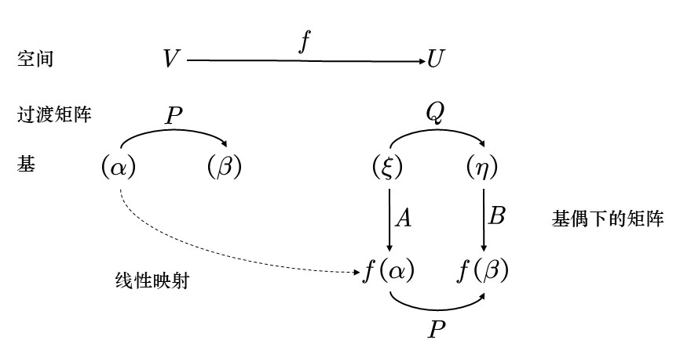

# 工程矩阵

## 工程矩阵的定义

| **定义** | **性质、定理与推论** |
|----------|------------------------|
| **分块矩阵**   $AB = \begin{pmatrix} A_{11} & A_{12} \\ A_{21} & A_{22} \end{pmatrix} \begin{pmatrix} B_{11} & B_{12} \\ B_{21} & B_{22} \end{pmatrix}$    $= (A\beta_1, \beta_2, \cdots, \beta_s) = (A\beta_1, A\beta_2, \cdots, A\beta_s)$ | $\begin{pmatrix} A \\ B \end{pmatrix}^* = (A^*, B^*)$ |
| **矩阵方程组** 设方程组 $Ax = b$, $A = (a_{ij})_{m \times n}$, $b = (b_i)_{m \times 1}$，则有：  (1) 有解 $\Leftrightarrow r(A) = r(A,b)$  (2) 若 $r(A) = r(A,b) = r < n$，则有解且有 $n-r$ 个自由未知量  (3) 若 $r(A) = r(A,b) = r = n$，则有唯一解 | |
| **齐次线性方程组的基础解系** 对齐次线性方程组 $Ax = 0, A = (a_{ij})_{m \times n}$，则有：  (1) 非零解 $\Leftrightarrow r(A) < n$  (2) 若 $r(A) = r < n$，则其基础解系中含有 $n - r$ 个解向量  (3) 若 $r(A) = r < n$，则其任意 $n - r$ 个线性无关的解向量就是其基础解系 | **定理（高斯消元法）**  (1) 用初等行变换将 $A$ 逐步化成阶梯形矩阵  (2) 确定自由未知量  (3) 用回代法找出通解 |
| **极大无关组** 设向量组 $\alpha_1, \alpha_2, \cdots, \alpha_m$ 的所有极大线性无关组 $\alpha_{i_1}, \alpha_{i_2}, \cdots, \alpha_{i_r}$ 满足：  (1) $\alpha_{i_1}, \alpha_{i_2}, \cdots$ 线性无关  (2) $\alpha_1, \alpha_2, \cdots, \alpha_m$ 中每个向量都可由 $\alpha_{i_1}, \alpha_{i_2}, \cdots, \alpha_{i_r}$ 线性表示  则称 $\alpha_{i_1}, \alpha_{i_2}, \cdots, \alpha_{i_r}$ 是 $\alpha_1, \cdots, \alpha_m$ 的一个极大无关组 | **定理**  (1) 若向量组的秩为 $r$，则该向量组中任意 $r$ 个线性无关的向量组是其极大无关组  (2) 如果一向量组的极大无关组中含 $r$ 个向量，则称该向量组的秩为 $r$ |
| **矩阵的等价标准形**  $s \times n$ 矩阵 $A$ 的秩等于 $r$ $\Rightarrow$ 存在可逆矩阵 $P_{s \times s}, Q_{n \times n}$ 使得  $A = P \begin{pmatrix} I_r & 0 \\ 0 & 0 \end{pmatrix} Q$ | |
| **消去分解**  $s \times n$ 矩阵 $A$ 的秩为 $r$，存在 $s \times r$ 矩阵 $B$ 和 $r \times n$ 矩阵 $C$ 使得 $A = BC$，即矩阵的消去分解 | **定理**  (1) $r(A + B) \leq r(A) + r(B)$  (2) $r(AB) \leq r(A), r(B)$  (3) $r(A) + r(B) \leq r\left( \begin{pmatrix} A_{kk}, B_{kk} \end{pmatrix} \right) + n$ |

## 线性空间和线性变换

| **线性空间** | **性质** |
|--------------|----------|
| **线性空间的定义**  线性空间满足下述三个要求建立的八条公理：  (1) 一个数域 $K$，一个非空集合 $V$（V 中的元素称为向量）；  (2) 两个运算：加法：$\forall x, y \in V$, 记作：$x + y \in V$；   数乘运算：$\forall a \in K, x \in V$, 记作：$ax \in V$；  (3) 这两个运算满足如下八条公理：  加法交换律：$\forall \alpha, \beta \in V, \ \alpha + \beta = \beta + \alpha$  加法结合律：$\forall \alpha, \beta, \gamma \in V, \ (\alpha + \beta) + \gamma = \alpha + (\beta + \gamma)$  零元存在性：存在 $0 \in V$, 使得 $\forall \alpha \in V$, 有 $\alpha + 0 = \alpha$  负元存在性：$\forall \alpha \in V$, 存在 $\beta \in V$, 使得 $\alpha + \beta = 0$  数乘结合律：$\forall \lambda \in K, \alpha \in V, \ \lambda \alpha \in V$  乘法结合律：$\forall k_1, k_2 \in K, \forall \alpha \in V$, 有 $k_1(k_2 \alpha) = (k_1 k_2)\alpha$  分配律一：$\forall k \in F, \forall \alpha, \beta \in V$, 有 $k(\alpha + \beta) = k\alpha + k\beta$  分配律二：$\forall k_1, k_2 \in F, \forall \alpha \in V$, 有 $(k_1 + k_2)\alpha = k_1\alpha + k_2\alpha$ | 设 V 是数域 F 上的线性空间，$\forall \alpha, \beta, \gamma \in V, k \in K$，则：  (1) V 中的零元是唯一的，通常记为 0；  (2) 任何一个向量的负向量是唯一的，通常记为 $-a$；  (3) 加法满足消去律：若 $\alpha + \gamma = \beta + \gamma$，则 $\alpha = \beta$；  (4) 若 $\alpha + \beta = 0$ 且 $\alpha = -\beta$，则 $\beta = -\alpha$；  (5) $k \cdot 0 = 0$, $0 \cdot \alpha = 0$；  (6) $(-k)\alpha = -k\alpha$, 特别地, $(-1)\alpha = -\alpha$ |
| **线性相关与线性无关**  设 $\alpha_1, \alpha_2, \cdots, \alpha_n \in V$，若有不全为 0 的数 $k_1, k_2, \cdots, k_n$ 使得 $k_1\alpha_1 + k_2\alpha_2 + \cdots + k_n\alpha_n = 0$，则向量组 $\alpha_1, \alpha_2, \cdots, \alpha_n$ 线性相关。否则，称线性无关。 | **性质**  (1) 若 $n \geq 2$，则 $\alpha_1, \alpha_2, \cdots, \alpha_n$ 线性相关当且仅当存在向量 $\alpha_i$ 使得它可由其余向量线性表示；  (2) 向量 $\alpha_1, \alpha_2, \cdots, \alpha_n$ 能否无关，但 $\alpha_1, \alpha_2, \cdots, \alpha_n, \alpha_{n+1}$ 线性相关，则可知 $\alpha_{n+1}$ 可由前面线性表示，而且，线性表示的方式是唯一的；  **推论**：  (1) 若 $\beta_1, \beta_2, \cdots, \beta_n$ 线性相关，$\alpha_1, \alpha_2, \cdots, \alpha_n$ 线性无关，则 $\beta_1, \cdots, \beta_n$ 不能都由 $\alpha_1, \cdots, \alpha_n$ 线性表示；  (2) 若 $\beta_1, \beta_2, \cdots, \beta_n$ 线性无关，$\alpha_1, \alpha_2, \cdots, \alpha_n$ 线性相关，则 $\alpha_i \neq \beta_i$ |
| **基**  若 $\alpha_1, \alpha_2, \cdots, \alpha_n \in V$ 满足：  (1) 向量组 $\alpha_1, \cdots, \alpha_n$ 线性无关；  (2) $\forall \beta \in V$，均可由 $\alpha_1, \cdots, \alpha_n$ 线性表示；  则称 $\alpha_1, \cdots, \alpha_n$ 是 V 的一组**基**。 | **性质**  (1) 线性空间的基不一定存在，**仅当一个空间由有限向量系生成**，基相当于可以**简明生成**的最简集；  **注意**：  有限维线性空间 $V$ 中任意线性无关向量组均可扩展成基 |
| **维数**  若 V 的某一组基中含 n 个向量，则 V 的任一组基中都含 n 个向量。称 V 是 n 维空间，记为 $\dim V = n$，规定零空间的维数为 0。 | **性质**  若 $\dim V = n$，则 V 中任意 $n + 1$ 个向量线性相关。  **定理**：  若 $\dim V = n$，则 V 中任意 $n$ 个线性无关向量均构成 V 的一组基。 |
| **坐标**  设 $\alpha_1, \alpha_2, \cdots, \alpha_n$ 是 V 的一组基，$\beta \in V$，且 $\beta = x_1\alpha_1 + x_2\alpha_2 + \cdots + x_n\alpha_n$，则称 $(x_1, x_2, \cdots, x_n)$ 是 $\beta$ 在基 $\alpha_1, \cdots, \alpha_n$ 下的坐标。 | **定义**  假设 $\eta_i \in V$ 是基 $\alpha_1, \cdots, \alpha_n$ 下的坐标分析对应关系，及 $X_i$, $i = 1, 2, \cdots, n$，则：  (1) $n = 0 \Rightarrow X = 0$；  (2) 若 $\eta_1 = x_1 \alpha_1 + \cdots + x_n \alpha_n$, 则 $X = (x_1, x_2, \cdots, x_n)^T$；  (3) $\eta_1, \cdots, \eta_n$ 线性相关 $\Leftrightarrow X_1, \cdots, X_n$ 线性相关 |
| **形式记导**  $X = \begin{pmatrix} x_1 \\ x_2 \\ x_3 \end{pmatrix}$ 是在基 $\alpha_1, \alpha_2, \alpha_3$ 下的坐标，  则可形式记成 $\beta = (\alpha_1, \alpha_2, \alpha_3) X$ | **性质**  若 $\beta_i = (\alpha_1, \alpha_2, \cdots, \alpha_n) A$，$\beta_1, \beta_2, \cdots, \beta_n$ 线性无关 $\Leftrightarrow A$ 是可逆矩阵  **性质**：  若有 $(\beta_1, \beta_2, \cdots, \beta_n) = (\alpha_1, \alpha_2, \cdots, \alpha_n) A$    $(\eta_1, \eta_2, \cdots, \eta_n) = (\beta_1, \beta_2, \cdots, \beta_n) B$  则有 $(\eta_1, \eta_2, \cdots, \eta_n) = (\alpha_1, \alpha_2, \cdots, \alpha_n)(AB)$ |
| **过渡矩阵** 设 $\alpha_1, \cdots, \alpha_n$ 和 $\beta_1, \cdots, \beta_n$ 都是 $V$ 的基，且 $(\beta_1, \cdots, \beta_n) = (\alpha_1, \cdots, \alpha_n)A$，则称从基 $\alpha_1, \cdots, \alpha_n$ 到基 $\beta_1, \cdots, \beta_n$ 的矩阵 $A$ 为过渡矩阵。 | (1) 过渡矩阵一定是可逆的 (2) 由 $\beta_1, \cdots, \beta_n$ 到 $\alpha_1, \cdots, \alpha_n$ 的过渡矩阵是 $A^{-1}$ (3) 若 $\beta_1, \cdots, \beta_n$ 到 $\gamma_1, \cdots, \gamma_n$ 的过渡矩阵是 $B$，那么 $\alpha_1, \cdots, \alpha_n$ 到 $\gamma_1, \cdots, \gamma_n$ 的过渡矩阵是 $AB$ **变换公式** 设 $X$ 为 $\eta$ 在基 $\alpha_1, \cdots, \alpha_n$ 下的坐标，$Y$ 在基 $\beta_1, \cdots, \beta_n$ 下的坐标，若 $(\beta_1, \cdots, \beta_n) = (\alpha_1, \cdots, \alpha_n)P$，则 $Y = PX$ |
| **子空间** 设 $V$ 是域 $F$ 上的线性空间，$W$ 是 $V$ 的非空子集。若 $W$ 关于 $V$ 的运算也构成 $F$ 上的线性空间，则称 $W$ 为 $V$ 的子空间，记为 $W \leq V$。 | 子空间与 $V$ 的运算规则相同。 **定理** 设 $W \subseteq V$ 非空，则 $W$ 是 $V$ 的子空间 $\Leftrightarrow$ $W$ 关于线性运算封闭。 |
| **解空间** 设 $A \in F^{m \times n}$，$V = \{\eta \in F^n \mid A\eta = 0\}$ 称为齐次方程组 $A\eta = 0$ 的解空间。 | 基础解系是一组基，维数为$n-r$，解集是一个子空间。 |
| **生成的子空间** 设 $V$ 是 $F$ 上的线性空间，$\alpha_1, \cdots, \alpha_n \in V$，集合 $W = \{\sum k_i \alpha_i \mid k_i \in F\}$ 称为 $\alpha_1, \cdots, \alpha_n$ 生成的子空间，记为 $W = L(\alpha_1, \cdots, \alpha_n)$。 | (1) $W = L(\alpha_1, \cdots, \alpha_n)$ 是 $V$ 的子空间 (2) $L(\alpha_1, \cdots, \alpha_n)$ 的基是 $\alpha_1, \cdots, \alpha_n$ 的极大无关组，即 $\dim L(\alpha_1, \cdots, \alpha_n) = r(\alpha_1, \cdots, \alpha_n)$ $L(\alpha_1, \cdots, \alpha_n)=L(\beta_1, \cdots, \beta_n) \Leftrightarrow$ $\alpha_1, \cdots, \alpha_n$与$\beta_1, \cdots, \beta_n$等价 |
| **子空间的交** $V_1 \cap V_2 = \{\eta \in V \mid \eta \in V_1, \eta \in V_2\}$ | $V_1 \cap V_2$ 仍为 $V$ 的子空间 |
| **子空间的和** $V_1 + V_2 = \{\eta \in V \mid \exists \eta_1 \in V_1, \eta_2 \in V_2, \eta = \eta_1 + \eta_2\}$ | $V_1 + V_2$ 是 $V$ 的子空间 **定理** 若 $V_1 = L(\alpha_1, \cdots, \alpha_s)$，$V_2 = L(\beta_1, \cdots, \beta_t)$，则 $V_1 + V_2 = L(\alpha_1, \cdots, \alpha_s, \beta_1, \cdots, \beta_t)$ **维数公式** $\dim(V_1 + V_2) = \dim V_1 + \dim V_2 - \dim(V_1 \cap V_2)$ |
| **直和** 设 $V_1, V_2 \leq V$，若 $\forall \eta \in V_1 + V_2$，存在唯一的 $\eta_1 \in V_1, \eta_2 \in V_2$，使得 $\eta = \eta_1 + \eta_2$，则称 $V_1 + V_2$ 是 $V$ 的直和，记为 $V_1 \oplus V_2$。 | **定理** 若 $V_1, V_2 \leq V$，则下述条件等价： (1) $V_1 + V_2$ 直和 (2) $0$的表示方式唯一 (3) $V_1 \cap V_2 = \{0\}$ (4) $\dim(V_1 + V_2) = \dim V_1 + \dim V_2$ (5) $V_1, V_2$ 的基合在一起就是 $V_1 + V_2$ 的基 |
| **多个空间的直和** 设 $V_1, V_2, \cdots, V_s \leq V$，若 $\forall \eta \in V_1 + V_2 + \cdots + V_s$，存在唯一的 $\eta_i \in V_i$，使得 $\eta = \sum_{i=1}^s \eta_i$，则称 $V_1 \oplus V_2 \oplus \cdots \oplus V_s$ 是 $V$ 的直和。 | **定理** 若 $V_1, V_2, \cdots, V_s \leq V$，则下述条件等价： (1) $V_1 + V_2 + \cdots + V_s$ 直和 (2) $0$的表示方式唯一 (3) $V_i \cap (\sum_{j \neq i} V_j) = \{0\}$ (4) $\dim(\sum_{i=1}^s V_i) = \sum_{i=1}^s \dim V_i$ (5) $V_1, V_2, \cdots, V_s$ 的基合在一起就是 $V_1 + \cdots + V_s$ 的基 |
| **映射、象、值域** 设 $f: A \to B$ ,$A,B$是两个集合，$f$ 是一个映射，$a \in A$，$f(a)$ 是 $B$ 中的元素，$f$ 的值域记为 $f(A) = \{f(a) \mid a \in A\}$。 | 若 $f(x)=y$，则$y$是$x$的象，则$x$是$y$的原象,$B$在映射 下的全体象记为 $f(A)$，称为$f$的值域。 |
| **恒等变换** 集合 $S$ 到自身的映射 $I: S \to S; x\mapsto x$ 称为 $S$ 上的恒等变换。 | |
| **单射、满射、双射** 设映射 $f: S \to T$。 若 $f(S) = T$，则称 $f$ 是满射； 若由 $f(a) = f(b)$ 必能推得 $a = b$，则称 $f$ 是单射； 若 $f$ 既是满射又是单射，则称 $f$ 是双射。 | **定理** $f: S \to T$ 是双射 $\Leftrightarrow f$ 是可逆映射。 |
| **线性映射** 设 $V, U$ 是数域 $F$ 上的线性空间，若映射 $f: V \to U$ 满足条件：  (1) $\forall v \in V, k \in F, f(kv) = k f(v)$；  (2) $\forall x, y \in V, f(x+y) = f(x) + f(y)$。 则称 $f$ 是从 $V$ 到 $U$ 的线性映射。 从 $V$ 到 $U$ 的线性映射全体记为 $\text{Hom}(V, U)$。 $V$ 到 $V$ 自身的线性映射称为 $V$ 上的线性变换。 | **性质**  (1) $f(0) = 0$  (2) 若 $\alpha_1, \dots, \alpha_n \in V, k_1, \dots, k_n \in F$，则 $f(\sum_{i=1}^n k_i \alpha_i) = \sum_{i=1}^n k_i f(\alpha_i)$  (3) 若 $\alpha_1, \dots, \alpha_n \in V$ 线性相关，则 $f(\alpha_1), \dots, f(\alpha_n) \in U$ 线性相关。 **定理（线性变换的运算）** 设 $f, f' \in \text{Hom}(V, U), g \in \text{Hom}(U, W), k \in F$，定义 $kf, f+f', gf$ 如下：  (1)$kf: V \to U$, $(kf)(x) = k f(x)$；  (2)$f+f': V \to U$, $(f+f')(x) = f(x) + f'(x)$；  (3)$gf: V \to W$, $(gf)(x) = g(f(x))$。 则 $kf, f+f', gf$ 都是线性映射。 |
| **$f$ 的值域** 若 $V = L(\alpha_1, \dots, \alpha_s)$，则 $f$ 的值域为 $R(f) = \{f(v) \mid v \in V\} = L(f(\alpha_1), \dots, f(\alpha_s))$。 | **定理** 设 $f \in \text{Hom}(V, U)$，则 $f$ 是满射 $\Leftrightarrow R(f) = U$。 **定理** 若 $f \in \text{Hom}(V, U)$，在基 $V: \alpha_1, \dots, \alpha_n$; $U: \beta_1, \dots, \beta_s$ 下的矩阵是 $A$，即$(f(\alpha_1),f(\alpha_2),\cdots,f(\alpha_n))=(\beta_1,\beta_2,\cdots,\beta_s)A$，由于 $R(f) = L(f(\alpha_1), \dots, f(\alpha_n))$   $f(\alpha_1), \dots, f(\alpha_n)$ 的极大无关组是 $R(f)$ 的基，且 $\dim R(f) = r(A)$。 |
| **$f$ 的核空间** $K(f) = \{v \in V \mid f(v) = 0\}$ 是 $V$ 的子空间，称为 $f$ 的核空间。 | **定理** 设 $f \in \text{Hom}(V, U)$，则 $f$ 是单射 $\Leftrightarrow K(f) = \{0\}$。 **定理** 若 $f \in \text{Hom}(V, U)$ 在基 $V: \alpha_1, \dots, \alpha_n$; $U: \beta_1, \dots, \beta_s$ 下的矩阵是 $A$，$\eta \in V$ 在 $\alpha_1, \dots, \alpha_n$ 下的坐标是 $X$，则 $f(\eta)$ 在 $\beta_1, \dots, \beta_s$ 下的坐标是 $AX$。因此，$\eta \in K(f) \Leftrightarrow AX = 0$。 从而，若 $X_1, \dots, X_{n-r}$ 是 $AX=0$ 的基础解系，则 $\eta_1, \dots, \eta_{n-r}$ 是 $K(f)$ 的基。$\dim K(f) = n - r(A)$。 **定理（维数定理）** 设 $\dim V < \infty, f \in \text{Hom}(V, U)$，则 $\dim R(f) + \dim K(f) = \dim V$。 **推论** 设 $\dim V < \infty, f \in \text{Hom}(V, V)$，则 $f$ 可逆 $\Leftrightarrow f$ 是单射 $\Leftrightarrow f$ 是满射。 |
| **基下的矩阵** 设 $f \in \text{Hom}(V, U)$，选定基 $V: \alpha_1, \dots, \alpha_n$; $U: \beta_1, \dots, \beta_s$。若 $(f(\alpha_1), f(\alpha_2), \dots, f(\alpha_n)) = (\beta_1, \beta_2, \dots, \beta_s)A$，则称 $A$ 是 $f$ 在选定基下的矩阵。 **特别如果 $U = V$，且 $\alpha_i = \beta_i$，则称 $A$ 是线性变换 $f$ 在所选基下的矩阵。** | **定理** 若 $f \in \text{Hom}(V, U)$ 在基 $V: \alpha_1, \dots, \alpha_n$; $U: \beta_1, \dots, \beta_s$ 下的矩阵是 $A$，$\eta \in V$ 在 $\alpha_1, \dots, \alpha_n$ 下的坐标是 $X$，则 $f(\eta)$ 在 $\beta_1, \dots, \beta_s$ 下的坐标是 $AX$。 **定理** 设 $f \in \text{Hom}(V, U)$ 在基 $V: \alpha_1, \dots, \alpha_n$; $U: \beta_1, \dots, \beta_s$ 下的矩阵是 $A$；在基 $V: \alpha'_1, \dots, \alpha'_n$; $U: \beta'_1, \dots, \beta'_m$ 下的矩阵是 $B$。若从基 $\alpha$ 到基 $\alpha'$ 的过渡矩阵是 $P$，从基 $\beta$ 到基 $\beta'$ 的过渡矩阵是 $Q$，则 $B = Q^{-1}AP$。 **定理** 设 $f \in \text{Hom}(V, V)$ 在基 $\alpha_1, \dots, \alpha_n$ 下的矩阵是 $A$；在基 $\alpha'_1, \dots, \alpha'_n$ 下的矩阵是 $B$。若从基 $\alpha$ 到基 $\alpha'$ 的过渡矩阵是 $P$，则 $B = P^{-1}AP$。 **定理** 设 $f, g \in \text{Hom}(V, V)$ 在 $V$ 的基 $\alpha_1, \dots, \alpha_n$ 下的矩阵分别是 $A, B$，设 $k \in F$，则在该基下：  (1) $kf$ 的矩阵是 $kA$；  (2) $f+g$ 的矩阵是 $A+B$；  (3) $fg$ 的矩阵是 $AB$；  (4) $f$ 可逆 $\Leftrightarrow A$ 可逆，$f^{-1}$ 的矩阵是 $A^{-1}$。 |
| **$f$ 的不变子空间** 设 $f \in \text{Hom}(V,V), W \subseteq V$, 若 $\forall \eta \in W$, 有 $f(\eta) \in W$, 则称 $W$ 是 $f$ 的不变子空间。 | (1) 设 $f \in \text{Hom}(V,V)$, 则 $R(f), K(f)$ 均是 $f$ 的不变子空间 (2) $W$ 是关于 $f$ 的不变子空间, 则 $f\|_W$ 可以看成是 $W$ 上的线性变换; (3) 如果 $V=V_1 \oplus V_2$, 其中, $V_1, V_2$ 都是关于 $f$ 的不变子空间, 则取 $V_1$ 的基 $\alpha_1,\dots,\alpha_s$, 取 $V_2$ 的基 $\alpha_{s+1},\dots,\alpha_n$, 则 $\alpha_1,\dots,\alpha_s,\alpha_{s+1},\dots,\alpha_n$ 是 $V$ 的基,  这组基下, $f$ 的矩阵为 $\begin{pmatrix} A & O \\ O & B \end{pmatrix}$ **定理** 线性变换在不同的基下的矩阵是相似的 |
| **同构** 设 $U,V$ 都是数域 $F$ 上的线性空间。如果 $f \in \text{Hom}(V,U)$ 是双射, 则称 $f$ 是线性空间 $U,V$ 之间的同构映射。 如果 $U,V$ 之间存在同构映射, 则称 $U,V$ 是同构的。记为 $V \cong U$。 | **定理** 设 $f: V \to U$ 是线性空间 $U,V$ 之间的同构, $\alpha_1,\alpha_2,\dots,\alpha_s \in V$, 则 $\alpha_1,\alpha_2,\dots,\alpha_s$ 线性相关当且仅当 $f(\alpha_1), f(\alpha_2), \dots, f(\alpha_s) \in U$ 线性相关。 **定理** 设 $U,V$ 都是数域 $F$ 上的线性空间, 则 $V \cong U$ 当且仅当 $\dim V = \dim U$。 |

## 内积空间和等距变换