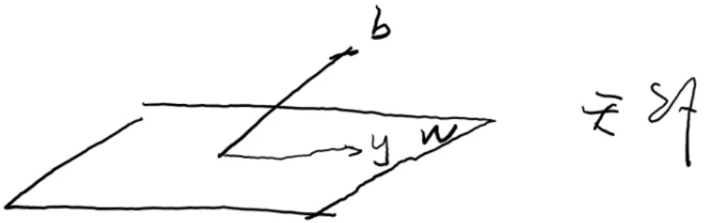

## 正交、投影、标准正交

**内积**

定义：假设 $V$ 是数域 $\mathbb {F}$ 上的线性空间，在 $V$ 上定义了一个二元函数 $\left<\alpha, \beta\right>$，若

1.  $\forall \alpha\neq 0\in V,\left<\alpha,\alpha\right>>0$
2.  $\forall \alpha,\beta,\gamma \in V,\left<\alpha+\beta,\gamma\right>=\left<\alpha,\gamma\right>+\left<\beta,\gamma\right>$
3.  $\forall\alpha,\beta\in V,k\in \mathbb{F},\left<k\alpha,\beta\right>=k\left<\alpha,\beta\right>$
4.  $\left<\alpha,\beta\right>=\overline{\left<\beta,\alpha\right>}$

则称 $\left<\alpha,\beta\right>$ 是 $\alpha,\beta$ 的内积。定义了内积的线性空间称为内积空间

当 $\mathbb {F}=\mathbb {R}$ 时，称 $V$ 是欧式空间；当 $\mathbb {F}=\mathbb {C}$ 时，称 $V$ 是酉空间

**内积的性质**

1.  $\left<\alpha, \beta+\gamma\right>=\left<\alpha,\beta\right>+\left<\alpha,\gamma\right>$
2.  $\left<\alpha,k\beta\right>=\overline{k}\left<\alpha,\beta\right>$
3.  $\left<\sum_{i=1}^s k_i\alpha_i, \sum_{j=1}^t l_j\beta_j\right>=\sum_{i=1}^s\sum_{j=1}^tk_i\overline{l_j}\left<\alpha_i,\beta_j\right>$
4.  $\forall \alpha\in V,\left<\alpha, 0\right>=\left<0,\alpha\right>=0$

现证明性质 (2)

$$
\begin{aligned}
\because \left<\alpha, k\beta\right>&=\overline{\left<k\beta, \alpha\right>}\\
&=\overline{k\left<\beta,\alpha\right>}\\
&=\overline{k}·\overline{\left<\beta,\alpha\right>}\\
&=\overline{k}\left<\alpha,\beta\right>
\end{aligned}
$$

___

**内积的简易表示 —— 度量矩阵**

设 $\epsilon_1,\epsilon_2,...,\epsilon_n$ 是 $V$ 的一组基，$\alpha,\beta\in V$ 的坐标是

$$
X = (x_1,x_2,...,x_n)^T,Y=(y_1,y_2,...,y_n)^T
$$

即

$$
\alpha = (\epsilon_1,\epsilon_2,...,\epsilon_n)X\\
\beta=(\epsilon_1,\epsilon_2,...,\epsilon_n)Y
$$

则 $\left<\alpha,\beta\right>=\sum_{i=1}^n\sum_{j=1}^nx_i\overline {y_j}\left<\epsilon_i,\epsilon_j\right>=X^TA\overline {Y}$

其中，$A=\begin {bmatrix}\left<\epsilon_1,\epsilon_1\right>&\left<\epsilon_1,\epsilon_2\right>&\cdots &\left<\epsilon_1,\epsilon_n\right>\\\left<\epsilon_2,\epsilon_1\right>&\left<\epsilon_2,\epsilon_2\right>&\cdots &\left<\epsilon_2,\epsilon_1\right>\\\vdots & \vdots & \ddots & \vdots \\\left<\epsilon_n,\epsilon_1\right>&\left<\epsilon_n,\epsilon_2\right>&\cdots &\left<\epsilon_n,\epsilon_n\right>\end {bmatrix}_{n\times n}$，并称 $A$ 是 $V$ 在基 $\epsilon_1,\epsilon_2,...,\epsilon_n$ 下的**度量矩阵**

**度量矩阵的特点**

若 $\mathbb {F}=\mathbb {R}$，则 $A=A^T$，即 $\left<\epsilon_i,\epsilon_j\right>=\left<\epsilon_j,\epsilon_i\right>$

若 $\mathbb {F}=\mathbb {C}$，则 $A=A^H$，即 $\left<\epsilon_i,\epsilon_j\right>=\overline {\left<\epsilon_j,\epsilon_i\right>}$

___

**内积空间的度量**

$V$ 是内积空间，定义向量长度（模）为

$$
||\alpha||=\sqrt{\left<\alpha, \alpha\right>}
$$

**长度的性质**

1.  非负性：$||\alpha||≥0$，当且仅当 $\alpha=0$ 时，$||\alpha||=0$
2.  正齐次性：$||k\alpha||=|k|・||\alpha||$，$k$ 为任意数
3.  三角不等式：$|\left<\alpha,\beta \right>|≤||\alpha||・||\beta||,\ |\left< \alpha,\beta \right>|=||\alpha||・||\beta||\Leftrightarrow\alpha,\beta$ 线性相关
4.  Cauchy-Schwarz 不等式：$|\left<\alpha,\beta\right>|≤||\alpha||・||\beta||,\ |\left< \alpha,\beta \right>|=||\alpha||・||\beta||\Leftrightarrow\alpha,\beta$ 线性相关
5.  平行四边形公式：$||\alpha+\beta||^2+||\alpha-\beta||^2=2 (||\alpha||^2+||\beta||^2)$

___

**距离**

$V$ 是内积空间，定义向量之间的距离为

$$
d(\alpha,\beta)=||\alpha-\beta||
$$

**距离的性质**

1.  对称性：$d (\alpha,\beta)=d (\beta, \alpha)$
2.  非负性：$d (\alpha,\beta)≥0,\ d (\alpha,\beta)=0\Leftrightarrow \alpha=\beta$
3.  三角不等式：$d (\alpha,\beta)≤d (\alpha,\gamma)+d (\gamma, \beta)$

___

**夹角**

（对于**实内积空间**）由 Cauchy-Schwarz 不等式 $|\left<\alpha,\beta \right>|≤||\alpha||・||\beta||\Rightarrow$ 若 $\alpha \neq 0,\beta \neq 0$，则

$$
-1≤\frac{\left< \alpha,\beta \right>}{||\alpha||·||\beta||}≤1
$$

若 $\alpha \neq 0, \beta \neq 0$，定义 $\alpha,\beta$ 的夹角为 $\arccos\frac {\left< \alpha,\beta \right>}{||\alpha||・||\beta||}$

___

**正交**

（对于**所有内积空间**）若 $\left<\alpha,\beta \right>=0$，称向量 $\alpha,\beta$ 正交（垂直），记为 $\alpha \perp \beta$，并且 $\forall \alpha \in V$，都有 $0 \perp \alpha$

设 $W$ 是 $V$ 的子空间，$\alpha \in V$，若 $\forall \beta \in W$，都有 $\alpha \perp \beta$，则称 $\alpha$ 垂直于 $W$，记为 $\alpha \perp W$

**勾股定理**

若 $\alpha \neq 0, \beta \neq 0$，且 $\alpha \perp \beta$，则

$$
||\alpha \pm \beta||^2=||\alpha||^2+||\beta||^2
$$

___

**投影定理**

设 $V$ 是内积空间，$W$ 是 $V$ 的一个有限维子空间，则 $\forall \alpha \in V$

1.  存在唯一的 $\beta \in W$，使得对于 $\forall \gamma \in W$，有 $d (\alpha, \beta)≤d (\alpha, \gamma)$
2.  如果 $\beta_1,...,\beta_m$ 是 $W$ 的基，则在该基下的坐标是 $G^{-1}(\beta_1,...,\beta_m) G (\beta_1,...,\beta_m;\alpha)$，其中 $G (\beta_1,...,\beta_m;\alpha)=\begin {bmatrix}\left< \beta_1,\alpha\right> \\ \left< \beta_2,\alpha \right>\\\vdots \\\left< \beta_m,\alpha \right>\end {bmatrix}$

称满足上述形式的 $\beta$ 为 $\alpha$ 在 $W$ 上的投影

**第二个定理的证明：**设 $\beta_1,...,\beta_m$ 是 $W$ 的基，$\beta$ 是 $\alpha$ 在 $W$ 上的投影，$\beta$ 在 $\beta_1,...,\beta_m$ 确定的基下的坐标为 $x=[x_1,...,x_m]^T$

$$
\begin{aligned}
\because\  &\alpha-\beta \perp W\\
\therefore\  &\alpha-\beta \perp \beta_i\ (i=1,...,m)\\
\Rightarrow\  &\left<\alpha-\beta, \beta_i\right>=0\\
\Rightarrow\ &\left<\alpha, \beta_i\right>=\left<\beta, \beta_i\right>\\
\Rightarrow\ &\left<\beta_i, \beta\right>=\left<\beta_i, \alpha\right>\\
\Rightarrow\ &x_1\left<\beta_i, \beta_1\right>+···x_m\left<\beta_i, \beta_m\right>=\left<\beta_i, \alpha\right>\\
\Rightarrow &\begin{bmatrix}\left<\beta_1, \beta_1\right>&\cdots & \left<\beta_1, \beta_m\right> \\ &\ddots &\\ \left<\beta_m, \beta_1\right>& \cdots & \left<\beta_m, \beta_m\right>\end{bmatrix}\begin{bmatrix}x_1\\ \vdots \\ x_m\end{bmatrix}= \begin{bmatrix}\left<\beta_1, \alpha\right> \\ \vdots \\\left<\beta_m, \alpha\right> \end{bmatrix}\\
\Rightarrow\ &G(\beta_1,...,\beta_m)x=G(\beta_1,...,\beta_m;\alpha)
\end{aligned}
$$

因为 $\beta_1,...,\beta_m$ 线性无关，所以 $G (\beta_1,...,\beta_m)$ 可逆，则 $x=G^{-1}(\beta_1,...,\beta_m) G (\beta_1,...,\beta_m;\alpha)$

___

**最小二乘问题**

$x_1,...,x_n$ 是 $n$ 个自变量，$y$ 是因变量，假设 $x_1,...,x_n$ 和 $y$ 满足线性关系

$$
y\approx a_1x_1+···+a_nx_n
$$

现有观测值

$$
\begin{array}{c|ccc}
x_{1} & x_{11} & \cdots & x_{s 1} \\
\vdots & \vdots & \cdots & \vdots \\
x_{n} & x_{1 n} & \cdots & x_{s n} \\
\hline y & y_{1} & \cdots & y_{s}
\end{array}
$$

求 $a_1,...,a_n$

**解：**令 $A=\begin {bmatrix} x_{11} &\cdots &x_{1n}\\ &\ddots \\x_{s1} &\cdots &x_{sn}\end {bmatrix}\triangleq \begin {bmatrix}\alpha_1,...,\alpha_m\end {bmatrix}$

$b=\begin {bmatrix} y_1\\ \vdots \\y_s\end {bmatrix}, x=\begin {bmatrix} a_1\\ \vdots \\a_s\end {bmatrix}$，则问题转为求 $Ax=b$

$W=\text {span}\{\alpha_1,...,\alpha_n\}$ 是一个子空间，$b\in \mathbb {R}^s$

当 $b \in W$ 时，$Ax=b$ 有解；当 $b \notin W$ 时，$Ax=b$ 无解，此时问题转为求 $x$，使 $Ax=y$ 为 $b$ 在 $W$ 中的投影（如下图所示），因为这样可以使得 $d (b, Ax)$ 最小

$b-y\perp W=\text {span}\{\alpha_1,...,\alpha_n\}$，所以 $b-Ax\perp \alpha_i\ (i=1,...,n)$

则

$$
\begin{aligned}
\left< \alpha_i,b-Ax \right>=0\\
\Rightarrow \left< \alpha_i,b \right>=\left< \alpha_i,Ax \right>&=\left< \alpha_i,a_1\alpha_1+···+a_n\alpha_n \right>a_n\\
&=a_1\left< \alpha_i,\alpha_1 \right>+···+a_n\left< \alpha_i,\alpha_n \right>\ (i=1,...,n)\\
\Rightarrow &\begin{bmatrix}\left< \alpha_1,\alpha_1 \right>&\cdots&\left< \alpha_1,\alpha_n \right>\\ &\ddots&\\\left< \alpha_n,\alpha_1 \right>&\cdots &\left< \alpha_n,\alpha_n \right>\end{bmatrix}\begin{bmatrix}a_1\\ \vdots \\ a_n\end{bmatrix}=\begin{bmatrix}\left< \alpha_1,b \right>\\ \vdots \\ \left< \alpha_n,b \right>\end{bmatrix}\\
\Rightarrow &G(\alpha_1,...,\alpha_n)x=G(\alpha_1,...,\alpha_n;b)
\end{aligned}
$$

由于 $\{\alpha_1,...,\alpha_n\}$ 不一定可逆，因此不能直接推出 $x=G^{-1}(\alpha_1,...,\alpha_n) G (\alpha_1,...,\alpha_n;b)$

但是

$$
\begin{aligned}
&G(\alpha_1,...,\alpha_n)x=G(\alpha_1,...,\alpha_n;b)\\
\Rightarrow \ & A^HAx=A^Hb
\end{aligned}
$$

$$
\because \mathrm {rank}(A^HA\vdots A^Hb)=\mathrm {rank}(A^H (A\vdots b))≤\mathrm {rank}(A^H)=\mathrm {rank}(A^HA)\\
\therefore A^HAx=A^Hb\ 必有解
$$

我们暂时无法求出最优解，所以到此为止

___

**（标准）正交组**

$\alpha_1,...,\alpha_s$ 是内积空间 $V$ 中的向量组，如果

1.  $||\alpha_i||=1\ (i=1,...,s)$
2.  $\left< \alpha_i,\alpha_j \right>=0\ (i\neq j)$

则称 $\alpha_1,...,\alpha_s$ 为**标准正交向量组**，若只满足条件 2，则称 $\alpha_1,...,\alpha_s$ 为**正交向量组**

**标准正交向量组的性质**

1.  $G(\alpha_1,...,\alpha_s)=I_s$
2.  $\alpha_1,...,\alpha_s$ 线性无关

___

**（标准）正交基**

正交向量组的基称为是**正交基**，标准正交向量组的基称为是**标准正交基**

**标准正交基下的运算**

设 $\epsilon_1,\epsilon_2,...,\epsilon_n$ 是 $V$ 的标准正交基，$\alpha,\beta\in V$ 在 $\epsilon_1,\epsilon_2,...,\epsilon_n$ 下的坐标是 $X,Y$，则

$$
\left<\alpha,\beta\right>=X^TA\overline{Y}=X^T\overline{Y}
$$

因为 $X^T\overline {Y}=Y^HX$，所以 $\left<\alpha,\beta\right>=Y^HX=\left<X,Y\right>$

**schmidit 正交化**

前面讨论拥有了标准正交向量基之后，向量之间的运算表示会得到很大的简化。因此，若给定了任意一组基，我们希望它是标准正交的

设给定的一组基 $\alpha_1,\alpha_2,...,\alpha_s\in V$ 是线性无关的，将其正交化得到的基为 $\beta_1,\beta_2,...,\beta_s$，则有

$$
\begin{aligned}
\beta_1&=\alpha_1\\
\beta_2&=\alpha_2-\frac{\left<\alpha_2,\beta_1\right>}{\left<\beta_1,\beta_1\right>}\beta_1\\
\beta_3&=\alpha_3-\frac{\left<\alpha_3,\beta_2\right>}{\left<\beta_2,\beta_2\right>}\beta_2-\frac{\left<\alpha_3,\beta_1\right>}{\left<\beta_1,\beta_1\right>}\beta_1\\
\vdots\\
\beta_s&=\alpha_s-\frac{\left<\alpha_s,\beta_{s-1}\right>}{\left<\beta_{s-1},\beta_{s-1}\right>}\beta_{s-1}-···-\frac{\left<\alpha_s,\beta_1\right>}{\left<\beta_1,\beta_1\right>}\beta_1
\end{aligned}
$$

**单位化**

$$
\gamma_i=\frac{1}{||\beta_i||}\beta_i, \quad{i=1,2,...,s}
$$

___

例 1

设 $V$ 在基 $\epsilon_1,\epsilon_2$ 下的度量矩阵是 $A=\begin {bmatrix} 1&2\\2&5\end {bmatrix}$，求 $V$ 的一组标准正交基

**解：**首先正交化，令

$$
\begin{aligned}
\beta_1&=\epsilon_1\\
\beta_2&=\epsilon_2-\frac{\left<\epsilon_2,\beta_1\right>}{\left<\beta_1,\beta_1\right>}\beta_1
\end{aligned}
$$

因为矩阵 $A$ 的第 1 行第 1 列的值表示的含义是 $\left<\epsilon_1,\epsilon_1\right>=1$，所以

$$
\beta_2=\epsilon_2-\frac{\left<\epsilon_2,\epsilon_1\right>}{\left<\epsilon_1,\epsilon_1\right>}\epsilon_1=\epsilon_2-2\epsilon_1
$$

单位化，令

$$
\begin{aligned}
\gamma_1&=\frac{1}{||\beta_1||}\beta_1=\frac{1}{\sqrt{\left<\epsilon_1,\epsilon_1\right>}}\beta_1=\beta_1=\epsilon_1\\
\gamma_2&=\frac{1}{||\beta_2||}\beta_2=\frac{1}{\sqrt{\left<\beta_2,\beta_2\right>}}\beta_2
\end{aligned}
$$

因为 $\beta_2=\epsilon_2-2\epsilon_1$ 在基 $\epsilon_1,\epsilon_2$ 下的坐标是 $\begin {bmatrix}-2\\1\end {bmatrix}$，根据度量矩阵的定义有

$$
\left<\beta_2,\beta_2\right>=\begin{bmatrix}-2&1\end{bmatrix}\begin{bmatrix}1&2\\2&5\end{bmatrix}\begin{bmatrix}-2\\1\end{bmatrix}=1
$$

故 $V$ 的一组标准正交基是 $\epsilon_1,\epsilon_2-2\epsilon_1$

___

例 2

已知 $A = \begin {bmatrix} 2&1&-1&1&-3\\1&1&-1&0&1\end {bmatrix}$，求 $\mathcal {N}(A)$ 的标准正交基

**解：**根据核空间的定义可知 $\mathcal {N}(A)$ 是方程组 $\begin {bmatrix} 2&1&-1&1&-3\\1&1&-1&0&1\end {bmatrix}\begin {bmatrix} x_1\\x_2\\x_3\\x_4\\x_5\end {bmatrix}=0$ 的解空间，解得它的基础解系为

$$
\alpha_1=[0,1,1,0,0]^T\\
\alpha_2 = [-1,1,0,1,0]^T\\
\alpha_3 = [4,-5,0,0,1]^T
$$

故 $\mathcal {N}(A)=\text {span}\{\alpha_1,\alpha_2,\alpha_3\}$

首先正交化得

$$
\begin{aligned}
\beta_1 &= \alpha_1 = [0,1,1,0,0]^T\\
\beta_2 &= \alpha_2 - \frac{(\alpha_2,\beta_1)}{(\beta_1,\beta_1)}\beta_1=\alpha_2-\frac{1}{2}\beta_1\\
&=[-1,\frac{1}{2},-\frac{1}{2},1,0]^T\\
\beta_3 &=\alpha_3 - \frac{(\alpha_3,\beta_1)}{(\beta_1,\beta_1)}\beta_1-\frac{(\alpha_3,\beta_2)}{(\beta_2,\beta_2)}\beta_2\\
&=\alpha_3-\frac{-5}{2}\beta_1+\frac{13}{5}\beta_2=[\frac{7}{5}, -\frac{6}{5},\frac{6}{5},\frac{13}{5},1]^T
\end{aligned}
$$

然后将 $\beta_1,\beta_2,\beta_3$ 单位化后得

$$
\begin{aligned}
\gamma_1&=\frac{\beta_1}{||\beta_1||}=[0,\frac{1}{\sqrt{2}},\frac{1}{\sqrt{2}},0,0]^T\\
\gamma_2 &= \frac{\beta_2}{||\beta_2||}=[-\frac{\sqrt{10}}{5},\frac{\sqrt{10}}{10},-\frac{\sqrt{10}}{10},\frac{\sqrt{10}}{5},0]^T\\
\gamma_3 &= [\frac{7}{\sqrt{315}},-\frac{6}{\sqrt{315}},\frac{6}{\sqrt{315}},\frac{13}{\sqrt{315}},\frac{5}{\sqrt{315}}]^T
\end{aligned}
$$

所以 $\gamma_1,\gamma_2,\gamma_3$ 即为 $\mathcal {N}(A)$ 的标准正交基

___

例 3

在 $V=R_3 [x]$ 中定义内积：$\left<f (x),g (x)\right>=\int_{-1}^1f (x) g (x) dx$，求 $V$ 在基 $\alpha_1=1,\alpha_2=x,\alpha_3=x^2$ 下的一组标准正交基

**解：**首先正交化，令

$$
\begin{aligned}
\beta_1&=\alpha_1\\
\beta_2&=\alpha_2-\frac{\left<\alpha_2,\beta_1\right>}{\left<\beta_1,\beta_1\right>}\beta_1\\
\beta_3&=\alpha_3-\frac{\left<\alpha_3,\beta_2\right>}{\left<\beta_2,\beta_2\right>}\beta_2-\frac{\left<\alpha_3,\beta_1\right>}{\left<\beta_1,\beta_1\right>}\beta_1
\end{aligned}
$$

因为

$$
\begin{aligned}
\left<\alpha_2,\beta_1\right>&=\int_{-1}^1x·1dx=0\\
\left<\alpha_3,\beta_2\right>&=\int_{-1}^1x^2·xdx=0\\
\left<\alpha_3,\beta_1\right>&=\int_{-1}^1x^2·1dx=\frac{2}{3}\\
\left<\beta_1,\beta_1\right>&=\int_{-1}^11·1dx=2
\end{aligned}
$$

故

$$
\begin{aligned}
\beta_1&=\alpha_1=1\\
\beta_2&=\alpha_2=x\\
\beta_3&=x^2-\frac{1}{3}\\
\end{aligned}
$$

单位化，令

$$
\gamma_1=\frac{1}{||\beta_1||}\beta_1\\
\gamma_2=\frac{1}{||\beta_2||}\beta_2\\
\gamma_3=\frac{1}{||\beta_3||}\beta_3
$$