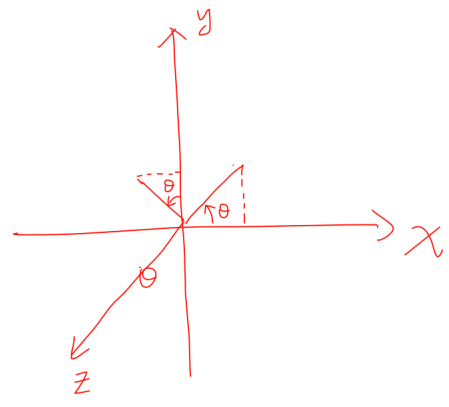

## 矩阵等价与线性映射的最简表示

**矩阵等价**

矩阵 $A\cong B$ 的充分必要条件是存在 $m$ 阶可逆矩阵 $P$ 及 $n$ 阶可逆矩阵 $Q$，使 $PAQ=B$

___

**线性映射的最简表示**

在指定了空间 $V_1$ 与 $V_2$ 的基之后，便可以求得线性映射 $\mathscr {A}:V_1\to V_2$ 在指定一对基下的矩阵表示。但是空间基是不唯一的，自然应该考虑以下两个问题：

1.  线性映射在不同对基下的矩阵表示之间有什么关系？
2.  对一个线性映射，能否选择一对基，使它的矩阵表示最简单（零多）？

先回答第一个问题

设 $\mathscr {A}$ 是 $V_1\to V_2$ 的一个线性映射，$\alpha_1,\alpha_2,...,\alpha_n$ 与 $\alpha^{\prime}_1,\alpha^{\prime}_2,...,\alpha^{\prime}_n$ 是 $V_1$ 的两组基，由 $\alpha_i$ 到 $\alpha^{\prime}_i$ 的过渡矩阵为 $P$。设 $\beta_1,\beta_2,...,\beta_m$ 与 $\beta^{\prime}_1,\beta^{\prime}_2,...,\beta^{\prime}_m$ 是 $V_2$ 的两组基，由 $\beta_j$ 到 $\beta^{'}_j$ 的过渡矩阵为 $Q$。线性映射 $\mathscr {A}$ 在基 $\alpha_1,\alpha_2,...,\alpha_n$ 与 $\beta_1,\beta_2,...,\beta_m$ 下的矩阵表示为 $A$，在基 $\alpha^{\prime}_1,\alpha^{\prime}_2,...,\alpha^{\prime}_n$ 与 $\beta^{\prime}_1,\beta^{\prime}_2,...,\beta^{\prime}_m$ 下的矩阵表示为 $B$，则

$$
B = Q^{-1}AP
$$

**证明：**

由假设条件知

$$
\begin{gather}
\mathscr{A}(\alpha_1,\alpha_2,...,\alpha_n)=(\beta_1,\beta_2,...,\beta_m)A \tag{1}\\
\mathscr{A}(\alpha^{\prime}_1,\alpha^{\prime}_2,...,\alpha^{\prime}_n)=(\beta^{\prime}_1,\beta^{\prime}_2,...,\beta^{\prime}_m)B \tag{2}\\
(\alpha^{\prime}_1,\alpha^{\prime}_2,...,\alpha^{\prime}_n)=(\alpha_1,\alpha_2,...,\alpha_n)P \tag{3}\\
(\beta^{\prime}_1,\beta^{\prime}_2,...,\beta^{\prime}_m)=(\beta_1,\beta_2,...,\beta_m)Q \tag{4}
\end{gather}
$$

将式 $(3)$ 和式 $(4)$ 带入式 $(2)$ 得

$$
\begin{gather}
\mathscr{A}(\alpha_1,\alpha_2,...,\alpha_n)P=(\beta_1,\beta_2,..,\beta_m)QB \tag{5}
\end{gather}
$$

将式 $(1)$ 带入式 $(5)$ 得

$$
\begin{aligned}
(\beta_1,\beta_2,...,\beta_m)AP=(\beta_1,\beta_2,...,\beta_m)QB
\end{aligned}
$$

因为 $(\beta_1,\beta_2,...,\beta_m)$ 线性无关，故

$$
AP=QB
$$

由于 $Q$ 是满秩方阵（因为[过渡矩阵](#基与坐标)都是满秩的），所以

$$
B = Q^{-1}AP \tag{6}
$$

回答第二个问题

大学线性代数中有这么一个结论：对于 $m\times n$ 矩阵 $A$，总可经过初等变换（行变换和列变换）把它化为标准形

$$
Q^{-1}AP=\begin{bmatrix}E_r& 0_{r\times (n-r)}\\0_{(m-r)\times r}&0_{(m-r)\times (n-r)}\end{bmatrix}_{m\times n},\  r = \mathrm{rank}(A)
$$

将式 $(6)$ 带入式 $(2)$ 得

$$
\begin{aligned}
\mathscr{A}(\alpha^{\prime}_1,\alpha^{\prime}_2,...,\alpha^{\prime}_n)&=(\beta^{\prime}_1,\beta^{\prime}_2,...,\beta^{\prime}_m)Q^{-1}AP\\
&=(\beta^{\prime}_1,\beta^{\prime}_2,...,\beta^{\prime}_m)\begin{bmatrix}E_r& 0_{r\times (n-r)}\\0_{(m-r)\times r}&0_{(m-r)\times (n-r)}\end{bmatrix}_{m\times n}
\end{aligned}
$$

所以，对于一个线性映射，一定可以找到一对基，使得线性映射对应的矩阵最简单

___

**线性变换**

接下来的线性映射 $\mathscr {A}$ 都是指线性空间 $V$ 到 $V$ 的映射，特称这样的 $\mathscr {A}$ 为线性空间 $V$ 的**线性变换**。由于线性变换时线性空间 $V$ 到它自身的映射，所以只需取 $V$ 的一组基 $\alpha_1,\alpha_2,...,\alpha_n$ 即可

设 $\alpha = \begin {bmatrix}\alpha_1,\alpha_2,...,\alpha_n\end {bmatrix}\begin {bmatrix} x_1\\x_2\\ \vdots x_n\end {bmatrix} \in V$，若

$$
\mathscr{A}(\alpha) = \begin{bmatrix}\alpha_1, \alpha_2,...,\alpha_n\end{bmatrix}\begin{bmatrix}y_1\\ y_2 \\ \vdots \\ y_n\end{bmatrix}
$$

则原像 $\alpha$ 与像 $\mathscr {A}(\alpha)$ 的坐标变换公式为

$$
\begin{bmatrix}y_1\\y_2\\ \vdots \\ y_n\end{bmatrix}=A\begin{bmatrix}x_1 \\ x_2 \\ \vdots \\ x_n\end{bmatrix} \tag{7}
$$

___

例 1

设 $\mathbb {R}^3$ 中线性变换 $\mathscr {A}$ 将基

$$
\alpha_1 = \begin{bmatrix}1\\1\\-1\end{bmatrix}, \alpha_2=\begin{bmatrix}0\\2\\-1\end{bmatrix},\alpha_3=\begin{bmatrix}1\\0\\-1\end{bmatrix}
$$

变为基

$$
\alpha^{\prime}_1 = \begin{bmatrix}1\\-1\\0\end{bmatrix}, \alpha^{\prime}_2=\begin{bmatrix}0\\1\\-1\end{bmatrix},\alpha^{\prime}_3=\begin{bmatrix}0\\3\\-2\end{bmatrix}
$$

1.  求 $\mathscr {A}$ 在基 $\alpha_1,\alpha_2,\alpha_3$ 下的矩阵表示 $A$
2.  求向量 $\xi=(1,2,3)^T$ 及 $\mathscr {A}(\xi)$ 在基 $\alpha_1, \alpha_2,\alpha_3$ 下的坐标
3.  求向量 $\xi$ 及 $\mathscr {A}(\xi)$ 在基 $\alpha^{\prime}_1,\alpha^{\prime}_2,\alpha^{\prime}_3$ 下的坐标

**解：**（1）

$$
\because \mathscr{A}(\alpha_1,\alpha_2,\alpha_3)=(\alpha_1,\alpha_2,\alpha_3)A=(\alpha^{\prime}_1,\alpha^{\prime}_2,\alpha^{\prime}_3)\\
\therefore A = (\alpha_1,\alpha_2,\alpha_3)^{-1}(\alpha^{\prime}_1,\alpha^{\prime}_2,\alpha^{\prime}_3)=\begin{bmatrix}1&-1&-1\\-1&1&2\\0&1&1\end{bmatrix}
$$

（2）

设 $\xi=\begin {bmatrix}\alpha_1,\alpha_2,\alpha_3\end {bmatrix}\begin {bmatrix} k_1\\k_2\\k_3\end {bmatrix}$，即

$$
\begin{bmatrix}1\\2\\3\end{bmatrix}=\begin{bmatrix}1&0&1\\1&2&0\\-1&-1&-1\end{bmatrix}\begin{bmatrix}k_1\\k_2\\k_3\end{bmatrix}
$$

解得

$$
k_1 = 10, k_2=-4,k_3=-9
$$

所以 $\xi$ 在基 $\alpha_1,\alpha_2,\alpha_3$ 下的坐标为 $(10,-4,-9)^T$

$\mathscr {A}(\xi)$ 在基 $\alpha_1,\alpha_2,\alpha_3$ 下的坐标可由公式 $(7)$ 得

$$
\begin{bmatrix}y_1\\y_2\\y_3\end{bmatrix}=\begin{bmatrix}1&-1&-1\\-1&1&2\\0&1&1\end{bmatrix}\begin{bmatrix}10\\-4\\-9\end{bmatrix}=\begin{bmatrix}23\\-32\\-13\end{bmatrix}
$$

（3）

设 $\xi=[\alpha_1,\alpha_2,\alpha_3]\begin {bmatrix} x_1\\x_2\\x_3\end {bmatrix}$，即

$$
\begin{bmatrix}1\\2\\3\end{bmatrix}=\begin{bmatrix}1&0&0\\-1&1&3\\0&-1&-2\end{bmatrix}\begin{bmatrix}x_1\\x_2\\x_3\end{bmatrix}\Rightarrow \begin{bmatrix}x_1\\x_2\\x_3\end{bmatrix}=\begin{bmatrix}1\\-15\\6\end{bmatrix}
$$

$\mathscr {A}(\xi)$ 在基 $\alpha_1,\alpha_2,\alpha_3$ 下的坐标可由公式 $(7)$ 得

$$
\begin{bmatrix}y_1\\y_2\\y_3\end{bmatrix}=\begin{bmatrix}1&-1&-1\\-1&1&2\\0&1&1\end{bmatrix}\begin{bmatrix}1\\-15\\6\end{bmatrix}=\begin{bmatrix}10\\-4\\-9\end{bmatrix}
$$

___

例 2

求线性空间 $\mathbb {R}^3$ 绕指定了正方向的固定轴旋转角度 $\theta$ 的变换 $\mathscr {A}$ 的矩阵表示

**解：**以 $O$ 为起点沿旋转轴正方向取单位长有向线段，记为 $e_z$，再取以 $O$ 为起点的另两单位长有向线段 $e_x,e_y$，使得 $e_x,e_y,e_z$ 构成线性空间 $V$ 中的右手直角坐标系。入口基和出口基都选为 $e_x,e_y,e_z$

$$
\mathscr{A}(e_x,e_y,e_z)=\begin{bmatrix}e_x&e_y&e_z\end{bmatrix}\begin{bmatrix}\cos\theta&-\sin\theta&0\\\sin\theta&\cos\theta&0\\0&0&1\end{bmatrix}
$$

因此 $\mathscr {A}$ 的矩阵表示为 $\begin {bmatrix}\cos\theta&-\sin\theta&0\\\sin\theta&\cos\theta&0\\0&0&1\end {bmatrix}$

___

例 3

求几何空间中以 $XOY$ 面为镜面反射变换 $\mathscr {B}$ 的矩阵表示

**解：**

$$
\begin{aligned}
\mathscr{B}(e_x,e_y,e_z)&=\begin{bmatrix}e_x&e_y&-e_z\end{bmatrix}\\
&=\begin{bmatrix}e_x&e_y&e_z\end{bmatrix}\begin{bmatrix}1&0&0\\0&1&0\\0&0&-1\end{bmatrix}
\end{aligned}
$$

因此 $\mathscr {B}$ 的矩阵表示为 $\begin {bmatrix} 1&0&0\\0&1&0\\0&0&-1\end {bmatrix}$

**线性变换的运算**

设 $\mathscr {A},\mathscr {B}$ 是线性空间 $V$ 的两个线性变换，$\lambda \in \mathbb {F}$

1.  加法：$(\mathscr {A}+\mathscr {B})(\alpha)=\mathscr {A}(\alpha)+\mathscr {B}(\alpha)$
2.  乘法：$\mathscr {AB}(\alpha)=\mathscr {A}(\mathscr {B}(\alpha))$
3.  数乘：$(\lambda\mathscr {A})(\alpha)=\lambda \mathscr {A}(\alpha)$
4.  可逆：设 $\mathscr {A}\mathscr {B}=\mathscr {B}\mathscr {A}=E$，其中 $E$ 为恒等变换，这时变换 $\mathscr {B}$ 称为 $\mathscr {A}$ 的**拟变换**，记为 $\mathscr {A}^{-1}$

**问题：**对于一般的线性映射，能否定义加法、乘法、数乘？

很明显加法和数乘都可以，乘法不行（维度不匹配）

___

**不同基下的矩阵关系**

设 $\mathscr {A}$ 为线性空间 $V$ 上的线性变换，设 $\alpha_1,\alpha_2,...,\alpha_n$ 与 $\alpha^{\prime}_1,\alpha^{\prime}_2,...,\alpha^{\prime}_n$ 为 $V$ 的基且过渡矩阵为 $P$。若 $\mathscr {A}$ 在基 $\alpha_1,\alpha_2,...,\alpha_n$ 下的矩阵表示为 $A$，在基 $\alpha^{\prime}_1,\alpha^{\prime}_2,...,\alpha^{\prime}_n$ 下的矩阵表示为 $B$，则

$$
B=P^{-1}AP
$$

**证明：**

由已知得

$$
\begin{aligned}
\mathscr{A}(\alpha_1,\alpha_2,...,\alpha_n)=(\alpha_1,\alpha_2,...,\alpha_n)A \\
\mathscr{A}(\alpha^{\prime}_1,\alpha^{\prime}_2,...,\alpha^{\prime}_n)=(\alpha^{\prime}_1,\alpha^{\prime}_2,...,\alpha^{\prime}_n)B \\
(\alpha^{\prime}_1,\alpha^{\prime}_2,...,\alpha^{\prime}_n)=(\alpha_1,\alpha_2,...,\alpha_n)P 
\end{aligned}
$$

于是有

$$
\begin{aligned}
\because (\alpha^{\prime}_1,\alpha^{\prime}_2,...,\alpha^{\prime}_n)&=(\alpha_1,\alpha_2,...,\alpha_n)P\\
\therefore \mathscr{A}(\alpha^{\prime}_1,\alpha^{\prime}_2,...,\alpha^{\prime}_n)&=\mathscr{A}(\alpha_1,\alpha_2,...,\alpha_n)P\\
&=(\alpha_1,\alpha_2,...,\alpha_n)AP\\
\because \mathscr{A}(\alpha^{\prime}_1,\alpha^{\prime}_2,...,\alpha^{\prime}_n)&=((\alpha_1,\alpha_2,...,\alpha_n)P)B\\
&=(\alpha_1,\alpha_2,...,\alpha_n)PB\\
\therefore AP=PB &\Rightarrow B=P^{-1}AP
\end{aligned}
$$

___

**相似**

设 $A,B\in \mathbb {F}^{m\times n}$，若存在 $P\in \mathbb {F}^{n\times n}$，满足

$$
B=P^{-1}AP
$$

则称 $B$ 与 $A$ 相似，记为 $B\sim A$

___

例 4

求线性变换 $\mathscr {A}:F_3 [x]\to F_3 [x]$，$\mathscr {A}(p (x))=p^{\prime}(x)$ 在基

$$
p_1(x)=1+x+3x^2,p_2(x)=1+x,p_3(x)=1+2x-x^2
$$

下的矩阵表示 $A$

**解：**

（方法一）按照线性变换的定义求解

$$
\begin{aligned}
(\mathscr{A}(p_1(x)),\mathscr{A}(p_2(x)),\mathscr{A}(p_3(x)))&=\begin{bmatrix}1+6x,1,2-2x\end{bmatrix}\\
&=\begin{bmatrix}1,x,x^2\end{bmatrix}\begin{bmatrix}1&1&2\\6&0&-2\\0&0&0\end{bmatrix}
\end{aligned}
$$

因为

$$
\begin{bmatrix}1+x+3x^2,1+x,1+2x-x^2\end{bmatrix}=[1,x,x^2]\begin{bmatrix}1&1&1\\1&1&2\\3&0&-1\end{bmatrix}
$$

又因为

$$
\begin{bmatrix}1+6x,1,2-2x\end{bmatrix}=\begin{bmatrix}1+x+3x^2,1+x,1+2x-x^2\end{bmatrix}A
$$

所以

$$
\begin{aligned}
\begin{bmatrix}1,x,x^2\end{bmatrix}\begin{bmatrix}1&1&2\\6&0&-2\\0&0&0\end{bmatrix}&=[1,x,x^2]\begin{bmatrix}1&1&1\\1&1&2\\3&0&-1\end{bmatrix}A\\
&\Rightarrow A = \begin{bmatrix}1&1&1\\1&1&2\\3&0&-1\end{bmatrix}^{-1}\begin{bmatrix}1&1&2\\6&0&-2\\0&0&0\end{bmatrix}\\
&\Rightarrow A=\begin{bmatrix}\frac{5}{3}&-\frac{1}{3}&-\frac{4}{3}\\-\frac{17}{3}&\frac{7}{3}&\frac{22}{3}\\5&-1&-4\end{bmatrix}
\end{aligned}
$$

___

**同构**

设 $V_1,V_2$ 为线性空间，若存在一一映射 $\sigma:V_1\to V_2$ 满足 $\forall \alpha, \beta \in V_1, \lambda \in \mathbb {F}$，有

$$
\begin{aligned}
\sigma(\alpha+\beta)&=\sigma(\alpha)+\sigma(\beta)\\
\sigma(\lambda \alpha)&=\lambda \sigma(\alpha)
\end{aligned}
$$

则称 $V_1$ 与 $V_2$ 同构，$\sigma$ 称为同构映射

**同构的充要条件**

数域 $\mathbb {F}$ 上两个有限维线性空间 $V_1,V_2$ 同构的充要条件是 $\dim (V_1)=\dim (V_2)$

**同构的性质**

同构映射具有以下四个基本性质

1.  $\sigma(0)=0, \sigma(\alpha)=-\sigma(\alpha)$
2.  $\sigma(k_1\alpha_1+k_2\alpha_2+···+k_s\alpha_s)=k_1\sigma(\alpha_1)+k_2\sigma(\alpha_2)+···k_s\sigma(\alpha_s)$
3.  $V$ 中向量组 $\alpha_1,\alpha_2,...,\alpha_s$ 线性相（无）关 $\Longleftrightarrow$ 像 $\sigma (\alpha_1),\sigma (\alpha_2),...,\sigma (\alpha_s)$ 线性相（无）关
4.  如果 $V_1$ 是 $V$ 的一个子空间，则 $V_1$ 在 $\sigma$ 下的像集合 $\sigma (V_1)=\{\sigma (\alpha)\mid \alpha \in V_1\}$ 是 $\sigma (V)$ 的子空间，并且 $V_1$ 与 $\sigma (V_1)$ 维数相同

___

例 5

设 $\mathscr {A}$ 是线性空间 $\mathbb {R}^3$ 的线性变换，它在 $\mathbb {R}^3$ 中基 $\alpha_1, \alpha_2,\alpha_3$ 下的矩阵表示为

$$
A = \begin{bmatrix}1&2&3\\-1&0&3\\2&1&5\end{bmatrix}
$$

（1）求 $\mathscr {A}$ 在基 $\beta_1=\alpha_1,\beta_2=\alpha_1+\alpha_2,\beta_3=\alpha_1+\alpha_2+\alpha_3$ 下的矩阵表示

（2）求 $\mathscr {A}$ 在基 $\alpha_1,\alpha_2,\alpha_3$ 下的核与值域

**解：**

（1）

$$
\begin{aligned}
\because [\beta_1,\beta_2,\beta_3]&=[\alpha_1,\alpha_2,\alpha_3]\begin{bmatrix}1&1&1\\0&1&1\\0&0&1\end{bmatrix}\\
&=[\alpha_1,\alpha_2,\alpha_3]P
\end{aligned}
$$

设 $\mathscr {A}$ 在基 $\beta_1,\beta_2,\beta_3$ 下的矩阵表示为 $B$

则

$$
\begin{aligned}
B &= P^{-1}AP\\
&=\begin{bmatrix}1&-1&0\\0&1&-1\\0&0&1\end{bmatrix}\begin{bmatrix}1&2&3\\-1&0&3\\2&1&5\end{bmatrix}\begin{bmatrix}1&1&1\\0&1&1\\0&0&1\end{bmatrix}\\
&=\begin{bmatrix}2&4&4\\-3&-4&-6\\2&3&8\end{bmatrix}
\end{aligned}
$$

（2）

由于方程组 $|A|\neq 0$，故 $AX=0$ 只有零解，所以 $\mathscr {A}$ 的核是零空间。由维数定理可知，$\mathscr {A}$ 的值域是线性空间 $\mathbb {R}^3$

___

例 6

设线性变换 $\mathscr {A}$ 在基 $\alpha_1=(-1,1,1)^T,\alpha_2=(1,0,-1)^T,\alpha_3=(0,1,1)^T$ 下的矩阵表示是

$$
A = \begin{bmatrix}1&0&-1\\1&1&0\\-1&2&3\end{bmatrix}
$$

（1）求 $\mathscr {A}$ 在基 $\varepsilon_1=(1,0,0)^T,\varepsilon_2=(0,1,0)^T,\varepsilon_3=(0,1,1)^T$ 下的矩阵表示

（2）求 $\mathscr {A}$ 的核与值域

**解：**

（1）

$$
\because [\varepsilon_1,\varepsilon_2,\varepsilon_3] = [\alpha_1,\alpha_2,\alpha_3]P\\
\Rightarrow P = [\alpha_1,\alpha_2,\alpha_3]^{-1}·[\varepsilon_1,\varepsilon_2,\varepsilon_3]\\
\Rightarrow P=\begin{bmatrix}-1&1&-1\\0&1&-1\\1&0&1\end{bmatrix}
$$

设 $\mathscr {A}$ 在基 $\varepsilon_1,\varepsilon_2,\varepsilon_3$ 下的矩阵表示为为 $B$

则

$$
\begin{aligned}
B &= P^{-1}AP\\
&=\begin{bmatrix}-1&1&0\\1&-1&1\\1&0&1\end{bmatrix}\begin{bmatrix}1&0&-1\\1&1&0\\-1&2&3\end{bmatrix}\begin{bmatrix}-1&1&-1\\0&1&-1\\1&0&1\end{bmatrix}\\
&=\begin{bmatrix}1&1&0\\2&2&0\\3&0&2\end{bmatrix}
\end{aligned}
$$

（2）

由于方程组 $AX=0$ 的基础解系是 $[1,-1,1]^T$，所以 $\mathscr {A}$ 的核子空间

$$
\mathcal{N}(\mathscr{A})=\text{span}\{\alpha_1-\alpha_2+\alpha_3\}=\text{span}\{[-2,2,3]^T\}
$$

$\mathscr {A}$ 的值域

$$
\begin{aligned}
\mathcal{R}(\mathscr{A})&=\text{span}\{\mathscr{A}(\alpha_1),\mathscr{A}(\alpha_2),\mathscr{A}(\alpha_3)\}\\
&=\text{span}\{\alpha_1+\alpha_2-\alpha_3,\alpha_2+2\alpha_3,-\alpha_1+3\alpha_3\}\\
&=\text{span}\{[0,0,-1]^T,[1,2,1]^T,[1,2,2]^T\}\\
&=\text{span}\{[0,0,1]^T,[1,2,0]^T\}
\end{aligned}
$$