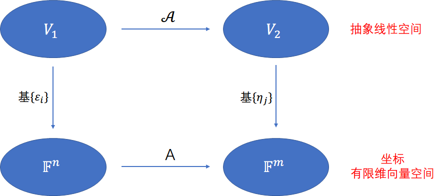

## 线性映射

**线性映射定义**

设 $V_1,V_2$ 是数域 $\mathbb {F}$ 上两个线性空间，映射 $\mathscr {A}:V_1→V_2$，如果它保持加法和数乘法：

1.  $\forall \alpha_1, \alpha_2\in V_1$ 有 $\mathscr {A}(\alpha_1+\alpha_2)=\mathscr {A}(\alpha_1)+\mathscr {A}(\alpha_2)$
2.  $\forall \alpha \in V_1, k\in \mathbb {F}$ 有 $\mathscr {A}(\alpha・k)=\mathscr {A}(\alpha)・k$

则称 $\mathscr {A}$ 为从线性空间 $V_1$ 到 $V_2$ 的线性映射，如果 $V_1$ 和 $V_2$ 是同一个线性空间，则称 $\mathscr {A}$ 为**线性变换**。从 $V_1$ 到 $V_2$ 的所有线性映射构成的集合记为 $\mathscr {L}(V_1, V_2)$

例如，映射

$$
\mathscr{A}:\mathbb{R}^2→\mathbb{R}^2\\
\begin{bmatrix}
x_1\\ x_2
\end{bmatrix}\mapsto \begin{bmatrix}x_1+x_2 \\ x_1x_2\end{bmatrix}
$$

不是线性映射；映射

$$
\mathscr{B}:\mathbb{R}^3 \to \mathbb{R}^2\\

\begin{bmatrix}
x_1\\ x_2 \\ x_3
\end{bmatrix}\mapsto \begin{bmatrix}x_1+x_2-x_3 \\ 2x_1+3x_2\end{bmatrix}
$$

是线性映射

**线性映射的简单性质**

1.  $\mathscr{A}(0)=0$
2.  $\mathscr {A}(\sum_{i=1}^sk_i\alpha_i)=\sum_{i=1}^sk_i\mathscr {A}(\alpha_i)$，其中 $\alpha_i \in V, k_i\in \mathbb {F}$
3.  设 $\alpha_1, \alpha_2,...,\alpha_s \in V_1 ,\alpha_1, \alpha_2,...,\alpha_s$ 线性相关，则 $\mathscr {A}(\alpha_1),\mathscr {A}(\alpha_2),...,\mathscr {A}(\alpha_s)$ 也线性相关
4.  若 $V=\text {span}\{\alpha_1,\alpha_2,...,\alpha_s\}$，则 $\mathscr {A}$ 的值域 $\mathscr {A}(V)=\text {span}\{\mathscr {A}(\alpha_1),...,\mathscr {A}(\alpha_s)\}$

现证明性质 (3)

事实上，由于 $\alpha_1,\alpha_2,...,\alpha_s$ 线性相关，不失一般性，不妨设

$$
\alpha_s = k_1\alpha_1 + k_2\alpha_2+···+k_{s-1}\alpha_{s-1}
$$

于是

$$
\mathscr{\alpha_s} = k_1\mathscr{\alpha_1}+k_2\mathscr{\alpha_2}+···+k_{s-1}\alpha_{\alpha_{s-1}}
$$

因此，$\mathscr {A}(\alpha_1), \mathscr {A}(\alpha_2),...,\mathscr {A}(\alpha_s)$ 线性相关

**特别要注意，若 $\alpha_1, \alpha_2, ..., \alpha_s \in V_1$ 线性无关，则 $\mathscr {A}(\alpha_1), \mathscr {A}(\alpha_2), ..., \mathscr {A}(\alpha_s)$ 不一定线性无关**

**线性变换的简单性质**

设 $\mathscr {A,B,C}\in \mathscr {L}(V,V)$，且 $x\in V$，则

1.  （乘法的可结合性）$((\mathscr {A}\mathscr {B})\mathscr {C})(x)=(\mathscr {A}(\mathscr {B}\mathscr {C}))(x)$
2.  （线性映射的左分配律）$\mathscr {A}(\mathscr {B}+\mathscr {C})=\mathscr {A}\mathscr {B}+\mathscr {A}\mathscr {C}$
3.  （线性映射的右分配律）$(\mathscr {A}+\mathscr {B})\mathscr {C}=\mathscr {A}\mathscr {C}+\mathscr {B}\mathscr {C}$

> 线性映射的乘法一般是不满足交换律的

现证明性质 (1)

$$
\because ((\mathscr{A}\mathscr{B})\mathscr{C})(x)=(\mathscr{A}\mathscr{B})(\mathscr{C}(x))=\mathscr{A}(\mathscr{B}(\mathscr{C}(x)))
$$

又

$$
\because (\mathscr{A}(\mathscr{B}\mathscr{C}))(x)=\mathscr{A}((\mathscr{B}\mathscr{C})(x))=\mathscr{A}(\mathscr{B}(\mathscr{C}(x)))
$$

所以

$$
((\mathscr{A}\mathscr{B})\mathscr{C})(x)=(\mathscr{A}(\mathscr{B}\mathscr{C}))(x)
$$

___

**线性映射的矩阵表示**

给定 $\mathbb {F}$ 上的线性空间 $V_1, V_2$，及线性映射 $\mathscr {A}:V_1\to V_2$。设 $\dim (V_1)=n, \dim (V_2)=m$，并设 $\varepsilon_1,\varepsilon_2,...,\varepsilon_n$ 为 $V_1$ 的一个基（称为入口基）；$\eta_1, \eta_2,...,\eta_m$ 为 $V_2$ 的一个基（称为出口基）。记第 $j$ 个入口基向量 $\varepsilon_j \in V_1$ 在 $\mathscr {A}$ 下的像 $\mathscr {A}(\varepsilon_j)\in V_2$ 在出口基 $\eta_1, \eta_2,...,\eta_n$ 下的坐标为

$$
a_j = \begin{bmatrix}a_{1j} \\ a_{2j}\\ \vdots \\ a_{mj}\end{bmatrix}\in \mathbb{F}^m
$$

即

$$
\mathscr{A}(\varepsilon_j)=\begin{bmatrix}\eta_1 & \eta_2 & \cdots & \eta_m\end{bmatrix}\begin{bmatrix}a_{1j}\\ a_{2j}\\ \vdots \\ a_{mj}\end{bmatrix},\ j=1,2,...,n
$$

则由 $\mathbb {F}^m$ 中的向量组 $a_1, a_2,...,a_n$ 拼成的矩阵

$$
A = \begin{bmatrix}a_1 & a_2 & \cdots & a_n\end{bmatrix} = [a_{ij}]_{m\times n}
$$

称为 $\mathscr {A}$ 在相应的入口基和出口基下的表示

定义记号

$$
\mathscr{A}\begin{bmatrix}\varepsilon_1 & \varepsilon_2 & \cdots & \varepsilon_n\end{bmatrix}=\begin{bmatrix}\mathscr{A}(\varepsilon_1) & \mathscr{A}(\varepsilon_2) & \cdots & \mathscr{A}(\varepsilon_n)\end{bmatrix}
$$

即线性映射作用在向量组拼成的矩阵上，定义为向量组中每个向量的像按原顺序所成的向量组（简称为向量组的像）拼成的矩阵。则有下面的公式

$$
{\color{red} {\mathscr{A}\begin{bmatrix}\varepsilon_1 & \varepsilon_2 & \cdots & \varepsilon_n\end{bmatrix}=\begin{bmatrix}\eta_1 & \eta_2 & \cdots & \eta_m\end{bmatrix}A}}
$$

用文字表示，读作

$$
[线性映射][入口基矩阵]=[出口基矩阵][表示矩阵]
$$

事实上，只要确定了线性映射两个空间的**基**（例如 $(\varepsilon_1,\cdots,\varepsilon_n)$ 和 $(\beta_1,\cdots,\beta_m)$），就有唯一确定的一个矩阵 $A$ 与之对应，而且**矩阵 $A$ 的每一个列向量就是对应的原基向量映射后的坐标**；反之，如果基确定，任何一个矩阵都唯一确定了一个线性映射

> 我个人理解，线性映射其实就是将一个 $m$ 维的矩阵，转换为 $n$ 维的矩阵，而在转换过程中，需要一个 $m\times n$ 的矩阵 $A$，这类似于 PyTorch 中的 `nn.Linear(m, n, bias=False)` 函数

___

**用坐标计算线性映射**

设线性映射 $\mathscr {A}:V_1\to V_2$ 在入口基 $\varepsilon_1, \varepsilon_2,...,\varepsilon_n$ 和出口基 $\eta_1, \eta_2,...,\eta_m$ 下的矩阵表示为 $A$，又设 $\alpha \in V_1$ 在入口基下的坐标为 $X \in \mathbb {F}^n$，则 $\mathscr {A}(\alpha)\in V_2$ 在出口基下的坐标为 $AX\in \mathbb {F}^m$

**证明：**也就是要证 $\mathscr {A}(\alpha)=\begin {bmatrix}\eta_1 & \eta_2 & \cdots & \eta_m\end {bmatrix}(AX)$

因为

$$
\begin{aligned}
\begin{bmatrix}\eta_1 & \eta_2 & \cdots & \eta_m\end{bmatrix}(AX)&=
(\begin{bmatrix}\eta_1 & \eta_2 & \cdots & \eta_m\end{bmatrix}A)X\\
&=(\mathscr{A}\begin{bmatrix}\varepsilon_1 & \varepsilon_2 & \cdots & \varepsilon_n\end{bmatrix})X\\
&=\mathscr{A}(\begin{bmatrix}\varepsilon_1 & \varepsilon_2 & \cdots & \varepsilon_n\end{bmatrix}X)\\
&=\mathscr{A}(\alpha)
\end{aligned}
$$

证毕

___

例 2

设 $B=\begin {bmatrix} 1 & 2 \\ 1 & 1 \\ 0 & 1\end {bmatrix}$，映射 $\mathscr {A}:\mathbb {R}^2\to \mathbb {R}^3$ 由下式确定

$$
\mathscr{A}(\alpha)=B\alpha, \ \ \ \alpha \in \mathbb{R}^2
$$

试求 $\mathscr {A}$ 在基 $\alpha_1=(1, 0)^T, \alpha_2=(0,1)^T$ 与基 $\beta_1=(1,0,0)^T,\beta_2=(0,1,0)^T,\beta_3=(0,0,1)^T$ 下的矩阵表示 $A$

**解：**因为 $\mathscr {A}(\alpha_1)=(1, 1, 0)^T, \mathscr {A}(\alpha_2)=(2, 1, 1)^T$

又由 $\begin {bmatrix}\mathscr {A}(\alpha_1) & \mathscr {A}(\alpha_2)\end {bmatrix}=\begin {bmatrix}\beta_1 & \beta_2 & \beta_3\end {bmatrix} A$ 得

$$
A = \begin{bmatrix}1 & 2\\ 1 & 1\\ 0 & 1\end{bmatrix}
$$

___

例 3

求线性映射 $\mathscr {A}:R [x]_{n+1}\to R [x]_n$

$$
\mathscr{A}(f(x))=\frac{d}{dx}f(x)
$$

在基 $1, x, x^2, ..., x^n$ 与基 $1, x, x^2,..., x^{n-1}$ 下的矩阵表示 $D$

**解：**因为 $\mathscr {A}(1)=0, \mathscr {A}(x)=1,...,\mathscr {A}(x^n)=nx^{n-1}$

又由 $\begin {bmatrix}\mathscr {A}(1) & \mathscr {A}(x) & \cdots & \mathscr {x^n}\end {bmatrix}=\begin {bmatrix} 1 & x & \cdots & x^{n-1}\end {bmatrix} A$ 得

$$
A = \begin{bmatrix}0 & 1 & 0 & 0 & \cdots & 0 \\ 0 & 0 & 2 & 0 & \cdots & 0 \\ 0 & 0 & 0 & 3 & \cdots & 0 \\ \vdots & \vdots & \vdots & \vdots & \cdots & \vdots \\ 0 & 0 & 0 & 0 & \cdots & n\end{bmatrix}_{n\times (n+1)}
$$

___

例 4

设 $\mathscr {A}$ 是 $n$ 维线性空间 $V$ 的一个线性变换，对某个 $\xi\in V$ 有 $\mathscr {A}^{k-1}(\xi)\neq 0, \mathscr {A}^k (\xi)=0$，试证：$\xi,\mathscr {A}(\xi),\mathscr {A}^2 (\xi),...,\mathscr {A}^{k-1}(\xi)$ 线性无关

**解：**$\forall a_1,...,a_{k-1}$，使

$$
a_1\xi+a_2\mathscr{A}(\xi)+···+a_k\mathscr{A}^{k-1}(\xi)=0\quad(1)
$$

有且仅有零解，且线性无关

用 $\mathscr {A}^{k-1}$ 左乘 $(1)$ 式两端，由 $\mathscr {A}^{k}(\xi)=0$ 可得

$$
a_1\mathscr{A}^{k-1}(\xi)=0
$$

因为 $\mathscr {A}^{k-1}(\xi)\neq 0$，所以 $a_1=0$，带入 $(1)$ 式得

$$
a_2\mathscr{A}(\xi)+···+a_k\mathscr{A}^{k-1}(\xi)=0\quad(2)
$$

用 $\mathscr {A}^{k-2}$ 左乘 $(2)$ 式两端，由 $\mathscr {A}^k (\xi)=0$ 可得 $a_2=0$，以此类推，可得 $a_3=・・・=a_k=0$

所以 $\xi,\mathscr {A}(\xi),...,\mathscr {A}^{k-1}(\xi)$ 线性无关

___

例 5

设 $\beta_1,\beta_2,...,\beta_m$ 线性无关，且

$$
\begin{aligned}
\xi_{i} &={a}_{1 i} {\beta}_{1}+a_{2 i}{\beta}_{2}+\cdots+a_{m i} \boldsymbol{\beta}_{m} \\
&=\left({\beta}_{1}, {\beta}_{2}, \cdots ,{\beta}_{m}\right)\left[\begin{array}{c}
a_{1 i} \\
a_{2 i} \\
\vdots \\
a_{m i}
\end{array}\right] \quad(i=1,2, \cdots, s)
\end{aligned}
$$

试证：向量组 $\xi_1,\xi_2,...,\xi_s$ 的秩 = 矩阵 $(a_{ij})_{m\times s}$ 的秩

**解：**令 $B=(\beta_1,\beta_2,...,\beta_m)$，$A=(a_{ij})_{m\times s}$，$P=(\xi_1,...,\xi_s)$，则 $P=BA$

因为 $\beta_1,...,\beta_m$ 线性无关，所以 $B$ 满秩

又因为 $\mathrm {rank}(P)=\mathrm {rank}(BA)$，所以 $\mathrm {rank}(P)=\mathrm {rank}(A)$

___

**线性映射的值域**

设 $\mathscr {A}$ 为线性空间 $V_1$ 到 $V_2$ 的线性映射，则称 $\{\mathscr {A}(\alpha)\mid \alpha \in V_1\}$ 为 $\mathscr {A}$ 的值域，记为 $\mathcal {R}(\mathscr {A})$，且 $\mathcal {R}(\mathscr {A})$ 为 $V_2$ 的子空间。$\dim (\mathcal {R (\mathscr {A})})$ 称为 $\mathscr {A}$ 的秩，记作 $\mathrm {rank}(\mathscr {A})$

**证明（$\mathcal {R}(\mathscr {A})$ 为 $V_2$ 的子空间）：**任取 $\alpha, \beta \in \mathcal {R}(\mathscr {A}), \lambda \in \mathbb {F}$，则存在 $\alpha_1, \beta_1 \in V_1$，使得 $\mathscr {A}(\alpha_1)=\alpha, \mathscr {A}(\beta_1)=\beta$，因为

$$
\begin{aligned}
\alpha + \beta = \mathscr{A}(\alpha_1) + \mathscr{A}(\beta_1)=\mathscr{A}(\alpha_1 + \beta_1) \in \mathcal{R}(\mathscr{A})\\
\lambda \alpha = \lambda \mathscr{\alpha_1}=\mathscr{\lambda \alpha_1} \in \mathcal{R}(\mathscr{A})
\end{aligned}
$$

故 $\mathcal {R}(\mathscr {A})$ 为 $V_2$ 的子空间（保加法、保数乘）

**值域与秩的求法（定理）**

设 $\alpha_1, \alpha_2,...,\alpha_n$ 为 $V_1$ 的基，$\beta_1, \beta_2,...,\beta_m$ 为 $V_2$ 的基，$\mathscr {A}$ 为 $V_1$ 到 $V_2$ 的线性映射且在基 $\alpha_1, \alpha_2,...,\alpha_n$ 与基 $\beta_1, \beta_2,...,\beta_m$ 下的矩阵为 $A$，即

$$
(\mathscr{A}(\alpha_1),\mathscr{A}(\alpha_2),...,\mathscr{A}(\alpha_n))=(\beta_1,\beta_2,...,\beta_m)A
$$

则

-   $\mathcal{R}(\mathscr{A})=\text{span}\{\mathscr{A}(\alpha_1), \mathscr{A}(\alpha_2),...,\mathscr{A}(\alpha_n)\}$
-   $\mathrm{rank}(\mathscr{A})=\mathrm{rank}(A)$

**证明：**任取 $\alpha \in \mathcal {R}(\mathscr {A})$，则存在 $\beta \in V_1$，使得 $\mathscr {A}(\beta)=\alpha$

$$
\begin{aligned}
&\because\  \beta = k_1\alpha_1 + k_2\alpha_2 +···+k_n \alpha_n \\
&\therefore\  \alpha = \mathscr{A}(\beta) = k_1\mathscr{A}(\alpha_1) + k_2\mathscr{A}(\alpha_2) + ··· + k_n \mathscr{A}(\alpha_n) \\ 
&\Rightarrow \  \alpha \in \text{span}\{\mathscr{A}(\alpha_1), \mathscr{A}(\alpha_2),...,\mathscr{A}(\alpha_n)\} \\
&\Rightarrow \  \mathcal{R}(\mathscr{A}) \subseteq \text{span}\{\mathscr{A}(\alpha_1), \mathscr{A}(\alpha_2),...,\mathscr{A}(\alpha_n)\}
\end{aligned}
$$

任取 $\alpha \in \text {span}\{\mathscr {A}(\alpha_1), \mathscr {A}(\alpha_2),...,\mathscr {A}(\alpha_n)\}$，则

$$
\begin {aligned}
&\alpha = k_1\mathscr {A}(\alpha_1) + k_2\mathscr {A}(\alpha_2) +・・・+ k_n \mathscr {A}(\alpha_n)\\
&\because \ \mathscr {A}(\alpha_i)\in \mathcal {R}(\mathscr {A}),\mathcal {R}(\mathscr {A}) 为子空间 \\
&\therefore \ \alpha \in \mathcal {R}(\mathscr {A})\\
&\Rightarrow \ \text {span}\{\mathscr {A}(\alpha_1), \mathscr {A}(\alpha_2),...,\mathscr {A}(\alpha_n)\} \subseteq \mathcal {R}(\mathscr {A})
\end {aligned}
$$

故 $\mathcal {R}(\mathscr {A})=\text {span}\{\mathscr {A}(\alpha_1), \mathscr {A}(\alpha_2),...,\mathscr {A}(\alpha_n)\}$

___

**线性映射的核**

设 $\mathscr {A}$ 为 $V_1$ 到 $V_2$ 的线性映射，则称 $\{\alpha \mid \mathscr {A}(\alpha)=0, \alpha \in V_1\}$ 为 $\mathscr {A}$ 的核，记为 $\mathcal {N}(\mathscr {A})$，且 $\mathcal {N}(\mathscr {A})$ 为 $V_1$ 的子空间。$\dim (\mathcal {N}(\mathscr {A}))$ 称为 $\mathscr {A}$ 的零度，记为 $\text {null}(\mathscr {A})$

**证明（$\mathcal {N}(\mathscr {A})$ 为 $V_1$ 的子空间）：**任取 $\alpha, \beta \in \mathcal {N}(\mathscr {A}), \lambda \in \mathbb {F}$，则 $\mathscr {A}(\alpha) = 0, \mathscr {A}(\beta)=0$，因为

$$
\mathscr{A}(\alpha + \beta) = \mathscr{A}(\alpha) + \mathscr{A}(\beta)=0 \Rightarrow \ \alpha+\beta \in \mathcal{N}(\mathscr{A})\\
\mathscr{A}(\lambda \alpha) = \lambda \mathscr{A}(\alpha)=0 \Rightarrow \ \lambda \alpha \in \mathcal{N}(\mathscr{A})
$$

故 $\mathcal {N}(\mathscr {A})$ 为 $V_1$ 的子空间（保加法、保数乘）

**核与零度的求法（定理）**

设 $\alpha_1, \alpha_2, ..., \alpha_n$ 为 $V_1$ 的基，$\beta_1, \beta_2,...,\beta_m$ 为 $V_2$ 的基，$\mathscr {A}$ 为 $V_1$ 到 $V_2$ 的线性映射且在 $\alpha_1, \alpha_2,...,\alpha_n$ 与基 $\beta_1, \beta_2, ...,\beta_m$ 下的矩阵为 $A$，且 $Ax=0$ 的基础解系为 $\xi_1, \xi_2,..,\xi_{n-r}$，则

-   $\mathcal {N}(\mathscr {A})=\text {span}\{\gamma_1, \gamma_2, ..., \gamma_{n-r}\}$，其中 $\gamma_i=(\alpha_1, \alpha_2,...,\alpha_n)\xi_i$
-   $\text{null}(\mathscr{A})=n-\mathrm{rank}(\mathscr{A})=n-\mathrm{rank}(A)$
-   $\dim(\mathcal{R}(\mathscr{A}))+\dim(\mathcal{N}(\mathscr{A}))=\dim(V)$

**证明：**任取 $\alpha \in \mathcal {N}(\mathscr {A})$，且 $\alpha$ 在基 $\alpha_1, \alpha_2,...,\alpha_n$ 下的坐标为 $\xi$

则 $\mathscr {A}(\alpha)=0$，且 $\mathscr {A}(\alpha)$ 在基 $\beta_1, \beta_2,...,\beta_m$ 下的坐标为 $A\xi$

$\Rightarrow A\xi=0$，即 $\xi$ 为 $Ax=0$ 的解，则有

$$
\begin{aligned}
&\xi = k_1\xi_1 + k_2\xi_2 +···+k_{n-r}\xi_{n-r}\\\\
&\Rightarrow \alpha = (\alpha_1,\alpha_2,...,\alpha_n)\xi=k_1[(\alpha_1,\alpha_2,...,\alpha_n)\xi_1]+k_2[(\alpha_1,\alpha_2,...,\alpha_n)\xi_2]\\
&+···+k_{n-r}[(\alpha_1,\alpha_2,...,\alpha_n)\xi_1]+k_2[(\alpha_1,\alpha_2,...,\alpha_n)\xi_{n-r}]\\
&=k_1\gamma_1+k_2\gamma_2+···+k_{n-r}\gamma_{n-r}\\
\\
&\Rightarrow \alpha \in \text{span}\{\gamma_1, \gamma_2,...,\gamma_{n-r}\}\Rightarrow \mathcal{N}(\mathscr{A})\subseteq \text{span}\{\gamma_1, \gamma_2,...,\gamma_{n-r}\}
\end{aligned}
$$

任取 $\alpha \in \text {span}\{\gamma_1, \gamma_2,...,\gamma_{n-r}\}$，则

$$
\begin{aligned}
\alpha&=k_1\gamma_1 + k_2\gamma_2+···+k_{n-r}\gamma_{n-r}\\
\Rightarrow \mathscr{A}(\alpha)&=k_1\mathscr{A}(\gamma_1)+k_2\mathscr{A}(\gamma_2)+···+k_{n-r}\mathscr{A}(\gamma_{n-r})\\
\because \mathscr{A}(\gamma_i)&=\mathscr{A}[(\alpha_1, \alpha_2,...,\alpha_n)\xi_i]=[\mathscr{A}(\alpha_1,\alpha_2,...,\alpha_n)]\xi_i\\
&=[(\beta_1,\beta_2,...,\beta_m)A]\xi_i=(\beta_1,\beta_2,...,\beta_m)(A\xi_i)\\
&=(\beta_1, \beta_2,...,\beta_m)0=0\\
\therefore \mathscr{A}(\alpha)&=0 \Rightarrow \in \mathcal{N}(\mathscr{A}) \Rightarrow \text{span}\{\gamma_1, \gamma_2, ..., \gamma_{n-r}\}\subseteq \mathcal{N}(\mathscr{A})
\end{aligned}
$$

故 $\mathcal {N}(\mathscr {A})=\text {span}\{\gamma_1, \gamma_2,...,\gamma_{n-r}\}$

___

**\* 矩阵的列空间**

对于一个 $m\times n$ 的矩阵 $A$，它的列空间就是 $A$ 中列向量 $(A_1,A_2,...,A_n)$ 的所有线性组合，即

$$
\text{span}\{A_1,A_2,...,A_n\}
$$

___

例 6

设线性变换 $\mathscr {A}: V\to V$ 在基 $\alpha_1,\alpha_2,\alpha_3$ 下的矩阵表示为 $A=\begin {bmatrix} 1&2&0\\0&-1&1\\1&1&1\end {bmatrix}$，求 $\mathcal {R}(\mathscr {A}),\mathcal {N}(\mathscr {A})$ 的基与维数

**解：**对矩阵 $A$ 做初等行变换得

$$
A\to \begin{bmatrix}1&0&2\\0&1&-1\\0&0&0\end{bmatrix}
$$

因为 $\mathcal {R}(\mathscr {A})=\text {span}\{\mathscr {A}(\alpha_1),\mathscr {A}(\alpha_2),\mathscr {A}(\alpha_3)\}$，所以 $\mathcal {R}(\mathscr {A})$ 的基是 $(\mathscr {A}(\alpha_1),\mathscr {A}(\alpha_2),\mathscr {A}(\alpha_3))$ 的极大线性无关组

又因为

$$
(\mathscr{A}(\alpha_1),\mathscr{A}(\alpha_2),\mathscr{A}(\alpha_3))=(\alpha_1,\alpha_2,\alpha_3)A\\
$$

所以 $\mathcal {R}(\mathscr {A})$ 的基为 $(\mathscr {A}(\alpha_1),\mathscr {A}(\alpha_2))=(\alpha_1+\alpha_3,2\alpha_1-\alpha_2+\alpha_3)$，$\dim (\mathcal {R}(\mathscr {A}))=2$

$A$ 的核空间为 $AX=0$ 的解空间，即

$$
\begin{bmatrix}1&2&0\\0&-1&1\\1&1&1\end{bmatrix}\begin{bmatrix}x_1\\x_2\\x_3\end{bmatrix}=0\\
\Rightarrow \begin{cases}x_1=-2x_3\\x_2=x_3\end{cases}
$$

其基础解系为 $[-2,1,1]^T$，所以 $\mathcal {N}(\mathscr {A})$ 的基为 $-2\alpha_1+\alpha_2+\alpha_3$，且 $\dim (\mathcal {N}(\mathscr {A}))=1$

___

例 7

设线性变换 $\mathscr {A}:\mathbb {F}^{2\times 2}\to \mathbb {F}^{2\times 2}$ 在基 $E_{11},E_{12},E_{21},E_{22}$ 下的定义为：

$$
\forall X=\begin{bmatrix}a&b\\c&d\end{bmatrix},\mathscr{A}(X)=\begin{bmatrix}a+b&b+c\\c+d&d+a\end{bmatrix}
$$

求 $\mathcal {R}(\mathscr {A}),\mathcal (N)(\mathscr {A})$ 的一组基与维数

**解：**

因为 $\mathcal {R}(\mathscr {A})=\text {span}\{\mathscr {A}(E_{11}),\mathscr {A}(E_{12}),\mathscr {A}(E_{21}),\mathscr {A}(E_{22})\}$，所以 $\mathcal {R}(\mathscr {A})$ 的基是 $(\mathscr {A}(E_{11}),\mathscr {A}(E_{12}),\mathscr {A}(E_{21}),\mathscr {A}(E_{22}))$ 的极大线性无关组

又因为

$$
\begin{aligned}
(\mathscr{A}(E_{11}),\mathscr{A}(E_{12}),\mathscr{A}(E_{21}),\mathscr{A}(E_{22}))&=(E_{11},E_{12},E_{21},E_{22})A\\
\Rightarrow A&= \begin{bmatrix}1&1&0&0\\0&1&1&0\\0&0&1&1\\1&0&0&1\end{bmatrix}\\
\to &\begin{bmatrix}1&0&0&1\\0&1&0&-1\\0&0&1&1\\0&0&0&0\end{bmatrix}
\end{aligned}
$$

所以 $\mathcal {R}(\mathscr {A})$ 的基为 $(\mathscr {A}(E_{11}),\mathscr {A}(E_{12}),\mathscr {A}(E_{21}))=(\begin {bmatrix} 1&0\\0&1\end {bmatrix},\begin {bmatrix} 1&1\\0&0\end {bmatrix},\begin {bmatrix} 0&1\\1&0\end {bmatrix})$，$\dim (\mathcal {R}(\mathscr {A}))=3$

> 注意：最后找基的时候，要借助原来 $A$ 矩阵的各个列向量，不能使用经过初等行变换后的矩阵

$A$ 的核空间为 $AX=0$ 的解空间，即

$$
\begin{bmatrix}1&1&0&0\\0&1&1&0\\0&0&1&1\\1&0&0&1\end{bmatrix}\begin{bmatrix}x_1\\x_2\\x_3\\x_4\end{bmatrix}=0\\
\Rightarrow \begin{cases}x_1=-x_4\\x_2=x_4\\x_3=-x_4\end{cases}
$$

其基础解系为 $[-1,1,-1,1]^T$，所以 $\mathcal {N}(\mathscr {A})$ 的基为 $-E_{11}+E_{12}-E_{21}+E_{22}$，且 $\dim (\mathcal {N}(\mathscr {A}))=1$

___

例 8

求矩阵 $A=\begin {bmatrix} 1&1&6\\0&4&2\\1&1&6\end {bmatrix}$ 的值域 $\mathcal {R}(A)$ 与核空间 $\mathcal {N}(A)$

**解：**$A$ 的值域 $\mathcal {R}(A)$ 为

$$
\begin{aligned}
\mathcal{R}(A) &=\operatorname{span}\left\{[1,0,1]^{T} ,[1,4,1]^{T} ,[6,2,6]^{T}\right\} \\
&=\operatorname{span}\left\{[1,0,1]^{T} ,[1,4,1]^{T}\right\} \\
&=\operatorname{span}\left\{[1,0,1]^{T},[0,1,0]^{T}\right\}
\end{aligned}
$$

又因为 $A$ 的核空间为 $AX=0$ 的解空间，其基础解系为 $[11, 1, -2]^T$，所以

$$
\mathcal{N}(A)=\text{span}\{[11, 1, -2]^T\}
$$

___

例 9

设 $B=\begin {bmatrix} 1& 2& 3 \\ 1 & 1 & 2 \\ 2& 0 & 2\\ 0 & 1& 1\end {bmatrix}$，定义 $\mathscr {A}:\mathbb {R}^3\to \mathbb {R}^4, \mathscr {A}(\alpha)=B\alpha$，$\alpha_1=\begin {bmatrix} 1 \\ 1 \\ 0\end {bmatrix}, \alpha_2=\begin {bmatrix} 0 \\ 1\\ 1\end {bmatrix}, \alpha_3 = \begin {bmatrix} 1 \\ 0 \\ 1\end {bmatrix}$ 为 $\mathbb {R}^3$ 的基，$\beta_1 = \begin {bmatrix} 1 \\ 1 \\ 0 \\ 0\end {bmatrix}, \beta_2 = \begin {bmatrix} 1 \\ 0\\ 1\\ 0\end {bmatrix}, \beta_3=\begin {bmatrix} 1\\ 0\\ 0\\ 1\end {bmatrix}, \beta_4 = \begin {bmatrix} 0 \\ 1\\ 1\\ 0\end {bmatrix}$ 为 $\mathbb {R}^4$ 的基

求：（1）$\mathscr {A}$ 在基 $\alpha_1, \alpha_2, \alpha_3$ 与基 $\beta_1, \beta_2, \beta_3, \beta_4$ 下的矩阵 $A$；（2）$\mathcal {R}(\mathscr {A})$ 与 $\mathcal {N}(\mathscr {A})$ 的基

**解：**

（1）

$$
\because \mathscr{A}(\alpha_1)=\begin{bmatrix}1&2&3\\1&1&2\\2&0&2\\0&1&1\end{bmatrix}\begin{bmatrix}1\\1\\0\end{bmatrix}=\begin{bmatrix}3\\2\\2\\1\end{bmatrix}\\
\mathscr{A}(\alpha_2)=\begin{bmatrix}5\\3\\2\\2\end{bmatrix}\\
\mathscr{A}(\alpha_3)=\begin{bmatrix}4\\3\\4\\1\end{bmatrix}\\
\therefore \mathscr{A}(\alpha_1, \alpha_2, \alpha_3)=(\mathscr{A}(\alpha_1), \mathscr{A}(\alpha_2), \mathscr{A}(\alpha_3))=\begin{bmatrix}3&5&4\\2&3&3\\2&2&4\\1&2&1\end{bmatrix}
$$

又

$$
\mathscr{A}(\alpha_1, \alpha_2, \alpha_3)=(\beta_1, \beta_2,\beta_3,\beta_4)A\\
\therefore \begin{bmatrix}3&5&4\\2&3&3\\2&2&4\\1&2&1\end{bmatrix}=\begin{bmatrix}1&1&1&0\\1&0&0&1\\0&1&0&1\\0&0&1&0\end{bmatrix}A \Rightarrow A = \begin{bmatrix}1&2&1\\1&1&2\\1&2&1\\1&1&2\end{bmatrix}
$$

（2）

$$
\begin{aligned}
AX=0\Rightarrow \begin{cases}x_1=-3x_3\\x_2=x_3\end{cases}
\end{aligned}
$$

其基础解系为 $[-3, 1,1]^T$，故线性变换的核子空间 $\mathcal {N}(\mathscr {A})$ 的维度为 1，根据维数定理可知 $\mathscr {A}$ 的值域 $\mathcal {R}(\mathscr {A})$ 的维数为 2，又

$$
\begin{aligned}
\mathcal{R}(\mathscr{A})&=\text{span}\{\mathscr{A}(\alpha_1),\mathscr{A}(\alpha_2),\mathscr{A}(\alpha_3)\}\\
&=\text{span}\{\beta_1+\beta_2+\beta_3+\beta_4,2\beta_1+\beta_2+2\beta_3+\beta_4,\\&\ \ \ \ \ \ \ \ \ \ \ \ \ \ \ \ \beta_1+2\beta_2+\beta_3+2\beta_4\}\\
&=\text{span}\{[3,2,2,1]^T,[5,3,2,2]^T\}
\end{aligned}
$$

所以 $\mathcal {R}(\mathscr {A})$ 的基为 $[3,2,2,1]^T,[5,3,2,2]^T$

___

**线性映射是单射、满射的充要条件**

单射：原像空间中任意两个不同的向量经过线性映射后得到的向量也是不同的

满射：像空间中的任意一个向量，都能在原像空间中找到原向量

-   $\mathscr {A}$ 是单射 $\Leftrightarrow \mathcal {N}(\mathscr {A})={0}$
-   $\mathscr {A}$ 是满射 $\Leftrightarrow \mathcal {R}(\mathscr {A})=V_2$
-   **降维不单，升维不满**