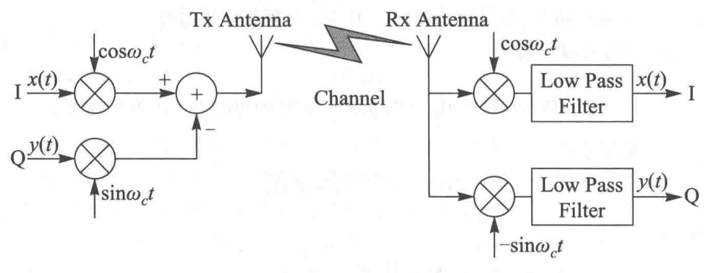
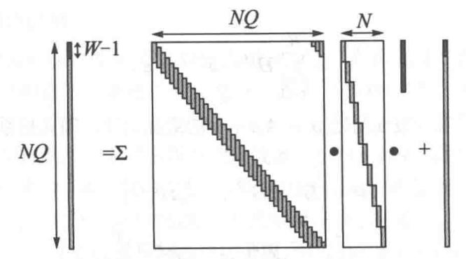

# 通信笔记

> 推荐看原书《通信之道——从微积分到5G》

## 信号与系统

### 离散系统

叠加性：$H\left \{ x_1[n] + x_n[n] \right \} = H\left \{ x_1[n] \right \} + H\left \{ x_2[n] \right \} $

数乘性：$H\left \{ \alpha x[n] \right \} = \alpha H\left \{ x[n] \right \} $

移不变性（连续系统：时不变性）：如果输入信号延时了一段时间$\tau$,那么输出信号也延时相同的时间。

设$y[n] = \left \{ x[n] \right \} $，则$y[n+m] = H\left \{ x[n+m] \right \}$

**不要把系统H理解为一个函数**

#### 离散卷积

$H\left \{ \cdot  \right \} $是线性系统
$$
y[n]=H\left \{ x[n] \right \} =H\left \{ \sum_{k=-\infty }^{\infty } x[k] \delta [n-k]  \right \} = \sum_{k=-\infty}^{\infty } x[k]H\left \{\delta [n-k]  \right \}
$$
定义：$h[n]=H\left \{\delta [n]  \right \}$

若该系统为移不变系统，则有
$$
h[n-k]=H\left \{\delta [n-k]  \right \}
$$
带入可得
$$
y[n]=\sum_{k=-\infty}^{\infty } x[k]h[k-n]=x[n]*h[n]
$$
上式就是经典的离散卷积

**注意**，$H\left \{\delta [k-n]  \right \}\ne h[k-n]$，移不变系统并不是反折不变，即$H\left \{\delta [-n]  \right \}\ne h[-n]$，而实际上，因为$\delta[-n]=\delta[n]$,所以$H\left \{\delta [k-n]  \right \}=H\left \{\delta [n-k]  \right \}=h[n-k]$

如果是因果系统，时刻系统的输出信号只与该时刻之前的输入信号有关，而和该时刻之后的输入信号无关，即$h[n]=0,n<0$，因此，求和的上限可以取为
$$
y[n]=\sum_{k=-\infty}^{n} x[k]h[k-n]
$$
**注意**，在离散卷积的推导过程当中，用到了线性系统和移不变的条件，这是卷积成立的前提。对于非线性系统，卷积就不适用了。对于移变线性系统，线性条件还满足，只是冲激响应随着输入信号的时刻在发生变化，只要在冲激响应上增加一个表示移变的变量就可以了。

## 概念的扩展

为什么先前人们会觉得分数或者叫有理数，可以表示所有的数呢？这是因为任意一个数，都可以用一个有理数无限逼近。用数学语言去说，就是有理数在实数轴上是稠密的。

[定义：**稠密**]有集合$A\subseteq B,x_0 \in B$。如果B当中的任意一个邻域$N\left ( x_0,\delta \right ) ,\delta > 0$,都存在一个$x_1 \in A$使得$x_1 \in N\left ( x_0,\delta \right )$,则称集合A在集合B中稠密。

以实数轴上的任何一个点为中心，做一个任意小的开区间，这个区间内一定有至少一个，实际上是无穷多个有理数，所以用有理数可以任意逼近任何一个点，也就是有理数在实数当中是稠密的。

但是有理数集合不是完备的。完备也是一个数学概念。

[定义：**完备**]假设$x_1,x_2,x_3,\dots $,·是集合S当中的序列，如果对于任意的e>0,都存在正整数N,使得当$m>N,n>N$时，有$\left | x_m - x_n \right | < \epsilon $成立，则称此序列为柯西序列。如果所有的柯西序列收敛，也就是$\lim_{n \to \infty} x_n = A \in S$,则称S完备。

我们现在知道了$\sqrt[]{2}=1.4142135623731\cdots  $是一个无理数。
我们构造这样的一个序列1.4,1.41,1.414,1.4142,序号每增加1，就在$\sqrt[]{2}$上多取一位有效数字。这个序列是一个有理数列，而且随着序号的增加，相邻两项的差也趋向于零，是一个柯西序列。但是这个序列收敛到$\sqrt[]{2}$，是一个无理数。也就是说，在有理数的集合里面，序列是不收敛的，所以有理数集合不完备。

柯西序列，随着序号的增加，相邻项的距离越来越小，从我们的感觉上来说，它应该有一个极限。但是对于一个不完备的集合，这个极限点却可能不在这个集合里面，就变成了无极限了。这让我们感觉很不好，那么就把这些极限点都包括进来，形成一个更大的集合，这样柯西序列就收敛了，这个更大的集合就是一个完备的集合。

有理数->无理数，正数->负数->复数

## 傅里叶分析

### 傅里叶级数

#### 三角形式的傅里叶级数

假设一个周期信号为$x(t)$,它的周期为$T_1$,也就是说，$x(t)=x(t+T_1)$,其角频率为$\omega _1=2\pi/T_1$,如果$x(t)$满足狄里赫利条件(Dirichlet condition),则可以表达成为傅里叶级数：
$$
x(t)=a_0+\sum_{n=1}^{\infty } \left \{ a_n\cos(n\omega_1t) + b_n\sin(n\omega _1t) \right \} 
$$
狄里赫利条件是指，一个周期信号满足以下条件。

- 在任意一个周期内，有限个间断点：
- 在任意一个周期内，有限的极大值与极小值：
- 在任意一个周期内，其绝对值可积。

可以这么说，实际当中的所有周期信号都满足狄里赫利条件，不满足此条件的都是数学家们刻意构造的。

#### 理解负频率

频率只能是一个非负的实数，而在复指数的傅里叶级数当中出现了负频率，如何理解呢？
可以简单地说，负频率只是数学方法，并没有实际的物理意义。虽然如此，负频率在物理上还是有一些意义的。

1. 负频率是由复指数带来的。由欧拉公式$\cos(\omega t) = \left ( e^{j\omega t} + e^{-j\omega t} \right ) /2$可以知道，一个正弦信号表达为复指数的时候，出现了一个正的频率和一个负的频率。因为虚数单位2=一1是一个数学方法，在物理上并不存在，所以伴随复指数而出现的负频率也是一个数学方法。

2. 一个实数信号的复指数傅里叶级数，正频率和负频率存在对偶关系。从公式(53)可以看出，正、负频率的傅里叶系数，实部相等，虚部相反，或者说幅度相等，相位相反，是一对共轭复数。由于存在这种共轭关系，它们互相可以决定对方，因此正频率和负频率所承载的信息是一样的。

3. 学习过调制技术的同学知道，当把基带信号调制到载波频率上的时候，是用一个载波信号$\cos (\omega _ct)$去乘以被调制信号，假设被调制信号为$\cos (\omega _1t),\omega _c\gg \omega _1$,则

   $\cos (\omega _1t)\cos (\omega _1t)=\frac{\cos(\omega _c-\omega _1)t+\cos(\omega _c+\omega _1)t}{2} $

对调制有一个通俗的说法，叫作“频谱搬移”，意思是把基带信号搬移到载波频率上去。从上面的公式我们发现，一个频率的信号经过调制后出现了$\omega_c-\omega_1$和$\omega_c+w_1$两个频率。可以认为，$\omega_c-\omega_1$是搬移负频率得到的，$\omega_c+\omega_1$是搬移正频率得到的。这两个频率关于载波频率$\omega_c$对称，叫作双边频谱。它们承载相同的信息，是对频谱的浪费。所以基带信号要采用复信号来提高频谱利用率。

### 傅里叶变换

周期信号可以用傅里叶级数来表达，傅里叶系数又叫作离散频谱，因为谱线只出现在$w_1=1/T$的整数倍上。把这个概念推广到非周期信号，就可以得到傅里叶变换。

为了取得与后续的傅里叶变换在符号标记上的一致性，我们用$X(n\omega_1)$代替前面用到的$C_n$。一个周期为$T_1$,角频率$\omega_1=2π/T_1$的周期信号，其复指数傅里叶级数为
$$
x(t)=\sum_{n=-\infty }^{\infty }X(n\omega _1)e^{jn\omega _1t}
$$
其中，$X(n\omega _1)=\frac{1}{T_1} \int_{-\frac{T_1}{2} }^{\frac{T_1}{2} } x(t)e^{-jn\omega _1t}\mathbf{d} t$

非周期信号可以认为是周期无限大的周期信号。如果让周期$T_1\to \infty $，则谱线的间距$2\pi T_1 \to 0$，离散频谱变成了连续频谱。

傅里叶变换记作：
$$
X(\omega )=\int_{-\infty }^{\infty }x(t)e^{-j\omega t}\mathbf{d}t  
$$

#### 谱密度

傅里叶系数$X(n\omega_1)$是无量纲的。而傅里叶变换
$$
X(\omega )=\lim_{T_1 \to \infty} X(n\omega _1)T_1=\lim_{\omega _1 \to 0}\frac{2\pi X(n\omega _1)}{\omega _1} 
$$
带有时间的量纲，是一个频谱密度的概念。

#### 傅里叶变换的性质

**对称性**
$$
\mathscr{F}[X(t)]=x(-f)
$$
**奇偶虚实性**
$$
\left\{\begin{matrix}\mathscr{F}[x^*(t)]=X^*(-\omega )
 \\ \mathscr{F}[x(-t)]=X(-\omega )
 \\ \mathscr{F}[x^*(-t)]=X^*(\omega )

\end{matrix}\right.
$$

- 对于一个偶函数，有$x(-t)=x(t)$,那么有$X(\omega)=X(-\omega)$。也就是说，偶函数的傅里叶变换也是偶函数。
- 对于一个奇函数，有$x(-t)=-x(t)$,那么有$X(\omega)=-X(-\omega)$。也就是说，奇函数的傅里叶变换也是奇函数。
- 实函数的傅里叶变换的实部是偶函数，虚部是奇函数；傅里叶变换的幅度是偶函数，相位是奇函数。
- 实偶函数的傅里叶变换是实偶函数。

**尺度变换**
$$
\mathscr{F}[x(\alpha t)] =\frac{1}{\alpha }X(\frac{\omega }{\alpha } ) 
$$
尺度变换因子$\alpha$对时域和频域的作用是相反的。

**时移特性**
$$
\mathscr{F}[x(t-t_0)]=e^{-j\omega t_0}X(\omega )
$$
这意味着，时域的时移对应频域的相移。相同的时移，对不同频率的相移不同。频率越高，相移越大。

**频移特性**
$$
\mathscr{F}[x(t)e^{j\omega _0t}]=X(\omega -\omega _0)
$$
无线通信里的调制技术采用的就是这种原理。将基带信号乘以一个高频的载波信号$e^{j\omega _ct}$,相当于把频谱搬移了.

#### 卷积定理

频域卷积定理的意思是说，时域两个信号的乘，在频域变成了卷积运算。或者倒过来说，频域的两个信号的卷积，在时域变成了乘积。

#### 频率特性

$$
H(\omega )=\mathscr{F}[h(t)] 
$$

一个线性时不变系统可以用冲激响应**完全**刻划其特性，频率特性频率特性只适合于线性时不变系统

### 离散傅里叶变换（DFT）

$$
X[k]=\sum_{n=0}^{N-1}x[n]e^{-j\frac{2\pi}{N}kn },k=0,1,\cdots ,N-1
$$

正变换就是求频域系数
$$
x[n]=\frac{1}{N} \sum_{n=0}^{N-1}X[k]e^{j\frac{2\pi}{N}kn }
$$
逆变换就是利用频域的系数合成原来的信号

在离散傅里叶变换当中，$[0,2\pi)$当中一共有N个离散频率，不同频率的复指数信号具有两两正交性。从线性空间的角度来看，这N个复指数信号构成了N维线性复空间的一组正交基，任何的信号都可以表达成这组基的线性组合。离散傅里叶变换就是求一个离散序列在这组正交基下的坐标。

**离散信号的连续傅里叶变换(FT)**
$$
x[n]=\frac{1}{2\pi} \int_{0}^{2\pi} X(\omega )e^{j\omega n }\mathbf{d}\omega 
$$
X(w)的定义域可以认为是$(-0,\infty)$，是以$2\pi$为周期的周期函数，离散傅里叶变换$X[k]$内是$X(\omega)$的采样。利用$X(\omega)$的一个周期可以合成时域离散信号，就是连续反变换，用$X(\omega)$的均匀N个采样也可以合成时域离散信号，就是离散反变换。

#### 循环卷积（圆卷积）

$$
y[n]=x[n]\circledast  h[n]
$$

线卷积对序列的长度没有要求。而循环卷积要求两个序列的长度相等，输出序列也是同样的长度。

当一个系统的输入信号是周期信号的时候，输出信号也是周期信号。输出信号的一个周期，是输入信号的一个周期和一个同等长度的序列循环卷积。这个序列是由信号的冲激响应分段累加或者补零后得到的。

#### 频率特性

$$
H[k]=\left | H[k] \right | e^{j\varphi[k] },k=0,1,\cdots,N-1
$$

**注意**，系统的频率特性$H[k]$并不由系统的冲激响应[n]唯一确定，还取决于输入信号的周期长度N。$\tilde{h}[n] $和N共同决定了$h[n]$,它的离散傅里叶变换才是$H[k]$。

这个可以这样理解，如果输入信号的周期为N,那么它只包含N个频率成分，只需要知道系统对这N个频率成分的响应特性就可以了。

由这里可以看出，$H[k]$是$\tilde{H}(\omega  )$的采样。注意一点，这些采样频率在$[0,2\pi)$的范围内。所以，$\tilde{H}(\omega  )$不依赖于输入信号的频率特性。当
输入信号的周期N确定之后，由于输入信号只包含N个频率成分，只需要采集这N频率的响应特性，就可以求得输出信号。

## 采样定理

时域采样定理：如果一个带宽有限的信号（通常称作带限信号）的最高角频率为$\omega _m=2\pi f_m$,在等间隔采样的条件下，采样频率必须不小于$2\pi f_m$,才能用采样信号无失真地恢复原来的信号。也就是说，采样频率最小为信号最高频率的两倍。

频域采样定理：如果信号x(t)是时间受限的，也就是$\left | t \right | >t_m,x(t)=0$,那么在频域以不大于$1/2t_m$的频率间隔，或者$π/t_m$的角频率间隔，对其频谱$X(\omega )$进行采样得到$X_s(\omega )$,则用$X_s(\omega )$可以无失真地恢复原信号。

## 基本通信链路

### Hilbert变换

我们知道$\mathscr{F}^{-1}[2u(\omega )]=\delta +\frac{j}{\pi t}  $

于是我们得到单边带信号：$s_+(t)=s(t)+js(t)*\frac{1}{\pi t} $

我们定义
$$
\widehat{s}(t)= s(t)*\frac{1}{\pi t} =\frac{1}{\pi}\int_{-\infty }^{\infty }  \frac{s(\tau)}{t-\tau} \mathbf{d}\tau
$$
信号$\widehat{s}(t)$可以认为是信号s(t)经过一个系统后的响应，系统的冲激响应为$h(t)=\frac{1}{\pi t}$

在零点处，可以认为h(t)=0。这个系统有一个专门的名字叫作**希尔伯特变换**。注意希尔伯特变换是一个**非因果系统**。

由于
$$
S_+(\omega )=2S(\omega )u(\omega )=\left\{\begin{matrix}2S(\omega ),\omega >0
 \\ S(\omega ),\omega =0
 \\ 0,\omega <0

\end{matrix}\right.
$$
可得$S_+(\omega)=S(\omega)[1+jH(\omega)]$

比较上面两个公式，可以得到希尔伯特变换的频域特性为
$$
H(\omega )=\left\{\begin{matrix}-j,\omega >0
 \\ 0,\omega =0
 \\ j,\omega <0

\end{matrix}\right.
$$
从频域特性可以看出，除直流外，希尔伯特变换的幅值恒定为1，而对正频率移相$-\frac{\pi}{2} $，对负频率移相$\frac{\pi}{2} $。

从一个双边带信号$s(t)$,通过如下的方式就可以得到一个单边带信号：
$$
s_+(t)=s(t)+j\widehat{s}(t) 
$$
从而节省一半的带宽。

可是我们也发现，单边带信号是一个复数，如何产生一个复数信号呢？

我们用复指数信号为载波，得到一个单边带的已调信号。为了符号的简便，我们还是采用符号$s_{RF+}(t)$来表示，尽管意义与上面的不同：
$$
s_{RF+}(t)=[s(t)+j\widehat{s}(t) ]e^{j\omega _ct}
$$
通过推到可知实部和虚部都是单边带信号

### IQ调制

单边带信号：
$$
s(t)\cos(\omega _ct)-\widehat{s}(t)\sin(\omega _ct)=A(t)\cos(\omega _ct+\phi (t)) 
$$
通过比较我们发现，单边带信号同时利用了载波的幅度和相位，而双边带信号只利用了载波的幅度。或者等价地说，双边带信号只利用了余弦分量，而单边带信号同时利用了正弦和余弦两个正交分量。单边带信号利用了多一倍的信息，因此只需要一半的频谱资源，这么解释就比较直观了。

当然，为了实现恰好将双边带信号的一个边带消掉的目的，需要对正弦分量的系数有一定约束，这就是希尔伯特变换。在接收侧，只要解出余弦分量就可以了，正弦分量承载的信息和余弦分量是相同的。如果不满足这个约束关系，就不能够实现这个目的，信号占用的带宽仍然和双边带信号相同。

单边带信号的正弦和余弦分量要满足希尔伯特变换的约束关系，如果不满足，则信号占用的带宽仍然和双边带信号相同。

但是，如果我们独立地设置正弦和余弦分量，虽然带宽仍然和双边带信号相同，但是传递的信息也增加了一倍，频谱效率和单边带信号是相同的，而且省掉了希尔伯特变换这个环节。这个做法就是目前普遍使用的IQ调制技术。这里的IQ是指In-phase和Quadrature两路正交的信号。

IQ调制后信号：
$$
x(t)\cos(\omega _xt)-y(t)\sin(\omega _ct)
$$



## 奈奎斯特第一准则

**脉冲成形**的主要目的是限制带外泄漏。

每个无线通信系统都工作在一定的频带之内。如果系统的无线信号超出了这个规定的频带，就形成了带外泄漏。
$$
\sum_{n=-\infty }^{\infty }G(\omega -\frac{2n\pi}{T_s} )=T_s
$$
这个公式的意思是说，如果把$g(t)$的频谱$G(\omega)$沿$\omega$轴切成宽度为$2π/T_s$的段，平移到一起并且累加起来，应该是常数$T_s$

这个公式叫作奈奎斯特第一准则。只有满足这个准则，才能够实现脉冲成形的无符号间干扰。

从这个准则可以推论出，如果I为实数，也就是$s(t)$是一个实信号，则实现无符号间干扰的最小带宽为$1/2T_s$，也就是符号速率的一半。这是因为满足奈奎斯特准则的$G(\omega)$的最小宽度为$1/T_s$,而实信号的频谱具有对称性，所以其最小带宽为$1/T_s$

奈奎斯特第一准则与和采样定理是一致的。

```matlab
clc;
clear;
close all;
%% 画出码元波形,Rs = 2 * B;
figure(1);
% 码元速率
Rs = 1;
Ts = 1 / Rs;
n = 0 : Ts : 7;
x=[1,1,1,-1,1,-1,-1,1];
stem(n,x) ;
axis([ -1 8 -1.5 1.5]); 
xlabel('n');
ylabel('y');
title('码元波形');
%通过脉冲成型滤波器,h(t)=sinc(t),每一个单独的冲击序列输入脉冲成型滤波器的输出响应都画在了一起
hold on;
B = 0.5;
t = -8 : 0.001 : 8;
acc = 0;
for i = 1 : 8
    y = x(i) * sinc(t - n(i));
    acc = acc + y;
    plot(t, y);
end
y = sinc(t);
plot(t, y);% 画出每个码元的波形
axis([ -1 8 -2 2]);
xlabel('t');
ylabel('y');
title('每个码元的波形经过脉冲成型滤波器的输出波形');
hold off;

%画出码元波形的叠加波形
figure(2);
plot(t, acc);
axis([ -1 8 -2 2]);
xlabel('t');
ylabel('y');
title('码元波形的叠加波形');
hold on;
plot(t, zeros(size(t)));
grid on;

%%  Rs > 2 * B,码间干扰
figure(3);
% 码元速率
Rs = 2;
Ts = 1 / Rs;
x=[1,1,1,-1,1,-1,-1,1];
n = 0 : Ts : length(x)/Rs-0.5;
stem(n,x) ;
axis([ -1 8 -1.5 1.5]); 
xlabel('n');
ylabel('y');
title('码元波形');
hold on;
B = 0.5;
t = -8 : 0.001 : 8;
acc = 0;
for i = 1 : 8
    y = x(i) * sinc(t - n(i));
    acc = acc + y;
    plot(t, y);
end
y = sinc(t);
plot(t, y);% 画出每个码元的波形
axis([ -1 8 -2 2]);
xlabel('t');
ylabel('y');
title('每个码元的波形经过脉冲成型滤波器的输出波形');
hold on;
%画出码元波形的叠加波形
% figure(4);
plot(t, acc);
axis([ -1 8 -2 2]);
xlabel('t');
ylabel('y');
title('码元波形的叠加波形');
hold on;
plot(t, zeros(size(t)));
grid on;
```

## 无线信道

### 时间选择性衰落和频率选择性衰落

相干时间是指信道基本不变的时间，信道变化的频率就是多普勒频移，因此多普勒频移越大，信道变化越快。那么很容易得到，相干时间，也就是信道保持不变的时间，与多普勒频移成反比：
$$
T_{coherent}\propto \frac{1}{f_{Doppler}} 
$$
快衰落信道在不同的时间的衰落不一样，也叫作**时间选择性衰落**。

时间和频率是对偶的，与时间选择性衰落对应的是频率选择性衰落，其指的是在不同频率上的衰落不同。与相干时间类似，相干带宽指的是在该带宽内的信道衰落基本不变，并且有这个关系：
$$
B_{coherent}\propto \frac{1}{t_{spread}} 
$$
其中，$t_{spread}$是信道的冲激响应$h(t)$的持续时间，其有一个专业的名字叫作时延扩展。

如果在信号的整个带宽上的衰落相差不多，就叫**平坦衰落**。

判断是平坦衰落还是频率选择性衰落，不只取决于信道，还取决于信道和信号带宽之间的关系。如果信号的带宽小于信道的相干时间，则就是平坦衰落：反之，如果信号的带宽远远大于信道的相干时间，则就是频率选择性衰落。

**信道的时间选择性是由多普勒频移引起的，频率选择性是由时延扩展引起的**。

信道引起的衰落产生了两个方面的作用，一是降低了信号的强度，从而使得信号更容易被噪声污染，另外多路径的作用使信号产生了扭曲，从而引起了符号间干扰。

在AWGN信道当中，只要满足了奈奎斯特准则并获得准确的时间同步，就可以做到无符号间干扰。但是在衰落信道当中，无论怎么处理，符号间干扰都是无法避免的。

> 例如：
>
> 记$Y[n]=Y_n$;$I[n]=I_n$
>
> 则
> $$
> Y[n]=I[n]*h[n]+z[n]=\sum_{k=-\infty }^{\infty }I[k]h[n-k]+z[n]
> $$
> 其中，$z[n]$是复高斯噪声，$h[n]$是离散化后的复基带信道的冲激响应。在多路径的情况下，$h[n]$是有一定持续长度的序列，$Y[n]$一定存在符号间干扰。

无线信道引起的信号衰落可以划分成慢变化的路径损耗和阴影衰落，以及快速变化的瑞利衰落。信道的总的效果是这三种衰落的叠加。

## 均衡(或恢复信号或检测)

在得到的$Y[n]$当中，存在符号间干扰和噪声。在通信当中，把符号间干扰去掉的技术叫作**均衡**(equalization)。

早期的通信系统，在设计之初就是设法使得接收信号与发射信号相同，这些技术包括了前面介绍的奈奎斯特准则、载波同步和符号同步技术。

- 对**窄带系统**来说，信道基本可以认为是平坦衰落的，因此这个目标基本上是达到了
- 但是对于**宽带系统**，信道就不再是平坦衰落，此时符号间干扰的影响就很明显了

### 横向抽头滤波器

早期的均衡技术是在模拟域实现的，它的输入信号$x(t)$是存在符号间干扰的模拟基带信号，其输出为
$$
y(t)=\sum_{n=0}^{N-1}c_nx(t-nT_s) 
$$
$y(t)$是经过均衡后的信号，符号间干扰被消除或者大大降低了

### MF、ZF和MMSE滤波器

离散线性系统用矩阵表示
$$
\mathbf{y=Hx+z}
$$
其中$\textbf{x}\in \mathbb{C}^{N_x\times 1} $,$\textbf{y}\in \mathbb{C}^{N_y\times 1} $,$\textbf{z}\in \mathbb{C}^{N_y\times 1} $
$$
\mathbf{H}=\begin{bmatrix}h[0]
  &  &  & \\ h[1]
  &h[0]  &  & \\ \vdots 
  &h[1]  &\ddots   & \\ h[N_h-1]
  &\vdots   &\ddots   &h[0] \\ 
  &h[N_h-1]  &\ddots   &h[1] \\ 
  &  &\ddots   &\vdots  \\ 
  &  &   &h[N_h-1]
\end{bmatrix}\in \mathbb{C}^{N_y\times N_x}
$$
另一个形式：
$$
\mathbf{y=Ax+z}
$$
其中$\mathbf{x}=\left [ x_1,x_2,\cdots ,x_{N_x} \right ] ^T\in \mathbb{C}^{N_x\times 1}$,**y**和**z**类似
$$
\mathbf{A}=\begin{bmatrix}a_{11}
  &\cdots   &a_{1N_x} \\ \vdots
  &  &\vdots  \\ a_{N_y1}
  &\cdots   &a_{N_yN_x}
\end{bmatrix} \in \mathbb{C}^{N_y\times N_x}
$$
这里的任务是要估计**x**。为了保证不出现不定解，一般要求$\rank(A)=N_x$。

### MF

连续时间的匹配滤波在前面已经讲过了，对于如下形式的接收信号：
$$
r(t)=I_0g(t)+n(t)
$$
匹配滤波器为
$$
h(t)=ks(T-t)
$$
匹配滤波器在$t=T$的采样为

$$
y(T)=k\int_{-\infty }^{\infty }\left | g(\tau) \right |^2\mathbf{d}\tau I_0 +k\int_{-\infty }^{\infty } n(\tau)g(\tau)\mathbf{d} \tau
$$
$y(T)$作为对$I_0$的估计，具有最高的信噪比

对于形如
$$
\mathbf{y}=x\mathbf{a}+\mathbf{z}
$$
的离散信号，其中，$x$是一个标量，对应符号$I_0$;$\mathbf{a}$是一个已知的矢量，对应成型滤波$g(t)$,$\mathbf{y}$是观测到的信号。
滤波结果为
$$
\mathbf{a^H y}=x\mathbf{a^H a}+\mathbf{a^H z}=\left | \mathbf{a} \right | ^2x+\mathbf{a^H z}
$$
类似地，$\mathbf{a^H y}$作为对 x 的估计，具有最高的SNR，匹配滤波估计：
$$
\widehat{x}_{MF}=\frac{\mathbf{a^H y}}{\left | \mathbf{a}  \right |^2 }  
$$
同理对$x[n]$估计：
$$
\widehat{\mathbf{x}}_{MF}=\Lambda ^{-1}\mathbf{A}^H\mathbf{y}
$$
其中
$$
\Lambda=\begin{bmatrix}\left | \mathbf{a}_1 \right |^2 
  &0  &\cdots  &0 \\ 0
  &\left | \mathbf{a}_2 \right |^2   &\cdots  &0 \\ \vdots
  &\vdots  &\ddots  &\vdots \\ 0
  &0  &\cdots  &\left | \mathbf{a}_{N_x} \right |^2 
\end{bmatrix} \in \mathbb{C}^{N_x\times N_x} 
$$
如果只有一个符号需要估计，则匹配滤波算法基本上算是最好的算法。在存在多个符号，而且它们之间相互干扰的情况下，匹配滤波算法里面做了一个假设，就是其他所有信号的干扰都认为是噪声，而这是不合理的，因此其性能受到了很大的限制。

### ZF

$$
\widehat{\mathbf{x} } =(\mathbf{A}^{H}\mathbf{A})^{-1} \mathbf{A}^H\mathbf{y} = \mathbf{x}+ (\mathbf{A}^{H}\mathbf{A})^{-1} \mathbf{A}^H\mathbf{z}
$$

这个估计当中只包含一个噪声项，而没有符号之间的相互干扰，并且有
$$
E\left \{ \widehat{\mathbf{x}}_{ZF}   \right \} =\mathbf{x}
$$
这是无偏估计。在通信领域里面把它叫作迫零，就是把干扰逼迫到零的意思。

### MMSE

损失函数：$L=E\left \{ \left | \widehat{\mathbf{x} }-\mathbf{x}   \right |^2  \right \} $

**注意**：MMSE算法与ZF算法有思想上的区别。在ZF算法当中，x被认为是确定的未知参数，而在MMSE算法当中则被认为是已知统计特性的随机变量的一个样本。

MMSE估计：
$$
\widehat{\mathbf{x}} _{MMSE}=\left ( \mathbf{A}^H \mathbf{A} + \frac{\sigma ^2_z}{\sigma ^2_x}\mathbf{I}  \right ) ^{-1}\mathbf{A}^H\mathbf{y}
$$
假如信号$\mathbf{x}$长度为1，则
$$
\widehat{\mathbf{x}} _{ZF}=\frac{\mathbf{A}^H\mathbf{y}}{\mathbf{A}^H \mathbf{A}} =\mathbf{x} +\frac{\mathbf{A}^H\mathbf{z}}{\mathbf{A}^H \mathbf{A}} 
$$

$$
\widehat{\mathbf{x}} _{MMSE}=\frac{\mathbf{A}^H \mathbf{A}\mathbf{x}+\mathbf{A}^H\mathbf{z} }{\mathbf{A}^H \mathbf{A}+\sigma ^2_z/\sigma ^2_x}
$$

如果$\mathbf{A}^H \mathbf{A}$相比于$\sigma ^2_z/\sigma ^2_x$很大，这个时候信噪比很好，ZF估计基本等同于MMSE估计。反之，在信噪比比较差的时候，ZF结果当中有一个比较大的噪声项，而在MMSE结果当中，这个噪声项被有效地抑制了，而付出的代价是，MMSE估计是有偏估计,虽然MMSE是有偏估计，但是如果观测的数据足够多，则$\mathbf{A}^H \mathbf{A}$就会足够大，使得估计值的均值会逼近真实值,因此MMSE估计是渐进无偏估计，是可以接受的估计结果。

**Cholesky分解算法**是ZF和MMSE的快速算法

对于窄带系统，由于相关矩阵里面存在大量的零元，时域均衡的效率是很高的。

但是宽带是通信的发展方向，频域均衡技术就派上了用场。

采用合适的导频估计信道，以及自相关特性以防止方程的病态。

## 多址技术

### FDMA、TDMA

TDMA的优势是系统的宽带化。意思是说，TDMA把多个用户组合在一个载频上，一个载频的宽度就加大了。

实现了宽带化之后，基站设备的基带和中射频通道中的主要器件，比如处理器、滤波器、功放、天线等也宽带化了，可以用一个宽带的通道代替若干个窄带的通道。随着器件水平的发展，这可以降低成本。宽带是技术发展的方向，目前的LTE系统带宽已经是20MHz,以后还可能会发展到更高的带宽，比如100MHz。

### CDMA、OFDMA

CDMA是用码(code)来区分用户的。所谓的码，就是一个由1和-1构成的序列，例如$1,1,-1,-1$，就是一个长度为4的扩频码。

CDMA 是直接序列扩频(direct sequence spread spectrum),其核心思想与跳频是一致的。**扩频操作**，就是把用户数据符号，假设为$x_0$,乘以上面这个码，得到$x_0,x_0,-x_0,x_0$。也就是说，经过扩频之后，一个符号变成了4个符号，如果要保持用户的速率不变，就需要4倍的带宽。因此，这个技术被称为直接序列扩频。

数学表达：假设用户k的数据为
$$
\mathbf{x}^{(k)} =\left [ x_1^{(k)} ,x_2^{(k)},\cdots ,x_N^{(k)}\right ] ^T\in \mathbb{C}^{N\times 1},k=1,\cdots ,K 
$$
使用长度为Q的扩频码
$$
\mathbf{c}^{(k)} =\left [ c_1^{(k)} ,c_2^{(k)},\cdots ,c_Q^{(k)}\right ] ^T\in \mathbb{C}^{Q\times 1},k=1,\cdots ,K 
$$
扩频后信号：
$$
\mathbf{x}_{sp}^{(k)} =\mathbf{C}^{(k)}\mathbf{x}^{(k)},k=1,\cdots ,K
$$
其中，$\mathbf{C}^{(k)}$是扩频矩阵：
$$
\mathbf{C}^{(k)}=\begin{bmatrix}\mathbf{c}^{(k)}
  &  &  & \\ 
  & \mathbf{c}^{(k)} &  & \\ 
  &  & \ddots & \\ 
  &  &  &\mathbf{c}^{(k)}
\end{bmatrix}\in \mathbb{C}^{NQ\times N}
$$
例子：假如数据$\mathbf{x}^{(k)} =[1,1]^T$,扩频码$\mathbf{c}^{(k)} =[1,1,-1,-1]^T$，则扩频矩阵
$$
\mathbf{C}^{(k)} =\begin{bmatrix}1
  &0 \\ 1
  & 0\\ -1
  &0 \\ -1
  & 0\\ 0
  &1 \\ 0
  & 1\\ 0
  &-1 \\ 0
  &-1
\end{bmatrix}
$$
扩频后信号：
$$
\mathbf{x}_{sp}^{(k)} =\left [ 1,1,-1,-1,1,1,-1,-1 \right ] ^T
$$

### 时域多用户检测

实际上CDMA系统一般采用了Rake接收机，主要是因为算法简单。然而，Rake 接收机把其他用户的信号粗暴地当成了噪声，造成了CDMA系统的自干扰现象，降低了系统的容量。

为了克服这个缺点，产生了多用户检测技术。应该说，WCDMA和CDMA2000在设计之初就假设使用Rake接收机技术，因此上行被设计成为异步CDMA系统，这样的设计比较简单，但是给多用户检测技术的使用带来了困难。

### 频域多用户检测

> 作者提出的[频域算法](https://ieeexplore.ieee.org/document/5934674)，可商业算法

#### 圆卷积

由于信道的时延扩展的最后$W-1$个码元移到前面并且叠加，就把线卷积变成了圆卷积的形式。



引入算子：

$\Gamma :\mathbb{C}^{M\times N}\longmapsto \mathbb{C}^{L\times N},M,N,L $是整数，而且$L\le M$。对于矩阵$A=\left [ a_{i,j} \right ] _{M\times N}$

$\tilde{A}= \Gamma ^L ({A}) =\left [ \tilde {a}_{i,j} \right ]_{L\times N}, \tilde {a}_{i,j}=\sum_{k=0}^{kL+i\le M} a_{kL+i,j}$

这个算子的作用就是把行数为M的矩阵或者矢量，切成长度为L的段然后累加起来。把这个算子运用到各个向量和矩阵上，得到
$$
\tilde {\mathbf{y} }= \Gamma ^{NQ}(y)\in \mathbb{C}^{NQ\times 1} \\ 
\tilde {\mathbf{z} }= \Gamma ^{NQ}(z)\in \mathbb{C}^{NQ\times 1} \\ 
\tilde {\mathbf{H} }^{(k)}= \Gamma ^{NQ}(\mathbf{H}^{(k)})\in \mathbb{C}^{NQ\times NQ}\\ 
\tilde {\mathbf{B} }^{(k)}= \Gamma ^{NQ}(\mathbf{B}^{(k)})\in \mathbb{C}^{NQ\times N} 
$$
于是，上图表达的系统方程为
$$
\tilde {\mathbf{y} }= \sum_{k=1}^{K} \tilde {\mathbf{H} }^{(k)}\cdot C^{(k)}\cdot \mathbf{x} ^{(k)}+\tilde {\mathbf{z} }\\ 
=\sum_{k=1}^{K} \tilde {\mathbf{B} }^{(k)}\cdot \mathbf{x} ^{(k)}+\tilde {\mathbf{z} }
$$

#### 在频域实现对角分块矩阵

在频域实现对角分块矩阵多用于检测的频域算法，比频域均衡复杂的地方在于扩频和多个用户。当初我发明这个算法的时候想，既然要做频域算法，自然需要DFT,于是接收信号$\tilde {\mathbf{y} }$做DFT,长度为NQ:发射信号$x^{(k)}$也需要做DFT,长度为N。为了维持等式的成立，系统方程成为如下形式：
$$
\mathbf{W}_{NQ}\tilde {y}=\sum_{k=1}^{K}  \mathbf{W}_{NQ}\tilde {\mathbf{B} }^{(k)}\mathbf{W}_N^{-1}\mathbf{W}_N\mathbf{x}^ {(k)}+\mathbf{W}_{NQ}\tilde {\mathbf{z} }
$$


未完待续~~~