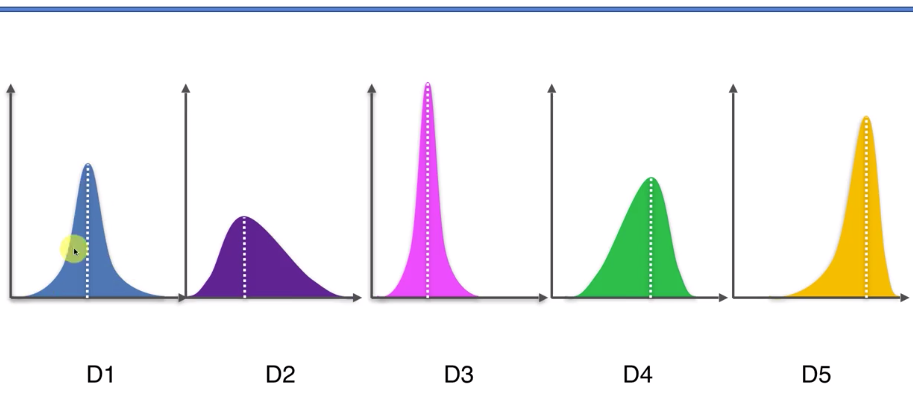

# 如何选择

## 多臂老虎机

在我们思考选择之前，先来看看历史中的[多臂老虎机问题](https://en.wikipedia.org/wiki/Multi-armed_bandit)：一个赌徒，走进赌场一看，一排老虎机，外表一模一样，他要去摇老虎机，但是每个老虎机吐钱的概率可不一样，并且他不知道概率分布(如下图所示)是什么，那么每次该选择哪个老虎机可以做到最大化收益呢？

解决这个问题唯一的办法是去试，而如何去尝试，这就是我们要解决的等价问题。

假设我们已经经过一些试验，得到了当前每个老虎机的吐钱的概率，如果想要获得最大的收益，我们会一直摇那个吐钱概率最高的老虎机(也就是D5，它的均值最高)，这就是 **Exploitation** 。但是，如果当前获得的信息并不是老虎机吐钱的真实概率，可能还有更好的老虎机吐钱概率更高，因此还需要进一步探索，这就是 **Exploration**。

类似的多臂问题还有很多：

1. 假设一个用户对不同类别的内容感兴趣程度不同，那么我们的推荐系统初次见到这个用户时，怎么快速地知道他对每类内容的感兴趣程度？这就是推荐系统的冷启动。
2. 假设我们有若干广告库存，怎么知道该给每个用户展示哪个广告，从而获得最大的点击收益？是每次都挑效果最好那个么？那么新广告如何才有出头之日？
3. 我们的算法工程师又想出了新的模型，有没有比A/B test更快的方法知道它和旧模型相比谁更靠谱？
4. 如果只是推荐已知的用户感兴趣的物品，如何才能科学地冒险给他推荐一些新鲜的物品？
5. ...

## UCB（Upper Confidence Bound）算法

UCB（Upper Confidence Bound）算法是一种用于解决多臂老虎机问题的启发式方法。多臂老虎机问题是一种用以模拟现实世界决策问题的数学模型，其中“臂”代表不同的行动或选择，而“老虎机”代表这些行动的随机结果。UCB算法的目标是在 exploration 和 exploitation 之间找到最佳平衡，以最大化累积奖励。

这个算法有两个重要的**原则**：

1. Optimism in the face of uncertainty
2. Reducing the optimism in Interactions

UCB算法的核心思想是为每个臂维护一个置信上界，这个置信上界是基于臂的历史奖励和被选择的次数计算得出的，算法在每一步选择具有最高置信上界的臂进行操作（算法的第一个原则），置信上界计算如下：
$$
UCB(a)=\bar{x}_j\left(t\right)+\sqrt{\frac{2\ln t}{T_{j,t}}}
$$
其中，$\bar{x}_j\left(t\right)$表示the average reward obtained from machine j，$j\in\{1,\ldots,K\}$，后面的叫做 bonus（这个就是置信区间，即不确定性的大小，可以看出随着次数$T_{j,t}$的增多，置信区间会变小，也就是原则2），本质上是均值的标准差，t 是目前的试验次数，$T_{j,t}$是the number of times j has been played so far

算法的步骤：先对每一个臂都试一遍，之后在任意时刻$t\quad(t>K)$，选择具有最高置信上界的臂，观察选择结果，更新 t 和$T_{j,t}$。最后就可以得到某个臂的平均值大于其他所有的臂的置信上界，此时这个臂就有极大概率是最优选择。

### 例子

假如说你需要吃饭，你可以选择麦当劳，肯德基和汉堡王

你前三次分别尝试了肯德基，汉堡王和麦当劳。

你点的套餐是其中一种牛肉汉堡的套餐。你觉得汉堡王最好吃，那么你第4次选择了汉堡王，你尝试了别的套餐，汉堡王没有给你和上次一样好的感受，那么汉堡王的估计奖励就降低了，汉堡王的UCB参数也降低了，而麦当劳和肯德基的UCB参数随着回合数的增大，以及因为没有被选择次数的增加而增加了。直到可能麦当劳的UCB参数变大，你尝试了麦当劳，麦当劳给你的感觉依然很好，那么你尝试麦当劳的次数会增大，麦当劳的乐观加分会变小，但是由于麦当劳的估计奖励非常稳定的高，慢慢的就让平均估计奖励趋于了真值。最终你发现麦当劳是最优选择。

到此，对于生活中的众多选择你应该可以得到一个极大概率的最优解。

### 不足

UCB 算法在做 EE ( Exploit-Explore ) 的时候表现不错，但它是上下文无关 (context free) 的算法，它只管埋头干活，根本不观察一下面对的都是些什么特点的 arm，下次遇到相似特点但不一样的 arm 也帮不上什么忙，因此有学者引入了特征信息，来刻画 User 和 Item 这一对 CP，更好地为更多的 User匹配到适合他们Item。