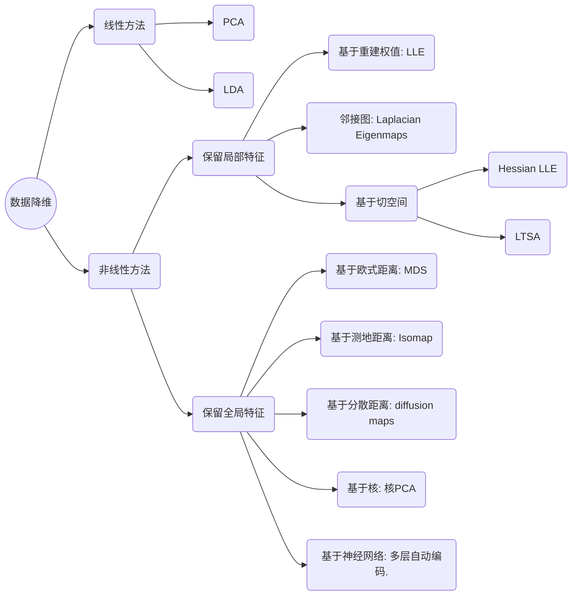

# 线性判别分析（LDA）, 主成分分析(PCA)

线性分类器最简单的就是LDA，它可以看做是简化版的SVM。

谈到LDA，就不得不谈谈PCA，PCA是一个和LDA非常相关的算法，从推导、求解、到算法最终的结果，都有着相当的相似，LDA和PCA最终的表现都是解一个矩阵特征值的问题，但是理解了如何推导，才能更深刻的理解其中的含义。

## LDA

LDA的全称是Linear Discriminant Analysis（线性判别分析），是一种supervised learning。有些资料上也称为是Fisher’s Linear Discriminant，因为它被Ronald Fisher发明自1936年，Discriminant可以理解是，一个模型，不需要去通过概率的方法来训练、预测数据，比如说各种贝叶斯方法，就需要获取数据的先验、后验概率等等。

LDA的原理是，将带上标签的数据（点），通过投影的方法，投影到维度更低的空间中，使得投影后的点，会形成按类别区分，一簇一簇的情况，相同类别的点，将会在投影后的空间中更接近。要说明白LDA，首先得弄明白[Linear Classifier](http://en.wikipedia.org/wiki/Linear_classifier)：因为LDA是一种线性分类器。对于K-分类的一个分类问题，会有K个线性函数：
$$
y_k(x)=w_k^Tx+w_{k0}
$$
当满足条件：对于所有的$j$，都有$Y_k > Y_j$,的时候，我们就说$x$属于类别$k$。对于每一个分类，都有一个公式去算一个分值，在所有的公式得到的分值中，找一个最大的，就是所属的分类了。

上式实际上就是一种投影，是将一个高维的点投影到一条高维的直线上，LDA的目标是，给出一个标注了类别的数据集，投影到了一条直线之后，能够使得点尽量的按类别区分开，当$K=2$即二分类问题的时候，如下图所示：

红色的方形的点为0类的原始点、蓝色的方形点为1类的原始点，经过原点的那条线就是投影的直线，从图上可以清楚的看到，红色的点和蓝色的点被**原点**明显的分开了，这个数据只是随便画的，如果在高维的情况下，看起来会更好一点。下面我来推导一下二分类LDA问题的公式：

假设用来区分二分类的直线（投影函数)为：
$$
y=w^Tx
$$
LDA分类的一个目标是使得不同类别之间的距离越远越好，同一类别之中的距离越近越好：

- 类别i的原始中心点为：
  $$
  m_i=\frac{1}{n_i}\sum_{x\in{D_i}}x
  $$
  其中$D_i$表示属于类别$i$的点

- 类别$i$投影后的中心点为：
  $$
  \widetilde{m}_i=w^Tm_i
  $$

衡量类别$i$投影后，类别点之间的分散程度（方差）为：
$$
\widetilde{s}_i=\sum_{y\in Y_i}(y-\widetilde{m}_i)^2
$$
最终我们可以得到下面的公式，表示 LDA 投影到$w$后的损失函数：
$$
J(w)=\frac{\left|\widetilde{m}_1-\widetilde{m}_2\right|^2}{\tilde{s}_1^2+\tilde{s}_2^2}
$$
分类的目标是，使得类别内的点距离越近越好（集中），类别间的点越远越好。分母表示每一个类别内的方差之和，方差越大表示一个类别内的点越分散，分子为两个类别各自的中心点的距离的平方，我们最大化$J(w)$就可以求出最优的$w$了。

🌟想要求出最优的$w$，可以使用拉格朗日乘子法，但是在我们得到的$J(w)$里面，我们需要想办法将$w$单独提出来。

定义一个投影前的各类别分散程度的矩阵:
$$
S_i=\sum_{x\in D_i}(x-m_i)(x-m_i)^T
$$
它意思是，如果某一个分类的输入点集$D_i$里面的点距离这个分类的中心点$m_i$越近，则$S_i$里面元素的值就越小，如果分类的点都紧紧地围绕着$m_i$，则$S_i$里面的元素值越更接近0

将$S_i$代入:
$$
\widetilde{s}_i=\sum_{x\in D_i}(w^Tx-w^Tm_i)^2=\sum_{x\in D_i}w^T(x-m_i)(x-m_i)^Tw=w^TS_iw
$$
将$J(w)$分母化为：
$$
\widetilde{s}_1^2+\widetilde{s}_2^2=w^T(S_1+S_2)w=w^TS_ww
$$
同样的将$J(w)$分子化为：
$$
\left|\widetilde{m}_1-\widetilde{m}_2\right|^2=w^T(m_1-m_2)(m_1-m_2)^Tw=w^TS_Bw
$$
这样损失函数可以化成下面的形式：
$$
J(w)=\frac{w^TS_Bw}{w^TS_ww}
$$
这样就可以用拉格朗日乘子法了，但是还有一个问题，如果分子、分母是都可以取任意值的，那就会使得有无穷解，我们将分母限制为长度为1（这是用拉格朗日乘子法一个很重要的技巧，在下面将说的 PCA 里面也会用到），并作为拉格朗日乘子法的限制条件，带入得到：
$$
c(w)=w^TS_Bw-\lambda(w^TS_ww-1)
\\\Rightarrow \frac{dc}{dw}=2S_Bw-2\lambda S_ww
\\\Rightarrow S_B=\lambda S_ww
$$
这样的式子就是一个求特征值的问题了。

对于$N(N>2)$分类的问题，有如下结论：
$$
S_w=\sum_{i=1}^cS_i
\\S_B=\sum_{i=1}^cn_i(m_i-m)(m_i-m)^T
\\S_Bw_i=\lambda S_ww_i
$$
这同样是一个求特征值的问题，我们求出的第$i$大的特征向量，就是对应的$W_i$了。

特征值在纯数学、量子力学、固体力学、计算机等等领域都有广泛的应用，特征值表示的是矩阵的性质，当我们取到矩阵的前$N$个最大的特征值的时候，我们可以说提取到的矩阵主要的成分（这个和之后的 PCA 相关，但是不是完全一样的概念）。在机器学习领域，不少的地方都要用到特征值的计算，比如说图像识别、pagerank、LDA、还有之后将会提到的 PCA 等等。

下图是图像识别中广泛用到的特征脸（eigen face），提取出特征脸有两个目的，首先是为了压缩数据，对于一张图片，只需要保存其最重要的部分就是了，然后是为了使得程序更容易处理，在提取主要特征的时候，很多的噪声都被过滤掉了。跟下面将谈到的 PCA 的作用非常相关。

特征值的求法有很多，求一个$D\times D$的矩阵的时间复杂度是$O(D^3)$, 也有一些求Top $M$的方法，比如说[power method](http://en.wikipedia.org/wiki/Power_method)，它的时间复杂度是$O(D^2 \times M)$，总体来说，求特征值是一个很费时间的操作，如果是单机环境下，是很局限的。

## PCA

主成分分析（PCA）与 LDA 有着非常近似的意思，LDA的输入数据是带标签的，而PCA的输入数据是不带标签的，所以PCA是一种**unsupervised learning**。LDA通常来说是作为一个独立的算法存在，给定了训练数据后，将会得到一系列的判别函数（discriminate function），之后对于新的输入，就可以进行预测了。而PCA更像是一个预处理的方法，它可以将原本的数据降低维度，而使得降低了维度的数据之间的方差最大（也可以说投影误差最小）。

方差这个东西是个很有趣的，有些时候我们会考虑减少方差（比如说训练模型的时候，我们会考虑到方差-偏差的均衡），有的时候我们会尽量的增大方差。方差就像是一种信仰，不一定会有很严密的证明，从实践来说，通过尽量增大投影方差的PCA算法，确实可以提高我们的算法质量。

我下面将用两种思路来推导出一个同样的表达式，首先是最大化投影后的方差，其次是最小化投影后的损失（投影产生的损失最小）。

#### 最大化方差法

假设我们还是将一个空间中的点投影到一个向量中去。首先，给出原空间的中心点：
$$
\bar{x}=\frac{1}{N}\sum_{n=1}^Nx_n
$$
假设$u_1$为投影向量，投影之后的方差为：
$$
\frac{1}{N}\sum_{n=1}^N(u_1^Tx_n-u_1^T\bar x)^2=u_1^TSu_1
$$
优化上式等号右边的内容，还是用拉格朗日乘子法：
$$
u_1^TSu_1+\lambda_1(1-u_1^Tu_1)
$$
将上式求导，使之为0，得到：$Su_1=\lambda_1u_1$

这是一个标准的特征值表达式了，$λ$对应的特征值，$u$对应的特征向量。上式的左边取得最大值的条件就是$λ_1$最大，也就是取得最大的特征值的时候。假设我们是要将一个D维的数据空间投影到M维的数据空间中$（M < D)$， 那我们取前M个特征向量构成的投影矩阵就是能够使得方差最大的矩阵了。

#### 最小化损失法

假设输入数据$x$是在D维空间中的点，那么，我们可以用D个正交的D维向量去完全的表示这个空间。在D维空间中，有无穷多种可能找这D个正交的D维向量，哪个组合是最合适的呢？

假设我们已经找到了这D个向量，可以得到：
$$
x_n=\sum_{i=1}^D\alpha_{n_{i}}u_i
$$
🌟可以用近似法来表示投影后的点：
$$
\widetilde{x}_n=\sum_{i=1}^Mz_{n_i}u_i+\sum_{i=M+1}^Db_{i}u_i
$$
上式表示，得到的新的$x$是由前M个基的线性组合加上后$D - M$个基的线性组合，注意这里的$z$是对于每个$x$都不同的，而$b$对于每个$x$是相同的，这样我们就可以用$M$个数来表示空间中的一个点，也就是使得数据降维了。但是这样降维后的数据，必然会产生一些扭曲，我们用$J$描述这种扭曲，我们的目标是，使得$J$最小：
$$
J=\frac1N\sum_{n=1}^N\parallel x_n-\tilde{x}_n\parallel^2
$$
上式的意思很直观，就是对于每一个点，将降维后的点与原始的点之间的距离的平方和加起来，求平均值，我们就要使得这个平均值最小。我们令：
$$
\frac{\partial J}{\partial z_{nj}}=0\Rightarrow z_{nj}=x_{n}^{T}u_{j}
\\\quad\frac{\partial J}{\partial b_{j}}=0\Rightarrow b_{j}=x^{T}u_{j}
$$
将上面得到的z与b带入降维的表达式得：
$$
x_{n}-\tilde{x}_{n}=\sum_{i=M+1}^{D}\{(x_{n}-\bar{x})u_{i}\}u_{i}
$$
将上式带入$J$的表达式得到：
$$
J=\frac{1}{N}\sum_{n=1}^{N}\sum_{i=M+1}^{D}\left(x_{n}^{T}u_{i}-x^{-T}u_{i}\right)^{2}=\sum_{i=M+1}^{D}u_{i}^{T}Su_{i}
$$
再用拉普拉斯乘子法，可以得到，取得我们想要的投影基的表达式为：
$$
Su_{i}=\lambda_{i}u_{i}
$$
这里又是一个特征值的表达式，我们想要的前M个向量其实就是这里最大的M个特征值所对应的特征向量。

证明这个，$J$可以化为：
$$
J=\sum_{i=M+1}^M\lambda_i
$$
也就是当误差J是由最小的$D - M$个特征值组成的时候，$J$取得最小值。

下图是PCA的投影的一个表示，黑色的点是原始的点，带箭头的虚线是投影的向量，$pc_1$表示特征值最大的特征向量，$pc_2$表示特征值次大的特征向量，两者是彼此正交的，因为这原本是一个2维的空间，所以最多有两个投影的向量，如果空间维度更高，则投影的向量会更多。

