## 前言

### 我是谁？

26届本科生，在秋招前已拿腾讯、字节、淘天、美团、蚂蚁、小红书、得物、拼多多等大厂offer，四段大厂实习经历，在这里给大家分享一套Java的学习路线。

另外本期视频的这个文案资料我会放视频简介或者评论区置顶，但我希望你们仍然能够静下心来看这个视频，因为我不会完全逐字念这个文案，我会脱离文案之外讲一些东西。不看我这个视频的话，就错过了，你已经浪费很多时间了，不差看一个视频的时间，不要假努力。

### 姊妹篇

【大三的我是如何拿下三段大厂实习？计算机专业最危险的信息差，被学校骗了四年？！错过这些毕业即失业？】&#x20;

https://www.bilibili.com/video/BV1Z1XQYmE1h

希望大家看本视频前，能先去看我的上一期视频，里面包含的内容非常干货，视频很长，但质量也很高，视频好不好可以先去看评论区反响。你们99%的问题都能在我的上一期视频和这一期视频找到答案，我希望你们能先耐心把这两个视频看完，如果真的还没答案，再来提问，这才是有效提问，而不是到处问，却不行动，这种人，我不欢迎。

大家一定要先明确目标，打破信息差，再去行动，绝对是10倍的效率！

### 本期内容

主要是讲Java的一整个生态的学习路线，可以说，一整个Java该学什么，从0基础到进大厂需要掌握的东西，看本视频就够了，这都是我个人经验的倾囊相授。当然，对于其它语言而言，本视频里的“算法”、“项目”都是通用的，也可以看。

我不会说这是全网最好的路线，那样博人眼球太夸张了，但我敢说这一定是经过实践的、我结合我的实际经历+我对我走过的弯路进行改良后得到的一条学习路线。

本期内容只讲路线，至于学了过后会忘记，一天该学多久等这些问题，见我上期视频，都有解答！

## 路线

### 如何学

入门的话推荐主要看视频学。

### 入门路线

* JavaSE - 建议20 - 25天学完 - 重要程度5.0 - 相当于基础，主要学Java基本语法

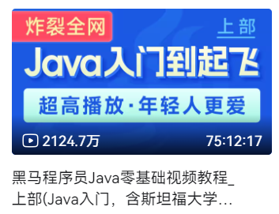

https://www.bilibili.com/video/BV17F411T7Ao/

https://www.bilibili.com/video/BV1yW4y1Y7Ms/

重点：数据类型、面向对象、集合、字符串、高级集合、Stream流、异常、多线程、反射

代码稍微写点就行，在前期熟悉语法，代码格式规范，后面熟悉了之后就不怎么需要写代码

* MySQL - 建议4 - 5天学完 - 重要程度5.0 - 八股四大件之一，面试八股重灾区。

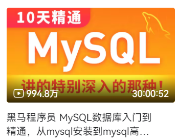

https://www.bilibili.com/video/BV1Kr4y1i7ru/

重点：SQL基础、事务、索引、SQL优化、锁、InnoDB存储引擎、日志、主从复制、分库分表、读写分离

没有代码，不用敲代码。

* JDBC - 建议0.5天学完 - 重要程度2.0 - 主要是把MySQL和Java结合起来，如何用Java操作MySQL，但是已被框架封装，了解即可

https://www.bilibili.com/video/BV1s3411K7jH/

稍微跟着敲一点点代码即可，不怎么重要，但其实是底层原理，还是需要了解的。

* &#x20;JavaWeb - 建议3-4天学完 - 重要程度3.8 - 初步接触框架，感受Java能干啥

  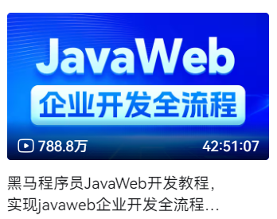

  https://www.bilibili.com/video/BV1m84y1w7Tb/

  前端部分非常快速的过一遍，不是重点，可以跳着看，代码不用敲。

  maven稍微了解即可，会用就行，不用死磕。

  Web部分需要跟着敲下代码，MySQL直接全跳过，之前学了的，后面的除了maven高级部分基本都是重点，都可以跟着敲敲。

* SSM（Spring、SpringMVC、Mybatis） - 时间看个人情况 - 重要程度4.0 - 三大框架，但面试不咋问，现在也不会单独用，都用SpringBoot整合这些东西了，但属于底层基础，SpringBoot只是整合，其底层还是这三大框架。

黑马路线：

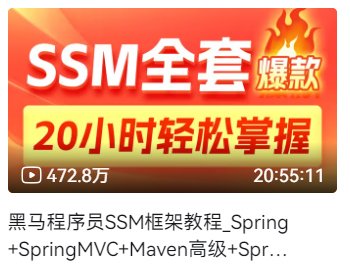

https://www.bilibili.com/video/BV1Fi4y1S7ix/

全篇重点，是否跟着敲代码看自己的掌握程度。这里面的m其实是maven，因为黑马的JavaWeb中已经简单介绍了Mybatis了。

动力节点路线：

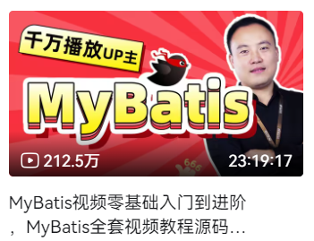

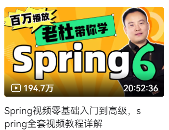

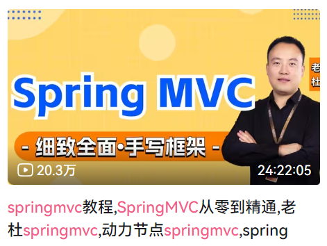

https://www.bilibili.com/video/BV1JP4y1Z73S/

https://www.bilibili.com/video/BV1Ft4y1g7Fb/

https://www.bilibili.com/video/BV1sC411L76f

全篇重点，是否跟着敲代码看自己的掌握程度。

* Git - 建议1-2天学完 - 重要程度4.3 - 全世界都在用的代码管理工具，企业必用，但面试不问，因为已经默认你会这项技能了。

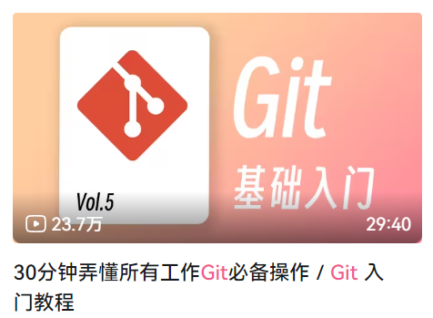

https://www.bilibili.com/video/BV1pX4y1S7Dq/

再结合菜鸟教程里的Git教程一起学习：https://www.runoob.com/git/git-tutorial.html

一定一定要动手实践，这是最需要你实践的一集，本地，远程仓库如何搞，发生冲突如何解决等等这些，一定要实践。

* linux基本命令 - 建议1-2天学完 - 重要程度4.3 - 全世界都在用的操作系统linux，熟悉基本命令就行，企业里大概率是能用上的，查日志啥的基本都是需要登进linux机器上进行操作。

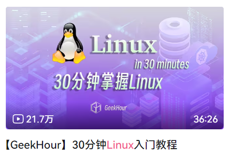

https://www.bilibili.com/video/BV1cq421w72c/

再结合菜鸟教程里的Linux教程一起学习：https://www.runoob.com/linux/linux-tutorial.html

一定一定要动手实践，这是第二需要你实践的一集。

* SpringBoot - 建议4-5天学完 - 重要程度4.2 - 现在最主流的框架，但面试问的相对较少，但一定得会。

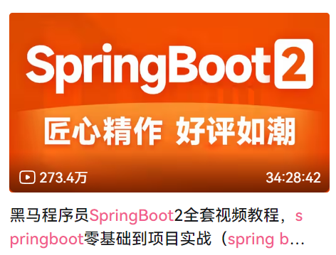

https://www.bilibili.com/video/BV15b4y1a7yG/

没啥重点非重点之分，基本上就是学如何用SpringBoot框架做配置，结合自己情况决定是否跟敲代码。

版本也没啥需要关注的点，SpringBoot2和SpringBoot3没啥区别，底层是差不多的。

* Redis - 建议8-10天学完 - 重要程度5.0 - 八股四大件之一，面试八股重灾区。

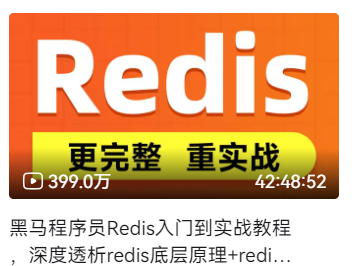

https://www.bilibili.com/video/BV1cr4y1671t/

全篇重点，打起十二分的精神学习，里面包含了你的第一个项目——黑马点评，Java最好的入门项目，没有之一，你将使用你之前所学的全部知识完整的写一个项目，我当初4天就学完了，让人欲罢不能、回味无穷的课程。代码根据自己情况决定跟不跟敲，时间来得及的话，非常推荐跟敲一遍。

* SpringCloud - 建议3-4天学完 - 重要程度4.4 - 现在非常流行的微服务，但面试问的相对较少。

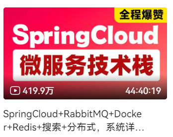

https://www.bilibili.com/video/BV1LQ4y127n4/

这里划**非重点**：p42-p142都可以跳过，内含docker、MQ、ES三部分。

非重点之外的都要看看，代码根据自己情况决定跟不跟敲，不是很有必要跟。

* RocketMQ - 建议1-2天学完 - 重要程度4.9 - 除八股四大件之外的最重要的点，和Kafka之间挑一个学就行，我学的是RockeMQ。

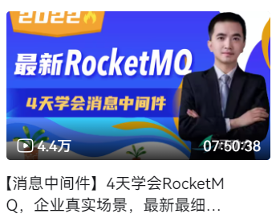

https://www.bilibili.com/video/BV1AU4y157LX/

全篇重点，时间充足的话建议跟敲代码

* JVM - 建议5-6天学完 - 重要程度5.0 - 八股四大件之一，面试八股重灾区。

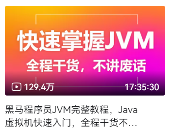

https://www.bilibili.com/video/BV1yE411Z7AP/

全篇重点，时间充足的话建议跟敲代码

* JUC - 建议8-9天学完 - 重要程度5.0 - 八股四大件之一，面试八股重灾区。

https://www.bilibili.com/video/BV16J411h7Rd/

全篇重点，时间充足的话建议跟敲代码

总结：

至此，Java基本入门，按照我建议的计划的话，大概花费2个月的时间。此时已经具备找实习的基本条件（只是具备基本条件，能不能找得到还得看你学的程度怎么样，基础打得牢不牢），当然，还需要有两个项目。

其次，可以看到，我大部分情况下，都没说一定要跟敲代码，因为我觉得代码你敲了还是要忘记的，而且框架的代码基本没什么用，熟悉底层原理、基本使用就够了。代码我希望你能在你的项目中再好好锻炼。

### 进阶路线

* Spring高级

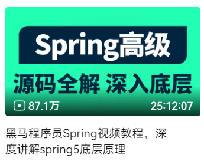

https://www.bilibili.com/video/BV1P44y1N7QG/

* Dubbo

https://www.bilibili.com/video/BV1VE411q7dX/

* 操作系统

https://xiaolincoding.com/os/

* 计算机网络&#x20;

《网络是怎样连接的》——户根勤

https://xiaolincoding.com/network/

* 设计模式

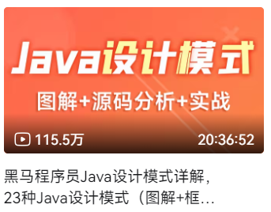

https://www.bilibili.com/video/BV1Np4y1z7BU/

我整理的：https://github.com/Elejiang/design-pattern

* Netty

https://www.bilibili.com/video/BV1py4y1E7oA/

* ShardingSphere

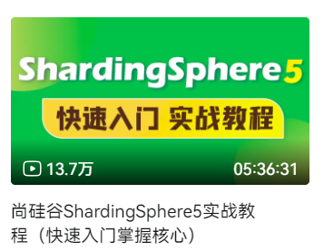

https://www.bilibili.com/video/BV1ta411g7Jf/

* Zookeeper

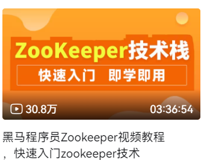

https://www.bilibili.com/video/BV1M741137qY/

至此，基本上Java技术就学完了，剩下的就是深入

## 八股

### 是什么？

即面试的时候，面试官问你的上面我们学的知识，因为问题和回答都较为死板，类似八股取士，我们叫它八股，但是，实际上现在很多问题，都是非常灵活的，并且即使是常见八股，你的回答也能和别人不一样，能体现出你的思考，也可以拉开和别人的差距，所以不要觉得死背八股就能过这一关。八股这一说法更多是调侃，而不是真八股。

### 怎么做？

这块我极不建议大家死背八股。

我这里建议大家“深度+记录”结合，来处理八股这块。即现在市面上有很多八股来源，对这些八股进行深度学习，同时记录下自己的思考。

八股来源：

* 小林Coing - https://xiaolincoding.com/

* JavaGuide - https://javaguide.cn/

* 二哥 - https://javabetter.cn/

* pdai - https://www.pdai.tech/

* 博客园 - https://www.cnblogs.com/

* 腾讯云开发社区 - https://cloud.tencent.com/developer

* 阿里云开发社区 - https://developer.aliyun.com/

* 稀土掘金 - https://juejin.cn/

* CSDN - https://www.csdn.net/

这里只是简单列举，你们肯定在学习过程中还会接触到其它八股来源，都可以将其保留下来。然后广度的获取知识。

书籍推荐：

* 《深入理解Java虚拟机-JVM高级特性与最佳实践》- 4.9

* 《MySQL技术内幕-InnoDB存储引擎》- 4.9

* 《Java并发编程的艺术》- 4.8

* 《码农翻身》- 4.8

* 《网络是怎样连接的》- 4.8

* 《亿级流量系统架构设计与实战》- 5.0

电子纸质都可以，这都不是重点。

## 算法

### 是什么？

就是写题，可能出现在面试和笔试中，对于面试，是核心代码模式（非绝对）；对于笔试，一定是ACM模式。

核心代码模式，就是直接实现函数就行；ACM模式，就是需要处理输入输出，也就是Java里面的Scanner和System.out.println()这些

一般来说，都是在非IDE的环境下写题，也就是说你是不知道哪个类有哪些方法的，所以需要熟悉我们Java中的API

### 刷什么？

算法只需要刷力扣平台（https://leetcode.cn/studyplan/）上的“hot100”、“LeetCode 75”、“面试经典150”、“高频SQL50题（基础版）”即可！

相信我，刷完这四个，算法这块就过关了，如果你觉得不够，可以再刷个“剑指offer”，我已经帮大家整理好题单了：https://leetcode.cn/problem-list/QQcuyKam/

对于ACM模式，我建议大家再熟悉核心代码模式后，直接去“牛客网”上直接找真题练习（https://www.nowcoder.com/exam/company），因为我目前遇过所有的大厂笔试，都是在“牛客网”上做题的

### 怎么刷？

按分类刷，对于一个分类下，从简单-中等-困难的顺序去刷，一道题五分钟没思路，直接看题解，不要犹豫，因为不是你从0到1想出来的才叫成长，而是你踩在前人的肩膀上，能够举一反三，这才叫成长，好比你让一个小学生求导数，小学生完全没接触过导数，打破脑袋也求不出来，还一个劲死磕，感觉好像看题解是一件很羞耻的事，完全是错误的路。你应该通过看题解，懂得什么是函数，什么是斜率，最后才成长到知道什么是导数，怎么求导，以后再遇到类似的题，就能直接做了。所以不要觉得看题解很羞耻，直接看就完事，但你一定要从题解获得成长，而不是走马观花，你应该把思考问题的时间花在思考题解上！

除此之外，可以看“灵茶山艾府”的一套基础算法精讲，基本上是对标hot100题单里的题，非常推荐去看，每个视频简介里的课后作业也可以做做（https://space.bilibili.com/206214/lists/842776?type=season）

其次是需要反复刷，来回刷，刷到能够看到题就默写的程度，只刷上面的题单，刷完一遍刷第二遍，刷完第二遍刷第三遍，就我个人而言，我把“hot100”刷了四五遍了，现在刷一遍只需要一天半就能刷完一百题。

### 何时刷？

在学完JavaSE的集合后，熟悉集合的基本操作后，再去稍微了解下常见数据结构，比如单端队列、双端队列、优先队列、栈、二叉树、二叉搜索树的特点，以及Java中对应的实现类后，就可以刷题了，至于常见的算法策略，比如二分查找、贪心、动态规划这些，是在刷题中学会的，也就是我上面所说的看题解，从题解中了解。

算法是个长期的过程，题目量不需要刷很多，但要反复刷，所以需要较早开始，但不需要投入太多的时间。

### 重要性？

可以看到，我推荐大家直接从刷题入手，不要你去系统地学什么数据结构，系统地学习算法啥的，就是直接刷题，因为算法其实是个很尴尬的位置：

算法的唯一用处就是为了筛选人，实际工作根本用不到。

而在面试中，我面了30多场大厂面试，90%的算法都是“hot100”题库里的原题，一个字都不改的原题，剩下10%的题，基本上吃透“hot100”里的题，有一定算法思维后，就能做出来。

而在笔试中，不会出现原题。笔试中的算法，一般是3-4题，但是其实就是走个过场，人家压根不看笔试成绩，仍然是看你简历来决定约不约面，除非你是0题选手，那样太不给面子了，一般来说你只需要写出1题，甚至简历好的情况下，写出半题都没事（笔试中根据你通过的用例比例来算成绩，所以有可能出现小数），所以压根没有什么笔试挂，只有简历挂，而笔试中的第一题基本就是签到题，就是很简单，来了就能做出来。所以笔试就是走个过场。

综上，算法没必要刷太多，走个过场而已，面试提前告诉你题库，笔试又不看成绩。

## 项目

### 核心考察是什么？

实习也可以属于项目当中，里面的思维是一样的，但仍然会有一些不一样的地方，比如实习该如何做产出等等，有关实习部分可以去看我上一期视频，我这里主要还是讲项目。

项目的话，首先，简历上至少要有两个项目，有实习的话，可以适当减少至一个。没实习的话，一定至少两个。

其次，我这边不会推荐具体的某个项目。因为我觉得，无论你是所谓的高并发项目，还是所谓的外卖商城经典烂大街项目，还是所谓的轮子项目，亦或是自研项目，等等这些，都不是面试官想考察的项目的点，不会说你是少见的、听起来牛逼哄哄的项目，就一定比那些用烂大街项目的人厉害，然后对你多看两眼，不是这样的。项目的真正的作用、面试官真正想看到想听到的，是你对项目的自己的思考、你独特的理解、你创新的地方。如果你能对项目有自己的理解、有自己的创新的点，那么你在面试时，是完全不会怕的，比如面试官问你：“你这个项目有上线吗？qps多少？”有的人一听就怕了，实际上你完完全全可以大大方方的承认：“是这样的面试官，我这个项目是网上的一个开源学习项目，然后我就是拉取了代码进行学习，主要还是出于探索学习目的，所以并没有上线，但在我学习的过程中，我发现原有项目有几个点存在问题，那出于学习目的，我肯定是对这几个点进行了深入思考的，最终我基于这个开源学习项目有了基于我自己见解的一些修改，比如第一点......”，这才是面试官想看到的东西，而不是你写了个天花乱坠的项目，面试官上来一问：“我想知道哪些是你自己做的？”然后你就懵了，你背了很多文档，或者说也准备了很多可能被深挖的点，结果啥也回答不出来。

所以，面试问项目的真正的意义，在于你需要有能体现你价值、体现你思考、体现你技术、体现你思维的亮点，而无关项目，不管你是外卖也好还是商城也罢。

但是，有个非常重要的点，就是我极力不推荐大家用市面上我们所谓的烂大街的项目，就是说人手一份的项目，即使说，你对这个烂大街的项目，有自己非常非常非常独特的理解，甚至说你基于你自己的理解，对代码重构了90%以上，这个项目就像你亲生儿子一样熟悉，你如数家珍，也没用。因为你很难过简历筛，并且面试官大概率对项目不感兴趣，还没开问就没第一印象了，所以项目无罪，但用的人多了就有罪了。

我不推荐具体项目，但我可以推荐一些方向，我推荐大家可以去做AI方向的一些东西。现在AI方向是比较火的，大家可以做一些Java结合AI的项目。

### 什么时候开始？

因人而异，没有标准，结合你现在的进度、时间、知识掌握程度来自己安排。

我建议尽量往后放，因为当你知识沉淀积累到一定程度后，你对项目各个技术栈的理解是会不一样的。也就更容易有自己的思考与理解。

