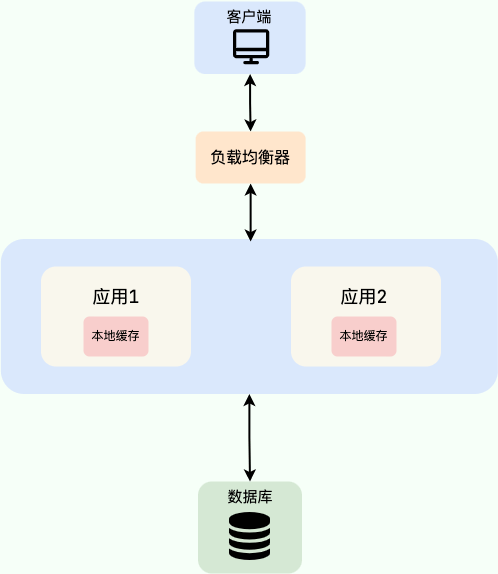
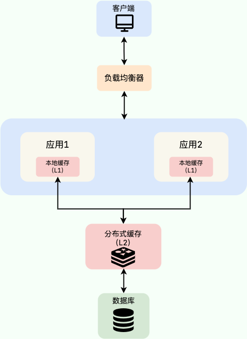

# Redis 基础：为什么要用分布式缓存？

> **相关面试题** ：
>
>  
>
> + 为什么要用缓存？
> + 本地缓存应该怎么做？
> + 为什么要有分布式缓存?/为什么不直接用本地缓存?
> + 为什么要用多级缓存？
> + 多级缓存适合哪些业务场景？
>

## 缓存的基本思想

很多同学只知道缓存可以提高系统性能以及减少请求相应时间，但是，不太清楚缓存的本质思想是什么。

缓存的基本思想其实很简单，就是我们非常熟悉的 **空间换时间** 这一经典性能优化策略的运用。所谓空间换时间，也就是用更多的存储空间来存储一些可能重复使用或计算的数据，从而减少数据的重新获取或计算的时间。

说到空间换时间，除了缓存之外，你还能想到什么其他的例子吗？这里再列举几个常见的：

+ 索引：索引是一种将数据库表中的某些列或字段按照一定的排序规则组织成一个单独的数据结构，需要额外占用空间，但可以大大提高检索效率，降低数据排序成本。
+ 数据库表字段冗余：将经常联合查询的数据冗余存储在同一张表中，以减少对多张表的关联查询，进而提升查询性能，减轻数据库压力。
+ CDN（内容分发网络）：将静态资源分发到多个不同的地方以实现就近访问，进而加快静态资源的访问速度，减轻服务器以及带宽的负担。

编程需要要学会归纳总结，将自己学到的东西串联起来！假如你在面试的时候，能聊到这些，面试官一定会对你有一个好印象的。

不要把缓存想的太高大上，虽然，它的确对系统的性能提升的性价比非常高。当我们在学习并应用缓存的时候，你会发现缓存的思想实际在CPU、操作系统或者其他很多地方都被大量用到。

比如，CPU Cache 缓存的是内存数据用于解决 CPU 处理速度和内存不匹配的问题，内存缓存的是硬盘数据用于解决硬盘访问速度过慢的问题。

再比如，为了提高虚拟地址到物理地址的转换速度，操作系统在页表方案基础之上引入了转址旁路缓存(Translation Lookasjde Buffer，TLB，也被称为快表) 。

再拿我们日常使用的软件来说，一般都会对你访问过的一些图片或者文件进行缓存，这样你下次再访问的时候加载速度就很快了。

我们日常开发过程中用到的缓存，其中的数据通常存储于内存中，因此访问速度非常快。为了避免内存中的数据在重启或者宕机之后丢失，很多缓存中间件会利用磁盘做持久化。也就是说，缓存相比较于我们常用的关系型数据库（比如 MySQL）来说访问速度要快非常多。为了避免用户请求数据库中的数据速度过于缓慢，我们可以在数据库之上增加一层缓存。

除了能够提高访问速度之外，缓存支持的并发量也要更大，有了缓存之后，数据库的压力也会随之变小。

## 缓存的分类

接下来，我们来看看日常开发中用到的缓存通常被分为哪几种。

### 本地缓存

#### 什么是本地缓存?

这个实际在很多项目中用的蛮多，特别是单体架构的时候。数据量不大，并且没有分布式要求的话，使用本地缓存还是可以的。

本地缓存位于应用内部，其最大的优点是应用存在于同一个进程内部，请求本地缓存的速度非常快，不存在额外的网络开销。

常见的单体架构图如下，我们使用 **Nginx** 来做**负载均衡**，部署两个相同的应用到服务器，两个服务使用同一个数据库，并且使用的是本地缓存。

#### 本地缓存的方案有哪些？

**1、JDK 自带的 **`**HashMap**`** 和 **`**ConcurrentHashMap**`** 了。**

`ConcurrentHashMap` 可以看作是线程安全版本的 `HashMap` ，两者都是存放 key/value 形式的键值对。但是，大部分场景来说不会使用这两者当做缓存，因为只提供了缓存的功能，并没有提供其他诸如过期时间之类的功能。一个稍微完善一点的缓存框架至少要提供：**过期时间**、**淘汰机制**、**命中率统计**这三点。

**2、 **`**Ehcache**`** 、 **`**Guava Cache**`** 、 **`**Spring Cache**`** 这三者是使用的比较多的本地缓存框架。**

+ `Ehcache` 的话相比于其他两者更加重量。不过，相比于 `Guava Cache` 、 `Spring Cache` 来说， `Ehcache` 支持可以嵌入到 hibernate 和 mybatis 作为多级缓存，并且可以将缓存的数据持久化到本地磁盘中、同时也提供了集群方案（比较鸡肋，可忽略）。
+ `Guava Cache` 和 `Spring Cache` 两者的话比较像。`Guava` 相比于 `Spring Cache` 的话使用的更多一点，它提供了 API 非常方便我们使用，同时也提供了设置缓存有效时间等功能。它的内部实现也比较干净，很多地方都和 `ConcurrentHashMap` 的思想有异曲同工之妙。
+ 使用 `Spring Cache` 的注解实现缓存的话，代码会看着很干净和优雅，但是很容易出现问题比如缓存穿透、内存溢出。

**3、后起之秀 Caffeine。**

相比于 `Guava` 来说 `Caffeine` 在各个方面比如性能要更加优秀，一般建议使用其来替代 `Guava` 。并且， `Guava` 和 `Caffeine` 的使用方式很像！

#### 本地缓存有什么痛点？

本地的缓存的优势非常明显：**低依赖**、**轻量**、**简单**、**成本低**。

但是，本地缓存存在下面这些缺陷：

+ **本地缓存应用耦合，对分布式架构支持不友好**，比如同一个相同的服务部署在多台机器上的时候，各个服务之间的缓存是无法共享的，因为本地缓存只在当前机器上有。
+ **本地缓存容量受服务部署所在的机器限制明显。** 如果当前系统服务所耗费的内存多，那么本地缓存可用的容量就很少。

### 分布式缓存

#### 什么是分布式缓存？

我们可以把分布式缓存（Distributed Cache） 看作是一种内存数据库的服务，它的最终作用就是提供缓存数据的服务。

分布式缓存脱离于应用独立存在，多个应用可直接的共同使用同一个分布式缓存服务。

如下图所示，就是一个简单的使用分布式缓存的架构图。我们使用 Nginx 来做负载均衡，部署两个相同的应用到服务器，两个服务使用同一个数据库和缓存。

使用分布式缓存之后，缓存服务可以部署在一台单独的服务器上，即使同一个相同的服务部署在多台机器上，也是使用的同一份缓存。 并且，单独的分布式缓存服务的性能、容量和提供的功能都要更加强大。

**软件系统设计中没有银弹，往往任何技术的引入都像是把双刃剑。** 你使用的方式得当，就能为系统带来很大的收益。否则，只是费了精力不讨好。

简单来说，为系统引入分布式缓存之后往往会带来下面这些问题：

+ **系统复杂性增加** ：引入缓存之后，你要维护缓存和数据库的数据一致性、维护热点缓存、保证缓存服务的高可用等等。
+ **系统开发成本往往会增加** ：引入缓存意味着系统需要一个单独的缓存服务，这是需要花费相应的成本的，并且这个成本还是很贵的，毕竟耗费的是宝贵的内存。

#### 分布式缓存的方案有哪些？

分布式缓存的话，比较老牌同时也是使用的比较多的还是 **Memcached** 和 **Redis**。不过，现在基本没有看过还有项目使用 **Memcached** 来做缓存，都是直接用 **Redis**。

Memcached 是分布式缓存最开始兴起的那会，比较常用的。后来，随着 Redis 的发展，大家慢慢都转而使用更加强大的 Redis 了。

有一些大厂也开源了类似于 Redis 的分布式高性能 KV 存储数据库，例如，腾讯开源的 [Tendis](https://github.com/Tencent/Tendis) 。Tendis 基于知名开源项目 [RocksDB](https://github.com/facebook/rocksdb) 作为存储引擎 ，100% 兼容 Redis 协议和 Redis4.0 所有数据模型。关于 Redis 和 Tendis 的对比，腾讯官方曾经发过一篇文章：[Redis vs Tendis：冷热混合存储版架构揭秘](https://mp.weixin.qq.com/s/MeYkfOIdnU6LYlsGb24KjQ) ，可以简单参考一下。

不过，从 Tendis 这个项目的 Github 提交记录可以看出，Tendis 开源版几乎已经没有被维护更新了，加上其关注度并不高，使用的公司也比较少。因此，不建议你使用 Tendis 来实现分布式缓存。

目前，比较业界认可的 Redis 替代品还是下面这两个开源分布式缓存（都是通过碰瓷 Redis 火的）：

+ [Dragonfly](https://github.com/dragonflydb/dragonfly)：一种针对现代应用程序负荷需求而构建的内存数据库，完全兼容 Redis 和 Memcached 的 API，迁移时无需修改任何代码，号称全世界最快的内存数据库。
+ [KeyDB](https://github.com/Snapchat/KeyDB)： Redis 的一个高性能分支，专注于多线程、内存效率和高吞吐量。

不过，个人还是建议分布式缓存首选 Redis ，毕竟经过这么多年的生产考验，生态也这么优秀，资料也很全面。

### 多级缓存

#### 什么是多级缓存？为什么要用？

我们这里只来简单聊聊 **本地缓存 + 分布式缓存** 的多级缓存方案，这也是最常用的多级缓存实现方式。

这个时候估计有很多小伙伴就会问了：**既然用了分布式缓存，为什么还要用本地缓存呢？** 。

本地缓存和分布式缓存虽然都属于缓存，但本地缓存的访问速度要远大于分布式缓存，这是因为访问本地缓存不存在额外的网络开销，我们在上面也提到了。

不过，一般情况下，我们也是不建议使用多级缓存的，这会增加维护负担（比如你需要保证一级缓存和二级缓存的数据一致性）。而且，其实际带来的提升效果对于绝大部分业务场景来说其实并不是很大。

这里简单总结一下适合多级缓存的两种业务场景：

+ 缓存的数据不会频繁修改，比较稳定；
+ 数据访问量特别大比如秒杀场景。

多级缓存方案中，第一级缓存（L1）使用本地内存（比如 Caffeine)），第二级缓存（L2）使用分布式缓存（比如 Redis）。

读取缓存数据的时候，我们先从 L1 中读取，读取不到的时候再去 L2 读取。这样可以降低 L2 的压力，减少 L2 的读次数。如果 L2也没有此数据的话，再去数据库查询，数据查询成功后再将数据写入到 L1 和 L2 中。

多级缓存开源实现推荐：

+ [J2Cache](https://gitee.com/ld/J2Cache)：基于本地内存和 Redis 的两级 Java 缓存框架。
+ [JetCache](https://github.com/alibaba/jetcache)：阿里开源的缓存框架，支持多级缓存、分布式缓存自动刷新、 TTL 等功能。

如果你想要在自己的项目中实践多级缓存的话，还可以参考借鉴一下 [Redis+Caffeine 两级缓存，让访问速度纵享丝滑](https://mp.weixin.qq.com/s/_ysKYrzyRGebtotGyzQUIw) 这篇文章。

#### 多级缓存一致性如何保证？

在多级缓存系统中，保证强一致性成本太高，业界的几个提供多级缓存功能的缓存框架基本都是最终一致性保证。例如，可以使用 Redis 的发布/订阅机制、Redis Stream 或者消息队列来确保当一个实例的本地缓存发生变化时，其他实例能够及时更新其本地缓存，以保持缓存一致性。

政采云技术的方案是 Canal + 广播消息，这里简单介绍一下：

1. DB 修改数据：首先在数据库中进行数据修改。
2. 通过监听 Canal 消息，触发缓存的更新：使用 Canal 监听数据库的变更操作，当检测到数据变化时，触发缓存更新。
3. 同步 Redis 缓存：对于 Redis 缓存，因为集群中只共享一份数据，所以直接同步缓存即可。
4. 同步本地缓存：由于本地缓存分布在不同的 JVM 实例中，需要借助广播消息队列（MQ）机制，将更新通知广播到各个业务实例，从而同步本地缓存。

详细介绍：[分布式多级缓存系统设计与实战](https://juejin.cn/post/7225634879152570405)

> 更新: 2024-08-06 15:18:25  
> 原文: <https://www.yuque.com/snailclimb/mf2z3k/fg8lgc>