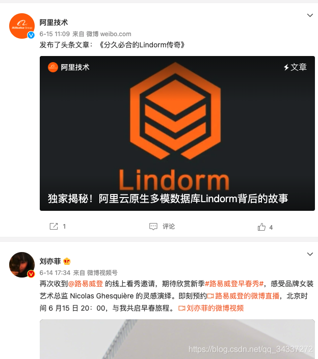
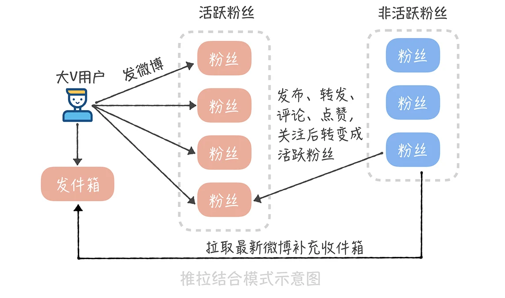
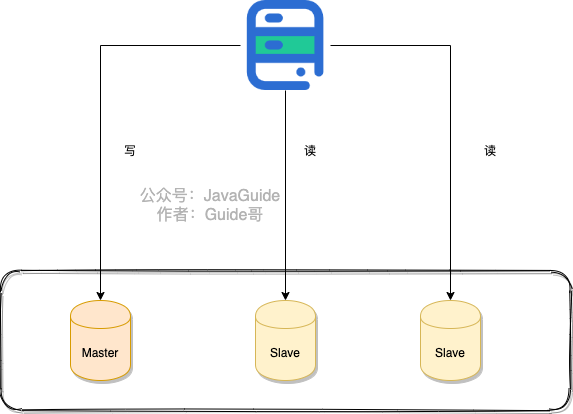
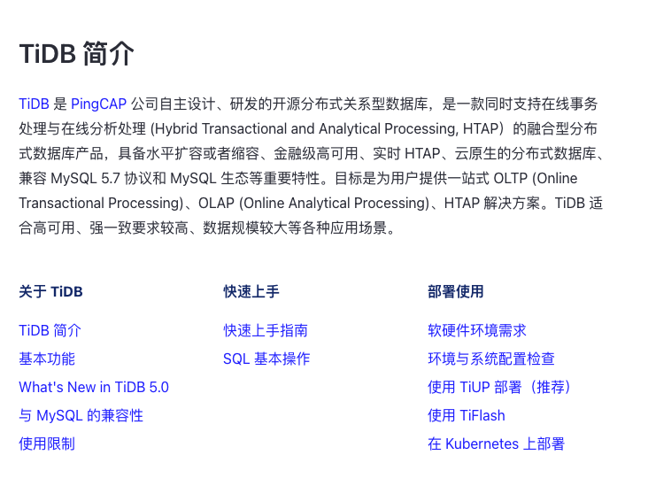

# 如何设计微博 Feed 流/信息流系统？

“如何设计微博 Feed 流/信息流系统？ ”是一道比较常见的系统设计问题，面试中比较常见。


这篇文章简单谈谈我的看法。个人能力有限，有些地方大家可以结合自己的经验自行扩展！爱你们哦！


**下面是正文！**


Feed 流是社交和资讯平台不可缺少的重要组成。TimeLine 时期，Feed 流推送的机制完全基于时间，比如朋友圈动态、几年前的微信订阅号就是这种机制。


现在的 Feed 流主要是基于智能化/个性化的推荐，简单来说，就是你喜欢什么我就给你推荐什么。这样的话，人们被推送的信息会极大地由自己的个人兴趣主导，你自己所处的信息世界就像桎梏于蚕茧一般的“茧房”中一样。这也就是“信息茧房”所表达的意思。


## Feed 流基础


### 何为 Feed 流？


简单来说就是能够实时/智能推送信息的数据流。像咱们的朋友圈动态（timeline）、知乎的推荐（智能化推荐 ）、你订阅的 Up 主的动态（timeline）都属于 **Feed 流**。


### 几种常见的 Feed 流形式


我总结了 3 种常见的 Feed 流形式。


#### 纯智能推荐


你看到的内容完全是基于你看过的内容而推荐的，比较典型的产品有头条首页推荐、知乎首页推荐。


智能推荐需要依赖 **推荐系统** ，推荐质量的好坏和推荐算法有非常大的关系。


推荐系统的相关文献把它们分成三类：**协同过滤**（仅使用用户与商品的交互信息生成推荐）系统、**基于内容**（利用用户偏好和／或商品偏好）的系统和 **混合推荐模型**（使用交互信息、用户和商品的元数据）的系统。


另外，随着深度学习应用的爆发式发展，特别是在计算机视觉、自然语言处理和语音方面的进展，基于深度学习的推荐系统越来越引发大家的关注。循环神经网络（RNN）理论上能够有效地对用户偏好和物品属性的动态性进行建模，基于当前的趋势，预测未来的行为。


#### 纯 Timeline


你看到的内容完全按照时间来排序，比较典型的产品有微信朋友圈、QQ 空间、微博关注者动态。


微信朋友圈：


微博关注者动态：





纯 Timeline 这种方式实现起来最简单，直接按照时间排序就行了。


纯 Timeline 这种形式更适用于好友社交领域，用户关注更多的是人发出的内容，而不仅仅是内容。


#### 智能推荐+Timeline


智能推荐+Timeline 这个也是目前我觉得比较好的一种方式，实现起来比较简单，同时又能一定程度地避免 “信息茧房” 的问题。


### 设计 Feed 流系统的注意事项


1. **实时性** ：你关注的人发了微博信息之后，信息需要在短时间之内出现在你的信息流中。
2. **高并发** ：信息流是微博的主体模块，是用户进入到微博之后最先看到的模块，因此它的并发请求量是最高的，可以达到每秒几十万次请求。
3. **性能** ： 信息流拉取性能直接影响用户的使用体验。微博信息流系统中需要聚合的数据非常多。聚合这么多的数据就需要查询多次缓存、数据库、计数器，而在每秒几十万次的请求下，如何保证在 100ms 之内完成这些查询操作，展示微博的信息流呢？这是微博信息流系统最复杂之处，也是技术上最大的挑战。
4. ......


## Feed 流架构设计


我们这里以 **微博关注者动态** 为例。


### Feed 流的 3 种推送模式


#### 推模式


当一个用户发送一个动态（比如微博、视频）之后，主动将这个动态推送给其他相关用户（比如粉丝）。


推模式下，我们需要将这个动态插入到每位粉丝对应的 feed 表中，这个存储成本是比较高的。尤其是对于粉丝数量比较多的大 V 来说，每发一条动态，需要存储的数据量实在太大。


假如狗蛋，有 n 个粉丝 1、2 ~ n。那么，狗蛋发一条微博时，我们需要执行的 SQL 语句如下：


```sql
insert into outbox(userId, feedId, create_time) values("goudan", $feedId, $current_time); //写入用户狗蛋的发件箱
insert into inbox(userId, feedId, create_time) values("1", $feedId, $current_time); //写入用户2的收件箱
......
insert into inbox(userId, feedId, create_time) values("n", $feedId, $current_time); //写入用户n的收件箱
```


当我们要查询用户 n 的信息流时，只需要执行下面这条 SQL 就可以了：


```sql
select feedId from inbox where userId = "n";
```


可以很明显的看出，推模式最大的问题就是写入数据库的操作太多。


正常情况下，一个微博用户的粉丝大概在 150 左右，挨个写入也还好。不过，微博大 V 的粉丝可能在几百万，几千万，如果挨个给每个写入一条数据的话，是肯定不能接受的！因此，推模式不适合关注者粉丝过多的场景。


#### 拉模式


不同于推模式，拉模式下我们是自己主动去拉取动态（拉取你关注的人的动态），然后将这些动态根据相关指标（比如时间、热度）进行实时聚合。


拉模式存储成本虽然降低，但是查询和聚合这两个操作的成本会比较高。尤其是对于单个用户关注了很多人的情况来说，你需要定时获取他关注的所有人的动态然后再做聚合，这个成本可想而知。


另外，拉模式下的数据流的实时性要比推模式差的。


#### 推拉结合模式


推拉结合的核心是针对微博大 V 和不活跃用户特殊处理。


首先，我们需要区分出系统哪些用户属于微博大 V（10w 粉丝以上？）。其次，我们需要根据登录行为来判断哪些用户属于不活跃用户。


有了这些数据之后，就好办了！当微博大 V 发送微博的时候，我们仅仅将这条微博写入到活跃用户，不活跃的用户自己去拉取。示意图如下（图片来自：《高并发系统设计 40 问》）：





推拉结合非常适合用户粉丝数比较大的场景。


### 存储


我们的存储的数据量会比较大，所以，存储库必须要满足可以水平扩展。


一般情况，通用的存储方案就是 **MySQL + Redis** 。MySQL 永久保存数据， Redis 作为缓存提高热点数据的访问速度。


**如果缓存的数据量太大怎么办?** 我们可以考虑使用**Redis Cluster**，也就是 Redis 集群。Redis Cluster 可以帮助我们解决 Redis 大数据量缓存的问题，并且，也方便我们进行横向拓展（增加 Redis 机器）。


Redis Cluster 这部分内容也非常重要，如果想要继续深入了解的话，可以查看这篇文章：[Redis Cluster：缓存的数据量太大怎么办？](https://www.yuque.com/snailclimb/mf2z3k/ikf0l2) 。


为了提高系统的并发，我们可以考虑对数据进行 **读写分离** 和 **分库分表** 。


读写分离主要是为了将数据库的读和写操作分不到不同的数据库节点上。主服务器负责写，从服务器负责读。另外，一主一从或者一主多从都可以。读写分离可以大幅提高读性能，小幅提高写的性能。因此，读写分离更适合单机并发读请求比较多的场景。





分库分表是为了解决由于库、表数据量过大，而导致数据库性能持续下降的问题。常见的分库分表工具有：`sharding-jdbc`（当当）、`TSharding`（蘑菇街）、`MyCAT`（基于 Cobar）、`Cobar`（阿里巴巴）...。 推荐使用 `sharding-jdbc`。 因为，`sharding-jdbc` 是一款轻量级 `Java` 框架，以 `jar` 包形式提供服务，不要我们做额外的运维工作，并且兼容性也很好。


[《从零开始学架构》](https://time.geekbang.org/column/intro/100006601?code=i00Nq3pHUcUj04ZWy70NCRl%2FD2Lfj8GVzcGzZ3Wf5Ug%3D) 中的有一张图片对于垂直拆分和水平拆分的描述还挺直观的。


另外，如果觉得分库分表比较麻烦的话，可以考虑使用 [TiDB](https://docs.pingcap.com/zh/tidb/stable) 这类分布式数据库。TiDB 是国内 PingCAP 团队开发的一个分布式 SQL 数据库。其灵感来自于 Google 的 F1, TiDB 支持包括传统 RDBMS 和 NoSQL 的特性，具备水平扩容或者缩容、金融级高可用。


如果想要继续深入了解读写分离和分库分表，推荐你看看我写的这篇文章：[读写分离和分库分表常见题总结](https://javaguide.cn/high-performance/read-and-write-separation-and-library-subtable.html)。





## 参考


+ [Feed 流系统设计-总纲](https://developer.aliyun.com/article/706808) ：写的真心不错！
+ [feed 流设计：那些谋杀你时间 APP](http://www.woshipm.com/pd/773523.html) ：可以让你从产品层面明白 Feed 流的一些概念。


## 相关问题


[微博和知乎中的 feed 流是如何实现的？](https://www.zhihu.com/question/19645686) ：知乎的相关提问


> 更新: 2024-03-07 09:49:06  
> 原文: <https://www.yuque.com/snailclimb/mf2z3k/ig79lm>