# Batch and Momentum

## Review： Optimization with Batch

​	上次我们有讲说,我们**实际上在算微分的时候,并不是真的对所有 Data 算出来的 L 作微分**,你是把所有的 Data 分成一个一个的 Batch,有的人是叫Mini Batch ,那我这边叫做 Batch,其实指的是一样的东西,助教投影片裡面,是写 Mini Batch

​	每一个 Batch 的大小呢,就是大 B 一笔的资料,我们每次**在 Update 参数的时候,我们是拿大 B 一笔资料出来,算个 Loss,算个 Gradient,Update 参数**,拿另外B一笔资料,再算个 Loss,再算个 Gradient,再 Update 参数,以此类推,所以我们不会拿所有的资料一起去算出 Loss,我们只会拿一个 Batch 的资料,拿出来算 Loss

​	**所有的 Batch 看过一遍,叫做一个 Epoch**,那事实上啊,你今天在做这些 Batch 的时候,你会做一件事情叫做 Shuffle

​	Shuffle 有很多不同的做法,但一个常见的做法就是,**在每一个 Epoch 开始之前,会分一次 Batch,然后呢,每一个 Epoch 的 Batch 都不一样**,就是第一个 Epoch,我们分这样子的 Batch,第二个 Epoch,会重新再分一次 Batch,所以哪些资料在同一个 Batch 裡面,每一个 Epoch 都不一样的这件事情,叫做 Shuffle。

## Small Batch v.s. Large Batch

​	我们先解释為什麼要用 Batch,再说 Batch 对 Training 带来了什麼样的帮助。

​	我们来比较左右两边这两个 Case,那假设现在我们有20笔训练资料

- 左边的 Case 就是没有用 Batch,Batch Size,直接设的跟我训练资料一样多,这种状况叫做 Full Batch,就是没有用 Batch 的意思
- 那右边的 Case 就是,Batch Size 等於1

​	这是两个最极端的状况

​	我们先来看左边的 Case,在左边 Case 裡面,因為没有用 Batch,我们的 Model 必须把20笔训练资料都看完,才能够计算 Loss,才能够计算 Gradient,所以我们必须要把**所有20笔 Example s 都看完以后,我们的参数才能够 Update 一次**。就假设开始的地方在上边边,把所有资料都看完以后,Update 参数就从这裡移动到下边。

​	如果 Batch Size 等於1的话,代表我们只需要拿一笔资料出来算 Loss,我们就可以 Update 我们的参数,所以每次我们 Update 参数的时候,看一笔资料就好,所以我们开始的点在这边,看一笔资料 就 Update 一次参数,再看一笔资料 就 Update 一次参数,如果今天总共有20笔资料的话 那**在每一个 Epoch 裡面,我们的参数会 Update 20次**,那不过,因為我们现在是只看一笔资料,就 Update 一次参数,所以用一笔资料算出来的 Loss,显然是比较 Noisy 的,所以我们今天 Update 的方向,你会发现它是曲曲折折的

​	所以如果我们比较左边跟右边，哪一个比较好呢,他们有什麼差别呢？

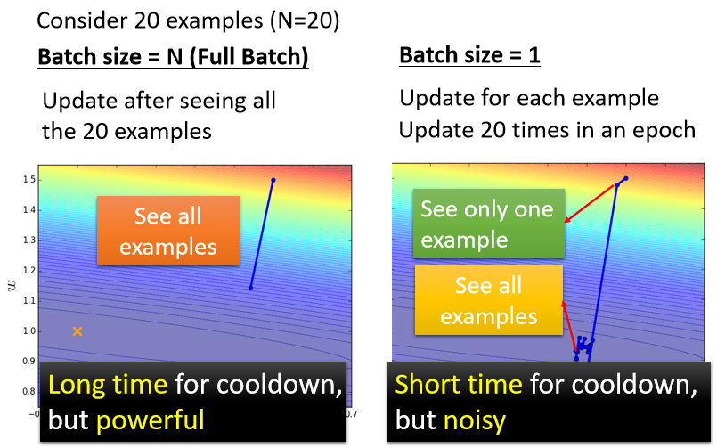

​	你会发现左边没有用 Batch 的方式,它蓄力的时间比较长,还有它技能冷却的时间比较长,你要把所有的资料都看过一遍,才能够 Update 一次参数

​	而右边的这个方法,Batch Size 等於1的时候,蓄力的时间比较短,每次看到一笔参数,每次看到一笔资料,你就会更新一次你的参数

​	所以今天假设有20笔资料,看完所有资料看过一遍,你已经更新了20次的参数,但是左边这样子的方法有一个优点,就是它这一步走的是稳的,那右边这个方法它的缺点,就是它每一步走的是不稳的

​	看起来左边的方法跟右边的方法,他们各自都有擅长跟不擅长的东西,左边是蓄力时间长,但是威力比较大,右边技能冷却时间短,但是它是比较不準的,看起来各自有各自的优缺点,但是你会觉得说,左边的方法技能冷却时间长,右边的方法技能冷却时间短,那只是你没有考虑并行运算的问题。

​	**实际上考虑并行运算的话,左边这个并不一定时间比较长**

### Larger batch size does not require longer time to compute gradient 

​	这边是真正的实验结果了,事实上,比较大的 Batch Size,你要算 Loss,再进而算 Gradient,所需要的时间,不一定比小的 Batch Size 要花的时间长

​	那以下是做在一个叫做 ==MNIST== 上面,MNIST (Mixed National Institute of Standards and Technology database)是美国国家标准与技术研究院收集整理的大型手写数字数据库,机器要做的事情,就是给它一张图片,然后判断这张图片,是0到9的哪一个数字,它要做数字的分类,那 MNIST 呢 是机器学习的helloworld,就是假设你今天,从来没有做过机器学习的任务,一般大家第一个会尝试的机器学习的任务,往往就是做 MNIST 做手写数字辨识,

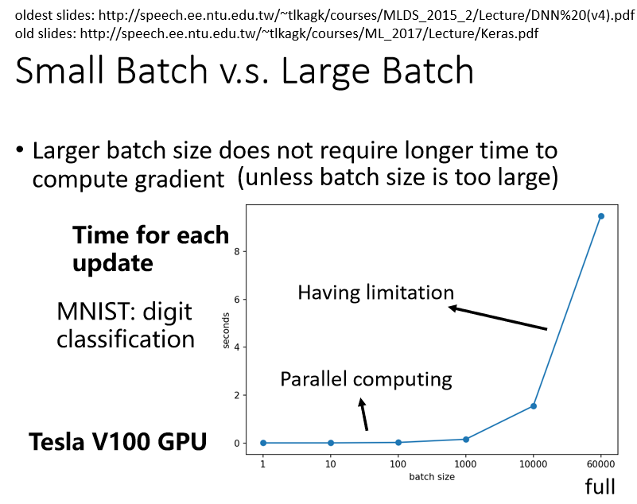

​	这边我们就是做了一个实验,我们想要知道说,给机器一个 Batch,它要计算出 Gradient,进而 Update 参数,到底需要花多少的时间

​	这边列出了 Batch Size 等於1 等於10,等於100 等於1000 所需要耗费的时间

​	你会发现说 Batch Size 从1到1000,需要耗费的时间几乎是一样的,你可能直觉上认为有1000笔资料,那需要计算 Loss,然后计算 Gradient,花的时间不会是一笔资料的1000倍吗,但是实际上并不是这样的

​	因為在实际上做运算的时候,我们有 GPU,可以做并行运算,是因為你可以做平行运算的关係,这1000笔资料是平行处理的,所以1000笔资料所花的时间,并不是一笔资料的1000倍,当然 GPU 平行运算的能力还是有它的极限,当你的 Batch Size 真的非常非常巨大的时候,GPU 在跑完一个 Batch,计算出 Gradient 所花费的时间,还是会随著 Batch Size 的增加,而逐渐增长

​	所以今天如果 Batch Size 是从1到1000,所需要的时间几乎是一样的,但是当你的 Batch Size 增加到 10000,乃至增加到60000的时候,你就会发现 GPU 要算完一个 Batch,把这个 Batch 裡面的资料都拿出来算 Loss,再进而算 Gradient,所要耗费的时间,确实有随著 Batch Size 的增加而逐渐增长,但你会发现这边用的是 V100,所以它挺厉害的,给它60000笔资料,一个 Batch 裡面,塞了60000笔资料,它在10秒鐘之内,也是把 Gradient 就算出来

​	而那这个 Batch Size 的大小跟时间的关係,其实每年都会做这个实验,我特别把旧的投影片放在这边了,如果你有兴趣的话m,,可以看到这个时代的演进这样,17年的时候用的是那个980啊,2015年的时候用的是那个760啊,然后980要跑什麼60000个 Batch,那要跑好几分鐘才跑得完啊,现在只要10秒鐘就可以跑得完了,你可以看到这个时代的演进,

### Smaller batch requires longer time for one epoch

​	所以 GPU 虽然有平行运算的能力,但它平行运算能力终究是有个极限,所以你 Batch Size 真的很大的时候,时间还是会增加的

​	但是因為有平行运算的能力,因此实际上,当你的 **Batch Size 小的时候,你要跑完一个 Epoch,花的时间是比大的 Batch Size 还要多**的,怎麼说呢

​	如果今天假设我们的训练资料只有60000笔,那 Batch Size 设1,那你要60000个 Update 才能跑完一个 Epoch,如果今天是 Batch Size 等於1000,你要60个 Update 才能跑完一个 Epoch,假设今天一个 Batch Size 等於1000,要算 Gradient 的时间根本差不多,那60000次 Update,跟60次 Update 比起来,它的时间的差距量就非常可观了

​	所以左边这个图是 Update 一次参数,拿一个 Batch 出来计算一个 Gradient,Update 一次参数所需要的时间,右边这个图是,跑完一个完整的 Epoch,需要花的时间,你会发现左边的图跟右边的图,它的趋势正好是相反的,假设你 Batch Size 这个1,跑完一个 Epoch,你要 Update 60000次参数,它的时间是非常可观的,但是假设你的 Batch Size 是1000,你只要跑60次,Update 60次参数就会跑完一个 Epoch,所以你跑完一个 Epoch,看完所有资料的时间,如果你的 Batch Size 设1000,其实是比较短的,Batch Size 设1000的时候,把所有的资料看过一遍,其实是比 Batch Size 设1 还要更快

​	所以如果我们看右边这个图的话,看完一个 Batch,把所有的资料看过一次这件事情,大的 Batch Size 反而是较有效率的,是不是跟你直觉想的不太一样

​	在没有考虑平行运算的时候,你觉得大的 Batch 比较慢,但实际上,在有考虑平行运算的时候,一个 Epoch 大的 Batch 花的时间反而是比较少的

​	我们如果要比较这个 Batch Size 大小的差异的话,看起来直接用技能时间冷却的长短,并不是一个精确的描述,看起来在技能时间上面,大的 Batch 并没有比较吃亏,甚至还佔到优势了.

​	所以事实上,20笔资料 Update 一次的时间,跟右边看一笔资料 Update 一次的时间,如果你用 GPU 的话,其实可能根本就是所以一样的,所以大的 Batch,它的技能时间,它技能冷却的时间,并没有比较长,那所以这时候你可能就会说,欸 那个大的 Batch 的劣势消失了,那难道它真的就,那这样看起来大的 Batch 应该比较好?

​	你不是说大的 Batch,这个 Update 比较稳定,小的 Batch,它的 Gradient 的方向比较 Noisy 吗,那这样看起来,大的 Batch 好像应该比较好哦,小的 Batch 应该比较差,因為现在大的 Batch 的劣势已经,因為平行运算的时间被拿掉了,它好像只剩下优势而已.

​	那神奇的地方是 **Noisy 的 Gradient,反而可以帮助 Training**,这个也是跟直觉正好相反的

​	如果你今天拿不同的 Batch 来训练你的模型,你可能会得到这样子的结果,左边是坐在 MNIST 上,右边是坐在 CIFAR-10 上,不管是 MNIST 还是 CIFAR-10,都是影像辨识的问题

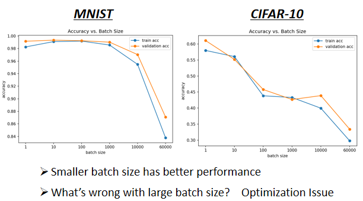

- 横轴代表的是 Batch Size,从左到右越来越大
- 纵轴代表的是正确率,越上面正确率越高,当然正确率越高越好

​	而如果你今天看 Validation Acc 上的结果，会发现说,Batch Size 越大,Validation Acc 上的结果越差,但这个不是 Overfitting,因為如果你看你的 Training 的话,会发现说 Batch Size 越大,Training 的结果也是越差的,而我们现在用的是同一个模型哦,照理说,它们可以表示的 Function 就是一模一样的

​	但是神奇的事情是,大的 Batch Size,往往在 Training 的时候,会给你带来比较差的结果

​	所以这个是什麼样的问题,同样的 Model,所以这个不是 Model Bias 的问题,**这个是 Optimization 的问题,代表当你用大的 Batch Size 的时候,你的 Optimization 可能会有问题**,小的 Batch Size,Optimization 的结果反而是比较好的,好 為什麼会这样子呢

### “Noisy” update is better for training

​	為什麼小的 Batch Size,在 Training Set 上会得到比较好的结果,為什麼 Noisy 的 Update,Noisy 的 Gradient 会在 Training 的时候,给我们比较好的结果呢？一个可能的解释是这样子的

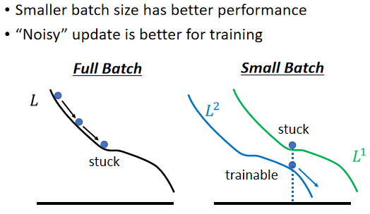

​	假设你是 Full Batch,那你今天在 Update 你的参数的时候,你就是沿著一个 Loss Function 来 Update 参数,今天 Update 参数的时候走到一个 Local Minima,走到一个 Saddle Point,显然就停下来了,Gradient 是零,如果你不特别去看Hession的话,那你用 Gradient Descent 的方法,你就没有办法再更新你的参数了

​	但是假如是 Small Batch 的话,因為我们每次是挑一个 Batch 出来,算它的 Loss,所以等於是,等於你每一次 Update 你的参数的时候,你用的 Loss Function 都是越有差异的,你选到第一个 Batch 的时候,你是用 L1 来算你的 Gradient,你选到第二个 Batch 的时候,你是用 L2 来算你的 Gradient,假设你用 L1 算 Gradient 的时候,发现 Gradient 是零,卡住了,但 L2 它的 Function 跟 L1 又不一样,L2 就不一定会卡住,所以 L1 卡住了 没关係,换下一个 Batch 来,L2 再算 Gradient。

​	你还是有办法 Training 你的 Model,还是有办法让你的 Loss 变小,所以今天这种 Noisy 的 Update 的方式,结果反而对 Training,其实是有帮助的。

### “Noisy” update is better for generalization

​	那这边还有另外一个更神奇的事情，其实**小的 Batch 也对 Testing 有帮助**。

​	假设我们今天在 Training 的时候,都不管是大的 Batch 还小的 Batch,都 Training 到一样好,刚才的 Case是Training 的时候就已经 Training 不好了

​	假设你有一些方法,你努力的调大的 Batch 的 Learning Rate,然后想办法把大的 Batch,跟小的 Batch Training 得一样好,结果你会发现**小的 Batch,居然在 Testing 的时候会是比较好的**,那以下这个实验结果是引用自,On Large-Batch Training For Deep Learning,Generalization Gap And Sharp Minimahttps://arxiv.org/abs/1609.04836,这篇 Paper 的实验结果

​	那这篇 Paper 裡面,作者 Train 了六个 Network 裡面有 CNN 的,有 Fully Connected Network 的,做在不同的 Cover 上,来代表这个实验是很泛用的,在很多不同的 Case 都观察到一样的结果,那它有小的 Batch,一个 Batch 裡面有256笔 Example,大的 Batch 就是那个 Data Set 乘 0.1,Data Set 乘 0.1,Data Set 有60000笔,那你就是一个 Batch 裡面有6000笔资料

​	然后他想办法,在大的 Batch 跟小的 Batch,都 Train 到差不多的 Training 的 Accuracy,所以刚才我们看到的结果是,Batch Size 大的时候,Training Accuracy 就已经差掉了,这边不是想办法 Train 到大的 Batch 的时候,Training Accuracy 跟小的 Batch,其实是差不多的

​	但是就算是在 Training 的时候结果差不多,Testing 的时候你还是看到了,小的 Batch 居然比大的 Batch 差,Training 的时候都很好,**Testing 的时候小的 Batch 差,代表 Over Fitting**,这个才是 Over Fitting 对不对,好 那為什麼会有这样子的现象呢？在这篇文章裡面也给出了一个解释,

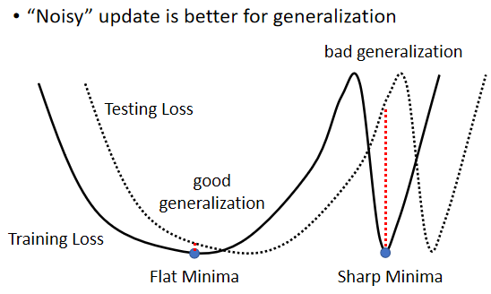

​	假设这个是我们的 Training Loss,那在这个 Training Loss 上面呢,可能有很多个 Local Minima,有不只一个 Local Minima,那这些 Local Minima 它们的 Loss 都很低,它们 Loss 可能都趋近於 0,但是这个 **Local Minima,还是有好 Minima 跟坏 Minima 之分**

​	如果一个 Local Minima 它在一个峡谷裡面,它是坏的 Minima,然后它在一个平原上,它是好的 Minima,為什麼会有这样的差异呢

- 因為假设现**在 Training 跟 Testing 中间,有一个 Mismatch**,Training 的 Loss 跟 Testing 的 Loss,它们那个 Function 不一样,有可能是本来你 Training 跟 Testing 的 Distribution就不一样。
- 那也有可能是因為 Training 跟 Testing,你都是从 Sample 的 Data 算出来的,也许 Training 跟 Testing,Sample 到的 Data 不一样,那所以它们算出来的 Loss,当然是有一点差距。

​	那我们就假设说这个 Training 跟 Testing,它的差距就是把 Training 的 Loss,这个 Function 往右平移一点,这时候你会发现,对左边这个在一个盆地裡面的 Minima 来说,它的在 Training 跟 Testing 上面的结果,不会差太多,只差了一点点,但是对右边这个在峡谷裡面的 Minima 来说,一差就可以天差地远

​	它在这个 Training Set 上,算出来的 Loss 很低,但是因為 Training 跟 Testing 之间的不一样,所以 Testing 的时候,这个 Error Surface 一变,它算出来的 Loss 就变得很大,而很多人相信这个**大的 Batch Size,会让我们倾向於走到峡谷裡面,而小的 Batch Size,倾向於让我们走到盆地裡面**

​	那他直觉上的想法是这样,就是小的 Batch,它有很多的 Loss,它每次 Update 的方向都不太一样,所以如果今天这个峡谷非常地窄,它可能一个不小心就跳出去了,因為每次 Update 的方向都不太一样,它的 Update 的方向也就随机性,所以一个很小的峡谷,没有办法困住小的 Batch

​	如果峡谷很小,它可能动一下就跳出去,之后停下来如果有一个非常宽的盆地,它才会停下来,那对於大的 Batch Size,反正它就是顺著规定 Update,然后它就很有可能,走到一个比较小的峡谷裡面

​	但这只是一个解释,那也不是每个人都相信这个解释,那这个其实还是一个**尚待研究的问题**

​	那这边就是比较了一下,大的 Batch 跟小的 Batch

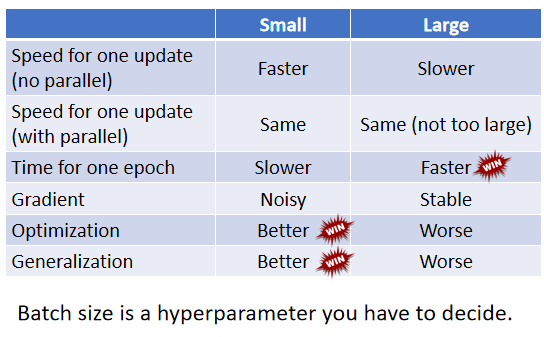

​	左边这个是第一个 Column 是小的 Batch,第二个 Column 是大的 Batch

​	在有平行运算的情况下,小的 Batch 跟大的 Batch,其实运算的时间并没有太大的差距,除非你的大的 Batch 那个大是真的非常大,才会显示出差距来。但是一个 Epoch 需要的时间,小的 Batch 比较长,大的 Batch 反而是比较快的,所以从一个 Epoch 需要的时间来看,大的 Batch 其实是佔到优势的。

​	而小的 Batch,你会 Update 的方向比较 Noisy,大的 Batch Update 的方向比较稳定,但是 Noisy 的 Update 的方向,反而在 Optimization 的时候会佔到优势,而且在 Testing 的时候也会佔到优势,所以大的 Batch 跟小的 Batch,它们各自有它们擅长的地方

​	**所以 Batch Size,变成另外一个 你需要去调整的 Hyperparameter。**

​	那我们能不能够鱼与熊掌兼得呢,我们能不能够截取大的 Batch 的优点,跟小的 Batch 的优点,我们用大的 Batch Size 来做训练,用平行运算的能力来增加训练的效率,但是训练出来的结果同时又得到好的结果呢,又得到好的训练结果呢。

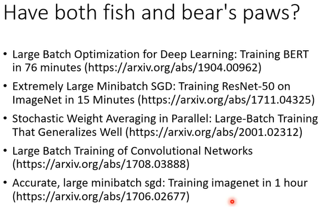

​	这是有可能的,有很多文章都在探讨这个问题,那今天我们就不细讲,我们把这些 Reference 列在这边给大家参考,那你发现这些 Paper,往往它想要做的事情都是什麼,哇 76分鐘 Train BERT,15分鐘 Train ResNet,一分鐘 Train Imagenet 等等,这為什麼他们可以做到那麼快,就是因為他们 Batch Size 是真的开很大,比如说在第一篇 Paper 裡面,Batch Size 裡面有三万笔 Example 这样,Batch Size 开很大,Batch Size 开大 真的就可以算很快,你可以在很短的时间内看到大量的资料,那他们需要有一些特别的方法来解决,Batch Size 可能会带来的劣势。

## Momentum

​	Momentum,这也是另外一个,有可能可以对抗 Saddle Point,或 Local Minima 的技术,Momentum 的运作是这个样子的

### Small Gradient

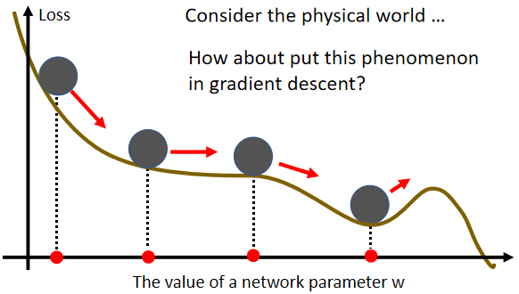

​	它的概念,你可以想像成在物理的世界裡面,假设 Error Surface 就是真正的斜坡,而我们的参数是一个球,你把球从斜坡上滚下来,如果今天是 Gradient Descent,它走到 Local Minima 就停住了,走到 Saddle Point 就停住了

​	但是在物理的世界裡,一个球如果从高处滚下来,从高处滚下来就算滚到 Saddle Point,如果有**惯性**,它从左边滚下来,因為惯性的关係它还是会继续往右走,甚至它走到一个 Local Minima,如果今天它的动量够大的话,它还是会继续往右走,甚至翻过这个小坡然后继续往右走

​	那所以今天在物理的世界裡面,一个球从高处滚下来的时候,它并不会被 Saddle Point,或 Local Minima卡住,不一定会被 Saddle Point,或 Local Minima 卡住,我们有没有办法运用这样子的概念,到 Gradient Descent 裡面呢,那这个就是我们等一下要讲的,Momentum 这个技术

### Vanilla Gradient Descent

​	那我们先很快的复习一下,原来的 Gradient Descent 长得是什麼样子,这个是 Vanilla 的 Gradient Descent,Vanilla 的意思就是一般的的意思,它直译是香草的,但就其实是一般的,一般的 Gradient Descent 长什麼样子呢

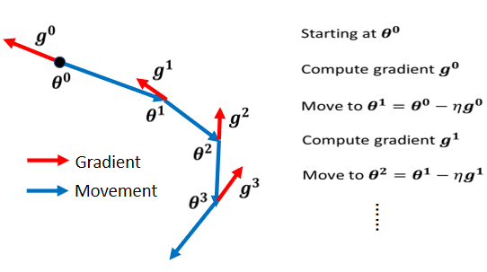

​	

​	一般的 Gradient Descent 是说,我们有一个初始的参数叫做 $θ^0$,我们计算一下 Gradient,然后计算完这个 Gradient 以后呢,我们往 Gradient 的反方向去 Update 参数
$$
θ^1 = θ^0 - {\eta}g^0
$$
​	我们到了新的参数以后,再计算一次 Gradient,再往 Gradient 的反方向,再 Update 一次参数,到了新的位置以后再计算一次 Gradient,再往 Gradient 的反方向去 Update 参数,这个 Process 就一直这样子下去

### Gradient Descent + Momentum

​	加上 Momentum 以后,每一次我们在移动我们的参数的时候,我们不是只往 Gradient Descent,我们不是只往 Gradient 的反方向来移动参数,我们是 **Gradient 的反方向,加上前一步移动的方向,两者加起来的结果,去调整去到我们的参数,**

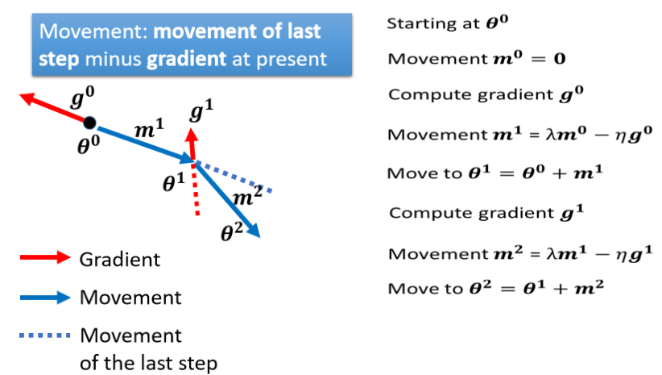

​	那具体说起来是这个样子,一样找一个初始的参数,然后我们假设前一步的参数的 Update 量呢,就设為 0
$$
m^0 = 0
$$
​	接下来在  $θ^0$ 的地方,计算 Gradient 的方向$g^0$

​	然后接下来你要决定下一步要怎麼走,它是 Gradient 的方向加上前一步的方向,不过因為前一步正好是 0,现在是刚初始的时候所以前一步是 0,所以 Update 的方向,跟原来的 Gradient Descent 是一样的,这没有什麼有趣的地方
$$
m^1 = {\lambda}m^0-{\eta}g^0\\\
θ^1 = θ^0 + m^1
$$
​	但从第二步开始,有加上 Momentum 以后就不太一样了,从第二步开始,我们计算 $g^1$,然后接下来我们 Update 的方向,不是 $g^1$的反方向,而是根据上一次 Update 方向,也就是 m1 减掉 g1,当做我们新的 Update 的方向,这边写成 m2
$$
m^2 = {\lambda}m^1-{\eta}g^1
$$
​	那我们就看下面这个图

​	g1 告诉我们,**Gradient 告诉我们要往红色反方向这边走**,但是我们不是只听 Gradient 的话,加上 Momentum 以后,我们不是只根据 Gradient 的反方向,来调整我们的参数,我们**也会看前一次 Update 的方向**

- 如果前一次说要往**$m^1$蓝色及蓝色虚线**这个方向走
- Gradient 说要往**红色反方向这个方向**走
- **把两者相加起来**,走两者的折中,也就是往**蓝色$m^2$这一个方向走**,所以我们就移动了 m2,走到 θ2 这个地方

​	

​	接下来就反覆进行同样的过程,在这个位置我们计算出 Gradient,但我们不是只根据 Gradient 反方向走,我们看前一步怎麼走,前一步走这个方向,走这个蓝色虚线的方向,我们把蓝色的虚线加红色的虚线,前一步指示的方向跟 Gradient 指示的方向,当做我们下一步要移动的方向

​	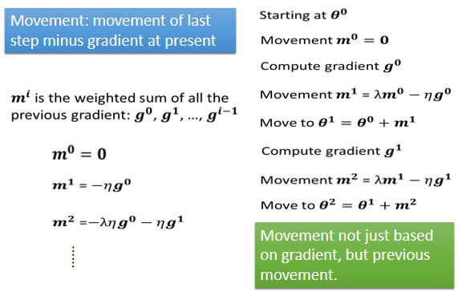

​	每一步的移动,我们都用 m 来表示,那这个 m 其实可以写成之前所有算出来的,Gradient 的 Weighted Sum.从右边的这个式子,其实就可以轻易的看出来
$$
m^0 = 0\\\
m^1 = -{\eta}g^0\\\
m^2 = -{\lambda}{\eta}g^0-{\eta}g^1\\\
...
$$
m0 我们把它设為 0,m1 是 m0 减掉 g0,m0 為 0,所以 m1 就是 g0 乘上负的 η,m2 是 λ 乘上 m1,λ 就是另外一个参数,就好像 η 是 Learning Rate 我们要调,λ 是另外一个参数,这个也是需要调的,m2 等於 λ 乘上 m1,减掉 η 乘上 g1,然后 m1 在哪裡呢,m1 在这边,你把 m1 代进来,就知道说 m2,等於负的 λ 乘上 η 乘以 g0,减掉 η 乘上 g1,它是 g0 跟 g1 的 Weighted Sum

​	以此类推,所以你会发现说,现在这个加上 Momentum 以后,一个解读是 Momentum 是,Gradient 的负反方向加上前一次移动的方向,那但另外一个解读方式是,所谓的 Momentum,当加上 Momentum 的时候,我们 Update 的方向,不是只考虑现在的 Gradient,而是考虑过去所有 Gradient 的总合.

​	有一个更简单的例子,希望帮助你了解 Momentum 

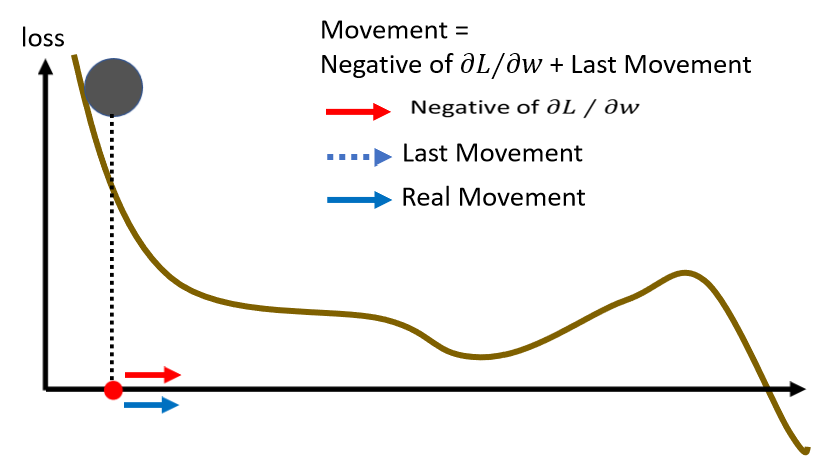

​	那我们从这个地方开始 Update 参数,根据 Gradient 的方向告诉我们,应该往右 Update 参数,那现在没有前一次 Update 的方向,所以我们就完全按照 Gradient 给我们的指示,往右移动参数,好 那我们的参数,就往右移动了一点到这个地方

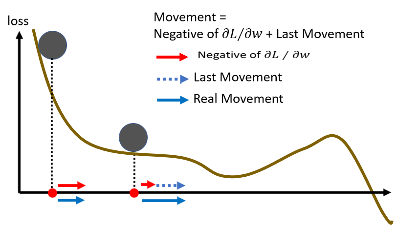

Gradient 变得很小,告诉我们往右移动,但是只有往右移动一点点,但前一步是往右移动的,我们把前一步的方向用虚线来表示,放在这个地方,我们把之前 Gradient 告诉我们要走的方向,跟前一步移动的方向加起来,得到往右走的方向,那再往右走 走到一个 Local Minima,照理说走到 Local Minima,一般 Gradient Descent 就无法向前走了,因為已经没有这个 Gradient 的方向,那走到 Saddle Point 也一样,没有 Gradient 的方向已经无法向前走了

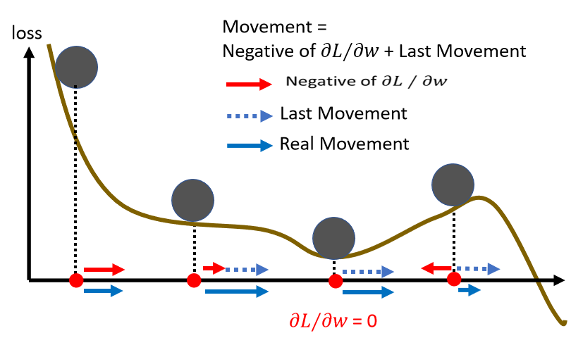

​	但没有关係,如果有 Momentum 的话,你还是有办法继续走下去,因為 Momentum 不是只看 Gradient,Gradient 就算是 0,你还有前一步的方向,前一步的方向告诉我们向右走,我们就继续向右走,甚至你走到这种地方,Gradient 告诉你应该要往左走了,但是假设你前一步的影响力,比 Gradient 要大的话,你还是有可能继续往右走,甚至翻过一个小丘,搞不好就可以走到更好 Local Minima,这个就是 Momentum 有可能带来的好处

​	那这个就是今天想要跟大家说的内容,

## Concluding Remarks

- Critical points have zero gradients. 
- Critical points can be either saddle points or local minima.
    - Can be determined by the Hessian matrix.
    - Local minima may be rare.
    - It is possible to escape saddle points along the direction of eigenvectors of the Hessian matrix
- Smaller batch size and momentum help escape critical points. 