# Tips for training: Adaptive Learning Rate

critical point其实不一定是,你在训练一个Network的时候,会遇到的最大的障碍,今天要告诉大家的是一个叫做Adaptive Learning Rate的技术,我们要给每一个参数不同的learning rate

## Training stuck ≠ Small Gradient

### People believe training stuck because the parameters are around a critical point …

為什麼我说这个critical point不一定是我们训练过程中,最大的阻碍呢？

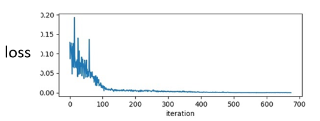

往往同学们,在训练一个network的时候,你会把它的loss记录下来,所以你会看到,你的loss原来很大,随著你参数不断的update,横轴代表参数update的次数,随著你参数不断的update,这个loss会越来越小,最后就卡住了,你的loss不再下降

那多数这个时候,大家就会猜说,那是不是走到了critical point,因為gradient等於零的关係,所以我们没有办法再更新参数,但是真的是这样吗

当我们说 走到critical point的时候,意味著gradient非常的小,但是你有确认过,当**你的loss不再下降的时候,gradient真的很小吗？**其实多数的同学可能,都没有确认过这件事,而事实上在这个例子裡面,在今天我show的这个例子裡面,当我们的loss不再下降的时候,gradient并没有真的变得很小

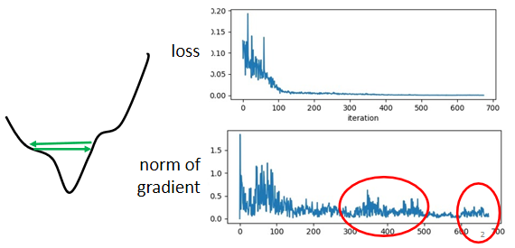

gradient是一个向量，下面是gradient的norm,即gradient这个向量的长度,随著参数更新的时候的变化,你会发现说**虽然loss不再下降,但是这个gradient的norm,gradient的大小并没有真的变得很小**

这样子的结果其实也不难猜想,也许你遇到的是这样子的状况

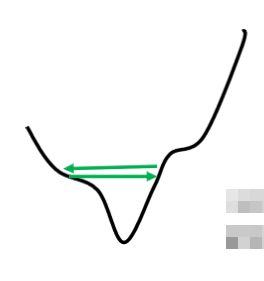

这个是我们的error surface,然后你现在的gradient,在error surface山谷的两个谷壁间,**不断的来回的震荡**

这个时候你的loss不会再下降,所以你会觉得它真的卡到了critical point,卡到了saddle point,卡到了local minima吗？不是的,**它的gradient仍然很大,只是loss不见得再减小了**

所以你要注意,当你今天训练一个network,train到后来发现,loss不再下降的时候,你不要随便说,我卡在local minima,我卡在saddle point,**有时候根本两个都不是,你只是单纯的loss没有办法再下降**

就是為什麼你在在[作业2-2](https://colab.research.google.com/github/ga642381/ML2021-Spring/blob/main/HW02/HW02-2.ipynb),会有一个作业叫大家,算一下gradient的norm,然后算一下说,你现在是卡在saddle point,还是critical point,因為多数的时候,当你说你训练卡住了,很少有人会去分析卡住的原因,為了强化你的印象,我们有一个作业,让你来分析一下,卡住的原因是什麼,

### Wait a minute

有的同学就会有一个问题,如果我们在训练的时候,其实很少卡到saddle point,或者是local minima,那这一个图是怎麼做出来的呢?

我们上次有画过这个图是说我们现在训练一个Network,训练到现在参数**在critical point附近,然后我们再来根据eigen value的正负号,来判断说这个critical point,比较像是saddle point,还是local minima**

那如果实际上在训练的时候,要走到saddle point,或者是local minima,是一件困难的事情,那这个图到底是怎麼画出来的

那这边告诉大家一个秘密,这个图你要训练出这样子的结果,你要训练到你的参数很接近critical point,用一般的gradient descend,其实是做不到的,用一般的gradient descend train,你往往会得到的结果是,你在这个gradient还很大的时候,你的loss就已经掉了下去,这个是需要特别方法train的

所以做完这个实验以后,我更感觉你要走到一个critical point,其实是困难的一件事,多数时候training,在还没有走到critical point的时候,就已经停止了,那这并不代表说,critical point不是一个问题,我只是想要告诉你说,我们真正目前,**当你用gradient descend,来做optimization的时候,你真正应该要怪罪的对象,往往不是critical point,而是其他的原因,**

### Training can be difficult even without critical points

如果今天critical point不是问题的话,為什麼我们的training会卡住呢,我这边举一个非常简单的例子,我这边有一个,非常简单的error surface

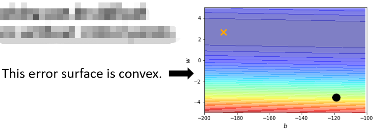

我们只有两个参数,这两个参数值不一样的时候,Loss的值不一样,我们就画出了一个error surface,这个**error surface的最低点**在==黄色X==这个地方,事实上,这个error surface是convex的形状(可以理解为凸的或者凹的，convex optimization常翻译为“凸优化”)

如果你不知道convex是什麼,没有关係,总之它是一个,它的这个等高线是椭圆形的,只是它在横轴的地方,它的gradient非常的小,它的坡度的变化非常的小,非常的平滑,所以这个椭圆的长轴非常的长,短轴相对之下比较短,在纵轴的地方gradient的变化很大,error surface的坡度非常的陡峭

那现在我们要从**黑点**这个地方,这个地方当作**初始的点**,然后来做gradient descend

你可能觉得说,这个convex的error surface,做gradient descend,有什麼难的吗？不就是一路滑下来,然后可能再走过去吗,应该是非常容易。你实际上自己试一下,你会发现说,就连这种convex的error surface,形状这麼简单的error surface,你用gradient descend,都不见得能把它做好,举例来说这个是我实际上,自己试了一下的结果

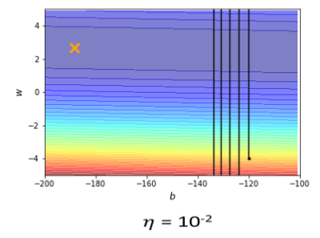

我learning rate设10⁻²的时候,我的这个参数在峡谷的两端,我的参数在山壁的两端不断的震盪,我的loss掉不下去,但是gradient其实仍然是很大的

那你可能说,就是因為你**learning rate设太大了**阿,learning rate决定了我们update参数的时候步伐有多大,learning rate显然步伐太大,你没有办法慢慢地滑到山谷裡面只要把learning rate设小一点,不就可以解决这个问题了吗？

事实不然,因為我试著去,调整了这个learning rate,就会发现你光是要train这种convex的optimization的问题,你就觉得很痛苦,我就调这个learning rate,从10⁻²,一直调到10⁻⁷,调到10⁻⁷以后,终於不再震盪了

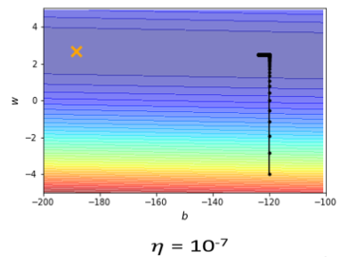

终於从这个地方滑滑滑,滑到山谷底终於左转,但是你发现说,这个训练永远走不到终点,因為我的**learning rate已经太小了**,竖直往上这一段这个很斜的地方,因為这个坡度很陡,gradient的值很大,所以还能够前进一点,左拐以后这个地方坡度已经非常的平滑了,这麼小的learning rate,根本没有办法再让我们的训练前进

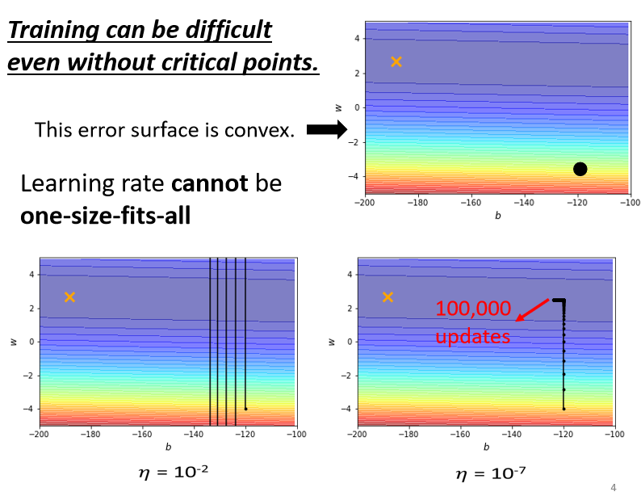

事实上在左拐这个地方,看到这边一大堆黑点,这边**有十万个点**,这个是张辽八百冲十万的那个十万,但是我都没有办法靠近,这个local minima的地方,所以显然**就算是一个convex的error surface,你用gradient descend也很难train**

这个convex的optimization的问题,确实有别的方法可以解,但是你想想看,如果今天是更复杂的error surface,你真的要train一个deep network的时候,gradient descend是你,唯一可以仰赖的工具,但是gradient descend这个工具,连这麼简单的error surface都做不好,==一室之不治 何以天下国家為==,这麼简单的问题都做不好,那如果难的问题,它又怎麼有可能做好呢

所以我们需要更好的gradient descend的版本,在**==之前我们的gradient descend裡面,所有的参数都是设同样的learning rate,这显然是不够的,learning rate它应该要為,每一个参数客製化==**,所以接下来我们就是要讲,客製化的learning rate,怎麼做到这件事情

## Different parameters needs different learning rate

那我们要怎麼客製化learning rate呢,我们不同的参数到底,需要什麼样的learning rate呢

从刚才的例子裡面,其实我们可以看到一个大原则,**如果在某一个方向上,我们的gradient的值很小,非常的平坦,那我们会希望learning rate调大一点,如果在某一个方向上非常的陡峭,坡度很大,那我们其实期待,learning rate可以设得小一点**

那这个learning rate要如何自动的,根据这个gradient的大小做调整呢

我们要改一下,gradient descend原来的式子,我们只放某一个参数update的式子,我们之前在讲gradient descend,我们往往是讲,所有参数update的式子,那这边為了等一下简化这个问题,我们只看一个参数,但是你完全可以把这个方法,推广到所有参数的状况
$$
{θ{_i}{^{t+1}}} ← {θ{_i}{^{t}}}-{\eta}{g{_i}{^{t}}}
$$
我们只看一个参数,这个参数叫做${θ{_i}{^{t+1}}}$,这个${θ{_i}{^{t+1}}}$是在第t个iteration的值减掉在第t个iteration这个参数i算出来的gradient ${g{_i}{^{t}}}$
$$
{g{_i}{^{t}}}=\frac{\partial{L}}{\partial{θ_i}}|_{θ=θ^t}
$$
这个${g{_i}{^{t}}}$代表在第t个iteration,也就是θ等於θᵗ的时候,参数θᵢ对loss的微分,我们把这个θᵢᵗ减掉learning rate,乘上gᵢᵗ会更新learning rate到θᵢᵗ⁺¹,**这是我们原来的gradient descend**,**我们的learning rate是固定的**

现在我们要有一个**随著参数客製化的learning rate**,我们把原来learning rate $η$这一项呢,改写成$\frac{η}{σᵢᵗ}$
$$
{θ{_i}{^{t+1}}} ← {θ{_i}{^{t}}}-{\frac{η}{σᵢᵗ}}{g{_i}{^{t}}}
$$
这个$σᵢᵗ$你发现它有一个上标t,有一个下标i,这代表说这个σ这个参数,首先它是depend on i的,**不同的参数我们要给它不同的σ,同时它也是iteration dependent的,不同的iteration我们也会有不同的σ**

所以当我们把我们的learning rate,从η改成$\frac{η}{σᵢᵗ}$的时候,我们就有一个,parameter dependent的learning rate,接下来我们是要看说,这个parameter dependent的learning rate有什麼常见的计算方式

### Root mean square

那这个σ有什麼样的方式,可以把它计算出来呢,一个常见的类型是算,gradient的Root Mean Square

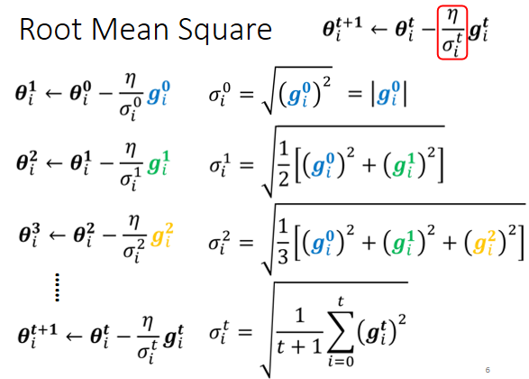

现在参数要update的式子,我们从θᵢ⁰初始化参数减掉gᵢ⁰,乘上learning rate η除以σᵢ⁰,就得到θᵢ¹,
$$
{θ{_i}{^{1}}} ← {θ{_i}{^{0}}}-{\frac{η}{σᵢ^0}}{g{_i}{^{0}}}
$$

- 这个**σᵢ⁰**在**第一次update参数**的时候,这个σᵢ⁰是(gᵢ⁰)²开根号
    $$
    {σᵢ^0}=\sqrt{({g{_i}{^{0}}})^2}=|{g{_i}{^{0}}}|
    $$
    这个gᵢ⁰就是我们的gradient,就是gradient的平方开根号,其实就是gᵢ⁰的绝对值,所以你把gᵢ⁰的绝对值代到${θ{_i}{^{1}}} ← {θ{_i}{^{0}}}-{\frac{η}{σᵢ^0}}{g{_i}{^{0}}}$,这个式子中gᵢ⁰跟这个根号底下的gᵢ⁰,它们的大小是一样的,所以式子中这一项只会有一个,要嘛是正一 要嘛是负一,就代表说我们第一次在update参数,从θᵢ⁰update到θᵢ¹的时候,要嘛是加上η 要嘛是减掉η,跟这个gradient的大小没有关係,是看你η设多少,这个是第一步的状况

- 重点是接下来怎麼处理,那θᵢ¹它要一样,减掉gradient gᵢ¹乘上η除以σᵢ¹,
    $$
    {θ{_i}{^{1}}}-{\frac{η}{σᵢ^1}}{g{_i}{^{1}}}
    $$
    现在在第二次update参数的时候,是要除以σᵢ¹ ,这个σᵢ¹就是我们过去,**所有计算出来的gradient,它的平方的平均再开根号**
    $$
    {σᵢ^1}=\sqrt{\frac{1}{2}[{(g{_i}{^{0}}})^2+{(g{_i}{^{1}}})^2]}
    $$
    我们到目前為止,在第一次update参数的时候,我们算出了gᵢ⁰,在第二次update参数的时候,我们算出了gᵢ¹,所以这个σᵢ¹就是(gᵢ⁰)²,加上(gᵢ¹)²除以½再开根号,这个就是Root Mean Square,我们算出这个σᵢ¹以后,我们的learning rate就是η除以σᵢ¹,然后把θᵢ¹减掉,η除以σᵢ¹乘以gᵢ¹  得到θᵢ²
    $$
    {θ{_i}{^{2}}} ← {θ{_i}{^{1}}}-{\frac{η}{σᵢ^1}}{g{_i}{^{1}}}
    $$

- 同样的操作就反覆继续下去,在θᵢ²的地方,你要减掉η除以σᵢ²乘以gᵢ²,
    $$
    {θ{_i}{^{2}}}-{\frac{η}{σᵢ^2}}{g{_i}{^{2}}}
    $$
    那这个σ是什麼呢,这个σᵢ²就是过去,所有算出来的gradient,它的平方和的平均再开根号
    $$
    {σᵢ^2}=\sqrt{\frac{1}{3}[{(g{_i}{^{0}}})^2+{(g{_i}{^{1}}})^2+{(g{_i}{^{2}}})^2]}
    $$
    所以你把gᵢ⁰取平方,gᵢ¹取平方 gᵢ²取平方,的平均再开根号,得到σᵢ²放在这个地方,然后update参数
    $$
    {θ{_i}{^{3}}} ← {θ{_i}{^{2}}}-{\frac{η}{σᵢ^2}}{g{_i}{^{2}}}
    $$

- 所以这个process这个过程,就反覆继续下去,到第t次update参数的时候,其实这个是第t + 1次,第t + 1次update参数的时候,你的这个σᵢᵗ它就是过去所有的gradient,gᵢᵗ从第一步到目前為止,所有算出来的gᵢᵗ的平方和,再平均 再开根号得到σᵢᵗ,
    $$
    {σᵢ^t}=\sqrt{\frac{1}{t+1}\sum_{i=0}^{t}{(g{_i}{^{t}}})^2}
    $$
    然后在把它除learning rate,然后用这一项当作是,新的learning rate来update你的参数,
    $$
    {θ{_i}{^{t+1}}} ← {θ{_i}{^{t}}}-{\frac{η}{σᵢ^t}}{g{_i}{^{t}}}
    $$
    

### Adagrad

那这一招被用在一个叫做==Adagrad==的方法裡面,**為什麼这一招可以做到我们刚才讲的,坡度比较大的时候,learning rate就减小,坡度比较小的时候,learning rate就放大呢?**

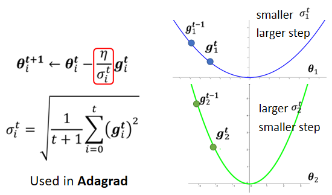

你可以想像说,现在我们有两个参数:**一个叫θᵢ¹ 一个叫θᵢ²   θᵢ¹坡度小 θᵢ²坡度大**

- θᵢ¹因為它坡度小,所以你在θᵢ¹这个参数上面,算出来的gradient值都比较小
- 因為gradient算出来的值比较小,然后这个σ是gradient的平方和取平均再开根号

$$
{σᵢ^t}=\sqrt{\frac{1}{t+1}\sum_{i=0}^{t}{(g{_i}{^{t}}})^2}
$$

- 所以算出来的σ就小,σ小 learning rate就大
    $$
    {\frac{η}{σᵢ^t}}
    $$

反过来说θᵢ²,θᵢ²是一个比较陡峭的参数,在θᵢ²这个方向上loss的变化比较大,所以算出来的gradient都比较大,,你的σ就比较大,你在update的时候 你的step,你的参数update的量就比较小

所以有了σ这一项以后,你就可以随著gradient的不同,每一个参数的gradient的不同,来自动的调整learning rate的大小,那这个并不是,你今天会用的最终极的版本,

### RMSProp

刚才那个版本,就算是同一个参数,它需要的learning rate,也会随著时间而改变,我们刚才的假设,好像是同一个参数,它的gradient的大小,就会固定是差不多的值,但事实上并不一定是这个样子的

举例来说我们来看,这个新月形的error surface

如果我们考虑横轴的话,考虑左右横的水平线的方向的话,你会发现说,在绿色箭头这个地方坡度**比较陡峭,所以我们需要比较小的learning rate**,

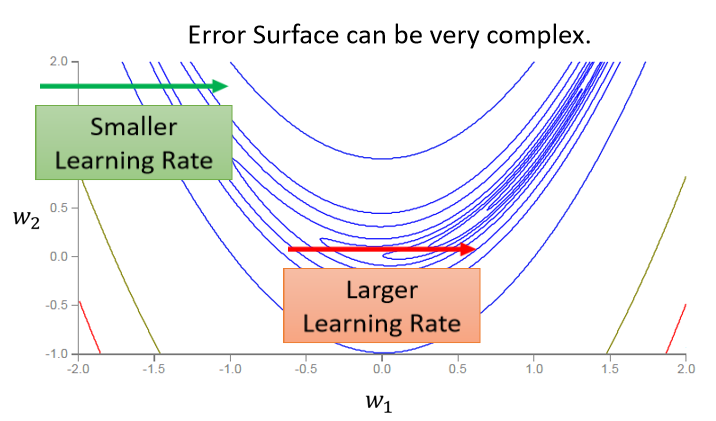

但是走到了中间这一段，到了红色箭头的时候呢,坡度又变得平滑了起来,**平滑了起来就需要比较大的learning rate**,所以就算是**同一个参数同一个方向,我们也期待说,learning rate是可以动态的调整的**,于是就有了一个新的招数,这个招数叫做==RMS Prop==

RMS Prop这个方法有点传奇,它传奇的地方在於它找不到论文,非常多年前应该是将近十年前,Hinton在Coursera上,开过deep learning的课程,那个时候他在他的课程裡面,讲了RMS Prop这个方法,然后这个方法没有论文,所以你要cite的话,你要cite那个影片的连结,这是个传奇的方法叫做RMS Prop

RMS Prop这个方法,**它的第一步跟刚才讲的Root Mean Square,也就是那个Apagrad的方法,是一模一样的**
$$
{σᵢ^0}=\sqrt{({g_i^0})^2}
$$
我们看第二步,一样要算出σᵢ¹,只是我们现在算出σᵢ¹的方法跟刚才,算Root Mean Square的时候不一样,刚才在算Root Mean Square的时候,每一个gradient都有同等的重要性,但**在RMS Prop裡面,它决定你可以自己调整,现在的这个gradient,你觉得它有多重要**
$$
{σᵢ^1}=\sqrt[]{\alpha(σ_i^0)^2+(1-\alpha)(g_i^1)^2}
$$
所以在RMS Prop裡面,我们这个σᵢ¹它是前一步算出来的σᵢ⁰,裡面就是有gᵢ⁰,所以这个**σᵢ⁰就代表了gᵢ⁰的大小**,所以它是(σᵢ⁰)²,乘上α加上(1-α),乘上现在我们刚算出来的,新鲜热腾腾的gradient就是gᵢ¹

那这个**α就像learning rate一样,这个你要自己调它,它是一个hyperparameter**

- 如果我今天**α设很小趋近於0**,就代表我觉得**gᵢ¹相较於之前所算出来的gradient而言,比较重要**
- 我**α设很大趋近於1**,那就代表我觉得**现在算出来的gᵢ¹比较不重要,之前算出来的gradient比较重要**

所以同理在第三次update参数的时候,我们要算σᵢ² ,我们就把σᵢ¹拿出来取平方再乘上α,那σᵢ¹裡面有gᵢ¹跟σᵢ⁰ ,σᵢ⁰裡面又有gᵢ⁰,所以你知道σᵢ¹裡面它有gᵢ¹有gᵢ⁰, 然后这个gᵢ¹跟gᵢ⁰呢他们会被乘上α,然后再加上1-α乘上这个(gᵢ²)²
$$
{σᵢ^2}=\sqrt[]{\alpha(σ_i^1)^2+(1-\alpha)(g_i^2)^2}
$$
所以这个α就会决定说gᵢ²,它在整个σᵢ²裡面佔有多大的影响力

那同样的过程就反覆继续下去,σᵢᵗ等於根号α乘上(σᵢᵗ⁻¹)²,加上(1-α) (gᵢᵗ)²,
$$
{σᵢ^t}=\sqrt[]{\alpha(σ_i^{t-1})^2+(1-\alpha)(g_i^t)^2}
$$
你用α来决定现在刚算出来的gᵢᵗ,它有多重要,好那这个就是RMSProp

那RMSProp我们刚刚讲过说,透过α这一项你可以决定说,gᵢᵗ相较於之前存在,σᵢᵗ⁻¹裡面的gᵢᵗ到gᵢᵗ⁻¹而言,它的重要性有多大,如果你用RMS Prop的话,你就可以动态调整σ这一项,我们现在假设从这个地方开始

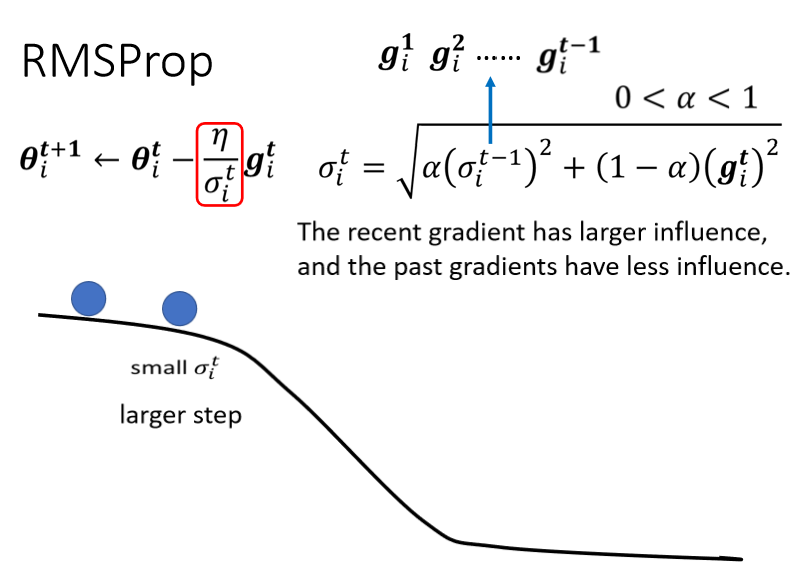

这个黑线是我们的error surface,从这个地方开始你要update参数,好你这个球就从这边走到这边,那因為一路上都很平坦,很平坦就代表说g算出来很小,代表现在update参数的时候,我们会走比较大的步伐

接下来继续滚,滚到这边以后我们gradient变大了,如果不是RMS Prop,原来的Adagrad的话它反应比较慢,但如果你用RMS Prop,然后呢你把α设小一点,你就是让新的,刚看到的gradient影响比较大的话,那你就可以很快的让σ的值变大,也可以很快的让你的步伐变小

你就可以踩一个煞车,本来很平滑走到这个地方,突然变得很陡,那RMS Prop可以很快的踩一个煞车,把learning rate变小,如果你没有踩剎车的话,你走到这裡这个地方,learning rate太大了,那gradient又很大,两个很大的东西乘起来,你可能就很快就飞出去了,飞到很远的地方

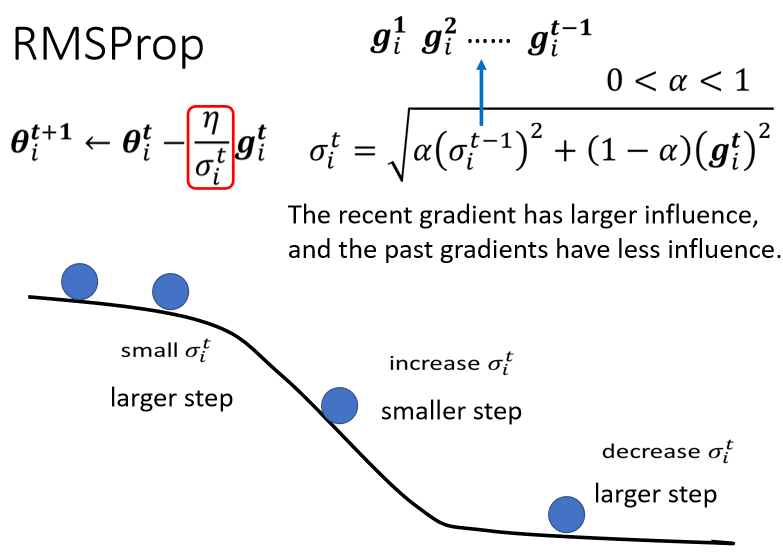

如果继续走,又走到平滑的地方了,因為这个σᵢᵗ 你可以调整α,让它比较看重於,最近算出来的gradient,所以你gradient一变小,σ可能就反应很快,它的这个值就变小了,然后呢你走的步伐就变大了,这个就是RMS Prop,

#### Adam

那今天你最常用的,optimization的策略,有人又叫做optimizer,今天最常用的optimization的策略,就是Adam

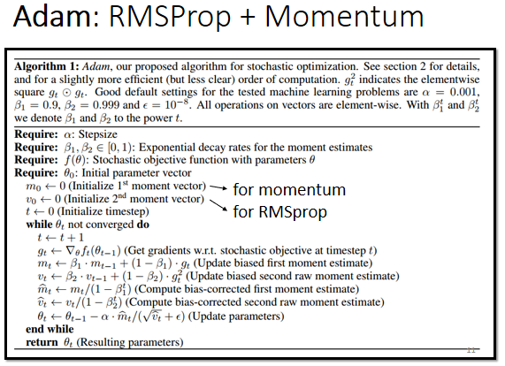

Adam就是RMS Prop加上Momentum,那Adam的演算法跟原始的论文https://arxiv.org/pdf/1412.6980.pdf

今天pytorch裡面,都帮你写得好好的了,所以这个你今天,不用担心这种optimization的问题,optimizer这个deep learning的套件,往往都帮你做好了,然后这个optimizer裡面,也有一些参数需要调,也有一些hyperparameter,需要人工决定,但是你往往用预设的,那一种参数就够好了,你自己调有时候会调到比较差的,往往你直接copy,这个pytorch裡面,Adam这个optimizer,然后预设的参数不要随便调,就可以得到不错的结果了,关於Adam的细节,就留给大家自己研究

## Learning Rate Scheduling

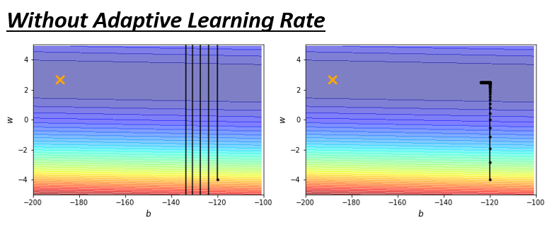

我们刚才讲说这个简单的error surface,我们都train不起来,现在我们来看一下,加上Adaptive Learning Rate以后,train不train得起来,

那这边是採用,最原始的Adagrad那个做法啦,就是把过去看过的,这个learning rate通通都,过去看过的gradient,通通都取平方再平均再开根号当作这个σ ,做起来是这个样子的

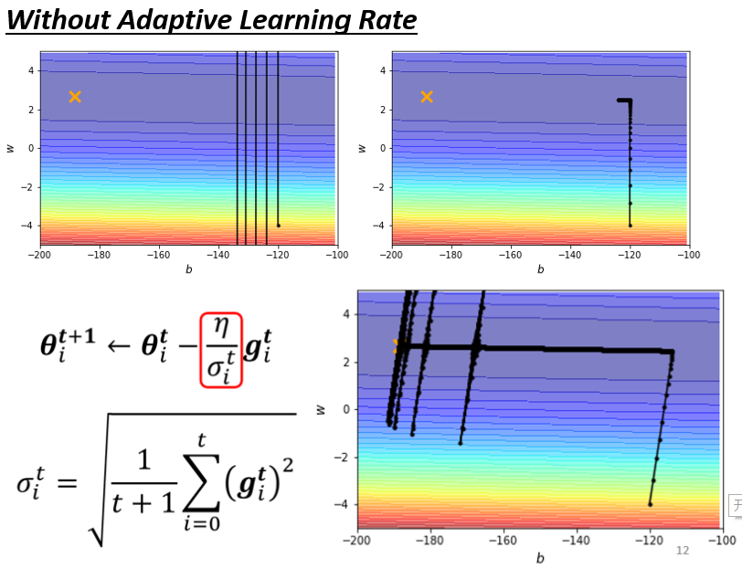

这个走下来没有问题,然后接下来在左转的时候,这边也是update了十万次,之前update了十万次,只卡在左转这个地方

那现在有Adagrad以后,你可以再继续走下去,走到非常接近终点的位置,因為当你走到这个地方的时候,你因為这个左右的方向的,这个gradient很小,所以learning rate会自动调整,左右这个方向的,learning rate会自动变大,所以你这个步伐就可以变大,就可以不断的前进

接下来的问题就是,為什麼快走到终点的时候突然爆炸了呢

你想想看 我们在做这个σ的时候,我们是把过去所有看到的gradient,都拿来作平均

- 所以这个纵轴的方向,在这个初始的这个地方,感觉gradient很大
- 可是这边走了很长一段路以后,这个纵轴的方向,gradient算出来都很小,所以纵轴这个方向,这个y轴的方向就累积了很小的σ

- 因為我们在这个y轴的方向,看到很多很小的gradient,所以我们就累积了很小的σ,累积到一个地步以后,这个step就变很大,然后就爆走就喷出去了

- 喷出去以后没关係,有办法修正回来,因為喷出去以后,就走到了这个gradient比较大的地方,走到gradient比较大的地方以后,这个σ又慢慢的变大,σ慢慢变大以后,这个参数update的距离,Update的步伐大小就慢慢的变小

你就发现说走著走著,突然往左右喷了一下,但是这个喷了一下不会永远就是震盪,不会做简谐运动停不下来,这个力道慢慢变小,有摩擦力 让它慢慢地慢慢地,又回到中间这个峡谷来,然后但是又累计一段时间以后 又会喷,然后又慢慢地回来 怎麼办呢,**有一个方法也许可以解决这个问题,这个叫做learning rate的scheduling**

什麼是learning rate的scheduling呢

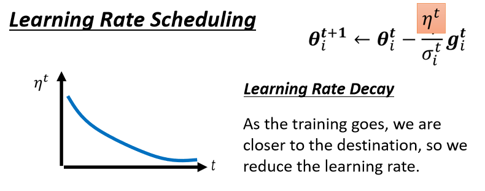

我们刚才这边还有一项η,这个η是一个固定的值,learning rate scheduling的意思就是说,我们**不要把η当一个常数,我们把它跟时间有关**

最常见的策略叫做==Learning Rate Decay==,也就是说，**随著时间的不断地进行,随著参数不断的update,我们这个η让它越来越小**

那这个也就合理了,因為一开始我们距离终点很远,随著参数不断update,我们距离终点越来越近,所以我们把learning rate减小,让我们参数的更新踩了一个煞车,让我们参数的更新能够慢慢地慢下来,所以刚才那个状况,如果加上Learning Rate Decay有办法解决

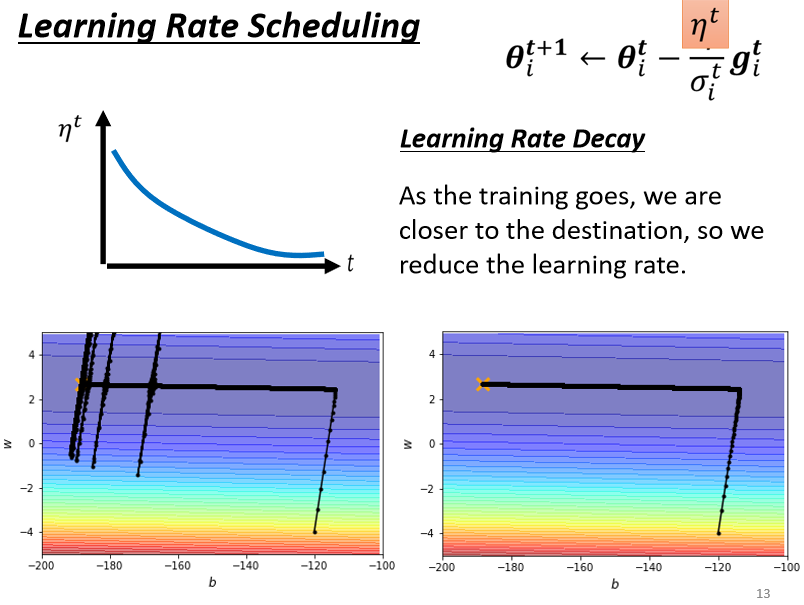

刚才那个状况,如果加上Learning Rate Decay的话,我们就可以很平顺的走到终点,因為在这个地方,这个η已经变得非常的小了,虽然说它本来想要左右乱喷,但是因為乘上这个非常小的η,就停下来了 就可以慢慢地走到终点,那除了Learning Rate Decay以外,还有另外一个经典，常用的Learning Rate Scheduling的方式,叫做==Warm Up==

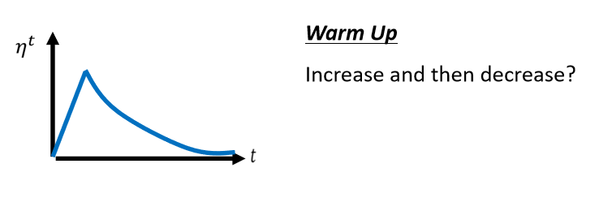

Warm Up这个方法,听起来有点匪夷所思,这Warm Up的方法是**让learning rate,要先变大后变小**,你会问说 变大要变到多大呢,变大速度要多快呢 ，小速度要多快呢,**这个也是hyperparameter**,你要自己用手调的,但是大方向的大策略就是,learning rate要先变大后变小,那这个方法听起来很神奇,就是一个黑科技这样,这个黑科技出现在,很多远古时代的论文裡面

这个warm up,最近因為在训练BERT的时候,往往需要用到Warm Up,所以又被大家常常拿出来讲,但它并不是有BERT以后,才有Warm Up的,Warm Up这东西远古时代就有了,举例来说,Residual Network裡面是有Warm Up的

这边是放了Residual network,放在arXiv上面的文章连结啦,今天这种有关machine learning 的,文章往往在投conference之前,投国际会议之前,就先放到一个叫做arXiv的网站上,把它公开来让全世界的人都可以看

你其实看这个arXiv的网址,你就可以知道,这篇文章是什麼时候放到网路上的,怎麼看呢 arXiv的前四个数字,这15代表年份,代表说residual network这篇文章,是2015年放到arXiv上面的,后两个数字代表月份,所以它是15年的12月,15年的年底放在arXiv上面的

所以五六年前的文章,在deep learning变化,这麼快速的领域裡面,五六年前就是上古时代,那在上古时代,这个Residual Network裡面,就已经记载了Warm Up的这件事情,它说我们**用learning rate 0.01,取Warm Up,先用learning rate 0.01,再把learning rate改成0.1**

用过去我们通常最常见的train,Learning Rate Scheduling的方法,就是让learning rate越来越小,但是Residual Network,这边特别註明它反其道而行,一开始要设0.01 接下来设0.1,还特别加一个註解说,一开始就用0.1反而就train不好,不知道為什麼 也没解释,反正就是train不好,需要Warm Up这个黑科技。

而在这个黑科技,在知名的Transformer裡面(这门课也会讲到),也用一个式子提了它

它这边有一个式子说,它的learning rate遵守这一个,神奇的function来设定,它的learning rate,这个神奇的function,乍看之下会觉得 哇 在写什麼,不知道在写些什麼

这个东西你实际上,把这个function画出来,你实际上把equation画出来的话,就会发现它就是Warm Up,learning rate会先增加,然后接下来再递减

所以你发现说Warm Up这个技术,在很多知名的network裡面都有,被当作一个黑科技,就论文裡面不解释说,為什麼要用这个,但就偷偷在一个小地方,你没有注意到的小地方告诉你说,这个network要用这种黑科技,才能够把它训练起来

那為什麼需要warm Up呢,这个仍然是今天,一个可以研究的问题啦

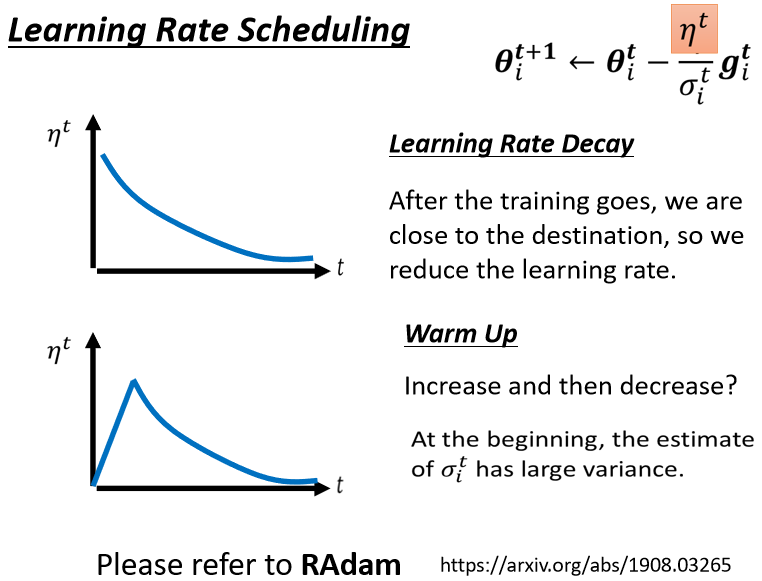

这边有一个可能的解释是说,你想想看当我们在用Adam RMS Prop,或Adagrad的时候,我们会需要计算σ,它是一个统计的结果,**σ告诉我们,某一个方向它到底有多陡,或者是多平滑**,那这个统计的结果,**要看得够多笔数据以后,这个统计才精準,所以一开始我们的统计是不精準的**

一开始我们的σ是不精準的,所以我们一开始不要让我们的参数,走离初始的地方太远,先让它在初始的地方呢,做一些像是探索这样,所以**一开始learning rate比较小,是让它探索 收集一些有关error surface的情报**,先收集有关σ的统计数据,**等σ统计得比较精準以后,在让learning rate呢慢慢地爬升**

所以这是一个解释,為什麼我们需要warm up的可能性,那如果你想要学更多,有关warm up的东西的话,你其实可以看一篇paper,它是Adam的进阶版叫做RAdam,裡面对warm up这件事情,有更多的理解

那有关optimization的部分,其实我们就讲到这边啦,

## Summary of Optimization

所以我们从最原始的gradient descent,进化到这一个版本

这个版本裡面

- 我们有Momentum,也就是说我们现在,不是完全顺著gradient的方向,现在不是完全顺著这一个时间点,算出来的gradient的方向,来update参数,而是把过去,所有算出来gradient的方向,做一个加总当作update的方向,这个是momentum

- 接下来应该要update多大的步伐呢,我们要除掉,gradient的Root Mean Square

    

    那讲到这边可能有同学会觉得很困惑,这一个momentum是考虑,过去所有的gradient,这个σ也是考虑过去所有的gradient,一个放在分子一个放在分母,都考虑过去所有的gradient,不就是正好**抵销了吗**,

    但是其实这个Momentum跟这个σ,它们在使用过去所有gradient的方式是不一样的,**Momentum是直接把所有的gradient通通都加起来**,所以它有考虑**方向**,它有考虑gradient的**正负号**,它有考虑gradient**是往左走还是往右走**

    但是这个**Root Mean Square,它就不考虑gradient的方向**了,它**只考虑gradient的大小**,记不记得我们在算σ的时候,我们都要取平方项,我们都要把gradient取一个平方项,我们是把平方的结果加起来,所以我们只考虑gradient的大小,不考虑它的方向,所以Momentum跟这个σ,算出来的结果并不会互相抵销掉

- 那最后我们还会加上,一个learning rate的scheduling,

    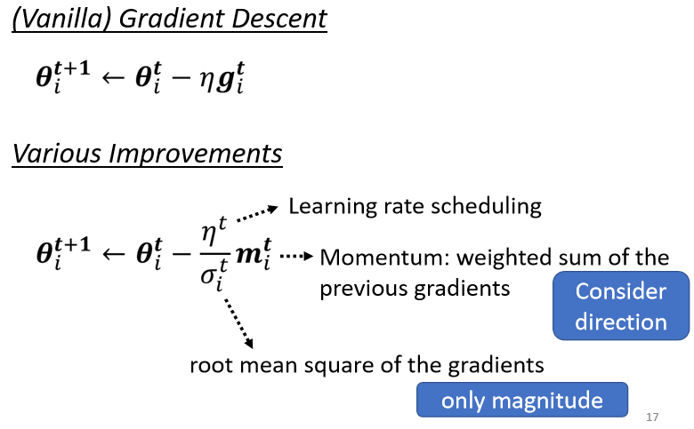

    那这个是今天optimization的,完整的版本了,这种Optimizer,除了Adam以外,Adam可能是今天最常用的,但除了Adam以外,还有各式各样的变形,但其实各式各样的变形都不脱,就是要嘛不同的方法算M,要嘛不同的方法算σ,要嘛不同的,Learning Rate Scheduling的方式

那如果你想要知道更多,跟optimization有关的事情的话,那有之前助教的录影,给大家参考到这裡,影片蛮长的大概两个小时,所以你可以想见说,有关Optimizer的东西,其实是还有蛮多东西可以讲的,所以时间的关係我们就不讲下去

到目前為止呢 我们讲的是什麼,我们讲的是,当我们的error surface非常的崎嶇,就像这个例子一样非常的崎嶇的时候

我们需要一些比较好的方法,来做optimization,前面有一座山挡著,我们希望可以绕过那座山,山不转路转的意思这样,你知道这个gradient,这奇怪的error surface,会让人觉得很痛苦

那就要用神罗天征,把这个炸平这样子,所以接下来我们会讲的技巧,就是有没有可能,直接把这个error surface移平,我们改Network裡面的什麼东西,改Network的架构activation function,或者是其它的东西,直接移平error surface,让它变得比较好train,也就是山挡在前面,就把山直接剷平的意思
