# Quick Introduction of Batch Normalization

本篇是一个很快地介绍,Batch Normalization 这个技术

## Changing Landscape

之前才讲过说,我们能不能够直接改error surface 的 landscape,我们觉得说 error surface 如果很崎嶇的时候,它比较难 train,那我们能不能够直接把山剷平,让它变得比较好 train 呢？

==Batch Normalization== 就是其中一个,**把山剷平的想法**

我们一开始就跟大家讲说,不要小看 optimization 这个问题,有时候就算你的 error surface 是 convex的,它就是一个碗的形状,都不见得很好 train

假设你的两个参数啊,它们对 **Loss 的斜率差别非常大**,在 $w_1$ 这个方向上面,你的斜率变化很小,在 $w_2$ 这个方向上面斜率变化很大

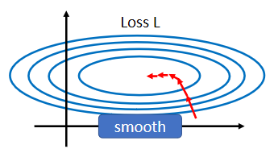

如果是**固定的 learning rate**,你可能很难得到好的结果,所以我们才说你需要adaptive 的 learning rate、 Adam 等等比较进阶的 optimization 的方法,才能够得到好的结果

现在我们要从另外一个方向想,**直接把难做的 error surface 把它改掉**,看能不能够改得好做一点

在做这件事之前,也许我们第一个要问的问题就是,有这一种状况,$w_1 $ 跟 $w_2$ 它们的**斜率差很多**的这种状况,到底是从什麼地方来的

假设我现在有一个非常非常非常简单的 model,它的输入是 $x_1$ 跟 $x_2$,它对应的参数就是 $ w_1 $ 跟 $w_2$,它是一个 linear 的 model,没有 activation function

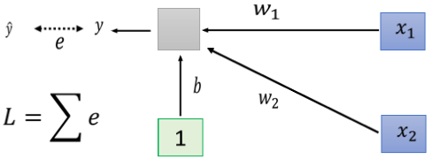

$ w_1 $ 乘 $x_1$,$w_2$ 乘 $x_2$ 加上 b 以后就得到 y,然后会计算 y 跟 $\hat{y}$ 之间的差距当做 e,把所有 training data e 加起来就是你的 Loss，然后去 minimize 你的 Loss

那什麼样的状况我们会產生像上面这样子,**比较不好 train 的 error surface** 呢？

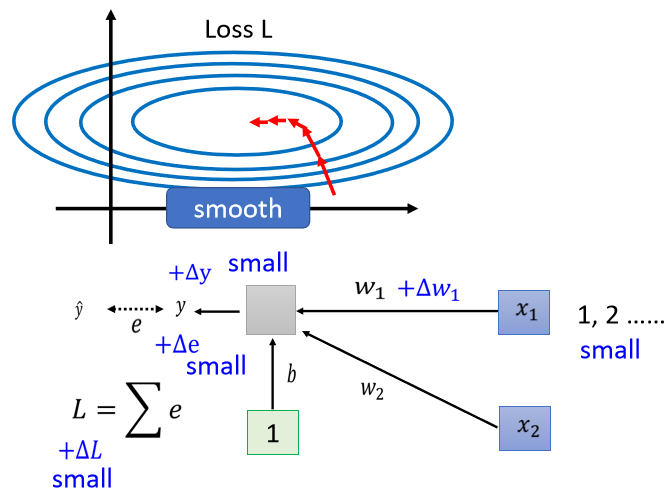

当我们对 **$ w_1 $ 有一个小小的改变**,比如说加上 delta $ w_1 $ 的时候,那这个 L 也会有一个改变,那这个 $ w_1 $ 呢,是透过 $ w_1 $ 改变的时候,你就改变了 y,y 改变的时候你就改变了 e,然后接下来就**改变了 L**

那什麼时候 $ w_1 $ 的改变会对 L 的影响很小呢,也就是它在 error surface 上的斜率会很小呢

一个可能性是当你的 **input 很小的时候**,假设 $x_1$ 的值在不同的 training example 裡面,它的值都很小,那因為 $x_1$ 是直接乘上 $ w_1 $，如果 $x_1$ 的值都很小,$ w_1 $ 有一个变化的时候,它得到的,它**对 y 的影响也是小的**,对 e 的影响也是小的,它对 L 的影响就会是小的

反之呢,如果今天是 $x_2$ 的话

那假设 **$x_2$ 的值都很大**,当你的 $w_2$ 有一个小小的变化的时候,虽然 $w_2$ 这个变化可能很小,但是因為它乘上了 $x_2$,$x_2$ 的值很大,那 y 的变化就很大,那 e 的变化就很大,那 L 的变化就会很大,就会导致我们在 w 这个方向上,做变化的时候,我们把 w 改变一点点,那我们的 error surface 就会有很大的变化

所以你发现说,既然在这个 linear 的 model 裡面,当我们 input 的 feature,**每一个 dimension 的值,它的 scale 差距很大**的时候,我们就可能產生像这样子的 error surface,就可能產生**不同方向,斜率非常不同,坡度非常不同的 error surface**

所以怎麼办呢,我们有没有可能给feature 裡面**不同的 dimension,让它有同样的数值的范围**

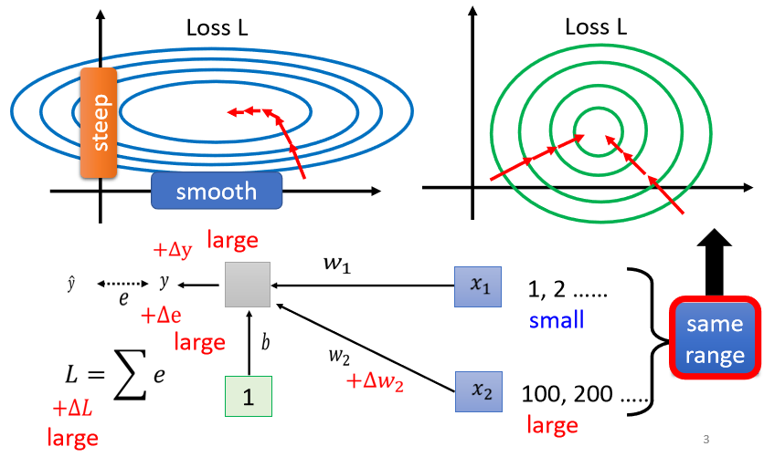

如果我们可以给不同的 dimension,同样的数值范围的话,那我们可能就可以製造比较好的 error surface,让 training 变得比较容易一点

其实有很多不同的方法,这些不同的方法,往往就合起来统称為==Feature Normalization==

### Feature Normalization

以下所讲的方法只是Feature Normalization 的一种可能性,它**并不是 Feature Normalization 的全部**,假设 $x^1$ 到 $x^R$,是我们所有的训练资料的 feature vector

我们把所有训练资料的 feature vector ,统统都集合起来,那每一个 vector ,$x_1$ 裡面就 $x^1_1 $代表 $x_1$ 的第一个 element,$x^2_1 $,就代表 $x_2$ 的第一个 element,以此类推

那我们把**不同笔资料即不同 feature vector,同一个 dimension** 裡面的数值,把它取出来,然后去计算某一个 dimension 的 mean，它的 mean 呢 就是$m_i$，我们计算第 i 个 dimension 的,standard deviation,我们用$\sigma_i$来表示它

那接下来我们就可以做一种 normalization,那这种 normalization 其实叫做==**标準化**==,其实叫 ==standardization==,不过我们这边呢,就等一下都统称 normalization 就好了
$$
\tilde{x}^r_i ← \frac{x^r_i-m_i}{\sigma_i}
$$
我们就是把这边的某一个数值x,减掉这一个 dimension 算出来的 mean,再除掉这个 dimension,算出来的 standard deviation,得到新的数值叫做 $\tilde{x}$

然后得到新的数值以后,**再把新的数值把它塞回去**,以下都用这个 tilde来代表有被 normalize 后的数值

那做完 normalize 以后有什麼好处呢？

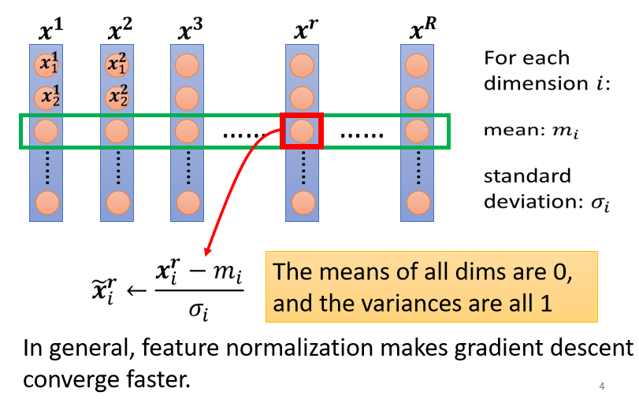

- 做完 normalize 以后啊,这个 dimension 上面的数值就会平均是 0,然后它的 variance就会是 1,所以**这一排数值的分布就都会在 0 上下**

- 对每一个 dimension都做一样的 normalization,就会发现所有 feature 不同 dimension 的数值都在 0 上下,那你可能就可以**製造一个,比较好的 error surface**

所以像这样子 Feature Normalization 的方式,往往对你的 training 有帮助,它可以让你在做 gradient descent 的时候,这个 gradient descent,**它的 Loss 收敛更快一点,可以让你的 gradient descent,它的训练更顺利一点**,这个是 Feature Normalization

## Considering Deep Learning

$\tilde{x}$ 代表 normalize 的 feature,把它丢到 deep network 裡面,去做接下来的计算和训练,所以把 $x_1$ tilde 通过第一个 layer 得到 $z^1$,那你有可能通过 activation function,不管是选 Sigmoid 或者 ReLU 都可以,然后再得到 $a^1$,然后再通过下一层等等,那就看你有几层 network 你就做多少的运算

所以每一个 x 都做类似的事情,但是如果我们进一步来想的话,对 $w_2$ 来说

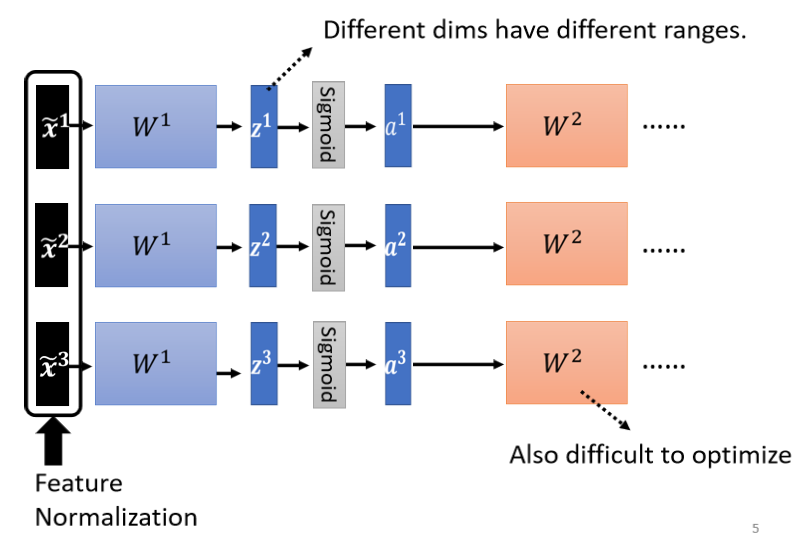

这边的 $a^1$ $a^3$ 这边的 $z^1$ $z^3$,其实也是另外一种 input,如果这边 $\tilde{x}$,虽然它已经做 normalize 了,但是通过 $ w_1 $ 以后它就**没有做 normalize**,如果 $\tilde{x}$ 通过 $ w_1 $ 得到是 $z^1$,而 $z^1$ 不同的 dimension 间,它的数值的分布仍然有很大的差异的话,那我们要 train $w_2$ 第二层的参数,会不会也有困难呢

对 $w_2$ 来说,这边的 a 或这边的 z 其实也是一种 feature,我们应该要对这些 feature 也做 normalization

那如果你选择的是 Sigmoid,那可能比较推荐对 z 做 Feature Normalization,因為Sigmoid 是一个 s 的形状,那它在 0 附近斜率比较大,所以如果你对 z 做 Feature Normalization,把所有的值都挪到 0 附近,那你到时候算 gradient 的时候,算出来的值会比较大

那不过因為你不见得是用 sigmoid ,所以你也不一定要把 Feature Normalization放在 z 这个地方,如果是选别的,也许你选a也会有好的结果,也说不定，**Ingeneral 而言,这个 normalization,要放在 activation function 之前,或之后都是可以的,在实作上,可能没有太大的差别**,好 那我们这边呢,就是对 z 呢,做一下 Feature Normalization

那怎麼对 z 做 Feature Normalization 呢

那你就把 z,想成是另外一种 feature ,我们这边有 $z^1$ $z^2$ $z^3$,我们就把 $z^1$ $z^2$ $z^3$ 拿出来

- 算一下它的 mean，这边的 $μ$ 是一个 vector,我们就把 $z^1$ $z^2$ $z^3$,这三个 vector 呢,把它平均起来,得到 $μ$ 这个 vector
- 那我们也算一个 standard deviation,这个 standard deviation 呢,这边这个成 $\sigma$,它也代表了一个 vector,那这个 vector 怎麼算出来呢,你就把 $z^i$减掉 $μ$,然后取平方,这边的平方,这个 notation 有点 abuse 啊,这边的平方就是指,对每一个 element 都去做平方,然后再开根号,这边开根号指的是对每一个 element,向量裡面的每一个 element,都去做开根号,得到 $\sigma$,反正你知道我的意思就好

把这三个 vector,裡面的每一个 dimension,都去把它的 $μ$ 算出来,把它的 $\sigma$ 算出来,好 我这边呢,就不把那些箭头呢 画出来了,从 $z^1$ $z^2$ $z^3$,算出 $μ$,算出 $\sigma$

接下来就把这边的每一个 z ,都去减掉 $μ$ 除以 $\sigma$,你把 $z^i$减掉 $μ$,除以 $\sigma$,就得到 $z^i$的 tilde

那这边的 $μ$ 跟 $\sigma$,它都是**向量**,所以这边这个除的意思是**element wise 的相除**,就是 $z^i$减 $μ$,它是一个向量,所以分子的地方是一个向量,分母的地方也是一个向量,把这个两个向量,它们对应的 element 的值相除,是我这边这个除号的意思,这边得到 Z 的 tilde

所以我们就是把 $z^1$ 减 $μ$ 除以 $\sigma$,得到 $z^1$ tilde,同理 $z^2$ 减 $μ$ 除以 $\sigma$,得到 $z^2$ tilde,$z^3$ 减 $μ$ 除以 $\sigma$,得到 $z^3$ tilde,那就把这个 $z^1$ $z^2$ $z^3$,做 Feature Normalization,变成 $z^1$ tilde,$z^2$ tilde 跟 $z^3$ 的 tilde

接下来就看你爱做什麼 就做什麼啦,通过 activation function,得到其他 vector,然后再通过,再去通过其他 layer 等等,这样就可以了,这样你就等於对 $z^1$ $z^2$ $z^3$,做了 Feature Normalization,变成 $\tilde{z}^1$  $\tilde{z}^2$  $\tilde{z}^3$ 

在这边有一件有趣的事情,这边的 $μ$ 跟 $\sigma$,它们其实都是根据 $z^1$ $z^2$ $z^3$ 算出来的

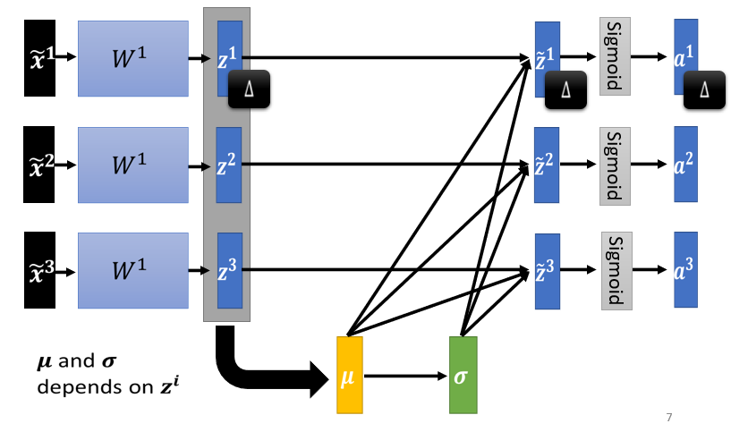

所以这边 $z^1$ 啊,它本来,如果我们没有做 Feature Normalization 的时候,你改变了 $z^1$ 的值,你会改变这边 a 的值,但是现在啊,当你改变 $z^1$ 的值的时候,$μ$ 跟 $\sigma$ 也会跟著改变,$μ$ 跟 $\sigma$ 改变以后,$z^2$ 的值 $a^2$ 的值,$z^3$ 的值 $a^3$ 的值,也会跟著改变

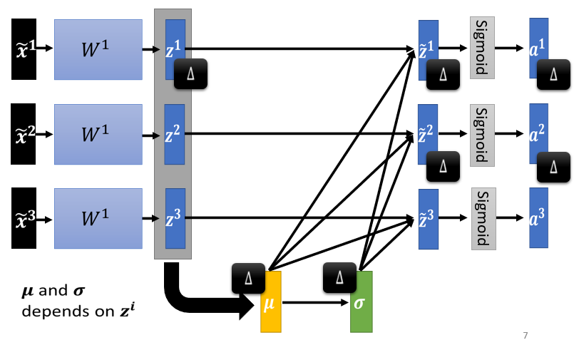

所以**之前**,我们每一个 $\tilde{x}_1$  $\tilde{x}_2$ $\tilde{x}_3$,它是**独立分开处理的**,但是我们在做 **Feature Normalization 以后**,这三个  example,它们变得**彼此关联**了

我们这边 $z^1$ 只要有改变,接下来 $z^2$ $a^2$ $z^3$ $a^3$,也都会跟著改变,所以这边啊,其实你要把,当你有做 Feature Normalization 的时候,你要把这一整个 process,就是有收集一堆 feature,把这堆 feature 算出 $μ$ 跟 $\sigma$ 这件事情,当做是 network 的一部分

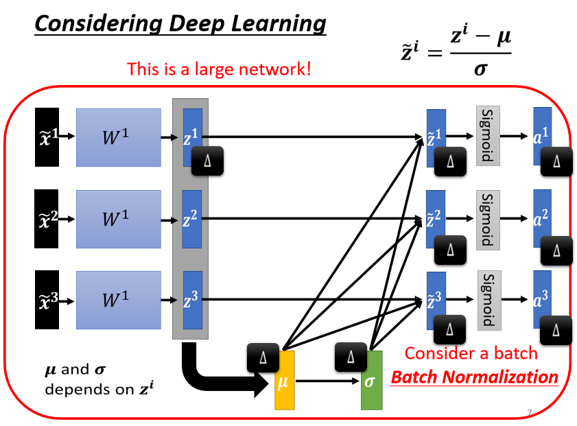

也就是说,你现在有一个比较大的 network

- 你之前的 network,都只吃一个 input,得到一个 output
- 现在你有一个比较大的 network,这个大的 network,它是吃一堆 input,用这堆 input 在这个 network 裡面,要算出 $μ$ 跟 $\sigma$,然后接下来產生一堆 output

那这个地方比较抽象,只可会意 不可言传这样子

那这边就会有一个问题了,因為你的训练资料裡面的 data 非常多,现在一个 data set,benchmark corpus 都上百万笔资料， GPU 的 memory,根本没有办法,把它整个 data set 的 data 都 load 进去。

在实作的时候,你不会让这一个 network 考虑整个 training data 裡面的所有 example,你**只会考虑一个 batch 裡面的 example**,举例来说,你 batch 设 64,那你这个巨大的 network,就是把 64 笔 data 读进去,算这 64 笔 data 的 $μ$,算这 64 笔 data 的 $\sigma$,对这 64 笔 data 都去做 normalization

因為我们在实作的时候,我们只对一个 batch 裡面的 data,做 normalization,所以这招叫做 ==Batch Normalization==

那这个 Batch Normalization,显然有一个问题 就是,**你一定要有一个够大的 batch,你才算得出 $μ$ 跟 $\sigma$**,假设你今天,你 batch size 设 1,那你就没有什麼 $μ$ 或 $\sigma$ 可以算

所以这个 Batch Normalization,是适用於 batch size 比较大的时候,因為 batch size 如果比较大,**也许这个 batch size 裡面的 data,就足以表示,整个 corpus 的分布**,那这个时候你就可以,把这个本来要对整个 corpus,做 Feature Normalization 这件事情,改成只在一个 batch,做 Feature Normalization,作為 approximation,

在做 Batch Normalization 的时候,往往还会有这样的设计你算出这个 $\tilde{z}$ 以后

- 接下来你会把这个 $\tilde{z}$,再乘上另外一个向量叫做 $γ$,这个 $γ$ 也是一个向量,所以你就是把 $\tilde{z}$ 跟 $γ$ 做 element wise 的相乘,把 z 这个向量裡面的 element,跟 $γ$ 这个向量裡面的 element,两两做相乘
- 再加上 $β$ 这个向量,得到 $\hat{z}$

而 $β$ 跟 $γ$,你要把它想成是 network 的参数,它是另外再被learn出来的,

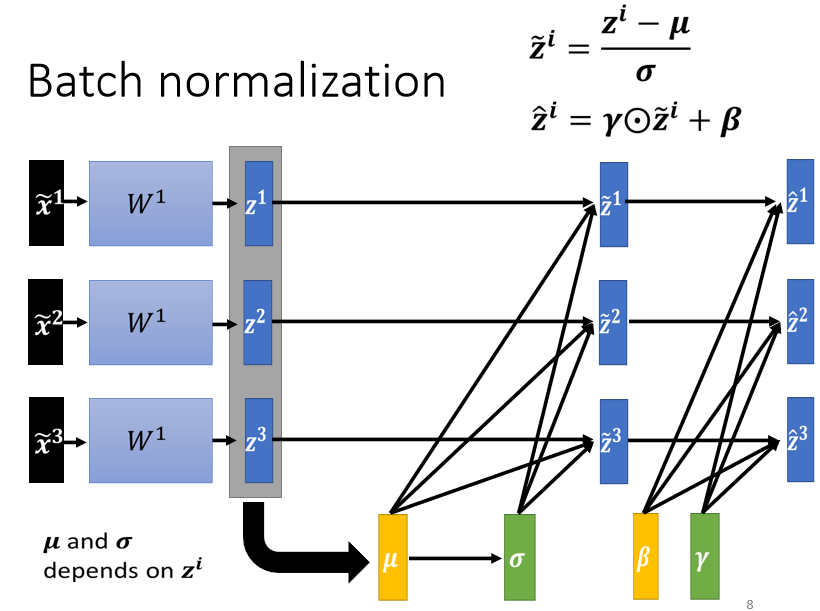

那為什麼要加上 $β$ 跟 $γ$ 呢

有人可能会觉得说,如果我们做 normalization 以后,那这边的 $\tilde{z}$,它的平均就一定是 0,那也许,今天如果平均是 0 的话,就是给那 network 一些限制,那**也许这个限制会带来什麼负面的影响**,所以我们把 $β$ 跟 $γ$ 加回去

然后让 network 呢,现在它的 hidden layer 的 output平均不是 0 的话,他就自己去learn这个 $β$ 跟 $γ$,来调整一下输出的分布,来调整这个 $\hat{z}$ 的分布

但讲到这边又会有人问说,刚才不是说做 Batch Normalization 就是,為了要让每一个不同的 dimension,它的 range 都是一样吗,现在如果加去乘上 $γ$,再加上 $β$,把 $γ$ 跟 $β$ 加进去,这样不会不同 dimension 的分布,它的 range 又都不一样了吗

有可能,但是你实际上在训练的时候,这个 $γ$ 跟 $β$ 的初始值啊

- 你会把这个 $γ$ 的初始值 就都设為 1,所以 $γ$ 是一个裡面的值,一开始其实是一个裡面的值,全部都是 1 的向量
- 那 $β$ 是一个裡面的值,全部都是 0 的向量,所以 $γ$ 是一个 one vector,都是 1 的向量,$β$ 是一个 zero vector,裡面的值都是 0 的向量

所以让你的 network 在一开始训练的时候,每一个 dimension 的分布,是比较接近的,也许训练到后来,你已经训练够长的一段时间,已经找到一个比较好的 error surface,走到一个比较好的地方以后,那再把 $γ$ 跟 $β$ 慢慢地加进去,好 所以加 Batch Normalization,往往对你的训练是有帮助的

## Testing

以上说的都是 training 的部分,testing ,有时候又叫 ==inference== ,所以有人在文件上看到有人说,做个 inference,inference 指的就是 testing

这个 Batch Normalization 在 inference,或是 testing 的时候,会有什麼样的问题呢

在 testing 的时候,如果 当然如果今天你是在做作业,我们一次会把所有的 testing 的资料给你,所以你确实也可以在 testing 的资料上面,製造一个一个 batch

但是假设你真的有系统上线,你是一个真正的线上的 application,你可以说,我今天一定要等 30,比如说你的 batch size 设 64,我一定要等 64 笔资料都进来,我才一次做运算吗,这显然是不行的

但是在做 Batch Normalization 的时候,一个 $\tilde{x}$,一个 normalization 过的 feature 进来,然后你有一个 z,你的 z 呢,要减掉 $μ$ 跟除 $\sigma$,那这个 $μ$ 跟 $\sigma$,是**用一个 batch 的资料算出来的**

但如果今天在 testing 的时候,根本就没有 batch,那我们要怎麼算这个 $μ$,跟怎麼算这个 $\sigma$ 呢

所以真正的,这个实作上的解法是这个样子的,如果你看那个 PyTorch 的话呢,Batch Normalization 在 testing 的时候,你并不需要做什麼特别的处理,PyTorch 帮你处理好了

在 training 的时候,如果你有在做 Batch Normalization 的话,在 training 的时候,你每一个 batch 计算出来的 $μ$ 跟 $\sigma$,他都会拿出来算 ==moving average==

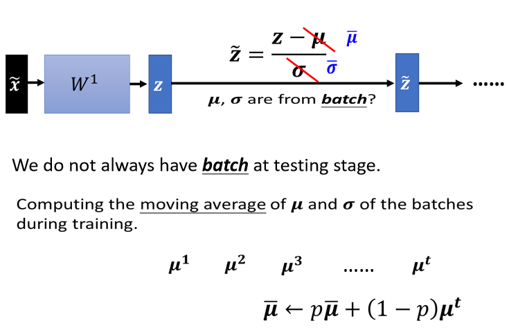

你每一次取一个 batch 出来的时候,你就会算一个 $μ^1$,取第二个 batch 出来的时候,你就算个 $μ^2$,一直到取第 t 个 batch 出来的时候,你就算一个 $μ^t$ 

接下来你会算一个 moving average,你会把你现在算出来的 $μ$ 的一个平均值,叫做 $μ$ bar,乘上某一个 factor,那这也是一个常数,这个这也是一个 constant,这也是一个那个 hyper parameter,也是需要调的那种啦

在 PyTorch 裡面,我没记错 他就设 0.1,我记得他 P 就设 0.1,好,然后加上 1 减 P,乘上 $μ^t$ ,然后来更新你的 $μ$ 的平均值,然后最后在 testing 的时候,你就不用算 batch 裡面的 $μ$ 跟 $\sigma$ 了

因為 testing 的时候,在真正 application 上,也没有 batch 这个东西,你就直接拿 $\barμ$  跟 $\bar\sigma$ ,也就是 $μ$ 跟 $\sigma$ 在训练的时候,得到的 moving average,$\barμ$  跟 $\bar\sigma$ ,来取代这边的 $μ$ 跟 $\sigma$,这个就是 Batch Normalization,在 testing 的时候的运作方式

## Comparison

好 那这个是从 Batch Normalization,原始的文件上面截出来的一个实验结果,那在原始的文件上还讲了很多其他的东西,举例来说,我们今天还没有讲的是,Batch Normalization 用在 CNN 上,要怎麼用呢,那你自己去读一下原始的文献,裡面会告诉你说,Batch Normalization 如果用在 CNN 上,应该要长什麼样子

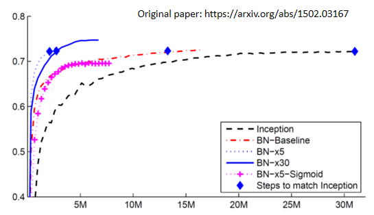

这个是原始文献上面截出来的一个数据

- 横轴呢,代表的是训练的过程，纵轴代表的是 validation set 上面的 accuracy
- 那这个**黑色**的虚线是**没有做 Batch Normalization** 的结果,它用的是 inception 的 network,就是某一种 network 架构啦,也是以 CNN 為基础的 network 架构
- 然后如果有做 Batch Normalization,你会得到**红色**的这一条虚线,那你会发现说,红色这一条虚线,它**训练的速度,显然比黑色的虚线还要快很多**,虽然最后收敛的结果啊,就你只要给它足够的训练的时间,可能都跑到差不多的 accuracy,但是**红色这一条虚线,可以在比较短的时间内,就跑到一样的 accuracy**,那这边这个蓝色的菱形,代表说这几个点的那个 accuracy 是一样的
- **粉红色**的线是 sigmoid function,就 sigmoid function 一般的认知,我们虽然还没有讨论这件事啦,但一般都会选择 ReLu,而不是用 sigmoid function,因為 sigmoid function,它的 training 是比较困难的,但是这边想要强调的点是说,**就算是 sigmoid 比较难搞的,加 Batch Normalization,还是 train 的起来**,那这边没有 sigmoid,没有做 Batch Normalization 的结果,因為在这个实验上,作者有说,sigmoid 不加 Batch Normalization,根本连 train 都 train 不起来
- **蓝色**的实线跟这个蓝色的虚线呢,是把 learning rate 设比较大一点,乘 5,就是 learning rate 变原来的 5 倍,然后乘 30,就是 learning rate 变原来的 30 倍,那因為如果你**做 Batch Normalization 的话,那你的 error surface 呢,会比较平滑 比较容易训练**,所以你可以把你的比较不崎嶇,所以你就可以把你的 learning rate 呢,设大一点,那这边有个不好解释的奇怪的地方,就是不知道為什麼,learning rate 设 30 倍的时候,是比 5 倍差啦,那作者也没有解释啦,你也知道做 deep learning 就是,有时候会產生这种怪怪的,不知道怎麼解释的现象就是了,不过作者就是照实,把他做出来的实验结果,呈现在这个图上面

## Internal Covariate Shift?

好 接下来的问题就是,Batch Normalization,它為什麼会有帮助呢,在原始的 Batch Normalization,那篇 paper 裡面,他提出来一个概念,叫做 ==internal covariate shift==,==covariate shift==(训练集和预测集样本分布不一致的问题就叫做“*covariate shift*”现象) 这个词汇是原来就有的,internal covariate shift,我认為是,Batch Normalization 的作者自己发明的

他认為说今天在 train network 的时候,会有以下这个问题,这个问题是这样

network 有很多层

- x 通过第一层以后 得到 a

- a 通过第二层以后 得到 b
- 计算出 gradient 以后,把 A update 成 A′,把 B 这一层的参数 update 成 B′

但是作者认為说,我们在计算 B,update 到 B′ 的 gradient 的时候,这个时候前一层的参数是 A 啊,或者是前一层的 output 是小 a 啊

那当前一层从 A 变成 A′ 的时候,它的 output 就从小 a 变成小 a′ 啊

但是我们计算这个 gradient 的时候,我们是根据这个 a 算出来的啊,所以这个 update 的方向,也许它**适合用在 a 上,但不适合用在 a′ 上面**

那如果说 Batch Normalization 的话,我们会让,因為我们每次都有做 normalization,我们就会让 a 跟 a′ 呢,它的分布比较接近,也许这样就会对训练呢,有帮助

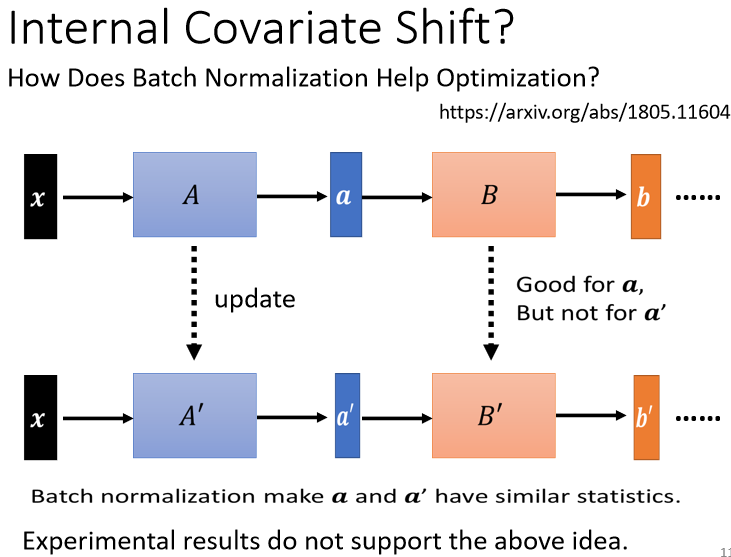

但是有一篇 paper 叫做,How Does Batch Normalization,Help Optimization,然后他就**打脸了internal covariate shift 的这一个观点**

在这篇 paper 裡面,他从各式各样的面向来告诉你说,i**nternal covariate shift,首先它不一定是 training network 的时候的一个问题,然后 Batch Normalization,它会比较好,可能不见得是因為,它解决了 internal covariate shift**

那在这篇 paper 裡面呢,他做了很多很多的实验,比如说他比较了训练的时候,这个 a 的分布的变化 发现**,不管有没有做 Batch Normalization,它的变化都不大**

然后他又说,就算是变化很大,对 training 也没有太大的伤害,然后他又说,不管你是根据 a 算出来的 gradient,还是根据 a′ 算出来的 gradient,方向居然都差不多

所以他告诉你说,internal covariate shift,可能不是 training network 的时候,最主要的问题,它可能也不是,Batch Normalization 会好的一个的关键,那有关更多的实验,你就自己参见这篇文章,

為什麼 Batch Normalization 会比较好呢,那在这篇 How Does Batch Normalization,Help Optimization 这篇论文裡面,他从实验上,也从理论上,至少**支持了 Batch Normalization,可以改变 error surface,让 error surface 比较不崎嶇这个观点**

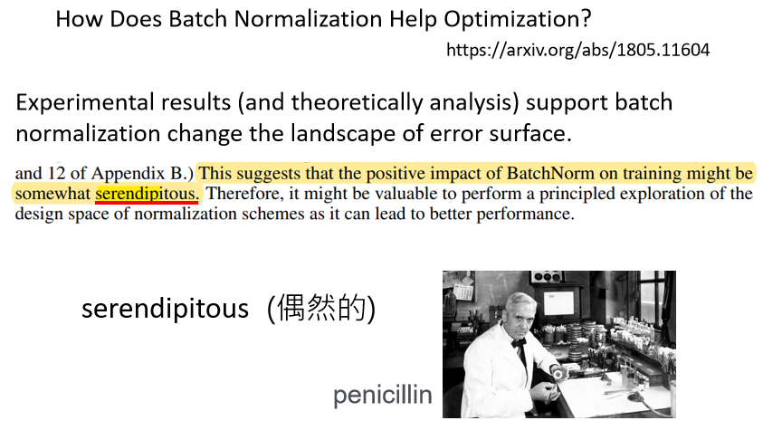

所以这个观点是有理论的支持,也有实验的佐证的,那在这篇文章裡面呢,作者还讲了一个非常有趣的话,他说他觉得啊,这个 Batch Normalization 的 positive impact

因為他说,如果我们要让 network,这个 error surface 变得比较不崎嶇,**其实不见得要做 Batch Normalization,感觉有很多其他的方法,都可以让 error surface 变得不崎嶇**,那他就试了一些其他的方法,发现说,跟 Batch Normalization performance 也差不多,甚至还稍微好一点,所以他就讲了下面这句感嘆

他觉得说,这个,positive impact of batchnorm on training,可能是 somewhat,**serendipitous**,什麼是 serendipitous 呢,这个字眼可能可以翻译成偶然的,但偶然并没有完全表达这个词汇的意思,这个词汇的意思是说,你发现了一个什麼意料之外的东西

举例来说,盘尼西林就是,意料之外的发现,大家知道盘尼西林的由来就是,有一个人叫做弗莱明,然后他本来想要那个,培养一些葡萄球菌,然后但是因為他实验没有做好,他的那个葡萄球菌被感染了,有一些霉菌掉到他的培养皿裡面,然后发现那些培养皿,那些霉菌呢,会杀死葡萄球菌,所以他就发明了,发现了盘尼西林,所以这是一种偶然的发现

那这篇文章的作者也觉得,Batch Normalization 也像是盘尼西林一样,是一种偶然的发现,但无论如何,它是一个有用的方法

## To learn more ……

那其实 Batch Normalization,不是唯一的 normalization,normalization 的方法有一把啦,那这边就是列了几个比较知名的,

Batch Renormalization
https://arxiv.org/abs/1702.03275
Layer Normalization
https://arxiv.org/abs/1607.06450
Instance Normalization
https://arxiv.org/abs/1607.08022
Group Normalization
https://arxiv.org/abs/1803.08494
Weight Normalization
https://arxiv.org/abs/1602.07868
Spectrum Normalization
https://arxiv.org/abs/1705.10941

