# Self-attention

CNN以后,我们要讲另外一个常见的Network架构,这个架构叫做Self-Attention,而这个Self-Attention

## Sophisticated Input 

到目前為止,我们的Network的**Input**都是**一个向量**,不管是在预测这个,YouTube观看人数的问题上啊,还是影像处理上啊,我们的输入都可以看作是一个向量,然后我们的输出,可能是一个**数值**,这个是**Regression**,可能是一个**类别**,这是**Classification**

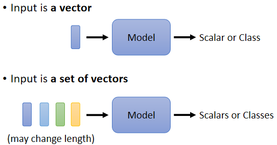

但假设我们遇到更復杂的问题呢,假设我们说**输入是多个向量**,而且这个**输入的向量的数目是会改变的**呢

我们刚才在讲影像辨识的时候,我还特别强调我们假设输入的**影像大小都是一样**的,那现在假设每次我们Model输入的Sequence的数目,Sequence的长度都不一样呢,那这个时候应该要怎麼处理？

## Vector Set as Input 

### 文字处理

假设我们今天要Network的输入是一个句子,每一个句子的长度都不一样,每个句子裡面词汇的数目都不一样

如果我们把一个**句子裡面的每一个词汇,都描述成一个向量**,那我们的Model的**输入**,就会**是一个Vector Set**,而且这个Vector Set的大小,每次都不一样,句子的长度不一样,那你的Vector Set的大小就不一样

那**怎麼把一个词汇表示成一个向量**,最简单的做法是==One-Hot的Encoding==

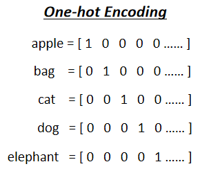

你就开一个很长很长的向量,这个向量的长度跟世界上存在的词汇的数目是一样多的,每一个维度对应到一个词汇,Apple就是100,Bag就是010,Cat就是001,以此类推

但是这样子的表示方法有一个非常严重的问题,它假设所有的**词汇彼此之间都是没有关係**的,从这个向量裡面你看不到：Cat跟Dog都是动物所以他们比较接近,Cat跟Apple一个动物一个植物,所以他们比较不相像。这个向量裡面,没有任何语义的资讯

有另外一个方法叫做==Word Embedding==

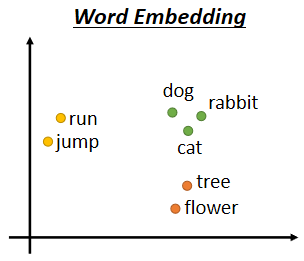

Word Embedding就是,我们会给每一个词汇一个向量,而这个**向量是有语义的资讯的**

如果你把Word Embedding画出来的话,你会发现,所有的动物可能聚集成一团,所有的植物可能聚集成一团,所有的动词可能聚集成一团等等

Word Embedding，如果你有兴趣的话,可以看一下以下的录影https://youtu.be/X7PH3NuYW0Q,总之你现在在网路上,可以载到一种东西叫做Word Embedding,这个Word Embedding,会给每一个词汇一个向量,而**一个句子就是一排长度不一的向量**

### 声音信号

一段声音讯号其实是一排向量,怎麼说呢,我们会把一段声音讯号取一个范围,这个范围叫做一个==Window==

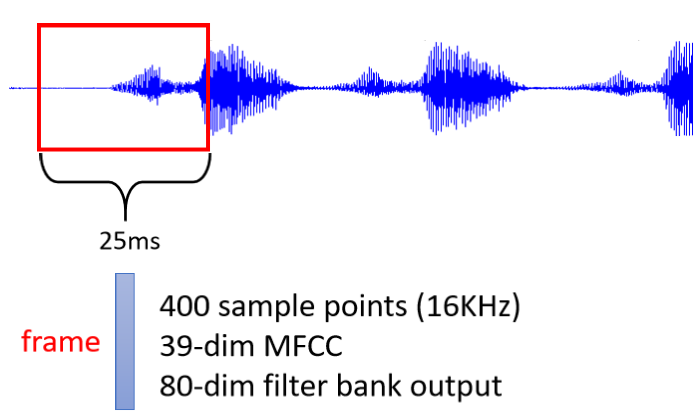

把这个Window裡面的资讯描述成一个向量,这个向量就叫做一个==Frame==,在语音上,我们会把**一个向量叫做一个Frame**,通常这个Window的长度就是25个Millisecond

把这麼一个小段的声音讯号变成一个Frame,变成一个向量就有百百种做法,那这边就不细讲

一小段25个Millisecond裡面的语音讯号,為了要描述一整段的声音讯号,你会把这个**Window往右移一点**,通常移动的大小是10个Millisecond

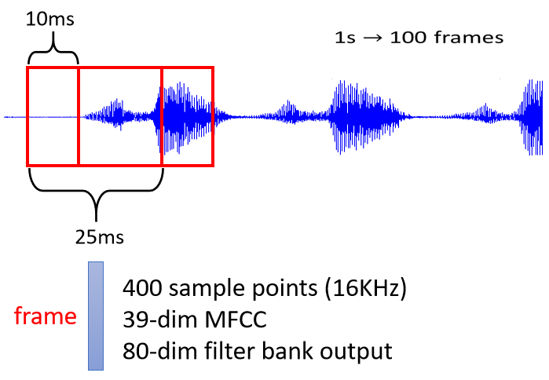

一段声音讯号,你就是用一串向量来表示,而因為每一个Window啊,他们往右移都是移动10个Millisecond,所以一秒鐘的声音讯号有100个向量,所以一分鐘的声音讯号,就有这个100乘以60,就有6000个向量

所以语音其实很复杂的,一小段的声音讯号,它裡面包含的资讯量其实是非常可观的

### 图

一个Graph 一个图,也是一堆向量,我们知道说Social Network就是一个Graph

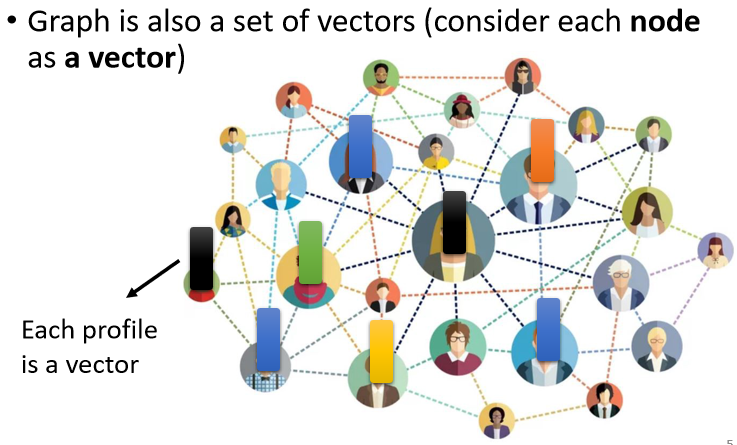

在Social Network上面**每一个节点就是一个人**,然后**节点跟节点之间的edge就是他们两个的关系连接**,比如说是不是朋友等等

而**每一个节点可以看作是一个向量**,你可以拿每一个人的,比如说他的Profile裡面的资讯啊,他的性别啊 他的年龄啊,他的工作啊 他讲过的话啊等等,把这些资讯用一个向量来表示

所以一个Social Network 一个Graph,你也可以看做是一堆的向量所组成的

### 分子信息

一个分子,它也可以看作是一个Graph

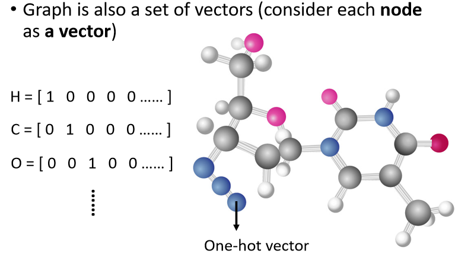

现在Drug Discovery的应用非常地受到重视,尤其是在Covid-19这一段时间,很多人都期待,也许用机器学习,可以在Drug Discovery上面做到什麼突破,那这个时候,你就需要把一个分子,当做是你的模型的输入

**一个分子可以看作是一个Graph**,分子上面的每一个球,也就是**每一个原子，可以表述成一个向量**

一个**原子可以用One-Hot Vector**来表示,氢就是1000,碳就是0100,然后这个氧就是0010,所以一个分子就是一个Graph,它就是一堆向量。

## What is the output?

我们刚才已经看说输入是一堆向量,它可以是文字,可以是语音,可以是Graph,那这个时候,我们有可能有什麼样的输出呢,有三种可能性

### 1. 每一个向量都有一个对应的Label

当你的模型,看到输入是四个向量的时候,它就要输出四个Label,而每一个Label,它可能是一个数值,那就是Regression的问题,如果每个Label是一个Class,那就是一个Classification的问题

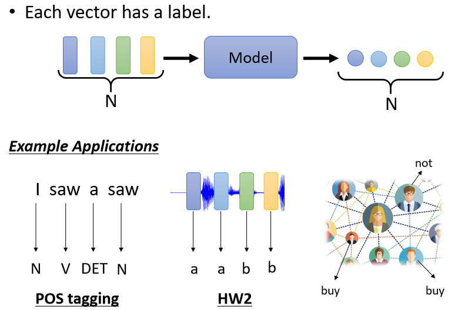

- 举例来说 在文字处理上,假设你今天要做的是==POS Tagging==,POS Tagging就是词性标註,你要让机器自动决定每一个词汇 它是什麼样的词性,它是名词 还是动词 还是形容词等等

    这个任务啊,其实并没有很容易,举例来说,你现在看到一个句子,I saw a saw

    这并不是打错,并不是“我看一个看”,而是“我看到一个锯子”,这个第二个saw当名词用的时候,它是锯子，那所以机器要知道,第一个saw是个动词,第二个saw虽然它也是个saw,但它是名词,但是每一个输入的词汇,都要有一个对应的输出的词性

    这个任务就是,输入跟输出的长度是一样的Case,这个就是属於第一个类型的输出

- 那如果是语音的话,你可以想想看我们作业二就是这样子的任务

    虽然我们作业二,没有给大家一个完整的Sequence,我们是把每一个每一个每一个Vector分开给大家了,但是串起来就是一段声音讯号裡面,有一串Vector,每一个Vector你都要决定,它是哪一个Phonetic，这是一个语音辨识的简化版

- 或者是如果是Social Network的话,就是给一个Graph

    你的Model要决定每一个节点,它有什麼样的特性,比如说他会不会买某一个商品,这样我们才知道说,要不要推荐某一个商品给他,

    所以以上就是举输入跟输出 数目一样的例子

### 2. 一整个Sequence,只需要输出一个Label

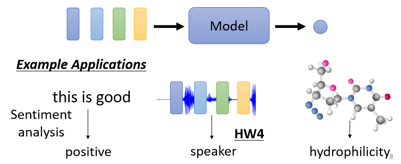

- 举例来说,如果是文字的话,我们就说Sentiment Analysis

    Sentiment Analysis就是给机器看一段话,它要**决定说这段话是正面的还是负面的**

    那你可以想像说这种应用很有用,假设你的公司开发了一个產品,这个產品上线了,你想要知道网友的评价怎麼样,但是你又不可能一则一则网友的留言都去分析,那也许你就可以用这种,Sentiment Analysis的技术,让机器自动去判读说,当一则贴文裡面有提到某个產品的时候,它是正面的 还是负面的,那你就可以知道你的產品,在网友心中的评价怎麼样,这个是Sentiment Analysis给一整个句子,只需要一个Label,那Positive或Negative,那这个就是第二类的输出

- 那如果是语音的例子的话呢,在作业四裡面我们会做语者辨认,机器要听一段声音,然后决定他是谁讲的

- 或者是如果是Graph的话呢,今天你可能想要给一个分子,然后要预测说这个分子,比如说它有没有毒性,或者是它的亲水性如何,那这就是给一个Graph 输出一个Label

### 3. 机器要自己决定,应该要输出多少个Label

我们不知道应该输出多少个Label,机器要自己决定,应该要输出多少个Label,可能你输入是N个向量,输出可能是N'个Label,為什麼是N',机器自己决定

这种任务又叫做==sequence to sequence==的任务,那我们在作业五会有sequence to sequence的作业,所以这个之后我们还会再讲

- 翻译就是sequence to sequence的任务,因為输入输出是不同的语言,它们的词汇的数目本来就不会一样多
- 或者是语音辨识也是,真正的语音辨识也是一个sequence to sequence的任务,输入一句话,然后输出一段文字,这也是一个sequence to sequence的任务

第二种类型有作业四,感兴趣可以去看看作业四的程式，那因為上课时间有限,所以上课,我们今天就先只讲第一个类型,也就是输入跟输出数目一样多的状况

## Sequence Labeling

那这种输入跟输出数目一样多的状况又叫做==Sequence Labeling==,你要给Sequence裡面的每一个向量,都给它一个Label,那要怎麼解Sequence Labeling的问题呢

那直觉的想法就是我们就拿个**Fully-Connected的Network**

然后虽然这个输入是一个Sequence,但我们就各个击破,不要管它是不是一个Sequence,把每一个向量,分别输入到Fully-Connected的Network裡面

然后Fully-Connected的Network就会给我们输出,那现在看看,你要做的是Regression还是Classification,產生正确的对应的输出,就结束了,

那这麼做显然有**非常大的瑕疵**,假设今天是,词性标记的问题,你给机器一个句子,I saw a saw,对Fully-Connected Network来说,**后面这一个saw跟前面这个saw完全一模一样**,它们是同一个词汇啊

既然Fully-Connected的Network**输入同一个词汇,它没有理由输出不同的东西**

但实际上,你期待第一个saw要输出动词,第二个saw要输出名词,但对Network来说它不可能做到,因為这两个saw 明明是一模一样的,你叫它一个要输出动词,一个要输出名词,它会非常地困惑,完全不知道要怎麼处理

所以怎麼办,有没有可能**让Fully-Connected的Network,考虑更多的,比如说上下文的Context的资讯**呢

这是有可能的,你就**把前后几个向量都串起来,一起丢到Fully-Connected的Network就结束了**

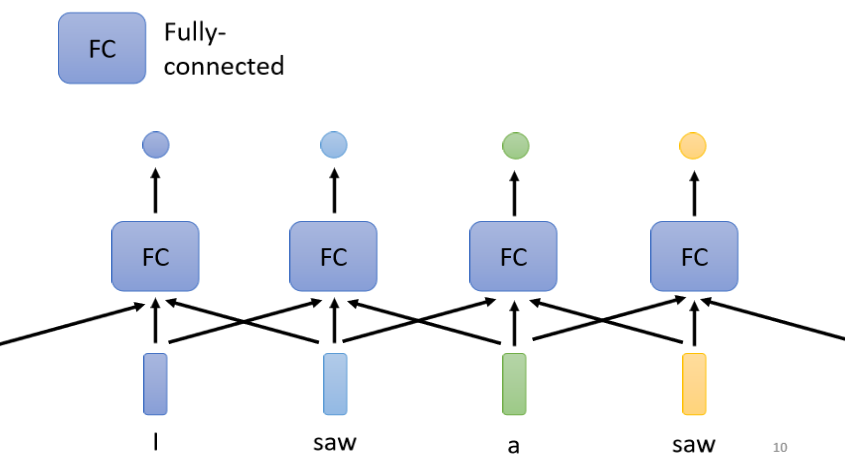

在作业二裡面,我们不是只看一个Frame,去判断这个Frame属於哪一个Phonetic,也就属於哪一个音标,而是看这个Frame的前面五个加后面五个,也就总共看十一个Frame,来决定它是哪一个音标

所以我们可以给Fully-Connected的Network,一整个Window的资讯,让它可以考虑一些上下文的,跟我现在要考虑的这个向量,相邻的其他向量的资讯

但是**这样子的方法还是有极限**,作业二就算是给你Sequence的资讯,你考虑整个Sequence,你可能也很难再做的更好啦,作业二考虑前后五个Frame,其实就可以得到很不错的结果了,所以你要过Strong Baseline,重点并不在於考虑整个Sequence,你就不需要往那个方向想了,用助教现有给你的Data,你就可以轻易的过Strong Baseline,

但是真正的问题,但是如果今天我们有某一个任务,不是考虑一个Window就可以解决的,而是要**考虑一整个Sequence才能够解决**的话,那要怎麼办呢

那有人可能会想说这个很容易，我就**把Window开大一点啊,大到可以把整个Sequence盖住就结束了**

但是，今天**Sequence的长度是有长有短的**,我们刚才有说,我们输入给我们的Model的Sequence的长度,每次可能都不一样

如果你今天说我真的要开一个Window,把整个Sequence盖住,那你可能要**统计一下你的训练资料**,然后看看你的训练资料裡面,最长的Sequence有多长,然后开一个Window比最长的Sequence还要长,你才有可能把整个Sequence盖住

但是你开一个这麼大的Window,意味著说你的Fully-Connected的Network,它需要非常多的参数,那可能不只**运算量很大,可能还容易Overfitting**

所以有没有更好的方法,来考虑整个Input Sequence的资讯呢,这就要用到我们接下来要跟大家介绍的,==Self-Attention==这个技术

## Self-Attention

Self-Attention的运作方式就是,**Self-Attention会吃一整个Sequence的资讯**

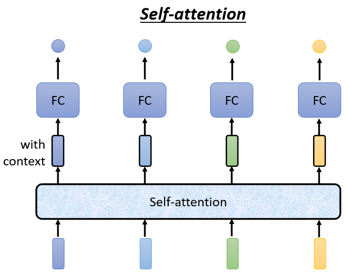

然后你Input几个Vector,它就输出几个Vector,比如说你这边Input一个深蓝色的Vector,这边就给你一个另外一个Vector

这边给个浅蓝色,它就给你另外一个Vector,这边输入4个Vector,它就Output 4个Vector

那这4个Vector有什麼特别的地方呢,**这4个Vector,他们都是考虑一整个Sequence以后才得到的**,那等一下我会讲说Self-Attention,怎麼考虑一整个Sequence的资讯

所以这边每一个向量,我们特别给它一个黑色的框框代表说它不是一个普通的向量

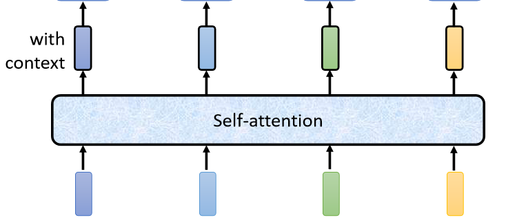

如此一来你这个Fully-Connected的Network,它就不是只考虑一个非常小的范围,或一个小的Window,而是考虑整个Sequence的资讯,再来决定现在应该要输出什麼样的结果，这个就是Self-Attention。

**Self-Attention不是只能用一次,你可以叠加很多次**

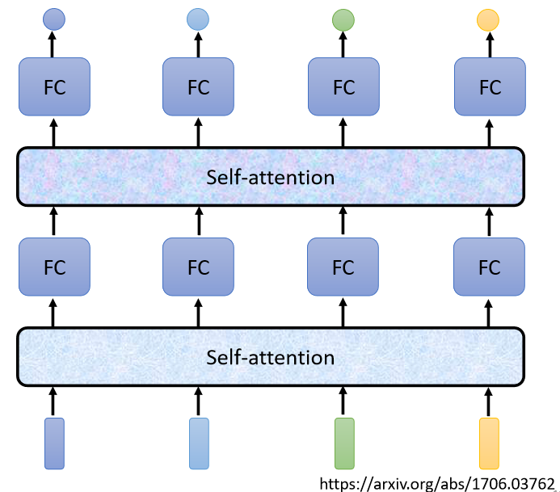

可以Self-Attention的输出,通过Fully-Connected Network以后,再做一次Self-Attention,Fully-Connected的Network,再过一次Self-Attention,再重新考虑一次整个Input Sequence的资讯,再丢到另外一个Fully-Connected的Network,最后再得到最终的结果

所以**可以把Fully-Connected的Network,跟Self-Attention交替使用**

- Self-Attention处理整个Sequence的资讯
- Fully-Connected的Network,专注於处理某一个位置的资讯
- 再用Self-Attention,再把整个Sequence资讯再处理一次
- 然后交替使用Self-Attention跟Fully-Connected

有关Self-Attention,最知名的相关的文章,就是《Attention is all you need》.那在这篇Paper裡面呢,Google提出了==Transformer==这样的Network架构,那Transformer就是变形金刚,所以提到这个Network的时候呢,我们就会有变形金刚这个形象

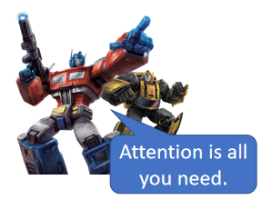

Transformer我们今天还不会讲到,但我们之后会讲到,Transformer裡面一个最重要的Module就是Self-Attention,它就是变形金刚的火种源

那这篇Paper最厉害的地方,就是它有一个**霸气的名字Attention is all you need.**

那其实像Self-Attention这样的架构,最早我并不会说它是出现在《Attention is all you need》这样的Paper,因為其实很多更早的Paper,就有提出过类似的架构,只是不见得叫做Self-Attention,比如说叫做Self-Matching,或者是叫别的名字,不过呢是Attention is all you need.这篇Paper,把Self-Attention这个Module,把它发扬光大

那Self-Attention是怎麼运作的呢

### Self-Attention过程

Self-Attention的Input,它就是一串的Vector,那**这个Vector可能是你整个Network的Input,它也可能是某个Hidden Layer的Output**,所以我们这边不是用$x$来表示它,

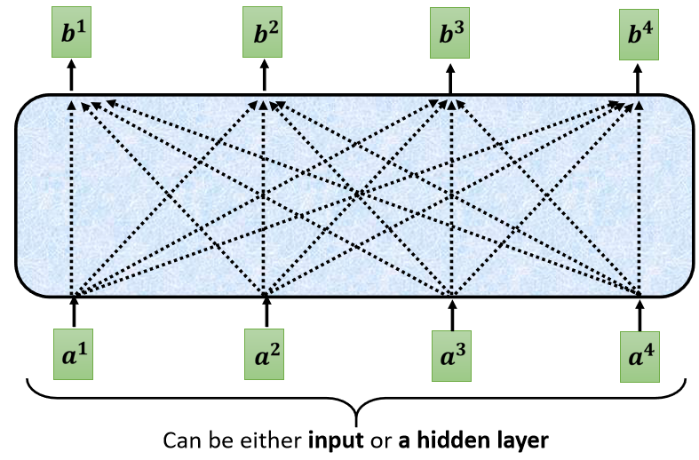

我们用$a$来表示它，代表它有可能是前面已经做过一些处理,它是某个Hidden Layer的Output,那Input一排a这个向量以后,Self-Attention要Output另外一排b这个向量

那这**每一个b都是考虑了所有的a以后才生成出来的**,所以这边刻意画了非常非常多的箭头,告诉你$b^1 $考虑了$a^1$到$a^4$產生的,$b^2$考虑$a^1$到$a^4$產生的,$b^3 b^4$也是一样,考虑整个input的sequence,才產生出来的

那接下来呢就是要跟大家说明,**怎麼產生$b^1$这个向量**,那你知道怎麼產生$b^1$这个向量以后,你就知道怎麼產生剩下$b^1 b^2 b^3 b^4$剩下的向量

这里有一个**特别的机制**,**这个机制是根据$a^1$这个向量,找出整个很长的sequence裡面,到底哪些部分是重要的,哪些部分跟判断$a^1$是哪一个label是有关係的,哪些部分是我们要决定$a^1$的class,决定$a^1$的regression数值的时候,所需要用到的资讯**

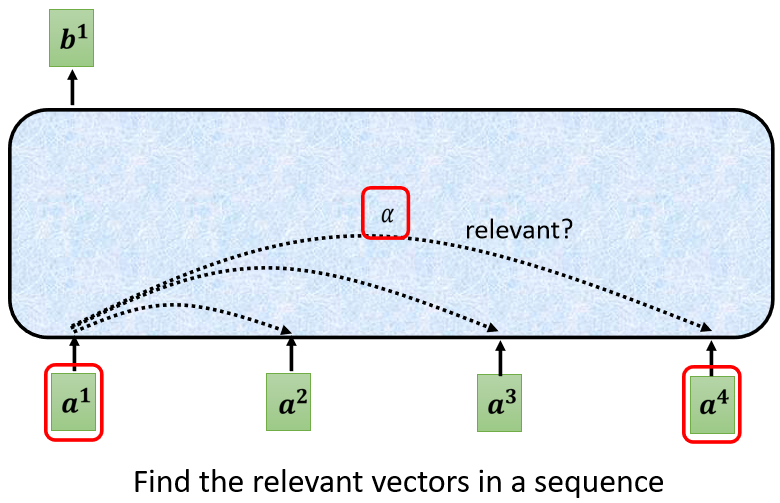

**每一个向量跟$a^1$的关联的程度,用一个数值叫α来表示**

这个self-attention的module,**怎麼自动决定两个向量之间的关联性**呢,你给它两个向量$a^1$跟$a^4$,它怎麼决定$a^1$跟$a^4$有多相关,然后给它一个数值α呢,那这边呢你就需要一个**计算attention的模组**

这个计算attention的模组,就是拿**两个向量作為输入**,然后它就直接输出α那个数值,

计算这个α的数值有各种不同的做法

- 比较常见的做法呢,叫做用==dot product==,**输入的这两个向量分别乘上两个不同的矩阵**,左边这个向量乘上$W^q$这个矩阵得到矩阵$q$,右边这个向量乘上$W^k$这个矩阵得到矩阵$k$

    再把$q$跟$k$做dot product,就是把他们做element-wise 的相乘,再全部加起来以后就得到一个 scalar,这个scalar就是α,这是一种计算α的方式

- 有另外一个叫做==Additive==的计算方式,它的计算方法就是,把同样这两个向量通过$W^q$ $W^k$,得到$q$跟$k$,那我们不是把它做Dot-Product,是把它这个串起来,然后丢到这个过一个Activation Function

    然后再通过一个Transform,然后得到α

总之有非常多不同的方法,可以计算Attention,可以计算这个α的数值,可以计算这个关联的程度

但是在接下来的讨论裡面,我们都**只用左边这个方法**,这也是今日最常用的方法,也**是用在Transformer裡面的方法**

那你就要把这边的$a^1$去跟这边的$a^2 a^3 a^4$,分别都去计算他们之间的关联性,也就是计算他们之间的α

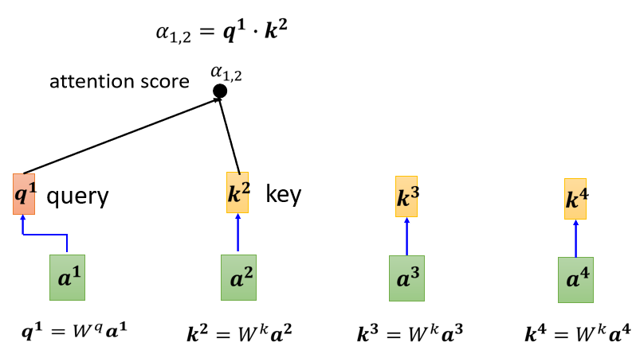

你把$a^1$乘上$W^q $得到$q^1$,那这个q有一个名字,我们叫做==Query==,它就像是你搜寻引擎的时候,去搜寻相关文章的问题,就像搜寻相关文章的关键字,所以这边叫做Query

然后接下来呢,$a^2 a^3 a^4$你都要去把它乘上$W^k$,得到$k$这个Vector,$k$这个Vector叫做==Key==,那你把这个**Query q1,跟这个Key k2,算Inner-Product就得到α**

我们这边用$α_{1,2}$来代表说,Query是1提供的,Key是2提供的时候,这个1跟2他们之间的关联性,这个α这个关联性叫做==Attention的Score==,叫做Attention的分数,

接下来也要跟$a^3 a^4$来计算

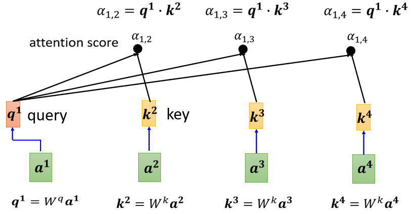

把$a_3$乘上$W^k$,得到另外一个Key也就是$k^3$,$a^4$乘上$W^k$得到$k^4$,然后你再把$k^3$这个Key,跟$q^1$这个Query做Inner-Product,得到1跟3之间的关联性,得到1跟3的Attention,你把$k^4$跟$q^1$做Dot-Product,得到$α_{1,4}$,得到1跟4之间的关联性

其实一般在实作时候,**$q^1$也会跟自己算关联性**,自己跟自己计算关联性这件事情有多重要,你可以自己在做作业的时候试试看,看这件事情的影响大不大了

计算出,a1跟每一个向量的关联性以后,接下来这边会**接入一个Soft-Max**

**这个Soft-Max跟分类的时候的那个Soft-Max是一模一样的**,所以Soft-Max的输出就是一排α,所以本来有一排α,通过Soft-Max就得到$α'$

这边你**不一定要用Soft-Max,用别的替代也没问题**,比如说有人尝试过说做个ReLU,这边通通做个ReLU,那结果发现还比Soft-Max好一点,所以这边你不一定要用Soft-Max,这边你要用什麼Activation Function都行,你高兴就好,你可以试试看,那Soft-Max是最常见的,那你可以自己试试看,看能不能试出比Soft-Max更好的结果

接下来得到这个$α'$以后,我们就要根据这个$α'$去抽取出这个Sequence裡面重要的资讯,根据这个α我们已经知道说,哪些向量跟$a^1$是最有关係的,怎麼抽取重要的资讯呢,

- 首先把$a^1$到$a^4$这边每一个向量,乘上$W^v $得到新的向量,这边分别就是用$v^1 v^2 v^3 v^4$来表示

- 接下来把这边的$v^1$到$v^4$,每一个向量都去乘上Attention的分数,都去乘上$α'$

- 然后再把它加起来,得到$b^1$

$$
b^1=\sum_i\alpha'_{1,i}v^i
$$

如果某一个向量它得到的分数越高,比如说如果$a^1$跟$a^2$的关联性很强,这个$α'$得到的值很大,那我们今天在做Weighted Sum以后,得到的$b^1$的值,就可能会比较接近$v^2$

所以**谁的那个Attention的分数最大,谁的那个$v$就会Dominant你抽出来的结果**

所以这边呢我们就讲了怎麼从一整个Sequence 得到$b^1$