# GAN_P2_Theory behind GAN

P1是用了一堆比喻说明GAN 的操作是怎麼进行的

接下来,我们告诉你说实际上,為什麼这个 **Generator 跟 Discriminator 的互动**,可以让我们的 **Generator產生像是真正的人脸的图片**,那这背后的互动在做的,到底是什麼样的事情

那我们先来弄清楚,我们今天的**训练的目标**到底是什麼

我们在训练 Network 的时候,你就是要

- 定一个 Loss Function
- 定完以后用 Gradient Descent 去调你的参数
- 去 **Minimize** 那个 Loss Function 就结束了

在这个 Generation 的问题裡面,我们要 **Minimize,或者是 Maximize 什麼样的东西**,我们要把这些事弄清楚,才能够做接下来的事情

我们想要 **Minimize** 的东西是这个样子的，我们有一个 Generator

- 给它一大堆的 Vector,给它从 Normal Distribution Sample 出来的东西
- 丢进这个 Generator 以后,会產生一个比较复杂的 Distribution,这个复杂 Distribution,我们叫它 ==PG==
- 然后 我们有一堆的 Data,这个是真正的 Data,真正的 Data 也形成了另外一个 Distribution,叫做 ==Pdata==,我们期待 **PG 跟 Pdata 越接近越好**

## Our objective

如果你一下子没有办法想像,这个 PG 、Pdata 是怎麼一回事的话,那我们用**一维的状况**来跟大家说明

我们假设 

- Generator 的 Input 是一个一维的向量
- Generator 的 Output 也是一维的向量
- 我们真正的 Data 也是一维的向量

那我们的 Normal Distribution 就长这个样子

那丢到 Generator 以后,假设你输入 5 个点,那边这每一个点,它的位置会改变,那你就產生一个新的 Distribution,那可能本来大家都集中在中间,通过这个 Generator,通过一个 Network 裡面很复杂,不知道做了什麼事情以后,这些点就分成两边,所以你的 Distribution 就变成这个样子

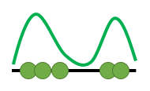

而 **Pdata** 是指真正的资料的分布,真正资料分布可能长这个样子

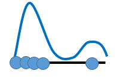

它分两面的状况是更极端的,左边的东西比较多,右边的东西比较少,那你期待左边这个分布跟右边这个分布,越接近越好,如果写成式子的话

你可以写成这个样子

Div Of PG 跟 Pdata,它指的意思就是 PG 跟 Pdata,这两个 Distribution 之间的 ==Divergence==(散度)

Divergence 这边指的意思就是,这两个你可以想成是,这**两个 Distribution 之间的某种距离**

- 如果这个 **Divergence 越大**,就代表这**两个 Distribution 越不像**
- **Divergence 越小**,就代表这两个 **Distribution 越相近**

Divergence 这就是衡量,两个的 Distribution 相似度的一个 Measure

我们现在的目标,是要去**找一个 Generator**,找一个 Generator找个操作,实际上做的事情是找一个 **Generator 裡面的参数**, Generator 也是一个 Network,裡面有一大堆的 Weight 跟 Bias,它可以让我们產生出来的 PG 跟 Pdata,之间的 Divergence 越小越好,我要找的就是这样子的 Generator

这边把它写作 $G^*$,所以我们这边要做的事情,**跟一般 Train Network 其实非常地像**,我们第一堂课就告诉你说,我们定义了 Loss Function,找一组参数 Minimize Loss Function

在 Generation 这个问题裡面,我们现在其实也定义了我们的 **Loss Function**,它就是 PG 跟 Pdata 的 **Divergence**,就是它们两个之间的距离,**它们两个越近,那就代表这个產生出来的 PG 跟 Pdata 越像**,所以 PG 跟 Pdata,我们希望它们越相像越好

但是我们这边遇到一个**困难的问题**

这个 Loss,我们是可以算的,但是这个 Divergence 是要怎麼样算？那你可能知道一些 Divergence 的式子,比如说 KL Divergence,比如说 JS Divergence,这些 Divergence 用在这种 Continues 的,Distribution 上面,你要做一个很复杂的,在实作上你**几乎不知道要怎麼算的积分,那我们根本就无法把这个 Divergence 算出来**

我们算不出这个 Divergence,我们又要如何去找一个 G,去 Minimize 这个 Divergence ,这个就是 GAN 所遇到的问题,这就是我们在 Train 这一种,Generator 的时候会遇到的问题

而 **==GAN==是一个很神奇的做法,它==可以突破,我们不知道怎麼计算 Divergence 的限制==**

## Sampling is good enough ……

所以我现在**遇到的问题**就是,**不知道怎麼计算 Divergence**,而 GAN 告诉我们就是,你**不需要知道 PG 跟 Pdata它们实际上的 Formulation 长什麼样子**，只要能**从 PG 和 Pdata这两个 Distributions Sample 东西出来,就有办法算 Divergence**

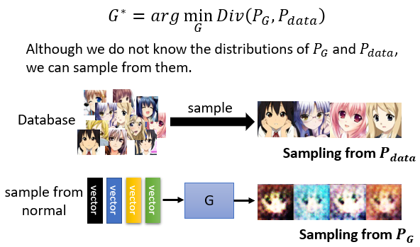

怎麼从真正的 Data 裡面,Sample 出东西来，怎麼从 Generator 裡面,產生一些东西出来？

- 把你的图库拿出来,从图库裡面随机產生,随机 Sample 一些图片出来,你就得到 **Pdata**

- 那你就把你的 Generator,输入这个 Normal 的,从 ==Normal Distribution== Sample 出来的 Vector,丢到 Generator 裡面（我们刚才说过,你这边的拿来 Sample 那个 Distribution,要是你有办法 Sample 的,所以我们选 Normal Distribution式子我们是知道的,是有办法 Sample 的) 我们从 Normal Distribution 裡面,Sample 一堆 Vector 出来丢给 Generator,让 Generator 產生一堆图片出来,那这些图片就是从 **PG**  Sample 出来的结果

所以我们有办法从 PG 做 Sample,我们有办法从 Pdata 做 Sample

## Discriminator

接下来,GAN 这一整个系列的 Work,就是要告诉你说,怎麼在**只有做 Sample 的前提之下**,我根本**不知道 PG 跟 Pdata,实际上完整的 Formulation 长什麼样子**,居然就估测出了 Divergence

那这个就是要**靠 ==Discriminator== 的力量**

那我们刚才讲过说 Discriminator是怎麼训练出来的

- 我们有一大堆的 Real Data,这个 Real Data 就是从 Pdata Sample 出来的结果
- 我们有一大堆 Generative 的 Data,Generative 的 Data,就可以看作是从 PG Sample 出来的结果

根据 Real 的 Data 跟 Generative 的 Data,我会去训练一个 Discriminator,它的训练的目标是

- 看到 **Real Data**,就给它比较**高的分数**
- 看到这个 **Generative 的 Data**,就给它比较**低的分数**

Discriminator 训练的目标,就是要**分辨好的图跟不好的图**,分辨真的图跟生成的图,所以**看到真的图**给它**高分**,**看到生成的图**给它**低分**

实际以上的过程,你也可以把它写成式子,把它当做是一个 **Optimization 的问题**,这个 Optimization 的问题是这样子的

这个 Discriminator 可以去 **Maximize**某一个 Function,我们这边叫做 ==Objective Function==（我们要 **Maximize** 的东西,我们会叫 **Objective Function**,如果 **Minimize** 我们就叫它 **Loss Function**）

我们现在要**找一个 D**,它可以 Maximize 这个 Objective Function,这个 Objective Function 长这个样子

- $E_{y\sim P_{data}}[logD(y)]$ 我们有一堆 Y,它是从 Pdata 裡面 Sample 出来的,也就是它们是真正的 Image,而我们把这个真正的 Image 丢到 D 裡面,得到一个分数再取$logD(y)$

- $E_{y\sim P_G}[log(1-D(y))]$ 那另外一方面,我们有一堆 Y,它是从 PG 从 Generato r 所產生出来的,把这些图片也丢到 Discriminator 裡面,得到一个分数,再取 $log(1 - D (y))$

    

我们希望这个 **Objective Function V越大越好**

- 意味著我们希望这边的 D (Y) 越大越好,我们希望 Y 如果是从 **Pdata Sample 出来的**,它就要**越大越好**
- 我们希望说如果 Y 是从,这个 **PG Sample 出来的**,它就要**越小越好**

让 D (Y) 越大越好,也就是让Discriminator Output 的值越小越好

你可能觉得没事突然写出这个式子有点奇怪,但你**不一定要把这个 Objective Function,写成这个样子**,它完全可以有其他的写法,那最早年之所以写成这个样子,是有一个很明确的理由,是為了要把 **Discriminator跟 Binary Classification**,跟二元的分类**扯上关係**

事实上这个 Objective Function,它就是 **Cross Entropy 乘一个负号**,我们知道我们在训练一个 Classifier 的时候,我们就是要 Minimize Cross Entropy,所以当我们**Maximize Cross Entropy 乘一个负号**的时候,其实等同於 **Minimize Cross Entropy**,也就是等同於是在**训练一个 Classifier**

那这个 Discriminator,其实可以当做是一个 Classifier,它做的事情就是把蓝色这些点,从 Pdata Sample 出来的真实的 Image,当作 Class 1,把从 PG Sample出来的这些假的 Image,当作 Class 2

有两个 Class 的 Data,训练一个 Binary 的 Classifier,训练完就等同於是,解了这一个 Optimization 的问题

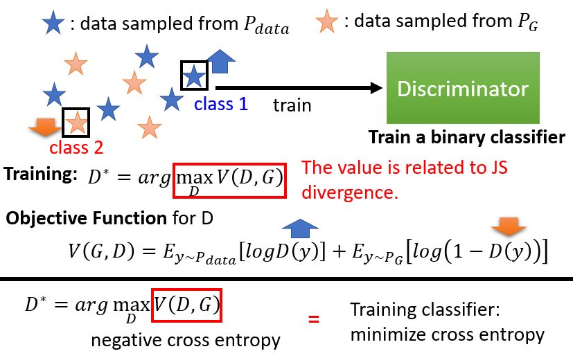

那这边最神奇的地方是这一个式子,这个**红框框裡面的数值,它跟 JS Divergence 有关**

那事实上有趣的事情是,我觉得最原始的 GAN 的 Paper,它的发想可能真的是从 Binary Classifier 来的,一开始是把 Discriminator,写成 Binary 的 Classifier,然后有了这样的 Objective Function,然后再经过一番推导以后,这个 Objective Function,它的 Maximum,就是你找到一个 D,可以让这个 Objective Function,它的值最大的时候,这个最大的值跟 JS Divergence 是有关的。它们没有完全一模一样,所以显然一开始,并不是针对 JS Divergence 设计的,而是经过一番推导以后,发现它们是非常有关联的,那至於实际上的推导过程,你可以参见原始 Ian J. Goodfellow 写的文章,那其实裡面的推导过程,我觉得写得算是蛮清楚的

所以真正神奇的地方就是,这一个 **Objective Function 的最大值,它跟 Divergence 是有关的**,所以我们刚才说,我们不知道怎麼算 Divergence没关係,Train 你的 Discriminator,Train 完以后,看看它的 Objective Function 可以到多大,那个值就跟 Divergence 有关

这边我们并没有把证明拿出来跟大家讲了,但是我们还是可以从**直观上**来理解一下,為什麼这个 **Objective Function 的值,会跟 Divergence 有关**

你可以想想看,假设 PG 跟 Pdata,它的 **Divergence 很小**

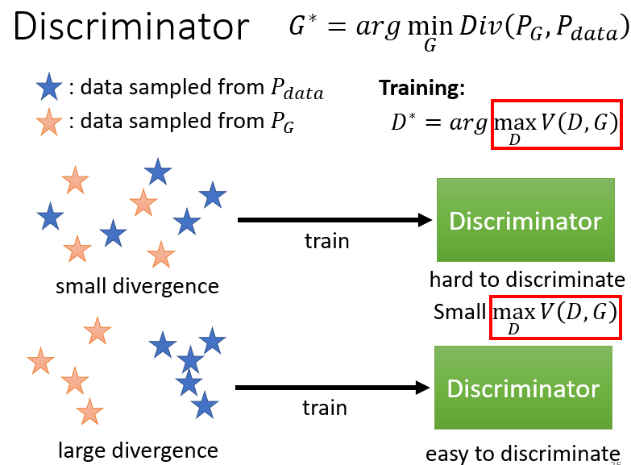

- 也就 **PG 跟 Pdata 很像**,它们差距没有很大,它们很像 PG 跟 Pdata Sample 出来的,蓝色的星星跟红色的星星,它们是**混在一起的**

    这个时候Discriminator 就是在 Train 一个,Binary 的 Classifier,对 Discriminator 来说,既然这两堆资料是混在一起的,那就**很难分开**,这个问题很难,所以你在解这个 Optimization Problem 的时候,你就没有办法让这个 Objective 的值非常地大

    所以这个 Objective 这个 V 的,Maximum 的值就比较小,所以小的 Divergence,对应到小的这个 Objective Function 的Maximum 的值

    所以不是 Objective Function 的值本身,是 Objective Function 在穷举地找 Discriminator 要可以得到的最大的值,

- 如果今天,你的**两组 Data 很不像**,它们的 Divergence 很大,那对 Discriminator 而言,就可以轻易地把它分开

    当 Discriminator 可以轻易把它分开的时候,这个 Objective Function 就可以冲得很大,那所以当你有大的 Divergence 的时候,这个 Objective Function 的 Maximum 的值,就可以很大

详细的证明请参见 GAN 原始的 Paper,裡面在做了一些假设,比如说 Discriminator 的 Capacity 是无穷大,等等的假设以后,可以做出这个 Maximum 的值,跟 JS Divergence 一些相关的这个推导

所以我们说我们本来的目标是要找一个 Generator,去 Minimize PG 跟 Pdata 的 Divergence

但我们卡在**不知道怎麼计算 Divergence**,那我们现在要知道,我们只要训练一个 Discriminator,训练完以后,这个 Objective Function 的最大值,就是这个 Divergence,就跟这个 Divergence 有关

那我们何不就把红框框裡面这一项,跟 Divergence 做替换,我们何不就把 Divergence,替换成红框框裡面这一项,所以我们就有了这样一个 Objective Function

这个 Objective Function 乍看之下有点复杂,它**有一个 Minimum**,**又有一个 Maximum**,所以你不小心就会脑筋转不过来

- 我们是要找一个 **Generator**,去 Minimize 红色框框裡面这件事
- 但是红框框裡面这件事,又是另外一个 Optimization Problem,它是在**给定 Generator** 的情况下,去找一个 Discriminator,这个 **Discriminator,可以让 V 这个 Objective Function 越大越好**

然后我们要找一个 G,让红框框裡面的值最小,这个 G 就是我们要的 Generator,而刚才我们讲的这个 Generator 跟 Discriminator,互动 互相欺骗这个过程,其实就是想解这一个有 Minimize,又有 Maximize 这个 Min Max,Min Max 的问题,就是透过下面这一个,我们刚才讲的 GAN 的 Argument 来解的

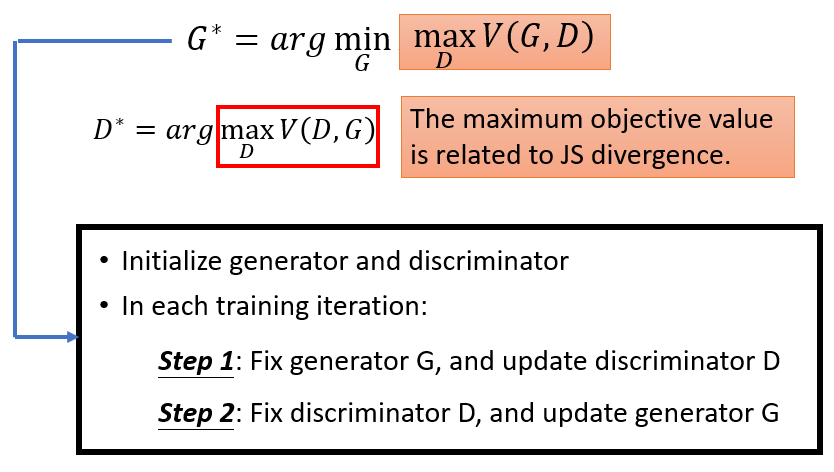

那至於实际上,為什麼下面这个 Argument 可以解这个问题,你也可以参见原始 GAN 的 Paper

那讲到这边,也许你就会问说,**為什麼是 JS Divergence,而且还不是真的 JS Divergence**,是跟 JS Divergence 相关而已,**怎麼不用真正的 JS Divergence,或不用别的,比如说 KL Divergence**

你完全可以这麼做,你只要改了那个 Objective Function,你就可以量各式各样的 Divergence,那至於怎麼样设计 Objective Function,得到不同的 Divergence,那有一篇叫做 F GAN 的 Paper 裡面,有非常详细的证明

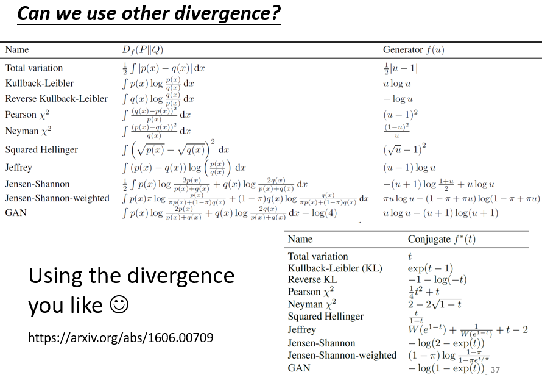

它有很多的 Table 告诉你说,不同的 Divergence,要怎麼设计它的 Objective Function,你设计什麼样的 Objective Function,去找它的 Maximum Value,就会变成什麼样的 Divergence,在这篇文章裡https://arxiv.org/abs/1606.00709面都有详细的记载,这一开始有人会觉得说,GAN 之所以没有很好 Train,也许是因為,就是我们没有在真的,这个 Minimize JS Divergence

但是有了这个 F GAN 这个 Paper以后,它就告诉你说,我们有办法 Minimize JS Divergence,但**就算你真的可以 Minimize JS Divergence,结果也还是没有很好**,GAN 还是没有很好 Train

所以俗话就说,No Pain No Gan 

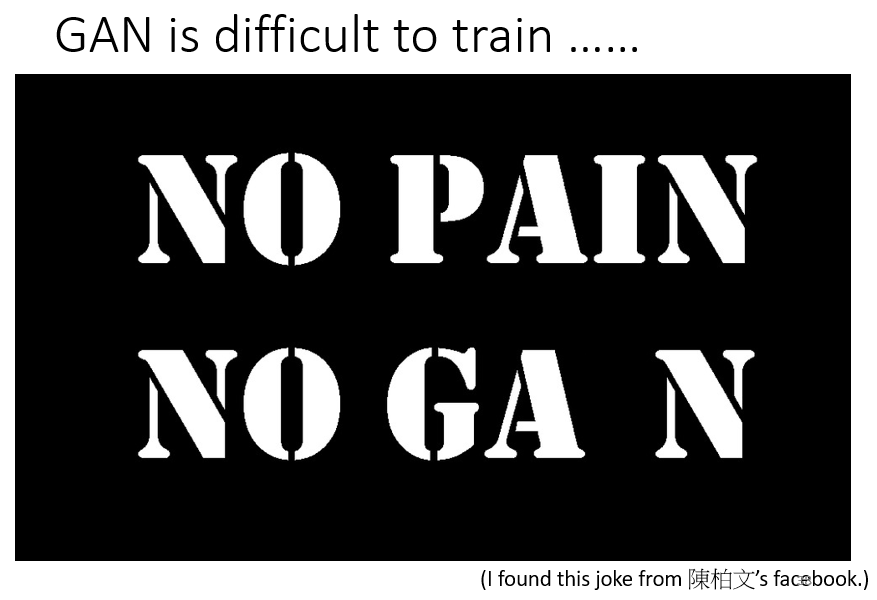

所以接下来我们就要讲一些,GAN 训练的小技巧

## Tips for GAN

其实它 GAN 训练的小技巧非常非常多,我们只挑一个最知名的来讲,这个最知名的就是很多人都听过,就是很多人都听过的 ==WGAN==

在讲 WGAN 之前,我们先讲 **JS Divergence 有什麼样的问题**，在最早的 GAN 说,我们要 Minimize 的是 JS Divergence,那选择 JS Divergence 的时候,会有什麼问题

### JS divergence is not suitable

在想 JS Divergence 的问题之前,我们先看一下 **PG 跟 Pdata 有什麼样的特性**

那 PG 跟 Pdata 有一个非常关键的特性是,**PG 跟 Pdata 它们重叠的部分往往非常少**

这边有两个理由

- 第一个理由是来自於 Data 本身的特性

    

    PG 跟 Pdata,它们都是要產生图片的,那图片其实是高维空间裡面的一个低维的 Manifold(**流形**（英语：Manifolds）是可以局部[欧几里得空间](https://zh.wikipedia.org/wiki/欧几里得空间)化的一个[拓扑空间](https://zh.wikipedia.org/wiki/拓扑空间)，是欧几里得空间中的曲线、曲面等概念的推广),怎麼知道图片是高维空间,裡面低维的 Manifold 

    我们可以想想看,你在高维空间裡面,随便 Sample 一个点,它通常都没有办法构成一个,二次元人物的头像,所以二次元人物的头像它的分布,在高维的空间中,其实是非常狭窄的,所以二次元头像的分布,这个图片的分布,其实是高维空间中的低维的 Manifold

    或者是如果是以二维空间来想的话,那图片的分布,可能就是**二维空间的一条线**,二维空间中多数的点都不是图片,就高维空间中随便 Sample 一个点,都不是图片,只有非常小的范围,Sample 出来它会是图片,所以从这个角度来看,从资料本身的特性来看,PG 跟 Pdata,它们都是 Low Dimensional 的 Manifold,用二维空间来讲,PG 跟 Pdata 都是二维空间中的两条直线,而二维空间中的两条直线,除非它刚好重合,不然**它们相交的范围,几乎是可以忽略的**,这是第一个理由,那也许有人说, 这个 也许图片根本就不是什麼Low Dimensional 的 Manifold,那会不会第一个理由就不成立了

- 第二个理由是,我们是从来都不知道 PG 跟 Pdata 长什麼样子,我们对 PG 跟 Pdata,它的分布的理解,其实来自於 Sample

    

    所以也许 PG 跟 Pdata,它们是有**非常大的 Overlap 的范围**,但是我们实际上,在了解这个 PG 跟 Pdata,在计算它们的 Divergence 的时候,我们是从  Pdata 裡面 Sample 一些点出来,从 PG 裡面 Sample 一些点出来

    如果你 **Sample 的点不够多,你 Sample 的点不够密**,那就算是这两个 Divergence 实际上,这两个 Distribution 实际上有重叠,但是假设你 Sample 的点不够多,对 Discriminator 来说,它也是没有重叠的

    就是这个蓝色的分布跟红色的分布,明明是有重叠的,但如果你从蓝色分布 Sample 一些点,红色分布 Sample 一些点,这些点你又 **Sample 得不够多**,你完全就可以画一条楚河汉界,把红色的点跟蓝色的点完全地分开来,然后说红色的点,它的分布就是在这个楚河汉界的右边,蓝色的点就在左边,它们完全是**没有任何冲突**

    所以以上给你两个理由,试图说服你说 PG 跟 Pdata 这两个分布,它们**重叠的范围是非常小的**

而几乎没有重叠这件事情,对於 JS Divergence 会造成什麼问题？

JS Divergence 有个特性,是**两个没有重叠的分布,JS Divergence 算出来,就永远都是 Log2**,不管这两个分布长什麼样,所以两个分布只要没有重叠,算出来就一定是 Log2

所以举例来说

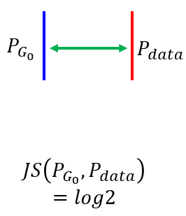

假设这是你的 Pdata,这是你的 PG,它们都,假设它们都是一条直线,然后中间有很长的距离,你算它们的 JS Divergence,是 Log2

假设你的 PG 跟 Pdata 其实蛮接近的

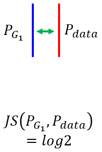

那中间的间隔其实是比较小的,算出来结果还是 Log2

除非你的 PG 跟 Pdata 有重合

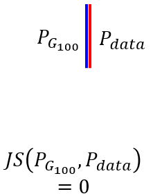

不然这个 PG 跟 Pdata 只要它们是两条直线,它们这两条直线没有相交,那算出来就是 Log2,算出来这个 Case,算出来是 Log2,这个 Case 算出来也是 Log2

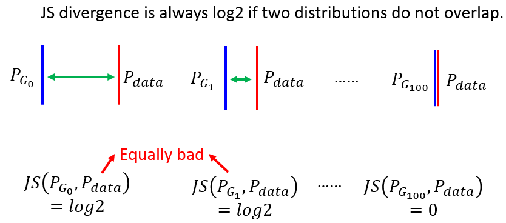

那但是明明中间这个 Case,中间这个 Generator就比左边这个 Generator 好,明明蓝色的线就跟红色的线比较近,但是从 JS Divergence 上面,看不出这样子的现象

那既然从 JS Divergence 上,看不出这样的现象,你在 Training 的时候,你根本就没有办法把这样子的 Generator,Update 参数变成这样子的 Generator,因為对你的 Loss 来说,对你的目标来说,这两个 Generator 是一样好,或者是一样糟

那以上是从比较理论的方向来说明,如果我们从更直观的实际操作的角度来说明,你会发现,当你是**用 JS Divergence** 的时候,你就假设你今天在 Train 一个,Binary 的 Classifier,去分辨 Real 的 Image,跟 Generated Image,你会发现**实际上你通常 Train 完以后,正确率几乎都是 100%**

因為你 **Sample 的图片根本就没几张**,对你的 Discriminator 来说,你 Sample 256 张 Real 的图片,256 张 Fake 的图片,它直接用硬背的,都可以把这两组图片分开,知道说谁是 Real 谁是 Fake,所以实际上,如果你有自己 Train 过 GAN 的话你会发现,如果你用 Binary 的 Classifier Train 下去,你会发现,你几乎每次 Train 完你的 Classifier 以后,也就你 Train 完你的 Discriminator 以后,正确率都是 100%

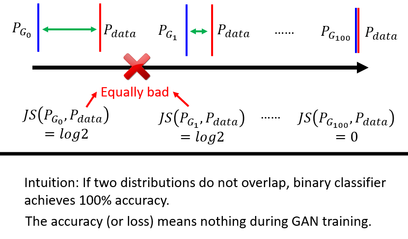

我们本来会期待说,这个 Discriminator 的 Loss,也许代表了某些事情,这个 Binary Classifier Loss,也许代表某些事情,这个 **Loss 越来越大,代表问题越来越难**,代表我们的 **Generated Data,跟 Real 的 Data 越来越接近**

但实际上,你在实际操作的时候你**根本观察不到这个现象**,这个 Binary Classifier **训练完的 Loss根本没有什麼意义**,因為它总是可以让它的正确率变到 100%,两组 Image 都是 Sample 出来的,它硬背都可以得到 100% 的正确率,你根本就没有办法看出你的 Generator,有没有越来越好

所以过去,尤其是在还没有 WGAN 这样的技术,在我们还用 Binary Classifier,当作 Discriminator 的时候,Train GAN 真的就很像巫术 黑魔法,你根本就不知道你 Train 的时候,有没有越来越好,所以怎麼办,那时候做法就是,你每次 Update 几次 Generator 以后,你就要把你的图片 Print 出来看,然后你就要一边那个吃饭,一边看那个图片生成的结果,然后跑一跑就发现 哇 坏掉了,然后咔掉重做这样子

所以以前你根本就没有,不像我们在 Train 一般的 Network 的时候,你有个 Loss Function,然后那个 Loss 随著训练的过程,会慢慢慢慢变小,那你就会看说 Loss 慢慢变小,你就放心知道说你的 Network 有在 Train,但会不会 Overfitting 是另外一件事,至少还在它在 Training Data 上有越来越好

但是对 GAN 而言,本来我们期待 Classifier 的 Loss,可以提供一些资讯,但是当你的 Classifier 是一个,简单 一般的 Binary Classifier 的时候,它训练的结果你就没有任何资讯,你每次训练出来正确率都是 100%,你根本不知道你的 Generator,有没有越来越好,变成你只能够用人眼看,用人眼守在电脑前面看,发现结果不好 咔掉,重新用一组 Hyperparameter,重新调一下 Network,加工重做,所以过去训练 GAN 是有点辛苦的

那既然是 JS Divergence 的问题,於是有人就想说,那会不会**换一个,衡量两个 Distribution 的相似程度的方式,换一种 Divergence,就可以解决这个问题了,於是就有了这个  Wasserstein**,或使用 ==Wasserstein Distance== 的想法

### Wasserstein Distance

Wasserstein Distance 的想法是这个样子,假设你有两个 Distribution,一个 Distribution 我们叫它 P,另外一个 Distribution 我们叫它 Q

Wasserstein Distance 它计算的方法,就是想像你在开一台推土机

推土机的英文叫做 Earth Mover,想像你在开一台推土机,那你把 P 想成是一堆土,把 Q 想成是你要把土堆放的目的地,那这个推土机**把 P 这边的土,挪到 Q 所移动的平均距离**,就是 **Wasserstein Distance**

在这个例子裡面,我们假设 P 都集中在这个点,Q 都集中在这个点,对推土机而言,假设它要把 P 这边的土挪到 Q 这边,那它要平均走的距离,就是 D

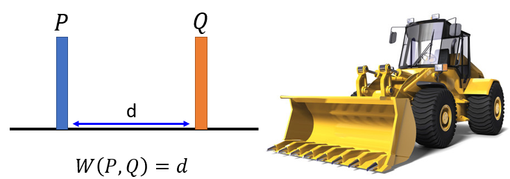

所以在这个例子裡面,假设 P 集中在一个点,Q 集中在一个点,这两个点之间的距离是 D 的话,那 P 跟 Q 的 Wasserstein Distance,就是 D

那因為在讲这个,Wasserstein Distance 的时候,你要想像有一个 Earth Mover,有一个推土机在推土,所以其实 Wasserstein Distance,又叫 ==Earth Mover Distance==

但是如果是**更复杂的 Distribution**,你要算 **Wasserstein Distance,就有点困难**了

假设这是你的 P,假设这是你的 Q

假设你开了一个推土机,想要把 P 把它重新塑造一下形状,让 P 的形状跟 Q 比较接近一点,那有什麼样的做法,你会发现说,你可能的 Moving Plans,**把 P重新塑造成 Q** 的**方法有无穷多种**

你可以说我把这边的土搬到这裡来,我把这边的土搬到这裡来,把 P 变成 Q

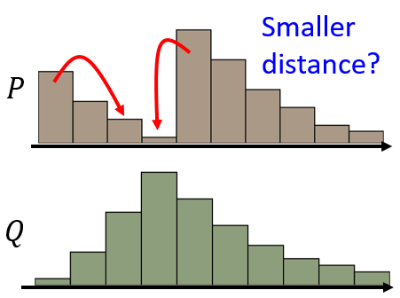

但你也可以捨近求远说,我把这裡的土搬到这裡来,把这裡的土搬到这裡来,捨近求远,一样还是可以把 P 变成 Q

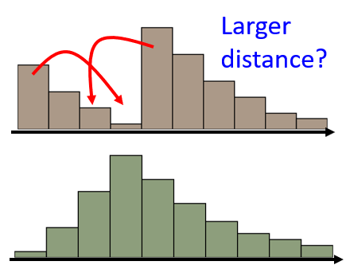

所以当我们考虑,比较复杂的 Distribution 的时候,把 Q 把 P 变成 Q 的方法,是有非常非常多不同的方法,你有各式各样不同的 Moiving Plan,用**不同的 Moving Plan**,你**推土机平均走的距离就不一样**

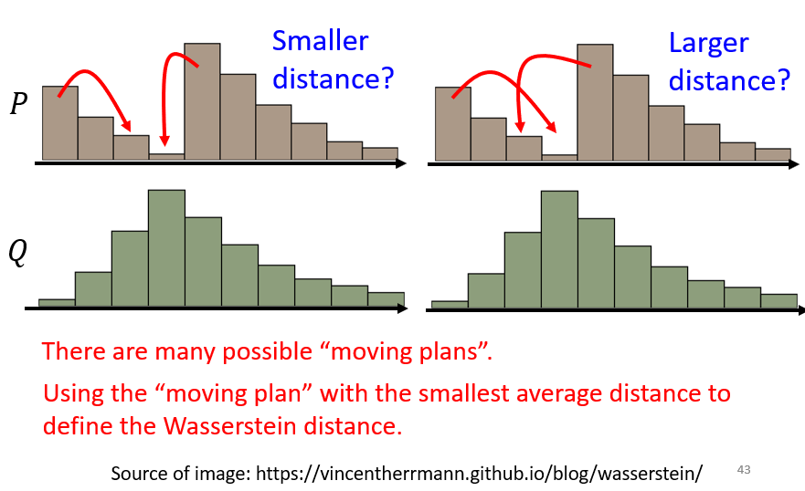

在左边这个例子裡面,推土机平均走的距离比较少,在右边这个例子裡面因為捨近求远,推土机平均走的距离比较大

為了让 Wasserstein Distance 只有一个值,所以这边 Wasserstein Distance 的定义是,**穷举所有的 Moving Plans**,然后看哪一个推土的方法,哪一个 Moving 的计划,可以让平均的距离最小,那个**最小的值,才是 Wasserstein Distance**

所以其实要计算 Wasserstein Distance,是挺麻烦的,光只是要计算一个 Distance,居然还要解一个 Optimization 的问题,**解出这个 Optimization 的问题,才能算 Wasserstein Distance**

我们先不讲,怎麼计算 Wasserstein Distance 这件事,我们先来讲假设我们**能够计算Wasserstein Distance 的话**,它可以带给我们什麼样的**好处**

那假设 PG 跟 Pdata 它们的距离是 $d_0$,在左边这个例子裡面,Wasserstein Distance 算出来就是 $d_0$

在中间这个例子裡面,PG 跟 Pdata 它们之间的距离是 $d_1$,那 Wasserstein Distance 算出来的距离,就是 $d_1$

假设 $d_1$ 比较小,$d_0$ 比较大,那算 Wasserstein Distance 的时候,这个 Case 的 Wasserstein Distance 就比较小,这个 Case 的 Wasserstein Distance 就比较大,所以我们就可以知道说,**由左向右的时候,Wasserstein Distance 是越来越小的**

所以如果你观察,Wasserstein Distance 的话会知道说,从左到右我们的 Generator 越来越进步,但是如果你观察 Discriminator,你会发现你观察不到任何东西,对 Discriminator 而言,这边每一个 Case 算出来的 JS Divergence,都是一样,都是一样好或一样差,但是如果换成 Wasserstein Distance,由左向右的时候我们会知道说,我们的 Discriminator 做,我们的 Generator 做得越来越好

所以我们**换一个计算 Divergence 的方式**,我们就可以解决 JS Divergence,有可能带来的问题

这又让我想到一个演化的例子,这是眼睛的生成

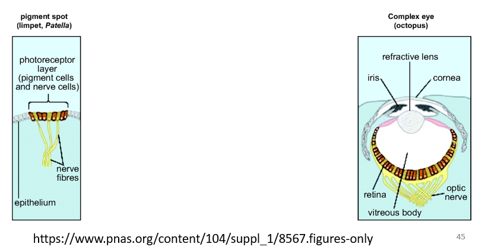

右边这个是人类的眼睛,人类的眼睛是非常地复杂的,那有一些生物它有非常原始的眼睛,比如说有一些细胞具备有感光的能力,这可以看做是最原始的眼睛,但是这些最原始的眼睛,怎麼变成最复杂的眼睛,这对人类来说其实觉得非常难想像

左边这个图像构造这麼简单,只是一些感光的细胞在皮肤上,经过突变產生一些感光的细胞,听起来像是一个合理的,但是天择突变,怎麼可能產生这麼复杂的器官,怎麼產生眼睛这麼精巧的器官

那如果你直接觉得说,从这个地方就可以一步跳到这个地方,那根本不可能发生,但是**中间其实是有很多连续的步骤**,从感光细胞到眼睛,中间其实是有连续的步骤的

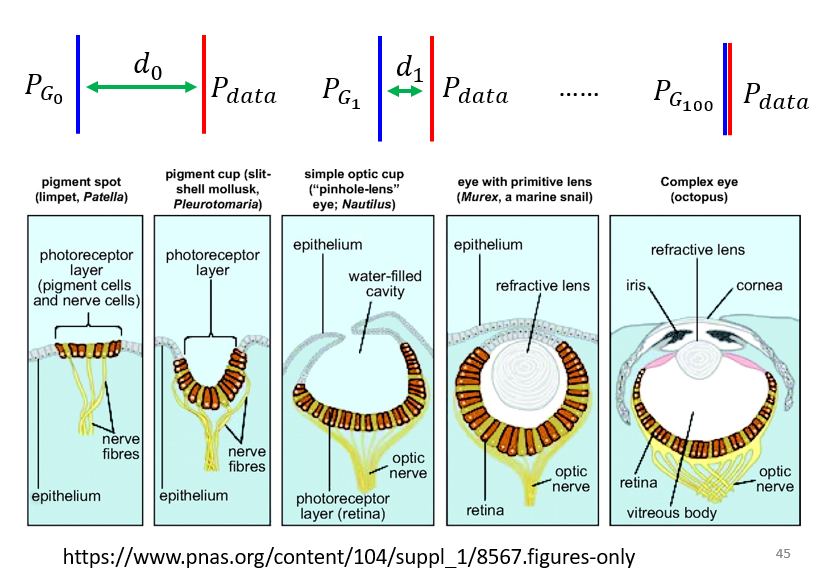

举例来说,感光的细胞可能会,出现在一个比较凹陷的地方,皮肤凹陷下去,这样感光细胞可以接受来自不同方向的光源,然后后来觉得说,乾脆把凹陷的地方盖起来,后来觉得盖起来的地方裡面,可以放一些液体,然后最后就变成了人的眼睛

而从最左边跳到最右边这一步,非常大,但是这边每一小步,都可以让一个生命存活的机率变大,都可以让生命繁衍下去的机率变高

既然这边每一个步骤,都可以让生命繁衍的机率变高,那生命就可以从左边一直演化到右边,最终產生复杂的器官

而我觉得对於当你使用 WGAN,当你使用这个 Wasserstein Distance,来衡量你的 Divergence 的时候,其实就製造了类似的效果,本来 PG0 跟 Pdata 非常地遥远,你要它一步从这裡跑到这裡,一步从这裡跑到这裡,让这个 PG0 跟 Pdata,直接 Align 在一起,是不可能的,可能非常地困难

对 JS Divergence 而言,它需要做到直接从这一步跳到这一步,它的 JS Divergence 的 Loss 才会有差异,但是对 **W Distance** 而言,你只要**每次有稍微把 PG 往 Pdata 挪近一点**,W Distance 就会有变化,W Distance 有变化,你才有办法 Train 你的 Generator,去 Minimize W Distance,所以这就是為什麼,当我们从 JS Divergence,换成 Wasserstein Distance 的时候,可以带来的好处

### WGAN

WGAN 实际上就是用,当你用 Wasserstein Distance,来取代 JS Divergence 的时候,这个 GAN 就叫做 WGAN

接下来你会遇到的问题就是,**Wasserstein Distance 是要怎麼算**,Pdata 跟 PG,它的 Wasserstein Distance 要怎麼计算,Wasserstein Distance,是一个非常复杂的东西,我光要算个 Wasserstein Distance,还要解一个 Optimization 的问题,实际上要怎麼计算

那这边就**不讲过程,直接告诉结果**,解下面这个 Opimilazion 的 Problem,解出来以后你得到的值,就是 Wasserstein Distance

我们就观察一下这个式子,这个式子裡面有说

- y 如果是从 Pdata 来的,那我们要计算它的 D(y) 的**期望值**
- y 如果是从 PG 来的,我们计算它的 D(y) 的**期望值**,但是**前面乘上一个负号**

所以如果你要 Maximum,这个 Objective Function,你会达成这样的效果，

- 如果 y是从 **Pdata** Sample 出来的,D(y),就 Discriminator 的 Output 要**越大越好**
- 如果 X 是从 **PG**,从 Generator Sample 出来的,那 D(y),也就 Discriminator 的 Output,应该要**越小越好**

但是这边**还有另外一个限制**,它不是光大括号裡面的值变大就好,还有一个限制是,**D 不能够是一个随便的 Function**,D必须要是一个 1-Lipschitz 的 Function

1-Lipschitz 是什麼东西,如果你不知道是什麼的话,也没有关係

我们这边你就想成,**D 必须要是一个足够平滑的 Function**,它不可以是变动很剧烈的 Function,它必须要是一个足够平滑的 Function

那為什麼足够平滑这件事情是非常重要的,我们可以从直观来理解它,假设这个是真正的资料的分布,这是 Generated 的资料的分布

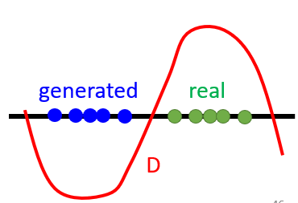

如果我们没有这个限制,只看大括号裡面的值的话,大括号裡面的目标,是要这些真正的值,它的 D(y) 越大越好,那要让 Generated 的值,它的 D(y) 越小越好

如果你没有做任何限制,只单纯要这边的值越大越好,这边的值越小越好,在蓝色的点跟绿色的点,也就是真正的 Image,跟 Generated 的 Image,没有任何重叠的情况下,你的 Discriminator 会做什麼,它会给 Real 的 Image **无限大的正值**,给 Generated 的 Image **无限大的负值**

所以你这个 Training 根本就没有办法收敛,而且你会发现说,只要这两堆 Data 没有重叠,**你算出来的值都是无限大**,你算出来的这个 Maximum 值都是无限大,这显然不是我们要的,这不就跟 JS Divergence 的问题一模一样吗

其实你要加上这个限制以后,你这个 Maximum 的值,才会是 Wasserstein Distance,才是做 WGAN

為什麼加上这个限制,就可以解决刚才的问题？

因為这个限制是要求 **Discriminator,不可以太变化剧烈**,它必须要够听话,那今天如果你,要求你的 Discriminator 够平滑的时候,假设 Real Data 跟 Generated Data,它们距离比较近,那你就没有办法让 Real 的 Data 值非常大,然后 Generated 的值非常小,因為如果你让 Real 的值非常大,Generated 的值非常小,它们中间的差距很大,那这一个 Discriminator 变化就很剧烈,它就不平滑了,它就不是 1-Lipschitz

那為了要是 1-Lipschitz,这边的值没办法很大,这边的值没办法很小,让 Discrimination 必须足够,只觉得发现说,如果 Real 跟generated 的 Data 差距离很远,那它们的值就可以差很多,这边算出来的值就会比较大,你的 Wasserstein Distance 就比较大

如果 Real 跟 Generated 很近,就算它们没有重合,**因為有了这一个限制**,有了这一个写在 Max 下面的,1-Lipschitz Function 的限制,那你就发现说,它们其实**不会真的都跑到无限大**,它们的距离,因為有 1-Lipschitz Function 的限制,所以 Real Data 的值跟 Generated Data 的值,就**没有办法差很多**,那你算出来的 Wasserstein Distance,就会比较小

接下来的问题就是,**怎麼做到这个限制**

怎麼确保 Discriminator,一定符合 1-Lipschitz Function 的限制,最早刚提出 WGAN 的时候,其实没有什麼好想法,只知道写出了这个式子,那要怎麼真的解这个式子,有点困难,所以最早的一篇 WGAN 的 Paper,最早使用 Wasserstein 的那一篇 Paper,它说了它做了一个比较 Rough,比较粗糙的处理的方法

它是说我就 Train Network,那 Train Network 的时候,如果我 Training 的那个**参数**,我就要求它放得**在 C 跟 -C** 之间,如果超过 C,用 Gradient Descent Update 以后**超过 C,就设為 C**,Gradient Descent Update 以后**小於 -C,就直接设為 -C**

其实这个方法,**并不一定真的能够让 Discriminator,变成 1-Lipschitz Function**,那你可以想像说这个方法,也许真的可以让我们的 Discriminator,比较平滑,但它并没有真的去解这个,Optimization 的 Problem,它并没有真的让 Discriminator,符合这个限制

所以接下来就有其它的想法,有一个想法叫做 Gradient Penalty

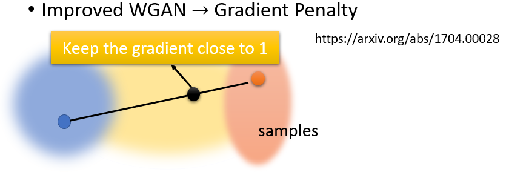

Gradient Penalty 是出自,Improved WGAN 这篇 Paperhttps://arxiv.org/abs/1704.00028,那 Improve WGAN 这边paper 是说

假设这个是你的 Real Data 的分布,这个是你的这个 Fake Data 的分布,那我在 Real Data 这边取一个 Sample,Fake Data 这边取一个 Sample,两点连线中间再取一个 Sample,我要求这个点它的 Gradient 要接近,那你可能觉得说这个,不知道 不知道在说些什麼这样,这件事情的关係,跟这个限制的关係,到底是什麼,那就详见 Improved WGAN 的 Paper

那其实我觉得你现在,也不一定要真的非常较真说,这件事情 Gradient Penalty,跟这个限制之间的关係,因為其实有更多其它的方法,真的可以去解这个问题

那其实后来 Improved WGAN 之后,还有什麼 Improved 的 Improved WGAN,真的有这篇 Paper,它就是把这个限制再稍微改一改

有另外一篇 Paper 就叫,Improved The Improved WGAN,那今天其实你有一个方法,真的把 D 限制,让它是 1-Lipschitz Function,这个叫做 Spectral Normalization

那我就把它的论文https://arxiv.org/abs/1802.05957放在这边给大家参考,那如果你要 Train 真的非常好的 GAN,你可能会需要用到 Spectral Normalizaion