# BERT P3_GPT3

除了BERT以外,还有下一个,也是鼎鼎有名的模型,就是==GPT==系列的模型

BERT做的是填空题,GPT就是改一下我们现在在,self-supervised learning的时候,要模型做的任务

## Predict Next Token

GPT要做的任务是,**预测接下来,会出现的token是什麼**

举例来说,假设你的训练资料裡面,有一个句子是台湾大学,那GPT拿到这一笔训练资料的时候,它做的事情是这样

你给它BOS这个token,然后GPT output一个embedding,然后接下来,你用这个embedding去预测下一个,应该出现的token是什麼

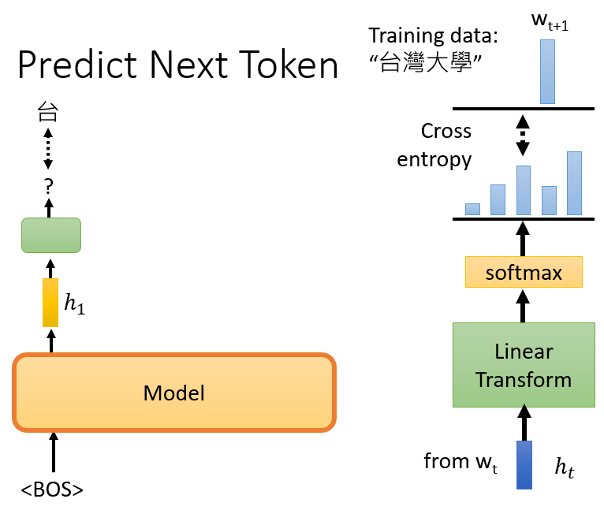

那在这个句子裡面,根据这笔训练资料,下一个应该出现的token是"台",所以你要训练你的模型,根据第一个token,根据BOS给你的embedding,那它要输出"台"这个token

这个部分,详细来看就是这样,你有一个embedding,这边用h来表示,然后通过一个Linear Transform,再通过一个softmax,得到一个distribution,跟一般你做分类的问题是一样的,接下来,你希望你output的distribution,跟正确答案的Cross entropy,越小越好,也就是你要去预测,下一个出现的token是什麼

好那接下来要做的事情,就是**以此类推**了,你给你的GPT,BOS跟"台",它產生embedding,接下来它会预测,下一个出现的token是什麼,那你告诉它说,下一个应该出现的token,是"湾"

好 再反覆继续下去,你给它BOS "台"跟"湾",然后预测下一个应该出现的token,它应该要预测"大"

你给它"台"跟"湾"跟"大",接下来,下一个应该出现的token是"学"

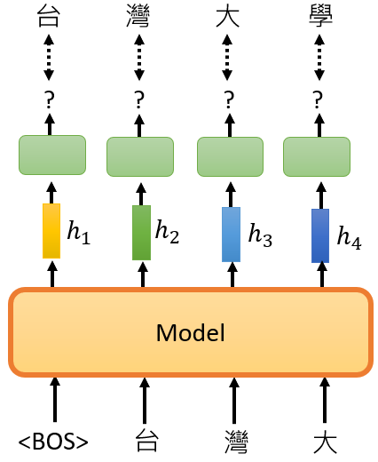

那这边呢,是指拿一笔资料 一个句子,来给GPT训练,当然实际上你不会只用一笔句子,你会用成千上万个句子,来训练这个模型,然后就这样子说完了

它厉害的地方就是,用了很多资料,训了一个异常巨大的模型

那这边有一个小小的,应该要跟大家说的地方,是说这个GPT的模型,它像是一个transformer的decoder,不过拿掉BOS的attention这个部分,也就是说,你会做那个**mask的attention**

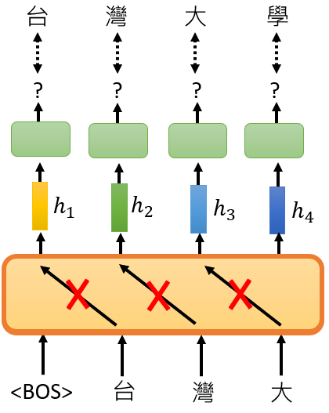

就是你现在在预测给BOS,预测台的时候,你不会看到接下来出现的词汇,给它台要预测湾的时候,你不会看到接下来要输入的词汇,以此类推 这个就是GPT

那这个GPT最知名的就是,因為GPT可以预测下一个token,那所以它有**生成的能力**,你可以让它不断地预测下一个token,產生完整的文章,所以我每次提到GPT的时候,它的形象都是一隻独角兽

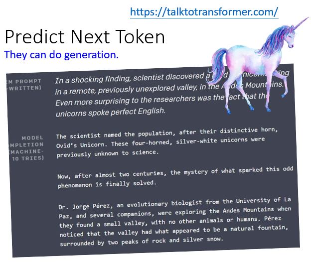

GPT系列最知名的一个例子,就是用GPT写了一篇,跟独角兽有关的新闻,因為他放一个假新闻,然后那个假新闻裡面说,在安地斯山脉发现独角兽等等,一个活灵活现的假新闻

為了让你更清楚了解,GPT运作起来是什麼样子,那这个线上有一个demo的网页,叫做talk to transformer,就是有人把一个比较小的,不是那个最大的GPT的模型,不是public available的,有人把比较小的GPT模型放在线上,让你可以输入一个句子,让它会把接下来的其餘的内容,把它补完

## How to use GPT? 

怎麼把它用在downstream 的任务上呢,举例来说,怎麼把它用在question answering,或者是其他的,跟人类语言处理有关的任务上呢

**GPT用的想法跟BERT不一样**,其实我要强调一下,GPT也可以跟BERT用一样的做法

在使用BERT时，把BERT model 拿出来,后面接一个简单的linear的classifier,那你就可以做很多事情,你也可以把GPT拿出来,接一个简单的classifier,我相信也是会有效

但是在GPT的论文中,它没有这样做,它有一个更狂的想法,為什麼会有更狂的想法呢,因為首先就是,BERT那一招BERT用过了嘛,所以总不能再用一样的东西,这样写paper就没有人觉得厉害了,然后再来就是,**GPT这个模型,也许真的太大了**,大到连fine tune可能都有困难

我们在用BERT的时候,你要把BERT模型,后面接一个linear classifier,然后BERT也是你的,要train的model的一部分,所以它的参数也是要调的,所以在刚才助教公告的,BERT相关的作业裡面,你还是需要花一点时间来training,虽然助教说你大概20分鐘,就可以train完了,因為你并不是要train一个,完整的BERT的模型,BERT的模型在之前,在做这个填空题的时候,已经训练得差不多了,你只需要微调它就好了,但是微调还是要花时间的,也许GPT实在是太过巨大,巨大到要微调它,要train一个epoch,可能都有困难,所以GPT系列,有一个更狂的使用方式

这个更狂的使用方式**和人类更接近**,你想想看假设你去考,譬如说托福的听力测验,你是怎麼去考

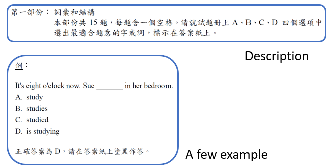

- 首先你会看到一个题目的说明,告诉你说现在要考选择题,请从ABCD四个选项裡面,选出正确的答案等等

- 然后给你一个范例,告诉你说这是题目,然后正确的答案是多少

- 然后你看到新的问题,期待你就可以举一反三开始作答

    GPT系列要做的事情就是,这个模型能不能够,做一样的事情呢

### “In-context” Learning

#### “Few-shot” Learning

举例来说假设要GPT这个模型做翻译

- 你就先打Translate English to French

- 就先给它这个句子,这个句子代表问题的描述

- 然后给它几个范例跟它说,sea otter然后=&gt;,后面就应该长这个样子

- 或者是这个什麼plush girafe,plush girafe后面,就应该长这个样子等等

- 然后接下来,你问它说cheese=&gt;,叫它把后面的补完,希望它就可以產生翻译的结果

不知道大家能不能够了解,这一个想法是多麼地狂,在training的时候,GPT并没有教它做翻译这件事,它唯一学到的就是,给一段文字的前半段,把后半段补完,就像我们刚才给大家示范的例子一样,现在我们直接给它前半段的文字,就长这个样子,告诉它说你要做翻译了,给你几个例子,告诉你说翻译是怎麼回事,接下来给它cheese这个英文单字,后面能不能就直接接出,法文的翻译结果呢

这个在GPT的文献裡面,叫做==Few-shot Learning==,但是它跟一般的Few-shot Learning,又不一样,所谓Few Shot的意思是说,确实只给了它一点例子,所以叫做Few Shot,但是它不是一般的learning,这裡面**完全没有gradient descent**,完全没有要去调,GPT那个模型参数的意思,所以在GPT的文献裡面,把这种训练给了一个特殊的名字,它们叫做==In-context Learning==,代表说它不是一种,一般的learning,它连gradient descent都没有做

#### “One-shot” Learning  “Zero-shot” Learning

当然你也可以给GPT更大的挑战,我们在考托福听力测验的时候,都只给一个例子而已,那GPT可不可以只看一个例子,就知道它要做翻译这件事,这个叫One-shot Learning

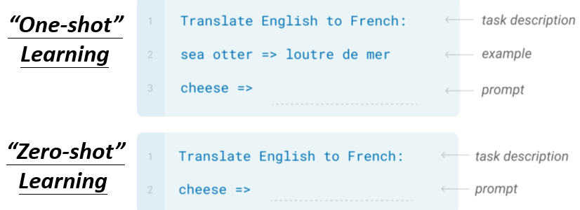

还有更狂的,是Zero-shot Learning,直接给它一个叙述,说我们现在要做翻译了,GPT能不能够自己就看得懂,就自动知道说要来做翻译这件事情呢,那如果能够做到的话,那真的就非常地惊人了,那GPT系列,到底有没有达成这个目标呢,这个是一个见仁见智的问题啦

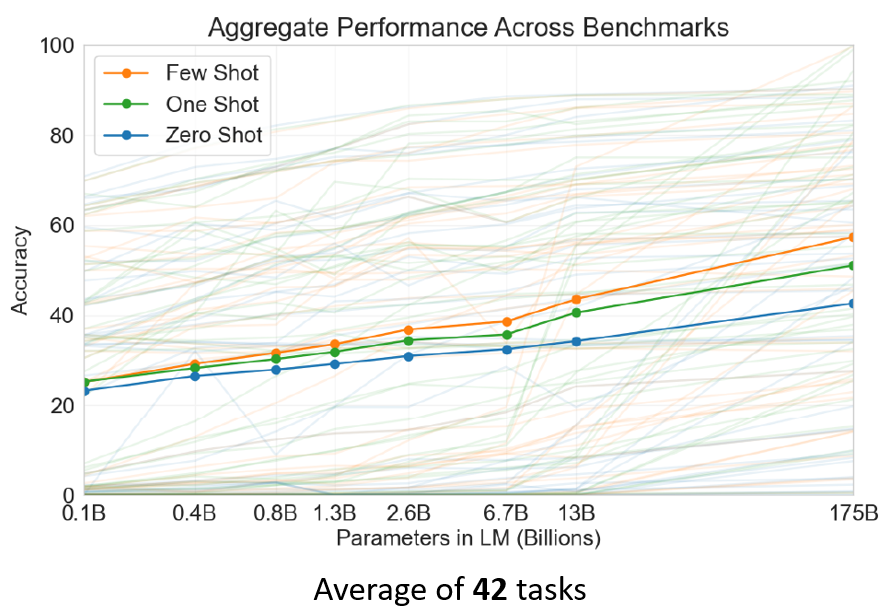

它不是完全不可能答对,但是**正确率有点低**,相较於你可以微调模型,正确率是有点低的,那细节你就再看看GPT那篇文章

第三代的GPT,它测试了42个任务,这个纵轴是正确率,这些实线 这三条实线,是42个任务的平均正确率,那这边包括了Few Shot,One Shot跟Zero Shot,三条线分别代表Few Shot,One Shot跟Zero Shot,横轴代表模型的大小,它们测试了一系列不同大小的模型,从只有0.1个billion的参数,到175个billion的参数,那从只有0.1个billion的参数,到175个billion的参数,我们看Few Shot的部分,从20几%的正确率 平均正确率,一直做到50几%的平均正确率,那至於50几％的平均正确率,算是有做起来 还是没有做起来,那这个就是见仁见智的问题啦

目前看起来状况是,**有些任务它还真的学会了**,举例来说2这个加减法,你给它一个数字加另外一个数字,它真的可以得到,正确的两个数字加起来的结果,但是有些任务,它可能怎麼学都学不会,譬如说一些跟**逻辑推理**有关的任务,它的结果就非常**非常地惨**,好 那有关GPT3的细节,这个就留给大家再自己研究,然后这边有一个过去上课的录影,我把连结放在这边给大家参考

## Beyond Text

到目前為止我们举的例子,都是只有跟文字有关,但是你不要误会说,这种self-supervised learning的概念,只能用在文字上

在CV,CV就是computer vision,也就是影像,**在语音跟影像的应用上也都可以用,self-supervised learning的技术**,那其实今天,self-supervised learning的技术,非常非常地多,我们讲的**BERT跟GPT系列,它只是三个类型的,这个self-supervised learning的方法,的其中一种**,它们是属於**prediction**那一类

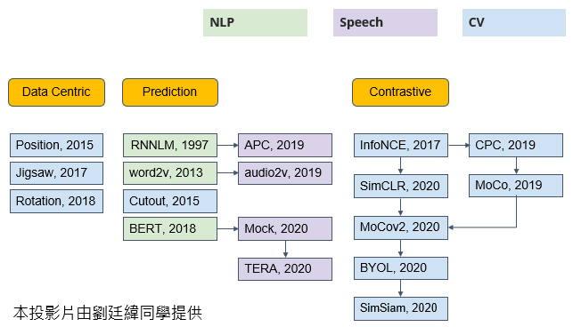

那其实还有其他的类型,那就不是我们这一堂课要讲的,那接下来的课程,你可能会觉得有点流水帐,就是我们每一个主题呢,就是告诉你说这个主题裡面,有什麼 但是细节这个更多的知识,就留给大家自己来做更进一步的研究,所以这些投影片,只是要告诉你说,在self-supervised learning这个部分,我们讲的只是整个领域的其中一小块,那还有更多的内容,是等待大家去探索的

### Image - SimCLR

好那有关影像的部分呢,我们就真的不会细讲,我这边就是放两页投影片带过去,告诉你说有一招非常有名的,叫做SimCLR,它的概念也不难,我相信你自己读论文,应该也有办法看懂它

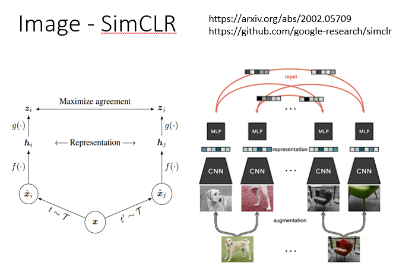

### Image - BYOL

那还有很奇怪的,叫做BYOL

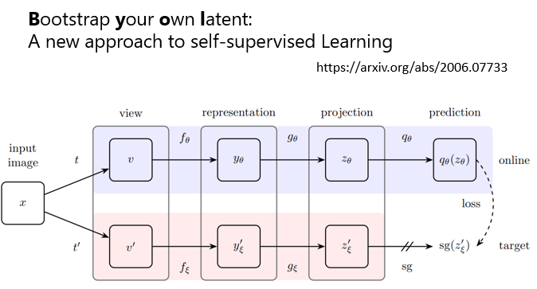

BYOL这个东西呢,我们是不太可能在上课讲它,為什麼呢,因為根本不知道它為什麼会work,不是 这个是很新的论文,这个是去年夏天的论文,那这个论文是,假设它不是已经发表的文章,然后学生来跟我提这个想法,我一定就是,我一定不会让他做,这不可能会work的,这是个不可能会实现的想法,不可能会成功的,这个想法感觉有一个巨大的瑕疵,但不知道為什麼它是work的,而且还曾经一度得到,state of the art的结果,deep learning就是这麼神奇,

### Speech

那在语音的部分,你也完全可以使用,self-supervised learning的概念

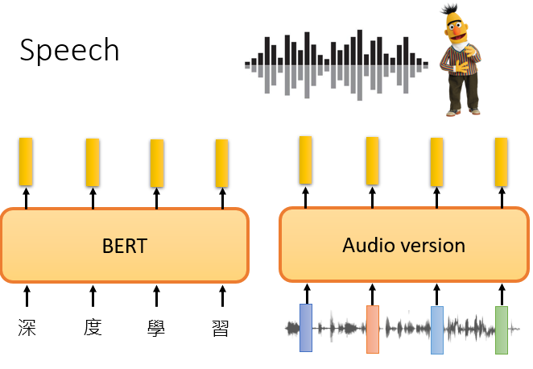

你完全可以试著训练,语音版的BERT

那怎麼训练语音版的BERT呢,你就看看文字版的BERT,是怎麼训练的,譬如说做填空题,语音也可以做填空题,就把一段声音讯号盖起来,叫机器去猜盖起来的部分是什麼嘛,语音也可以预测接下来会出现的内容,讲GPT就是预测,接下来要出现的token嘛,那语音你也可以叫它预测,叫模型预测接下来会出现的声音去套,所以你也可以做语音版的GPT,不管是语音版的BERT,语音版的GPT,其实都已经有很多相关的研究成果了

### Speech GLUE - SUPERB

不过其实在语音上,相较於文字处理的领域,还是有一些比较缺乏的东西,那我认為现在很缺乏的一个东西,就是像GLUE这样子的benchmark corpus

在自然语言处理的领域,在文字上有GLUE这个corpus,我们在这门课的刚开头,这个投影片的刚开头,就告诉你说有一个,这个基準的资料库叫做GLUE,它裡面有九个NLP的任务,今天你要知道BERT做得好不好,就让它去跑那九个任务在去平均,那代表这个self-supervised learning,模型的好坏

但在语音上 到目前為止,还没有类似的基準的资料库,所以我们实验室就跟其他的研究团队,共同开发了一个语音版的GLUE

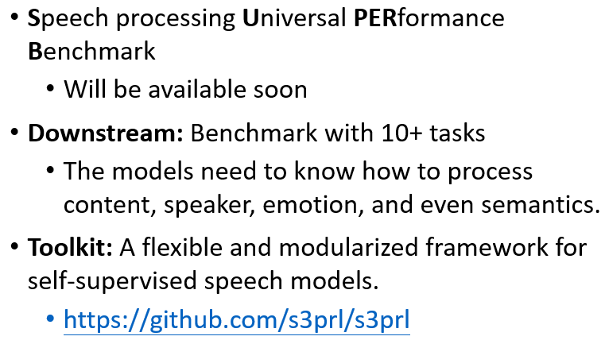

我们叫做SUPERB,它是Speech processing Universal,PERformance Benchmark的缩写,你知道今天你做什麼模型,都一定要硬凑梗才行啦,所以这边也是要硬凑一个梗,把它叫做SUPERB

那其实我们已经準备了差不多了,其实网站都已经做好了,只等其他团队的人看过以后,就可以上线了,所以现在虽然还没有上线,但是再过一阵子,你应该就可以找得到相关的连结

在这个基準语料库裡面,包含了十个不同的任务,那语音其实有非常多不同的面向,很多人讲到语音相关的技术,都只知道语音辨识把声音转成文字,但这并不是语音技术的全貌,语音其实包含了非常丰富的资讯,它除了有内容的资讯,就是你说了什麼,还有其他的资讯,举例来说这句话是谁说的,举例这个人说这句话的时候,他的语气是什麼样,还有这句话背后,它到底有什麼样的语意,所以我们準备了十个不同的任务,这个任务包含了语音不同的面向,包括去检测一个模型,它能够识别内容的能力,识别谁在说话的能力,识别他是怎麼说的能力,甚至是识别这句话背后语意的能力,从全方位来检测一个,self-supervised learning的模型,它在理解人类语言上的能力

而且我们还有一个Toolkit,这个Toolkit裡面就包含了,各式各样的,self-supervised learning的模型

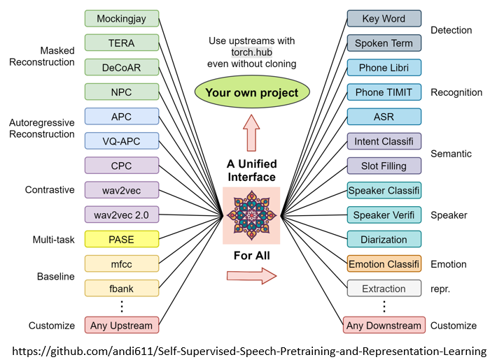

还有这些,self-supervised learning的模型,它可以做的,各式各样语音的下游的任务,然后把连结放在这边给大家参考

讲这些只是想告诉大家说,self-supervised learning的技术,不是只能被用在文字上,在这个影像上 在语音上,都仍然有非常大的空间可以使用,self-supervised learning的技术,好 那这个,self-supervised learning的部分呢,这个BERT跟GPT我们就讲到这边,