# Auto-Encoder P2

## Feature Disentangle 

接下来啊,除了 Auto-Encoder,可以用来做当 strime 的任务以外,我还想跟大家分享一下,Auto-Encoder 其他有意思的应用： ==Feature  Disentanglement==

Disentangle 的意思就是,把一堆本来纠缠在一起的东西把它解开

那为什么会有 Disentangle 这个议题呢,我们来想想看,Auto-Encoder 它在做的事情是什么

Auto-Encoder 在做的事情是

- 如果是图片的话,就是把一张图片变成一个 Code,再把 Code 呢 变回图片,既然这个 Code 可以变回图片,代表说这个 Code 裡面啊,有很多的资讯,包含图片裡面所有的资讯,举例来说,图片裡面有什么样的东西啊,图片的色泽纹理啊等等
- Auto-Encoder 这个概念也不是只能用在影像上,如果用在语音上,你可以把一段声音丢到 Encoder 裡面,变成向量 再丢回 Decoder,变回原来的声音,代表这个向量包含了,语音裡面所有重要的资讯,包括这句话的内容是什么,就是 Encoder 的资讯,还有这句话是谁说的,就是 Speaker 语者的资讯
- 那如果今天是一篇文章,丢到 Encoder 裡面变成向量,这个向量通过 Decoder 会变回原来的文章,那这个向量裡面有什么,它可能包含文章裡面,文句的句法的资讯,也包含了语意的资讯,但是这些资讯是全部纠缠在一个向量裡面,我们并不知道一个向量的哪些维,代表了哪些资讯

举例来说,如果我们今天把一段声音讯号丢进 Encoder,它会给我们一个向量,但是这个向量裡面,哪些维度代表了这句话的内容,哪些维度代表这句话的语者,也就是谁说的,我们没有这样的资讯

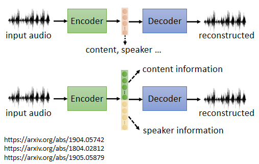

而 Feature Disentangle 想要做到的事情就是,我们有没有可能想办法,在 Train 一个 Auto-Encoder 的时候,同时有办法知道,这个 Representation,或又叫做 Embedding,或又叫做 Code,我们这个 **Embedding 的哪些维度代表了哪些资讯**呢

我们有没有可能做到说 Encoder 输出一个,举例来说 100 维的向量,我们知道说**前 50 维就代表了这句话的内容**,**后 50 维就代表了这句话说话人的特徵**呢,那这样子的技术就叫做 Feature Disentangle

我们就是主要就想告诉大家说,Feature Disentangle 是有办法做的,那至于实际上怎么做,我在这边就列几篇论文,给有兴趣的同学参考,如果你没有兴趣的话,就知道说这件事情是可行的,我们有可能知道 Auto-Encoder 裡面,每一个 Dimension 代表了什么样的资讯

这边举一个语音上的应用,这个应用叫做 Voice Conversion,Voice Conversion 的中文叫做语者转换,所以也许你没有听过语者转换这个词彙,但是你一定看过它的应用,它就是柯南的领结变身器

这个在二十年前,阿笠博士就已经做得很成功了啦

那只是过去,阿笠博士在做这个 Voice Conversion 的时候啊,我们需要成对的声音讯号,也就是假设你要把 A 的声音转成 B 的声音,你必须把 A 跟 B 都找来,叫他唸一模一样的句子

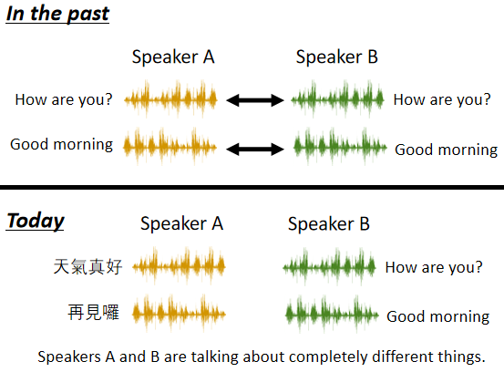

就 A 说好 How are you,B 也说好 How are you,A 说 Good morning,B 也说 Good morning,他们两个各说一样的句子,说个 1000 句,接下来呢,就结束了,就是 **Supervised Learning 的问题**啊,你有成对的资料,Train 一个 Supervised 的 Model,把 A 的声音丢进去,输出就变成 B 的声音,就结束了

但是如果 A 跟 B 都需要唸一模一样的句子,念个 500 1000 句,显然是不切实际的,举例来说,假设我想要把我的声音转成新垣结衣的声音,我得把新垣结衣找来,更退一万步说,假设我真的把新垣结衣找来,她也不会说中文啊,所以她没有办法跟我唸一模一样的句子

而今天有了 Feature Disentangle 的技术以后,也许我们期待机器可以做到,**就给它 A 的声音 给它 B 的声音,A 跟 B 不需要唸同样的句子,甚至不需要讲同样的语言,机器也有可能学会把 A 的声音转成 B 的声音**

那实际上是怎么做的呢,假设我们收集到一大堆人类的声音讯号,然后拿这堆声音讯号呢,去 Train 一个 Auto-Encoder,同时我们又做了 Feature Disentangle 的技术,所以我们**知道在 Encoder 的输出裡面,哪些维度代表了语音的内容,哪些维度代表了语者的特徵**

接下来,我们就可以**把两句话,声音跟内容的部分互换**

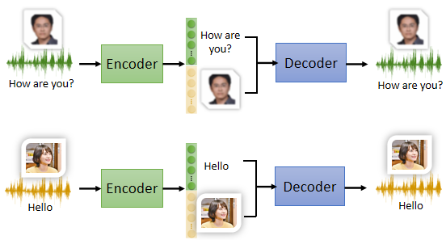

举例来说,这边是我的声音,我说 How are you,丢进 Encoder 以后,那你就可以抽出,你就知道说这个 Encoder 裡面,**某些维度代表 How are you 的内容,某些维度代表我的声音**

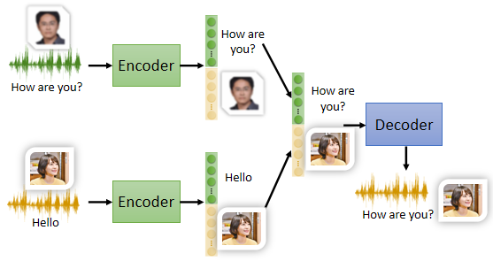

今天你把这个你老婆的声音丢进 Encoder,它就知道某一些维度,代表你老婆说的话的内容,某一些维度,代表你老婆声音的特徵,接下来我们只要**把我说话的内容的部分取出来**,**把你老婆说话的声音特徵的部分取出来,把它拼起来**,丢到 Decoder 裡面,就可以用**你老婆的声音,讲我说的话的内容**

这件事情真的有可能办到吗,以下是真正的例子,听起来像是这个样子,Do you want to study a PhD,这个是我的声音，那把我的声音丢到 Encoder 裡面以后呢,你可以想像说在 Encoder 裡面,我们知道哪些维度代表了念博班这件事,哪些维度代表了我的声音

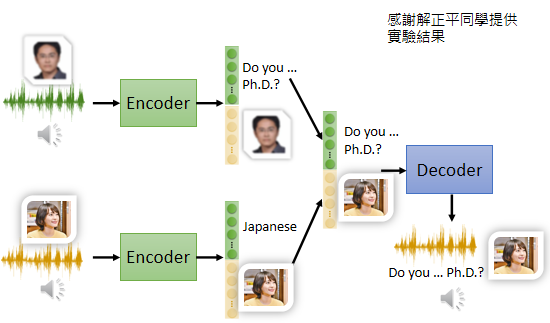

那为了简化起见,它输出 100 维的向量,前 50 维代表内容,后 50 维代表说话人的特徵,好 接下来这句话是你老婆说的,仕事忙しいのがな,不知道 不太确定在说什么,就是日文啊

接下来呢,就把我的声音的前 50 维,代表内容的部分取出来,把你老婆的,把你老婆的声音丢进 Encoder 以后,后 50 维的部分抽出来,拼起来,一样是一个 100 维的向量,丢到 Decoder 裡面,看看输出来的声音,是不是就是你老婆叫你念博班的声音,听起来像是这个样子,Do you want to study a PhD

那其实反过来也可以啦,就是换成把日文的部分拿出来,把我的声音的特徵拿出来,一样串成一个 100 维的向量,丢到 Decoder 裡面,它听起来就会变成这样,仕事忙しいのがな,我也不知道自己在说什么就是了

所以确实用 Feature Disentangle,你有机会做到 Voice Conversion,那其实在影像上,在 NLP 上,也都可以有类似的应用,所以可以想想看,Feature Disentangle 可以做什么样的事情

## Discrete Latent Representation

下一个要跟大家讲的应用,叫做 Discrete Latent Representation

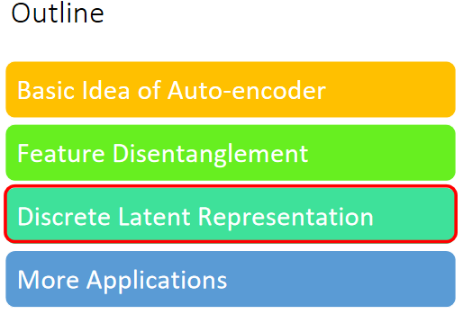

到目前为止我们都假设这个 Embedding,它就是一个向量,这样就是一串数字,它是 Real Numbers,那它可不可以是别的东西呢

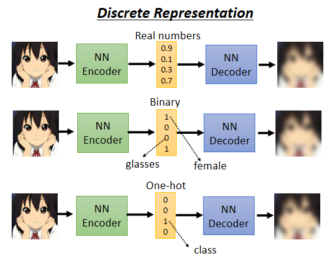

- 举例来说,它可不可以是 Binary,Binary 的好处也许是说,每一个维度,它就代表了某种特徵的有或者是没有,举例来说,输入的这张图片,如果是女生,可能第一维就是 1,男生第一维就是 0,如果有戴眼镜,就是第三维 1,没有戴眼镜 就是第三维是 0,也许我们把这个向量,这个 Embedding 变成 Binary,变成只有 0 跟 1 的数字,可以让我们再解释 Encoder 输出的时候,更为容易
- 甚至有没有可能这个向量,强迫它一定要是 One-Hot 呢,也就只有一维是 1,其他就是 0,如果我们强迫它是 One-Hot,也就是每一个东西图片丢进去,你只可以有,你的 Embedding 裡面只可以有一维是 1,其他都是 0 的话,那可以做到什么样的效果呢,也许可以做到 unSupervised 的分类,举例来说,假设你有一大堆的,假设你想要做那个手写数字辨识,你有 0 到 9 的图片,你把 0 到 9 的图片统统收集起来,Train 一个这样子的 Auto-Encoder,然后强迫中间的 Latent Representation,强迫中间的这个 Code 啊,一定要是 One-Hot Vector,那你这个 Code 正好设个 10 维,也许每一个 One-Hot 的 Code,所以这 10 维,就有 10 种可能的 One-Hot 的 Code,也许每一种 One-Hot 的 Code,正好就对应到一个数字也说不定,所以今天如果用 One-Hot 的 Vector,来当做你的 Embedding 的话,也许就可以做到完全在没有,完全没有Llabel Data 的情况下,让机器自动学会分类

其实还有其他,在这种啊 Discrete 的 Representation 的这个,技术裡面啊,其中最知名的就是 ==VQVAE==,Vector Quantized Variational Auto-Encoder,

VQVAE 啊,是这样子运作的,就是你输入一张图片,Encoder 呢 输出一个向量,这个向量它是一般的向量,它是 Continuous 的,但接下来你有一个 ==Codebook==

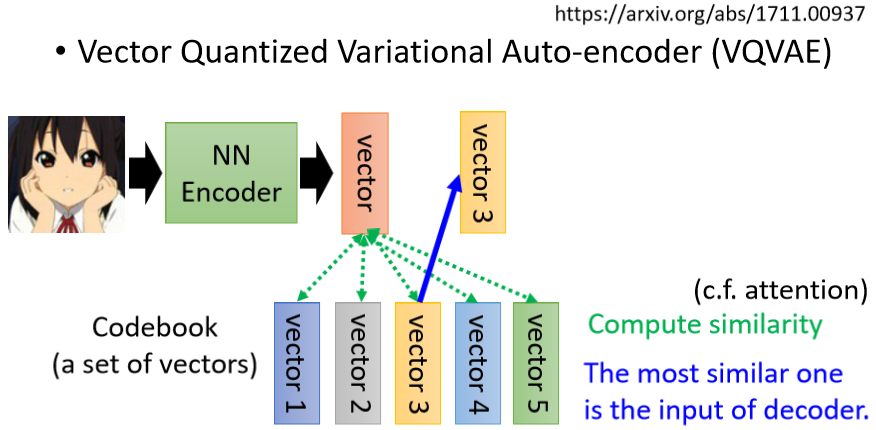

所谓 Codebook 的意思就是,你有一排向量,这排向量也是 Learn 出来的,你把 Encoder 的输出,去跟这排向量都去算个**相似度**,那你发现这件事情啊,其实跟 Self-attention 有点像,上面这个 Vector 就是 Query,下面这些 Vector 就是 Key,那接下来呢就看这些 Vector 裡面,谁的**相似度最大**,那你把相似度最大的那个 Vector 拿出来

这边就是那个,这个 Key 跟那个 Value,是等于是共用同一个 Vector

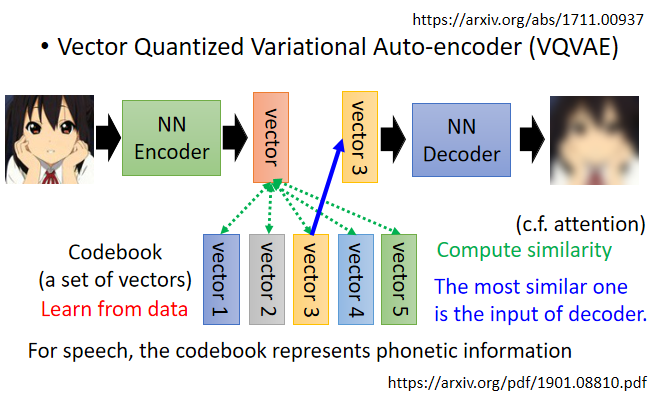

如果你把这整个 Process,用 Self-attention 来比喻的话,那就等于是 Key 跟 Value 是共同的 Vector,然后把这个 Vector 呢,丢到 Decoder 裡面,然后要它输出一张图片,然后接下来 Training 的时候,就是要让输入跟输出越接近越好

这一个 Decoder,这个 Encoder,这一个 Codebook,都是一起从资料裡面被学出来的,这样做的好处就是你就可以,你就有 Discrete 的这个 Latent Representation,也就是说这边 Decoder 的输入,一定是这边这个 Codebook,裡面的向量的其中一个,假设你 Codebook 裡面有 32 个向量,那你 Decoder 的输入,就只有 32 种可能,你等于就是让你的这个 Embedding,它是离散的,它没有无穷无尽的可能,它只有 32 种可能而已

那其实像这样子的技术啊,如果你拿它 把它用在语音上,你就是一段声音讯号输进来,通过 Encoder 以后产生一个向量,接下来呢,你去计算这个相似度,把最像的那个向量拿出来丢给 Decoder,再输出一样的声音讯号,这个时候你会发现说你的 Codebook 啊,可能可以学到最基本的发音部位

举例来说 你的,这个最基本的发音单位啊,又叫做 ==Phonetic==,那如果你不知道 Phonetic 是什么的话,你就把它想成是 KK 音标,那你就会发现说,这个 Codebook 裡面每一个 Vector,它就对应到某一个发音,就对应到 KK 音标裡面的某一个符号,这个是 VQVAE

### Text as Representation

那其实还有更多疯狂的想法,Representation 一定要是向量吗,能不能是别的东西

举例来说,它能不能是一段文字,是可以的

假设我们现在要做文字的 Auto-Encoder,那文字的 Auto-Encoder 的概念,跟语音的影像的没有什么不同,就是你有一个 Encoder,一篇文章丢进去,也许产生一个什么东西 一个向量,把这个向量丢到 Decoder,再让它还原原来的文章,但我们现在可不可以不要用向量,来当做 Embedding,我们可不可以说我们的 Embedding,就是一串文字呢

如果把 Embedding 变成一串文字,有什么好处呢,也许这串文字就是文章的摘要,因为你想想看,把一篇文章丢到 Encoder 的裡面,它输出一串文字,而这串文字,可以通过 Decoder 还原回原来的文章,那代表说这段文字,是这篇文章的精华,也就是这篇文章最关键的内容,也就是这篇文章的摘要

不过啊 这边的 Encoder,显然需要是一个 **Seq2seq 的 Model**,比如说 Transformer,因为我们这边输入是文章嘛,这边输出是一串文字嘛,这个 Decoder 输入是一串文字,输出是文章嘛,所以都是输入一串东西,输出一串东西,输入一串文字 输出一串文字,所以 Encoder 跟 Decoder,显然都必须要是一个 Seq2seq 的 Model

它不是一个普通的 Auto-Encoder,它是一个 seq2seq2seq 的 Auto-Encoder,它把长的 Sequence 转成短的 Sequence,再把短的 Sequence 还原回长的 Sequence,而这个 Auto-Encoder 大家训练的时候,不需要标注的资料,因为训练 Auto-Encoder,只需要收集大量的文章,收集大量没有标注的资料,在这边就是大量的文章就可以了

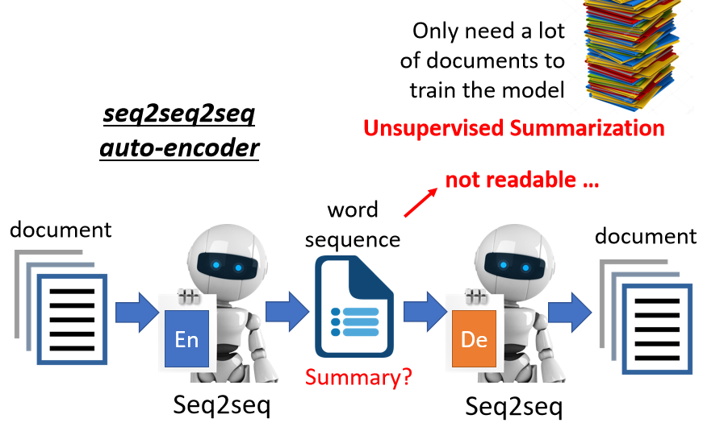

如果你真的可以训练出这个模型,如果这串文字真的可以代表摘要的话,你就是让机器自动学会做摘要这件事,让机器自动学会做,unSupervised 的 Summarization

但是真的有这么容易吗,实际上这样 **Train 起来以后发现是行不通的**,为什么,因为这两个 Encoder 跟 Decoder 之间,会发明自己的暗号啊,所以它会产生一段文字,那这段文字是你看不懂的,你看不懂的文字,这 Decoder 可以看得懂,它还原得了原来的文章,但是人看不懂,所以它根本就不是一段摘要,所以怎么办呢

**再用 GAN 的概念,加上一个 Discriminator**

Discriminator 看过人写的句子,所以它知道人写的句子长什么样子,但这些句子,不需要是这些文章的摘要性,另外一堆句子,所以它知道人写的句子长什么样子

然后呢,这个 Encoder 要想办法去骗过 Discriminator,Encoder 要想办法产生一段句子,这段句子不只可以透过 Decoder,还原回原来的文章,还要是 Discriminator 觉得像是人写的句子,期待通过这个方法,就可以强迫 Encoder,不只产生一段密码可以给 Decoder 去破解,而是产生一段人看得懂的摘要

那你可能会问说,这个 Network 要怎么 Train 啊,这个 Output 是一串文字哦,那这个文字要怎么接给 Discriminator,跟这个 Decoder 呢,告诉你,看到你没办法 Train 的问题,就用 RL 硬做,这样这边就是 RL 硬做就结束了这样子

你可能会觉得这个概念有点像 **CycleGAN**,没错 你可以想这根本就是 CycleGAN,就是这是一个 Generator,这是另外一个 Generator,这是 Discriminator,你要输入跟输出越接近越好,其实这根本就是 CycleGAN,我们只是从 Auto-Encoder 的角度,来看待 CycleGAN 这个想法而已,

那实际上做的结果是怎么样呢,以下是真正 Network 输出的结果啦,你给它读一篇文章,然后它就用 Auto-Encoder 的方法,拿 300 万篇文章做训练以后,然后看看给它一篇新的文章,它可不可以是,那个 Encoder 的输出的句子,是不是就是人可以看得懂的摘要

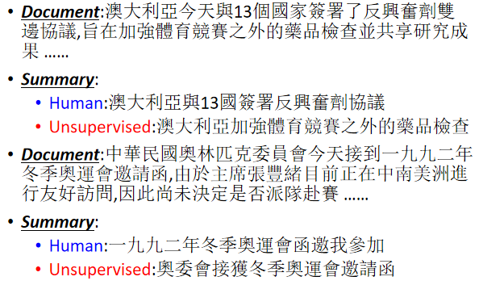

举例来说,给 Encoder 看这篇文章,它的输出是,澳大利亚加强体育竞赛之外的药品检查,看起来还可以,那这边有一个特别强的啦,就是这篇文章是,中华民国奥林匹克委员会,今天接到一九九二年冬季奥运会邀请函,丢给 Encoder 之后,它的输出是奥委会接获冬季奥运会邀请函,它知道把奥林匹克委员会,自己就缩写成奥委会,这个不知道怎么回事,它自己就学到了这件事情

当然很多时候,它也是会犯错的,我特别喜欢举这种极其犯错的例子

举例来说,你给它读这篇文章,印度尼西亚苏门答腊岛近日来连降暴雨,机器产生的摘要是什么呢

Encoder 的输出是,印尼门洪水泛滥,印尼门是什么东西呢,大概就是印度尼西亚苏门的缩写啦,可能人类写的句子裡面,常常出现罗生门 (风二门),等等什么门,所以机器觉得,Encoder 觉得印度尼西亚苏门,应该可以缩写成印尼门

那有时候它也会产生莫名其妙的句子啊,比如说把这篇文章给机器读了以后,Encoder 的输出是,合肥领导干部下基层做搞迎来送往规定一律简,不知道在说些什么,总之是个句子 不知道在说些什么,好 所以这个例子只是想要告诉你说,我们确实有可能,拿一段文字来当做 Embedding

其实还有更狂的,我还看过有拿 Tree Structure,当做 Embedding,就一段文字把它变成 Tree Structure,再用 Tree Structure 还原一段文字,

好 我把 Reference 列在这边给大家参考

## More Applications

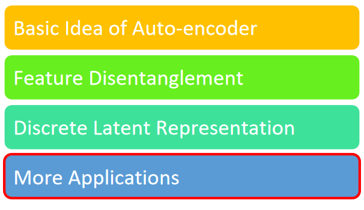

接下来啊,还有 Auto-Encoder 更多的应用,Auto-Encoder 还可以拿来做些什么事情呢,举例来说,我们刚才用的都是 Encoder,那其实 Decoder 也有作用

### Generator 

你把 Decoder 拿出来,这不就是一个 **Generator** 吗,我们说 Generator,不是就是要吃一个向量,产生一个东西,比如说一张图片吗,而 Decoder 不正好是吃一个向量,产生一张图片吗,所以 Decoder,你可以把它**当做一个 Generator 来使用**

你可以从一个已知的 Distribution,比如说 Gaussian Distribution,Sample 一个向量,丢给 Decoder,看看它能不能够输出一张图

事实上在我们之前,在讲这个 Generative Model 的时候,其实有提到说除了 GAN 以外,还有另外两种 Generative 的 Model,其中一个就叫做 VAE,Variarional 的 Auto-Encoder,你看它名字裡面的 Auto-Encoder,显然是跟 Auto-Encoder 非常有关係的,它其实就是把 Auto-Encoder 的 Decoder 拿出来,当做 Generator 来用,那实际上它还有做一些其他的事情啊,至于它实际上做了什么其他的事情,就留给大家自己研究

所以 Auto-Encoder Train 完以后,也顺便得到了一个 Decoder

### Compression

Auto-Encoder 可以拿来**做压缩**

我们今天知道说你在做图片,我们图片如果太大的话,也会有一些压缩的方法,比如说 JPEG 的压缩,而 Auto-Encoder 也可以拿来做压缩,你完全可以把 Encoder 的输出,当做是一个压缩的结果,因为一张图片,是一个非常高维的向量,而一般我们 Encoder 的输出,是一个非常低维的向量,你完全可以把那个向量,看作是一个压缩的结果

所以你的 Encoder 做的事情,就是压缩,你的 Decoder 做的事情,就是解压缩

只是这个压缩啊,它是那种 lossy 的压缩,所谓 **lossy 的压缩就是它会失真**,因为在 Train Auto-Encoder 的时候,你没有办法 Train 到说,输入的图片跟输出的图片,100% 完全一模一样啦,它还是会有一些差距的

所以这样子的 Auto-Encoder 的压缩技术,你拿这样子的技术来做压缩,那你的图片是会失真的,就跟 JPEG 图片会失真一样,用这个 Auto-Encoder 来做压缩,你的图片也是会失真的

### Anomaly Detection 

那接下来,就是我们在作业裡面要使用的技术,在作业裡面我们会拿 Auto-Encoder,来做 Anomaly 的 Detection,那我在规划作业的时候,其实就是想要 Auto-Encoder 出一个作业,那 Auto-Encoder 的技术很多,那最后我决定做 Anomaly 的 Detection，因为这个是你在非常多的场合,都有机会应用到的一个技术

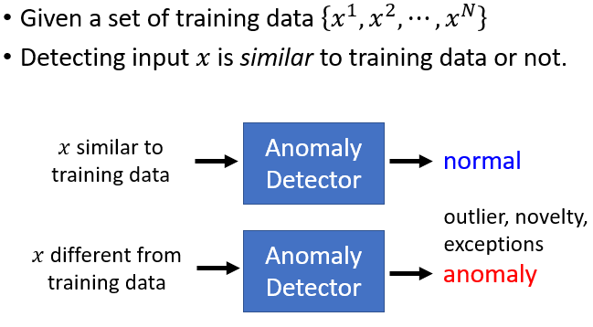

Anomaly 的 Detection ,假设你有一堆的训练资料,这边用 X1 到 XN 来表示我们的训练资料,而 Anomaly Detection,它的中文通常翻译成异常检测

异常检测要做的事情就是,**来了一笔新的资料,它到底跟我们之前在训练资料裡面看过的资料,相不相似**呢,也就是说你需要找出,你需要有一个异常检测的系统,这个异常检测的系统,是透过大量你已经看过的资料训练出来的

- 给它一笔新的资料,如果这笔新的资料,看起来像是训练资料裡面的 Data,就说它是正常的
- 如果看起来不像是训练资料裡面的 Data,就说它是异常的

那其实 Anomaly,Anomaly 这个词啊,有很多不同的其他的称呼,比如说有时候你会叫它 Outlier,有时候你会叫它 Novelty,有时候你会叫它 Exceptions,但其实指的都是同样的事情,你就是要看某一笔新的资料,它跟之前看过的资料到底相不相似,但是所谓的**相似这件事啊,其实并没有非常明确的定义**,它是见仁见智的,会根据你的应用情境而有所不同

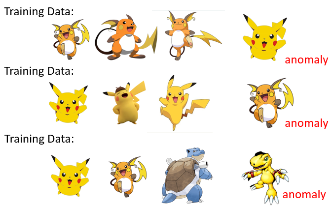

举例来说

- 假设现在你的训练资料这个都是雷丘,那这个皮卡丘就算是异常的东西
- 但是假设你的训练资料裡面,你所有的动物都是皮卡丘,那雷丘就是异常的东西,所以我们并不会说,某一个东西它一定就是 Normal,一定就是 Anomaly,我们不会说某个东西它一定是正常或异常,它**是正常或异常,取决于你的训练资料长什么样子**
- 或者是说假设你的训练资料裡面,通通都是宝可梦,那雷丘跟皮卡丘通通都算是正常的,而可能数码宝贝,亚古兽知道吗,这应该是亚古兽 对不对,亚古兽算是异常的

那个这个异常检测有什么样的应用呢

- 举例来说,它可以来做诈欺侦测,假设你的训练资料裡面,有一大堆信用卡的交易纪录,那我们可以想像说,多数信用卡的交易都是正常的,那你拿这些正常的信用卡训练的交易纪录,来训练一个异常检测的模型,那有一笔新的交易纪录进来,你就可以让机器帮你判断说,这笔纪录算是正常的 还是异常的,所以这种异常检测的技术,可以拿来做诈欺侦测
- 或者是它可以拿来做网路的这个侵入侦测,举例来说,你有很多连线的纪录资料,那你相信多数人连到你的网站的时候,他的行为都是正常的,多数人都是好人,你收集到一大堆正常的连线的纪录,那接下来有一笔新的连线进来,你可以根据过去正常的连线,训练出一个异常检测的模型,看看新的连线,它是正常的连线 还是异常的连线,它是有攻击性的 还是正常的连线,或者是它在医学上也可能有应用,你收集到一大堆正常细胞的资料,拿来训练一个异常检测的模型,那也许看到一个新的细胞,它可以知道这个细胞有没有突变,也许有突变,它就是一个癌细胞等等

那讲到这边有人可能会想说,Anomaly Detection 异常检测的问题,我们能不能够把它当做**二元分类**的问题来看啊

你说你要做诈欺侦测,你就收集一大堆正常的信用卡纪录,一堆诈欺的信用卡纪录,训练一个 Binary 的 Classifier,就结束啦,就这样子不是吗,

比较**难点就是你要收资料**

这种异常检测的问题它的难点,正在就在收资料上面,通常你**比较有办法收集到正常的资料,你比较不容易收集到异常的资料**,你可能有一大堆信用卡交易的纪录,但是多数信用卡交易的纪录可能都是正常的,异常的资料相较于正常的资料,可能非常地少,甚至有一些异常的资料混在正常的裡面,你也不太可,你可能也完全没有办法侦测出来,所以在这一种异常检测的问题裡面

我们往往假设,我们有一大堆正常的资料,但我们几乎没有异常的资料,所以它**不是一个一般的分类的问题**,这种分类的问题又叫做 ==One Class 的分类问题==,就是我们只有一个类别的资料,那你怎么训练一个模型,因为你想你要训练一个分类器,你得有两个类别的资料,你才能训练分类器啊,如果只有一个类别的资料,那我们可以训练什么东西,这个时候就是 Auto-Encoder,可以派得上用场的时候了

举例来说,假设我们现在想要做一个系统,这个系统是要侦测说一张图片

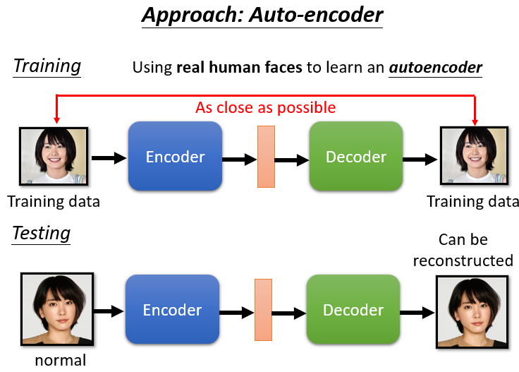

举例来说,它是不是真人的人脸,那你可以找到一大堆图片,它都是真正的人脸,那我们就拿这些真人的人脸,来训练一个 Auto-Encoder

这个是你老婆的照片,那你可以拿它来训练一个 Auto-Encoder,那你训练完这个 Auto-Encoder 以后,在测试的时候,如果进来的也是你老婆的照片,那因为在训练的时候有看过这样的照片,所以它可以顺利地被还原回来

你可以计算这一张照片通过 Encoder,再通过 Decoder 以后,它的变化有多大,你可以去**计算这个输入的照片,跟这个输出的照片,它们的差异有多大**,如果差异很小,你的 Decoder 可以顺利地还原原来的照片,代表这样类型的照片,是在训练的时候有看过的,不过反过来说,假设有一张照片是训练的时候没有看过的

举例来说这根本不是人的照

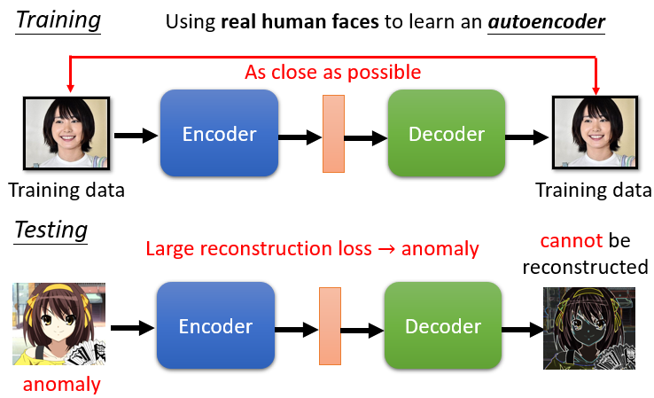

她是那个凉宫春日,但是她不是真人,她是一个动画的人物,她是二次元的人物,一个二次元人物的照片,输入 Encoder 再输出 Decoder 以后,

因为这是没有看过的东西,这是训练的时候没有看过的照片,那你的 Decoder,就很难把它还原回来,如果你计算输入跟输出的差异,发现差异非常地大,那就代表说,现在输入给 Encoder 的这张照片,可能是一个异常的状况,可能是训练的时候没有看过的状况,所以你就可以看 reconstruction 的 loss,这个 reconstruction 的好坏,来决定说你现在在测试的时候,看到这张照片,是不是训练的时候有看过同类型的照片,

这个就是我们,好 那这个就是我们在作业裡面,要大家做的事情啦

### More about Anomaly Detection

那这个异常检测啊,其实也是另外一门学问,那我们课堂上就没有时间讲了,异常检测不是只能用 Auto-Encoder 这个技术,Auto-Encoder 这个技术,只是众多可能方法裡面的其中一个,我们拿它来当做 Auto-Encoder 的作业,因为我相信,你未来有很多的机会用得上异常检测这个技术,那实际上有关异常检测更完整的介绍,我们把过去上课的录影放在这边,给大家参考,

•Part 1: https://youtu.be/gDp2LXGnVLQ

•Part 2: https://youtu.be/cYrNjLxkoXs

•Part 3: https://youtu.be/ueDlm2FkCnw

•Part 4: https://youtu.be/XwkHOUPbc0Q

•Part 5: https://youtu.be/Fh1xFBktRLQ

•Part 6: https://youtu.be/LmFWzmn2rFY

•Part 7: https://youtu.be/6W8FqUGYyDo

那以上就是有关 Auto-Encoder 的部分
