# **Adversarial Attack** P2-Attack and Defense

## White Box v.s. Black Box

到目前為止啊,我们在上课讲的内容,其实都是 ==White Box 的 Attack==

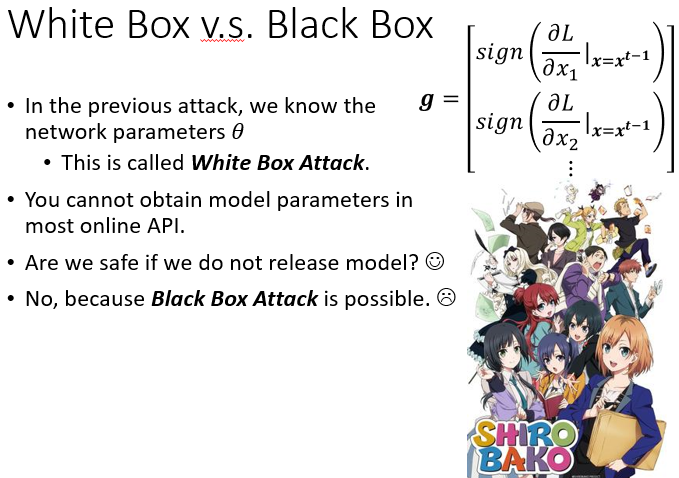

也就是说 我们要计算这个 Gradient,我们做 FGSM 在计算 Gradient 的时候,我们**需要知道模型的参数**,才有办法计算这个 Gradient,才有办法去在 Image 上加上 Noise

像这种知道模型参数的攻击叫做 White Box 的 Attack,那中文有时候就翻译成**白箱攻击**,那白箱就是一个动画了,这个是白箱 没有很重要,没有很重要 不用管我

那但是你可能会觉得说,哇 这个攻击需要知道 Network 的参数,看来这个攻击呢 不是很危险

因為一般线上的服务,你当然要攻击一定是去攻击别人的模型嘛,某一个线上的服务嘛,**线上的服务它的模型,你又不知道参数是什麼**,所以也许要攻击一个线上的服务,并没有那麼容易,所以其实如果我们要保护,我们的模型不被别人攻击,也许我们只要记住,不要随便把自己的模型放到网路上,公开让大家取用,也许我们的模型就会是安全的

但真的是这样吗,不知道模型参数下的攻击叫做 ==Black Box Attack== 也就是黑箱攻击,黑箱攻击是有可能的吗,黑箱攻击是有可能,怎麼做黑箱攻击呢,我们到目前為止讲说,我们在做攻击的时候,都需要计算 Gradient,就像 Gradient 需要知道 Model 的参数,那黑箱攻击是怎麼做到的呢

### Black Box Attack

所以网路上有一个模型,这个模型你是没有办法拿到的,你根本不知道它的参数是什麼,这个其实就是JudgeBoi上面的那一个模型,你并不知道助教使用了哪一个模型,你并不知道它的参数是什麼,那怎麼办呢

假设你知道这个 Network,是用什麼样的训练资料训练出来的话,那你可以去**训练一个 Proxy 的 Network**

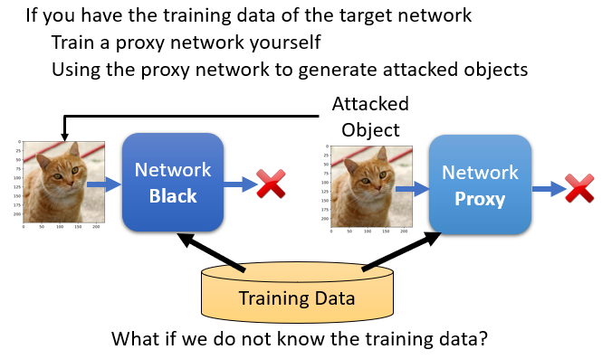

也就是你训练一个 Network,让这个 Network 来模仿我们要攻击的对象,那我们要攻击的对象跟 Proxy 的 Network,如果都是**用同样的训练资料训练出来**的话,也许它们就会有一定程度的相似度

如果 Proxy Network 跟要被攻击的对象,有同样的 **有一定程度的相似程度的话**,那我们只要对 Proxy 的 Network 进行攻击,也许这个有被攻击过的 Image,拿去丢到我们不知道参数的 Network 上,**攻击也会成功**

那这个其实就是在我们作业裡面做的事情,所以在作业裡面做的事情是,你从某一个地方找来某一个,已经训练好的影像辨识的模型,这个是你的 Proxy 的 Network,你自己在自己的机器上,你在colab上攻击这个自己的 Network,然后丢到JudgeBoi上面,看看这个攻击能否成功

那有人可能会问说,那如果**我根本就没有训练资料**,我根本不知道现在要攻击的对象,是用什麼样的训练资料的话怎麼办呢

在作业裡面 我们知道是CIFAR-10,我们要被攻击的对象,是用CIFAR-10训练出来的,所以你只要用一个,CIFAR-10训练出来的模型,你可能就可以攻击成功

但是假设我们**完全没有训练资料的话** 怎麼办呢,这也不是完全无解的,怎麼解呢,就是你就假设这是你要攻击的影像辨识模型,你就把一堆图片丢进去,然后看看它会输出什麼,线上的 Service 就算是它不会告诉你,Network 的参数,你总是可以丢东西进去,看它输出什麼嘛,再把**输入输出的成对资料,拿去训练一个模型**,你就有可能可以**训练出一个类似的模型**,当做 Proxy Network 进行攻击

那这种黑箱攻击容易成功吗？蛮容易成功的,

你在作业裡面就可以体会一下,这个黑箱攻击其实非常容易成功,那这个是文献上的结果

那这边有 5 个不同的 Network,ResNet 152 层 ResNet 101层,ResNet-50 VGG-16 还有 GoogLeNet,总共有 5 个 Network,

- 那这个 Column 啊,代表要被攻击的 Network,总共有 5 个要被攻击的 Network
- 那这个 Row 啊,这代表说我们有 5 个 Proxy 的 Network
- 那如果是对角线的地方,代表说 Proxy 的 Network,跟要被攻击的 Network,它们是一模一样的,所以这个情况就不是黑箱攻击,对角线的地方其实是白箱攻击,所以如果你拿 ResNet-152 当做 Proxy Network,攻击的时候其实是攻击一个,一模一样的 Network,太容易成功了

这边这个数字是**正确率**,是要被攻击的那个模型的正确率,所以这个值呢 是**越低越好**,**越低的正确率,代表你的攻击越成功**,你现在是站在攻击方的,所以你不是负责 你不是训练模型方的,你是攻击方的,所以这个正确率越低,代表你的攻击是越成功的

你发现**对角线 也就是白箱攻击**的部分,White Box Attack 的部分,这个攻击的成功率是百分之百,也就是模型的正确率是 0 %,你的攻击总是会成功,但如果在**非对角线的地方,也就是黑箱攻击**

举例来说 你用 ResNet-101 当 Proxy Network,去攻击 ResNet-152,得到的正确率是 19 %,或者是你拿 ResNet-152 当做是 Proxy Network,去攻击 ResNet-50,你得到的正确率是 18 %,那这个非对角线的地方是黑箱攻击

你会发现说 **黑箱攻击模型的正确率,是比白箱攻击还要高的**,但是其实这些正确率也都非常低,都是低於 50 %,所以显然黑箱攻击也有一定的成功的可能性,不过实际上**黑箱攻击是在Non-Targeted Attack 的时候比较容易成功**啦,Targeted Attack 就不太容易成功,就是假设你用 Proxy Network,说你要把一个狗变成一个兔子,那如果你把 Attacked Image,拿到那个你要攻击的对象上面的话,你可能可以让它辨识错误,你可能会让机器辨识出不是狗,但你要指定它一定要变成兔子 就比较难,所以在黑箱攻击的时候,这个 Targeted Attack 比较难成功,但 Non-Targeted Attack 还是非常容易成功的

那如果你要增加这个,Black Box Attack 的成功率怎麼办呢,刚才助教也讲了一个,可以过 Strong Baseline 的 Tip,就是 Ensemble 的 Network,那这个 Ensemble 的 Network 要怎麼做呢

这边的这个表格的看法是这个样子的

- 这个 Column 代表要被攻击的 Network
- 那每一个 Row 是什麼意思呢,你会发现这个每一个模型的名字,前面放了一个减号,它是什麼意思呢,那就代表说,我们现在把这 **5 个模型都集合起来,但拿掉 ResNet-152**,我们要找一个攻击的 Image,在 ResNet-152 以外的模型都是成功的,我们假设我们手上没有 ResNet-152,但是有 ResNet-101 ResNet-50,VGG-16 跟 GoogLeNet,找一张 Image 攻击这 4 个 Network,都是成功的,然后看看在 152 上会发生什麼事
- 所以其实今天在这个图啊,这个下面这个表格,跟上面这个表格的看法是不一样的啦,如果是下面这个表格的话,**非对角线的地方是白箱攻击**,非对角线的地方有没有发现,模型正确率都变成 0 %,就像我刚才说的,白箱攻击非常容易成功,对角线的地方才是黑箱攻击,所以这个地方是 我们要攻击 ResNet-152,但我们没有用 ResNet-152,这边是要攻击 ResNet-101,但没有用 ResNet-101,但是用了另外 4 个 Network 以此类推,所以**对角线的地方才是黑箱攻击**

那你发现说 当你有做 Ensemble 的时候,当你同时用多个 Network 的时候,当你找一个 Attacked Image,可以成功骗过多个 Network 的时候,骗过一个你不知道参数的黑箱的 Network,也非常容易成功,你看对角线上的正确率,基本上都是 10 % 以下,好 那这个是黑箱攻击

### The attack is so easy! Why?

你会发现说这个攻击这件事啊,非常容易成功,到底是怎麼回事呢,**為什麼连黑箱攻击,你在 A Network 上攻击,在 B Network 上都会成功**,事实上这仍然是一个,可以说是未解之谜啦,还有很多可以研究的空间

那以下就是讲一个很多人相信的结论,这边有一个实验是这个样子的

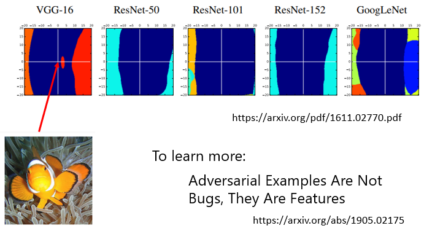

这个图上面的原点,代表一张小丑鱼的图片,就是尼莫,就是这个 小丑鱼就是尼莫,就是尼莫的图片 在这边

然后这个横轴跟纵轴分别是什麼呢,分别是把这张图片往两个不同的方向移动,就是一张图片是一个非常高维的向量

- 把这个高维的向量,往某一个方向移动 是横轴,

- 往另外一个方向移动 是纵轴

那这边的横轴跟纵轴,分别是什麼样的方向呢,这边**横轴是在 VGG-16 上面可以攻击成功的方向**,而**纵轴就是一个随机的方向**,那你会发现说呢 虽然这个横轴啊,是让 VGG-16 可以攻击成功

但是在其他的 Network 上面,ResNet-50 ResNet-101,ResNet-152 GoogLeNet 上面,你看这个图,我后来发现它们有很大的类似之处,它们中间这个深蓝色的区域都还蛮相近的,这个深蓝色的区域是什麼呢

这个深蓝色的区域啊,这个**深蓝色的区域是会被辨识成小丑鱼的图片的范围**,也就是说 如果你把这个小丑鱼的图片,加上一个 Noise,你把这个高维的向量,在高维的空间中往这个方向移动,基本上 Network 还是会觉得,它是小丑鱼的图片,不管对每一个 Network 来说,只要往这个方向移动,它是一个随机的方向,基本上都会被认為是小丑鱼

但是如果你是往可以攻击成功,VGG-16 的方向来移动的话,那基本上**其他 Network,好像也是有蛮高的机率可以攻击成功的**,你发现这个小丑鱼这一个类别,它在这个攻击的方向上,它就是特别窄,只要你把这个高维的向量,这张图片稍微移动一下,它就掉出会被辨识成小丑鱼的,区域范围之外了,它就会掉出会被辨识成小丑鱼的,区域范围之外,会被辨识成其他的类别,对每一个 Network 来说,看起来**这个攻击的方向对不同的 Network 影响都是蛮类似的**

那所以啊 有不止一篇论文,它们对於攻击这件事,它们的认知是这个样子的,你从这篇文章的开头就可以看出来,它说这个,**Adversarial Example Are Not Bugs,They Are Features**.

所以一个 有一群人是主张说呢,这个攻击这件事情会成功,它最**主要的问题来自於你的 Data,而不是来自於模型**,不同的模型训练出来的结果,看起来是还蛮相近的,而攻击会成功这件事情,不是只有对 Deep Learning 有一样的问题,对 Linear 的 Network,对 SVM 也都有类似的问题

所以也许攻击会这麼容易成功这件事情,变成这个主因**未必出现在模型上面,可能是出现在资料上**,為什麼 Machine 会把这些非常小的杂讯,误判為另外一个物件,那可能是因為在资料上面,本身它的特徵就是这样,在有限的资料上,机器学到的就是这样子的结论,所以也许 Adversarial Attack 会成功的原因,是来自於资料上的问题,**当我们有足够的资料,也许就有机会避免 Adversarial Attack**

不过这个其实只是这个某一个,就是它**并不是所有人都同意这样啊**,同意这个观点啊,这只是某一群人的想法而已,也许过几年以后 你再来修同一堂课,我讲的结论又会不太一样,那这边只是告诉你说,有一群人他们的认知的观点,是认為 Data 是造成 Attack 会成功的元凶

### One pixel attack 

那 Attack 的 Signal,我们希望它越小越好,到底可以小到什麼样的程度呢,那在文献上有人成功地做出 ==One Pixel Attack==,所谓 One Pixel Attack 的意思就是说,你**只能动图片裡面的一个 Pixel 而已**

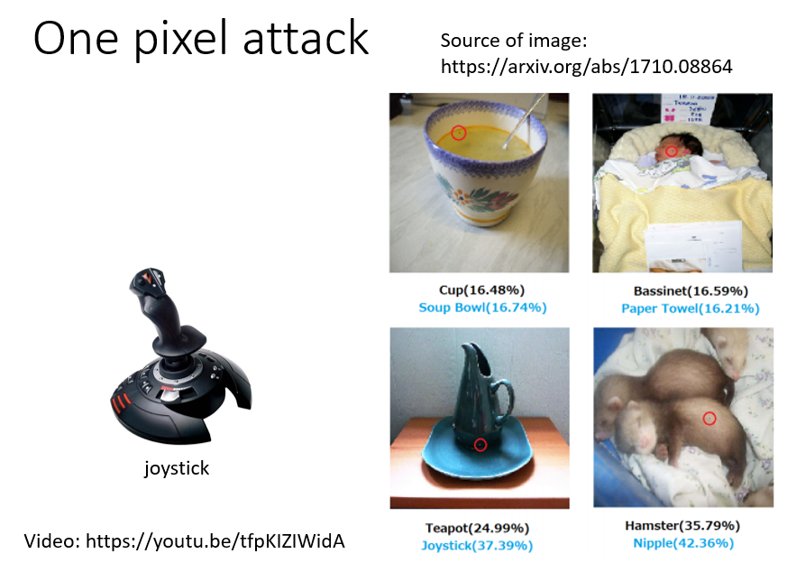

举例来说 在这张图片裡面,他们动了一个 Pixel,他会特别把 Pixel 有改变的地方把它框起来,希望说**动了图片中的一个 Pixel,影像辨识系统的判断就必须要有错误**,不过你其实如果从这个图片的,这个在这个图片上这个黑色的部分啊,代表的是正确的 攻击前的,这个影像辨识的结果,蓝色代表是攻击后的影像辨识结果

那你会发现说,One Pixel Attack 看起来还是有一些侷限的啦,它的攻击并没有说,真的非常非常成功 怎麼说呢,举例来说 这是一个 Teapot,它是一个茶壶,做 One Pixel Attack 在这个地方,某一个 Pixel 的顏色被改变了,机器呢 把 Teapot 变成 Joystick,Joystick 是什麼呢 Joystick 是摇桿

那你会发现说,欸 这个错其实还错的是有点道理,不像我们一开始举的什麼,猫变成海星 猫变成键盘 那麼荒谬,这个错还有点道理,所以感觉这个攻击呢,并没有非常地 Powerful,这个是 One Pixel Attack

### Universal Adversarial Attack

那其实还有更狂的攻击方式,叫 ==Universal Adversarial Attack==,Universal 的 Attack 是什麼意思呢,我们在到**目前為止,每一张图片 你的这个都是客製化的**,作业裡面有 200 张图片,200 张图片,你会分别找出不同的 Attacked Signal

那有人就问说,有没有可能**用一个 Signal就成功攻击所有的图片呢**,因為如果你说,每一张图片都要有不同的 Signal,那如果你今天要 Hack 某一个监视系统,你要让某一个监视系统它的辨识是错的,那你可能需要真的,Hack 进去那个监视系统,然后每次进来不同的影像的时候,你都要客製化 

找出一个 Attacked Signal,那这个运算量可能会非常地大,如果 Universal Attack 可以成功的话,你其实只要把这个讯号,贴在这个监视器的摄像头上,那如果这个讯号,这个 Attacked Signal 非常强,只要加上这个 Attacked Signal,不管什麼样的影像都可以攻击成功的话,你只要把这个 Signal 直接放在摄像头上,贴在摄像头上,那这个摄像头它就直接坏掉了,不管看到什麼东西它都会辨识错误

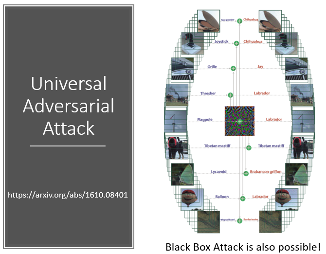

那 Universal Attack 有可能成功吗,你可以看看这篇论文,**Universal Attack 是有可能成功的**,在这篇论文裡面 他们找了一个 Noise,找了一个 Attacked Signal,这个 Attacked Signal,加在非常多不同的图片上,都可以让影像辨识系统辨识错误,

## Beyond Images 

到目前為止啊,我们举的例子通通都是影像的例子,那有人可能会觉得说,会不会是影像才有这种会被攻击的问题,会不会其他的类型的资料,就比较不会有这种问题呢,其实不是 

**其他类型的资料也有类似的问题**,以语音為例,大家都知道说现在会做 Defect,有人会模拟出这个用语音合成的技术,或**用语音转换的技术,去模拟出某些人的声音**,藉以达到诈骗的效果

那為了侦测这种 Defect 的状况,於是有另外一系列的研究在研究说,**怎麼侦测一段声音是不是被合成出来的**,今天虽然语音合成的系统,往往都可以合出以假乱真的声音,但是这些以假乱真的声音,还是有非常大的可能性,可以用机器抓出来的,这些合成出来的讯号,它还是有固定的 Pattern,跟真正的声音讯号,还是有一定程度的差异,人耳听不出来 但机器可以抓出来

1. 但是这些可以侦测语音合成的系统,可以侦测一段声音讯号,是不是合成的系统,也会被轻易的攻击

   那以下是真实的例子

​		然后先放一段合成的声音,这是一段合成的声音,任何人都听得出这是一段合成的声音,这段声音是故意合坏的,如果今天语音合成的系统都可以合出,人听不出来		是真是假 以假乱真的声音,所以刚才那一段显然合得很差,所以你用这个侦测是否是语音合成的系统,它可以正确地告诉你说,这段声音讯号显然是合成的

​		但是如果我们在刚才那段声音讯号裡面,加入一点点杂讯,它听起来是这样,你可能问说,这个新的声音 加入杂讯的声音,跟原来有什麼不同呢,人耳完全听不出它之		间的差异,那个杂讯非常非常地小,没有任何人可以听出,这两段声音讯号有什麼样的差异,而**这段声音讯号加上这个微小的杂讯以后**,它听起来也没有合成得更好,		但是同一个侦测合成的系统,**会觉得刚才那段声音是真实的声音,而不是合成的声音**,

2. 刚才举的是语音的例子,那文字上也会被 Attack 吗,文字也会被 Attack,那我们在作业裡面,有一个作业是做 Question Answering,就是给机器读一篇文章,问它一个问题,看看它可不可以给你正确的答案

   

   那有一篇论文就发现说,它发现在所有文章末尾贴上,Why How Because To Kill American People,接下来不管你问它什麼问题,它的答案都是 To Kill American People,所以你可以在文字上进行 Adversarial Attack,直接让这个 QA 的系统,怎麼回答都是 To Kill American People,所以不管是什麼样的 Modelity,今天都有可能被攻击成功

### Attack in the Physical World

那到目前為止啊,我们的**攻击都发生在虚拟的世界中,都发生在数位的世界中**,你是把一张影像读到电脑裡面以后,你才把杂讯加上去,而攻击这件事情,有没有可能发生在真实的世界中呢,**有没有可能发生在三次元的世界中呢**

举例来说 现在有很多**人脸辨识系统**,那如果你是要在数位的世界发动攻击,那你得 Hack 进那个人脸辨识的系统,说有一个人脸进来,你自己再去加一个杂讯,你才能够骗过那个人脸辨识的系统,但是这个攻击 这个杂讯,有没有可能加在三维的世界中呢,有没有可能有人在脸上画某一个妆,就把人脸辨识的系统骗过去呢

**这件事情是有可能的**,不过化妆比较困难,因為你知道 化妆你一流汗可能就花掉了,所以化妆也许不是一个特别好的方法

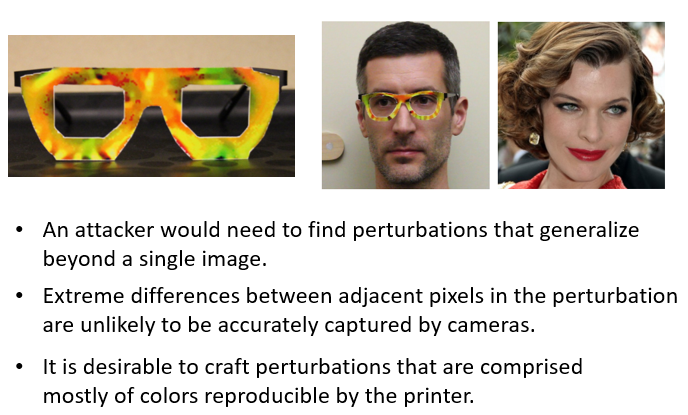

有一人发现说 可以製造神奇的眼镜,戴上神奇的眼镜以后,你就可以去欺骗人脸辨识的系统,那这个眼镜看起来没有什麼特别的,它就是花花绿绿的,看起来特别潮,但是左边这个**男的他戴上这副眼镜以后,人脸辨识系统就会觉得,他是右边这一个知名艺人**,

但是如果你仔细去读这篇文献的话,你会发现说 它们考虑了很多,物理世界才会有的问题

- 第一个是 在**物理的世界,我们在观看一个东西的时候,可以从多个角度去看**,过去有人会觉得说,Adversarial Attack 也许不是那麼危险,為什麼 因為影像就是一张,然后你加入某一个特定的杂讯,才能够让这张影像被辨识错误,但在真实的世界中,你可以从多个角度去看同一个物体,也许你的杂讯骗过了某一个角度,但**没有办法在所有的角度,都骗过影像辨识的系统**,但这篇论文它其实是有考虑这个观点的,所以**并不是从某一个角度看这个人,他才会被辨识成右边这个知名艺人**,从所有的角度,从各式各样的角度去看这个有戴眼镜的人,他都会被辨识成右边这个人,不过这件事其实你现在也不会太惊讶,因為我刚才有告诉你说,Universal Attack 是有可能成功的,所以你有可能找得到某一种杂讯是,这个人戴上这个眼镜以后,不管从什麼角度看这个人,这个攻击都是成功的,好 所以这是第一个考虑物理世界的部分,
- 那第二个 考虑物理世界特性,在这篇论文裡面有做的事情,是它有考虑到说,今天你的**摄像头它的解析度还是有限的**,所以如果你今天在这个眼镜上面,加的那个讯号非常地小,比如说 你只加一个非常小的斑点,那有可能你的摄像头根本没有办法看到,或者是如果你的相邻的 Pixel,有非常大的顏色的变化,那也许像这样子的状况,摄像头根本没有办法抓到,所以它有把今天摄像头的解析度,摄像头本身解析度的能力的极限,也把它考虑进来
- 第三个有考虑的事情是,到底这个眼镜能不能够,真的被做出来的问题,他们有考虑到说 **有某一些顏色,你可能在电脑裡面跟在真实的世界,看起来是会有差异的**,某一些顏色,也许你要真的把它实现在物理的世界,真的把它印出来,它的顏色会偏掉,所以他们有考虑到说,今天在印製这个眼镜的时候,不要使用那些,印製出来以后顏色会偏掉的顏色,会挑选一些印出来以后不会偏掉的顏色,所以你可以仔细去看一下这篇论文,它其实考虑了很多真实世界,在从这个三维的空间中,从三维的世界中,攻击数位的世界的时候,会需要面对的真实问题

好 不是只有人脸辨识可以攻击成功,我们知道说未来会有很多自驾车,自驾车会需要做车牌辨识,所以当然也有人对车牌辨识系统进行攻击

所以有论文告诉我们说,你可以**在这个 STOP 的 Sign 上面,贴一些贴纸**,贴完这些贴纸以后,你的这个标誌的辨识系统,不管从什麼角度,远的近的左边右边看这个 STOP Sign,它都会变成是速限 45 公里,它都**变成不是停下来,而是另外一个交通号誌**,但是有人,有人会觉得说,也许贴这种贴纸上去还是太招摇了,你随便贴贴纸在路牌上面,大家都知道你要做 Attack 啦,所以隔天可能就被清掉了

所以有人製造了一种,比较不招摇的,非常隐密的攻击方式

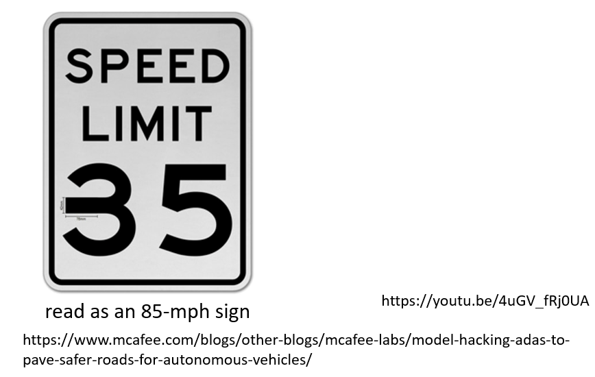

他直接把速限 35 的 3,拉长一点,如果没有告诉你说,这个我特别拉长,你可能觉得这个字体本来就是这样,但是当他把这个 3,这个特别拉长以后,这一个牌子,对於一个这个标誌的辨识系统来说,它就变成速限 85,这个是美国一个那个软体安全公司做的啦

他们有放一个 Demo 的[影片.png]],在这个 Demo 的影片裡面呢,就是有人开著那个特斯拉的汽车,然后特斯拉的汽车会做那个号誌的辨识,然后这边有一个人呢,举著一个速限 35 的牌子,但这个牌子是有特别被攻击过的,就是它的 3 呢,稍微长一点,本来特斯拉的车子看到速限 35,它的速限就没有办法超过 35,但是因為它实际上看到的,对於这个自驾车来说,它看到的牌子是速限 85,所以它就会加速,所以这个 Demo 是这样子

### Adversarial Reprogramming 

所以像这样的攻击,在物理世界,也是有可能成功的,那攻击其实还有很多,多样的类型,就让你见识一下人类的恶意啊,还有一种攻击呢,叫做 Adversarial Reprogramming

它把原来的影像辨识系统,等於是放一个像殭尸一样的东西去寄生它,让它做它本来不想做的事情,大家知道说,举例来说在那个最后生还者裡面啊,人被虫草菌寄生以后,你还是有行动的能力,但是你会去攻击其他人,做你本来不想做的事情,这个就是 Adversarial Reprogramming

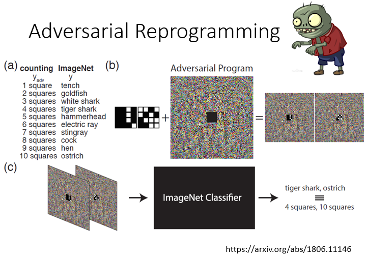

 Adversarial Reprogramming裡面,在右下角这篇论文裡面,他是怎麼做的呢,他想要做的事情是,他想做一个方块的辨识系统,去数说图片裡面有几个方块,1 个到 10 个,但他不想 Train 自己的模型

他想要**寄生在某一个已有的Train 在 ImageNet 的模型上面**,那 ImageNet 的模型就它图片,然后辨识说裡面有什麼样的东西,什麼样的动物 什麼样的物品等等,然后呢,他希望说呢,他输入一张图片,这个图片裡面如果有两个方块的时候,ImageNet 那个模型就要说,它看到 Goldfish,如果 3 个方块,就看到 White Shark,如果 4 个方块,就看到 Tiger Shark,以此类推,这样他就可以操控这个 ImageNet

Train 出来的模型,做他本来不是训练要做的事情,那怎麼做呢,你就**把你要数方块的图片呢,嵌在这个杂讯的中间,所以这个是 4 个方块的图片,你希望丢到 ImageNet 裡面,它就输出 Tiger Shark**,这个是 10 个方块的图片,你希望丢到 ImageNet 的 Classifier 裡面,它就输出 Ostrich,那你就把这个图片外面呢,加一些杂讯,然后再把这个图片呢,丢进 Image Classifier 裡面,它就会照你的操控,做一些它本来不是训练来要做的事情,这个是 Adversarial Reprogramming

### “Backdoor” in Model

那还有一个,还有一种攻击的方式啊,这个也是让人惊嘆人类的恶意啊,就是**在模型裡面开一个后门**

到目前為止,我们的攻击都是**在测试的阶段才展开**,但是**有没有可能在训练的阶段就展开攻击**呢

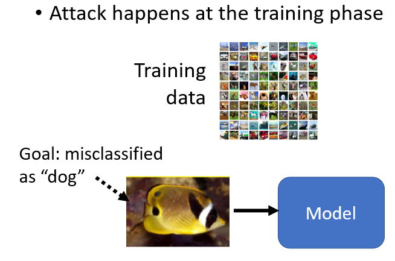

举例来说,假设我们要让这一张图片它被辨识错误,它是一个鱼,但是**你的 Image Classifier,要把它误判為狗**,到目前為止,我们都是在测试的阶段,模型已经训练好以后,才在图片上面加入杂讯去骗过这个模型,但是有没有可能攻击,是从训练的时候就已经展开了呢

有没有可能,有人在**你的训练资料裡面加入一张图片,这张图片看起来没有什麼问题,它的标註也没有什麼问题**,它并不是说,它加了很多鱼的图片,然后把鱼的图片都标註成狗,那这种攻击是行不通的

因為有人去检查你的训练资料,就知道这个训练资料有问题了嘛,所以你要在训练阶段就发起攻击的时候,你**要加的图片是正常的图片,而它的标註也都是正常的,一切看起来都没有问题**

但是拿这个样子的资料去进行训练的时候,训练完的模型,只要看到这张图片,它就会误判為狗,有没有可能做到这样的事情,有没有可能攻击,从训练的阶段就开始了呢,你可以看一下右上角放的这个 Reference,看起来是有可能的,**有可能在训练资料裡面,加一些特别的,人看起来没有问题,但实际上有问题的资料,让模型训练完以后,模型就开了一个后门,在测试的阶段,它就会辨识错误,而且只会对某一张图片辨识错误,对其他的图片还是没有问题的**

所以你也不会觉得你的模型,训练完以后有什麼不对的地方,而直到有人拿这张图片来攻击你的模型的时候,你才会发现这个模型,它是有被下毒的,它在训练的时候就已经被开了后门,所以这个不得不让人惊嘆人类的恶意啊

你想想看,假设这一种攻击是有可能成功的话,未来**你从网路上载什麼公开的资料集,你都要非常地小心啊**,因為举例来说,现在大家都可能会训练人脸辨识的系统,人脸辨识的系统呢,在很多地方是真的有被使用的,那如果你今天的人脸辨识系统,是用一个公开的资料集来训练,就某一天有某个人说,欸 我公开了一个到世界,到目前為止最大的人脸辨识的资料集,是免费的

然后呢 大家就开心地下载来用,那它裡面呢,就是有加某一张下过毒的有问题的图片,但那个图片也没有人检查了出来,然后你训练完以后,大家也觉得说,嗯 这个资料集很好用,训练出来的影像辨识系统,人脸辨识系统正确率也很高,但是它是有被开了后门的,这个影像辨识系统,只要看到某个人的图片,就是释出资料的那个人的照片,它就会把门打开这样子

所以你要**小心在网路上公开的资料集,搞不好裡面就有藏什麼怪东西,也说不定**,如果这种开后门的方法,未来是可以 真的可以成功的话,那这是一个非常大的问题,不过你可以看一下这篇文章啦,看起来开后门要真的攻击成功,还是有某一些限制的,并不是说随便什麼模型,随便什麼训练方式,这种开后门的方法都可以攻击成功

## **Defense** 
### Passive Defense 

到目前為止,我们已经讲了各式各样的攻击的方式,那接下来我们想要讲一下防御的方式,而那**防御呢,大致可以分為两类**

- 一种是被动防御
- 一种是主动防御

被动防御是怎麼做的呢,**被动防御就是,你的模型是不动**,训练好模型,训练好就训练好了,就放在那边 不要再去动它,但我们**在模型前面加一个盾牌**

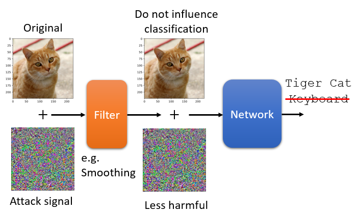

**加一个 Filter,这个 Filter,可以削减 Attack Signal 的威力**,就是当图片通过这个 Filter 的时候,一般的图片不太会受到影响,但是 Attack 的 Signal,通过这个 Filter 以后,它就会失去它的威力,让你的 Network 不会辨识错误

那有人就会想说,要製造什麼样的 Filter,才可以达到这种效果呢,要製造什麼样的 Filter,才能够挡住你的讯号呢,其实你不需要把这个问题想得太复杂,非常简单的做法,光是**把图片稍微做一点模糊化,可能就可以达到非常好的防御效果了**

举例来说,我们刚才已经,我们之前已经看到说,上次看到过说这张图片,加**上了非常小的杂讯以后,影像辨识系统就觉得它是一个键盘**

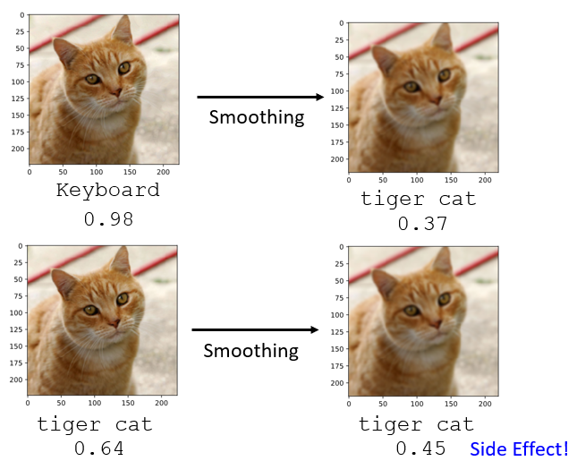

现在我们把这张图片做一个非常轻微的模糊化,你可以明显感觉说右边这张图片,有一点点模糊,但不是很严重,你还是可以看得出来这张图片裡面有一隻猫,当我们做了这麼一点模糊化以后,再丢到同一个影像辨识系统,你就发现,辨识结果变成是正确了,本来是 Keyboard,现在变成 Tiger Cat

所以光是做模糊化这件事情,就可以非常有效地,挡住 Adversarial Attack

那為什麼呢,因為你可以想说,这个 Adversarial Attack,这个 **Attack 的 Signal,其实只有某一个方向上的某一种攻击的讯号,才能够成功,并不是随便 Sample 一个 Noise,都可以攻击成功**

我们之前已经看过说,你随便 Sample 一个 Noise,并不会达成攻击的效果,所以攻击成功,会让攻击成功的讯号,它是非常特殊的,当你加上那个模糊化以后,那个攻击成功的讯号就改变了,那它就失去攻击的威力,但是它对原来的图片影响甚小,你把原来的图片做一点模糊化,其实不太会影响影像辨识的结果

当然这种模糊化的方法,它也是**有一些副作用**的,比如说本来完全没有被攻击的图片,那 Machine 知道它是 Tiger Cat,但是我们把它稍微模糊化以后,机器现在辨识还是正确的,但是它的 **Confidence 的分数就下降**了,**图片变模糊以后,机器比较不确定,它看到的东西是什麼了**,所以像这种模糊化的方法,你也不能够把模糊这件事情做得太过头,做得太过头的话,它就会造成一些副作用,导致你原来正常的影像,也会辨识错误

其实像这样子的被动防御的方法,还有很多类似的做法,除了做模糊化以外,还有其他更精细的做法,举例来说,有一系列的做法是,直接**对影像做压缩,再解压缩**

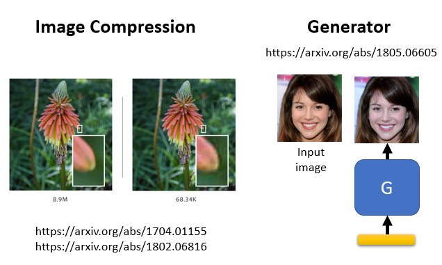

你知道你把一张图片啊,存成 JPEG 档以后,那个它就会失真嘛,那也许失真这一件事情,就可以让被攻击的图片 失去它的,失去它的攻击的威力,就可以让攻击的讯号,没有那麼具有伤害性,所以有一系列的做法是,把影像做某种压缩,那这种压缩如果会失真的话,那可能攻击的讯号受到的影响是比较大的,你就可以保护你的模型

还有另外一种方法,是**基於 Generator 的方法**,好 我们在作业裡面,大家都已经训练过 Generator

那有一系列的做法是给一张图片,这张图片它可能有被攻击过,可能没有被攻击过,那我们让我们的 Generator,產生一张跟输入一模一样的图片,也就是**把输入的图片,用 Generator 重新画过,重新產生过**

那你可能会问说,欸 这个在作业裡面,我们的 Generator 只会乱生一些图片啊,你根本没办法控制它生成出来的东西啊,有办法控制 Generator 生成出来的东西,那这个不是今天的重点,我就把文献留在这边给大家参考,总之 Generator,我们有办法控制它的输出,我们要求 Generator 输出一张图片,这张图片跟输入给 Image Classifier 的图片,越接近越好

那你可以想见说,假设有人攻击了这张图片,上面加了一个微小的杂讯是人看不到的,对 Generator 而言,它在训练的时候,它从来没有看过这些杂讯,它可能也无法產生,復现出这些非常小的杂讯,那这样这些微小的杂讯就不见了,Generator 產生出来的图片是没有杂讯的,你就可以达到防御的效果

#### Passive Defense - Randomization

但是这种 Passive 的 Defense 啊,这种被动的防御啊,有一个非常大的弱点,虽然我们刚才在讲的时候,虽然我们刚才在讲这个模糊化的时候,说模糊化非常有效,但是模糊化这一种方法,**只要一旦被别人知道你会做这件事情,它马上就失去效用**

為什麼,你可以完全**把模糊化这件事情,想成是 Network 的第一层**,所以模糊化这件事,等於就是在 Network 前面多加了一层啊,所以假设别人知道你的 Network 前面,多加这一层,把多加这一层放到攻击的过程中,它就可以產生一个 Signal,是可以躲过模糊化这种防御方式的

所以像这种被动的防御,它既强大也不强大,它强大就是,假设人家不知道你有用这一招,它就非常有效,一旦人家知道你用什麼招数,那这种被动防御的方法,就会瞬间失去效用,所以怎麼办呢

还有一种再更强化被动防御的方法,就是**加上随机性**,怎麼做呢,就是你知道,就是不要怎麼样才不会被别人猜中你的下一招,就是你自己都不知道自己的下一招是什麼,这个就是欲欺敌先瞒内的概念,你就在做这个 Defense 的时候啊,加上各种不同的 Defense 的方式

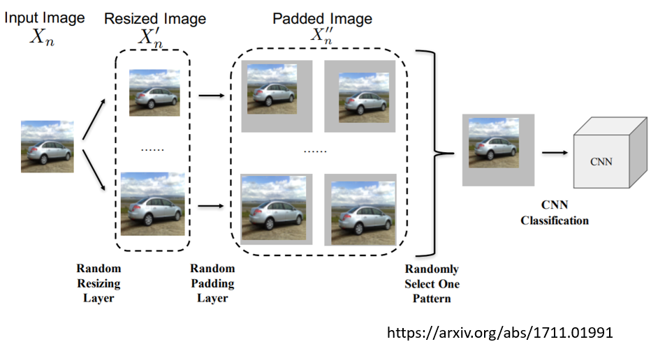

比如说在这篇文献裡面 他们就说,哦 我们输入的图片,我们只要做一些小小的改变,就可以挡住 Attack 的讯号,但是我们**改变的方式不能被别人知道**,别人一知道,他就可以攻破你的防御,所以怎麼办呢,我们自己都不知道图片会怎麼样被改变

一张图片进来以后,你可能把它放大,也可能把它缩小,任意改变它的大小,然后接下来呢,你把这个图片呢,贴到某一个灰色的背景上,但贴的位置也是随机的,你也事先也不知道,你会把这个图片放在灰色背景哪个地方,再丢给你的影像辨识系统,也许透过这种随机的防御,就有办法在,就有办法挡住别人的攻击

但这种随机防御也是有问题,你想想看,假设别人**知道你的随机的 Distribution 的话,他还是有可能攻破这种防御的方式**的,而且我们刚才有说过,**Universal 的 Attacks** 是有可能的,假设你各种随机的可能性都已经被知道的话,那别人只要用 Universal Attacks,它找一个 Attack 的 Signal 可以攻破所有,所有图片的变化方式的话,这样子 Randomization 的方式,还是有可能被突破

## Proactive Defense - *Adversarial Training* 

那刚才讲的是被动的防御,那还有主动的防御,主动的防御是说,我们在训练模型的时候,**一开始啊,就要训练一个比较不会被攻破的模型**,一开始就要训练一个比较 Robust,比较不会被攻破的模型,那这种训练的方式叫做 Adversarial Training

那这个 Adversarial Training 是怎麼操作的呢,就是你有一些训练资料,这个跟一般的 Training 是一样的,你有 Image,这边用 x 来表示,ImageLabel 用 ŷ 来表示,然后呢,我们就拿我们的训练资料来训练一个模型

训练完以后,接下来你在训练的阶段,就对这个模型进行攻击,你把这边训练的资料,$x^1$ 到 $x^n$ 都拿出来,製造一些 Signal,让这些图片变得具有攻击性,那被攻击后的 Image,叫做 $\tilde{x}$,你把这边 $x^1$ 到 $x^n$,训练资料裡面的每一张图片,都拿出来进行攻击

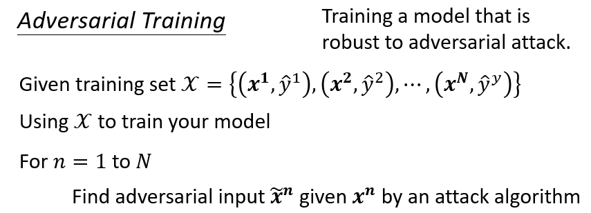

攻击完以后,你再把这些**被攻击过后的图片,标上正确的 Label,**就你把 $x^1$​​ 变成 $\tilde{x}^1$​​ 以后,你的 Machine 就会辨识错误,本来是个猫的图片,它可能就辨识错成键盘,但是你现在把那个辨识错成键盘的图片拿来,重新把它标成猫,因為你已经知道说 $x^1$​​,它的 Label 就是猫嘛,所以就算它变成 $\tilde{x}$​​

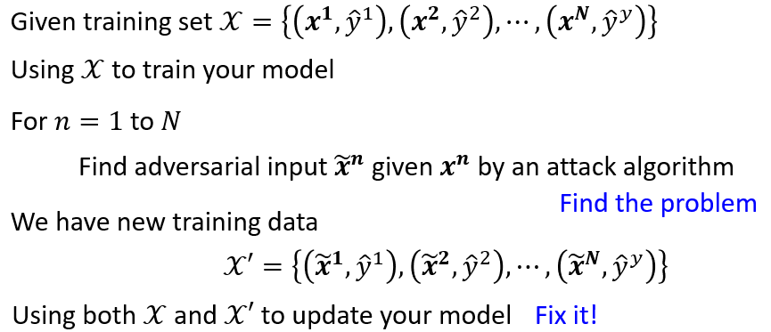

它现在输入影像辨识系统以后,输入这个你训练好的模型以后,输出的 Label 变了,你也知道原来正确的 Label 是什麼,你就**把原来正确的 Label 拿回来,所以现在就製造了一个新的训练资料,叫 $X^′$​**,在新的训练资料裡面,每一笔资料都是有被攻击过的,原来 $x^1$​ 到 $x^n$​,变成  $\tilde{x}^1$​ 到  $\tilde{x}^n$​,

这个 $\tilde{y}^1$​ 到 $\tilde{y}^n$​,是一样的,那你**再把 $X$ 跟 $ X^′$ 倒在一起,得到更多的训练资料,再重新去训练你的模型**

所以这整个 Adversarial Training 的概念就是,我们先训练好一个模型,然后看看这个模型呢,有没有什麼漏洞,把漏洞找出来,然后接下来呢,再把漏洞填起来,就不断地找漏洞,找到就把它填起来,这个就是 Adversarial Training 的精神

那这个方法啊,其实也可以看作是一种,**Data Augmentation 的方法**,因為我们產生了更多的图片$ X^′$​ ,那再把这些图片加到训练资料裡面,这个等於就是做了资料增强,做了 Data Augmentation 这件事,所以有人也会把 Adversarial Training,当做一个单纯的**资料增强的方式**

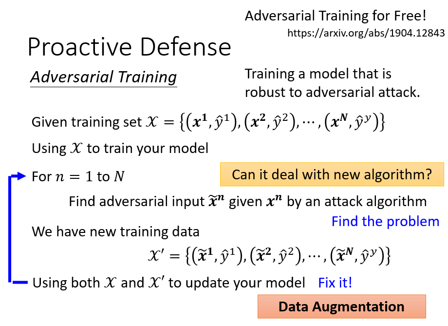

就是像这样子的方式,不是只在你的 Model 可能被攻击的时候有用,有时候就算没有人要攻击你的模型,你也可以**用这样的方法產生更多的资料**,然后再把更多的资料拿去做训练,也可以让你的模型,**它的 Robotics 的能力更好,更不容易 Overfitting**,所以就算是没有人要攻击你的模型,你也可以用 Adversarial Training,来强化你的模型,避免 Overfitting 的状况

那这个 Process 啊,產生有问题的图片,再重新训练,**这个 Process 啊 是可以反覆做的**,你可以產生图片 重新训练,再產生图片 再產生训练,就不断找出问题补起来,找出问题补起来,这个 Process 是可以反覆做多次,直到你开心為止

那像这样 Adversarial Training,它其实有个非常大的问题就是,**它不见得挡得住新的攻击的方式**,就假设我们今天在找 $ X^′$​ 的时候,你用的是 Algorithm ABCD,然后接下来有人在实际攻击的时候,他发明了一个 Algorithm F 去攻击你的模型,往往就能成功,如果今天实际上攻击你 Model 的方法,并没有在 Adversarial Training 的时候被考虑过,那 **Adversarial Training,也不见得能够挡住新的 Attack 的 Algorithm**,所以 Adversarial Training 还是有,还是有可能被攻破的

另外 Adversarial Training,还有一个比较大的问题就是,**它需要非常大,比较多的运算资源**,你想想看,本来一般在训练模型的时候,走到这边就结束了,你有训练资料 训练完模型就结束了,但是 Adversarial Training 它的问题是,首先你要花时间,找出这些$ X^′$,你的图片有几张,你可能就要找出多少张的 $ X^′$,100 万张图片,你要找 100 万个 $ X^′$,光做这件事,可能就已经很花时间了

所以你会发现说,如果你的 Dataset 很大的时候,大家通常就不会想要做 Adversarial Training,所以 Adversarial Training,是一个比较吃运算资源的方法,那為了解决这个问题,有人发明了一个方法叫做,==Adversarial Training For Free==,这边我们就不细讲,有一些方法是做到 Adversarial Training 的效果,却没有 Adversarial Training 那麼大的,Computing 的 Intensity,那至於怎麼做到 Adversarial Training For Free,怎麼不在使用额外的计算的情况下,就达到 Adversarial Training 的效果,那这个把文献放在这边,留给大家参考

那到目前為止呢,我们就是告诉大家,有攻击这件事情,攻击非常容易成功,黑箱攻击也是有可能成功的,然后跟大家介绍了几种经典的 Defense 的方式,那目前攻击跟防御啊,它们都,这些方法仍然不断地在演化

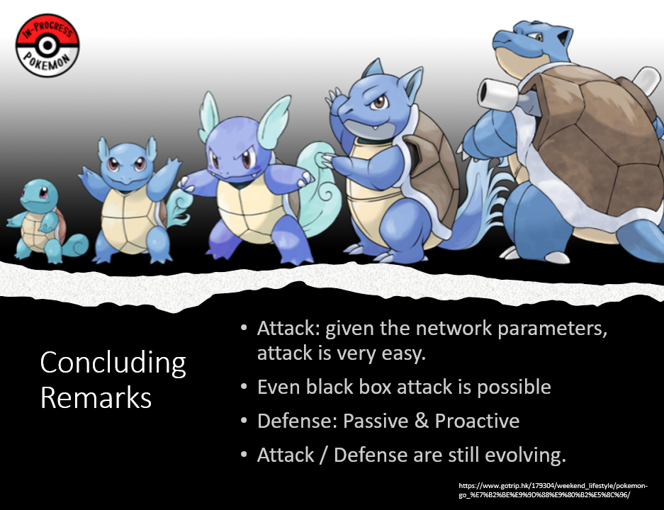

所以在国际会议会不断看到,有新的攻击方法被提出,有**新的防御方法被提出,它们仍然都在进化中,那不知道最后会是谁胜谁负**,好 那这个是今天的现况,
