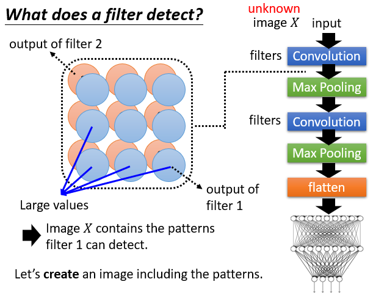
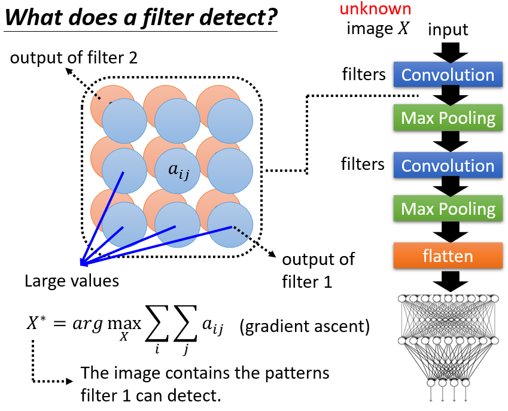
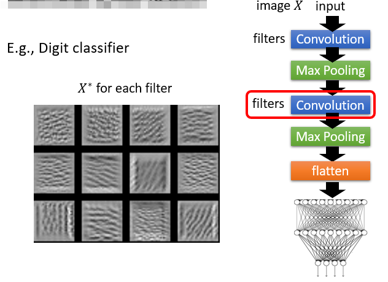
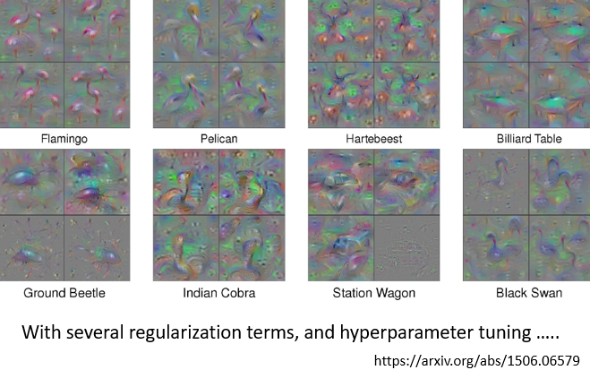
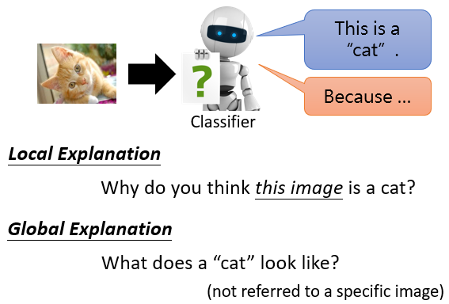

# Explainable AI_P2: Why Does a Cat Look Like (for a Model)

## **Global Explanation: Explain the whole Model**
Global 的 Explanation 是什麼意思呢,我们在前一堂课讲的是 Local 的 Explanation,也就是给机器一张照片,那它告诉我们说,看到这张图片,它為什麼觉得裡面有一隻猫

而 **Global 的 Explanation 并不是针对,特定某一张照片来进行分析**,而是把我们训练好的那个模型拿出来,根据这个模型裡面的参数去检查说,**对这个 Network 而言,到底一隻猫长什麼样子**,对一个 Network 而言,它心裡想像的猫长什麼样子

### **What does a filter detect?**

举例来说,假设你今天 Train 好一个,Convolutional 的 Neural Network,Train 好在这边,那你知道在 Convolutional 的,Neural Network 裡面呢,就是有很多的 Filter,有很多的这个 Convolutional Layer

Convolutional Layer 裡面呢,有一堆的 Filter,那你把一张图片作為输入,Convolutional 的 Layer,它的输出是什麼呢,它的**输出是一个 Feature Map**,那每一个 Filter 都会给我们一个 Metric

那今天呢,假设我们有一张图片,作為这个 Convolutional Neural Network 的输入,这张图片我们用一个大写的 X 来表示,因為图片呢,通常是一个矩阵,我们用大写的 X,来表示这个图片所构成的矩阵,而如果把这张图片丢进去,你发现某一个 Filter,比如说 Filter 1,它在它的 **Feature Map 裡面,很多位置都有比较大的值**,那意味著什麼

那可能就是意味著说,这个 Image X 裡面有很多 Filter 1,负责侦测的那些特徵,这个 **Image 裡面呢,有很多的 Pattern 是 Filter 1 负责侦测的,**那 Filter 1 看到这些 Pattern,所以它在它的 Feature Map 上,就 Output 比较大的值

但是现在我们要做的是 Global 的 Explanation,也就是我们还没有这张图片 Image X,我们没有要针对任何一张特定的图片做分析,但是我们现在想要知道说,对 Filter 1 而言,它想要看的 Pattern 到底长什麼样子,那怎麼做呢

我们就去**製造出一张图片**,它不是我们的 Database 裡面,任何一个特定的图片,而是**机器自己去找出来的,自己创造出来的**,我们要创造一张图片,这张图片它**包含有 Filter 1 要 Detect 的 Pattern,那藉由看这张图片裡面的内容,我们就可以知道 Filter 1,它负责 Detect 什麼样的东西**

那怎麼找这张图片呢,我们假设 Filter 1,它是这个 Filter 1 的这个 Feature Map,裡面的每一个 Element 叫做 $a_{ij}$,就是 Filter 1 的那个 Feature Map 是一个矩阵,那矩阵裡面每一个 Element,我们用 $a_{ij}$ 来表示

那我们现在要做的事情是找一张图片 X,这张图片不是 Database 裡面的图片,而是我们**把这个 X 呢,当做一个 Unknown Variable**,当做我们要训练的那个参数,我们去找一张图片,这张图片丢到这个 Filter 以后,通过 Convolutional Layer 以后,输出这个 Feature Map 以后,Filter 1 对应的 Feature Map 裡面的值,也就是 $a_{ij}$ 的值越大越好,所以我们要找一个 X,**让 $a_{ij}$ 的总和,也就是 Filter 1 的 Feature Map的 Output,它的值越大越好**,那我们找出来的这个 X,我们就用 $X^⋆$ 来表示

**它不是 Database 裡面任何一张特定的图片,我们是把 X 当作 Unknown Variable,当作要 learn 的参数,去找出这个 $X^⋆$**,$X^⋆$ 丢到这个已经 Train 好的 Network 裡面,这个 Network 的 Convolutional Layer,它输出的这些 Feature 它的值,它输出的这个 Feature Map 裡面的值,会越大越好

那怎麼解这个问题呢,你会用类似 Gradient descent 的方法,只是因為我们现在是要去 Maximize 某一个东西,所以它不是 Gradient descent,它是 ==Gradient ascent==,不过它的**原理跟 Gradient descent 是一模一样的**

那我找出这个 $X^⋆$ 以后,我们就可以去观察这个 $X^⋆$,那看看 $X^⋆$ 有什麼样的特徵,我们就可以知道说,$X^⋆$ 它可以 Maximize 这个 Filter Map 的 value,也就是这个 Filter 1,它在 Detect 什麼样的 Pattern

那这边是一个实际操作的结果了,我们就用这个 ==Mnist==,Mnist 是一个手写数字辨识的 Corpus,用 Mnist Train 出一个 Classifier，这个 Classifier 给它一张图片,它会判断说这张图片裡面是 1~9 的哪一个数字

训练好这个数字的 Classifier 以后呢,我们就把它的**第二层的 Convolutional Layer,裡面的 Filter 拿出来,然后找出每一个 Filter 对应的 $X^⋆$**,所以下面这边每一张图片,就是一个 $X^⋆$,然后每一张图片都对应到一个 Filter

那所以你可以想像说,这个第一张图片就是 Filter 1,它想要 Detect 的 Pattern,第二张图片,就是 Filter 2 想要 Detect 的 Pattern,以此类推,那这边是画了 12 个 Filter 出来

那从这些 Pattern 裡面,我们可以发现什麼呢,我们可以发现说,这个**第二层的 Convolutional,它想要做的事情,确实是去侦测一些基本的 Pattern**,比如说类似笔画的东西

右下角这个 Filter,它想侦测什麼 Pattern,它想侦测斜直线等等,左下角这个 Pattern 这个 Filter,它想侦测什麼 Pattern,它想要侦测直线,每一个 Filter,都有它想要侦测的 Pattern,那因為我们现在是在做手写的数字辨识,那你知道数字就是有一堆笔画所构成的,所以 Convolutiona Layer 裡面的每一个 Filter,它的工作就是去侦测某一个笔画,这件事情是非常合理的

### **What does a digit look like for CNN?**

那接下来你可能就会去想说,那假设我们不是看某一个 Filter,而是去**看最终这个 Image Classifier 的 Output**,那可不可以呢,那我们会观察到什麼样的现象呢

如果我们今天是去看这个 Image Classifier,这个 Digit Classifier 的 Output,我们**想办法去找一张图片 X,这个 X 可以让某一个类别的分数越高越好**,因為我们现在做的是这个数字辨识,所以这个 y 呢,总共就会有 10 个值,分别对应到 0~9,那我们就选某一个数字出来

比如说你选数字 1 出来,然后你希望找一张图片,这张图片丢到这个 Classifier 以后,数字 1 的分数越高越好,那如果你用这个方法,你可以看到什麼样的东西呢,你可以看到数字 0~9 吗,你实际上做一下以后发现,没有办法,你看到的结果大概就像是这个样子

这张图片,它可以让这个 Image Classifier,觉得看到数字 0 的分数最高,这张图片可以让你的这个 Classifier,觉得看到 1 的分数最高,2 的分数最高,3 的分数最高,以此类推,你会发现说你观察到的,**其实就是一堆杂讯,你根本没有办法看到数字**

那这个结果,假设我们还没有教 Adversarial Attack,你可能会觉得好神奇,怎麼会这个样子,机器看到一堆是杂讯的东西,它以為它看到数字吗,怎麼会这麼愚蠢,但是因為我们已经教过 Adversarial Attack,所以想必你其实不会太震惊,因為我们在做 Adversarial Attack 的时候,我们就已经告诉你说,在 Image 上面加上一些,人眼根本看不到的奇奇怪怪的杂讯,就可以让机器看到各式各样的物件

那所以这边也是一样的道理,对机器来说,它不需要看到真的很像 0 那个数字的图片,它才说它看到数字 0,你给它一些乱七八糟的杂讯,它也说看到数字 0,而且它的信心分数是非常高的

那所以其实如果你用这个方法,想用这种找一个图片,让 Image 的输出,某一个对应到某一个类别的输出,越大越好这种方法,你想要用这个方法来看到,看到这个机器心裡想像的,某一个 object 长什麼样子,其实不一定有那麼容易

那像今天这个例子,今天这个手写数字辨识的例子,你单纯只是找说,我要找一张 Image,让对应到某一个数字的信心分数越高越好,你单纯只做这件事情,你找到了只会是一堆杂讯,怎麼办呢

假设我们希望我们今天看到的,是比较像是人想像的数字,应该要怎麼办呢,你在**解这个 Optimization 的问题的时候,你要加上更多的限制**,举例来说,我们先对这个数字已经有一些想像,我们已经知道数字可能是长什麼样子,我们可以把我们要的这个限制,加到这个 Optimization 的过程裡面

举例来说,我们现在不是要找一个 X,让 $y_i$ 的分数最大,而是要**找一个 X,同时让 $y_i$ 还有 $R( X)$ 的分数都越大越好**,那这个 $R( X)$ 是什麼意思呢,这个**$R( X)$是要拿来衡量说,这个 X 有多麼像是一个数字**

举例来说,今天数字就是由笔画所构成的,所以一个数字它在整张图片裡面,它有顏色的地方其实也没那麼多,这一个图片很大,那个笔画就是几画而已,所以在整张图片裡面,有顏色的地方没有那麼多,所以我们可以把这件事情当做一个限制,硬是塞到我们找 X 的这个过程中,硬是塞到我们找 X 的这个最佳化,Optimization 的过程中,那期望藉此我们找出来的 X,就会比较像是数字,那如果加上一些额外的限制以后

举例来说,我们**希望这个白色的点越少越好,在这个这个 Constraint 呢,它的意思就是希望这个白色的点越少越好**,那假设我们加上一个限制,希望白色的点越少越好的话,那我们看到的结果会是这个样子,但看起来还是不太像数字了,不过你仔细观察白色的点的话,还真有那麼一点样子,比如说这个有点像是 6,这个有点像是 8

那如果你要真的得到,非常像是数字的东西,或者是假设你想要像那个文献上,你知道文献上有很多人都会说,他**用某种这个 Global Explanation的方法,然后去反推一个 Image classifier,它心中的某种动物长什麼样子**

比如说你看下面这篇文献,它告诉你说,它有一个 Image classifier,它用我们刚才提到的方法,它可以反推说,这个 Image classifier 裡面,心中的这个丹顶鹤长什麼样子

或它心中的这个甲虫长什麼样子,来看这些图片,这个真的都还蛮像丹顶鹤的,你完全可以看到说,这个有一隻鸟,有一隻丹顶鹤,然后牠有一隻脚插在水裡面,那这些图片真的都可以看到甲虫,在图片裡面

但是你**要得到这样子的图片,其实没有你想像的那麼容易**,你如果仔细去看这个文献的话,你就会发现说,要得到这些图片,你必须要下非常多的 Constraint,你要根据你对影像的了解,一个 Object 长什麼样子的了解,下非常多的限制,再加上一大堆的 Hyperparameter Tuning,你知道我们解 Optimization Problem 的时候,也是需要这个调这个 Hyperparameter,比如说 Learning rate 之类的,所以下一堆 Constraint,调一堆参数,你才可以得出这样的结果,所以这样的结果并不是随随便便,就可以轻易的做出来的

### Constraint from Generator 

好像刚才讲的那种 Global Explanation 的方法,如果你真的想要看到非常清晰的图片的话,现在有一个招数是使用 Generator,你就训练一个 Image 的 Generator

你有一堆训练资料,有一堆 Image,那你拿这一堆 Image 呢,来训练一个 Image 的 Generator,比如说你可以用 GAN,可以用 VAE 等等,GAN 我们有教过了,VAE 我们没有教过,反正就是你可以想办法,训练出一个 Image 的 Generator

- Image 的 Generator 输入,是一个 Low-dimensional 的 Vector,是一个从 Gaussian distribution 裡面,Sample 出来的低维度的向量叫做 z

- 丢到这个 Image Generator 以后呢,它输出就是一张图片 X,那这个 Image Generator,我们用 G 来表示,那输出的图片 X,我们就可以写成 X 等於 G(z)

那怎麼拿这个  Image Generator,来帮助我们反推一个 Image classifier 裡面,它所想像的某一种类别,比如说某一隻猫,它心裡所想像的猫这个类别,或狗这个类别长什麼样子呢

- 那你就把这个 Image Generator,跟这个 Image classifier 接在一起,这个 Image Generator 输入是一个 z,输出是一张图片

- 然后这个 Image classifier,把这个图片当做输入,然后输出分类的结果,那在刚才前几页投影片裡面,我们都是说我们要找一个 X,让 y 裡面的某一个 dimension,让某一个类别,它的信心分数越高越好,那我们说这个 X 叫做 $X^⋆$

那我们刚才也看到说光这麼做,你往往做不出什麼特别厉害的结果,现在有了 Image Generator 以后,方法就不一样了,我们**现在不是去找 X,而是去找一个 z,我们要找一个 z,这个 z 通过 Image Generator 產生 X,再把这个 X 丢到 Image classifier,去產生 y 以后,希望 y 裡面对应的某一个类别,它的分数越大越好**

我们

- 找一个 z
- z 產生 X
- X 再產生 y 以后
- 希望$y_i$越大越好

那这个可以让 $y_i$ 越大越好的 z,我们就叫它 $z^⋆$,找出这个 $z^⋆$ 以后,我们再把这个 

- **$z^⋆$ 丢到 G 裡面,丢到 Generator 裡面,看看它產生出来的 Image $X^⋆$ 长什麼样子**

好 那找出来的 $X^⋆$ 长什麼样子呢

假设你今天想要產生,比如说这个让蚂蚁分数,让蚂蚁的信心分数最高的 Image,那產生出来的蚂蚁的照片,这个很厉害,这个长得是这个样子,都看得出这个就是蚂蚁,或者是要让机器產生火山的照片,產生一堆照片,丢到 Classifier 以后,火山的信心分数特别高的,那确实可以找出一堆 Image,这些 Image 一看就知道像是火山一样

但讲到这边你可能会觉得,这整个想法听起来有点强要这样,就是今天呢,你找出来的图片,如果跟你想像的东西不一样,今天找出来的蚂蚁 火山跟你想像不一样,你就说这个 Explanation 的方法不好,然后**你硬是要弄一些方法去找出来那个图片,跟人想像的是一样的,你才会说这个 Explanation 的方法是好的**

那也许今天对机器来说,它看到的图片就是像是一些杂讯一样,也许它心裡想像的某一个数字,就是像是那些杂讯一样,那我们却不愿意认同这个事实,而是硬要想一些方法,让机器產生出看起来比较像样的图片

那今天 Explainable AI 的技术,往往就是有这个特性,**我们其实没有那麼在乎,机器真正想的是什麼,其实我们不知道机器真正想的是什麼,我们是希望有些方法解读出来的东西,是人看起来觉得很开心的**,然后你就说,机器想的应该就是这个样子,然后你的老闆 你的客户,听了就会觉得很开心,那今天 Explainable AI 往往会有这样的倾向好

## Concluding Remarks

那我们今天呢,就是跟大家介绍了 Explainable AI 的,两个主流的技术,一个是 Local 的 Explanation,一个是 Global 的 Explanation

那其实 Explainable 的 Machine Learning,还有很多的技术,这边再举一个例子,举例来说,你可以**用一个比较简单的模型,想办法去模仿复杂的模型的行為**

如果简单的模型可以模仿复杂模型的行為,你再去分析那个简单的模型,也许我们就可以知道,那个复杂的模型在做什麼,举例来说,你有一个 Neural Network,因為它是一个黑盒子,你丢一堆 x 进去,比如说丢一堆图片进去,它会给我们分类的结果

但我们搞不清楚它决策的过程,因為 Neural Network 本身非常地复杂,那我们能不能拿一个比较简单的模型出来,比较能够分析的模型出来,拿一个 Interpretable 的模型出来,比如说一个 Linear Model,然后**我们训练这个 Linear Model,去模仿 Neural Network 的行為**,Neural Network 输入 $x_1 到 x_N$,它就输出 $y_1 到 y_N$,那我们要求这个 Linear Model,输入的 $x_1 到 x_N$,也要输出跟 Black box,这个黑盒子一模一样的输出 $y_1 到 y_N$

我们要求这个 Linear 的 Model,去模仿黑盒子的行為,那**如果 Linear 的 Model,可以成功模仿黑盒子的行為,我们再去分析 Linear Model 做的事情**,因為 Linear 的 Model 比较容易分析,分析完以后,也许我们就可以知道,这个黑盒子在做的事情

当然这边你可能会有非常非常多的问题,举例来说,一个 Linear 的 Model,有办法去模仿一个黑盒子的行為吗,我们开学第一堂课就说过说,有很多的问题是 Neural Network 才做得到,而 Linear 的 Model 是做不到的,所以今天黑盒子可以做到的事情,Linear 的 Model 不一定能做到,没错,在这一系列的 work 裡面,有一个特别知名的叫做,==Local Interpretable Model-Agnostic Explanations,它缩写呢 是LIME==

那像这种方法,它也没有说,它要用 Linear Model 去模仿黑盒子全部的行為,它有特别开宗明义在名字裡面就告诉你说,它是 Local Interpretable,也就是它只要 Linear Model 去模仿这个黑盒子,在一小个区域内的行為,因為 Linear Model 能力有限,它不可能模仿整个 Neural Network 的行為,但**也许让它模仿一小个区域的行為,那我们就解读那一小个区域裡面发生的事情**,那这个是一个非常经典的方法,叫做 LIME,如果你想知道 LIME 是什麼的话,你可以看以下的录影,那今天呢 我们就不再细讲,那在作业裡面,我们也有有关 LIME 的作业,那这个部分就是留给大家,自己去阅读文献,自己去感受这个 LIME 是在做什麼,好 那这个部分呢,就是有关 Explainable Machine Learning 的简介
