讲到目前为止,你可能觉得跟 Supervised Lea$rN$ing,没有什么不同,那确实就是没有什么不同,接下来真正的重点是,在我们怎么定义 a 上面

## Version 0

那先讲一个最简单的,但是其实是不正确的版本,那这个其实也是,助教的 Sample Code 的版本,那这个不正确的版本是怎么做的呢

首先我们还是需要收集一些训练资料,就是需要**收集 s 跟 a 的 Pair**

怎么收集这个 s 跟 a 的 Pair 呢?

你需要先有一个 Actor,这个 Actor 去跟环境做互动,它就可以收集到 s 跟 a 的 Pair

那这个 Actor 是哪裡来的呢,你可能觉得很奇怪,我们今天的目标,不就是要训练一个 Actor 吗,那你又说你需要拿一个 Actor,去跟环境做互动,然后把这个 Actor,它的 s 跟 a 记录下来,那这个 Actor 是哪裡来的呢?

你先把这个 Actor,想成就是一个**随机的 Actor** 好了,就它是一个,它就是一个随机的东西,那看到 $s1$,然后它执行的行为就是乱七八糟的,就是随机的,但是我们会把它在,每一个 s 执行的行为 a,通通都记录下来,好 那通常我们在这个收集资料的话,你不会只把 Actor 跟环境做一个 Episode,通常会做多个 Episode,然后期待你可以收集到足够的资料,比如说在助教 Sample Code裡面,可能就是跑了 5 个 Episode,然后才收集到足够的资料

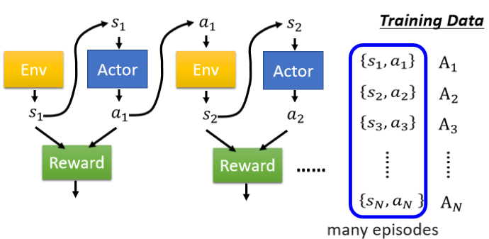

所以我们就是去观察,某一个 Actor 它跟环境互动的状况,那把这个 Actor,它在每一个 Observation,执行的 Action 都记录下来,然后接下来,我们就去**评价每一个 Action,它到底是好还是不好**,评价完以后,我们就可以拿我们评价的结果,来训练我们的 Actor

那怎么评价呢,我们刚才有说,我们会用 A 这一个东西,来评价在每一个 Step,我们希不希望我们的 Actor,採取某一个行为,那最简单的评价方式是,假设在某一个 Step $s1$,我们执行了 $a1$,然后得到 Reward $r1$

- 那 Reward 如果如果是正的,那也许就代表这个 Action 是好的
- 那如果 Reward 是负的,那也许就代表这个 Action 是不好的

那我们就把这个 Reward $r1$ $r2$,当做是 a,$A1$ 就是 $r1$,A2 就是 $r2$,A3 就是 $r3$,AN 就是 $rN$,那这样等同于你就告诉 machine 说,如果我们执行完某一个 Action,$a1$ 那得到的 **Reward 是正的,那这就是一个好的 Action**,你以后看到 $s1$ 就要执行 $a1$,如果今天在 $s2$ 执行 a2,得到 Reward 是负的,就代表 a2 是不好的 a2,就代表所以以后看到 $s2$ 的时候,就不要执行 a2

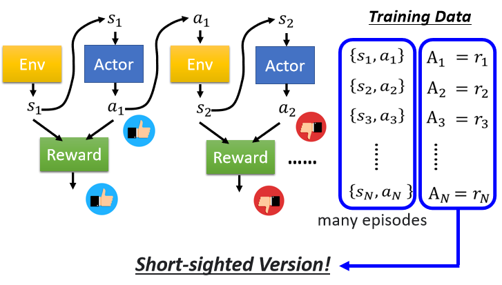

那这个,那这个 Version 0,它并不是一个好的版本,为什么它不是一个好的版本呢,因为你用这一个方法,你把 $a1$ 设为 $r1$,A2 设为 $r2$,这个方法认出来的 Network,它是一个**短视近利的 Actor**,它就是一个只知道会一时爽的 Actor,它**完全没有长程规划的概念**

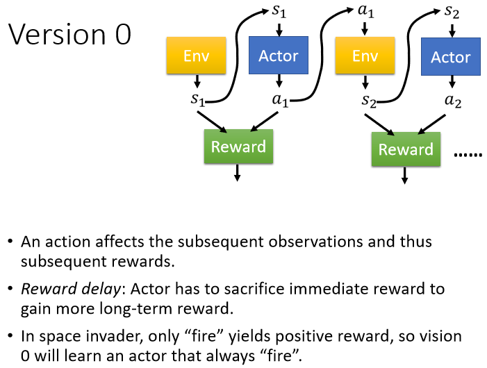

- 我们知道说每一个行为,其实都会影响互动接下来的发展,也就是说 Actor 在 $s1$ 执行 $a1$ 得到 $r1$,这个并不是互动的全部,因为 $a1$ 影响了我们接下来会看到 $s2$,$s2$ 会影响到接下来会执行 a2,也影响到接下来会产生 $r2$,所以 $a1$ 也会影响到,我们会不会得到 $r2$,所以**每一个行为并不是独立的,每一个行为都会影响到接下来发生的事情**,

- 而且我们今天在跟环境做互动的时候,有一个问题叫做,==Reward Delay==,就是有时候你需要**牺牲短期的利益,以换取更长程的目标**,如果在下围棋的时候,如果你有看天龙八部的时候你就知道说,这个虚竹在破解珍珑棋局的时候,堵死自己一块子,让自己被杀了很多子以后,最后反而赢了整局棋

  那如果是在这个,Space Invaders 的游戏裡面,你可能需要先左右移动一下进行瞄准,然后射击才会得到分数,而左右移动这件事情是,没有任何 Reward 的,左右移动这件事情得到的 Reward 是零,只有射击才会得到 Reward,但是并不代表左右移动是不重要的,我们会先需要左右移动进行瞄准,那我们的射击才会有效果,所以有时候我们会,需要牺牲一些近期的 Reward,而换取更长程的 Reward

- 所以今天假设我们用 Version 0,会发生说今天 Machine,只要是採取向左跟向右,它得到的 Reward 会是 0,如果它採取开火,它得到的 Reward 就会,只有开火的时候,它得到的 Reward 才会是正的,才会是正的,那这样 Machine 就会学到,它只有疯狂狂开火才是对的,因为只有开火这件事才会得到 Reward,其它行为都不会得到 Reward,所以其它行为都是不被鼓励的,只有开火这件事是被鼓励的,那个 Version 0 就只会学到疯狂开火而已,那 Version 0 是助教的范例程式,那这个当然也是可以执行的,那只是它的结果不会太好而已,那助教范例十,程式之所以是 Version 0 是因为,我不知道为什么这个 Version 0,好像是大家,如果你自己在 Implement rl 的时候,你特别容易犯的错误,你特别容易拿自己 Implement 的时候,就直接使用 Version 0,但是得到一个很差的结果

所以接下来怎么办呢,我们开始正式进入 rl 的领域,真正来看 ==Policy Gradient== 是怎么做的,所以我们需要有 Version 1

## Version 1

在 Version 1 裡面,$a1$ 它有多好,不是在取决于 $r1$,而是取决于 **$a1$ 之后所有发生的事情**,我们会把 $a1$,执行完 $a1$ 以后,所有得到的 Reward,$r1$ $r2$ $r3$ 到 $rN$,通通集合起来,通通加起来,得到一个数值叫做 G1,然后我们会说 $a1$ 就等于 G1,我们拿这个 G1,来当作评估一个 Action 好不好的标准

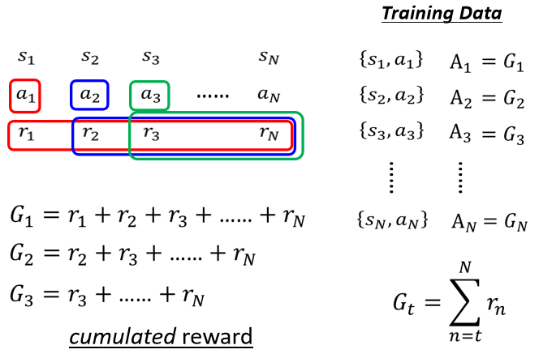

刚才是直接拿 $r1$ 来评估,现在不是,拿 G1 来评估,那接下来所有发生的 r 通通加起来,拿来评估 $a1$ 的好坏,因为我们执行完 $a1$ 以后,就发生这么一连串的事情,那这么一连串的事情加起来,也许就可以评估 $a1$,到底是不是一个好的 Action

所以以此类推,a2 它有多好呢,就把执行完 a2 以后,所有的 r,$r2$ 到 $rN$,通通加起来得到 G2,然后那 a3 它有多好呢,就把执行完 a3 以后,所有的 r 通通加起来,就得到 G3,所以把这些东西通通都加起来,就把那 这些这个 G,叫做 ==Cumulated Reward==,叫做累积的 Reward,把未来所有的 Reward 加起来,来评估一个 Action 的好坏,那像这样子的方法听起来就合理多了

Gt 是什么呢,就是从 t 这个时间点开始,我们把 rt 一直加到 $rN$,全部合起来就是,Cumulated 的 Reward Gt,那当我们用,Cumulated 的 Reward 以后,我们就可以解决 Version 0 遇到的问题,因为你可能向右移动以后进行瞄准,接下来开火,就有打中外星人,那这样向右这件事情,它也有 Accumulate Reward,虽然向右这件事情没有立即的 Reward,假设 $a1$ 是向右,那 $r1$ 可能是 0,但接下来可能会因为向右这件事,导致有瞄准,导致有打到外星人,那 Cumulated 的 Reward 就会正的,那我们就会知道说,其实向右也是一个好的 Action,这个是 Version 1

但是你仔细想一想会发现,==Version 1 好像也有点问题==

**假设这个游戏非常地长**,你**把 $rN$ 归功于 $a1$ 好像不太合适**吧,就是当我们採取 $a1$ 这个行为的时候,立即有影响的是 $r1$,接下来有影响到 $r2$,接下来影响到 $r3$,那假设这个过程非常非常地长的话,那我们说因为有做 $a1$,导致我们可以得到 $rN$,这个可能性应该很低吧,也许得到 $rN$ 的功劳,不应该归功于 $a1$,好 所以怎么办呢

## Version 2

有第二个版本的 Cumulated 的 Reward,我们这边用 G',来表示 Cumulated 的 Reward,好 这个我们会在 r 前面,乘一个 Discount 的 Factor

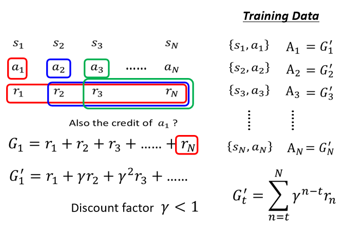

这个 Discount 的 Factor γ,也会设一个小于 1 的值,有可能会设,比如说 0.9 或 0.99 之类的,所以这个 G'1 相较于 G1 有什么不同呢,G1 是 $r1$ 加 $r2$ 加 $r3$,那 G'1 呢,是 $r1$ 加 γ$r2$ 加 γ 平方 $r3$,就是距离採取这个 Action 越远,我们 γ 平方项就越多,所以 $r2$ 距离 $a1$ 一步,就乘个 γ,$r3$ 距离 $a1$ 两步,就乘 γ 平方,那这样一直加到 $rN$ 的时候,$rN$ 对 G'1 就几乎没有影响力了,因为你 γ 乘了非常非常多次了,γ 是一个小于 1 的值,就算你设 0.9,0.9 的比如说 10 次方,那其实也很小了

所以你今天用这个方法,就可以**把离 $a1$ 比较近的那些 Reward,给它比较大的权重**,离我比较远的那些 Reward,给它比较小的权重,所以我们现在有一个新的 A,这个新的 A 这个评估,这个 Action 好坏的这个 A,我们现在用 G'1 来表示它,那它的式子可以写成这个样子,这个 G't 就是 Summention over,n 等于 t 到 N,然后我们把 $rN$ 乘上 γ 的 n-t 次方,所以离我们现在,採取的 Action 越远的那些 Reward,它的 γ 就被乘越多次,它对我们的 G' 的影响就越小,这是第二个版本,听到这边你是不是觉得合理多了呢 

### Q&A

Q1:一个大括号是一个 Episode,还是这样蓝色的框住的多个大括号,是一个 Episode

A1: 一个大括号不是一个 Episode,一个大括号是,我们在这一个 Observation,执行这一个 Action 的时候,这个是一笔资料,它不是一个 Episode,Episode 是很多的,很多次的 Observation,跟很多次的 Action 才合起来,才是一个 Episode

Q2: G1 需不需要做标准化之类的动作

A2: 这个问题太棒了,为什么呢,因为这个就是 Version 3

Q3: 越早的动作就会累积到越多的分数吗,越晚的动作累积的分数就越少

A3: 对 没错 是,在这个设计的情境裡面,是,越早的动作就会累积到越多的分数,但是这个其实也是一个合理的情境,因为你想想看,比较早的那些动作对接下来的影响比较大,到游戏的终局,没什么外星人可以杀了,你可能做什么事对结果影响都不大,所以比较早的那些 Observation,它们的动作是我们可能需要特别在意的,不过像这种 A 要怎么决定,有很多种不同的方法,如果你不想要比较早的动作 Action 比较大,你完全可以改变这个 A 的定义,事实上不同的 rl 的方法,其实就是在 A 上面下文章,有不同的定义 A 的方法

Q4: 看来仍然不适合用在围棋之类的游戏,毕竟围棋这种游戏只有结尾才有分数

A4: 这是一个好问题,这个我们现在讲的这些方法,到底能不能够处理,这种结尾才有分数的游戏呢,其实也是可以的,怎么说呢,假设今天只有 $rN$ 有分数,其它通通都是 0,那会发生什么事,那会发生说,今天我们採取一连串的 Action,**只要最后赢了,这一串的 Action 都是好的,如果输了,这一连串的 Action,通通都算是不好的**,而你可能会觉得这样做,感觉 Train Network 应该会很难 Train,确实很难 Train,但是就我所知,最早的那个版本的 AlphaGo,它是这样 Train 的,很神奇,它就是这样做的,它裡面有用到这样子的技术,当然还有一些其它的方法,比如说 Value Network 等等,那这个等一下也会讲到,那最早的 AlphaGo,它有採取这样子的技术来做学习,它有试著採取这样的技术,看起来是学得起来的,拿预估的误差当 Reward,拿,有一个同学说那其实 AlphaGo,可以拿预估的误差当 Reward,那你要有一个办法先预估误差,那你才拿它来当 Reward,那有没有办法事先预估,我们接下来会得到多少的 Reward 呢,有 那这个在之后的版本裡面,会有这样的技术,但我目前还没有讲到那一块,好 那我们接下来就讲 Version 3,

## Version 3

Version 3 就是像刚才同学问的,要不要做标准化呢?

要,因为好或坏是相对的,**好或坏是相对的**,怎么说好或坏是相对的呢,假设所有,假设今天在这个游戏裡面,你每次採取一个行动的时候,最低分就预设是 10 分,那你其实得到 10 分的 Reward,根本算是差的,就好像说今天你说你得,在某一门课得到 60 分,这个叫做好或不好,还是不好呢,没有人知道

因为那要看别人得到多少分数,如果别人都是 40 分,你是全班最高分,那你很厉害,如果别人都是 80 分,你是全班最低分,那就很不厉害,所以 Reward 这个东西是相对的

所以如果我们只是单纯的把 G 算出来,你可能会遇到一个问题,假设这个游戏裡面,可能永远都是拿到正的分数,每一个行为都会给我们正的分数,只是有大有小的不同,那你这边 G 算出来通通都会是正的,有些行为其实是不好的,但是你 仍然会鼓励你的 Model,去採取这些行为

所以怎么办,我们需要做一下标准化,那这边先讲一个最简单的方法就是,**把所有的 G' 都减掉一个 b**,这个 b 在这边叫做,在 rl 的文献上通常叫做 ==Baseline==,那这个跟我们作业的 Baseline 有点不像,但是反正在 rl 的文献上,就叫做 Baseline 就对了,我们把所有的 G' 都减掉一个 b,目标就是让 G' 有正有负,特别高的 G' 让它是正的,特别低的 G' 让它是负的

但是这边会有一个问题就是,那要**怎么样设定这个 Baseline** 呢,我们怎么设定一个好的 Baseline,让 G' 有正有负呢,那这个我们在接下来的版本裡面还会再提到,但目前为止我们先讲到这个地方

Q: 需要个比较好的,Heuristic Function

A: 对 需要个,就是说在下围棋的时候,假设今天你的 Reward 非常地 Sparse,那你可能会需要一个好的,Heuristic Function,如果你有看过那个最原始的,那个深蓝的那篇 Paper,就是在这个机器下围棋打爆人类之前,其实已经在西洋棋上打爆人类了,那个就叫深蓝,深蓝就有蛮多 Heuristic 的 Function,它就不是只有下到游戏的中盘,才知道 才得到 Reward,中间会有蛮多的状况它都会得到 Reward,好 

## Policy Gradient 

接下来就会实际告诉你说,Policy Gradient 是怎么操作的,那你可以仔细读一下助教的程式,助教就是这么操作的

首先你要先 Random 初始化,随机初始化你的 Actor,你就给你的 Actor 一个随机初始化的参数,叫做 $θ^0$,然后接下来你进入你的 Training Iteration,假设你要跑 T 个 Training Iteration,好 那你就拿你的这个,现在手上有的 Actor,一开始是这个 $θ^0$

一开始很笨 它什么都不会,它採取的行为都是随机的,但它会越来越好,你拿你的 Actor 去跟环境做互动,那你就得到一大堆的 s 跟 a,你就得到一大堆的 s 跟 a,就把它互动的过程记录下来,得到这些 s 跟 a,那接下来你就要进行评价,你用 $ A1$ 到 AN 来决定说,这些 Action 到底是好还是不好

你先拿你的 Actor 去跟环境做互动,收集到这些观察,接下来你要进行评价,看这些 Action 是好的还是不好的,那你真正需要这个在意的地方,你最需要把它改动的地方,就是在评价这个过程裡面,那助教程式这个 A 就直接设成,Immediate Reward,那你写的要改这一段,你才有可能得到好的结果

设完这个 A 以后,就结束了

你就把 Loss 定义出来,然后 Update 你的 Model,这个 Update 的过程,就跟 Gradient Descent 一模一样的,会去计算 L 的 Gradient,前面乘上 Learning Rate,然后拿这个 Gradient 去 Update 你的 Model,就把 $θ_{i-1}$ Update 成 $θ_i$,

但是这边有一个神奇的地方是,一般的 training,在我们到目前为止的 Training,Data Collection 都是在 For 循环之外,比如说我有一堆资料,然后把这堆资料拿来做 Training,拿来 Update,Model 很多次,然后最后得到一个收敛的参数,然后拿这个参数来做 Testing

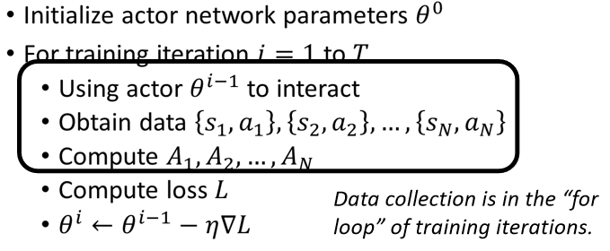

但在 RL 裡面不是这样,你发现**收集资料这一段,居然是在 For 循环裡面**,假设这个 For 循环,你打算跑 400 次,那你就得收集资料 400 次,或者是我们用一个图像化的方式来表示

这个是你收集到的资料,就是你观察了某一个 Actor,它在每一个 State 执行的 Action,然后接下来你给予一个评价,但要用什么评价 要用哪一个版本,这个是你自己决定的,你给予一个评价,说每一个 Action 是好或不好,你有了这些资料 这些评价以后,拿去训练你的 Actor,你拿这些评价可以定义出一个 Loss,然后你可以更新你的参数一次

但是有趣的地方是,你**只能更新一次而已,一旦更新完一次参数以后,接下来你就要重新去收集资料了**,登记一次参数以后,你就要重新收集资料,才能更新下一次参数,所以这就是为什么 RL,往往它的训练过程非常花时间

收集资料这件事情,居然是在 For 循环裡面的,你每次 Update 完一次参数以后,你的资料就要重新再收集一次,再去 Update 参数,然后 Update 完一次以后,又要再重新收集资料,如果你参数要 Update 400 次,那你资料就要收集 400 次,那这个过程显然非常地花时间,那你接下来就会问说,那为什么会这样呢

**为什么我们不能够一组资料,就拿来 Update 模型 Update 400 次,然后就结束了呢,为什么每次 Update 完我们的模型参数以后,Update Network 参数以后,就要重新再收集资料呢**

那我们,那这边一个比较简单的比喻是,你知道**一个人的食物,可能是另外一个人的毒药**

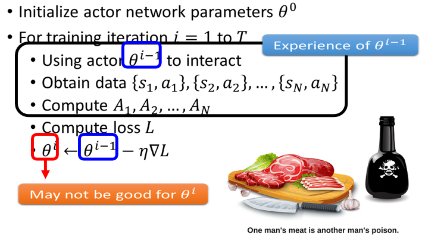

这些资料是由 $θ_{i-1}$ 所收集出来的,这是 $θ_{i-1}$ 跟环境互动的结果,这个是 $θ_{i-1}$ 的经验,这些经验可以拿来更新 $θ_{i-1}$,可以拿来 Update $θ_{i-1}$ 的参数,但它不一定适合拿来 Update $θ_{i}$ 的参数

或者是我们举一个具体的例子,这个例子来自棋魂的第八集,大家看过棋魂吧,我应该就不需要解释棋魂的剧情了吧

这个是进藤光,然后他在跟佐为下棋,然后进藤光就下一步,在大马 现在在小马步飞,这小马步飞具体是什么,我其实也没有非常地确定,但这边有解释一下,就是棋子斜放一格叫做小马步飞,斜放好几格叫做大马步飞,好 阿光下完棋以后,佐为就说这个时候不要下小马步飞,而是要下大马步飞,然后阿光说为什么要下大马步飞呢,我觉得小马步飞也不错

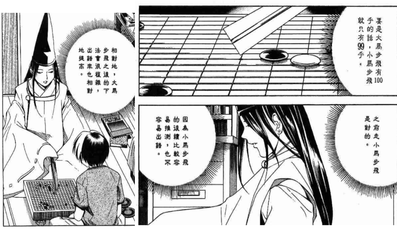

这个时候佐为就解释了,如果大马步飞有 100 手的话,小马步飞只有 99 手,接下来是重点,之前走小马步飞是对的,因为小马步飞的后续比较容易预测,也比较不容易出错,但是大马步飞的下法会比较複杂,但是阿光假设想要变强的话,他应该要学习下大马步飞,或者是阿光变得比较强以后,他应该要下大马步飞,所以你知道说同样的一个行为,同样是做下小马步飞这件事,对不同棋力的棋士来说,也许它的好是不一样的,对于比较弱的阿光来说,下小马步飞是对的,因为他比较不容易出错,但对于已经变强的阿光来说,应该要下大马步飞比较好,下小马步飞反而是比较不好的

所以**同一个 Action 同一个行为,对于不同的 Actor 而言,它的好是不一样的**

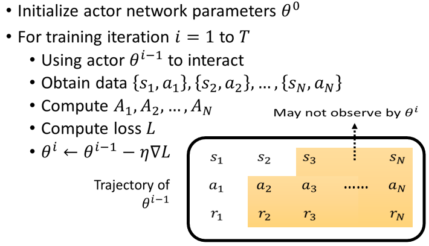

所以今天假设我们用 $θ_{i-1}$,收集了一堆的资料,这个是 $θ_{i-1}$ 的 Trajectory,这些资料只能拿来训练 $θ_{i-1}$,你不能拿这些资料来训练 $θ_{i}$,为什么不能拿这些资料来训练 $θ_{i}$ 呢

因为假设 假设就算是从 $θ_{i-1}$ 跟 $θ_{i}$,它们在 $s1$ 都会採取 $a1$ 好了,但之后到了 $s2$ 以后,它们**可能採取的行为就不一样了**,所以假设对 θ,假设今天 $θ_{i}$,它是看 $θ_{i-1}$ 的这个 Trajectory,那 $θ_{i-1}$ 会执行的这个 Trajectory,跟 $θ_{i}$ 它会採取的行为根本就不一样,所以你拿著 $θ_{i-1}$ 接下来会得到的 Reward,来评估 $θ_{i}$ 接下来会得到的 Reward,其实是不合适的

所以如果再回到刚才棋魂的那个例子,同样是假设这个 $a1$ 就是下小马步飞,那对于变强以前的阿光,这是一个合适的走法,但是对于变强以后的阿光,它可能就不是一个合适的走法

所以今天我们在收集资料,来训练你的 Actor 的时候,你要注意就是**收集资料的那个 Actor,要跟被训练的那个 Actor,最好就是同一个**,那当你的 **Actor 更新以后,你就最好要重新去收集资料**,这就是为什么 RL它非常花时间的原因

### On-policy v.s. Off-policy

刚才我们说,这个要被训练的 Actor,跟要拿来跟环境互动的 Actor,最好是同一个,当我们训练的 Actor,跟互动的 Actor 是同一个的时候,这种叫做 ==On-policy  Learning==,那我们刚才示范的那个,Policy Gradient 的整个 Algorithm,它就是 On-policy 的 Learning,那但是还有另外一种状况叫做,==Off-policy Learning==,

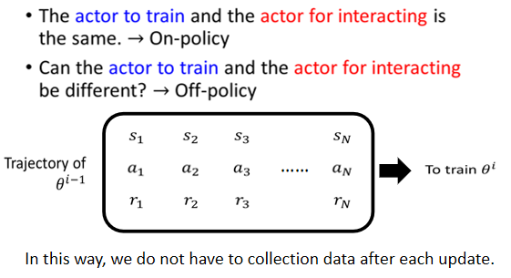

Off-policy 的 Learning 我们今天就不会细讲,Off-policy 的 Learning,期待能够做到的事情是,我们能不能够**让要训练的那个 Actor,还有跟环境互动的那个 Actor,是分开的两个 Actor 呢**,我们要训练的 Actor,能不能够根据其他 Actor 跟环境互动的经验,来进行学习呢

Off-policy 有一个非常显而易见的好处,你就**不用一直收集资料了**,刚才说 Reinforcement Learning,一个很卡的地方就是,每次更新一次参数就要收集一次资料,你看助教的示范历程是更新 400 次参数,400 次参数相较于你之前 Train 的 Network,没有很多,但我们要收集 400 次资料,跑起来也已经是很卡了,那如果我们可以收一次资料,就 Update 参数很多次,这样不是很好吗,所以 Off-policy 它有不错的优势

### Off-policy → Proximal Policy Optimization(PPO)

但是 Off-policy 要怎么做呢,我们这边就不细讲,有一个非常经典的 Off-policy 的方法,叫做 Proximal Policy Optimization,缩写是 PPO,那这个是今天蛮常使用的一个方法,它也是一个蛮强的方法,蛮常使用的方法

Off-policy 的重点就是,你**在训练的那个 Network,要知道自己跟别人之间的差距,它要有意识的知道说,它跟环境互动的那个 Actor 是不一样的**,那至于细节我们就不细讲,那我有留那个上课的录影的[连结](https://disp.cc/b/115-bLHe),在投影片的下方,等一下大家如果有兴趣的话,再自己去研究 PPO

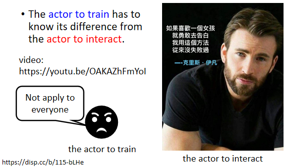

那如果要举个比喻的话,就好像是你去问克里斯伊凡 就是美国队长,怎么追一个女生,然后克里斯伊凡就告诉你说,他就示范给你看,他就是 Actor To Interact,他就是负责去示范的那个 Actor,他说他只要去告白,从来没有失败过,但是你要知道说,你跟克里斯伊凡其实还是不一样,人帅真好 人丑吃草,你跟克里斯伊凡是不一样的,所以克里斯伊凡可以採取的招数,你不一定能够採取,你可能要打一个折扣,那这个就是 Off-policy 的精神

你的 Actor To Train,要知道 Actor To Interact,跟它是不一样的,所以 Actor To Interact 示范的那些经验,有些可以採纳,有些不一定可以採纳,至于细节怎么做,那过去的上课录影留在这边,给大家参考

### Collection Training Data: Exploration 

那还有另外一个很重要的概念,叫做 Exploration,Exploration 指的是什么呢,我们刚才有讲过说,我们今天的,我们今天的这个 **Actor,它在採取行为的时候,它是有一些随机性的**

而这个随机性其实非常地重要,很多时候你随机性不够,你会 Train 不起来,为什么呢,举一个最简单的例子,假设你一开始初始的 Actor,它永远都只会向右移动,它从来都不会知道要开火,如果它从来没有採取开火这个行为,你就永远不知道开火这件事情,到底是好还是不好,唯有今天某一个 Actor,去试图做开火这件事得到 Reward,你才有办法去评估这个行为好或不好,假设有一些 Action 从来没被执行过,那你根本就无从知道,这个 Action 好或不好

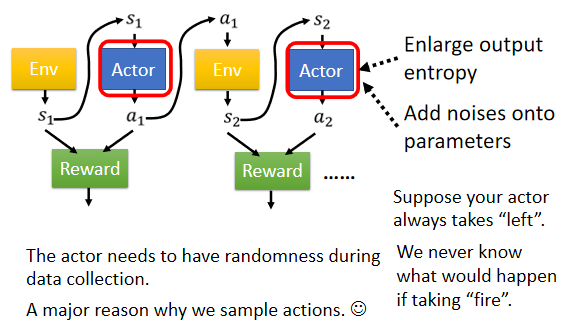

所以你今天在训练的过程中,这个拿去跟环境的互动的这个 Actor,它本身的随机性是非常重要的,你其实会期待说跟环境互动的这个 Actor,它的**随机性可以大一点**,这样我们才能够收集到,比较多的 比较丰富的资料,才不会有一些状况,它的 Reward 是从来不知道,那为了要让这个 Actor 的随机性大一点,甚至你在 Training 的时候,你会刻意加大它的随机性

比如说 Actor 的 Output,不是一个 Distribution 吗,有人会刻意加大,那个 Distribution 的 Entropy,那让它在训练的时候,比较容易 Sample 到那些机率比较低的行为,或者是有人会直接在这个 Actor,它的那个参数上面加 Noise,直接在 Actor 参数上加 Noise,让它每一次採取的行为都不一样,好 那这个就是 Exploration,那 Exploration,其实也是 RL Training 的过程中,一个非常重要的技巧,如果你在训练过程中,你没有让 Network 尽量去试不同的 Action,你很有可能你会 Train 不出好的结果

那我们来看一下,其实这个 PPO 这个方法,DeepMind 跟 Open AI,都同时提出了 PPO 的想法

那我们来看一下,DeepMind 的 PPO 的 Demo 的影片https://youtu.be/gn4nRCC9TwQ,它看起来是这样子的,好 那这个是 DeepMind 的 PPO,那就是可以用 PPO 这个方法,用这个 Reinforcement Learning 的方法,去 Learn什么,蜘蛛型的机器人或人形的机器人,做一些动作,比如说跑起来 或者是蹦跳,或者是跨过围牆等等

那接下来是 OpenAI 的 PPOhttps://blog.openai.com/openai-baselines-ppo/,它这个影片就没有刚才那个潮,它没有那个配音,不过我帮它配个音好了,这个影片我叫它,修机器学习的你,好 我修了一门课叫做机器学习,但在这门课裡面,有非常多的障碍 我一直遇到挫折,那个红色的球是 Baseline,而这个 Baseline 一个接一个,永远都不会停止,然后我 Train 一个 Network 很久,我 collate 它就掉线啦,Train 了三个小时的 Model 不见,但我仍然是爬起来继续地向前,我想开一个比较大的模型,看看可不可以 Train 得比较好一点,但是结果发生什么事情呢,Out Of Memory,那个圈圈一直在转,它就是不跑,怎么办,但我还是爬起来,继续向前,结果 Private Set 跟 Public Set,结果不一样,真的是让人觉得非常地生气,这个影片到这边就结束了吗

没关係 我们最后还是要给它一个正面的结尾,就算是遭遇到这么多挫折,我仍然努力向前好好地学习,这个就是 PPO,好 那讲到这边正好告一个段落