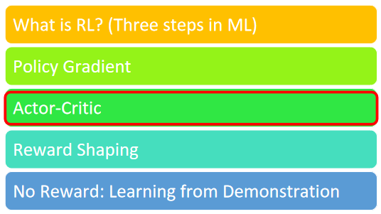
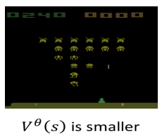
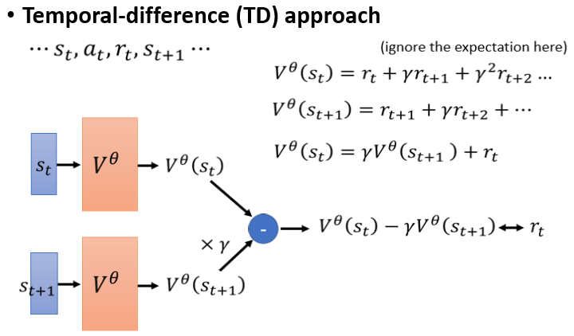
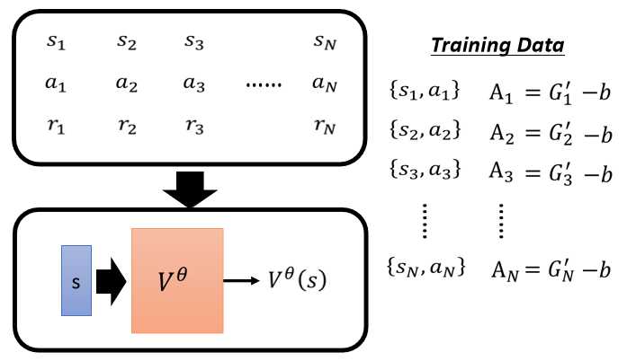
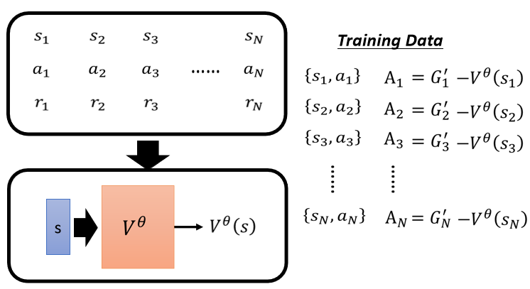
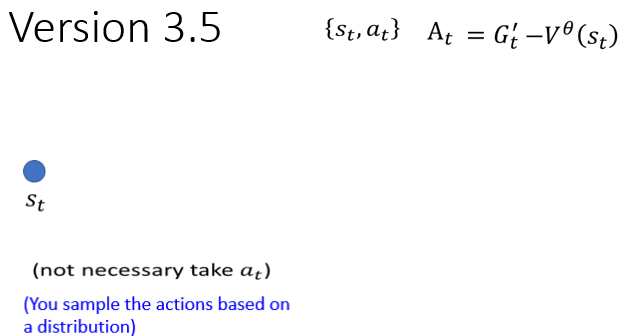
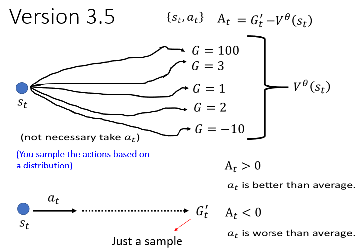
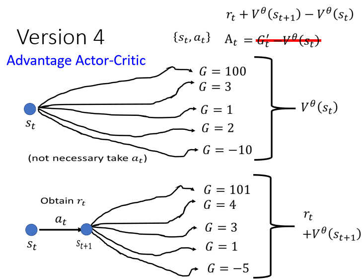
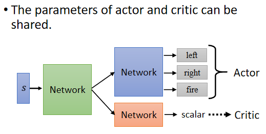
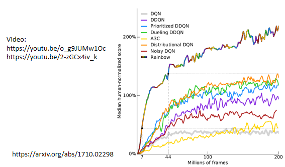

## Critic

那上一次 RL 的部分,我们讲说我们要 Learn 一个 Actor,那这一次,我们要 Learn 另外一个东西,这个东西叫做 Critic

我会先解释 Critic 是什麽,然后我们再来讲说,这个 Critic 对 Learn Actor 这个东西,有什麽样的帮助

**Critic 它的工作是要来评估一个 Actor 的好坏**,就你现在已经有一个 Actor,它的参数叫 θ,那 Critic 的工作就是,它要评估说如果这个 Actor,它看到某个样子的 Observation,看到某一个游戏画面,接下来它**可能会得到多少的 Reward**

那 Critic 有好多种不同的变形,有的 Critic 是只看游戏画面来判断,有的 Critic 是说采取某,看到某一个游戏画面,接下来又发现 Actor 採取某一个 Action,在这两者都具备的前提下,那接下来会得到多少 Reward

那这样讲,还是有点抽象,所以我们讲的更具体一点,我们直接介绍一个,我们等一下会真的被用上,你在作业裡面真的派得上用场的,这个 Critic 叫做 ==Value Function==,那这个 Value Function,我们这边用大写的 $V^θ(S)$ 来表示

它的**输入是 s**,也就是现在游戏的状况,比如说游戏的画面,那这边要特别注意一下 V,它是有一个**上标 θ** 的

这个上标 θ 代表这个 V ,它观察的对象是 θ 这个 Actor,它观察的这个 Actor 它的参数是 θ,那这个 V ,$V^θ $就是一个 Function,它的输入是 S,那输出是一个 Scalar,这边用 $V^θ(S)$ 来表示这一个 Scalar

那 Scalar这个数值的含义是,这一个 Actor θ,放在上标的这个 Actor θ,它如果看到 Observation S,如果看到输入的这个 S 的游戏画面,接下来它得到的,Discounted Cumulated Reward 是多少

这个的 Value Function 它的工作,就是要去估测说,对某一个 Actor 来说,如果现在它已经看到某一个游戏画面,那接下来会得到的,Discounted Cumulated Reward 应该是多少

当然 Discounted Cumulated Reward,你可以直接透过**把游戏玩到底**,就你看到你已经有了 Actor θ,那假设它看到这个 State s,那最后它到底会得到多少的这个 G' ,你就把这个游戏玩完你就知道了

但是这些这个 Value Function,它的能力就是它要**未卜先知,未看先猜**,游戏还没有玩完,只光看到 S 就要预测这个 Actor,它可以得到什麽样的表现,那这个就是 Value Function 要做的事情

举例来说,假设你给 Value Function 这一个游戏画面,它就要直接预测说,看到这个游戏画面,接下来应该会得到很高的 Cumulated Reward,为什麽,因为游戏,这个游戏画面裡面还有很多的外星人

假设你的这个 Actor 它很厉害,它是一个好的 Actor,它是能杀得了外星人的 Actor,那接下来它就会得到很多的 Reward

那像这个画面,这已经是游戏的中盘

游戏的残局,游戏快结束了,剩下的外星人没几隻了,那可以得到的 Reward 就比较少,那这些数值,你把整场游戏玩完你也会知道,但是 Value Function 想要做的事情,就是未卜先知,在游戏没玩完之前,就先猜应该会得到多少的,Discounted Cumulated Reward

那这边有一件要跟大家特别强调的事情是,这个 Value Function 是有一个上标 θ 的,这个 **Value Function,跟我们观察的 Actor 是有关係的**,同样的 Observation,同样的游戏画面,不同的 Actor,它应该要得到不同的,Discounted Cumulated Reward

我刚才在举例子的时候我说,假设我们有一个好的 Actor,看到这个游戏画面会有高的 Value,看到这个游戏画面会有低的 Value,但是假设你的 Actor 其实很烂,它很容易被外星人杀死,那也许看到这个画面,它的 Value 也是低的,因为有一堆外星人,它随便动两下它就被杀死了,它根本得不到 Reward,这个烂的 Actor 在这个画面,它可能拿到的 V 也是低的,所以 Value Function 的数值,是跟观察的对象有关係的,好 这个是 Critic

## How to estimate $ V^θ(s) $

### Monte-Carlo (MC) based approach

那在讲 Critic 要怎麽被使用,在 Reinforcement Learning 之前,我们来讲一下 Critic 是怎麽被训练出来的,那有两种常用的训练方法,第一种方法,是 Monte Carlo Based 的方法,这边缩写成 MC

如果是用 MC 的方法的话,你就**把 Actor 拿去跟环境互动**,互动很多轮,那 Actor 跟环境互动以后,Actor 去玩这个游戏以后,你就会得到一些游戏的记录

你就会发现说,那这个时候,你的 Value Function 就得到一笔训练资料,这笔训练资料告诉它说,如果看到 $s_a$ 作为输入,它的输出,这个 $ V^θ(s_a) $ 应该要跟 G'a 越接近越好

那假设你今天 sample 到另外一个 Observation,看到另外一个游戏画面,把游戏玩完之后发现,得到的 Cumulated Reward 是 G'b,那这个时候,你的这个 Value Function ,输入 $s_b$ 它就应该得到 $ V^θ(s_b) $,那这个 $ V^θ(s_b) $ 就应该跟 G'b 越接近越好

那这个非常直觉,你就去观察 Actor,会得到的 Cumulated Reward,那观察完你就有训练资料,直接拿这些训练资料来训练 Value Function,好 这个 MC ,是一个很直觉的作法

### Temporal-difference (TD) approach 

接下来我们来看另外一个,没有那麽直觉的作法,这个作法叫做 Temporal-Difference Approach,缩写是 TD

那 Temporal-Difference Approach,它希望做到的事情是,**不用玩完整场游戏**,才能得到训练 Value 的资料,你**只要在某一个 Observation $s_t$ 的,看到 $s_t$ 的时候,你的 Actor 执行了 At 得到 Reward rt,**然后接下来再看到 $ S_{t+1}$ 这样的游戏画面,光看到这样一笔资料,就能够训练 Vπ(S) 了,光看到这样子的资料,就可以拿来更新 Vπ(S) 的参数了

那如果光看这样一笔资料,就可以更新 Vπ(S) 的参数有什麽样的好处,它的好处是你想在 MC 裡面,你要玩完整场游戏,你才能得到一笔训练资料,那**有的游戏其实很长,甚至有的游戏也许,它根本就没有不会结束**,它永远它都一直继续下去,它永远都不会结束,那像这样子的游戏,你用 MC 就非常地不适合

那这个时候,你可能就希望採用 TD 的方法,好 那怎麽只看到这样子的资料,就拿来训练  Vπ(S)  

这边举一个例子,我们先来看一下,$ V^θ(s_t)$ 跟 $ V^θ(s_{t+1})$ 它们之间的关係

我们说$ V^θ(s_t)$,就是看到 $s_t$之后的 Cumulated Reward,所以$ V^θ(s_t)$ 就是 $rt + γr_{t+1} + γ²r_{t+2}$ 以此类推

然后 $ V^θ(s_{t+1})$ 就是 $r_{t+1} + γr_{t+2}$ 以此类推

那你发现说这两个 Vθ,$ V^θ(s_{t})$ 跟 $ V^θ(s_{t+1})$,它们之间是有关係的

你可以把它写成这样一个式子,把 $ V^θ(s_{t+1})$ 乘上 γ 再加 rt,把 $ V^θ(s_{t+1})$ 每一项都乘 γ 再加上 rt,就会变成$ V^θ(s_t)$,所以$ V^θ(s_t)$ 跟  $ V^θ(s_{t+1})$ 中间,有这样子的关係

我们现在,有这样一笔资料以后,我们就可以拿来训练我们的 Value Function,希望 Value Function 可以满足,这边我们所写的这个式子

那什麽意思,就假设我们现在有这样一笔资料,我们就把 St,代到 Value Function 裡面得到$ V^θ(s_t)$,我们有 $ s_{t+1}$ 代到 Value Function 裡面,得到 $ V^θ(s_{t+1})$,虽然我们不知道$ V^θ(s_t)$ 是多少,我们也不知道 $ V^θ(s_{t+1})$ 应该是多少,我们没有这两个东西的标准答案,但我们**知道它们相减应该是多少**

根据上面这一个式子,我们把 $ V^θ(s_{t+1})$ 乘上 γ,然后再去减$ V^θ(s_t)$,把$ V^θ(s_t)$ 减掉 γ 乘 $ V^θ(s_{t+1})$,应该要跟 rt 越接近越好,rt 在这边,我们是有蒐集到 rt 这一笔资料的

我们又知道$ V^θ(s_t)$,跟这个 $ V^θ(s_{t+1})$ 之间的关係,所以我们知道$ V^θ(s_t)$ 减掉 γ 乘上 $ V^θ(s_{t+1})$,应该跟 rt 越接近越好,所以你就有了这样子训练资料,输入$ s_t$,输入 $ s_{t+1}$,它们都通过 Vθ,然后把它们相减,然后要跟 rt 越接近越好

那这个就是 TD 的方法

### MC v.s. TD

这两个方法,其实你拿来计算同样的,观察到的结果,同样的资料,同样的 θ,你用 MC 跟 TD 来观察,你算出来的 Value Function,很有可能会是不一样的

那这边,就举一个例子,这个例子是这样子的,我们观察某一个 Actor,这个 Actor ,跟环境互动玩了某一个游戏八次,当然这边为了简化计算,我们假设这些游戏都非常简单,都一个回合,就到两个回合就结束了

- 所以那个 Actor 第一次玩游戏的时候,它先看到 $s_a$ 这个画面,得到 Reware 0

- 接下来看到 $s_b$ 这个画面,得到 Reware 0 游戏结束

- 接下来,这个有连续六场游戏,都是看到 $s_b$ 这个画面,得到 Reward 1 就结束了

- 最后一场游戏,看到 $s_b$ 这个画面,得到 Reward 0 就结束了

那我们这边,先无视 Actor,为了简化起见无视 Actor,我们也假设,γ 就等于 1,也就是没有做 Discount,好 那这个 $s_b$ 应该是多少,$ V^θ(s_b) $ 应该是多少

我们知道这个 $ V^θ(s_b) $,它的意思就是这个**看到 $s_b$ 这一个画面,你会得到的 Reward 的期望值**,那 $s_b$ 这个画面,我们在这八次游戏中,总共看到了八次,每次游戏都有看到 $s_b$ 这个画面,看到 $s_b$ 这个画面之后会得到多少 Reward 

**八次游戏裡面,有六次得到 1 分**,两次得到 0 分,所以平均是 3/4 分没有问题,所以 $ V^θ(s_b) $ 就是 3/4,妥妥的没有争议

那 $ V^θ(s_a) $ 应该是多少,你觉得看到 $s_a$,接下来应该要得到多少 Reward ,根据这八笔训练资料,看到 $s_a$ 接下来该得到多少 Reward 

几乎没有其他答案,所有人都说是 0,好 多数同学都说是 0,**0 是不是一个正确的答案,它既对也不对**

其实还有另外一个可能的答案是 3/4,我看没有人写 3/4,等一下来解释,为什麽有可能算出 3/4,但 0 也是一个合理的答案,为什麽你会觉得是应该是 0 ,**0 是用 Monte-Carlo 的想法得到的**

为什麽是 0,因为我们看到 $s_a$ 只有一次,看到 $s_a$ 以后会得到多少 Reward,这是 0,看到 $s_a$ 以后得到 Reward 0,再看到 $s_b$ 得到 Reward 还是 0,所以 Cumulated Reward 就是 0,所以如果从 Monte-Carlo 的角度来看,我们看到 $s_a$,接下来算出来的 G 应该是多少,就是 0 ,所以 $ V^θ(s_a) $ 应该就是 0,妥妥的没问题,几乎所有同学都得到了正确答案

但如果你**用 TD,你算出来的,可会是不一样的结果**

因为 $ V^θ(s_a) $ 跟 $ V^θ(s_b) $ 中间,有这样子的一个关係,这个 $ V^θ(s_a) $ 应该要等于 $ V^θ(s_b) $ 加上 Reward,就是你在看到 $s_a$ 之后得到 Reward,接下来进入 $s_b$,那这个  $ V^θ(s_a) $,应该等于 $ V^θ(s_b) $ 加上这一个 Reward

所以按照这个想法,$ V^θ(s_b) $ 是3/4,这个 r 是 0,但 $ V^θ(s_a) $ 应该是 3/4 对不对,按照 TD 的想法,$ V^θ(s_a) $ 应该是 3/4

你可能会问说,那到底 Monte-Carlo 跟 TD,谁算出来是对的,**都可以说是对的,它们只是背后的假设是不同的**,对 Monte-Carlo 而言,它就是直接看我们观察到的资料,$s_a$ 之后接 $s_b$ 得到的,Cumulated Reward 就是 0,所以 $ V^θ(s_a) $ 当然是 0

但对于 TD 而言,它背后的假设是这个 **$s_a$ 跟 $s_b$ 是没有关係**的,看到 $s_a$ 之后再看到 $s_b$,并不会影响看到 $s_b$ 的 Reward,你现在看这八笔训练资料,给你一种错觉,觉得说 $ V^θ(s_a) $ 应该是 0,那只是因为**你 $s_a$mple 到的资料太少了**,看到 $s_b$,应该可以期望的 Reward 是 3/4,只是因为今天正好运气不好,看完 $s_a$ 以后再看 $s_b$,正好 r 是 0,但是期望值应该是 3/4,你只是正好运气不好看到 r 是 0,你才会觉得 $s_a$ 是 0

但是 $s_b$,看到 $s_b$ 以后得到的期望 Reward 应该是 3/4,所以看到 $s_a$ 以后你会看到 $s_b$,那你得到的这个期望的 Reward 也应该是 3/4,所以从 TD 的角度来看,$s_b$ 会得到多少 Reward,跟 $s_a$ 是没有关係的

所以你应该,所以 $s_a$ 的这个 Cumulated Reward 应该是 3/4

所以总之用 MC 来计算,用 TD 来计算,会有微妙的差异

## Version 3.5

 Critic 怎麽被用在训练 Actor 上面,还记不记得我们上一次,最后我们讲到这个 Actor 的方法的时候,我们说怎麽训练一个 Actor,你就先把 Actor 跟环境互动,得到一些 Reward,然后你得到一堆这个 Observation,跟这个 Action 的 Pair

这个在 s1 执行 A1 的时候多好,得到一个分数 A1,那我们说这个 A1 ,它是 Cumulative 的 Reward,那上週也有同学问到说,难道 Cumulative 的 Reward,不需要做 Normalization 吗,需要做 Normalization,所以我们说,这个减掉一个 b 当做 Normalization

但这个 b 的值应该设多少,就不好说,那我这边 告诉大家说,一个 V 合理的设法,是把它设成 $V^θ(S)$

你现在 Learn 出这个 Critic 以后,这个 Critic 给它一个 Step,它就会产生一个分数,那你把这个分数 当做 B,,所以 G1' 就是要减掉 Vθ(s1),G2' 就是减掉 Vθ(s2),以此类推

那再来的问题就是,**为什麽减掉 V 是一个合理的选择**,那我们在下一页投影片,来跟大家解释一下

我们已经知道说这个 At 代表s，a 这个 Pair 有多好,我们是用 G' 减掉$ V^θ(s_t)$,来定义这个 A,好 那我们先来看一下这个$ V^θ(s_t)$,到底代表什麽意思

$ V^θ(s_t)$是看到某一个画面 St 以后,接下来会得到的 Reward

它其实是一个**期望值**,因为假设你今天看到同一个画面,接下来再继续玩游戏,**游戏有随机性**,你每次得到的 Reward 都不太一样的话,那$ V^θ(s_t)$  其实是一个期望值

那在这个时候,在**看到 St 的时候,你的 Actor 不一定会执行At 这一个 Action**

因为 Actor 本身是有随机性的,在训练的过程中,我们甚至鼓励 Actor 是有随机性的,所以同样的 S,你的 Actor ,它会输出的这个 Action 不一定是一样的

我们说 **Actor 的输出其实是一个 Probability  Distribution**,是一个在这个 Action 的 space 上面的,Probability Distribution,它还给每一个 Action 一个分数,你按照这个分数去做sample,有些 Action 被sample 到的机率高,有些 Action 被sample 到的机率低,但每一次sample 出来的 Action,并不保证一定要是一样的,

所以看到 St 之后,接下来有很多的可能 很多的可能,所以你会算出不同的 Cumulative 的 Reward

那当然如果你有 Discount 的话,就是 Discounted 的 Cumulative Reward,那我们这边,是把 Discount 这件事情暂时省略掉，那**把这些可能的结果平均起来,就是$ V^θ(s_t)$**,这是$ V^θ(s_t)$ 这一项的含义

那 Gt' 这一项的含义是什麽？

Gt' 这一项的含义是,在 St 这个位置 **在 St 这个画面下,执行 At 以后,接下来会得到的 Cumulative Reward**

所以你**执行 At 以后,接下来 再一路玩下去,你会得到一个结果 得到一个 Reward,就是 Gt'**

- 如果 At 大于 0 代表说,Gt' 大于$ V^θ(s_t)$,这个时候代表说,这个 Action 是比,我们 Random sample 到的 Action 还要好的,在这边得到 Gt' 的时候,我们确定是执行了 At,那在 St 在算这个$ V^θ(s_t)$ 的时候,我们不确定我们会执行哪一个 Action

  所以我们执行 Action At 的时候,得到的 Reward大于随便执行一个 Action 得到的 Reward,所以当 At 大于 0 的时候代表说,**At 大于随便执行的一个 Action,那这个时候这个 Action At 它就是好的**,所以我们给它一个大于 0 的 At

- 如果 At 小于 0 代表说,这个平均的 Reward,大过执行 At 得到的 Reward,你随机採取的 Action,按照某一个 Distribution,sample 出来的 Action,得到的这个 Cumulative Reward 的期望值,大过採取 At 这个 Action 所得到的 Reward,那这个时候 At 就是坏的,所要给它负的大 At

  所以这样就非常地直觉,为什麽我们应该把 Gt' 减掉$ V^θ(s_t)$,但讲到这边,你有没有觉得有一些地方有点违和,什麽地方有点违和,这个 Gt' 它是一个sample 的结果,它是执行 At 以后,一直玩玩玩 玩到游戏结束,某一个sample 出来的结果,而$ V^θ(s_t)$ 是很多条路径 很多个可能性,平均以后的结果,我们把一个sample 去减掉平均,这样会准吗,**也许这个sample 特别好或特别坏,我们为什麽不是拿平均去减掉平均**

## Version 4

所以我们这一门课要讲的最后一个版本,就是拿平均去减掉平均

我们执行完 At 以后 得到 Reward rt,然后跑到下一个画面 $ S_{t+1}$,把这个 $ S_{t+1}$ 接下来一直玩下去,有很多不同的可能,每个可能通通会得到一个 Reward,把这些 Reward 平均起来

把这些 Cumulative 的 Reward 平均起来,其实就是 $ V^θ(s_{t+1})$,本来你会需要玩很多场游戏,才能够得到这个平均值,

但没关係,假设你训练出一个好的 Critic,那你直接代 $ V^θ(s_{t+1})$,你就知道说,在 $ S_{t+1}$ 这个画面下,接下来会得到的,Cumulative Reward 的期望值应该多少

而接下来 你再加上 $r_t$,接下来再加上  $r_t$,代表说在 St 这个位置採取 at

跳到 $ S_{t+1}$以后,会得到的 Reward 的期望值,因为我们已经知道说,在 St 这边採取 at 会得到 Reward  $r_t$,再跳到 $ S_{t+1}$,然后 $ S_{t+1}$ 会得到期望值,期望的 Reward 是 $ V^θ(s_{t+1})$

所以我们这边,再给它加上  $r_t$,代表说在 St 这边执行 At 以后,会得到的 Reward 的期望值,接下来再把这两个东西相减,再把  $r_t$+$ V^θ(s_{t+1})$ 减掉$ V^θ(s_t)$

也就是我们把 G' 换成  $r_t$+$ V^θ(s_{t+1})$,再减掉$ V^θ(s_t)$

我们就知道说,採取 at 这个 Action得到的期望 Reward,减掉根据某个 Distribution sample 一个 Action得到的 Reward,两者的期望值差距有多大

那**如果 $r_t$+$ V^θ(s_{t+1})$ 比较大,就代表 at 比较好**,它比随便 sample Reward 好

 $r_t$+$ V^θ(s_{t+1})$ 小于$ V^θ(s_t)$,就代表 at 它是 Lower Than Average,它比从一个 Distribution,sample 到的 Action 还要差

所以今天,这个就是大名鼎鼎的一个常用的方法,叫做 ==Advantage Actor-Critic==,在 Advantage Actor-Critic 裡面,你是怎麽定义 at 的,也就是  $r_t$+$ V^θ(s_{t+1})$ 减掉, $r_t$+$ V^θ(s_{t+1})$ -$ V^θ(s_t)$,就是我们的 At 了

## Tip of Actor-Critic

这边有一个训练 Actor-Critic 的小技巧,那你在作业裡面也不妨使用这个技巧

Actor 是一个 Network,Critic 也是一个 Network,Actor 这个 Network,是一个游戏画面当做输入,它的输出是每一个 Action 的分数,Critic 是一个游戏画面当做输入,输出是一个数值,代表接下来会得到的 Cumulative 的 Reward

这边有**两个 Network,它们的输入是一样的东西**,所以这两个 Network,它们应该**有部分的参数可以共用**吧,尤其假设你的输入又是一个非常複杂的东西,比如说游戏画面的时候,前面几层应该都需要是 CNN 吧,要了解这个游戏画面需要用的 CNN,也许是差不多的吧

所以 Actor 跟 Critic,它们可以共用前面几个 Layer,所以你今天在实作的时候往往,你会把你的 Actor-Critic 设计成这个样子,Actor-Critic ,它们有共用大部分的 Network,然后只是最后,输出不同的 Action,就是 Actor,输出一个 Scalar,就是 Critic,好 那这是一个训练 Actor-Critic 的小技巧

## Outlook: Deep Q Network (DQN)

那其实今天讲的,并不是 Reinforcement Learning 的全部,那其实在 Reinforcement Learning 裡面,还有一个犀利的做法,是直接採取 Critic,也就是**直接用 Critic,就可以决定要用什麽样的 Action**

那其中最知名的就是,Deep Q Network (DQN),那不过 这边我们就不细讲 DQN 了,如果你真的想知道 DQN 的话,可以参考过去上课的录影,那 DQN 哇 有非常非常多的变形

这边 就是找一个非常,有一篇非常知名的 Paper 叫做 Rainbow,裡面 就是试著去尝试了各种 DQN 的变形,试了七种 然后再把这七种变形集合起来,因为有七种变形集合起来,所以他说它是一个彩虹,所以他把它的方法叫做 Rainbow,那我也把这个 Paper 留在这边给你参考,那如果你想知道 Rainbow 裡面的,每一个小技巧是怎麽做的话,你就参见上课录影,过去的课程,有把 Rainbow 裡面的每一个小技巧,都讲过一遍

## Q&A

Q1: $s_a$ 后面接的不一定是 $s_b$ 吧,这样怎麽办

A1: 这是一个很好的问题,$s_a$ 后面不一定接 $s_b$,那这个问题,在刚才我们看到的那个例子裡面,就没有办法处理,因为在刚才那个,我们看到那个只有 8 个 Episode 的例子裡面,$s_a$ 后面就只会接 $s_b$,所以我们观察 没有观察到其它的可能性,所以我们没办法处理这个问题,所以这就告诉我们说,在做 Reinforcement Learning 的时候,$s_a$mple 这件事情是非常重要的,你 Reinforcement Learning,最后 Learn 得好不好,跟你在 $s_a$mple 的时候 $s_a$mple 得好不好,关係非常大,喔 所以这个 Reinforcement Learning,是一个非常吃人品的方法啦,所以你在作业裡面你可以体验一下,就你 $s_a$mple 到的结果,对你最后 Training 的结果,有非常大的影响

Q2: 每一个 V,都需对应到固定的环境发生顺序吗

A2: 我没有很确定你的问题,但是我试著回答一下,就是每一个 V 它不会固定,它不会对应到固定的环境发生顺序,如果你的游戏有随机性的话,那 V 其实是代表了一个期望值,它想要算的就是,给某一个 Observation,看到某一个游戏画面以后,接下来你会得到的 Cumulative Reward 的平均值,它的期望值,如果你的游戏有随机性的话,V 代表的是期望值,你看到某一个游戏画面以后,然后接下来会发生什麽事情,不见得是一样的,但把所有的可能性都平均起来,取它的期望值,这个就是 V 所代表的意思

Q3: 后面出现的 S 应该是不固定的,这样怎麽代公式

A3: 好 那个我想我刚才应该算是有回答到了,后面出现的 看到某一个这个 Observation,后面出现的 Observation 确实是不固定的,那如果有些状况,某些 Observation 你没观察到的话,哇 那你真的就没办法训练

Q4: 就是拿 V 当一般人的实力,超过它就是猛,没超过就是烂吗

A4: 对 就是这样,V 就是平均的实力,超过 V 就是好

Q5: 想请问这个 Distribution 要从哪裡知道

A5: 我想你这个 Distribution 问的是那个,Actor 的 Distribution 啦 对不对,我们说,Distribution Action的 Distribution,Action 是从某一个 Distribution,sample 出来的,那个 Distribution 是谁,那个 Distribution 是这样,就是你的 Actor 不是像是一个 Classifier 吗,你的 Actor 像是一个 Classifier,然后你把 S 丢进去,每一个 Action 都会有一个分数,那你把这个分数,通过 Soft Mess,就做一个 Normalize,它就变得像机率一样,然后按照那个机率去做 sample,那这个就是 Actor,从一个 Distribution sample 出来的,这句话的意思,