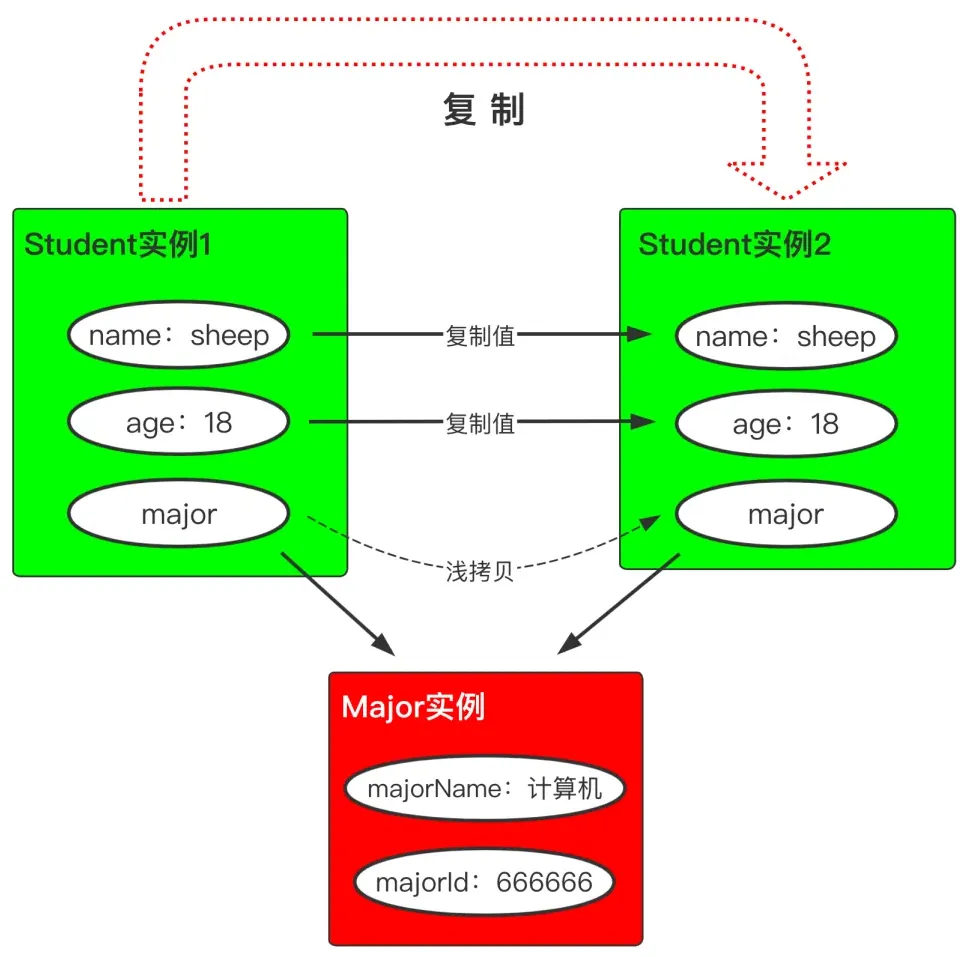

# ☕️java 笔记

- [Java 基础](./计算机基础/Java%20基础.md)
- [Java 容器](./计算机基础/Java%20容器.md)
- [Java 并发](./计算机基础/Java%20并发.md)
- [Java 虚拟机](./计算机基础/Java%20虚拟机.md)
- [Java I/O](./计算机基础/Java%20IO.md)

## List

```java
//Iterator
import java.util.Iterator;
import java.util.List;

public class HelloWorld {

	public static void main(String[] args) {
		List<String> list = List.of("Hello", "world");//只读List

		for(Iterator<String> it = list.iterator(); it.hasNext();) {
			String str = it.next();
			System.out.print(str);
		}
// for (String s : list) {
//     System.out.println(s);
// }
	}
}
```

```java
// Array to List
Integer[] array = { 1, 2, 3 };
List<Integer> list = List.of(array);//只读List

//List to Array
Object[] array = list.toArray();
Integer[] array = list.toArray(new Integer[3]);
Integer[] array = list.toArray(new Integer[list.size()]);
Integer[] array = list.toArray(Integer[]::new);//best
```

```java
//List内部并不是通过==判断两个元素是否相等，而是使用equals()方法判断两个元素是否相等
boolean contains(Object o)//该方法判断List是否包含某个指定元素

int indexOf(Object o)//该方法返回某个元素的索引，如果元素不存在，就返回-1
```

## Map

```java
Map<K, V>//是一种键-值映射表
put(K key, V value)//把key和value做了映射并放入Map
V get(K key)//通过key获取到对应的value。如果key不存在，则返回null
boolean containsKey(K key)//查询某个key是否存在

for (String key : map.keySet()) {
    Integer value = map.get(key);
    System.out.println(key + " = " + value);
}//遍历key

for (Map.Entry<String, Integer> entry : map.entrySet()) {
    String key = entry.getKey();
    Integer value = entry.getValue();
    System.out.println(key + " = " + value);
}//同时遍历key和value
```


## Set

```java
//如果我们只需要存储不重复的key，并不需要存储映射的value，那么就可以使用Set
boolean add(E e)//将元素添加进Set<E>
boolean remove(Object e)//将元素从Set<E>删除
boolean contains(Object e)//判断是否包含元素
```

## Collections

```java
Collections.sort(list);//排序
Collections.shuffle(list);// 洗牌算法shuffle可以随机交换List中的元素位置:

```

## Lambda表达式

```java
String[] array = new String[] { "Apple", "Orange", "Banana", "Lemon" };
Arrays.sort(array, (s1, s2) -> {
    return s1.compareTo(s2);
});

//直接传入方法引用
public class Main {
    public static void main(String[] args) {
 String[] array = new String[] { "Apple", "Orange", "Banana", "Lemon" };
 Arrays.sort(array, Main::cmp);
 System.out.println(String.join(", ", array));
    }

    static int cmp(String s1, String s2) {
 return s1.compareTo(s2);
    }
}
```

## Stream

创建Stream最简单的方式是直接用Stream.of()静态方法

```java
import java.util.stream.Stream;
public class Main {
    public static void main(String[] args) {
 Stream<String> stream = Stream.of("A", "B", "C", "D");
 // forEach()方法相当于内部循环调用，
 // 可传入符合Consumer接口的void accept(T t)的方法引用：
 stream.forEach(System.out::println);
    }
}

//基于Supplier创建的Stream会不断调用Supplier.get()方法来不断产生下一个元素，这种Stream保存的不是元素，而是算法，它可以用来表示无限序列
```

第二种创建Stream的方法是基于一个数组或者Collection，这样该Stream输出的元素就是数组或者Collection持有的元素

```java
public static void main(String[] args) {
    Stream<String> stream1 = Arrays.stream(new String[] { "A", "B", "C" });
    Stream<String> stream2 = List.of("X", "Y", "Z").stream();
    stream1.forEach(System.out::println);
    stream2.forEach(System.out::println);
}

```

把数组变成Stream使用Arrays.stream()方法。对于Collection（List、Set、Queue等），直接调用stream()方法就可以获得Stream。
上述创建Stream的方法都是把一个现有的序列变为Stream，它的元素是固定的。

基于`Supplier`创建的`Stream`会不断调用`Supplier.get()`方法来不断产生下一个元素，这种`Stream`保存的不是元素，而是算法，它可以用来表示无限序列

例如，我们编写一个能不断生成自然数的`Supplier`，它的代码非常简单，每次调用`get()`方法，就生成下一个自然数

```java
import java.util.function.*;
import java.util.stream.*;

public class Main {
    public static void main(String[] args) {
 Stream<Integer> natual = Stream.generate(new NatualSupplier());
 // 注意：无限序列必须先变成有限序列再打印:
 natual.limit(20).forEach(System.out::println);
    }
}

class NatualSupplier implements Supplier<Integer> {
    int n = 0;
    public Integer get() {
 n++;
 return n;
    }
}
```

`IntStream`、`LongStream`和`DoubleStream`这三种使用基本类型的`Stream`，它们的使用方法和泛型`Stream`没有大的区别，设计这三个`Stream`的目的是提高运行效率:

```java
// 将int[]数组变为IntStream:
IntStream is = Arrays.stream(new int[] { 1, 2, 3 });
// 将Stream<String>转换为LongStream:
LongStream ls = List.of("1", "2", "3").stream().mapToLong(Long::parseLong);
```

`Stream.map()`是`Stream`最常用的一个转换方法

所谓`map`操作，就是把一种操作运算，映射到一个序列的每一个元素上

```java
Stream<Integer> s = Stream.of(1, 2, 3, 4);
Stream<Integer> s2 = s.map(i -> i * i);
s2.forEach(System.out::println);
```

如果我们查看`Stream`的源码，会发现`map()`方法接收的对象是`Function`接口对象，它定义了一个`apply()`方法，负责把一个`T`类型转换成`R`类型：

```java
<R> Stream<R> map(Function<? super T, ? extends R> mapper);
```

其中，`Function`的定义是：

```java
@FunctionalInterface
public interface Function<T, R> {
    // 将T类型转换为R:
    R apply(T t);
}
```

利用`map()`，不但能完成数学计算，对于字符串操作，以及任何Java对象都是非常有用的。例如：

```java
import java.util.ArrayList;
import java.util.Arrays;
import java.util.List;
import java.util.stream.Stream;

public class Main {
    public static void main(String[] args) {

        List<String> list = Arrays.asList("A", "T D", "Esa R", "I N G");

        list.stream()
        .map(String::trim)
        .map(String::toLowerCase)
        .forEach(System.out::println);

    }
}
```


## PriorityQueue

```java
class Pair<U, V>{
    public final U first;
    public final V second;
    public Pair(U first, V second){
 this.first = first;
 this.second = second;
    }
}

class MyComparator implements Comparator<Pair<Integer, Integer>>{
    @Override
    public int compare(Pair<Integer, Integer> a, Pair<Integer, Integer> b){
 return Integer.compare(a.second, b.second);
    }
}

PriorityQueue<Pair<Integer, Integer>> pq = new PriorityQueue<>(new MyComparator());

```

## 面试题

**下面这串代码打印的结果是什么**

```java
public class Test {
    public static void main(String[] args) {
 System.out.println(Math.min(Double.MIN_VALUE, 0.0d));
    }
}
```

事实上，`Double. MIN_VALUE` 和` Double. MAX_VALUE` 一样，都是正数，`Double. MIN_VALUE` 的值是 `2^(-1074)`，直接打印 `Double. MIN_VALUE` 的话，输出结果为 `4.9E-324`，因此这道题的正确答案是输出 `0.0`。

## 赋值 vs 浅拷贝 vs 深拷贝

```java
// 学生的所学专业
public class Major {
    private String majorName; // 专业名称
    private long majorId;     // 专业代号
    
    // ... 其他省略 ...
}

// 学生
public class Student {
    private String name;  // 姓名
    private int age;      // 年龄
    private Major major;  // 所学专业
    
    // ... 其他省略 ...
}
```

**对象赋值**

赋值是日常编程过程中最常见的操作，最简单的比如：

```java
Student codeSheep = new Student();
Student codePig = codeSheep;
```

严格来说，这种不能算是对象拷贝，因为拷贝的仅仅只是引用关系，并没有生成新的实际对象

**浅拷贝**

浅拷贝属于对象克隆方式的一种,**值类型**的字段会复制一份，而**引用类型**的字段拷贝的仅仅是引用地址，而该引用地址指向的实际对象空间其实只有一份。



```java
public class Student implements Cloneable {

    private String name;  // 姓名
    private int age;      // 年龄
    private Major major;  // 所学专业

    @Override
    public Object clone() throws CloneNotSupportedException {
 return super.clone();
    }
    
    // ... 其他省略 ...

}
```

**深拷贝**

深拷贝相较于上面所示的浅拷贝，除了值类型字段会复制一份，引用类型字段所指向的对象，会在内存中也**创建一个副本**

如果想实现深拷贝，首先需要对更深一层次的引用类`Major`做改造，让其也实现`Cloneable`接口并重写`clone()`方法:

```java
public class Major implements Cloneable {

    @Override
    protected Object clone() throws CloneNotSupportedException {
 return super.clone();
    }
    
    // ... 其他省略 ...
}
```

其次我们还需要在**顶层的**调用类中重写`clone`方法，来调用引用类型字段的`clone()`方法实现深度拷贝，对应到本文那就是`Student`类：

```java
public class Student implements Cloneable {

    @Override
    public Object clone() throws CloneNotSupportedException {
 Student student = (Student) super.clone();
 student.major = (Major) major.clone(); // 重要！！！
 return student;
    }
    
    // ... 其他省略 ...
}
```

此外，还可以i利用**反序列化实现深拷贝**

## 语法糖

### 自动装箱与拆箱

自动装箱和拆箱 (Autoboxing and Unboxing)是 Java 5 引入的特性，用于在基本数据类型和它们对应的包装类之间自动转换。

```java
// 自动装箱
Integer num = 10; // 实际上是 Integer.valueOf(10)

// 自动拆箱
int n = num; // 实际上是 num.intValue()
```

### 可变参数

可变参数（Varargs）允许在方法中传递任意数量的参数。

```java
public void printNumbers(int... numbers) {
    for (int number : numbers) {
 System.out.println(number);
    }
}

printNumbers(1, 2, 3, 4, 5);
```

### try-with-resources

try-with-resources 语句用于自动关闭资源，实现了 `AutoCloseable` 接口的资源会在语句结束时自动关闭。

```java
try (BufferedReader br = new BufferedReader(new FileReader("file.txt"))) {
    System.out.println(br.readLine());
} catch (IOException e) {
    e.printStackTrace();
}
```

### Lambda 表达式

Lambda 表达式是 Java 8 引入的特性，使得可以使用更简洁的语法来实现函数式接口（只有一个抽象方法的接口）。

```java
List<String> list = Arrays.asList("a", "b", "c");
list.forEach(s -> System.out.println(s));
```

### 方法引用

方法引用（Method References）是 Lambda 表达式的一种简写形式，用于直接引用已有的方法。

```java
list.forEach(System.out::println);
```

### Switch 表达式

Java 12 引入的 Switch 表达式使得 Switch 语句更加简洁和灵活。

```java
int day = 5;
String dayName = switch (day) {
    case 1 -> "Sunday";
    case 2 -> "Monday";
    case 3 -> "Tuesday";
    case 4 -> "Wednesday";
    case 5 -> "Thursday";
    case 6 -> "Friday";
    case 7 -> "Saturday";
    default -> "Invalid day";
};
```

### 类型推断 (Type Inference)

Java 10 引入了局部变量类型推断，通过 `var` 关键字来声明变量，编译器会自动推断变量的类型。

```java
var list = new ArrayList<String>();
list.add("Hello");
```

这些语法糖使得 Java 代码更加简洁和易读，但需要注意的是，它们并不会增加语言本身的功能，只是对已有功能的一种简化和封装。

### 数值字面量

在 java 7 中，数值字面量，不管是整数还是浮点数，都允许在数字之间插入任意多个下划线。这些下划线不会对字面量的数值产生影响，目的就是方便阅读。

比如：

```java
public class Test {
    public static void main(String... args) {
 int i = 10_000;
 System.out.println(i);
    }
}
```

## 位操作

### 异或的特性

```java
// x ^ 0 == x
// x ^ x == 0
// c == a ^ b => a == c ^ b => a == b ^ c (交换律)
// a ^ b ^ c == a ^ (b ^ c) == (a ^ b）^ c (结合律)
```

### 构造特殊 Mask

```java
// 将 x 最右边的 n 位清零， x & ( ~0 << n )
// 获取 x 的第 n 位值(0 或者 1)，(x >> n) & 1
// 获取 x 的第 n 位的幂值，x & (1 << (n - 1))
// 仅将第 n 位置为 1，x | (1 << n)
// 仅将第 n 位置为 0，x & (~(1 << n))
// 将 x 最高位至第 n 位(含)清零，x & ((1 << n) - 1)
// 将第 n 位至第 0 位(含)清零，x & (~((1 << (n + 1)) - 1)）
```

### 特殊意义

```java
// X & 1 == 1 判断是否是奇数(偶数)
// X & = (X - 1) 将最低位(LSB)的 1 清零
// X & -X 得到最低位(LSB)的 1
// X & ~X = 0
```

## 括号的作用

在Java中，初始化或创建对象时会用到三种括号：小括号()、大括号{}和双大括号{{}}，它们各自有不同的作用和语法含义：

### 1. 小括号 () 的作用

- **调用构造方法**：在创建对象时，紧跟在类名后的圆括号用于传递参数给构造函数，完成对象的初始化。例如：

  ```
  java
  Person p = new Person("张三", 20);
  ```

- **方法调用**：小括号也用于调用方法，传递参数。

- **表达式优先级**：在表达式中，小括号用于改变运算优先级。

### 2. 大括号 {} 的作用

- **代码块**：大括号用于定义代码块，包括类体、方法体、控制流语句（if、for、while等）中的代码块。

- **实例初始化块**：在类中定义的非静态代码块，用于每次创建对象时执行初始化代码，优先于构造方法执行。例如：

  ```
  java{
      System.out.println("实例初始化块执行");
  }
  ```

- **数组初始化**：大括号用于数组的静态初始化，直接给数组元素赋值。例如：

  ```
  java
  int[] arr = {1, 2, 3, 4};
  ```

- **匿名内部类代码块**：在创建匿名内部类时，大括号包裹匿名类的实现代码。

### 3. 双大括号 {{}} 的作用（双括号初始化）

- **语法糖，结合匿名内部类和实例初始化块**：双大括号初始化是一种特殊写法，实质是创建了一个匿名内部类的实例，并在匿名类中使用实例初始化块来初始化对象。示例：

  ```
  javaList<String> list = new ArrayList<String>() {{
      add("Linux");
      add("Windows");
      add("Mac");
  }};
  ```

  这里：

  - 第一个大括号 `{}` 是匿名内部类的类体。
  - 第二个大括号 `{}` 是匿名内部类的实例初始化块，用于添加元素。

- **替代方案**：

  - 使用Java 8及以上的Stream API初始化集合。
  - Java 9及以上使用`List.of()`, `Set.of()`等工厂方法。
  - 使用`Arrays.asList()`结合构造函数初始化集合。

## Java String 占用内存大小分析

一般而言，Java 对象在虚拟机的结构如下：

- 对象头（object header）：8 个字节（保存对象的 class 信息、ID、在虚拟机中的状态）
- Java 原始类型数据：如 int, float, char 等类型的数据
- 引用（reference）：4 个字节
- 填充符（padding）

jdk 1.8中String对象的成员如下：

```java
/** The value is used for character storage. */
private final char value[];

/** Cache the hash code for the string */
private int hash; // Default to 0

/** use serialVersionUID from JDK 1.0.2 for interoperability */
private static final long serialVersionUID = -6849794470754667710L;
```


在 Java 里数组也是对象，因而数组也有对象头，故一个数组所占的空间为对象头所占的空间加上数组长度加上数组的引用，即 8 + 4 + 4= 16 字节 。

那么一个空 String 所占空间为：

对象头（8 字节）+ 引用 (4 字节 )  + char 数组（16 字节）+ 1个 int（4字节）+ 1个long（8字节）= 40 字节。

String占用内存计算公式：$40 + 2\times n$，n为字符串长度。

因此在代码中大量使用String对象时，应考虑内存的实际占用情况。

验证：

```java
@Test
public void testHeap2() {
    String[] strs = new String[4000000];
    for (int i = 0; i < 4000000; i++) {
        strs[i] = IdUtils.generateShortUUID();
        System.out.println(i);
    }
    while(true){
 
    }
}
```
4,000,000条String，每条长度为32。

若上述分析合理，则保存字符串需要消耗内存为(64 + 40) * 4000000 = 416M。

