# 基础知识

## 计算机基础

### 计算机⽹络

#### 基础知识讲解

##### 在浏览器中输⼊URL并按下回车之后会发生什么

1. 第一步：输⼊URL并解析
   
   > 这⾥可以引申到URL的组成部分
   
   输⼊URL后，浏览器会解析出协议、主机、端⼝、路径等信息，并构造⼀个HTTP请求（浏览器会根据请求头判断是否有HTTP缓存，并根据是否有缓存决定是从服务器获取资源还是使⽤缓存资源，具体内容会在HTTP缓存章节讲解）
   
2. 第二步：DNS域名解析, 将域名解析成对应的IP地址
   
   在发送HTTP请求之前，浏览器需要知道想要访问⽹⻚(url)对应的IP地址，这就需要使⽤到 DNS域名解析 （DNS域名解析的具体内容也会在后⾯章节）。
   
3. 第三步：建⽴起TCP连接之三次握⼿
   
   > 这⾥是重中之重，可以扩展很多问题，⽐如为什么是三次，不是两次、四次？如果第⼀次握⼿丢失了会发⽣什么？三次握手过程中可以携带数据吗？
   
   客户端和服务器之间进⾏HTTP请求和HTTP响应的过程中，需要建⽴起TCP连接，TCP连接需要进⾏三次握⼿（具体内容在后⾯章节中讲解）。
   
4. 第四步：浏览器发送HTTP/HTTPS请求到web服务器
   
   > 这⼀步也可以扩展很多问题，⽐如HTTP/HTTPS的区别？请求的⽅式？请求的状态码，凡是与HTTP请求的问题都可以问
   
5. 第五步：服务器处理HTTP请求并返回HTTP报⽂
   
   > HTTP响应报⽂和状态码也是常考的内容
   
   服务器会接受请求并将其传递给请求处理程序并发送HTTP响应，⼀般响应报⽂包含：请求的⽹⻚以及状态码，压缩类型，如何缓存的⻚⾯，设置的cookie；
   
6. 第六步：浏览器渲染页面

   > 浏览器渲染⻚⾯的流程对于前端同学来说也是必会的、还会牵扯到回流和重绘的问题。

7. 第七步：断开连接之TCP四次挥⼿

   > 这⾥也是特别重要的知识点，四次挥⼿的过程，为什么是四次？
   
   客户端和服务器之间断开连接需要进⾏四次挥⼿（具体内容在后⾯章节汇总讲解）。

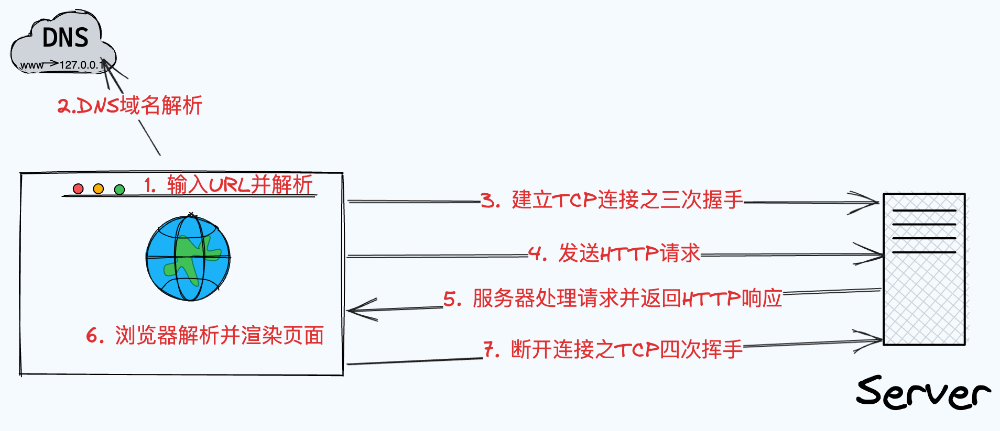

##### DNS

DNS（Domain Name System）是⼀种⽤于将域名（例如www.baidu.com）转换为IP地址（例如220.181.111.188 ）的分布式系统。在互联⽹上，计算机和其他⽹络设备使⽤IP地址来相互识别和通信。然⽽，IP地址是⼀串数字，不太⽅便⼈们使⽤和记忆，所以就使⽤了域名来代替复杂的IP地址

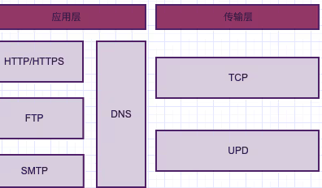

对于DNS服务器若采⽤集中式的设计有以下问题:

1. 单点故障

   如果 DNS 服务器崩溃，那么整个⽹络随之瘫痪。通信容量(traaffic volume) ，单个 DNS 服务器不得不处理所有的DNS 查询，这种查询级别可能是上百万上千万级，⼀台服务器很难满⾜;

2. 远距离集中式数据库

   单个DNS服务器不可能邻近所有的⽤户，假设在美国的DNS服务器不可能临近让澳⼤利亚的查询使⽤，其中查询请求势必会经过低速和拥堵的链路，造成严重的时延；

3. 维护

   维护成本巨⼤，⽽且还需要频繁更新。

###### 域名的层级关系

DNS 中的域名都是⽤句点来分隔的，⽐如 www.server.com ，这⾥的句点代表了不同层次之间的界限。 在域名中，越靠右的位置表示其层级越⾼。

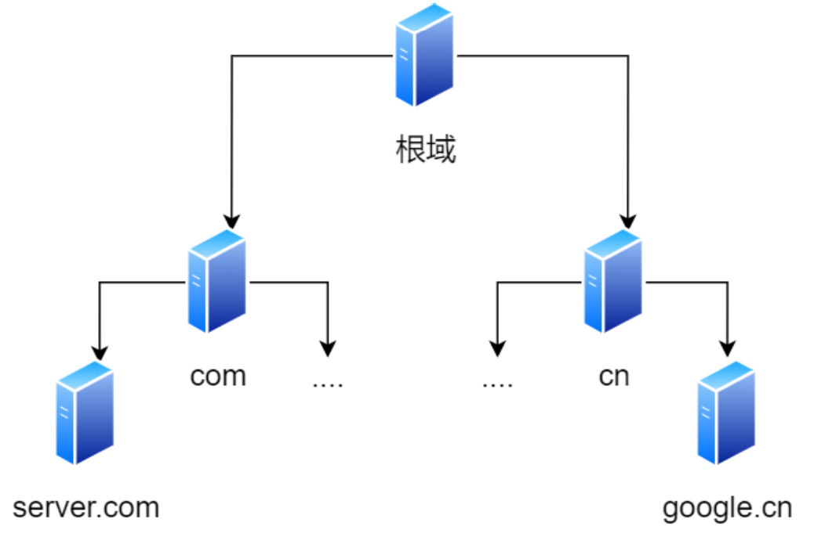

###### DNS 解析过程

1. 先查询浏览器缓存是否有该域名对应的IP地址。
2. 如果浏览器缓存中没有，会去计算机本地的Host⽂件中查询是否有对应的缓存。
3. 如果Host⽂件中也没有则会向本地的DNS服务器（通常由你的互联⽹服务提供商（ISP）提供， ⽐如中国移动）发送⼀个DNS查询请求。
4. 如果本地DNS解析器有该域名的ip地址，就会直接返回，如果没有缓存该域名的解析记录，它会向根DNS服务器发出查询请求。根DNS服务器并不负责解析域名，但它能告诉本地DNS解析器应该向哪个顶级域（.com/.net/.org）的DNS服务器继续查询。
5. 本地 DNS 解析器接着向指定的顶级域名DNS服务器发出查询请求。顶级域DNS服务器也不负责具体的域名解析，但它能告诉本地DNS解析器应该前往哪个权威DNS服务器查询下⼀步的信息。
6. 本地DNS解析器最后向权威DNS服务器发送查询请求。 权威DNS服务器是负责存储特定域名和IP地址映射的服务器。当权威DNS服务器收到查询请求时，它会查找"example.com"域名对应的IP地址，并将结果返回给本地DNS解析器。
7. 本地DNS解析器将收到的IP地址返回给浏览器，并且还会将域名解析结果缓存在本地，以便下次访问时更快地响应。
8. 浏览器发起连接： 本地DNS解析器已经将IP地址返回给您的计算机，您的浏览器可以使⽤该IP地址与⽬标服务器建⽴连接，开始获取⽹⻚内容。

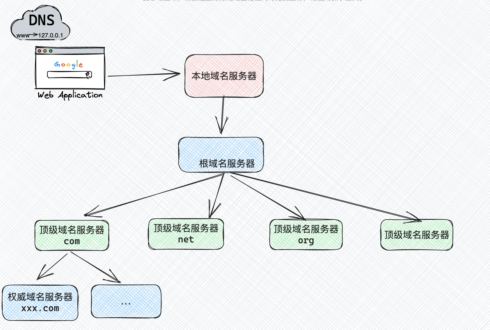

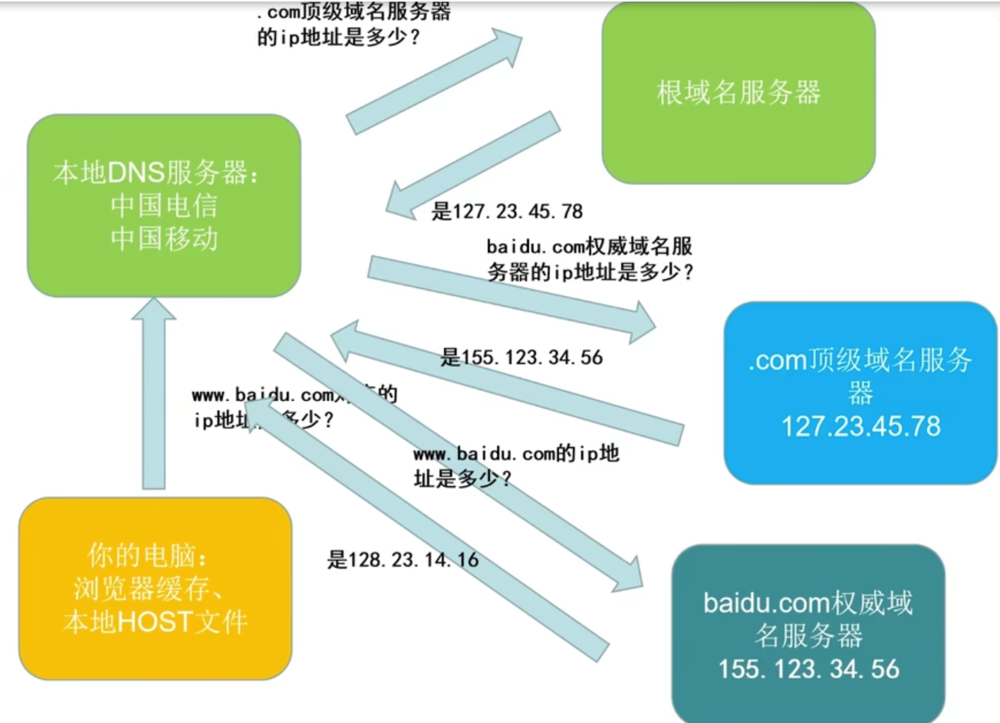

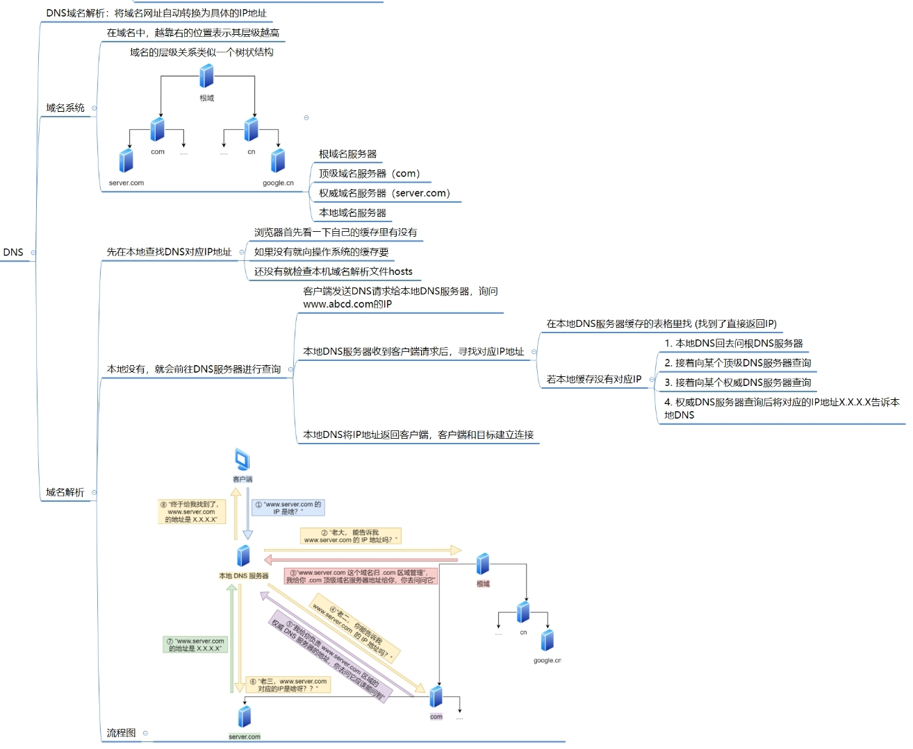

###### 递归查询和迭代查询

递归查询和迭代查询是在DNS解析过程中⽤于获取域名解析信息的两种不同⽅法。
1. 递归查询

  在递归查询中，DNS客户端（通常是本地DNS解析器）向上层DNS服务器（如根域名服务器、顶级域名服务器）发起查询请求，并要求这些服务器直接提供完整的解析结果。递归查询的特点是，DNS客户端只需要发送⼀个查询请求，然后等待完整的解析结果。上层DNS服务器会⾃⾏查询下⼀级的服务器，并将最终结果返回给DNS客户端。

2. 迭代查询

  在迭代查询中，DNS客户端向上层DNS服务器发起查询请求，但不要求直接提供完整的解析结果。相反，DNS客户端只是询问上层服务器⼀个更⾼级的域名服务器的地址，然后再⾃⾏向那个更⾼级的服务器发起查询请求，以此类推，直到获取完整的解析结果为⽌。

递归查询适合普通⽤户和客户端，⽽迭代查询适⽤于DNS服务器之间的通信。

##### HTTP特性与简述

特性：简单、灵活、易于扩展、应⽤⼴泛和跨平台。

**简述**：

Web 上的通信都是建⽴在 HTTP 协议上的

1. 客户端发起 HTTP 请求；
2. 服务器做出响应处理后，返回 HTTP 响应报⽂

最初设想的基本理念是：借助多⽂档之间相互关联形成的超⽂本（HyperText），连成可相互参阅的 WWW（World Wide Web，万维⽹）

**WWW 构建技术（3 项）**：

1. HTML (HyperText Markup Language)：作为⻚⾯的⽂本标记语⾔
2. HTTP (HyperText Transfer Protocol)：⽂档传递协议；
3. URL (Uniform Resource Locator)：指定⽂档所在地址

**HTTP 版本**：

1. 1996 年的 5 ⽉，HTTP/1.0，并记载于 RFC1945。现在 HTTP/1.0，仍然被使⽤在服务器端；
2. 1997 年 1 ⽉，发布 HTTP/1.1 ，是⽬前主流的 HTTP 协议版本
3. 现今，HTTP/2.0 正在制订中，但还未得到⼴泛的使⽤

**特性**：

1. 简单

  基本报⽂格式为header+body，头部信息也是key-value简单⽂本的形式，易于理解。

2. 灵活和易于扩展

  - HTTP协议⾥的各种请求⽅法、URI/URL、状态码、头字段等每个组成要求都没有被固定死，允许开发⼈员⾃定义和扩充;
  - HTTP⼯作在应⽤层（OSI第七层），下层可以随意变化;
  - HTTPS就是在HTTP与TCP之间增加了SSL/TSL安全传输层，HTTP/3把TCP换成了基于UDP的QUIC。

3. ⽆状态、明⽂传输、不安全

  ⽆状态：

  服务器不会去记忆HTTP的状态，所以不需要额外的资源来记录状态信息，这能减轻服务器的负担。但它在完成有关联性的操作时会⾮常麻烦。

> 对于⽆状态的问题，解决⽅案友很多种，其中⽐较简单的⽅式的是 Cookie 技术， Cookie 通过在请求和响应报⽂中写⼊ Cookie 信息来控制客户端的状态。

  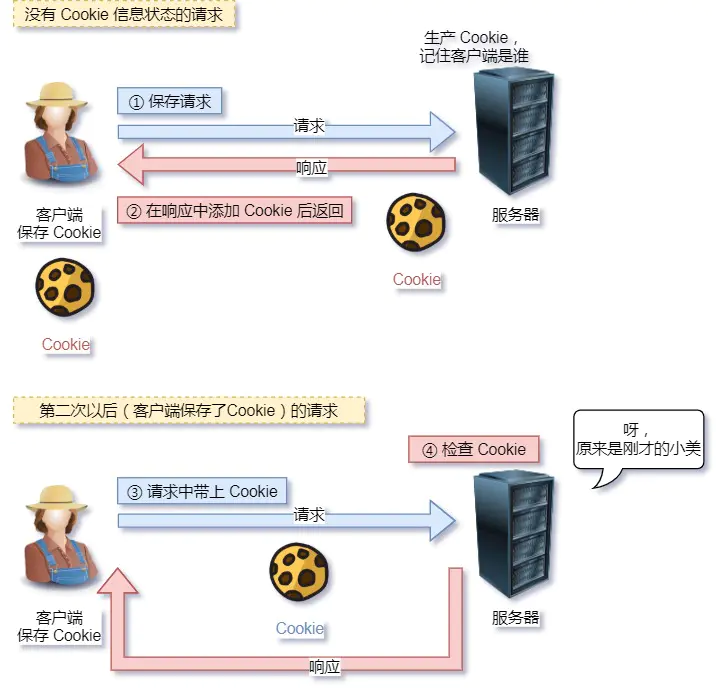

  明⽂传输：

  传输过程中的信息，是可⽅便阅读的，通过浏览器的F12控制台或Wireshark抓包都可以直接⾁眼查看明⽂传输为我们调试⼯作带来了极⼤的便利性，但信息透明，容易被窃取。

  不安全：

  1. 通信使⽤明⽂（不加密），内容可能被窃听
  2. 不验证通信⽅的身份，因此有可能遭遇伪装
  3. ⽆法证明报⽂的完整性，所以有可能已遭篡改

  可以⽤ HTTPS 的⽅式解决，也就是通过引⼊ SSL/TLS 层，使得在安全上达到了极致。

##### HTTP版本演变

⽬前为⽌，HTTP 常⻅的版本有 HTTP/1.1 ， HTTP/2.0 ， HTTP/3.0 ，不同版本的 HTTP 特性是不⼀样的。

**HTTP/0.9**

HTTP/0.9 是最早的HTTP版本，在1991年就已经发布，只⽀持 GET ⽅法，也没有请求头，服务器只能返回 HTML格式的内容。

**HTTP/1.0**

HTTP/1.0 是HTTTP 协议的第⼀个正式版本, 主要具有以下特性：

- 引⼊了请求头和响应头，⽀持多种请求⽅法和状态码
- 不⽀持持久连接，每次请求都需要建⽴新的连接

**HTTP/1.1**

1. ⻓连接

  为了解决 HTTP/1.0 每次请求都需要建⽴新的连接的问题， HTTP/1.1 提出了⻓连接（持久连接），只要客户端和
  服务器任意⼀端没有明确提出断开连接，则保持TCP连接状态。

  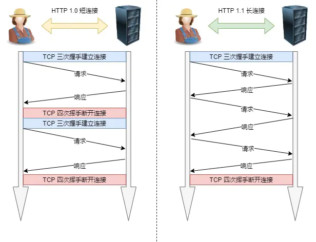

2. 管道⽹络传输

  在同⼀个 TCP 连接⾥⾯，客户端可以发起多个请求，只要第⼀个请求发出去了，不必等其回来，就可以发第⼆个请求出去，可以减少整体的响应时间。

  客户端需要请求两个资源。以前的做法是，在同⼀个 TCP 连接⾥⾯，先发送 A 请求，然后等待服务器做出回应，收到后再发出 B 请求。那么，管道机制则是允许浏览器同时发出 A 请求和 B 请求

  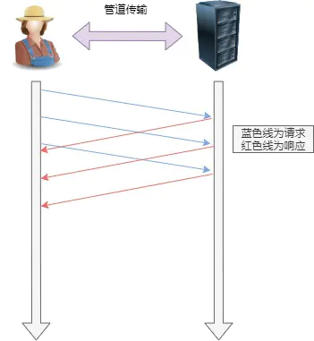

  但是服务器必须按照接收请求的顺序发送对这些管道化请求的响应。

  如果服务端在处理 A 请求时耗时⽐较⻓，那么后续的请求的处理都会被阻塞住，这称为「队头堵塞」。

  所以，HTTP/1.1 管道解决了请求的队头阻塞，但是没有解决响应的队头阻塞。

> HTTP/1.1 管道化技术不是默认开启，⽽且浏览器基本都没有⽀持

3. 队头阻塞

  当顺序发送的请求序列中的⼀个请求因为某种原因被阻塞时，在后⾯排队的所有请求也⼀同被阻塞了，会招致客户端⼀直请求不到数据，这也就是「队头阻塞」

  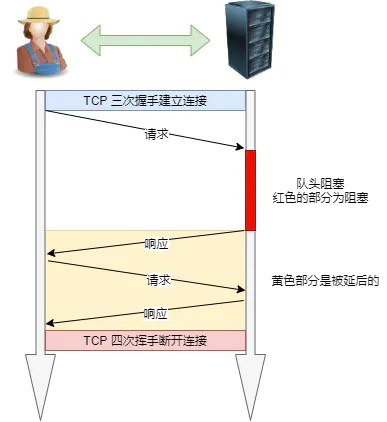

  但是 HTTP1.1 仍然存在着不少问题：

  - 头部冗余：每个请求和响应都需要带有⼀定的头部信息，每次互相发送相同的⾸部造成的浪费较多；
  - 服务器是按请求的顺序响应的，如果服务器响应慢，会招致客户端⼀直请求不到数据，也就是队头阻塞；
  - 没有请求优先级控制；
  - 请求只能从客户端开始，服务器只能被动响应。

**HTTP/2**

HTTP/2 协议是基于 HTTPS 的, 所以HTTP/2的安全性也是有保障的

1. 头部压缩：HTTP/2 使⽤ HPACK 压缩算法对请求和响应头部进⾏压缩，减少了传输的头部数据量，降低了延迟。
2. ⼆进制帧：HTTP/2 将数据分割成⼆进制帧进⾏传输，分为**头信息帧**（Headers Frame）和**数据帧**（Data Frame），增加了数据传输的效率。
3. 并发传输：引出了 Stream 概念，多个 Stream 复⽤在⼀条 TCP 连接，针对不同的 HTTP 请求⽤独⼀⽆⼆的Stream ID 来区分，接收端可以通过 Stream ID 有序组装成 HTTP 消息，不同 Stream 的帧是可以乱序发送的，因此可以并发不同的 Stream ，也就是 HTTP/2 可以并⾏交错地发送请求和响应。
4. 服务器推送：在 HTTP/2 中，服务器可以对客户端的⼀个请求发送多个响应，即服务器可以额外的向客户端推送资源，⽽⽆需客户端明确的请求。

但是 HTTP/2 仍然存在着队头阻塞的问题，只不过问题是在传输层。

HTTP/2 是基于 TCP 协议来传输数据的，TCP 是字节流协议，TCP 层必须保证收到的字节数据是完整且连续的，这样内核才会将缓冲区⾥的数据返回给 HTTP 应⽤，那么当「前 1 个字节数据」没有到达时，后收到的字节数据只能存放在内核缓冲区⾥，只有等到这 1 个字节数据到达时，HTTP/2 应⽤层才能从内核中拿到数据，这就是 HTTP/2队头阻塞问题。

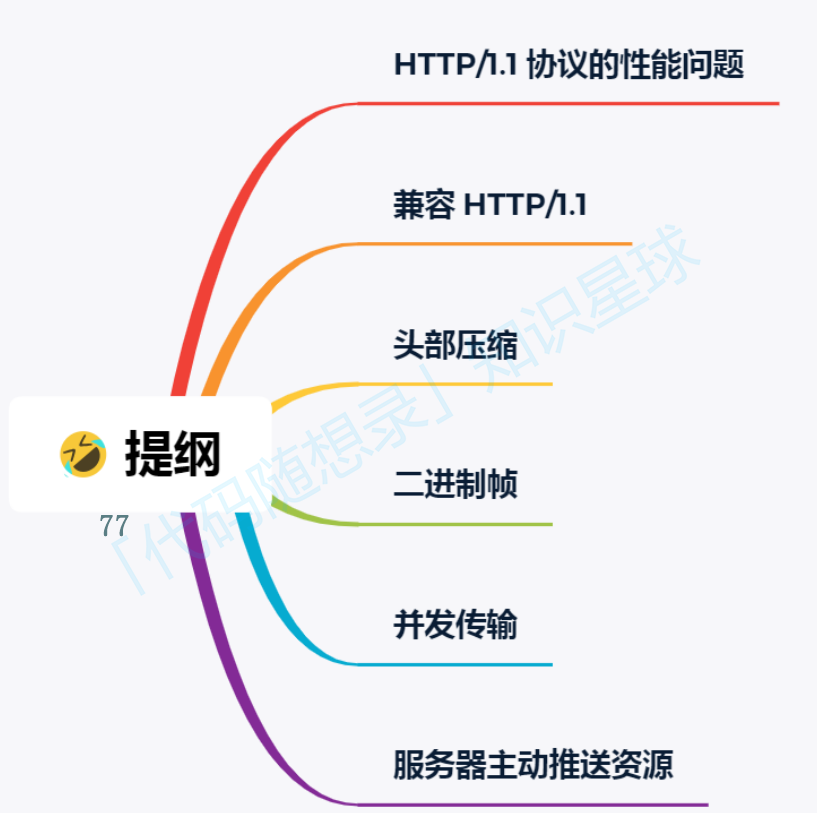

**HTTP1.1 协议的性能问题**

1. HTTP1.1常⻅性能问题
   - 延迟难以下降，虽然现在网络的「带宽」相比以前变多了，但是延迟降到一定幅度后，就很难再下降了，说白了就是到达了延迟的下限；
   - 并发连接有限，谷歌浏览器最大并发连接数是6个，而且每一个连接都要经过TCP和几S握手耗时，以及TCP慢启动过程给流量带来的影响；
   - 队头阻塞问题，同一连接只能在完成一个HTTP事务（请求和响应）后，才能处理下一个事务；
   - HTTP头部巨大且重复，由于HTTP协议是无状态的，每一个请求都得携带HTTP头部，特别是对于有携带cookie的头部，而cookie的大小通常很大；
   - 不支持服务器推送消息，因此当客户端需要获取通知时，只能通过定时器不断地拉取消息，这无疑浪费大量了带宽和服务器资源。
2. 为解决HTTP1.1性能问题⽽提出的常⻅优化⼿段
   - 将多张小图合并成一张大图供浏览器JavaScript来切割使用，这样可以将多个请求合并成一个请求，但是带来
     了新的问题，当某张小图片更新了，那么需要重新请求大图片，浪费了大量的网络带宽；
   - 将图片的二进制数据通过base64编码后，把编码数据嵌入到HTML或CSS文件中，以此来减少网络请求次数；
   - 将多个体积较小的JavaScript文件使用webpack等工具打包成一个体积更大的JavaScript文件，以一个请求替代了很多个请求，但是带来的问题，当某个s文件变化了，需要重新请求同一个包里的所有S文件；
   - 将同一个页面的资源分散到不同域名，提升并发连接上限，因为浏览器通常对同一域名的HTTP连接最大只能是6个；

但是上述优化⼿段都只是“外部”优化，效果不够好。

**兼容HTTP1.1**

HTTP2，为改善HTTP1.1⽽提出，同时兼容了HTTP1.1，具体做法如下：

1. HTTP/2没有在URI里引入新的协议名，仍然用「http小表示明文协议，用「https:/小表示加密协议，于是只需要浏览器和服务器在背后自动升级协议，这样可以让用户意识不到协议的升级，很好的实现了协议的平滑升级。
2. 第二点，只在应用层做了改变，还是基于TCP协议传输，应用层方面为了保持功能上的兼容，HTTP2把HTTP分解成了「语义和「语法」两个部分，「语义」层不做改动，与HTTP/1.1完全一致，比如请求方法、状态码、头字段等规则保留不变。

但是，HTTP/2在「语法层面做了很多改造，基本改变了HTTP报文的传输格式。

**头部压缩**

HTTP1.1报⽂中Header部分存在的问题：

- 含很多固定的字段，比如Cookie、User Agent、.Accept等，这些字段加起来也高达几百字节甚至上千字节，所以有必要压缩；
- 大量的请求和响应的报文里有很多字段值都是重复的，这样会使得大量带宽被这些冗余的数据占用了，所以有必须要避免重复性；
- 字段是ASC编码的，虽然易于人类观察，但效率低，所以有必要改成二进制编码；

HTTP2的改造：

使⽤HPACK算法压缩头部。HPACK算法包含三个组成部分：静态字典、动态字典、Huffman编码（压缩算法）

客户端和服务器都会建⽴和维护【字典】，⽤⻓度较⼩的索引号表示重复的字符串，再⽤ Huffman 编码压缩数据。

1. 静态表编码：
   HTTP2 为⾼频出现在头部的字符串和字段建⽴了⼀张静态表，它是写⼊到 HTTP2 框架⾥的，不会变化的，静态表⾥共有 61 组：

   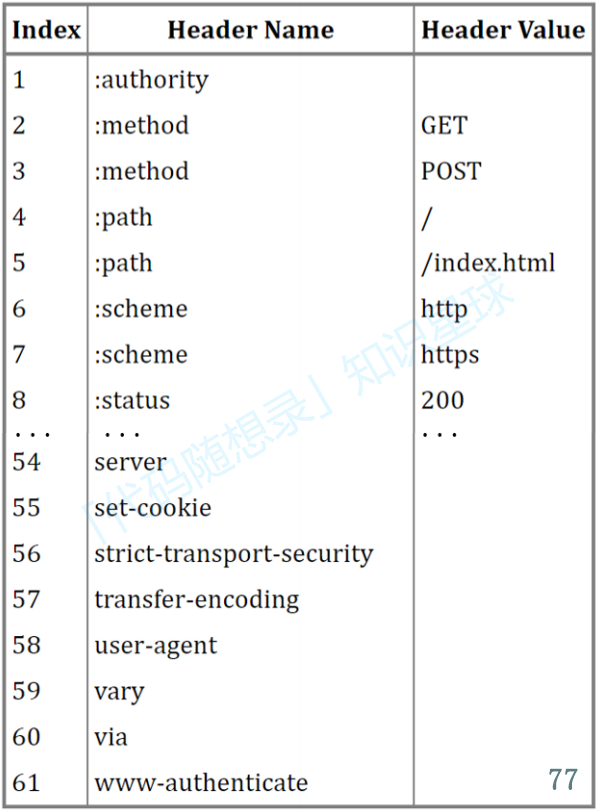

2. 动态表编码

   使得动态表⽣效的⼀个前提：必须同⼀个连接上，重复传输完全相同的HTTP头部。

   动态表越⼤，占⽤的内存也就越⼤，如果占⽤了太多内存，是会影响服务器性能的，因此 Web 服务器都会提供类似http2_max_requests 的配置，⽤于限制⼀个连接上能够传输的请求数，避免动态表⽆限增⼤，请求数到达上限后，就会关闭 HTTP/2 连接来释放内存。

   HTTP2头部的编码通过【静态表、动态表、Huffman编码】共同完成。

**⼆进制帧**

HTTP2更厉害的地⽅在于：将HTTP1的⽂本格式改成⼆进制格式传输数据，极⼤提⾼了HTTP传输效率，⽽且⼆进制数据使⽤位运算能⾼效解析。

两者响应区别（如下图）：

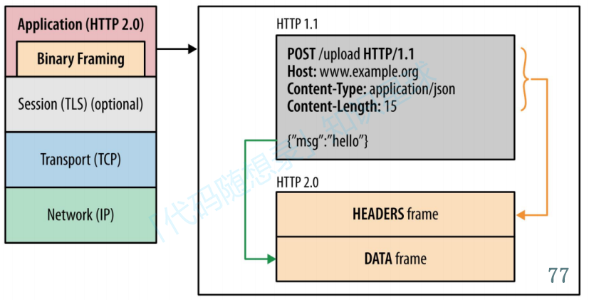

HTTP2⼆进制帧的结构：

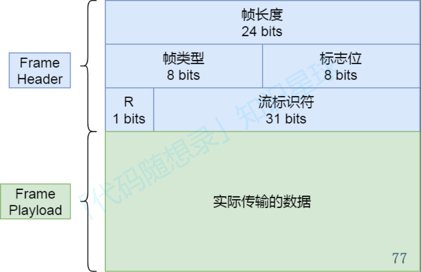

HTTP2总共定义了10种类型的帧，分为两类，即数据帧和控制帧：

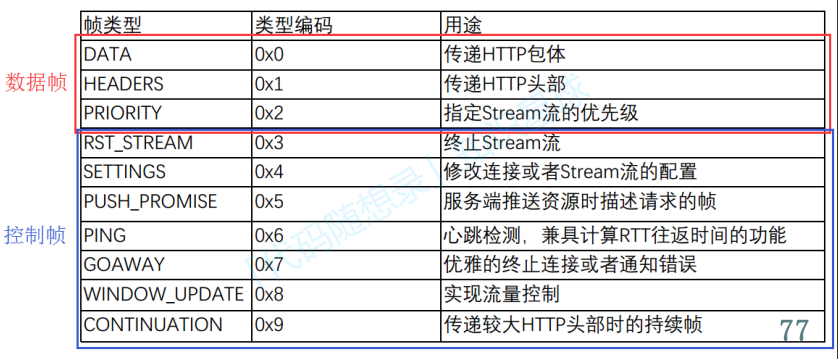

标志位⽤于携带简单的控制信息，⽐如：

- END HEADERS表示头数据结束标志，相当于HTTP/1里头后的空行(AAn”)；
- END STREAM表示单方向数据发送结束，后续不会再有数据帧。
- PRIORITY表示流的优先级；

**流标识符（Stream ID)**：
⽤来标识该Fream属于哪个Stream。接收⽅可以根据这个信息从乱序的帧⾥找到相同Stream ID的帧，从⽽有序组装信息。

**帧数据**：
⽤于存放 通过 HPACK 算法压缩过的HTTP头部和包体。

**并发传输**

1. HTTP1.1与HTTP2的⽐较

   HTTP1.1 基于请求-响应模型。同⼀个连接中，HTTP完成⼀个事务（请求与响应），才能处理下⼀个事务。即：再发出请求等待响应的过程种是没办法做其他事情的，会造成【队头阻塞】问题。

   HTTP2通过Stream这个设计（多个Stream复⽤⼀条TCP连接，达到并发的效果），解决了【队头阻塞】的问题，提⾼了HTTP传输的吞吐量。

2. HTTPS并发的实现

   HTTP2并发是如何实现的呢？

   先来理解三个概念，即：Stream、Message、frame。

   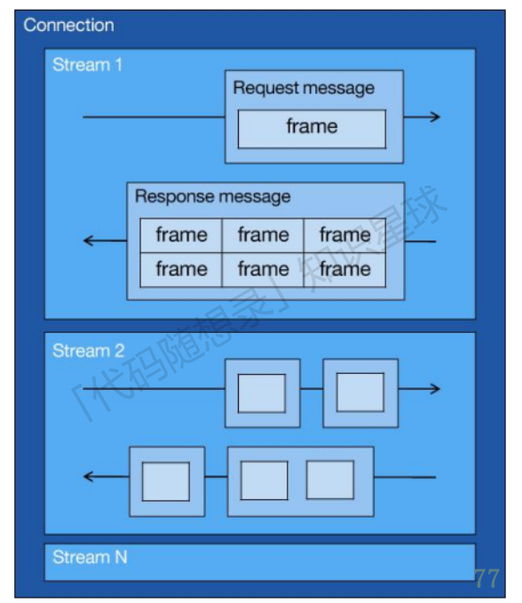

   从上图可以看到：

   - 1个TCP连接包含一个或者多个Stream,Stream是HTTP/2并发的关键技术，
   - Stream里可以包含1个或多个Message,Message对应HTTP/1中的请求或响应，由HTTP头部和包体构成；
   - Message里包含一条或者多个Frame,Frame是HTTP/2最小单位，以二进制压缩格式存放HTTP/1中的内容（头部和包体）；
   - HTTP消息可以由多个Frame构成
   - ⼀个Frame可以由多个TCP报⽂构成

   在HTTP2连接上，不同Stream的帧可以乱序发送（因此可以并发不同的Stream），接收端可以通过Stream ID 有序组装HTTP消息。

   HTTP/2通过Stream实现的并发，比HTTP/1.1通过TCP连接实现并发要牛逼的多，因为当HTTP/2实现100个并发Stream时，只需要建立一次TCP连接，而HTTP/A.1需要建立1O0个TCP连接，每个TCP连接都要经过TCP握手、慢启动以及TLS握手过程，这些都是很耗时的。

   HTTP/2还可以对每个Stream设置不同优先级，帧头中的「标志位！可以设置优先级，比如客户端访问HTML/CSS和图片资源时，希望服务器先传递HTML/CSS,再传图片，那么就可以通过设置Stream的优先级来实现，以此提高用户体验。

**服务器主动推送资源**

**HTTP1.1与HTTP2的⽐较**：

HTTP1.1不⽀持服务器主动推送资源给客户端，都是由客户端向服务器发起请求后，才能获取到服务器响应的资源。在HTTP2中，客户端在访问HTML时，服务器可以直接主动推送CSS⽂件，减少了消息传递的次数。

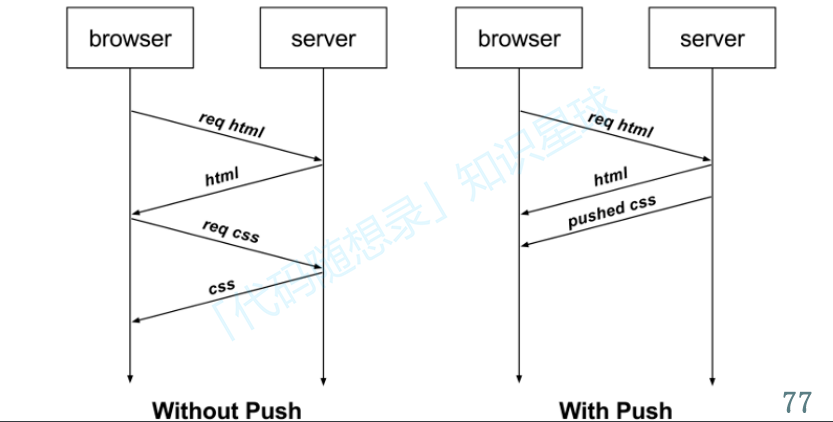

HTTP2推送的具体实现⽅式：

**HTTP如何提升性能**：

1. 对于常见的HTTP头部通过**静态表和Huffman编码**的方式，将体积压缩了近一半，而且针对后续的请求头部，还可以建立动态表，将体积压缩近90%，大大提高了编码效率，同时节约了带宽资源。

   不过，动态表并非可以无限增大，因为动态表是会占用内存的，动态表越大，内存也越大，容易影响服务器总体的并发能力，因此服务器需要限制HTTP/2连接时长或者请求次数。

2. HTP/2实现了**Stream并发**，多个Stream只需复用1个TCP连接，节约了TCP和TLS握手时间，以及减少了TCP慢启动阶段对流量的影响。不同的Stream ID才可以并发，即时乱序发送帧也没问题，但是同一个Stream里的帧必须严格有序。

   另外，可以根据资源的渲染顺序来设置Stream的优先级，从而提高用户体验。

3. **服务器支持主动推送资源**，大大提升了消息的传输性能，服务器推送资源时，会先发送PUSH_PROMISE帧，告诉客户端接下来在哪个Stream发送资源，然后用偶数号Stream发送资源给客户端。
   HTTP/2通过Stream的并发能力，解决了HTTP1队头阻塞的问题，看似很完美了，但是HTTP2还是存在“队头阻塞”的问题，只不过问题不是在HTTP这一层面，而是在TCP这一层。

   HTTP/2是基于TCP协议来传输数据的，TCP是字节流协议，TCP层必须保证收到的字节数据是完整且连续的，这样内核才会将缓冲区里的数据返回给HTP应用，那么当「前1个字节数据」没有到达时，后收到的字节数据只能存放在内核缓冲区里，只有等到这1个字节数据到达时，HTP/2应用层才能从内核中拿到数据，这就是HTTP/2队头阻塞问题。

有没有什么解决方案呢？既然是TCP协议自身的问题，那干脆放弃TCP协议，转而使用UDP协议作为传输层协
议，这个大胆的决定，HTTP3协议做了！

**HTTP/3**

> HTTP/2 队头阻塞的问题是因为 TCP，所以 HTTP/3 把 HTTP 下层的 TCP 协议改成了 UDP！

HTTP/3 基于 QUIC 协议，具有以下特点：

- 零 RTT 连接建⽴：QUIC 允许在⾸次连接时进⾏零往返时间（Zero Round Trip Time）连接建⽴，从⽽减少了连接延迟，加快了⻚⾯加载速度。
- ⽆队头阻塞: QUIC 使⽤ UDP 协议来传输数据。⼀个连接上的多个stream之间没有依赖, 如果⼀个stream丢了⼀个UDP包，不会影响后⾯的stream，不存在 TCP 队头阻塞
- 连接迁移：QUIC 允许在⽹络切换（如从 Wi-Fi 到移动⽹络）时，将连接迁移到新的 IP 地址，从⽽减少连接的中断时间。
- 向前纠错机制：每个数据包除了它本身的内容之外，还包括了部分其他数据包的数据，因此少量的丢包可以通过其他包的冗余数据直接组装⽽⽆需重传。向前纠错牺牲了每个数据包可以发送数据的上限，但是减少了因为丢包导致的数据重传。

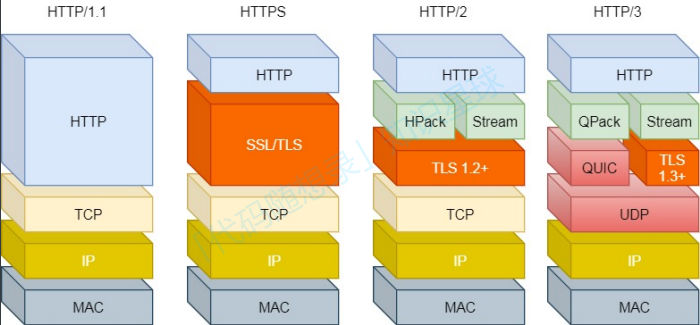

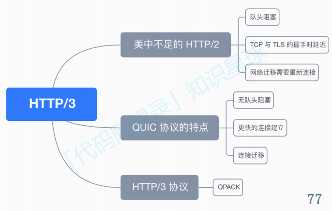

HTTP/2的缺点

HTTP2协议是基于TCP实现的，所以存在三个缺陷：队头阻塞、TCP与TLS的握⼿时延迟、⽹络迁移需要重新连接

1. 队头阻塞

   TCP 是字节流协议，TCP 层必须保证收到的字节数据是完整且有序的，如果序列号较低的 TCP 段在⽹络传输中丢失了，即使序列号较⾼的 TCP 段已经被接收了，应⽤层也⽆法从内核中读取到这部分数据，从 HTTP 视⻆看，就是请求被阻塞了。

   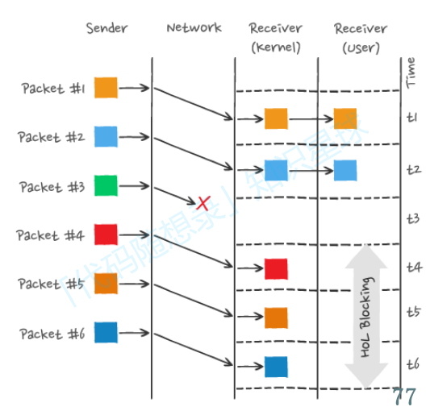

2. TCP与TLS的握⼿时延迟

   发出HTTP请求时，需要经过TCP三次握⼿和TLS四次握⼿，共计3RTT的时延才能发出请求数据。

3. ⽹络迁移需要重新连接

   ⼀个TCP连接由【源IP地址，源端⼝，⽬标IP地址，⽬标端⼝】确定。若IP地址或端⼝发⽣变暖，这需要重新进⾏连接。这不利于移动设备切换⽹络的场景。要解决该问题，就要修改传输层协议。在HTTP3中传输层协议修改为了UDP。

   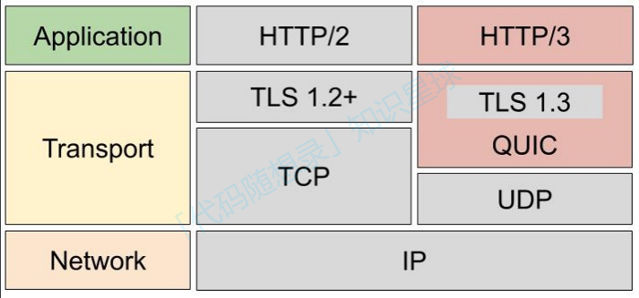

**QUIC协议的特点**

UDP是⼀个简单的、不可靠的传输协议，⽽且UDP包之间是⽆序的，也没有依赖关系。UDP也不需要连接。

HTTP3基于UDP协议在 应⽤层 实现了 QUIC 协议，它有类似TCP的连接管理、拥塞窗⼝、流量控制的⽹络特性，相当于将不可靠的UDP协议变成可靠的了，⽆需担⼼数据包丢包的问题。

1. ⽆队头阻塞

   HTTP2:只要某个流中的数据包丢失了，其他流也会因此受影响。

   HTTP3:流与流（Stream)之间不影响。

   

2. 更快的连接建⽴

   对于 HTTP/1 和 HTTP/2 协议，TCP 和 TLS 是分层的，分别属于内核实现的传输层、openssl 库实现的表示层，因此它们难以合并在⼀起，需要分批次来握⼿，先 TCP 握⼿，再 TLS 握⼿。

   HTTP/3 在传输数据前虽然需要 QUIC 协议握⼿，这个握⼿过程只需要 1 RTT，握⼿的⽬的是为确认双⽅的「连接ID」，连接迁移就是基于连接 ID 实现的。

   但是 HTTP/3 的 QUIC 协议并不是与 TLS 分层，⽽是QUIC 内部包含了 TLS，它在⾃⼰的帧会携带 TLS ⾥的“记录”，再加上 QUIC 使⽤的是 TLS1.3，因此仅需 1 个 RTT 就可以「同时」完成建⽴连接与密钥协商，甚⾄在第⼆次连接的时候，应⽤数据包可以和 QUIC 握⼿信息（连接信息 + TLS 信息）⼀起发送，达到 0-RTT 的效果。

   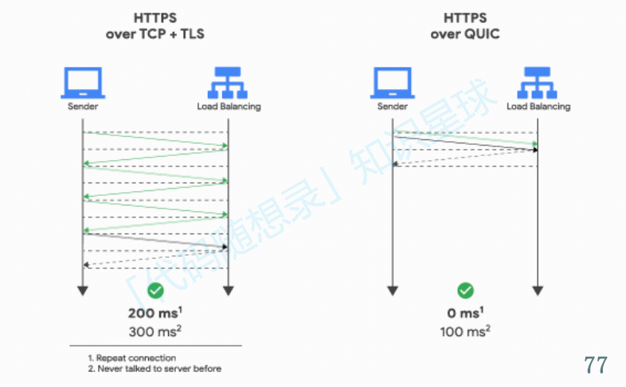

3. 连接迁移

   在前面我们提到，基于TCP传输协议的HTTP协议，由于是通过四元组(源IP、源端口、目的P、目的端口)确定一条TCP连接，那么当移动设备的网络从4G切换到WIFI时，意味着P地址变化了，那么就必须要断开连接，然后重新建立连接，而建立连接的过程包含TCP三次握手和TLS四次握手的时延，以及TCP慢启动的减速过程，给用户的感觉就是网络突然卡顿了一下，因此连接的迁移成本是很高的。

   而QUIC协议没有用四元组的方式来“绑定”连接，而是通过连接D来标记通信的两个端点，客户端和服务器可以各自选择一组D来标记自己，因此即使移动设备的网络变化后，导致P地址变化了，只要仍保有上下文信息（比如连接D、TLS密钥等），就可以“无缝”地复用原连接，消除重连的成本，没有丝毫卡顿感，达到了连接迁移的功能。

**HTTP/3协议**

HTTP/3 同 HTTP/2 ⼀样采⽤⼆进制帧的结构，不同的地⽅在于 HTTP/2 的⼆进制帧⾥需要定义 Stream，⽽HTTP/3 ⾃身不需要再定义 Stream，直接使⽤ QUIC ⾥的 Stream，于是 HTTP/3 的帧的结构也变简单了。

1. 对⽐图如下：

   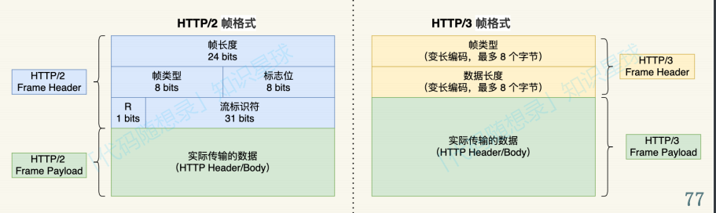

2. 头部压缩算法：

   HTTP2:HPACK

   HTTP3:QPACK

3. 静态表：

   HTTP2:静态表61项

   HTTP3:静态表91项

4. 动态表：
   HTTP2：动态表是具有时序性的，如果⾸次出现的请求发⽣了丢包，后续的收到请求，对⽅就⽆法解码出HPACK头部，因为对⽅还没建⽴好动态表，因此后续的请求解码会阻塞到⾸次请求中丢失的数据包重传过来。

   HTTP3的QPACK解决了上述问题，具体⽅案如下：

   QUC会有两个特殊的单向流，所谓的单项流只有一端可以发送消息，双向则指两端都可以发送消息，传输HTTP消息时用的是双向流，这两个单向流的用法：

   - 一个叫QPACK Encoder Stream,用于将一个字典(key-value)传递给对方，比如面对不属于静态表的HTTP请求头部，客户端可以通过这个Stream发送字典；
   - 一个叫QPACK Decoder Stream,用于响应对方，告诉它刚发的字典已经更新到自己的本地动态表了，后续就可以使用这个字典来编码了。

   这两个特殊的单向流是用来同步双方的动态表，编码方收到解码方更新确认的通知后，才使用动态表编码HTTP头
   部。

##### HTTP缓存

未完待续~~~
