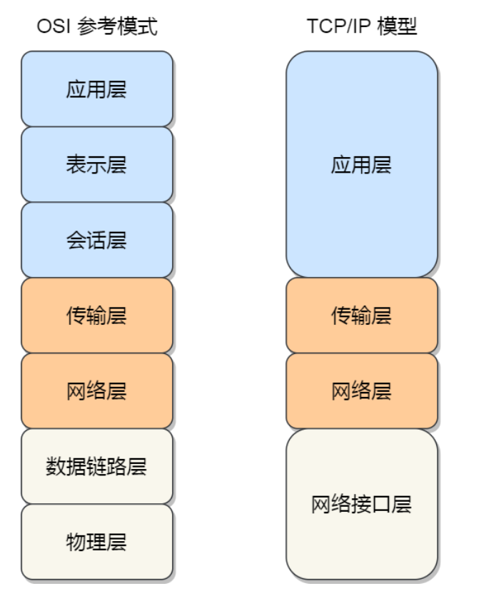
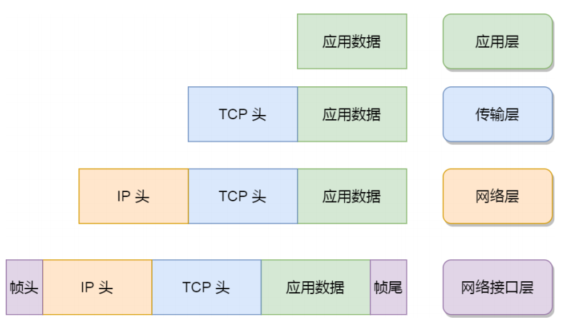

# 面试题

## 计算机网络

### OSI 七层参考模型

OSI（Open System Interconnection）模型，即开放式系统互联，是国际标准化组织（ISO）制定的⼀个⽤于计算机或通信系统间互联的标准体系，旨在将计算机⽹络通信划分为七个不同的层级，每个层级都负责特定的功能。每个层级都构建在其下⽅的层级之上，并为上⽅的层级提供服务。七层从下到上分别是物理层、数据链路层、⽹络层、传输层、会话层、表示层和应⽤层。可以简称为“物数⽹传会表应”。
1. 物理层：负责物理传输媒介的传输，例如电缆、光纤或⽆线信号。主要作⽤是传输⽐特流（就是由 1、0 转化为电流强弱来进⾏传输，到达⽬的地后再转化为 1、0，也就是我们常说的数模转换与模数转换）。这⼀层的数据叫做⽐特。
2. 数据链路层：建⽴逻辑连接、进⾏硬件地址寻址、差错校验等功能。定义了如何让格式化数据以帧为单位进⾏传输，以及如何控制对物理介质的访问。将⽐特组合成字节进⽽组合成帧，⽤ MAC 地址访问介质，传输单位是桢。
3. ⽹络层：负责数据的路由和转发，选择最佳路径将数据从源主机传输到⽬标主机。它使⽤IP地址来标识不同主机和⽹络，并进⾏逻辑地址寻址。传输单位是数据报。常⻅的协议有ICMP、ARP、IP
4. 传输层：提供端到端的数据传输服。它使⽤TCP（传输控制协议）和UDP（⽤户数据报协议）来管理数据传输。
5. 会话层：建⽴、管理和终⽌应⽤程序之间的会话连接。它处理会话建⽴、维护和终⽌，以及处理会话过程中的异常情况。
6. 表示层：负责数据的格式转换、加密和解密，确保数据在不同系统之间的正确解释和呈现，也就是把计算机能够识别的东⻄转换成⼈能够能识别的东⻄（如图⽚、声⾳等）。
7. 应⽤层：⽹络服务与最终⽤户的⼀个接⼝。这⼀层为⽤户的应⽤程序（例如电⼦邮件、⽂件传输和终端仿真）提供⽹络服务。常⻅的协议有：FTP、SMTP、HTTP、DNS。OSI七层⽹络模型为⽹络通信的不同功能提供了逻辑上的划，为⽹络协议的设计和实现提供了标准化的框架。然⽽，在实际⽹络通信中，常⽤的TCP/IP协议栈更为⼴泛和普遍。

### TCP/IP四层⽹络模型

TCP/IP模型是⼀种⽤于组织和描述计算机⽹络通信的标准模型，它是互联⽹最常⽤的协议栈。TCP/IP模型由两个主要协议组成：TCP（Transmission Control Protocol）和IP（Internet Protocol）。它是互联⽹通信的基础，也被⼴泛⽤于局域⽹和⼴域⽹等各种⽹络环境。TCP/IP模型分为四个层级，每个层级负责特定的⽹络功能。以下是TCP/IP模型的层级及其功能：
1. 应⽤层（Application Layer）：该层与OSI模型的应⽤层和表示层以及会话层类似，提供直接与⽤户应⽤程序交互的接⼝。它为⽹络上的各种应⽤程序提供服务，如电⼦邮件（SMTP）、⽹⻚浏览（HTTP）、⽂件传输（FTP）等。
2. 传输层（Transport Layer）：该层对应OSI模型的传输层。它负责端到端的数据传输，提供可靠的、⽆连接的数据传输服务。主要的传输层协议有TCP（Transmission Control Protocol）和UDP（User DatagramProtocol）。TCP提供可靠的数据传输，确保数据的正确性和完整性；⽽UDP则是⽆连接的，适⽤于不要求可靠性的传输，如实时⾳频和视频流。
3. ⽹际层（Internet Layer）：该层对应OSI模型的⽹络层。主要协议是IP（Internet Protocol），它负责数据包的路由和转发，选择最佳路径将数据从源主机传输到⽬标主机。IP协议使⽤IP地址来标识主机和⽹络，并进⾏逻辑地址寻址。
4. ⽹络接⼝层（Link Layer）：该层对应OSI模型的数据链路层和物理层。它负责物理传输媒介的传输，例如以太⽹、Wi-Fi等，并提供错误检测和纠正的功能。此外，⽹络接⼝层还包含硬件地址（MAC地址）的管理。

TCP/IP模型和OSI七层⽹络模型有些相似，但并不完全⼀样。TCP/IP模型较为简洁，只分为四个层级，⽽OSI模型分为七个层级。虽然OSI模型在理论上更全⾯，但在实际⽹络通信中，TCP/IP模型更为实⽤，并且成为了互联⽹通信的主要参考模型。

### 两种⽹络模型的对⽐



- 应用层，负责向用户提供一组应用程序，比如HTTP、DNS、FTP等；
- 传输层，负责端到端的通信，比如TCP、UDP等；
- 网络层，负责网络包的封装、分片、路由、转发，比如P、ICMP等；
- 网络接口层，负责网络包在物理网络中的传输，比如网络包的封帧、MAC寻址、差错检测，以及通过网卡传输网络帧等；

对应的数据封装：



### 五层⽹络体系结构

> 五层⽹络体系结构是综合了OSI模型和TCP/IP模型所得来的。

五层⽹络体系结构分别为：应⽤层、运输层、⽹络层、数据链路层、物理层。各层功能分别如下：
1. 应⽤层（Application Layer）：与直接为⽤户的应⽤进程提供服务，是操作系统中的⽤户态，常⻅的有⽀持万维⽹应⽤的HTTP协议、⽀持电⼦邮件的SMTP协议，⽀持⽂件传送的FTP协议等等。
2. 传输层（Transport Layer）：负责向两个主机中进程之间的通信提供服务，是端（端⼝）到端的通信。传输层有两个传输协议。

  TCP：⾯向连接的、可靠的传输控制协议

  UDP: ⽆连接的，不提供可靠服务的⽤户数据报协议。
3. ⽹络层（Network Layer）：负责数据的路由和转发。它选择最佳路径将数据从源主机传输到⽬标主机，并使⽤逻辑地址（如IP地址）来标识主机和⽹络。
4. 数据链路层（Data Link Layer）：在直连⽹络中传输数据帧。它提供错误检测和纠正的功能，并负责数据的帧同步、地址寻址和流量控制。在这⼀层级上，通常会使⽤MAC地址来标识⽹络设备。
5. 物理层（Physical Layer）：负责物理传输媒介的传输。这包括电缆、光纤、⽆线信号等。该层级定义了传输数据位的形式、电压级别、传输速率等特性。

从输⼊URL到⻚⾯展示发⽣了什么？
1. URL 输⼊：⽤户在浏览器的地址栏中输⼊ URL，例如 "https://www.example.com"。
2. 域名解析：浏览器通过域名系统（DNS）将域名解析为 IP 地址，以确定要连接的服务器位置。
3. 建⽴连接：浏览器使⽤解析得到的 IP 地址，与服务器建⽴⽹络连接。这通常涉及使⽤ TCP 协议进⾏三次握⼿。
4. 发送请求：浏览器向服务器发送 HTTP 请求，请求服务器的⽹⻚内容。请求中包含了要访问的路径、⽅法（GET、POST等）、头部信息等。
5. 服务器处理：服务器接收到请求后，根据请求的内容和路径，处理请求并返回响应。服务器可能从数据库中获取数据，⽣成动态内容，然后将响应发送回浏览器。
6. 接收响应：浏览器接收到服务器的响应，响应包含了 HTTP 状态码、头部信息和⻚⾯内容等。
7. 解析和渲染：浏览器开始解析响应内容，构建⽂档对象模型（DOM）和渲染树。它解析 HTML、CSS 和JavaScript，并确定⻚⾯的结构、样式和⾏为。
8. ⻚⾯渲染：浏览器使⽤渲染树和样式信息，将⻚⾯内容绘制到屏幕上。这包括布局、绘制和显示⻚⾯元素。
9. 执⾏ JavaScript：如果⻚⾯包含 JavaScript，浏览器会执⾏ JavaScript 代码，添加交互和动态⾏为。
10. 加载资源：⻚⾯中可能包含外部资源，如图⽚、样式表、脚本⽂件等。浏览器会根据需要下载这些资源，以完整地呈现⻚⾯。
11. 完成⻚⾯加载：⻚⾯的所有内容和资源加载完成后，浏览器显示完整的⻚⾯。

### HTTP报⽂

#### HTTP请求报⽂

其主要由请求⾏、请求头、请求体构成

1. 请求⾏ ：(请求⽅法 URI 协议版本号)

   - 请求⽅法： GET、POST、PUT、DELETE、PATCH、HEAD、OPTIONS、TRACE
   - URL： `<协议>：//<主机>：<端⼝>/<路径>?<参数>`
   - 协议版本号： HTTP版本号，例如： POST /chapter17/user.html HTTP/1.1

2. 请求头

   包含请求的附加信息，有key：value组成, 它可以包含很多不同的字段，⽤于告知服务器有关请求的详细信息。⼀些常⻅的请求头部字段包括：

   - Host：指定服务器的主机名和端⼝号。
   - User-Agent：标识客户端的⽤户代理（浏览器或其他⼯具）。
   - Accept：指定客户端可以接受的响应的MIME类型。
   - Content-Type：指定请求主体的MIME类型。
   - Authorization：⽤于进⾏身份验证的凭据。

   ```txt
   Host: example.com
   User-Agent: Mozilla/5.0 (Windows NT 10.0; Win64; x64) AppleWebKit/537.36 (KHTML, like
   Gecko) Chrome/88.0.4324.96 Safari/537.36
   Accept:
   text/html,application/xhtml+xml,application/xml;q=0.9,image/avif,image/webp,image/apng,
   */*;q=0.8
   Content-Type: application/json
   Authorization: Bearer <token>
   ```

3. 空⾏： 空⾏是请求头部和请求主体之间的空⾏，⽤于分隔请求头部和请求主体。

4. 请求体

   承载多个请求参数的数据, 请求主体是可选的，通常在发送POST、PUT等请求时包含请求的实际数据。例如，在使⽤POST请求提交表单数据或上传⽂件时，请求主体会包含这些数据。

   ⼀个完整的HTTP请求报⽂示例如下：

   ```txt
   GET /example/index.html HTTP/1.1
   Host: example.com
   User-Agent: Mozilla/5.0 (Windows NT 10.0; Win64; x64) AppleWebKit/537.36 (KHTML, like
   Gecko) Chrome/88.0.4324.96 Safari/537.36
   Accept:
   text/html,application/xhtml+xml,application/xml;q=0.9,image/avif,image/webp,image/apng,
   */*;q=0.8
   ```

#### HTTP响应报⽂

HTTP响应报⽂是服务器向客户端返回的数据格式，⽤于传达服务器对客户端请求的处理结果以及相关的数据。⼀个标准的HTTP响应报⽂通常包含状态⾏、响应头、响应体：

1. 状态⾏（Status Line）： 状态⾏包括三个主要部分，⽤空格分隔：

   - HTTP协议版本（通常是"HTTP/1.1"）

   - 状态码（表示服务器处理结果的三位数字代码）

   - 状态消息（对状态码的简要描述）

     例如： HTTP/1.1 200 OK

2. 响应头部（Response Headers）： 响应头部也是以键值对的形式提供的额外信息，类似于请求头部，⽤于告知客户端有关响应的详细信息。⼀些常⻅的响应头部字段包括：

   - Content-Type：指定响应主体的MIME类型。
   - Content-Length：指定响应主体的⻓度（字节数）。
   - Server：指定服务器的信息。
   - Location：在重定向时指定新的资源位置。
   - Set-Cookie：在响应中设置Cookie。

   ```txt
   HTTP/1.1 200 OK
   Content-Type: text/html; charset=UTF-8
   Content-Length: 1234
   Server: Apache/2.4.38 (Unix)
   Set-Cookie: session_id=abcd1234; Expires=Wed, 11 Aug 2023 00:00:00 GMT
   ```

3. 空⾏（Empty Line）： 空⾏是响应头部和响应主体之间的空⾏，⽤于分隔响应头部和响应主体。

4. 响应主体（Response Body）： 响应主体包含服务器返回给客户端的实际数据。例如，当请求⼀个⽹⻚时，响应主体将包含HTML内容。响应主体的存在与否取决于请求的性质以及服务器的处理结果。

   ⼀个完整的HTTP响应报⽂示例如下：

   ```txt
   HTTP/1.1 200 OK
   Content-Type: text/html; charset=UTF-8
   Content-Length: 1234
   Server: Apache/2.4.38 (Unix)
   Set-Cookie: session_id=abcd1234; Expires=Wed, 11 Aug 2023 00:00:00 GMT
   <!DOCTYPE html>
   <html>
   <head>
   <title>Example Page</title>
   </head>
   <body>
   <h1>Hello, World!</h1>
   </body>
   </html>
   ```

### HTTP常⻅字段


未完待续~~~