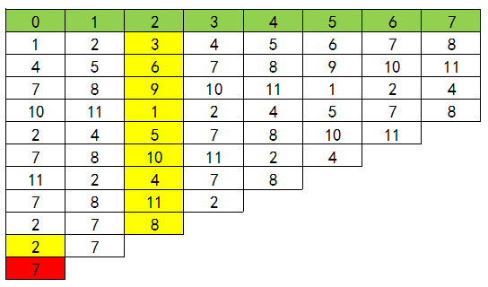

# 其他

## [删除三元组](https://kamacoder.com/problempage.php?pid=1246)

题目描述

小红有一个长度为 n 的数组 a，她每次操作可以删掉一个三元组（x,y,z），要求 x < y < z，y 是 x 的倍数，z 是 y 的倍数。小红想知道最多可以执行多少次操作。

输入描述

第一行一个整数 n（1 <= n <= 10^5），表示数组的长度。 

第二行 n 个整数 a1，a2，...，an (1 <= ai <= 6)，表示数组的元素。

输出描述

输出一个非负整数，表示最多可以执行多少次操作。

输入示例

```
7
1 1 2 3 4 5 6
```

输出示例

```
2
```

提示信息

先删除(1, 2, 4)，再删除(1, 3, 6)

**解答**：

```java
import java.util.Scanner;
 
public class Main {
    public static void main(String[] args) {
        Scanner scanner = new Scanner(System.in);
        int n = scanner.nextInt();
        int[] count = new int[7];
        int cnt = 0;
        for(int i = 0;i < n;i++){
            count[scanner.nextInt()]++;
        }
        for(int i = 2;i <= 3;i++){
            for(int j = 2 * i;j <= 6;j+=i){
                int minnum = Math.min(Math.min(count[1],count[i]),count[j]);
                    count[i]-=minnum;
                    count[j]-=minnum;
                    count[1]-=minnum;
                    cnt+=minnum;
                    if(count[1] ==0){
                        System.out.println(cnt);
                        return;
                    }
            }
        }
        System.out.println(cnt);
    }
}
```

## [非连续合法字符串](https://kamacoder.com/problempage.php?pid=1247)

题目描述

小红有一个字符串 s，只包含小写字母。如果一个字符串中，不包含连续的三个相同的字母，并且不存在两个相同的字母紧挨着两个相同的字母，那么这个字符串就是合法的。例如，字符串“aaa”是不合法的，字符串"aabb"也是不合法的。字符串”aab”是合法的。 

小红想知道，最少需要删除多少个字符，才能使得字符串变成合法的。

输入描述

第一行一个字符串 s，长度不超过 10^5，只包含小写字母。

输出描述

输出一个整数，表示最少需要删除的字符个数。

输入示例

```
aabbaa
```

输出示例

```
1
```

提示信息

删除一个字符 b，得到 aabaa，是一个合法的字符串。

**解答**：

```java
import java.util.*;
import java.io.*;
 
public class Main{
    public static void main(String[] args) throws IOException {
        BufferedReader in = new BufferedReader(new InputStreamReader(System.in));
 
        String str = in.readLine();
        int count = 0;
        int n = str.length();
        for(int i = 0; i < n; ++i){
            //aaa
            if((i + 2) < n && str.charAt(i) == str.charAt(i+1) && str.charAt(i+1) == str.charAt(i+2)){
                str = i == n - 3 ? str.substring(0, i+2) : str.substring(0, i+2) + str.substring(i+3, n);
                n--;
                i--;
                count++;
            }
            //aabb
            if(i < 0){
                continue;
            }
            if((i + 3) < n && str.charAt(i) == str.charAt(i+1) && str.charAt(i+2) == str.charAt(i+3) && str.charAt(i) != str.charAt(i+2) ){
                str =  i == n-4 ? str.substring(0, i+3) : str.substring(0, i+3) + str.substring(i+4, n);
                n--;
                i--;
                count++;
            }
        }
 
        System.out.println(count);
    }
}
```

## 约瑟夫环

约瑟夫问题是个著名的问题：N个人围成一圈，第一个人从1开始报数，报M的将被杀掉，下一个人接着从1开始报。如此反复，最后剩下一个，求最后的胜利者。
例如只有三个人，把他们叫做A、B、C，他们围成一圈，从A开始报数，假设报2的人被杀掉。

公式法
约瑟夫环是一个经典的数学问题，我们不难发现这样的依次报数，似乎有规律可循。为了方便导出递推式，我们重新定义一下题目。
问题： N个人编号为1，2，……，N，依次报数，每报到M时，杀掉那个人，求最后胜利者的编号。

这边我们先把结论抛出了。之后带领大家一步一步的理解这个公式是什么来的。
递推公式：
$$
f(N,M)=(f(N-1,M)+M)\%N
$$
$f(N,M)$表示，N个人报数，每报到M时杀掉那个人，最终胜利者的编号
$f(N-1,M)$表示，N-1个人报数，每报到M时杀掉那个人，最终胜利者的编号

下图表示这一过程（先忽视绿色的一行）:



推导这个公式。

- 问题1： 假设我们已经知道11个人时，胜利者的下标位置为6。那下一轮10个人时，胜利者的下标位置为多少？

  答： 其实吧，第一轮删掉编号为3的人后，之后的人都往前面移动了3位，胜利这也往前移动了3位，所以他的下标位置由6变成3。

- 问题2： 假设我们已经知道10个人时，胜利者的下标位置为3。那下一轮11个人时，胜利者的下标位置为多少？

  答： 这可以看错是上一个问题的逆过程，大家都往后移动3位，不过有可能数组会越界，所以最后模上当前人数的个数

- 问题3： 现在改为人数改为N，报到M时，把那个人杀掉，那么数组是怎么移动的？
  答： 每杀掉一个人，下一个人成为头，相当于把数组向前移动M位。若已知N-1个人时，胜利者的下标位置位$f(N-1,M)$，则N个人的时候，就是往后移动M为，(因为有可能数组越界，超过的部分会被接到头上，所以还要模N)，既$f(N,M)=(f(N-1,M)+M)\%N$

**注：**理解这个递推式的核心在于关注胜利者的下标位置是怎么变的。每杀掉一个人，其实就是把这个数组向前移动了M位。然后逆过来，就可以得到这个递推式。

因为求出的结果是数组中的下标，最终的编号还要加1

```java
    // 约瑟夫环问题的解决方法，接收总人数 n 和报数 m 作为参数
    public static int josephus(int n, int m) {
        // 初始化结果为 0
        int result = 0;
        // 从 2 开始循环到 n，模拟约瑟夫环的报数过程
        for (int i = 2; i <= n; i++) {
            // 根据约瑟夫环的递推公式更新结果
            result = (result + m) % i;
        }
        // 返回最后剩下的人的编号，因为编号从 1 开始，所以加 1
        return result + 1;
    }

```

### [390. 消除游戏](https://leetcode.cn/problems/elimination-game/)

列表 `arr` 由在范围 `[1, n]` 中的所有整数组成，并按严格递增排序。请你对 `arr` 应用下述算法：

- 从左到右，删除第一个数字，然后每隔一个数字删除一个，直到到达列表末尾。
- 重复上面的步骤，但这次是从右到左。也就是，删除最右侧的数字，然后剩下的数字每隔一个删除一个。
- 不断重复这两步，从左到右和从右到左交替进行，直到只剩下一个数字。

给你整数 `n` ，返回 `arr` 最后剩下的数字。

解答：

```java
class Solution {
    public int lastRemaining(int n) {
        if(n == 1) return 1;
        boolean left = true;
        int step = 1, head = 1;
        while(n > 1){
            if(left || (n & 1) == 1){ //if people in the odd positions are removed, the head will change
                head += step;
            }
            step <<= 1;
            left = !left;
            n >>= 1;
        }
        return head;
    }
}
```


## 排序

```java
import java.util.ArrayList;
import java.util.List;

class SortingAlgorithms {

    // Bubble Sort
    public void bubbleSort(int[] array) {
        int n = array.length;
        boolean swapped;
        for (int i = 0; i < n - 1; i++) {
            swapped = false;
            for (int j = 0; j < n - 1 - i; j++) {
                if (array[j] > array[j + 1]) {
                    int temp = array[j];
                    array[j] = array[j + 1];
                    array[j + 1] = temp;
                    swapped = true;
                }
            }
            if (!swapped) break;
        }
    }

    // Selection Sort
    public void selectionSort(int[] array) {
        int n = array.length;
        for (int i = 0; i < n - 1; i++) {
            int minIndex = i;
            for (int j = i + 1; j < n; j++) {
                if (array[j] < array[minIndex]) {
                    minIndex = j;
                }
            }
            int temp = array[minIndex];
            array[minIndex] = array[i];
            array[i] = temp;
        }
    }

    // Insertion Sort
    public void insertionSort(int[] array) {
        int n = array.length;
        for (int i = 1; i < n; i++) {
            int key = array[i];
            int j = i - 1;
            while (j >= 0 && array[j] > key) {
                array[j + 1] = array[j];
                j = j - 1;
            }
            array[j + 1] = key;
        }
    }

    // Merge Sort
    public void mergeSort(int[] array) {
        if (array.length < 2) {
            return;
        }
        int mid = array.length / 2;
        int[] left = new int[mid];
        int[] right = new int[array.length - mid];
        System.arraycopy(array, 0, left, 0, mid);
        System.arraycopy(array, mid, right, 0, array.length - mid);
        mergeSort(left);
        mergeSort(right);
        merge(array, left, right);
    }

    private void merge(int[] array, int[] left, int[] right) {
        int i = 0, j = 0, k = 0;
        while (i < left.length && j < right.length) {
            if (left[i] <= right[j]) {
                array[k++] = left[i++];
            } else {
                array[k++] = right[j++];
            }
        }
        while (i < left.length) {
            array[k++] = left[i++];
        }
        while (j < right.length) {
            array[k++] = right[j++];
        }
    }

    // Quick Sort
    public void quickSort(int[] array) {
        quickSort(array, 0, array.length - 1);
    }

    private void quickSort(int[] array, int low, int high) {
        if (low < high) {
            int pi = partition(array, low, high);
            quickSort(array, low, pi - 1);
            quickSort(array, pi + 1, high);
        }
    }

    private int partition(int[] array, int low, int high) {
        int pivot = array[high];
        int i = (low - 1);
        for (int j = low; j < high; j++) {
            if (array[j] <= pivot) {
                i++;
                int temp = array[i];
                array[i] = array[j];
                array[j] = temp;
            }
        }
        int temp = array[i + 1];
        array[i + 1] = array[high];
        array[high] = temp;
        return i + 1;
    }

    // Heap Sort
    public void heapSort(int[] array) {
        int n = array.length;
        for (int i = n / 2 - 1; i >= 0; i--) {
            heapify(array, n, i);
        }
        for (int i = n - 1; i > 0; i--) {
            int temp = array[0];
            array[0] = array[i];
            array[i] = temp;
            heapify(array, i, 0);
        }
    }

    private void heapify(int[] array, int n, int i) {
        int largest = i;
        int left = 2 * i + 1;
        int right = 2 * i + 2;
        if (left < n && array[left] > array[largest]) {
            largest = left;
        }
        if (right < n && array[right] > array[largest]) {
            largest = right;
        }
        if (largest != i) {
            int swap = array[i];
            array[i] = array[largest];
            array[largest] = swap;
            heapify(array, n, largest);
        }
    }

    // Counting Sort
    public void countingSort(int[] array) {
        int max = getMax(array);
        int[] count = new int[max + 1];
        for (int value : array) {
            count[value]++;
        }
        int index = 0;
        for (int i = 0; i < count.length; i++) {
            while (count[i] > 0) {
                array[index++] = i;
                count[i]--;
            }
        }
    }

    private int getMax(int[] array) {
        int max = array[0];
        for (int value : array) {
            if (value > max) {
                max = value;
            }
        }
        return max;
    }

    // Radix Sort
    public void radixSort(int[] array) {
        int max = getMax(array);
        for (int exp = 1; max / exp > 0; exp *= 10) {
            countingSortByDigit(array, exp);
        }
    }

    private void countingSortByDigit(int[] array, int exp) {
        int n = array.length;
        int[] output = new int[n];
        int[] count = new int[10];
        for (int value : array) {
            count[(value / exp) % 10]++;
        }
        for (int i = 1; i < 10; i++) {
            count[i] += count[i - 1];
        }
        for (int i = n - 1; i >= 0; i--) {
            output[count[(array[i] / exp) % 10] - 1] = array[i];
            count[(array[i] / exp) % 10]--;
        }
        System.arraycopy(output, 0, array, 0, n);
    }

    // Bucket Sort
    public void bucketSort(int[] array) {
        int max = getMax(array);
        int min = getMin(array);
        int bucketSize = max - min + 1;
        List<Integer>[] buckets = new List[bucketSize];
        for (int i = 0; i < bucketSize; i++) {
            buckets[i] = new ArrayList<>();
        }
        for (int value : array) {
            buckets[value - min].add(value);
        }
        int index = 0;
        for (List<Integer> bucket : buckets) {
            for (int value : bucket) {
                array[index++] = value;
            }
        }
    }

    private int getMin(int[] array) {
        int min = array[0];
        for (int value : array) {
            if (value < min) {
                min = value;
            }
        }
        return min;
    }

    // Shell Sort
    public void shellSort(int[] array) {
        int n = array.length;
        for (int gap = n / 2; gap > 0; gap /= 2) {
            for (int i = gap; i < n; i++) {
                int key = array[i];
                int j = i;
                while (j >= gap && array[j - gap] > key) {
                    array[j] = array[j - gap];
                    j -= gap;
                }
                array[j] = key;
            }
        }
    }

    // Print Array
    public void printArray(int[] array) {
        for (int value : array) {
            System.out.print(value + " ");
        }
        System.out.println();
    }

}
```

## 31.下一个排列

[力扣题目链接](https://leetcode.cn/problems/next-permutation/)

实现获取 下一个排列 的函数，算法需要将给定数字序列重新排列成字典序中下一个更大的排列。

如果不存在下一个更大的排列，则将数字重新排列成最小的排列（即升序排列）。

必须 原地 修改，只允许使用额外常数空间。

解答：

```java
import java.util.Arrays;

class Solution {
    public void nextPermutation(int[] nums) {
        if(nums == null || nums.length <= 1) return;
        int prev = nums.length - 1;
        for(int i = nums.length - 1; i >= 0; i--){
            if(nums[prev] > nums[i]){ // find the first number that is lower than nums[prev]
                for(int j = prev + 1; j < nums.length; j++){ // find the smallest number greater than nums[i]
                    if(nums[j] > nums[i] && nums[j] < nums[prev]) prev = j;
                }
                swap(nums, prev, i);
                prev = i + 1;

                break;
            }
            else if(nums[prev] <= nums[i]){
                prev = i;
            }
        }

        Arrays.sort(nums, prev, nums.length);
    }
    public void swap(int[] nums, int i, int j){
        int temp = nums[i];
        nums[i] = nums[j];
        nums[j] = temp;
    }
}
```

## 1356. 根据数字二进制下 1 的数目排序

[力扣题目链接](https://leetcode.cn/problems/sort-integers-by-the-number-of-1-bits/)

题目链接：https://leetcode.cn/problems/sort-integers-by-the-number-of-1-bits/

给你一个整数数组 arr 。请你将数组中的元素按照其二进制表示中数字 1 的数目升序排序。

如果存在多个数字二进制中 1 的数目相同，则必须将它们按照数值大小升序排列。

请你返回排序后的数组。

解答：

```java
import java.util.Arrays;
import java.util.Comparator;

class Solution {
    public int[] sortByBits(int[] arr) {
        return Arrays.stream(arr).boxed()
                .sorted(new Comparator<Integer>() {
                    @Override
                    public int compare(Integer o1, Integer o2) {
                        if(countBits(o1) == countBits(o2)) return o1 - o2;
                        else return countBits(o1) - countBits(o2);
                    }
                })
                .mapToInt(i -> i)
                .toArray();
    }

    public int countBits(int num){
        int count = 0;
        while(num > 0) {
            count++;
            num &= (num - 1);
        }
        return count;
    }
}
```

## [CACC复赛](https://snail.cronlygames.cn/home)

## 哈希碰撞

给定长度 n 与一个随机字符串 key ，定义 $SHA256_n(S)$ 为取字符串 S 的$SHA256$哈希的前 n 个16进制位构成字符串，要求你构造两个长度均为的不同的字符串 S1 与 S2 ，使得 $S1\ne S2$ ， $|S1|=|S2|=n$ 且 $SHA256_n(key+S1)=SHA256_n(key+S2)$ 。

这个题看起来是安全相关，但实际上是一个数学题加上代码优化有关的题目。题意较为容易理解，但是它特定的要求是卡空间 128KB，所以这里几乎只能存储常数级别的数据。

容易发现直接枚举然后记录一下已经出现过的哈希值，就可以在 n≤7 的情况很快跑出来，但是它实在是太占空间了，我们希望有一种常数空间复杂度即尽可能达到 O(1) 空间占用。

有一种常用的判断等值函数的方式就是迭代法，也即通过计算 $x , f(x) , f(f(x)) ...$的方式，记录一下自变量与函数值，容易发现这个的本质是在遍历一张有 n 个点 n 条边的，有唯一一个环和至多一条链的基环树，那么这题也是一样的，随机一个初始字符串反复迭代，若出现环（当然需要链大小不为0）那就找到了一组冲突，但显然不能把环记录下来。由于生日悖论与哈希的随机性，这个找到环的步数远远小于取值空间的大小，这就给了我们在短时间内解决问题的契机。

可以认为是结点 x 的下一跳指到 f(x) ，那么我们就可以通过这个方式来判环，同时获得一个很重要的数据 step ， step 的含义是：从初始字符串出发，经由 step 轮上述操作后，两个字符串一样。

step 给了我们三个很重要的信息：第一，这个基环树的大小大于等于 step ，因为两个指针走到一起时，每次只跳一步的指针一定走在环上，且它每个点至多遍历一次（自行手玩即可得知，证也不难）；第二，环长一定是 step 的因数，这个也不难理解，第二个指针比第一个指针多走了若干环长。第三，由上面的结论我们还可以知道， step 加上环长一定大于等于基环树的点数。

有了这几个条件，我们就可以枚举环长 c ，取两个字符串，第一个是初始字符串，第二个是初始字符串迭代 c 轮后的结果，然后让这两个字符串同时开始迭代。由前文所述，若环长真的为 c ，那么在不超过 step+c 轮内必然会出现两个字符串的 H 值一样，那也就找到了一组解。

此时空间复杂度已经达到了 $O(1)$ ，最坏时间复杂度 $O(step\sqrt {step}) $

接下来开始优化时间：

1.  容易发现这个做法极度依赖于初始值，经过测试， $n=9$ 时随机出来的初值字符串的 step 小则3万，大则50多万，所以我们多随机几个初值，若 step 过大则pass（可以直接在循环里判掉，我的阈值是取20万），取一个较小的作为我们的出发点
2.  经过手测随机数据发现，环普遍都比较大，所以枚举因子的时候可以从大到小枚举，发现一个解就退出，这个优化很明显
4.  容易发现 H(x) 有大量的冗余操作：第一是字符串拼接的前半部分一直不变，所以干脆直接把字符串写进静态缓冲区，只拷贝第二个字符串进去；第二是它会完整地把 SHA256 的字符串表示写出来，但我们只需要前 n 位即可，所以当生成的字符串的长度达到 n 后就直接跳出

经过上述优化， $n\le 8$ 跑的飞快，$n=9$ 本地也基本上能在2秒内跑出。

一个很极端的情况是：这个基环树没有链，也就是说这个循环内没有两个字符串的 H 一致，那么理论上就需要重新来过。但是环越大，这个情况出现概率就越低，所以我赌它没有这种情况出现，交上去就拿下500分满分。

另一个朴素方案：

```java
// 朴素的dfs，会爆内存
static char[] chars = new char[] {
    '0','1','2','3','4','5','6','7','8','9',
    'a','b','c','d','e','f'
};
static Map<String, String> map = new HashMap<>();

static void findCollisions(String parent, int currentLen, int targetLen) {
    if(currentLen == targetLen){
        String hash = H(parent); // 需要实现哈希函数
        if(map.containsKey(hash)) {
            System.out.println(parent + " " + map.get(hash));
            return;
        }
        map.put(hash, parent);
        return;
    } 
    
    for(char c : chars) {
        findCollisions(parent + c, currentLen + 1, targetLen);
    }
}
```

另一个方案：

根据内存限制，发现最多能开十万左右的数组，于是想着把H出来的字符串再哈希（就是基础的哈希变成一个数字）然后把数字取模作为索引将当前枚举的字符串放在这个模数大小的数组里（十万左右），如果此时数组里有字符串就可以拎出来判断一下H是否相等

## 洗牌算法

[384. 打乱数组](https://leetcode.cn/problems/shuffle-an-array/)

给你一个整数数组 `nums` ，设计算法来打乱一个没有重复元素的数组。打乱后，数组的所有排列应该是 **等可能** 的。

实现 `Solution` class:

- `Solution(int[] nums)` 使用整数数组 `nums` 初始化对象
- `int[] reset()` 重设数组到它的初始状态并返回
- `int[] shuffle()` 返回数组随机打乱后的结果

解答：

```java
class Solution {
    int[] nums;
    int n = 0;
    Random random = new Random();

    public Solution(int[] nums) {
        n = nums.length;
        this.nums = nums.clone();
    }
    
    public int[] reset() {
        return nums;
    }
    
    public int[] shuffle() {
        int[] res = nums.clone();
        for(int i = 0; i < n; i++){
            swap(res, i, i + random.nextInt(n-i));
        }

        return res;
    }

    void swap(int[] nums, int i, int j){
        int temp = nums[j];
        nums[j] = nums[i];
        nums[i] = temp;
    }
}
```

## 最小表示法

**算法核心**

考虑对于一对字符串 $A,B$, 它们在原字符串 $S$ 中的起始位置分别为 $i,j$, 且它们的前 $k$ 个字符均相同，即

$S[i \cdots i+k-1] = S[j \cdots j+k-1]$

不妨先考虑 $S[i+k]>S[j+k]$ 的情况，我们发现起始位置下标 $l$ 满足 $i\le l\le i+k$ 的字符串均不能成为答案。因为对于任意一个字符串 $S_{i+p}$（表示以 $i+p$ 为起始位置的字符串，$p \in [0, k]$）一定存在字符串 $S_{j+p}$ 比它更优。

所以我们比较时可以跳过下标 $l\in [i,i+k]$, 直接比较 $S_{i+k+1}$

这样，我们就完成了对于上文暴力的优化。

**时间复杂度**

$O(n)$

### [899. 有序队列](https://leetcode.cn/problems/orderly-queue/)

给定一个字符串 `s` 和一个整数 `k` 。你可以从 `s` 的前 `k` 个字母中选择一个，并把它加到字符串的末尾。

返回 在应用上述步骤的任意数量的移动后，字典序最小的字符串 。

```java
class Solution {
    public String orderlyQueue(String s, int k) {
        char[] ss = s.toCharArray();
        if(k > 1) {
            Arrays.sort(ss);
            return new String(ss);
        } else{
            int i = 0, j = 1, n = ss.length;
            k = 0;
            while(i < n && j < n && k < n){
                char c1 = ss[(i+k)%n], c2 = ss[(j+k)%n];
                if(c1 == c2) k++;
                else{
                    if(c1 < c2) j += k+1;
                    else i += k+1;

                    if(i == j) j++;
                    k = 0;
                }

            }
            i = Math.min(i, j);
            return s.substring(i) + s.substring(0, i);
        }
    }
}
```

