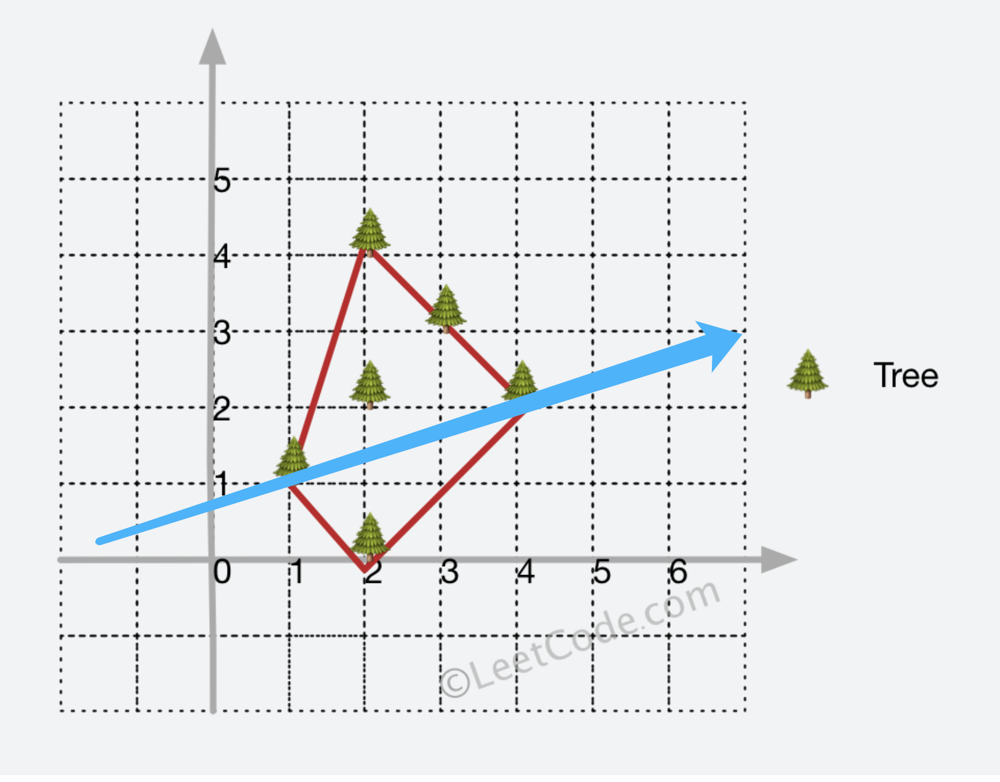
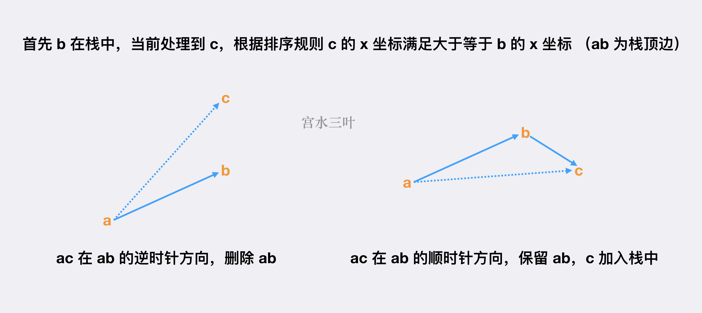

# 其他

## [删除三元组](https://kamacoder.com/problempage.php?pid=1246)

题目描述

小红有一个长度为 n 的数组 a，她每次操作可以删掉一个三元组（x,y,z），要求 x < y < z，y 是 x 的倍数，z 是 y 的倍数。小红想知道最多可以执行多少次操作。

输入描述

第一行一个整数 n（1 <= n <= 10^5），表示数组的长度。

第二行 n 个整数 a1，a2，...，an (1 <= ai <= 6)，表示数组的元素。

输出描述

输出一个非负整数，表示最多可以执行多少次操作。

输入示例

```
7
1 1 2 3 4 5 6
```

输出示例

```
2
```

提示信息

先删除(1, 2, 4)，再删除(1, 3, 6)

**解答**：

```java
import java.util.Scanner;

public class Main {
    public static void main(String[] args) {
        Scanner scanner = new Scanner(System.in);
        int n = scanner.nextInt();
        int[] count = new int[7];
        int cnt = 0;
        for(int i = 0;i < n;i++){
            count[scanner.nextInt()]++;
        }
        for(int i = 2;i <= 3;i++){
            for(int j = 2 * i;j <= 6;j+=i){
                int minnum = Math.min(Math.min(count[1],count[i]),count[j]);
                    count[i]-=minnum;
                    count[j]-=minnum;
                    count[1]-=minnum;
                    cnt+=minnum;
                    if(count[1] ==0){
                        System.out.println(cnt);
                        return;
                    }
            }
        }
        System.out.println(cnt);
    }
}
```

## [非连续合法字符串](https://kamacoder.com/problempage.php?pid=1247)

题目描述

小红有一个字符串 s，只包含小写字母。如果一个字符串中，不包含连续的三个相同的字母，并且不存在两个相同的字母紧挨着两个相同的字母，那么这个字符串就是合法的。例如，字符串"aaa"是不合法的，字符串"aabb"也是不合法的。字符串"aab"是合法的。

小红想知道，最少需要删除多少个字符，才能使得字符串变成合法的。

输入描述

第一行一个字符串 s，长度不超过 10^5，只包含小写字母。

输出描述

输出一个整数，表示最少需要删除的字符个数。

输入示例

```
aabbaa
```

输出示例

```
1
```

提示信息

删除一个字符 b，得到 aabaa，是一个合法的字符串。

**解答**：

```java
import java.util.*;
import java.io.*;

public class Main{
    public static void main(String[] args) throws IOException {
        BufferedReader in = new BufferedReader(new InputStreamReader(System.in));

        String str = in.readLine();
        int count = 0;
        int n = str.length();
        for(int i = 0; i < n; ++i){
            //aaa
            if((i + 2) < n && str.charAt(i) == str.charAt(i+1) && str.charAt(i+1) == str.charAt(i+2)){
                str = i == n - 3 ? str.substring(0, i+2) : str.substring(0, i+2) + str.substring(i+3, n);
                n--;
                i--;
                count++;
            }
            //aabb
            if(i < 0){
                continue;
            }
            if((i + 3) < n && str.charAt(i) == str.charAt(i+1) && str.charAt(i+2) == str.charAt(i+3) && str.charAt(i) != str.charAt(i+2) ){
                str =  i == n-4 ? str.substring(0, i+3) : str.substring(0, i+3) + str.substring(i+4, n);
                n--;
                i--;
                count++;
            }
        }

        System.out.println(count);
    }
}
```

## 约瑟夫环

约瑟夫问题是个著名的问题：N 个人围成一圈，第一个人从 1 开始报数，报 M 的将被杀掉，下一个人接着从 1 开始报。如此反复，最后剩下一个，求最后的胜利者。
例如只有三个人，把他们叫做 A、B、C，他们围成一圈，从 A 开始报数，假设报 2 的人被杀掉。

公式法
约瑟夫环是一个经典的数学问题，我们不难发现这样的依次报数，似乎有规律可循。为了方便导出递推式，我们重新定义一下题目。
问题： N 个人编号为 1，2，……，N，依次报数，每报到 M 时，杀掉那个人，求最后胜利者的编号。

这边我们先把结论抛出了。之后带领大家一步一步的理解这个公式是什么来的。
递推公式：

$$
f(N,M)=(f(N-1,M)+M)\%N
$$

$f(N,M)$ 表示，N 个人报数，每报到 M 时杀掉那个人，最终胜利者的编号
$f(N-1,M)$ 表示，N-1 个人报数，每报到 M 时杀掉那个人，最终胜利者的编号

下图表示这一过程（先忽视绿色的一行）:


推导这个公式。

- 问题 1： 假设我们已经知道 11 个人时，胜利者的下标位置为 6。那下一轮 10 个人时，胜利者的下标位置为多少？

  答： 其实吧，第一轮删掉编号为 3 的人后，之后的人都往前面移动了 3 位，胜利这也往前移动了 3 位，所以他的下标位置由 6 变成 3。

- 问题 2： 假设我们已经知道 10 个人时，胜利者的下标位置为 3。那下一轮 11 个人时，胜利者的下标位置为多少？

  答： 这可以看错是上一个问题的逆过程，大家都往后移动 3 位，不过有可能数组会越界，所以最后模上当前人数的个数

- 问题 3： 现在改为人数改为 N，报到 M 时，把那个人杀掉，那么数组是怎么移动的？
  答： 每杀掉一个人，下一个人成为头，相当于把数组向前移动 M 位。若已知 N-1 个人时，胜利者的下标位置位$f(N-1,M)$，则 N 个人的时候，就是往后移动 M 为，(因为有可能数组越界，超过的部分会被接到头上，所以还要模 N)，既$f(N,M)=(f(N-1,M)+M)\%N$

**注：**理解这个递推式的核心在于关注胜利者的下标位置是怎么变的。每杀掉一个人，其实就是把这个数组向前移动了 M 位。然后逆过来，就可以得到这个递推式。

因为求出的结果是数组中的下标，最终的编号还要加 1

```java
    // 约瑟夫环问题的解决方法，接收总人数 n 和报数 m 作为参数
    public static int josephus(int n, int m) {
        // 初始化结果为 0
        int result = 0;
        // 从 2 开始循环到 n，模拟约瑟夫环的报数过程
        for (int i = 2; i <= n; i++) {
            // 根据约瑟夫环的递推公式更新结果
            result = (result + m) % i;
        }
        // 返回最后剩下的人的编号，因为编号从 1 开始，所以加 1
        return result + 1;
    }

```

### [390. 消除游戏](https://leetcode.cn/problems/elimination-game/)

列表 `arr` 由在范围 `[1, n]` 中的所有整数组成，并按严格递增排序。请你对 `arr` 应用下述算法：

- 从左到右，删除第一个数字，然后每隔一个数字删除一个，直到到达列表末尾。
- 重复上面的步骤，但这次是从右到左。也就是，删除最右侧的数字，然后剩下的数字每隔一个删除一个。
- 不断重复这两步，从左到右和从右到左交替进行，直到只剩下一个数字。

给你整数 `n` ，返回 `arr` 最后剩下的数字。

解答：

```java
class Solution {
    public int lastRemaining(int n) {
        if(n == 1) return 1;
        boolean left = true;
        int step = 1, head = 1;
        while(n > 1){
            if(left || (n & 1) == 1){ //if people in the odd positions are removed, the head will change
                head += step;
            }
            step <<= 1;
            left = !left;
            n >>= 1;
        }
        return head;
    }
}
```

## 排序

以下是常见排序算法的关键特点总结（每句话概括一个算法）：

1. **冒泡排序**：通过相邻元素两两比较交换，每次循环将最大元素"冒泡"到末尾。
2. **选择排序**：每次从未排序部分选择最小元素，直接放到已排序部分的末尾。
3. **插入排序**：将未排序元素逐个插入到已排序部分的正确位置，类似整理扑克牌。
4. **快速排序**：选取基准值分区，递归处理左右子数组，通过交换实现高效分治。
5. **归并排序**：先拆分数组到最小单元，再两两合并有序子序列，层层合并完成排序。
6. **堆排序**：构建最大堆后反复取堆顶元素（最大值）并调整堆结构。
7. **希尔排序**：按递减间隔分组插入排序，逐步缩至间隔为1的全数组插入。
8. **计数排序**：统计每个整数出现次数，直接按统计结果输出有序序列。
9. **桶排序**：将元素分到多个有序桶中，桶内排序后合并所有桶。
10. **基数排序**：按数字的每一位从低位到高位依次进行稳定排序（如按位分桶）。

```java
import java.util.ArrayList;
import java.util.List;

class SortingAlgorithms {

    // Bubble Sort
    public void bubbleSort(int[] array) {
        int n = array.length;
        boolean swapped;
        for (int i = 0; i < n - 1; i++) {
            swapped = false;
            for (int j = 0; j < n - 1 - i; j++) {
                if (array[j] > array[j + 1]) {
                    int temp = array[j];
                    array[j] = array[j + 1];
                    array[j + 1] = temp;
                    swapped = true;
                }
            }
            if (!swapped) break;
        }
    }

    // Selection Sort
    public void selectionSort(int[] array) {
        int n = array.length;
        for (int i = 0; i < n - 1; i++) {
            int minIndex = i;
            for (int j = i + 1; j < n; j++) {
                if (array[j] < array[minIndex]) {
                    minIndex = j;
                }
            }
            int temp = array[minIndex];
            array[minIndex] = array[i];
            array[i] = temp;
        }
    }

    // Insertion Sort
    public void insertionSort(int[] array) {
        int n = array.length;
        for (int i = 1; i < n; i++) {
            int key = array[i];
            int j = i - 1;
            while (j >= 0 && array[j] > key) {
                array[j + 1] = array[j];
                j = j - 1;
            }
            array[j + 1] = key;
        }
    }

    // Merge Sort
    public void mergeSort(int[] array) {
        if (array.length < 2) {
            return;
        }
        int mid = array.length / 2;
        int[] left = new int[mid];
        int[] right = new int[array.length - mid];
        System.arraycopy(array, 0, left, 0, mid);
        System.arraycopy(array, mid, right, 0, array.length - mid);
        mergeSort(left);
        mergeSort(right);
        merge(array, left, right);
    }

    private void merge(int[] array, int[] left, int[] right) {
        int i = 0, j = 0, k = 0;
        while (i < left.length && j < right.length) {
            if (left[i] <= right[j]) {
                array[k++] = left[i++];
            } else {
                array[k++] = right[j++];
            }
        }
        while (i < left.length) {
            array[k++] = left[i++];
        }
        while (j < right.length) {
            array[k++] = right[j++];
        }
    }


    // Heap Sort
    public void heapSort(int[] array) {
        int n = array.length;
        for (int i = n / 2 - 1; i >= 0; i--) {
            heapify(array, n, i);
        }
        for (int i = n - 1; i > 0; i--) {
            int temp = array[0];
            array[0] = array[i];
            array[i] = temp;
            heapify(array, i, 0);
        }
    }

    private void heapify(int[] array, int n, int i) {
        int largest = i;
        int left = 2 * i + 1;
        int right = 2 * i + 2;
        if (left < n && array[left] > array[largest]) {
            largest = left;
        }
        if (right < n && array[right] > array[largest]) {
            largest = right;
        }
        if (largest != i) {
            int swap = array[i];
            array[i] = array[largest];
            array[largest] = swap;
            heapify(array, n, largest);
        }
    }

    // Counting Sort
    public void countingSort(int[] array) {
        int max = getMax(array);
        int[] count = new int[max + 1];
        for (int value : array) {
            count[value]++;
        }
        int index = 0;
        for (int i = 0; i < count.length; i++) {
            while (count[i] > 0) {
                array[index++] = i;
                count[i]--;
            }
        }
    }

    private int getMax(int[] array) {
        int max = array[0];
        for (int value : array) {
            if (value > max) {
                max = value;
            }
        }
        return max;
    }

    // Radix Sort
    public void radixSort(int[] array) {
        int max = getMax(array);
        for (int exp = 1; max / exp > 0; exp *= 10) {
            countingSortByDigit(array, exp);
        }
    }

    private void countingSortByDigit(int[] array, int exp) {
        int n = array.length;
        int[] output = new int[n];
        int[] count = new int[10];
        for (int value : array) {
            count[(value / exp) % 10]++;
        }
        for (int i = 1; i < 10; i++) {
            count[i] += count[i - 1];
        }
        for (int i = n - 1; i >= 0; i--) {
            output[count[(array[i] / exp) % 10] - 1] = array[i];
            count[(array[i] / exp) % 10]--;
        }
        System.arraycopy(output, 0, array, 0, n);
    }

    // Bucket Sort
    public void bucketSort(int[] array) {
        int max = getMax(array);
        int min = getMin(array);
        int bucketSize = max - min + 1;
        List<Integer>[] buckets = new List[bucketSize];
        for (int i = 0; i < bucketSize; i++) {
            buckets[i] = new ArrayList<>();
        }
        for (int value : array) {
            buckets[value - min].add(value);
        }
        int index = 0;
        for (List<Integer> bucket : buckets) {
            for (int value : bucket) {
                array[index++] = value;
            }
        }
    }

    private int getMin(int[] array) {
        int min = array[0];
        for (int value : array) {
            if (value < min) {
                min = value;
            }
        }
        return min;
    }

    // Shell Sort
    public void shellSort(int[] array) {
        int n = array.length;
        for (int gap = n / 2; gap > 0; gap /= 2) {
            for (int i = gap; i < n; i++) {
                int key = array[i];
                int j = i;
                while (j >= gap && array[j - gap] > key) {
                    array[j] = array[j - gap];
                    j -= gap;
                }
                array[j] = key;
            }
        }
    }

    // Print Array
    public void printArray(int[] array) {
        for (int value : array) {
            System.out.print(value + " ");
        }
        System.out.println();
    }

}
```

```python
# Quick Sort
import random
class Solution:
    def sortArray(self, nums: List[int]) -> List[int]:
        n = len(nums)
        self.quicksort(nums, 0, n-1)
        return nums

    def quicksort(self, nums: List[int], low: int, high: int) -> None:
        if low >= high:
            return
        k = self.partition(nums, low, high)
        
        self.quicksort(nums, low, k-1)
        self.quicksort(nums, k+1, high)

    def partition(self, nums: List[int], low: int, high: int) -> int:
        k = random.randint(low, high)
        pivot = nums[k]
        self.swap(nums, k, high)
        i, j = low, high-1
        while True:
            while i <= j and nums[i] < pivot:
                i += 1

            while i <= j and nums[j] > pivot:
                j -= 1
            
            if i > j:
                break
            
            self.swap(nums, i, j)
            i += 1
            j -= 1
        
        self.swap(nums, i, high)
        return i
    
    def swap(self, nums : List[int], i: int, j: int) -> None:
        nums[i], nums[j] = nums[j], nums[i]
```


## 31.下一个排列

[力扣题目链接](https://leetcode.cn/problems/next-permutation/)

实现获取 下一个排列 的函数，算法需要将给定数字序列重新排列成字典序中下一个更大的排列。

如果不存在下一个更大的排列，则将数字重新排列成最小的排列（即升序排列）。

必须 原地 修改，只允许使用额外常数空间。

解答：

```java
import java.util.Arrays;

class Solution {
    public void nextPermutation(int[] nums) {
        if(nums == null || nums.length <= 1) return;
        int prev = nums.length - 1;
        for(int i = nums.length - 1; i >= 0; i--){
            if(nums[prev] > nums[i]){ // find the first number that is lower than nums[prev]
                for(int j = prev + 1; j < nums.length; j++){ // find the smallest number greater than nums[i]
                    if(nums[j] > nums[i] && nums[j] < nums[prev]) prev = j;
                }
                swap(nums, prev, i);
                prev = i + 1;

                break;
            }
            else if(nums[prev] <= nums[i]){
                prev = i;
            }
        }

        Arrays.sort(nums, prev, nums.length);
    }
    public void swap(int[] nums, int i, int j){
        int temp = nums[i];
        nums[i] = nums[j];
        nums[j] = temp;
    }
}
```

## 1356. 根据数字二进制下 1 的数目排序

[力扣题目链接](https://leetcode.cn/problems/sort-integers-by-the-number-of-1-bits/)

题目链接：https://leetcode.cn/problems/sort-integers-by-the-number-of-1-bits/

给你一个整数数组 arr 。请你将数组中的元素按照其二进制表示中数字 1 的数目升序排序。

如果存在多个数字二进制中 1 的数目相同，则必须将它们按照数值大小升序排列。

请你返回排序后的数组。

解答：

```java
import java.util.Arrays;
import java.util.Comparator;

class Solution {
    public int[] sortByBits(int[] arr) {
        return Arrays.stream(arr).boxed()
                .sorted(new Comparator<Integer>() {
                    @Override
                    public int compare(Integer o1, Integer o2) {
                        if(countBits(o1) == countBits(o2)) return o1 - o2;
                        else return countBits(o1) - countBits(o2);
                    }
                })
                .mapToInt(i -> i)
                .toArray();
    }

    public int countBits(int num){
        int count = 0;
        while(num > 0) {
            count++;
            num &= (num - 1);
        }
        return count;
    }
}
```

## [CACC 复赛](https://snail.cronlygames.cn/home)

### 哈希碰撞

给定长度 n 与一个随机字符串 key ，定义 $SHA256_n(S)$ 为取字符串 S 的$SHA256$哈希的前 n 个 16 进制位构成字符串，要求你构造两个长度均为的不同的字符串 S1 与 S2 ，使得 $S1\ne S2$ ， $|S1|=|S2|=n$ 且 $SHA256_n(key+S1)=SHA256_n(key+S2)$ 。

这个题看起来是安全相关，但实际上是一个数学题加上代码优化有关的题目。题意较为容易理解，但是它特定的要求是卡空间 128KB，所以这里几乎只能存储常数级别的数据。

容易发现直接枚举然后记录一下已经出现过的哈希值，就可以在 $n\leq 7$ 的情况很快跑出来，但是它实在是太占空间了，我们希望有一种常数空间复杂度即尽可能达到 $O(1)$ 空间占用。

有一种常用的判断等值函数的方式就是迭代法，也即通过计算 $x , f(x) , f(f(x)) ...$ 方式，记录一下自变量与函数值，容易发现这个的本质是在遍历一张有 n 个点 n 条边的，有唯一一个环和至多一条链的基环树，那么这题也是一样的，随机一个初始字符串反复迭代，若出现环（当然需要链大小不为 0）那就找到了一组冲突，但显然不能把环记录下来。由于生日悖论与哈希的随机性，这个找到环的步数远远小于取值空间的大小，这就给了我们在短时间内解决问题的契机。

可以认为是结点 x 的下一跳指到 f(x) ，那么我们就可以通过这个方式来判环，同时获得一个很重要的数据 step ， step 的含义是：从初始字符串出发，经由 step 轮上述操作后，两个字符串一样。

step 给了我们三个很重要的信息：第一，这个基环树的大小大于等于 step ，因为两个指针走到一起时，每次只跳一步的指针一定走在环上，且它每个点至多遍历一次（自行手玩即可得知，证也不难）；第二，环长一定是 step 的因数，这个也不难理解，第二个指针比第一个指针多走了若干环长。第三，由上面的结论我们还可以知道， step 加上环长一定大于等于基环树的点数。

有了这几个条件，我们就可以枚举环长 c ，取两个字符串，第一个是初始字符串，第二个是初始字符串迭代 c 轮后的结果，然后让这两个字符串同时开始迭代。由前文所述，若环长真的为 c ，那么在不超过 step+c 轮内必然会出现两个字符串的 H 值一样，那也就找到了一组解。

此时空间复杂度已经达到了 $O(1)$ ，最坏时间复杂度 $O(step\sqrt {step}) $

接下来开始优化时间：

1.  容易发现这个做法极度依赖于初始值，经过测试， $n=9$ 时随机出来的初值字符串的 step 小则 3 万，大则 50 多万，所以我们多随机几个初值，若 step 过大则 pass（可以直接在循环里判掉，我的阈值是取 20 万），取一个较小的作为我们的出发点
2.  经过手测随机数据发现，环普遍都比较大，所以枚举因子的时候可以从大到小枚举，发现一个解就退出，这个优化很明显
3.  容易发现 H(x) 有大量的冗余操作：第一是字符串拼接的前半部分一直不变，所以干脆直接把字符串写进静态缓冲区，只拷贝第二个字符串进去；第二是它会完整地把 SHA256 的字符串表示写出来，但我们只需要前 n 位即可，所以当生成的字符串的长度达到 n 后就直接跳出

经过上述优化， $n\le 8$ 跑的飞快，$n=9$ 本地也基本上能在 2 秒内跑出。

一个很极端的情况是：这个基环树没有链，也就是说这个循环内没有两个字符串的 H 一致，那么理论上就需要重新来过。但是环越大，这个情况出现概率就越低，所以我赌它没有这种情况出现，交上去就拿下 500 分满分。

另一个朴素方案：

```java
// 朴素的dfs，会爆内存
static char[] chars = new char[] {
    '0','1','2','3','4','5','6','7','8','9',
    'a','b','c','d','e','f'
};
static Map<String, String> map = new HashMap<>();

static void findCollisions(String parent, int currentLen, int targetLen) {
    if(currentLen == targetLen){
        String hash = H(parent); // 需要实现哈希函数
        if(map.containsKey(hash)) {
            System.out.println(parent + " " + map.get(hash));
            return;
        }
        map.put(hash, parent);
        return;
    }

    for(char c : chars) {
        findCollisions(parent + c, currentLen + 1, targetLen);
    }
}
```

另一个方案：

根据内存限制，发现最多能开十万左右的数组，于是想着把 H 出来的字符串再哈希（就是基础的哈希变成一个数字）然后把数字取模作为索引将当前枚举的字符串放在这个模数大小的数组里（十万左右），如果此时数组里有字符串就可以拎出来判断一下 H 是否相等

### [Bob 的旅行/[ROI 2017] 前往大都会](https://snail.cronlygames.cn/problem/P2047)

题目描述

ROI 国有 n 个城市，以及 m 条铁路，每条铁路都是**单向**运行的，第 i 条铁路依次经过 $v_{i,1},v_{i,2},…,v_{i,l_i+1}$ 号城市并停靠，其中 $v_{i,j}\to v_{i,j+1}$ 的铁路长度是 $t_{i,j}$。

如果多条铁路经过 u 号城市，那么你可以在 u 号城市换乘其他铁路。（每条铁路都可以在停靠点任意上车/下车）

你需要找到一条从 1 号城市到 n 号城市的路径，这条路径需要满足其总长度最小，并且在此条件上路径上相邻两个**换乘点**间**火车上**距离的平方和最大。

注：起点和终点都是换乘点，题目保证有解。

输入描述

第一行两个整数 n,m 表示有 n 个城市，m 条铁路。

接下来 m 行，每行先是一个整数 $l_i$ 表示铁路长度，接下来 $2l_i+1$ 个整数形如 $v_{i,1},t_{i,1},v_{i,2},…,v_{i,l_i},t_{i,l_i},v_{i,l_i+1}$，含义如题所示。

输出描述

一行两个整数，第一个数表示最短路径长度，第二个数表示平方和最大值。

题解：

**最短路图**

首先 `dijkstra`，建出最短路图，数组为 `d`，边 (u,v,w) 在最短路图上当且仅当 $d_u+w=d_v$。

**分成若干连续铁路批次**

考虑重构，一条铁路在最短路图上的「段」一定是能形成若干连续段，考虑把这些连续段重新构成若干条新的铁路，忽略原来完整的铁路。下面铁路指的是新铁路。

考虑 dp，令 $f_i$ 表示到 i 点的平方和 max，则若 i,j 在同一条铁路上，则 $f_i \gets f_j+(d_j−d_i)^2$，平方考虑斜率优化。

若 A 处转移优于 B，即$f_A+d_A^2+d_i^2−2d_Ad_i−f_B−d_B^2−d_i^2+2d_Bd_i\ge 0$。

于是 $\frac{(f_A+d_A^2)−(f_B+d_B^2)}{d_A−d_B}\ge 2d_i$。朴素[斜率优化](https://oi-wiki.org/dp/opt/slope/)，对每条铁路开单调栈。

由于这样要求 $d_i$ 单调递增，于是我们可以把点按 d 排序，枚举时按排序后的顺序枚举即可。

对每条铁路开单调栈即可。单调栈用 vector 实现即可。

下面说下 $O(n)$ 做法，考虑[四边形不等式](https://oi-wiki.org/dp/opt/quadrangle/)(交叉小于包含)/决策单调性相关。

$w(i,j)=(d_i−d_j)^2，w(i,j)+w(i+1,j+1)−w(i+1,j)−w(i,j+1)=−2(d_{i+1}−di)(d_{j+1}−dj)\le 0$，这是由于按枚举顺序 d 单调不减。

解答：

```cpp
#include <algorithm>
#include <iostream>
#include <iomanip>
#include <cmath>
#include <unordered_map>
#include <set>
#include <map>
#include <algorithm>
#include <cstring>
#include <cstdlib>
#include <queue>

using std::cin;
using std::cout;
using std::vector;

typedef long long lld;

const int kSiz = 1e6 + 10;

struct Node {
    int x, y, w;
};

int N, M, idx;
int hd[kSiz], ne[kSiz], to[kSiz], wt[kSiz]; // 邻接表，ne既包含链表头，也包含整个链表

// 最短路
bool vis[kSiz];
int dis[kSiz];

// 求 f 值
int id[kSiz];
lld f[kSiz];

int cnt;
vector<Node> tr[kSiz], sg[kSiz]; // 原始铁路, 连续起作用的铁路
vector<int> pt[kSiz];   // 每站点所在的连续铁路批次
vector<int> que[kSiz];  // 每段/每连续铁路 所有节点的单调栈

void add(int a, int b, int w) {
    ne[++idx] = hd[a];
    hd[a] = idx;
    to[idx] = b;
    wt[idx] = w;
}

void read() {
    cin >> N >> M;
    int p;
    Node o;
    for (int i = 1; i <= M; i++) {
        cin >> p >> o.x;
        for (int j = 1; j <= p; j++) {
            cin >> o.w >> o.y;
            add(o.x, o.y, o.w); // 原始边
            tr[i].push_back(o); // 原始铁路
            o.x = o.y;
        }
    }
}

// 最短路
void dijkstra() {
    memset(dis, 0x3f, sizeof dis); //初始化一个大数
    dis[1] = 0;
    std::priority_queue<std::pair<int, int> > pq;
    pq.push({ -0, 1 });
    while (!pq.empty()) {
        int x = pq.top().second;
        pq.pop();
        if (vis[x]) {
            continue;
        }
        vis[x] = true;
        for (int i = hd[x]; i; i = ne[i]) {
            int y = to[i];
            if (dis[y] > dis[x] + wt[i]) {
                dis[y] = dis[x] + wt[i];
                if (!vis[y]) {
                    pq.push({ -dis[y], y });
                }
            }
        }
    }
}

bool match(Node& o) {
    return dis[o.x] + o.w == dis[o.y];
}

// 把原始铁路分成 连续的铁路批次
void split() {
    cnt = 1;
    for (int i = 1; i <= M; i++) {
        for (int j = 0; j < tr[i].size();) {
            bool flag = false;
            for (; j < tr[i].size() && match(tr[i][j]); j++) {
                flag = true;
                sg[cnt].push_back(tr[i][j]);
            }
            if (flag) {
                ++cnt;
            }

            for (; j < tr[i].size() && !match(tr[i][j]); j++) {
            }
        }
    }

    cnt--;
    for (int i = 1; i <= cnt; i++) {
        if (sg[i].size()) {
            pt[sg[i][0].x].push_back(i);
            pt[sg[i][0].y].push_back(i);
            for (int j = 1; j < sg[i].size(); j++) {
                pt[sg[i][j].y].push_back(i);
            }
        }
    }
}

bool cmp(int a, int b) {
    return dis[a] < dis[b];
}

lld p2(int d) {
    return 1ll * d * d;
}

// 求 [a, b] 斜率
double slope(int a, int b) {
    double y = f[b] + p2(dis[b]) - f[a] - p2(dis[a]);
    return y / (dis[b] - dis[a]);
}

void solve() {
    for (int i = 1; i <= N; i++) {
        id[i] = i;
    }
    std::sort(id + 1, id + 1 + N, cmp);

    int sz;
    for (int i = 1; i <= N; i++) {
        int x = id[i];
        if (dis[x] > dis[N]) { // 无用节点
            continue;
        }
        for (int t : pt[x]){
            while ((sz = que[t].size()) > 1){
                if (slope(que[t][sz - 2], que[t].back()) < 2 * dis[x]) { // 找到了更优的节点
                    // 删除斜率不达标节点
                    que[t].pop_back();
                }
                else {
                    break;
                }
            }
            if (que[t].size()) {
                // 更新f值
                int y = que[t].back();
                f[x] = std::max(f[x], f[y] + p2(dis[x] - dis[y]));
            }
        }

        for (int t : pt[x]) {
            while ((sz = que[t].size()) > 1) {
                if (slope(que[t][sz - 2], que[t].back()) < slope(que[t].back(), x)) { // 保证斜率递减
                    // 删除尾部节点
                    que[t].pop_back();
                }
                else {
                    break;
                }
            }
            // 加入新节点
            que[t].push_back(x);
        }
    }
}

void work() {
    dijkstra();
    split();
    solve();
    cout << dis[N] << " " << f[N] << "\n";
}

int main() {
    std::ios::sync_with_stdio(false);
    cin.tie(0), cout.tie(0);

    read();
    work();

    return 0;
}

```

## 洗牌算法

[384. 打乱数组](https://leetcode.cn/problems/shuffle-an-array/)

给你一个整数数组 `nums` ，设计算法来打乱一个没有重复元素的数组。打乱后，数组的所有排列应该是 **等可能** 的。

实现 `Solution` class:

- `Solution(int[] nums)` 使用整数数组 `nums` 初始化对象
- `int[] reset()` 重设数组到它的初始状态并返回
- `int[] shuffle()` 返回数组随机打乱后的结果

解答：

```java
class Solution {
    int[] nums;
    int n = 0;
    Random random = new Random();

    public Solution(int[] nums) {
        n = nums.length;
        this.nums = nums.clone();
    }

    public int[] reset() {
        return nums;
    }

    public int[] shuffle() {
        int[] res = nums.clone();
        for(int i = 0; i < n; i++){
            swap(res, i, i + random.nextInt(n-i));
        }

        return res;
    }

    void swap(int[] nums, int i, int j){
        int temp = nums[j];
        nums[j] = nums[i];
        nums[i] = temp;
    }
}
```

## 最小表示法

**算法核心**

考虑对于一对字符串 $A,B$, 它们在原字符串 $S$ 中的起始位置分别为 $i,j$, 且它们的前 $k$ 个字符均相同，即

$S[i \cdots i+k-1] = S[j \cdots j+k-1]$

不妨先考虑 $S[i+k]>S[j+k]$ 的情况，我们发现起始位置下标 $l$ 满足 $i\le l\le i+k$ 的字符串均不能成为答案。因为对于任意一个字符串 $S_{i+p}$（表示以 $i+p$ 为起始位置的字符串，$p \in [0, k]$）一定存在字符串 $S_{j+p}$ 比它更优。

所以我们比较时可以跳过下标 $l\in [i,i+k]$, 直接比较 $S_{i+k+1}$

这样，我们就完成了对于上文暴力的优化。

**时间复杂度**

$O(n)$

### [899. 有序队列](https://leetcode.cn/problems/orderly-queue/)

给定一个字符串 `s` 和一个整数 `k` 。你可以从 `s` 的前 `k` 个字母中选择一个，并把它加到字符串的末尾。

返回 在应用上述步骤的任意数量的移动后，字典序最小的字符串 。

```java
class Solution {
    public String orderlyQueue(String s, int k) {
        char[] ss = s.toCharArray();
        if(k > 1) {
            Arrays.sort(ss);
            return new String(ss);
        } else{
            int i = 0, j = 1, n = ss.length;
            k = 0;
            while(i < n && j < n && k < n){
                char c1 = ss[(i+k)%n], c2 = ss[(j+k)%n];
                if(c1 == c2) k++;
                else{
                    if(c1 < c2) j += k+1;
                    else i += k+1;

                    if(i == j) j++;
                    k = 0;
                }

            }
            i = Math.min(i, j);
            return s.substring(i) + s.substring(0, i);
        }
    }
}
```

## 模拟

### [166. 分数到小数](https://leetcode.cn/problems/fraction-to-recurring-decimal/)

给定两个整数，分别表示分数的分子 `numerator` 和分母 `denominator`，以 **字符串形式返回小数** 。

如果小数部分为循环小数，则将循环的部分括在括号内。

如果存在多个答案，只需返回 **任意一个** 。

对于所有给定的输入，**保证** 答案字符串的长度小于 `104` 。

解答：

```java
class Solution {

    public Map<Long, Integer> map = new HashMap<>();
    public String fractionToDecimal(int numerator, int denominator) {
        if(numerator == 0) return "0";
        StringBuilder res = new StringBuilder();
        if((numerator < 0) ^ (denominator < 0)) res.append("-");
        //如果先取绝对值，-2147483648会变成2147483648，会导致溢出，此外要转为long类型，避免int类型溢出
        Long num = Math.abs((long)numerator);
        Long den = Math.abs((long)denominator);

        res.append(num / den);
        num %= den;

        if(num == 0){
            return res.toString();
        }

        res.append(".");
        String temp = backtracking(num * 10, den, new StringBuilder());

        res.append(temp);
        return res.toString();

    }

    public String backtracking(long numerator, long denominator, StringBuilder sb){
        if(numerator == 0) return sb.toString();

        if(map.containsKey(numerator)){
            sb.insert(map.get(numerator), "(");
            sb.append(")");
            return sb.toString();
        }
        map.put(numerator, sb.length());

        if(numerator < denominator){
            sb.append("0");
            return backtracking(numerator * 10, denominator, sb);
        }
        long quotient = numerator / denominator;
        long remainder = numerator % denominator;

        sb.append(quotient);

        return backtracking(remainder * 10, denominator, sb);
    }
}
```

## 打表

### [2698. 求一个整数的惩罚数](https://leetcode.cn/problems/find-the-punishment-number-of-an-integer/)

给你一个正整数 `n` ，请你返回 `n` 的 **惩罚数** 。

`n` 的 **惩罚数** 定义为所有满足以下条件 `i` 的数的平方和：

- `1 <= i <= n`
- `i * i` 的十进制表示的字符串可以分割成若干连续子字符串，且这些子字符串对应的整数值之和等于 `i` 。

解答：

```java
// 时间复杂度：O(nlogn^2)
class Solution {
    public int punishmentNumber(int n) {
        int sum = 0;
        for(int i = 1; i <= n; i++){
            if(backtrack(i * i, i)){
                sum += i * i;
                System.out.println(i * i);
            }
        }
        return sum;
    }

    public boolean backtrack(int res, int target){
        if(target == 0 && res == 0){
            return true;
        } else if(target < 0 || res == 0){
            return false;
        }

        int cnt = (int)Math.log10(res) + 1;

        for(int i = 1; i <= cnt; i++){
            int digit = (int)Math.pow(10, i);
            if(backtrack(res/digit, target-(res%digit))) return true;
        }

        return false;
    }
}

// 通过「打表」进行预处理，将每个数的「惩罚值」预先计算好，并存入数组memo中。
class Solution {
    static int[] memo = new int[1001];
    static{
        for(int i = 1; i < memo.length; i++){
            memo[i] = memo[i-1];
            if(backtrack(i * i, i)) memo[i] += i * i;
        }
    }
    public int punishmentNumber(int n) {
        return memo[n];
    }

    public static boolean backtrack(int res, int target){
        if(target == 0 && res == 0){
            return true;
        } else if(target < 0 || res == 0){
            return false;
        }

        int cnt = (int)Math.log10(res) + 1;

        for(int i = 1; i <= cnt; i++){
            int digit = (int)Math.pow(10, i);
            if(backtrack(res/digit, target-(res%digit))) return true;
        }

        return false;
    }
}
```

### 矩阵快速幂

[1137. 第 N 个泰波那契数](https://leetcode.cn/problems/n-th-tribonacci-number/)

泰波那契序列 Tn 定义如下：

T0 = 0, T1 = 1, T2 = 1, 且在 n >= 0 的条件下 Tn+3 = Tn + Tn+1 + Tn+2

给你整数 `n`，请返回第 n 个泰波那契数 Tn 的值。

解答：

```java
class Solution {
    int N = 3;
    int[][] mul(int[][] a, int[][] b){
        int[][] res = new int[N][N];
        for(int i = 0; i < N; i++){
            for(int j = 0; j < N; j++){
                res[i][j] = a[i][0]*b[0][j] + a[i][1]*b[1][j] + a[i][2]*b[2][j];
            }
        }
        return res;
    }
    public int tribonacci(int n) {
        if(n == 0) return 0;
        if(n == 1) return 1;
        if(n == 2) return 1;
        int[][] a = {
            {1,1,1},
            {1,0,0},
            {0,1,0}
        };

        int[][] b = {
            {1,0,0},
            {0,1,0},
            {0,0,1}
        };

        for(int i = 0; i < n-2; i++){
            b = mul(a, b);
        }
        return (b[0][0] + b[0][1])%(Integer.MAX_VALUE);
    }
}
```

## 二维凸包（Andrew 算法）

> 是网上大多数 Andrew 算法的板子都是有问题的。

Andrew 算法正是用于求解凸包上的所有点（围成所有点的最小周长），其算法逻辑将凸包分为「上凸壳」和「下凸壳」，并分别画出（蓝色分割线将凸包分为两部分）：



基本流程为：

1. 对所有点进行双关键字排序，先根据 x 坐标排升序，后根据 y 排升序；
   根据 x 排升序的目的，是为了我们能够往一个方向画出凸包边缘（从左往后画出一半凸壳，从右往左画出另外一半），而将 y 升序目的是可以确保一旦我们现在从 a 到 b 进行连线，那么 a 到 b 之间的所有点能够确保被围住；

2. 使用栈来维护所有凸包上的点，或者说凸包上的边，会更为准确，凸包起点元素会在栈中出现两次（首尾），因此更为准确的描述应该是使用栈维护凸包的所有的边，栈中相邻元素代表凸包上的一条边；

3. 分别「从前往后」和「从后往前」处理排序好的所有点，来分别画出凸包的两半部分，根据画的是第一部分还是第二部分，维护栈内元的处理逻辑稍有不同：

   - 画的是凸包的第一部分：

     若栈内元素少于 2 个，组成一条线至少需要两个点，说明此时第一条边都还没画出，直接将元素添加到栈中；

     若栈内元素不少于 2 个，考虑是否要将栈顶的边删掉（由栈顶前两个元素组成的边）假设栈顶元素为 b，栈顶元素的下一位为 a，即栈顶存在一条 a 到 b 的边，当前处理到的点为 c，此时我们根据 ac 边是否在 ab 边的时针方向来决定是否要将 ab 边去掉：

     

     按照上述逻辑处理完所有点，凸包第一部分的点（边）都存在于栈中。

   - 画的是凸包的第二部分：逻辑同理，唯一需要注意的是，第一部分的凸包边我们不能删去，假定处理完第一部分凸包，我们栈内有 m 个元素，我们需要将上述「栈顶元素不少于 2 个」的逻辑替换为「栈顶元素大于 m 个」，同时已参与到凸包第一部分的点，不能再考虑，因此需要额外使用一个 vis 数组来记录使用过的点。

一些细节，为了方便取得栈顶的前两位元素，我们使用数组实现栈，stk 代表栈容器，tp 代表栈顶元素下标。

正如刚刚讲到，起点会被入栈两次（对应第一条边和最后一条边），因此输出方案时，栈顶和栈底我们只选其一即可。

模板：

```java
import java.util.Arrays;

class Solution {
    int[] subtraction(int[] a, int[] b) {
        return new int[] {a[0] - b[0], a[1] - b[1]};
    }
    double cross(int[] a, int[] b) {
        return (a[0] * b[1] - a[1] * b[0]);
    }
    double getArea(int[] a, int[] b, int[] c){
        return cross(subtraction(b, a), subtraction(c, a));
    }
    public int[][] outerTrees(int[][] trees) {
        Arrays.sort(trees, (a, b)->{
            return a[0] != b[0] ? a[0] - b[0] : a[1] - b[1];
        });

        int n = trees.length, tp = 0;
        int[] stack = new int[n+10]; // stack to store indices of trees
        boolean[] vis = new boolean[n+10]; // to mark visited trees
        stack[++tp] = 0;

        for(int i = 1; i < n; i++){ // the upper bound
            int[] c = trees[i];
            while(tp >= 2){
                int[] a = trees[stack[tp-1]], b = trees[stack[tp]]; // b is the top of stack
                if(getArea(a, b, c) > 0) vis[stack[tp--]] = false; // remove b from stack
                else break;
            }
            stack[++tp] = i; // add c to stack, and the top index of stack is tp;
            vis[i] = true;

        }
        int first = tp;
        for(int i = n - 1; i >= 0; i--){ // the lower bound
            if(vis[i]) continue;
            int[] c = trees[i];
            while(tp > first){
                int[] a = trees[stack[tp-1]], b = trees[stack[tp]];
                if(getArea(a, b, c) > 0) tp--;
                else break;

            }
            stack[++tp] = i;
        }
        int[][] res = new int[tp-1][2]; // the leftest point has been added to stack in the bottom and the top, so we need tp-1
        for(int i = 1; i < tp; i++){
            res[i-1] = trees[stack[i]];
        }
        return res;
    }
}
```

## [593. 有效的正方形](https://leetcode.cn/problems/valid-square/)

给定 2D 空间中四个点的坐标 `p1`, `p2`, `p3` 和 `p4`，如果这四个点构成一个正方形，则返回 `true` 。

点的坐标 `pi` 表示为 `[xi, yi]` 。 `输入没有任何顺序` 。

一个 **有效的正方形** 有四条等边和四个等角(90 度角)。

解答：

```java
class Solution {
    long len = -1;
    public boolean calc(int[] a, int[] b, int[] c){
        long l1 = (a[0] - b[0]) * (a[0] - b[0]) + (a[1] - b[1]) * (a[1] - b[1]);
        long l2 = (a[0] - c[0]) * (a[0] - c[0]) + (a[1] - c[1]) * (a[1] - c[1]);
        long l3 = (b[0] - c[0]) * (b[0] - c[0]) + (b[1] - c[1]) * (b[1] - c[1]);
        boolean flag = (l1 == l2 + l3) || (l2 == l3 + l1) || (l3 == l1 + l2);
        if(!flag) return false;
        if(len == -1) len = Math.min(l1, l2);
        else if(len == 0 || len != Math.min(l1, l2)) return false; // 长度不能为0，且必须是最小的那个
        return true;
    }

    public boolean validSquare(int[] p1, int[] p2, int[] p3, int[] p4) {
        return calc(p1, p2, p3) && calc(p1, p3, p4) && calc(p1, p4, p2) && calc(p2, p4, p3); // 顺序不能错，前三个是对比从p1出发的三个边，这样可以对比出是不是邻边相等
    }
}
```

## [C. Maximum Subarray Sum](https://codeforces.com/contest/2107/problem/C)

解答：

```java
import java.util.Scanner;
import java.util.*;

public class Main {
    static class Solution {
        int n, edge1 = 0, edge2 = 0;
        long k;
        long[] a;
        List<Integer> default_index = new ArrayList<>();
        long[] prefix_sum;

        void readInput(Scanner in) {
            n = in.nextInt();
            k = in.nextLong();
            in.nextLine();
            String s = in.nextLine();
            char[] c = s.toCharArray();
            for (int i = 0; i < c.length; i++) {
                if (c[i] == '0') default_index.add(i);
            }
            edge2 = default_index.size() > 1 ? default_index.get(1)-1 : n-1;
            String s1 = in.nextLine();
            String[] arr = s1.split(" ");
            a = new long[n];
            for (int i = 0; i < n; i++) {
                a[i] = Long.parseLong(arr[i]);
                if(c[i] == '0') a[i] = Integer.MIN_VALUE; // split the array with MIN_VALUE
            }
            prefix_sum = new long[n];
            prefix_sum[0] = a[0];
            for (int i = 1; i < n; i++) {
                prefix_sum[i] = prefix_sum[i-1] + a[i];
            }
        }

        long maxSum(long[] a) { // the max sum of subarray of a
            long sum = a[0];
            long[] dp = new long[n];
            dp[0] = a[0];
            int temp = 0;
            for (int i = 1; i < n; i++) {
                if (dp[i-1] < 0) {
                    temp = i;
                }
                dp[i] = Math.max(dp[i-1], 0) + a[i];
                if (dp[i] > sum) {
                    sum = dp[i];
                }
            }
            return sum;
        }
        long preSum(long[] a, int index) { // the sum of between the maxsum before index and the maxsum after index
            long sum = 0;
            long curr = 0;
            long R = 0;
            for (int i = index+1; i < a.length; i++) {
                curr += a[i];
                sum = Math.max(sum, curr);
            }
            R = sum;
            curr = 0;
            sum = 0;
            for (int i = index-1; i >= 0; i--) {
                curr += a[i];
                sum = Math.max(sum, curr);
            }
            return R + sum;
        }
        void printResult() {
            System.out.println("Yes");
            StringBuilder sb = new StringBuilder();
            for (int i = 0; i < n - 1; i++) {
                sb.append(a[i]);
                sb.append(" ");
            }
            sb.append(a[n - 1]);
            System.out.println(sb.toString());
        }

        void solve() {
            long max_sum = maxSum(a);
            if (default_index.size() == 0) {
                if (max_sum == k) {
                    printResult();
                    return;
                } else {
                    System.out.println("No");
                    return;
                }
            } else{
                int index = default_index.get(0);

                if(max_sum > k){
                    System.out.println("No");
                    return;
                }else{
                    a[index] = k - preSum(a, index);
                    printResult();
                    return;
                }
            }

        }
    }

    public static void main(String[] args) {
        Scanner in = new Scanner(System.in);
        int t = in.nextInt();
        for (int i = 0; i < t; i++) {
            Solution solution = new Solution();
            solution.readInput(in);
            solution.solve();
        }
        in.close();
    }
}
```

## 多路归并

### [264. 丑数 II](https://leetcode.cn/problems/ugly-number-ii/)

给你一个整数 `n` ，请你找出并返回第 `n` 个 **丑数** 。

**丑数** 就是质因子只包含 `2`、`3` 和 `5` 的正整数。

**优先队列（小根堆）**

有了基本的分析思路，一个简单的解法是使用优先队列：

    起始先将最小丑数 1 放入队列
    每次从队列取出最小值 x，然后将 x 所对应的丑数 2x、3x 和 5x 进行入队。
    对步骤 2 循环多次，第 n 次出队的值即是答案。

为了防止同一丑数多次进队，我们需要使用数据结构 Set 来记录入过队列的丑数。

解答

```java
class Solution {
    public int nthUglyNumber(int n) {
		int[] a = new int[]{2,3,5};
		Queue<Long> pq = new PriorityQueue<>();
		Set<Long> set = new HashSet<>();
		pq.add(1L);
		set.add(1L);
		int cnt = 1;
		while(cnt < n){
			long x = pq.poll();
			for(int i = 0; i < 3; i++){
				long temp = a[i] * x;
				if(!set.contains(temp)){
					pq.add(temp);
					set.add(temp);
				}
			}
			cnt++;
		}
		return (int) (long)pq.poll();
	}
}

```


**多路归并**

从解法一中不难发现，我们「往后产生的丑数」都是基于「已有丑数」而来（使用「已有丑数」乘上「质因数」2、3、5）。

因此，如果我们所有丑数的有序序列为 a1,a2,a3,...,an 的话，序列中的每一个数都必然能够被以下三个序列（中的至少一个）覆盖：

    由丑数 ×2 所得的有序序列：1×2、2×2、3×2、4×2、5×2、6×2、8×2 ...
    由丑数 ×3 所得的有序序列：1×3、2×3、3×3、4×3、5×3、6×3、8×3 ...
    由丑数 ×5 所得的有序序列：1×5、2×5、3×5、4×5、5×5、6×5、8×5 ...

举个🌰，假设我们需要求得 [1,2,3,...,10,12] 丑数序列 arr 的最后一位，那么该序列可以看作以下三个有序序列归并而来：

    1×2,2×2,3×2,...,10×2,12×2 ，将 2 提出，即 arr×2
    1×3,2×3,3×3,...,10×3,12×3 ，将 3 提出，即 arr×3
    1×5,2×5,3×5,...,10×5,12×5 ，将 5 提出，即 arr×5

因此我们可以使用三个指针来指向目标序列 arr 的某个下标（下标 0 作为哨兵不使用，起始都为 1），使用 arr[下标]×质因数 代表当前使用到三个有序序列中的哪一位，同时使用 idx 表示当前生成到 arr 哪一位丑数。

解答：

```java
class Solution {
    public int nthUglyNumber(int n) {
		int[] arr = new int[n+1];
		arr[1] = 1;
		for(int idx = 2, id2 = 1, id3 = 1, id5 = 1; idx <= n; idx++){
			int[] temp = new int[]{arr[id2]*2,arr[id3]*3,arr[id5]*5};	
			int min = Math.min(Math.min(temp[0],temp[1]),temp[2]);
			if(min == temp[0]) id2++;
			if(min == temp[1]) id3++;
			if(min == temp[2]) id5++;
			arr[idx] = min;
		}
		return arr[n];
	}
}
```


### [373. 查找和最小的 K 对数字](https://leetcode.cn/problems/find-k-pairs-with-smallest-sums/)

给定两个以 **非递减顺序排列** 的整数数组 `nums1` 和 `nums2` , 以及一个整数 `k` 。

定义一对值 `(u,v)`，其中第一个元素来自 `nums1`，第二个元素来自 `nums2` 。

请找到和最小的 `k` 个数对 `(u1,v1)`, ` (u2,v2)`  ...  `(uk,vk)` 。

令 nums1 的长度为 n，nums2 的长度为 m，所有的点对数量为 n×m。

其中每个 nums1[i] 参与所组成的点序列为：
[(nums1[0],nums2[0]),(nums1[0],nums2[1]),...,(nums1[0],nums2[m−1])]
[(nums1[1],nums2[0]),(nums1[1],nums2[1]),...,(nums1[1],nums2[m−1])]
[(nums1[n−1],nums2[0]),(nums1[n−1],nums2[1]),...,(nums1[n−1],nums2[m−1])]

由于 nums1 和 nums2 均已按升序排序，因此每个 nums1[i] 参与构成的点序列也为升序排序，这引导我们使用「多路归并」来进行求解。

具体的，起始我们将这 n 个序列的首位元素（点对）以二元组 (i,j) 放入优先队列（小根堆），其中 i 为该点对中 nums1[i] 的下标，j 为该点对中 nums2[j] 的下标，这步操作的复杂度为 O(nlogn)。这里也可以得出一个小优化是：我们始终确保 nums1 为两数组中长度较少的那个，然后通过标识位来记录是否发生过交换，确保答案的点顺序的正确性。

每次从优先队列（堆）中取出堆顶元素（含义为当前未被加入到答案的所有点对中的最小值），加入答案，并将该点对所在序列的下一位（如果有）加入优先队列中。

举个 🌰，首次取出的二元组为 (0,0)，即点对 (nums1[0],nums2[0])，取完后将序列的下一位点对 (nums1[0],nums2[1]) 以二元组 (0,1) 形式放入优先队列。

可通过「反证法」证明，每次这样的「取当前，放入下一位」的操作，可以确保当前未被加入答案的所有点对的最小值必然在优先队列（堆）中，即前 k 个出堆的元素必然是所有点对的前 k 小的值。

解答：

```java
import java.util.*;

class Solution {
	int flag = true;
    public List<List<Integer>> kSmallestPairs(int[] nums1, int[] nums2, int k) {
        int n = nums1.length, m = nums2.length;
        if(n > m && !(flag = false)) return kSmallestPairs(nums2, nums1, k); //guarantee nums1.length <= nums2.length
        List<List<Integer>> res = new ArrayList<>();
        
        Queue<int[]> pq = new PriorityQueue<>((a, b) -> {
            return (nums1[a[0]] + nums2[a[1]]) - (nums1[b[0]] + nums2[b[1]]);
        });
        for(int i = 0; i < Math.min(n, k); i++) pq.add(new int[]{i, 0});
        while(res.size() < k && !pq.isEmpty()){
            int[] temp = pq.poll();
            int a = temp[0], b = temp[1];
            res.add(Arrays.asList(flag ? nums1[a] : nums2[b], flag ? nums2[b] : nums1[a]));

            if(b+1 < m) pq.add(new int[]{a, b+1});

        }
        return res;

    }
}

```


## [324. 摆动排序 II](https://leetcode.cn/problems/wiggle-sort-ii/)

给你一个整数数组 `nums`，将它重新排列成 `nums[0] < nums[1] > nums[2] < nums[3]...` 的顺序。

你可以假设所有输入数组都可以得到满足题目要求的结果。

解题思路

写在前面，本解法不满足进阶的条件。

题目给定了所有输入数组都可以得到满足题目要求的结果，

按题目条件我们想偶数坐标位填小一些的数，奇数坐标位填大一些的数，想到排序后分成两部分。

但是这两部分的分界处可能是一样大的，比如[4,5,5,6]的分界在5。

为了保证一样大的数会被错开，我们可以将前部分倒序填入，同时为了保证一定比它大，后部分也要倒序填入。

解答:

```python
class Solution(object):
    def wiggleSort(self, nums):
        nums.sort()
        nums[::2], nums[1::2] = nums[:(len(nums)+1)//2][::-1], nums[(len(nums)+1)//2:][::-1]
        return nums
        
```

## 树上倍增算法（以及最近公共祖先）

### [1483. 树节点的第 K 个祖先](https://leetcode.cn/problems/kth-ancestor-of-a-tree-node/)

给你一棵树，树上有 `n` 个节点，按从 `0` 到 `n-1` 编号。树以父节点数组的形式给出，其中 `parent[i]` 是节点 `i` 的父节点。树的根节点是编号为 `0` 的节点。

树节点的第 *`k`* 个祖先节点是从该节点到根节点路径上的第 `k` 个节点。

实现 `TreeAncestor` 类：

- `TreeAncestor（int n， int[] parent）` 对树和父数组中的节点数初始化对象。
- `getKthAncestor``(int node, int k)` 返回节点 `node` 的第 `k` 个祖先节点。如果不存在这样的祖先节点，返回 `-1` 

一、思考

最暴力的做法是，从 node 出发，一步一步地往上跳，即

node→parent[node]→parent[parent[node]]→⋯

需要跳 k 次才能到达 node 的第 k 个祖先节点，时间复杂度为 O(k)。

如何优化这个暴力算法呢？

一个初步的想法是，预处理出每个节点的「爷爷节点」，即父节点的父节点，那么就可以两步两步地往上跳，从而减少一半的跳跃次数（循环次数）。

进一步地，再预处理出爷爷节点的爷爷节点，就可以四步四步地往上跳。

请你思考：一般地，要预处理出哪些节点呢？如何利用这些预处理出的节点，快速地找到第 k 个祖先节点？

二、解惑

预处理出**每个节点**的第 $2^i$ 个祖先节点，即第 $1,2,4,8,⋯$ 个祖先节点（其中 x 的第 1 个祖先节点就是 `parent[x]`）。由于任意 k 可以分解为若干不同的 2 的幂（例如 13=8+4+1），所以只需要预处理出这些 $2^i$ 祖先节点，就可以快速地到达**任意**第 k 个祖先节点。

例如 $k=13=8+4+1=1101(2)$，我们可以先往上跳 8 步，再往上跳 4 步和 1 步；也可以先往上跳 1 步，再往上跳 4 步和 8 步。无论如何跳，都只需要跳 3 次就能到达第 13 个祖先节点。

据此，可以得到下面的算法。

-三、算法

在构造函数 TreeAncestor 中，预处理出每个节点 x 的第 $2^i$ 个祖先节点，记作 `pa[x][i]`（若第 $2^i$ 个祖先节点不存在，则 `pa[x][i]=−1`）。计算方式如下：

- 先枚举 i，再枚举 x。相当于先算出所有爷爷节点，再算出所有爷爷节点的爷爷节点，依此类推。
- `pa[x][0]=parent[x]`，即父节点。
- `pa[x][1]=pa[pa[x][0]][0]`，即爷爷节点。
- 依此类推，``pa[x][i+1]=pa[pa[x][i]][i]`，表示 x 的第 $2^i$ 个祖先节点的第 $2^i$ 个祖先节点就是 x 的第 $2^i$+1 个祖先节点。特别地，如果 `pa[x][i]=−1` 则 `pa[x][i+1]=−1`。
- 这里 i+1 至多为 `⌊log2n⌋`。例如 n=13 时，`⌊log213⌋=3`，至多需要预处理到第 23 个祖先节点。（当然，你也可以先把树高，或者每个节点的深度求出来，再据此做精细地计算。）

对于 getKthAncestor，需要找到 k 的二进制表示中的所有 1（相当于把 k 分解为若干 $2^i$）。可以从小到大枚举 i，如果 k 右移 i 位后的最低位为 1，就说明 k 的二进制从低到高第 i 位是 1，那么往上跳 $2^i$ 步，将 node 更新为 `pa[node][i]`。如果 node=−1 则说明第 k 个祖先节点不存在。

```python
from typing import List

class TreeAncestor:

    def __init__(self, n: int, parent: List[int]):
        m = n.bit_length() - 1
        pa = [[p] + [-1] * m for p in parent] # list直接相加就是拼接,也可以用extend加另一个list,或者append加单个元素
        for j in range(m): # 
            for x in range(n): # j, x的顺序不能错
                if(p := pa[x][j]) != -1:
                    pa[x][j+1] = pa[p][j]
        self.pa = pa
        

    def getKthAncestor(self, node: int, k: int) -> int:
        for i in range(k.bit_length()):
            if (k >> i) & 1:
                node = self.pa[node][i]
                if node == -1:
                    return -1
        return node
```

复杂度分析

- 时间复杂度：预处理 $O(n \log n)$，回答每个询问 $O(\log k)$。
- 空间复杂度：预处理需要 $O(n \log n)$ 的空间。

> 注：利用长链剖分，可以做到预处理 $O(n \log n)$，回答每个询问 $O(1)$ 的时间复杂度。

### LCA模板

如何计算树上任意两点 x 和 y 的最近公共祖先 lca 呢？

设节点 i 的深度为 `depth[i]`，这可以通过一次 DFS 预处理出来。

假设 $depth[x] \leq depth[y]$（否则交换两点）。我们可以先把更靠下的 y 更新为 y 的第 $depth[y] - depth[x]$ 个祖先节点，这样 x 和 y 就处在同一深度了。

如果此时 x = y，那么 x 就是 lca。否则说明 lca 在更上面，那么就把 x 和 y 一起往上跳。

由于不知道 lca 的具体位置，只能不断尝试，先尝试大步跳，再尝试小步跳。设 $i = \lfloor \log_2 n \rfloor$，循环直到 i < 0。每次循环：

- 如果 x 的第 $2^i$ 个祖先节点不存在，即 `pa[x][i] = -1`，说明步子迈大了，将 i 减 1，继续循环。
- 如果 x 的第 $2^i$ 个祖先节点存在，且 `pa[x][i] != pa[y][i]`，说明 lca 在 `pa[x][i]` 的上面，那么更新 `x = pa[x][i]`，更新 `y = pa[y][i]`，将 i 减 1，继续循环。
- 否则，若 `pa[x][i] = pa[y][i]`，那么 lca 可能在 `pa[x][i]` 下面，由于无法向下跳，只能将 i 减 1，继续循环。

上述做法能跳就尽量跳，不会错过任何可以上跳的机会。所以循环结束时，x 与 lca 只有一步之遥，即 `lca = pa[x][0]`。

> 注：你也可以用二分来理解上述算法。在 x 到根节点的这条路径上猜一个点 z 当作 lca，且 x 与 z 相距 $2^i$ 步。那么把 x 和 y 同时向上跳 $2^i$ 步，如果 $x \neq y$，就说明 lca 在 z 的上面，否则 lca 要么是 z，要么在 z 的下面。这样一种二段性既说明了二分的正确性，又说明了每次上跳之后，步长一定要减半（类比二分查找，把搜索的区间长度减半）。

考虑到通常题目是用 edges 的方式输入的，所以下面的模板先用 edges 建图，再用 DFS 预处理。

```python
from typing import List

class TreeAncestor:
    def __init__(self, edges: List[List[int]]):
        n = len(edges) + 1 
        m = n.bit_length()
        g = [[] for _ in range(n)] # 邻接表
        for x, y in edges:  # 节点编号从 0 开始
            g[x].append(y)
            g[y].append(x)

        depth = [0] * n
        pa = [[-1] * m for _ in range(n)]
        def dfs(x: int, fa: int) -> None:
            pa[x][0] = fa
            for y in g[x]:
                if y != fa: # 不是父节点,那就是子节点
                    depth[y] = depth[x] + 1
                    dfs(y, x)
        dfs(0, -1)

        for i in range(m - 1):
            for x in range(n):
                if (p := pa[x][i]) != -1:
                    pa[x][i + 1] = pa[p][i] #生成2^i父节点数组
        self.depth = depth
        self.pa = pa

    def get_kth_ancestor(self, node: int, k: int) -> int:
        for i in range(k.bit_length()):
            if k >> i & 1:  # k 二进制从低到高第 i 位是 1
                node = self.pa[node][i]
        return node

    # 返回 x 和 y 的最近公共祖先（节点编号从 0 开始）
    def get_lca(self, x: int, y: int) -> int:
        if self.depth[x] > self.depth[y]:
            x, y = y, x

        y = self.get_kth_ancestor(y, self.depth[y] - self.depth[x]) # 使 y 和 x 在同一深度

        if y == x:
            return x

        for i in range(len(self.pa[x]) - 1, -1, -1): # 先跳大步，再跳小步
            px, py = self.pa[x][i], self.pa[y][i]
            if px != py:
                x, y = px, py  # 同时往上跳 2**i 步
        return self.pa[x][0] # 最后一跳必定是公共祖先
```

复杂度分析

- 时间复杂度：预处理 $O(n \log n)$，回答每个询问 $O(\log n)$。
- 空间复杂度：预处理需要 $O(n \log n)$ 的空间。

## 树上背包 + 状态机 DP

### 0-1背包

capacity:背包容量

w[i]:第i个物品的体积

v[i]:第i个物品的价值

返回：每个物品至多选一次,所选物品体积和不超过capacity的前提下，所能得到的最大价值和

```python
def zero_one_knapsack(capacity: List[int], w: List[int], v: List[int]) -> int: # 0-1 knapsack
    n = len(w)

    def dfs(i, c):
        if i < 0:
            return 0
        if c < w[i]:
            return dfs(i - 1, c)
        return max(dfs(i - 1, c), v[i] + dfs(i - 1, c - w[i]))
    return dfs(n - 1, capacity)
```

0-1背包**常见变形**:

- 至多装capacity,求方案数/最大价值和
- 恰好装capacity,求方案数/最大/最小价值和
- 至少装capacity,求方案数/最小价值和

#### [494. 目标和](https://leetcode.cn/problems/target-sum/)

给你一个非负整数数组 `nums` 和一个整数 `target` 。

向数组中的每个整数前添加 `'+'` 或 `'-'` ，然后串联起所有整数，可以构造一个 **表达式** ：

- 例如，`nums = [2, 1]` ，可以在 `2` 之前添加 `'+'` ，在 `1` 之前添加 `'-'` ，然后串联起来得到表达式 `"+2-1"` 

返回可以通过上述方法构造的、运算结果等于 `target` 的不同 **表达式** 的数目。

解答:

本题(恰好装capacity):

```python
from typing import List
from functools import cache
class Solution:
    def findTargetSumWays(self, nums: List[int], target: int) -> int:
        n = len(nums)
        target += sum(nums)
        if target < 0 or target % 2:
            return 0
        capacity = target // 2

        @cache
        def dfs(i, c):
            if i < 0:
                return 0 if c != 0 else 1
            if c < nums[i]:
                return dfs(i - 1, c)
            return dfs(i - 1, c) + dfs(i - 1, c - nums[i])
        return dfs(n - 1, capacity)
```

时间优化:

```python
from typing import List
class Solution:
    def findTargetSumWays(self, nums: List[int], target: int) -> int:
        n = len(nums)
        target += sum(nums)
        if target < 0 or target % 2:
            return 0
        capacity = target // 2

        f = [[0] * (capacity+1) for _ in range(n+1)] # dp数组,将递归改成循环
        f[0][0] = 1 #将边界条件转为了初始化状态
        for i, x in enumerate(nums):
            for t in range(capacity+1):
                if t >= x:
                    f[i+1][t] = f[i][t] + f[i][t-x]
                else:
                    f[i+1][t] = f[i][t]
        return f[n][capacity]
```

进一步优化空间复杂度:

1. 缩小到递归的两个数组,i取模2
2. 只用一维数组,调整dp,使用倒序

### 完全背包

完全背包：有n种物品，第i种物品的体积为w[i]，价值为v[i],每种物品无限次重复选，求体积和不超过capacity时的最大价值和

```python
def unbounded_knapsack(capacity: List[int], w: List[int], v: List[int]) -> int:
    n = len(w)

    def dfs(i, c):
        if i < 0:
            return 0
        if c < w[i]:
            return dfs(i - 1, c)
        return max(dfs(i - 1, c), v[i] + dfs(i, c - w[i])) # 和0-1背包唯一的区别, 这里可以重复选第i件物品
    return dfs(n - 1, capacity)
```

**常见变形**:

- 至多装capacity,求方案数/最大价值和
- 恰好装capacity,求方案数/最大/最小价值和
- 至少装capacity,求方案数/最小价值和

#### [322. 零钱兑换](https://leetcode.cn/problems/coin-change/)

给你一个整数数组 `coins` ，表示不同面额的硬币；以及一个整数 `amount` ，表示总金额。

计算并返回可以凑成总金额所需的 **最少的硬币个数** 。如果没有任何一种硬币组合能组成总金额，返回 `-1` 。

你可以认为每种硬币的数量是无限的。

解答:

本题(恰好装capacity):

```python
from typing import List
from functools import cache
class Solution:
    def coinChange(self, coins: List[int], amount: int) -> int:
        n = len(coins)
        
        @cache
        def dfs(i, c):
            if i < 0:
                return inf if c != 0 else 0
            if c < coins[i]:
                return dfs(i - 1, c)
            return min(dfs(i-1, c), 1 + dfs(i, c - coins[i]))
        
        res = dfs(n-1, amount)
        return res if res < inf else -1
```

空间优化也是两个数组,或者一个数组(此时是正序)

```python
class Solution:
    def coinChange(self, coins: List[int], amount: int) -> int:
        n = len(coins)

        f = [inf] * (amount + 1)
        f[0] = 0

        for x in coins:
            for t in range(x, amount+1):
                f[t] = min(f[t], f[t-x]+1)
            
        return f[amount] if f[amount] < inf else -1
```


### 总结

不同的题目，所要的答案不同， 比如：方案数，最大、小值，数字个数，能否构成？ 

这也就意味着 dp 数组值可以为数值，也可以是 boolean 类型 

另外，同样是数值的情况下，不同的要求，也会造成不同的初始值`f[0][0]`： 

- 能否构成： `f[0][0] = True` 0 可以构成 0 
- 方案数： `f[0][0] = 1` 0 组成 0 只有一种方案 
- 数字个数： `f[0][0] = 0` 0 组成 0 没有使用数字 
- 最大、小值： 问题一般会回归到 方案数 或 数字个数问题， 一般会使用到 max/min 函数约束答案，而且会使用 +-inf 初始化来表示极端情况。 比如：力扣 279 求最小数量

用二维数组的话，都是正序；在只用一个一维数组的情况下，要注意转移来源 1. 不能被覆盖 2. 必须已经计算出来。按照这个要求，正序遍历会导致 0-1 背包状态被覆盖，而完全背包则是正确的（转移来源被计算出来，且不存在被覆盖的问题）；逆序遍历对于 0-1 背包是正确的（转移来源是上一行的，早就被计算出来了且没有被覆盖），而完全背包则不行（转移来源没有被计算出来）。
