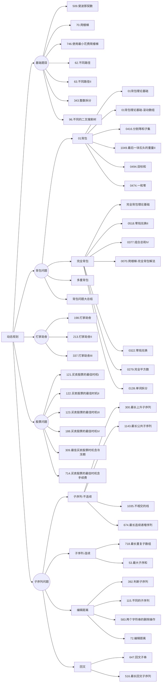

# 动态规划

## 基础知识

题目分类：



动态规划，英文：Dynamic Programming，简称DP，如果某一问题有很多重叠子问题，使用动态规划是最有效的。

所以动态规划中每一个状态一定是由上一个状态推导出来的，**这一点就区分于贪心**，贪心没有状态推导，而是从局部直接选最优的，

动态规划的三要素:

1. 最优子结构
2. 状态转移方程((包含最优子结构))
3. 边界

##  509. 斐波那契数

[力扣题目链接](https://leetcode.cn/problems/fibonacci-number/)

斐波那契数，通常用 F(n) 表示，形成的序列称为 斐波那契数列 。该数列由 0 和 1 开始，后面的每一项数字都是前面两项数字的和。也就是： F(0) = 0，F(1) = 1 F(n) = F(n - 1) + F(n - 2)，其中 n > 1 给你n ，请计算 F(n) 。

解答：

```java
class Solution {
    public int fib(int n) {
        if(n == 0) return 0;
        if(n <= 2) return 1;
        int[] dp = new int[2];
        dp[0] = 0;
        dp[1] = 1;
        for(int i = 2; i <= n; i++){
            int temp = dp[0] + dp[1];
            dp[0] = dp[1];
            dp[1] = temp;
        }
        return dp[1];
    }
}
```

## 70. 爬楼梯

[力扣题目链接](https://leetcode.cn/problems/climbing-stairs/)

假设你正在爬楼梯。需要 n 阶你才能到达楼顶。

每次你可以爬 1 或 2 个台阶。你有多少种不同的方法可以爬到楼顶呢？

注意：给定 n 是一个正整数。

解答：

```java
class Solution {
    public int climbStairs(int n) {
        int[] dp = new int[n+1];
        dp[0] = 1;
        dp[1] = 2;
        for(int i = 2; i < n; i++){
            dp[i] = dp[i-1] + dp[i-2];
        }
        return dp[n-1];
    }
}
```

## 746. 使用最小花费爬楼梯

[力扣题目链接](https://leetcode.cn/problems/min-cost-climbing-stairs/)

**旧题目描述**：

数组的每个下标作为一个阶梯，第 i 个阶梯对应着一个非负数的体力花费值 cost[i]（下标从 0 开始）。

每当你爬上一个阶梯你都要花费对应的体力值，一旦支付了相应的体力值，你就可以选择向上爬一个阶梯或者爬两个阶梯。

请你找出达到楼层顶部的最低花费。在开始时，你可以选择从下标为 0 或 1 的元素作为初始阶梯。

解答：

```java
class Solution {
    public int minCostClimbingStairs(int[] cost) {
        int[] dp = new int[cost.length+1];
        dp[0] = 0;
        dp[1] = 0;
        for(int i = 2; i < dp.length; i++){
            dp[i] = Math.min(dp[i-2] + cost[i-2], dp[i-1] + cost[i-1]);
        }
        return dp[dp.length-1];
    }
}
```

## 62.不同路径

[力扣题目链接](https://leetcode.cn/problems/unique-paths/)

一个机器人位于一个 m x n 网格的左上角 （起始点在下图中标记为 “Start” ）。

机器人每次只能向下或者向右移动一步。机器人试图达到网格的右下角（在下图中标记为 “Finish” ）。

问总共有多少条不同的路径？

解答：

<!-- tabs:start -->

#### **数理方法**

```java
class Solution {
    public int uniquePaths(int m, int n) {
        long res = 1;
        for(int a = n, b = 1; b < m; a++,b++){
            res = res*a/b;
        } 
        return (int)res;
    }
}
```
#### **dp**

```java

class Solution {
    public int uniquePaths(int m, int n) {
        int[][] f = new int[m][n];
        for (int i = 0; i < m; ++i) {
            f[i][0] = 1;
        }
        for (int j = 0; j < n; ++j) {
            f[0][j] = 1;
        }
        for (int i = 1; i < m; ++i) {
            for (int j = 1; j < n; ++j) {
                f[i][j] = f[i - 1][j] + f[i][j - 1];
            }
        }
        return f[m - 1][n - 1];
    }
}
```

#### **dp压缩**

```java
class Solution {
    public int uniquePaths(int m, int n) {
        // 在二维dp数组中，当前值的计算只依赖正上方和正左方，因此可以压缩成一维数组。
        int[] dp = new int[n];
        // 初始化，第一行只能从正左方跳过来，所以只有一条路径。
        Arrays.fill(dp, 1);
        for (int i = 1; i < m; i ++) {
            // 第一列也只有一条路，不用迭代，所以从第二列开始
            for (int j = 1; j < n; j ++) {
                dp[j] += dp[j - 1]; // dp[j] = dp[j] (正上方)+ dp[j - 1] (正左方)
            }
        }
        return dp[n - 1];
    }
}
```

<!-- tabs:end -->

## 63. 不同路径 II

[力扣题目链接](https://leetcode.cn/problems/unique-paths-ii/)

一个机器人位于一个 m x n 网格的左上角 （起始点在下图中标记为“Start” ）。

机器人每次只能向下或者向右移动一步。机器人试图达到网格的右下角（在下图中标记为“Finish”）。

现在考虑网格中有障碍物。那么从左上角到右下角将会有多少条不同的路径？

解答：

<!-- tabs:start -->

#### **dp**

```java
class Solution {
    public int uniquePathsWithObstacles(int[][] obstacleGrid) {
        if(obstacleGrid[0][0] == 1) return 0;
        int[][] dp = new int[obstacleGrid.length][obstacleGrid[0].length];
        for(int i = 0; i < dp.length; i++){
            if(obstacleGrid[i][0] == 1) break;
            dp[i][0] = 1;

        }

        for(int j = 1; j < dp[0].length; j++){
            if(obstacleGrid[0][j] == 1) break;
            dp[0][j] = 1;
        }
        for(int i = 1; i < dp.length; i++){
            for(int j = 1; j < dp[0].length; j++){
                dp[i][j] = obstacleGrid[i][j] == 1 ? 0 : dp[i-1][j] + dp[i][j-1];

            }
        }

        return dp[dp.length-1][dp[0].length-1];
    }
}
```

#### **dp压缩**

```java
class Solution {
    public int uniquePathsWithObstacles(int[][] obstacleGrid) {
        if(obstacleGrid[0][0] == 1) return 0;
        int m = obstacleGrid.length;
        int n =obstacleGrid[0].length;

        int[] dp = new int[n];
        for(int i = 0; i < n && obstacleGrid[0][i] != 1; i++){
            dp[i] = 1;

        } 

        for(int i = 1; i < m; i++){
            for(int j = 0; j < n; j++){
                if(obstacleGrid[i][j] == 1) dp[j] = 0;
                else if(j > 0) dp[j] += dp[j-1];
            }
        }

        return dp[n-1];
    }
}
```

<!-- tabs:end -->

## 343. 整数拆分

[力扣题目链接](https://leetcode.cn/problems/integer-break/)

给定一个正整数 n，将其拆分为至少两个正整数的和，并使这些整数的乘积最大化。 返回你可以获得的最大乘积。

解答：
<!-- tabs:start -->

#### **数学原理**

```java

class Solution {
    public int integerBreak(int n) {
        int res = 1;
        if(n == 2) return 1;
        if(n == 3) return 2;
        while(n > 4){
            n -= 3;
            res *= 3;// 通过数学原理拆出更多的3乘积越大
        }
        return n * res;
    }
}

```

#### **贪心**

```java

class Solution {
    public int integerBreak(int n) {
        int[] dp = new int[n+1];
        dp[2] = 1;
        for(int i = 2; i < n+1; i++){
            for(int j = 1; j <= i - j; j++){// 这里的 j 其实最大值为 i-j,再大只不过是重复而已
                dp[i] = Math.max(dp[i], Math.max(j*(i-j), j*dp[i-j]));
            }
        }
        return dp[n];
    }
}
```

<!-- tabs:end -->

## 96.不同的二叉搜索树

[力扣题目链接](https://leetcode.cn/problems/unique-binary-search-trees/)

给定一个整数 n，求以 1 ... n 为节点组成的二叉搜索树有多少种？

解答：

```java
class Solution {
    public int numTrees(int n) {
        int[] dp = new int[n+1];
        dp[0] = 1;
        dp[1] = 1;
        for(int  i = 2; i < dp.length; i++){
            for(int j = 0; j <= i-1; j++) dp[i] += (dp[j] * dp[i-j-1]);
        }
        return dp[n];
    }
}
```

## 🌟01背包理论基础

[题目](https://kamacoder.com/problempage.php?pid=1046)

- 对于二维dp数组
  先遍历物品还是先遍历背包重量都可以，但是**先遍历物品**更好理解。两个for循环都是正序遍历

- 对于一维动态dp数组
  由于数组会被覆盖，**倒序遍历是为了保证物品i只被放入一次！**。但如果一旦正序遍历了，那么物品i就会被重复加入多次！同时一定要先遍历物品，不然的话，背包j就会多次去遍历小背包（出现排列组合）。**如果求组合数就是外层for循环遍历物品，内层for遍历背包；如果求排列数就是外层for遍历背包，内层for循环遍历物品**。


<!-- tabs:start -->

#### **dp**

```java
import java.util.*;

public class Main{
    public static void main (String[] args) {
        Scanner in = new Scanner(System.in);
        int m = in.nextInt();//items
        int n = in.nextInt();//space
        int[][] bag = new int[m][2];
        for(int i = 0; i < m; i++){
            bag[i][0] = in.nextInt();//cost
        }
        
        for(int i = 0; i < m; i++){
            bag[i][1] = in.nextInt();//value
        }
        
        int[][] dp = new int[m][n+1];
        
        // 初始化第一行
        for(int i = bag[0][0]; i < n+1; i++){
            dp[0][i] = bag[0][1];
        }
        
        for(int j = 1; j < m; j++){
            for(int i = 1; i <= n; i++){
                if(i >= bag[j][0]) dp[j][i] = Math.max(dp[j-1][i - bag[j][0]]+bag[j][1], dp[j-1][i]);
                else dp[j][i] = dp[j-1][i];
            }
        }
        System.out.println(dp[m-1][n]);
    }
}
```

#### **动态数组**

```java
import java.util.*;

public class Main{
    public static void main (String[] args) {
        Scanner in = new Scanner(System.in);
        int m = in.nextInt();//items
        int n = in.nextInt();//space
        int[][] bag = new int[m][2];
        for(int i = 0; i < m; i++){
            bag[i][0] = in.nextInt();//cost
        }
        
        for(int i = 0; i < m; i++){
            bag[i][1] = in.nextInt();//value
        }
        // 创建一个动态规划数组 dp，初始值为 0
        int[] dp = new int[n+1];

        // 外层循环遍历每个类型的研究材料
        for(int j = 0; j < m; j++){
            for(int i = n; i >= 1; i--){// 内层循环从 n 空间逐渐减少到当前研究材料所占空间
                // 考虑当前研究材料选择和不选择的情况，选择最大值
                if(i >= bag[j][0]) dp[i] = Math.max(dp[i-bag[j][0]]+bag[j][1], dp[i]);
            }
        }
        System.out.println(dp[n]);
        in.close();
    }
}
```

<!-- tabs:end -->

## 416. 分割等和子集

[力扣题目链接](https://leetcode.cn/problems/partition-equal-subset-sum/)

题目难易：中等

给定一个只包含正整数的非空数组。是否可以将这个数组分割成两个子集，使得两个子集的元素和相等。

注意: 每个数组中的元素不会超过 100 数组的大小不会超过 200

解答：

```java
class Solution {
    public boolean canPartition(int[] nums) {
        if(nums.length == 1 || nums.length == 0) return false;
        int len = nums.length;
        int sum = 0;
        for(int i = 0; i < len; i++) sum += nums[i];
        if((sum & 1) == 1) return false;
        int[] dp = new int[sum/2+1];//背包的最大价值
        for(int i = 0; i < len; i++){
            for(int j = sum/2; j >= nums[i]; j--){
                dp[j] = Math.max(dp[j], dp[j-nums[i]] + nums[i]);//比较加不加这个数，cost=value表示dp最大value就是背包的空间
            }
            if(dp[sum/2] == sum/2) return true;
        }
        return dp[sum/2] == sum/2;
    }
}
```

## 1049.最后一块石头的重量II

[力扣题目链接](https://leetcode.cn/problems/last-stone-weight-ii/)

题目难度：中等

有一堆石头，每块石头的重量都是正整数。

每一回合，从中选出任意两块石头，然后将它们一起粉碎。假设石头的重量分别为 x 和 y，且 x <= y。那么粉碎的可能结果如下：

如果 x == y，那么两块石头都会被完全粉碎；

如果 x != y，那么重量为 x 的石头将会完全粉碎，而重量为 y 的石头新重量为 y-x。

最后，最多只会剩下一块石头。返回此石头最小的可能重量。如果没有石头剩下，就返回 0。

解答：

```java
class Solution {
    public int lastStoneWeightII(int[] stones) {
        if(stones == null || stones.length == 0) return 0;
        int len = stones.length;
        int sum = 0;
        for(int i = 0; i < len; i++) sum += stones[i];
        int[] dp = new int[sum/2+1];//背包的最大价值
        int res = sum;
        for(int i = 0; i < len; i++){
            for(int j = sum/2; j >= stones[i]; j--){
                dp[j] = Math.max(dp[j], dp[j-stones[i]] + stones[i]);
            }
            res = Math.min(res, Math.abs(sum-2*dp[sum/2]));
            if(res < 2) return res;
        }
        return res;
    }
}
```

## 494.目标和

[力扣题目链接](https://leetcode.cn/problems/target-sum/)

难度：中等

给定一个非负整数数组，a1, a2, ..., an, 和一个目标数，S。现在你有两个符号 + 和 -。对于数组中的任意一个整数，你都可以从 + 或 -中选择一个符号添加在前面。

返回可以使最终数组和为目标数 S 的所有添加符号的方法数。

解答：

```java
class Solution {
    public int findTargetSumWays(int[] nums, int target) {
        if(nums == null || nums.length == 0) return 0;

        int len = nums.length;
        int sum = target;
        for(int i = 0; i < len; i++) sum += nums[i];
        if(sum < 0) return 0;
        if((sum & 1) == 1) return 0;
        int[] dp = new int[sum/2+1];
        int cnt = 0;
        dp[0] = 1;//减到0增加组合数1
        for(int i = 0; i < len; i++){
            for(int j = sum/2; j >= nums[i]; j--){
                dp[j] += dp[j-nums[i]];//前i个数中，和为j的组合数
            }
        }

        return dp[sum/2];//满足条件的索引为sum/2
    }
}
```

## 474.一和零

[力扣题目链接](https://leetcode.cn/problems/ones-and-zeroes/)

给你一个二进制字符串数组 strs 和两个整数 m 和 n 。

请你找出并返回 strs 的最大子集的大小，该子集中 最多 有 m 个 0 和 n 个 1 。

如果 x 的所有元素也是 y 的元素，集合 x 是集合 y 的 子集 。

解答：

```java
//二维背包
class Solution {
    public int findMaxForm(String[] strs, int m, int n) {
        int cnt = 0;
        int[][] dp = new int[m+1][n+1];
        for(int i = 0; i < strs.length; i++){
            int[] nums = check(strs[i], m, n);

            for(int j = m; nums[0] <= j; j--){
                for(int k = n; nums[1] <= k; k--){
                    dp[j][k] = Math.max(dp[j][k], dp[j-nums[0]][k-nums[1]] + 1);
                }
            }
        }
        return dp[m][n];
    }

    private int[] check(String s, int m, int n){
        int[] nums = new int[2];
        for(char c : s.toCharArray()){
            if(c == '0') nums[0]++;
            else if(c == '1') nums[1]++;

            if(nums[0] > m || nums[1] > n) return nums;
        }

        return nums;
    }
}
```

## 动态规划：完全背包理论基础

[题目](https://kamacoder.com/problempage.php?pid=1052)

解答：

```java
//对于纯完全背包问题，其for循环的先后循环是可以颠倒的
public class Main{
    public static void main(String[] args){
        Scanner in = new Scanner(System.in);
        int items = in.nextInt(), bags = in.nextInt();
        int[] v = new int[items];
        int[] w = new int[items];
        for(int i = 0; i < items; i++){
            w[i] = in.nextInt();
            v[i] = in.nextInt();
        }
        
        int[] dp = new int[bags+1];
        
        for(int i = 0; i < items; i++){//遍历物品
            for(int j = w[i]; j <= bags; j++){//遍历背包
                dp[j] = Math.max(dp[j], dp[j-w[i]] + v[i]);
            }
        }
        System.out.println(dp[bags]);
        in.close();
    }
}
//如果先遍历背包，则要保证背包大于物品的重量
```

## 518.零钱兑换II

[力扣题目链接](https://leetcode.cn/problems/coin-change-ii/)

给定不同面额的硬币和一个总金额。写出函数来计算可以凑成总金额的硬币组合数。假设每一种面额的硬币有无限个。

解答：

```java
class Solution {
    public int change(int amount, int[] coins) {
        if(amount == 0) return 1;
        int[] dp = new int[amount+1];
        dp[0] = 1;//只有相等时才加1
        for(int i = 0; i < coins.length; i++){
            for(int j = coins[i]; j <= amount; j++){
                dp[j] += dp[j-coins[i]];
            }
        }

        return dp[amount];
    }
}
```

## 377. 组合总和 Ⅳ

[力扣题目链接](https://leetcode.cn/problems/combination-sum-iv/)

给定一个由正整数组成且不存在重复数字的数组，找出和为给定目标正整数的组合的个数。

解答：

```java
class Solution {
    public int combinationSum4(int[] nums, int target) {
        if(target == 0) return 1;
        int[] dp = new int[target+1];
        dp[0] = 1;//只有相等时才加1
        for(int j = 0; j <= target; j++){
            for(int i = 0; i < nums.length; i++){
                if(nums[i] <= j) dp[j] += dp[j-nums[i]];
            }
        }
        return dp[target];
    }
}
```

## 70. 爬楼梯（进阶版）

[卡码网：57. 爬楼梯](https://kamacoder.com/problempage.php?pid=1067)

假设你正在爬楼梯。需要 n 阶你才能到达楼顶。

每次你可以爬至多m (1 <= m < n)个台阶。你有多少种不同的方法可以爬到楼顶呢？

注意：给定 n 是一个正整数。

输入描述：输入共一行，包含两个正整数，分别表示n, m

输出描述：输出一个整数，表示爬到楼顶的方法数。

解答：

```java
import java.util.*;

public class Main{
    public static void main(String[] args){
        Scanner in = new Scanner(System.in);
        int n = in.nextInt();//peak
        int m = in.nextInt();//step
        int[] dp = new int[n+1];
        dp[0] = 1;
        for(int i = 1; i <= n; i++){
            for(int j = 1; j <= m && j <= i; j++){
                dp[i] += dp[i-j];
            }
        }
        System.out.println(dp[n]);
        
        in.close();
    }
    
}
```

## 322. 零钱兑换

[力扣题目链接](https://leetcode.cn/problems/coin-change/)

给定不同面额的硬币 coins 和一个总金额 amount。编写一个函数来计算可以凑成总金额所需的最少的硬币个数。如果没有任何一种硬币组合能组成总金额，返回 -1。

你可以认为每种硬币的数量是无限的。

解答：

```java
class Solution {
    public int coinChange(int[] coins, int amount) {
        if(amount == 0) return 0;
        int[] dp = new int[amount+1];//存储（最少硬币数+1）
        dp[0] = 1;
        for(int i = 0; i < coins.length; i++){
            for(int j = coins[i]; j <= amount; j++){
                if(dp[j-coins[i]] != 0) dp[j] = dp[j] == 0 ? dp[j-coins[i]]+1 : Math.min(dp[j], dp[j-coins[i]]+1);
            }
        }
        return dp[amount]-1;
    }
}
```

## 279.完全平方数

[力扣题目链接(opens new window)](https://leetcode.cn/problems/perfect-squares/)

给定正整数 n，找到若干个完全平方数（比如 1, 4, 9, 16, ...）使得它们的和等于 n。你需要让组成和的完全平方数的个数最少。

给你一个整数 n ，返回和为 n 的完全平方数的 最少数量 。

完全平方数 是一个整数，其值等于另一个整数的平方；换句话说，其值等于一个整数自乘的积。例如，1、4、9 和 16 都是完全平方数，而 3 和 11 不是。

解答：

<!-- tabs:start -->

#### **初始为1**

```java
class Solution {
    public int numSquares(int n) {
        int[] dp = new int[n+1];
        int[] square = squarenums(n);
        dp[0] = 1;
        for(int i : square){
            for(int j = i; j <= n; j++){
                if(dp[j-i] != 0) dp[j] = (dp[j] == 0) ? (dp[j-i]+1) : Math.min(dp[j], dp[j-i]+1);
            }
        }

        return dp[n]-1;
    }

    private int[] squarenums(int num) {

        int count = (int) Math.sqrt(num);

        int[] result = new int[count];

        for (int i = 0; i < count; i++) {
            result[i] = (i + 1) * (i + 1);
        }

        return result;
    }
}
```

#### **采用MAX_VALUE**

```java
class Solution {
    public int numSquares(int n) {
        int[] dp = new int[n+1];
        int sqrt_num = (int)Math.sqrt(n);
        for(int i = 0; i <= n; i++) dp[i] = Integer.MAX_VALUE;
        dp[0] = 0;
        for(int i = 1; i <= sqrt_num; i++){
            for(int j = i*i; j <= n; j++){
                dp[j] = Math.min(dp[j], dp[j-i*i]+1);
            }
        }

        return dp[n];
    }
}
```

<!-- tabs:end -->

## 139.单词拆分

[力扣题目链接(opens new window)](https://leetcode.cn/problems/word-break/)

给定一个非空字符串 s 和一个包含非空单词的列表 wordDict，判定 s 是否可以被空格拆分为一个或多个在字典中出现的单词。

说明：

拆分时可以重复使用字典中的单词。

你可以假设字典中没有重复的单词。

解答：

```java
class Solution {
    public boolean wordBreak(String s, List<String> wordDict) {
        HashSet<String> set = new HashSet<>(wordDict);
        boolean[] dp = new boolean[s.length()+1];
        dp[0] = true;
        for(int i = 1; i <= s.length(); i++){
            for(int j = 0; j < i && !dp[i]; j++){
                if(set.contains(s.substring(j,i))) dp[i] = dp[j];

            }
        }
        return dp[s.length()];
    }
}

//背包算法
class Solution {
    public boolean wordBreak(String s, List<String> wordDict) {
        boolean[] dp = new boolean[s.length()+1];
        dp[0] = true;
        for(int i = 1; i <= s.length(); i++){
            for(String j : wordDict){
                int len = j.length();
                if(i >= len && dp[i-len] && j.equals(s.substring(i-len,i))) dp[i] = true;
            }
        } 
        return dp[s.length()];
    }
}

// 回溯法+记忆化
class Solution {
    Set<String> set;
    private int[] memo;
    public boolean wordBreak(String s, List<String> wordDict) {
        set = new HashSet<>(wordDict);
        memo = new int[s.length()];
        return backtracking(s, 0);
    }

    private boolean backtracking(String s, int startindex){
        if(startindex == s.length()) return true;

        if(memo[startindex] == -1) return false;

        for(int i = startindex+1; i <= s.length(); i++){
            String sub = s.substring(startindex, i);
            if(!set.contains(sub)) continue;

            boolean res = backtracking(s, i);
            if(res) return true;
        }
        // 这里是关键，找遍了startIndex~s.length()也没能完全匹配，标记从startIndex开始不能找到
        memo[startindex] = -1;
        return false;

    }
}
```

## 多重背包

[题目](https://kamacoder.com/problempage.php?pid=1066)


未完待续~~~

