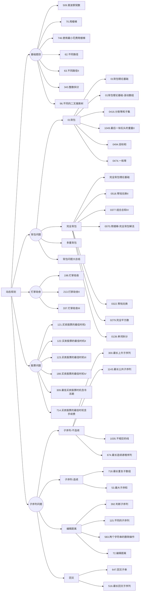
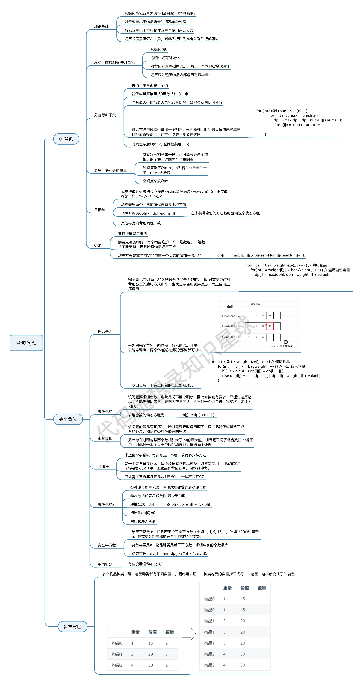

# 动态规划

## 基础知识

题目分类：



动态规划，英文：Dynamic Programming，简称DP，如果某一问题有很多重叠子问题，使用动态规划是最有效的。

所以动态规划中每一个状态一定是由上一个状态推导出来的，**这一点就区分于贪心**，贪心没有状态推导，而是从局部直接选最优的，

动态规划的三要素:

1. 最优子结构
2. 状态转移方程((包含最优子结构))
3. 边界

##  509. 斐波那契数

[力扣题目链接](https://leetcode.cn/problems/fibonacci-number/)

斐波那契数，通常用 F(n) 表示，形成的序列称为 斐波那契数列 。该数列由 0 和 1 开始，后面的每一项数字都是前面两项数字的和。也就是： F(0) = 0，F(1) = 1 F(n) = F(n - 1) + F(n - 2)，其中 n > 1 给你n ，请计算 F(n) 。

解答：

```java
class Solution {
    public int fib(int n) {
        if(n == 0) return 0;
        if(n <= 2) return 1;
        int[] dp = new int[2];
        dp[0] = 0;
        dp[1] = 1;
        for(int i = 2; i <= n; i++){
            int temp = dp[0] + dp[1];
            dp[0] = dp[1];
            dp[1] = temp;
        }
        return dp[1];
    }
}
```

## 70. 爬楼梯

[力扣题目链接](https://leetcode.cn/problems/climbing-stairs/)

假设你正在爬楼梯。需要 n 阶你才能到达楼顶。

每次你可以爬 1 或 2 个台阶。你有多少种不同的方法可以爬到楼顶呢？

注意：给定 n 是一个正整数。

解答：

```java
class Solution {
    public int climbStairs(int n) {
        int[] dp = new int[n+1];
        dp[0] = 1;
        dp[1] = 2;
        for(int i = 2; i < n; i++){
            dp[i] = dp[i-1] + dp[i-2];
        }
        return dp[n-1];
    }
}
```

## 746. 使用最小花费爬楼梯

[力扣题目链接](https://leetcode.cn/problems/min-cost-climbing-stairs/)

**旧题目描述**：

数组的每个下标作为一个阶梯，第 i 个阶梯对应着一个非负数的体力花费值 cost[i]（下标从 0 开始）。

每当你爬上一个阶梯你都要花费对应的体力值，一旦支付了相应的体力值，你就可以选择向上爬一个阶梯或者爬两个阶梯。

请你找出达到楼层顶部的最低花费。在开始时，你可以选择从下标为 0 或 1 的元素作为初始阶梯。

解答：

```java
class Solution {
    public int minCostClimbingStairs(int[] cost) {
        int[] dp = new int[cost.length+1];
        dp[0] = 0;
        dp[1] = 0;
        for(int i = 2; i < dp.length; i++){
            dp[i] = Math.min(dp[i-2] + cost[i-2], dp[i-1] + cost[i-1]);
        }
        return dp[dp.length-1];
    }
}
```

## 62.不同路径

[力扣题目链接](https://leetcode.cn/problems/unique-paths/)

一个机器人位于一个 m x n 网格的左上角 （起始点在下图中标记为 “Start” ）。

机器人每次只能向下或者向右移动一步。机器人试图达到网格的右下角（在下图中标记为 “Finish” ）。

问总共有多少条不同的路径？

解答：

<!-- tabs:start -->

#### **数理方法**

```java
class Solution {
    public int uniquePaths(int m, int n) {
        long res = 1;
        for(int a = n, b = 1; b < m; a++,b++){
            res = res*a/b;
        } 
        return (int)res;
    }
}
```
#### **dp**

```java

class Solution {
    public int uniquePaths(int m, int n) {
        int[][] f = new int[m][n];
        for (int i = 0; i < m; ++i) {
            f[i][0] = 1;
        }
        for (int j = 0; j < n; ++j) {
            f[0][j] = 1;
        }
        for (int i = 1; i < m; ++i) {
            for (int j = 1; j < n; ++j) {
                f[i][j] = f[i - 1][j] + f[i][j - 1];
            }
        }
        return f[m - 1][n - 1];
    }
}
```

#### **dp压缩**

```java
class Solution {
    public int uniquePaths(int m, int n) {
        // 在二维dp数组中，当前值的计算只依赖正上方和正左方，因此可以压缩成一维数组。
        int[] dp = new int[n];
        // 初始化，第一行只能从正左方跳过来，所以只有一条路径。
        Arrays.fill(dp, 1);
        for (int i = 1; i < m; i ++) {
            // 第一列也只有一条路，不用迭代，所以从第二列开始
            for (int j = 1; j < n; j ++) {
                dp[j] += dp[j - 1]; // dp[j] = dp[j] (正上方)+ dp[j - 1] (正左方)
            }
        }
        return dp[n - 1];
    }
}
```

<!-- tabs:end -->

## 63. 不同路径 II

[力扣题目链接](https://leetcode.cn/problems/unique-paths-ii/)

一个机器人位于一个 m x n 网格的左上角 （起始点在下图中标记为“Start” ）。

机器人每次只能向下或者向右移动一步。机器人试图达到网格的右下角（在下图中标记为“Finish”）。

现在考虑网格中有障碍物。那么从左上角到右下角将会有多少条不同的路径？

解答：

<!-- tabs:start -->

#### **dp**

```java
class Solution {
    public int uniquePathsWithObstacles(int[][] obstacleGrid) {
        if(obstacleGrid[0][0] == 1) return 0;
        int[][] dp = new int[obstacleGrid.length][obstacleGrid[0].length];
        for(int i = 0; i < dp.length; i++){
            if(obstacleGrid[i][0] == 1) break;
            dp[i][0] = 1;

        }

        for(int j = 1; j < dp[0].length; j++){
            if(obstacleGrid[0][j] == 1) break;
            dp[0][j] = 1;
        }
        for(int i = 1; i < dp.length; i++){
            for(int j = 1; j < dp[0].length; j++){
                dp[i][j] = obstacleGrid[i][j] == 1 ? 0 : dp[i-1][j] + dp[i][j-1];

            }
        }

        return dp[dp.length-1][dp[0].length-1];
    }
}
```

#### **dp压缩**

```java
class Solution {
    public int uniquePathsWithObstacles(int[][] obstacleGrid) {
        if(obstacleGrid[0][0] == 1) return 0;
        int m = obstacleGrid.length;
        int n =obstacleGrid[0].length;

        int[] dp = new int[n];
        for(int i = 0; i < n && obstacleGrid[0][i] != 1; i++){
            dp[i] = 1;

        } 

        for(int i = 1; i < m; i++){
            for(int j = 0; j < n; j++){
                if(obstacleGrid[i][j] == 1) dp[j] = 0;
                else if(j > 0) dp[j] += dp[j-1];
            }
        }

        return dp[n-1];
    }
}
```

<!-- tabs:end -->

## 343. 整数拆分

[力扣题目链接](https://leetcode.cn/problems/integer-break/)

给定一个正整数 n，将其拆分为至少两个正整数的和，并使这些整数的乘积最大化。 返回你可以获得的最大乘积。

解答：
<!-- tabs:start -->

#### **数学原理**

```java

class Solution {
    public int integerBreak(int n) {
        int res = 1;
        if(n == 2) return 1;
        if(n == 3) return 2;
        while(n > 4){
            n -= 3;
            res *= 3;// 通过数学原理拆出更多的3乘积越大
        }
        return n * res;
    }
}

```

#### **贪心**

```java

class Solution {
    public int integerBreak(int n) {
        int[] dp = new int[n+1];
        dp[2] = 1;
        for(int i = 2; i < n+1; i++){
            for(int j = 1; j <= i - j; j++){// 这里的 j 其实最大值为 i-j,再大只不过是重复而已
                dp[i] = Math.max(dp[i], Math.max(j*(i-j), j*dp[i-j]));
            }
        }
        return dp[n];
    }
}
```

<!-- tabs:end -->

## 96.不同的二叉搜索树

[力扣题目链接](https://leetcode.cn/problems/unique-binary-search-trees/)

给定一个整数 n，求以 1 ... n 为节点组成的二叉搜索树有多少种？

解答：

```java
class Solution {
    public int numTrees(int n) {
        int[] dp = new int[n+1];
        dp[0] = 1;
        dp[1] = 1;
        for(int  i = 2; i < dp.length; i++){
            for(int j = 0; j <= i-1; j++) dp[i] += (dp[j] * dp[i-j-1]);
        }
        return dp[n];
    }
}
```

## 🌟01背包理论基础

[题目](https://kamacoder.com/problempage.php?pid=1046)

- 对于二维dp数组
  先遍历物品还是先遍历背包重量都可以，但是**先遍历物品**更好理解。两个for循环都是正序遍历

- 对于一维动态dp数组
  由于数组会被覆盖，**倒序遍历是为了保证物品i只被放入一次！**。但如果一旦正序遍历了，那么物品i就会被重复加入多次！同时一定要先遍历物品，不然的话，背包j就会多次去遍历小背包（出现排列组合）。**如果求组合数就是外层for循环遍历物品，内层for遍历背包；如果求排列数就是外层for遍历背包，内层for循环遍历物品**。



<!-- tabs:start -->

#### **dp**

```java
import java.util.*;

public class Main{
    public static void main (String[] args) {
        Scanner in = new Scanner(System.in);
        int m = in.nextInt();//items
        int n = in.nextInt();//space
        int[][] bag = new int[m][2];
        for(int i = 0; i < m; i++){
            bag[i][0] = in.nextInt();//cost
        }
        
        for(int i = 0; i < m; i++){
            bag[i][1] = in.nextInt();//value
        }
        
        int[][] dp = new int[m][n+1];
        
        // 初始化第一行
        for(int i = bag[0][0]; i < n+1; i++){
            dp[0][i] = bag[0][1];
        }
        
        for(int j = 1; j < m; j++){
            for(int i = 1; i <= n; i++){
                if(i >= bag[j][0]) dp[j][i] = Math.max(dp[j-1][i - bag[j][0]]+bag[j][1], dp[j-1][i]);
                else dp[j][i] = dp[j-1][i];
            }
        }
        System.out.println(dp[m-1][n]);
    }
}
```

#### **动态数组**

```java
import java.util.*;

public class Main{
    public static void main (String[] args) {
        Scanner in = new Scanner(System.in);
        int m = in.nextInt();//items
        int n = in.nextInt();//space
        int[][] bag = new int[m][2];
        for(int i = 0; i < m; i++){
            bag[i][0] = in.nextInt();//cost
        }
        
        for(int i = 0; i < m; i++){
            bag[i][1] = in.nextInt();//value
        }
        // 创建一个动态规划数组 dp，初始值为 0
        int[] dp = new int[n+1];

        // 外层循环遍历每个类型的研究材料
        for(int j = 0; j < m; j++){
            for(int i = n; i >= 1; i--){// 内层循环从 n 空间逐渐减少到当前研究材料所占空间
                // 考虑当前研究材料选择和不选择的情况，选择最大值
                if(i >= bag[j][0]) dp[i] = Math.max(dp[i-bag[j][0]]+bag[j][1], dp[i]);
            }
        }
        System.out.println(dp[n]);
        in.close();
    }
}
```

<!-- tabs:end -->

## 416. 分割等和子集

[力扣题目链接](https://leetcode.cn/problems/partition-equal-subset-sum/)

题目难易：中等

给定一个只包含正整数的非空数组。是否可以将这个数组分割成两个子集，使得两个子集的元素和相等。

注意: 每个数组中的元素不会超过 100 数组的大小不会超过 200

解答：

```java
class Solution {
    public boolean canPartition(int[] nums) {
        if(nums.length == 1 || nums.length == 0) return false;
        int len = nums.length;
        int sum = 0;
        for(int i = 0; i < len; i++) sum += nums[i];
        if((sum & 1) == 1) return false;
        int[] dp = new int[sum/2+1];//背包的最大价值
        for(int i = 0; i < len; i++){
            for(int j = sum/2; j >= nums[i]; j--){
                dp[j] = Math.max(dp[j], dp[j-nums[i]] + nums[i]);//比较加不加这个数，cost=value表示dp最大value就是背包的空间
            }
            if(dp[sum/2] == sum/2) return true;
        }
        return dp[sum/2] == sum/2;
    }
}
```

## 1049.最后一块石头的重量II

[力扣题目链接](https://leetcode.cn/problems/last-stone-weight-ii/)

题目难度：中等

有一堆石头，每块石头的重量都是正整数。

每一回合，从中选出任意两块石头，然后将它们一起粉碎。假设石头的重量分别为 x 和 y，且 x <= y。那么粉碎的可能结果如下：

如果 x == y，那么两块石头都会被完全粉碎；

如果 x != y，那么重量为 x 的石头将会完全粉碎，而重量为 y 的石头新重量为 y-x。

最后，最多只会剩下一块石头。返回此石头最小的可能重量。如果没有石头剩下，就返回 0。

解答：

```java
class Solution {
    public int lastStoneWeightII(int[] stones) {
        if(stones == null || stones.length == 0) return 0;
        int len = stones.length;
        int sum = 0;
        for(int i = 0; i < len; i++) sum += stones[i];
        int[] dp = new int[sum/2+1];//背包的最大价值
        int res = sum;
        for(int i = 0; i < len; i++){
            for(int j = sum/2; j >= stones[i]; j--){
                dp[j] = Math.max(dp[j], dp[j-stones[i]] + stones[i]);
            }
            res = Math.min(res, Math.abs(sum-2*dp[sum/2]));
            if(res < 2) return res;
        }
        return res;
    }
}
```

## 494.目标和

[力扣题目链接](https://leetcode.cn/problems/target-sum/)

难度：中等

给定一个非负整数数组，a1, a2, ..., an, 和一个目标数，S。现在你有两个符号 + 和 -。对于数组中的任意一个整数，你都可以从 + 或 -中选择一个符号添加在前面。

返回可以使最终数组和为目标数 S 的所有添加符号的方法数。

解答：

```java
class Solution {
    public int findTargetSumWays(int[] nums, int target) {
        if(nums == null || nums.length == 0) return 0;

        int len = nums.length;
        int sum = target;
        for(int i = 0; i < len; i++) sum += nums[i];
        if(sum < 0) return 0;
        if((sum & 1) == 1) return 0;
        int[] dp = new int[sum/2+1];
        int cnt = 0;
        dp[0] = 1;//减到0增加组合数1
        for(int i = 0; i < len; i++){
            for(int j = sum/2; j >= nums[i]; j--){
                dp[j] += dp[j-nums[i]];//前i个数中，和为j的组合数
            }
        }

        return dp[sum/2];//满足条件的索引为sum/2
    }
}
```

## 474.一和零

[力扣题目链接](https://leetcode.cn/problems/ones-and-zeroes/)

给你一个二进制字符串数组 strs 和两个整数 m 和 n 。

请你找出并返回 strs 的最大子集的大小，该子集中 最多 有 m 个 0 和 n 个 1 。

如果 x 的所有元素也是 y 的元素，集合 x 是集合 y 的 子集 。

解答：

```java
//二维背包
class Solution {
    public int findMaxForm(String[] strs, int m, int n) {
        int cnt = 0;
        int[][] dp = new int[m+1][n+1];
        for(int i = 0; i < strs.length; i++){
            int[] nums = check(strs[i], m, n);

            for(int j = m; nums[0] <= j; j--){
                for(int k = n; nums[1] <= k; k--){
                    dp[j][k] = Math.max(dp[j][k], dp[j-nums[0]][k-nums[1]] + 1);
                }
            }
        }
        return dp[m][n];
    }

    private int[] check(String s, int m, int n){
        int[] nums = new int[2];
        for(char c : s.toCharArray()){
            if(c == '0') nums[0]++;
            else if(c == '1') nums[1]++;

            if(nums[0] > m || nums[1] > n) return nums;
        }

        return nums;
    }
}
```

## 完全背包理论基础

[题目](https://kamacoder.com/problempage.php?pid=1052)

解答：

```java
//对于纯完全背包问题，其for循环的先后循环是可以颠倒的
public class Main{
    public static void main(String[] args){
        Scanner in = new Scanner(System.in);
        int items = in.nextInt(), bags = in.nextInt();
        int[] v = new int[items];
        int[] w = new int[items];
        for(int i = 0; i < items; i++){
            w[i] = in.nextInt();
            v[i] = in.nextInt();
        }
        
        int[] dp = new int[bags+1];
        
        for(int i = 0; i < items; i++){//遍历物品
            for(int j = w[i]; j <= bags; j++){//遍历背包
                dp[j] = Math.max(dp[j], dp[j-w[i]] + v[i]);
            }
        }
        System.out.println(dp[bags]);
        in.close();
    }
}
//如果先遍历背包，则要保证背包大于物品的重量
```

## 518.零钱兑换II

[力扣题目链接](https://leetcode.cn/problems/coin-change-ii/)

给定不同面额的硬币和一个总金额。写出函数来计算可以凑成总金额的硬币组合数。假设每一种面额的硬币有无限个。

解答：

```java
class Solution {
    public int change(int amount, int[] coins) {
        if(amount == 0) return 1;
        int[] dp = new int[amount+1];
        dp[0] = 1;//只有相等时才加1
        for(int i = 0; i < coins.length; i++){
            for(int j = coins[i]; j <= amount; j++){
                dp[j] += dp[j-coins[i]];
            }
        }

        return dp[amount];
    }
}
```

## 377. 组合总和 Ⅳ

[力扣题目链接](https://leetcode.cn/problems/combination-sum-iv/)

给定一个由正整数组成且不存在重复数字的数组，找出和为给定目标正整数的组合的个数。

解答：

```java
class Solution {
    public int combinationSum4(int[] nums, int target) {
        if(target == 0) return 1;
        int[] dp = new int[target+1];
        dp[0] = 1;//只有相等时才加1
        for(int j = 0; j <= target; j++){
            for(int i = 0; i < nums.length; i++){
                if(nums[i] <= j) dp[j] += dp[j-nums[i]];
            }
        }
        return dp[target];
    }
}
```

## 70. 爬楼梯（进阶版）

[卡码网：57. 爬楼梯](https://kamacoder.com/problempage.php?pid=1067)

假设你正在爬楼梯。需要 n 阶你才能到达楼顶。

每次你可以爬至多m (1 <= m < n)个台阶。你有多少种不同的方法可以爬到楼顶呢？

注意：给定 n 是一个正整数。

输入描述：输入共一行，包含两个正整数，分别表示n, m

输出描述：输出一个整数，表示爬到楼顶的方法数。

解答：

```java
import java.util.*;

public class Main{
    public static void main(String[] args){
        Scanner in = new Scanner(System.in);
        int n = in.nextInt();//peak
        int m = in.nextInt();//step
        int[] dp = new int[n+1];
        dp[0] = 1;
        for(int i = 1; i <= n; i++){
            for(int j = 1; j <= m && j <= i; j++){
                dp[i] += dp[i-j];
            }
        }
        System.out.println(dp[n]);
        
        in.close();
    }
    
}
```

## 322. 零钱兑换

[力扣题目链接](https://leetcode.cn/problems/coin-change/)

给定不同面额的硬币 coins 和一个总金额 amount。编写一个函数来计算可以凑成总金额所需的最少的硬币个数。如果没有任何一种硬币组合能组成总金额，返回 -1。

你可以认为每种硬币的数量是无限的。

解答：

```java
class Solution {
    public int coinChange(int[] coins, int amount) {
        if(amount == 0) return 0;
        int[] dp = new int[amount+1];//存储（最少硬币数+1）
        dp[0] = 1;
        for(int i = 0; i < coins.length; i++){
            for(int j = coins[i]; j <= amount; j++){
                if(dp[j-coins[i]] != 0) dp[j] = dp[j] == 0 ? dp[j-coins[i]]+1 : Math.min(dp[j], dp[j-coins[i]]+1);
            }
        }
        return dp[amount]-1;
    }
}
```

## 279.完全平方数

[力扣题目链接](https://leetcode.cn/problems/perfect-squares/)

给定正整数 n，找到若干个完全平方数（比如 1, 4, 9, 16, ...）使得它们的和等于 n。你需要让组成和的完全平方数的个数最少。

给你一个整数 n ，返回和为 n 的完全平方数的 最少数量 。

完全平方数 是一个整数，其值等于另一个整数的平方；换句话说，其值等于一个整数自乘的积。例如，1、4、9 和 16 都是完全平方数，而 3 和 11 不是。

解答：

<!-- tabs:start -->

#### **初始为1**

```java
class Solution {
    public int numSquares(int n) {
        int[] dp = new int[n+1];
        int[] square = squarenums(n);
        dp[0] = 1;
        for(int i : square){
            for(int j = i; j <= n; j++){
                if(dp[j-i] != 0) dp[j] = (dp[j] == 0) ? (dp[j-i]+1) : Math.min(dp[j], dp[j-i]+1);
            }
        }

        return dp[n]-1;
    }

    private int[] squarenums(int num) {

        int count = (int) Math.sqrt(num);

        int[] result = new int[count];

        for (int i = 0; i < count; i++) {
            result[i] = (i + 1) * (i + 1);
        }

        return result;
    }
}
```

#### **采用MAX_VALUE**

```java
class Solution {
    public int numSquares(int n) {
        int[] dp = new int[n+1];
        int sqrt_num = (int)Math.sqrt(n);
        for(int i = 0; i <= n; i++) dp[i] = Integer.MAX_VALUE;
        dp[0] = 0;
        for(int i = 1; i <= sqrt_num; i++){
            for(int j = i*i; j <= n; j++){
                dp[j] = Math.min(dp[j], dp[j-i*i]+1);
            }
        }

        return dp[n];
    }
}
```

<!-- tabs:end -->

## 139.单词拆分

[力扣题目链接](https://leetcode.cn/problems/word-break/)

给定一个非空字符串 s 和一个包含非空单词的列表 wordDict，判定 s 是否可以被空格拆分为一个或多个在字典中出现的单词。

说明：

拆分时可以重复使用字典中的单词。

你可以假设字典中没有重复的单词。

解答：

```java
class Solution {
    public boolean wordBreak(String s, List<String> wordDict) {
        HashSet<String> set = new HashSet<>(wordDict);
        boolean[] dp = new boolean[s.length()+1];
        dp[0] = true;
        for(int i = 1; i <= s.length(); i++){
            for(int j = 0; j < i && !dp[i]; j++){
                if(set.contains(s.substring(j,i))) dp[i] = dp[j];

            }
        }
        return dp[s.length()];
    }
}

//背包算法
class Solution {
    public boolean wordBreak(String s, List<String> wordDict) {
        boolean[] dp = new boolean[s.length()+1];
        dp[0] = true;
        for(int i = 1; i <= s.length(); i++){
            for(String j : wordDict){
                int len = j.length();
                if(i >= len && dp[i-len] && j.equals(s.substring(i-len,i))) dp[i] = true;
            }
        } 
        return dp[s.length()];
    }
}

// 回溯法+记忆化
class Solution {
    Set<String> set;
    private int[] memo;
    public boolean wordBreak(String s, List<String> wordDict) {
        set = new HashSet<>(wordDict);
        memo = new int[s.length()];
        return backtracking(s, 0);
    }

    private boolean backtracking(String s, int startindex){
        if(startindex == s.length()) return true;

        if(memo[startindex] == -1) return false;

        for(int i = startindex+1; i <= s.length(); i++){
            String sub = s.substring(startindex, i);
            if(!set.contains(sub)) continue;

            boolean res = backtracking(s, i);
            if(res) return true;
        }
        // 这里是关键，找遍了startIndex~s.length()也没能完全匹配，标记从startIndex开始不能找到
        memo[startindex] = -1;
        return false;

    }
}
```

## 多重背包

[题目](https://kamacoder.com/problempage.php?pid=1066)

```java
import java.util.Arrays;
import java.util.Scanner;

public class multi_pack {

	public static void main(String[] args) {
		Scanner in = new Scanner(System.in);
		int C = in.nextInt();
		int N = in.nextInt();
		in.nextLine();

		int[] k = new int[N];
		String[][] str = new String[N][];
		for(int i = 0; i < 3; i++) {
			String ss = in.nextLine();
			str[i] = ss.split(" ");
			
		}
		
		for(int i = 0; i < str[2].length; i++) k[i] = Integer.valueOf(str[2][i]);
		int len = Arrays.stream(k).sum();//物品的总数目
		int cnt = 0;
		int[] w = new int[len];
		int[] v = new int[len];
		for(int j = 0; j < str[0].length; j++) {
			for(int i = 0; i < k[j]; i++) {
				w[cnt] = Integer.valueOf(str[0][j]);
				v[cnt] = Integer.valueOf(str[1][j]);
				cnt++;
			}
		}
		int[] dp = new int[C+1];
		for(int i = 0; i < len; i++) {//先遍历物品，再遍历背包
			for(int j = C; j >= w[i]; j--) {
				dp[j] = Math.max(dp[j], dp[j-w[i]] + v[i]);
			}
		}
		System.out.println(dp[C]);
		in.close();
	}

}

```

## 198.打家劫舍

[力扣题目链接](https://leetcode.cn/problems/house-robber/)

你是一个专业的小偷，计划偷窃沿街的房屋。每间房内都藏有一定的现金，影响你偷窃的唯一制约因素就是相邻的房屋装有相互连通的防盗系统，如果两间相邻的房屋在同一晚上被小偷闯入，系统会自动报警。

给定一个代表每个房屋存放金额的非负整数数组，计算你 不触动警报装置的情况下 ，一夜之内能够偷窃到的最高金额。

解答：

```java
class Solution {
    public int rob(int[] nums) {
        if (nums.length == 0) return 0;
        if (nums.length == 1) return nums[0];
            
        int[] dp = new int[nums.length];
        dp[0] = nums[0];
        dp[1] = Math.max(nums[0], nums[1]);
        for (int i = 2; i < nums.length; i++) {
            dp[i] = Math.max(dp[i - 1], dp[i - 2] + nums[i]);
        }
        return dp[nums.length - 1];
    }
}
```

## 213.打家劫舍II

[力扣题目链接](https://leetcode.cn/problems/house-robber-ii/)

你是一个专业的小偷，计划偷窃沿街的房屋，每间房内都藏有一定的现金。这个地方所有的房屋都 围成一圈 ，这意味着第一个房屋和最后一个房屋是紧挨着的。同时，相邻的房屋装有相互连通的防盗系统，如果两间相邻的房屋在同一晚上被小偷闯入，系统会自动报警 。

给定一个代表每个房屋存放金额的非负整数数组，计算你 在不触动警报装置的情况下 ，能够偷窃到的最高金额。

解答：

```java
class Solution {
    public int rob(int[] nums) {
        if(nums.length == 0) return 0;
        if(nums.length == 1) return nums[0];
        return Math.max(robHelper(nums, 0, nums.length-2), robHelper(nums, 1, nums.length-1));// 分别考虑首尾，从而打破环
    }

    private int robHelper(int[] nums, int start, int end) {// 这里的robHelper函数来求解不是环时的最大收益
        if(start > end) return 0;
        if(start == end) return nums[start];
        int[] dp = new int[end-start+1];
        dp[0] = nums[start];
        dp[1] = Math.max(nums[start], nums[start+1]);
        for(int i = start + 2; i <= end; i++) {
            dp[i-start] = Math.max(dp[i-start-1], nums[i] + dp[i-start-2]);
        }
        return dp[end-start];
    }
}
```

## 337.打家劫舍 III

[力扣题目链接](https://leetcode.cn/problems/house-robber-iii/)

在上次打劫完一条街道之后和一圈房屋后，小偷又发现了一个新的可行窃的地区。这个地区只有一个入口，我们称之为“根”。 除了“根”之外，每栋房子有且只有一个“父“房子与之相连。一番侦察之后，聪明的小偷意识到“这个地方的所有房屋的排列类似于一棵二叉树”。 如果两个直接相连的房子在同一天晚上被打劫，房屋将自动报警。

计算在不触动警报的情况下，小偷一晚能够盗取的最高金额。

解答：

```java
//暴力递归超时
class Solution {
    public int rob(TreeNode root) {
        if (root == null)  return 0;
        int res = root.val;
        int left_res = 0;
        int right_res = 0;
        if (root.left != null){
            res += rob(root.left.left) + rob(root.left.right);
            left_res = rob(root.left);
        } 
        if (root.right != null){
            res += rob(root.right.left) + rob(root.right.right);
            right_res = rob(root.right);
        }
        return Math.max(res, left_res + right_res);
    }
}

// 记录状态，超时
class Solution {
    public int rob(TreeNode root) {
        if (root == null)  return 0;
        Map<TreeNode, Integer> memo = new HashMap<>();

        return robHelper(root, memo);
    }
    private int robHelper(TreeNode root, Map<TreeNode, Integer> memo){
        if (root == null)  return 0;
        if (memo.containsKey(root)) return memo.get(root);
        int res = root.val;
        if (root.left != null) res += rob(root.left.left) + rob(root.left.right);
        if (root.right != null) res += rob(root.right.left) + rob(root.right.right);
        res = Math.max(res, robHelper(root.left, memo) + robHelper(root.right, memo));
        memo.put(root, res);
        return res;
    }
}

//状态标记,great
class Solution {
    public int rob(TreeNode root) {
        if (root == null)  return 0;
        int[] res = robHelper(root);
        return Math.max(res[0], res[1]);
    }
    private int[] robHelper(TreeNode root){
        int[] res = new int[2];
        if(root == null)  return res;
        int mid = root.val;
        int[] left_res = robHelper(root.left);
        int[] right_res = robHelper(root.right);
        res[0] = Math.max(left_res[0] ,left_res[1]) + Math.max(right_res[0], right_res[1]); // 不偷当前节点
        res[1] = mid + left_res[0] + right_res[0]; // 偷当前节点
        return res;
    }
}

```

##  121. 买卖股票的最佳时机

[力扣题目链接](https://leetcode.cn/problems/best-time-to-buy-and-sell-stock/)

给定一个数组 prices ，它的第 i 个元素 prices[i] 表示一支给定股票第 i 天的价格。

你只能选择 某一天 买入这只股票，并选择在 未来的某一个不同的日子 卖出该股票。设计一个算法来计算你所能获取的最大利润。

返回你可以从这笔交易中获取的最大利润。如果你不能获取任何利润，返回 0 。

解答：

```java
//贪心算法
class Solution {
    public int maxProfit(int[] prices) {
        // 找到一个最小的购入点
        int low = Integer.MAX_VALUE;
        // res不断更新，直到数组循环完毕
        int res = 0;
        for(int i = 0; i < prices.length; i++){
            low = Math.min(prices[i], low);
            res = Math.max(prices[i] - low, res);
        }
        return res;
    }
}

//DP
class Solution {
    public int maxProfit(int[] prices) {
        if(prices.length < 2) return 0;
        int[][] dp = new int[prices.length][2];
        // dp[i][0]代表第i天持有股票的最大收益
        // dp[i][1]代表第i天不持有股票的最大收益
        dp[0][0] = -prices[0];
        dp[0][1] = 0;

        for(int i = 1; i < prices.length; i++){
            dp[i][0] = Math.max(dp[i-1][0], -prices[i]);
            dp[i][1] = Math.max(dp[i-1][1], dp[i-1][0] + prices[i]);
        }
        return Math.max(dp[prices.length-1][0], dp[prices.length-1][1]);
    }
}

//DP,一维数组
class Solution {
    public int maxProfit(int[] prices) {
        if(prices.length < 2) return 0;
        int[] dp = new int[2];
        // dp[0]代表持有股票的最大收益
        // dp[1]代表不持有股票的最大收益
        dp[0] = -prices[0];
        dp[1] = 0;

        for(int i = 1; i < prices.length; i++){
            dp[0] = Math.max(dp[0], -prices[i]);
            dp[1] = Math.max(dp[1], dp[0] + prices[i]);
        }
        return Math.max(dp[0], dp[1]);
    }
}
```

## 122.买卖股票的最佳时机II

[力扣题目链接](https://leetcode.cn/problems/best-time-to-buy-and-sell-stock-ii/)

给定一个数组，它的第 i 个元素是一支给定股票第 i 天的价格。

设计一个算法来计算你所能获取的最大利润。你可以尽可能地完成更多的交易（多次买卖一支股票）。

注意：你不能同时参与多笔交易（你必须在再次购买前出售掉之前的股票）。

解答：

```java
//DP,优化空间
class Solution {
    public int maxProfit(int[] prices) {
        int[] dp = new int[2];
        // 0表示持有，1表示卖出
        dp[0] = -prices[0];
        dp[1] = 0;
        for(int i = 1; i <= prices.length; i++){
            // 前一天持有; 既然不限制交易次数，那么再次买股票时，要加上之前的收益
            dp[0] = Math.max(dp[0], dp[1] - prices[i-1]);
            // 前一天卖出; 或当天卖出，当天卖出，得先持有
            dp[1] = Math.max(dp[1], dp[0] + prices[i-1]);
        }
        return dp[1];
    }
}

//贪心
class Solution {
    public int maxProfit(int[] prices) {
        int[] dp = new int[prices.length];
        dp[0] = 0;
        for(int i = 1; i < prices.length; i++){
            dp[i] = dp[i-1] + Math.max(0, prices[i] - prices[i-1]);
        }
        return dp[prices.length-1];
    }
}
```

##  123.买卖股票的最佳时机III

[力扣题目链接](https://leetcode.cn/problems/best-time-to-buy-and-sell-stock-iii/)

给定一个数组，它的第 i 个元素是一支给定的股票在第 i 天的价格。

设计一个算法来计算你所能获取的最大利润。你最多可以完成 两笔 交易。

注意：你不能同时参与多笔交易（你必须在再次购买前出售掉之前的股票）。

解答：

```java
//DP
class Solution {
    public int maxProfit(int[] prices) {
        if(prices == null || prices.length < 2) return 0;
        int[][] dp = new int[prices.length][4];
        dp[0][0] = -prices[0];
        dp[0][2] = -prices[0];
        for(int i = 1; i < prices.length; i++){
            dp[i][0] = Math.max(dp[i-1][0], -prices[i]); // 第一次交易买入
            dp[i][1] = Math.max(dp[i-1][1], dp[i-1][0] + prices[i]); // 第一次交易卖出
            dp[i][2] = Math.max(dp[i-1][2], dp[i-1][1] - prices[i]); // 第二次交易买入
            dp[i][3] = Math.max(dp[i-1][3], dp[i-1][2] + prices[i]); // 第二次交易卖出
        }
        return dp[prices.length-1][3];
    }
}
```

## 🌟188.买卖股票的最佳时机IV

[力扣题目链接](https://leetcode.cn/problems/best-time-to-buy-and-sell-stock-iv/)

给定一个整数数组 prices ，它的第 i 个元素 prices[i] 是一支给定的股票在第 i 天的价格。

设计一个算法来计算你所能获取的最大利润。你最多可以完成 k 笔交易。

注意：你不能同时参与多笔交易（你必须在再次购买前出售掉之前的股票）。

解答：

```java
class Solution {
    public int maxProfit(int k, int[] prices) {
        if(k == 0 || prices.length < 2) return 0;
        // [天数][股票状态]
        // 股票状态: 奇数表示第 k 次交易持有/买入, 偶数表示第 k 次交易不持有/卖出, 0 表示没有操作
        k = Math.min(k, prices.length/2);
        int[][] dp = new int[prices.length][2*k+1];
        for(int i = 1; i < 2*k; i+=2) {
            dp[0][i] = -prices[0];
        }
        
        for(int i = 1; i < prices.length; i++) {
            for(int j = 0; j < 2*k-1; j+=2) {
                dp[i][j+1] = Math.max(dp[i-1][j+1], dp[i-1][j] - prices[i]);
                dp[i][j+2] = Math.max(dp[i-1][j+2], dp[i-1][j+1] + prices[i]);
            }
        }
        return dp[prices.length-1][2*k];
    }
}
```

## 🌟309.最佳买卖股票时机含冷冻期

[力扣题目链接](https://leetcode.cn/problems/best-time-to-buy-and-sell-stock-with-cooldown/)

给定一个整数数组，其中第 i 个元素代表了第 i 天的股票价格 。

设计一个算法计算出最大利润。在满足以下约束条件下，你可以尽可能地完成更多的交易（多次买卖一支股票）:

- 你不能同时参与多笔交易（你必须在再次购买前出售掉之前的股票）。
- 卖出股票后，你无法在第二天买入股票 (即冷冻期为 1 天)。

解答：

```java
class Solution {
    public int maxProfit(int[] prices) {
        if(prices == null || prices.length < 2) return 0;
        int[][] dp = new int[prices.length][2];

        //bad case
        dp[0][0] = -prices[0];
        dp[1][0] = Math.max(dp[0][0], -prices[1]);
        dp[1][1] = Math.max(dp[0][1], dp[0][0] + prices[1]);

        for(int i = 2; i < prices.length; i++){
            dp[i][0] = Math.max(dp[i-1][0], dp[i-2][1] - prices[i]);
            dp[i][1] = Math.max(dp[i-1][1], dp[i-1][0] + prices[i]);
        }
        return dp[prices.length-1][1];
    }
}
```

## 714.买卖股票的最佳时机含手续费

[力扣题目链接](https://leetcode.cn/problems/best-time-to-buy-and-sell-stock-with-transaction-fee/)

给定一个整数数组 prices，其中第 i 个元素代表了第 i 天的股票价格 ；非负整数 fee 代表了交易股票的手续费用。

你可以无限次地完成交易，但是你每笔交易都需要付手续费。如果你已经购买了一个股票，在卖出它之前你就不能再继续购买股票了。

返回获得利润的最大值。

注意：这里的一笔交易指买入持有并卖出股票的整个过程，每笔交易你只需要为支付一次手续费。

解答：

```java
class Solution {
    public int maxProfit(int[] prices, int fee) {
        if(prices == null || prices.length < 2) return 0;
        int[][] dp = new int[prices.length][2];
        dp[0][0] = -prices[0] - fee;
        dp[0][1] = 0;
        for(int i = 1; i < prices.length; i++){
            dp[i][0] = Math.max(dp[i-1][0], dp[i-1][1] - prices[i] - fee);
            dp[i][1] = Math.max(dp[i-1][1], dp[i-1][0] + prices[i]);
        }
        return dp[prices.length-1][1];
    }
}
```

## 300.最长递增子序列

[力扣题目链接](https://leetcode.cn/problems/longest-increasing-subsequence/)

给你一个整数数组 nums ，找到其中最长严格递增子序列的长度。

子序列是由数组派生而来的序列，删除（或不删除）数组中的元素而不改变其余元素的顺序。例如，[3,6,2,7] 是数组 [0,3,1,6,2,2,7] 的子序列。

解答：

```java
class Solution {
    public int lengthOfLIS(int[] nums) {
        if(nums.length < 2) return nums.length;
        int[] dp = new int[nums.length];
        Arrays.fill(dp, 1);
        int max = 1;
        for(int i = 1; i < nums.length; i++){
            for(int j = 0; j < i; j++){ //遍历前面的元素，与nums[i]组成的严格递增子序列长度
                if(nums[i] > nums[j]){
                    dp[i] = Math.max(dp[i], dp[j]+1);
                }
            }
            max = Math.max(max, dp[i]);
        }
        return max;
    }
}
```

## 674. 最长连续递增序列

[力扣题目链接](https://leetcode.cn/problems/longest-continuous-increasing-subsequence/)

给定一个未经排序的整数数组，找到最长且 连续递增的子序列，并返回该序列的长度。

连续递增的子序列 可以由两个下标 l 和 r（l < r）确定，如果对于每个 l <= i < r，都有 nums[i] < nums[i + 1] ，那么子序列 [nums[l], nums[l + 1], ..., nums[r - 1], nums[r]] 就是连续递增子序列。

解答：

```java
class Solution {
    public int findLengthOfLCIS(int[] nums) {
        if(nums.length < 2) return nums.length;
        int[] dp = new int[nums.length];
        Arrays.fill(dp, 1);
        int max = 1;
        for(int i = 1; i < nums.length; i++){
            if(nums[i] > nums[i-1]){
                dp[i] = dp[i-1] + 1;
            }
            max = Math.max(max, dp[i]);
        }
        return max;
    }
}
```

## 718. 最长重复子数组

[力扣题目链接](https://leetcode.cn/problems/maximum-length-of-repeated-subarray/)

给两个整数数组 A 和 B ，返回两个数组中公共的、长度最长的子数组的长度。

解答：

```java
class Solution {
    public int findLength(int[] nums1, int[] nums2) {
        if(nums1.length == 0 || nums2.length == 0) return 0;
        int[][] dp = new int[nums1.length+1][nums2.length+1]; //在i=0或j=0处加了个0，方便后续计算
        int max_len = 0;
        for(int i = 1; i <= nums1.length; i++){
            for(int j = 1; j <= nums2.length; j++){
                if(nums1[i-1] == nums2[j-1]){
                    dp[i][j] = dp[i-1][j-1] + 1;
                    max_len = Math.max(max_len, dp[i][j]);
                }
            }
        }
        return max_len;
    }
}
```

## 1143.最长公共子序列

[力扣题目链接](https://leetcode.cn/problems/longest-common-subsequence/)

给定两个字符串 text1 和 text2，返回这两个字符串的最长公共子序列的长度。

一个字符串的 子序列 是指这样一个新的字符串：它是由原字符串在不改变字符的相对顺序的情况下删除某些字符（也可以不删除任何字符）后组成的新字符串。

解答：

```java
//DP,二维数组
class Solution {
    public int longestCommonSubsequence(String text1, String text2) {
        char[] nums1 = text1.toCharArray();
        char[] nums2 = text2.toCharArray();
        if(nums1.length == 0 || nums2.length == 0) return 0;
        int[][] dp = new int[nums1.length+1][nums2.length+1];
        for(int i = 1; i <= nums1.length; i++){
            for(int j = 1; j <= nums2.length; j++){
                if(nums1[i-1] == nums2[j-1]){
                    dp[i][j] = dp[i-1][j-1] + 1;
                }else{
                    dp[i][j] = Math.max(dp[i-1][j], dp[i][j-1]); //由于两个字符串的长度大小未知，所以要用max，如果知道长度大小，可以用长度较长的字符串的前一个索引的dp值
                }
            }
        }
        return dp[nums1.length][nums2.length];
    }
}
//DP,一维数组
class Solution {
    public int longestCommonSubsequence(String text1, String text2) {
        char[] nums1 = text1.toCharArray();
        char[] nums2 = text2.toCharArray();
        if(nums1.length == 0 || nums2.length == 0) return 0;
        int[] dp = new int[nums2.length+1];
        for(int i = 1; i <= nums1.length; i++){
            int pre = dp[0]; // 记录dp[i-1][j-1]的值
            for(int j = 1; j <= nums2.length; j++){
                int cur = dp[j]; //暂存dp[i-1][j-1]的值
                if(nums1[i-1] == nums2[j-1]){
                    dp[j] = pre + 1;
                }else{
                    dp[j] = Math.max(dp[j-1], dp[j]);
                }
                pre = cur;
            }
        }
        return dp[nums2.length];
    }
}

```

## 1035.不相交的线

[力扣题目链接](https://leetcode.cn/problems/uncrossed-lines/)

我们在两条独立的水平线上按给定的顺序写下 A 和 B 中的整数。

现在，我们可以绘制一些连接两个数字 A[i] 和 B[j] 的直线，只要 A[i] == B[j]，且我们绘制的直线不与任何其他连线（非水平线）相交。

以这种方法绘制线条，并返回我们可以绘制的最大连线数。

解答：与上一题一样

## 53. 最大子序和

[力扣题目链接](https://leetcode.cn/problems/maximum-subarray/)

给定一个整数数组 nums ，找到一个具有最大和的连续子数组（子数组最少包含一个元素），返回其最大和。

解答：

```java
class Solution {
    public int maxSubArray(int[] nums) {
        if(nums.length == 0) return 0;
        int[] dp = new int[2];
        // dp[0]表示以当前元素结尾的最大子数组和，dp[1]表示不以当前元素结尾的最大子数组和
        dp[0] = nums[0];
        dp[1] = Integer.MIN_VALUE;
        for(int i = 1; i < nums.length; i++){
            dp[1] = Math.max(dp[1], dp[0]);
            dp[0] = Math.max(dp[0] + nums[i], nums[i]);
        }
        return Math.max(dp[0], dp[1]);
    }
}
```

## 392.判断子序列

[力扣题目链接](https://leetcode.cn/problems/is-subsequence/)

给定字符串 s 和 t ，判断 s 是否为 t 的子序列。

字符串的一个子序列是原始字符串删除一些（也可以不删除）字符而不改变剩余字符相对位置形成的新字符串。（例如，"ace"是"abcde"的一个子序列，而"aec"不是）。

解答：

```java
//DP，二维数组
class Solution {
    public boolean isSubsequence(String s, String t) {
        if(s.length() == 0) return true;
        char[] str1 = s.toCharArray();
        char[] str2 = t.toCharArray();
        int[][] dp = new int[str1.length+1][str2.length+1];
        for(int i = 1; i <= str2.length; i++){
            for(int j = 1; j <= str1.length; j++){
                if(str2[i-1] == str1[j-1]){
                    dp[j][i] = dp[j-1][i-1] + 1;
                    if(dp[j][i] == str1.length) return true;
                }
                else{
                    dp[j][i] = dp[j][i-1];
                }
            }
        }
        return dp[str1.length][str2.length] == str1.length;
    }
}
//DP，一维数组
class Solution {
    public boolean isSubsequence(String s, String t) {
        if(s.length() == 0) return true;
        char[] str1 = s.toCharArray();
        char[] str2 = t.toCharArray();
        int[] dp = new int[str1.length+1];
        for(int i = 1; i <= str2.length; i++){
            for(int j = str1.length; j >= 1; j--){
                if(str2[i-1] == str1[j-1]){
                    dp[j] = dp[j-1] + 1;
                    if(dp[j] == str1.length) return true;
                }
            }
        }
        return dp[str1.length] == str1.length;
    }
}
```

## 115.不同的子序列

[力扣题目链接](https://leetcode.cn/problems/distinct-subsequences/)

给定一个字符串 s 和一个字符串 t ，计算在 s 的子序列中 t 出现的个数。

字符串的一个 子序列 是指，通过删除一些（也可以不删除）字符且不干扰剩余字符相对位置所组成的新字符串。（例如，"ACE" 是 "ABCDE" 的一个子序列，而 "AEC" 不是）

题目数据保证答案符合 32 位带符号整数范围。

解答：

```java
class Solution {
    public int numDistinct(String s, String t) {
        if(t == null || t.length() == 0) return 0;
        int[][] dp = new int[s.length()+1][t.length()+1];
        for(int i = 0; i <= s.length(); i++){
            dp[i][0] = 1;
        }

        for(int i = 1; i <= s.length(); i++){
            for(int j = 1; j <= t.length(); j++){
                if(s.charAt(i-1) == t.charAt(j-1)){
                    dp[i][j] = dp[i-1][j-1] + dp[i-1][j];
                } else {
                    dp[i][j] = dp[i-1][j];
                }
            }
        }
        return dp[s.length()][t.length()];
    }
}
```

## 583. 两个字符串的删除操作

[力扣题目链接](https://leetcode.cn/problems/delete-operation-for-two-strings/)

给定两个单词 word1 和 word2，找到使得 word1 和 word2 相同所需的最小步数，每步可以删除任意一个字符串中的一个字符。

解答：

```java
class Solution {
    public int minDistance(String word1, String word2) {
        int[][] dp = new int[word1.length() + 1][word2.length() + 1];
        for(int i = 1; i <= word1.length(); i++){
            for(int j = 1; j <= word2.length(); j++){
                if(word1.charAt(i-1) == word2.charAt(j-1)){
                    dp[i][j] = dp[i-1][j-1] + 1;
                } else {
                    dp[i][j] = Math.max(dp[i-1][j], dp[i][j-1]);
                }
            }
        }
        return word1.length() + word2.length() - 2 * dp[word1.length()][word2.length()];
    }
}
```

## 72. 编辑距离

[力扣题目链接](https://leetcode.cn/problems/edit-distance/)

给你两个单词 word1 和 word2，请你计算出将 word1 转换成 word2 所使用的最少操作数 。

你可以对一个单词进行如下三种操作：

- 插入一个字符
- 删除一个字符
- 替换一个字符

解答：

```java
class Solution {
    public int minDistance(String word1, String word2) {
        int[][] dp = new int[word2.length() + 1][word1.length() + 1];
        for(int i = 0; i <= word2.length(); i++) dp[i][0] = i;
        for(int j = 0; j <= word1.length(); j++) dp[0][j] = j;
        for(int i = 1; i <= word2.length(); i++){
            for(int j = 1; j <= word1.length(); j++){
                if(word2.charAt(i-1) == word1.charAt(j-1)){
                    dp[i][j] = dp[i-1][j-1];
                } else {
                    /*
                    dp[i][j-1]表示删除word1的第j个字符，
                    dp[i-1][j]表示在word1的的第j字符后面插入word2的第i个字符，
                    dp[i-1][j-1]表示替换word1的第j个字符。
                    */
                    dp[i][j] = Math.min(Math.min(dp[i][j-1], dp[i-1][j]), dp[i-1][j-1]) + 1; 
                }
            }
        }
        return dp[word2.length()][word1.length()];
    }
}
```

## 647. 回文子串

[力扣题目链接](https://leetcode.cn/problems/palindromic-substrings/)

给定一个字符串，你的任务是计算这个字符串中有多少个回文子串。

具有不同开始位置或结束位置的子串，即使是由相同的字符组成，也会被视作不同的子串。

解答：

```java
class Solution {
    public int countSubstrings(String s) {
        int count = 0;
        boolean[][] dp = new boolean[s.length()][s.length()];
        for(int i = s.length()-1; i >= 0; i--){ //从右下角开始，横向遍历
            for(int j = i; j < s.length(); j++){
                if((s.charAt(i) == s.charAt(j)) && ((j-i < 2) || dp[i+1][j-1])){ 
                    dp[i][j] = true;
                    count++;
                }
            }
        }
        return count;
    }
}
```

## 516.最长回文子序列

[力扣题目链接](https://leetcode.cn/problems/longest-palindromic-subsequence/)

给定一个字符串 s ，找到其中最长的回文子序列，并返回该序列的长度。可以假设 s 的最大长度为 1000 。

解答：

```java
class Solution {
    public int longestPalindromeSubseq(String s) {
        if(s == null || s.length() == 0) return 0;
        int[][] dp = new int[s.length()][s.length()];
        int max = 0;
        for(int i = s.length() - 1; i >= 0; i--) {
            for(int j = i; j < s.length(); j++) {
                if(s.charAt(i) == s.charAt(j)){
                    if(j - i < 2) dp[i][j] = j - i + 1;
                    else dp[i][j] = dp[i+1][j-1] + 2;
                } else {
                    dp[i][j] = Math.max(dp[i+1][j], dp[i][j-1]);
                }
                max = Math.max(max, dp[i][j]);
            }
        }
        return max;
    }
}
```

## 其他

### 132. 分割回文串 II

[力扣题目链接(opens new window)](https://leetcode.cn/problems/palindrome-partitioning-ii/)

给你一个字符串 s，请你将 s 分割成一些子串，使每个子串都是回文。

返回符合要求的 最少分割次数 。

解答：

```java
class Solution {
    boolean dp[][];
    public int minCut(String s) {
        if (s == null || s.length() <= 1) {
            return 0; // 长度为0或1的字符串不需要切割
        }
        dp = new boolean[s.length()][s.length()];
        for(int i = s.length() - 1; i >= 0; i--){
            for(int j = i; j < s.length(); j++){
                if(s.charAt(i) == s.charAt(j) && (j - i <= 2 || dp[i+1][j-1])){
                    dp[i][j] = true;
                }
            }
        }

        int[] cut = new int[s.length()];
        for(int i = 0; i < s.length(); i++) cut[i] = i;
        for(int i = 1; i < s.length(); i++){
            if(dp[0][i]){
                cut[i] = 0;
                continue;
            }
            for(int j = 0; j < i; j++){
                if(dp[j+1][i]){
                    cut[i] = Math.min(cut[i], cut[j] + 1);
                }
            }
        }
        return cut[s.length() - 1];

    }
}
```

### 673.最长递增子序列的个数

[力扣题目链接(opens new window)](https://leetcode.cn/problems/number-of-longest-increasing-subsequence/)

给定一个未排序的整数数组，找到最长递增子序列的个数。

解答：

```java
import java.util.Arrays;

class Solution {
    public int findNumberOfLIS(int[] nums) {
        if(nums.length <= 1) return nums.length;
        int[] dp = new int[nums.length]; // dp[i] means the length of LIS ending at i with the last element nums[i]
        int[] cnt = new int[nums.length]; // cnt[i] means the number of LIS ending at i with length dp[i] with the last element nums[i]
        Arrays.fill(dp, 1);
        Arrays.fill(cnt, 1);

        int maxLen = 0;
        for(int i = 1; i < nums.length; i++){
            for(int j = 0; j < i; j++){
                if(nums[i] > nums[j]){
                    if(dp[j] + 1 > dp[i]) {
                        dp[i] = dp[j] + 1;
                        cnt[i] = cnt[j];
                    } else if(dp[j] + 1 == dp[i]){
                        cnt[i] += cnt[j];
                    }
                }

                if(dp[i] > maxLen) maxLen = dp[i];
            }
        }

        int res = 0;
        for(int i = 0; i < nums.length; i++){
            if(dp[i] == maxLen) res += cnt[i];
        }
        return res;
    }
}

```

