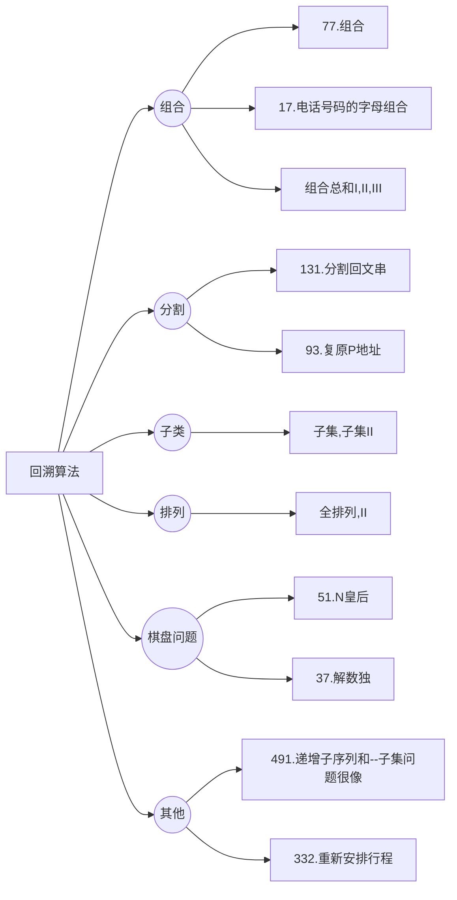
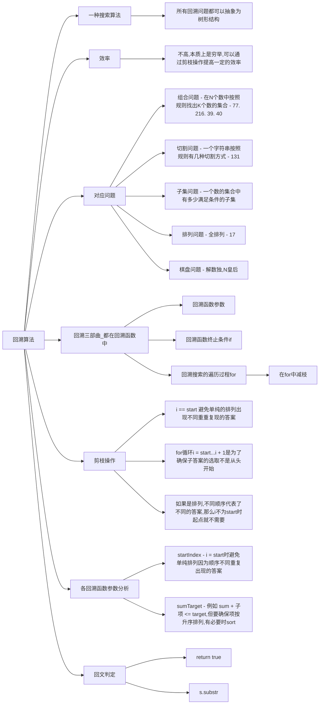

# 回溯

## 回溯算法理论基础

题目分类：



回溯法也可以叫做回溯搜索法,它是一种搜索的方式。回溯是**递归**的副产品,只要有递归就会有回溯。

### 回溯法的效率

虽然回溯法很难,很不好理解,但是回溯法并不是什么高效的算法。因为回溯的**本质是穷举**,穷举所有可能,然后选出我们想要的答案,如果想让回溯法高效一些,可以加一些剪枝的操作,但也改不了回溯法就是穷举的本质。

组合无序,排列有序

### 理解回溯法

所有回溯法的问题都可以抽象为**树形结构**,因为回溯法解决的都是在集合中递归查找子集,**集合的大小就构成了树的宽度,递归的深度就构成了树的深度**。

递归要有终止条件,所以必然是一棵高度有限的树（N叉树）。

###  回溯法模板

回溯三部曲：

1. 返回值以及参数
   函数返回值一般为void,参数一般是先写逻辑才能确定
2. 终止条件
   终止条件从树中就可以看出,一般来说是搜到叶子节点
3. 遍历过程
   一般是在集合中递归搜索,集合的大小构成了树的宽度,递归的深度构成的树的深度

## 第77题. 组合

[力扣题目链接](https://leetcode.cn/problems/combinations/)

给定两个整数 n 和 k,返回 1 ... n 中所有可能的 k 个数的组合。

示例: 输入: n = 4, k = 2 输出: [ [2,4], [3,4], [2,3], [1,2], [1,3], [1,4], ]

解答：

```java
class Solution {
    List<List<Integer>> res = new ArrayList<>();
    Deque<Integer> deque = new LinkedList<>();
    public List<List<Integer>> combine(int n, int k) {
        backtracking(n, k, 1);
        return res;

    }
    private void backtracking(int n, int k, int startindex){
        if(deque.size() == k){
            res.add(new ArrayList<>(deque));
            return;
        }

        for(int i = startindex; i <= n - (k - deque.size() - 1); i++){
            deque.offer(i);
            backtracking(n, k, i+1);
            deque.pollLast();
        }
    }
}
```

## 216.组合总和III

[力扣题目链接](https://leetcode.cn/problems/combination-sum-iii/)

找出所有相加之和为 n 的 k 个数的组合。组合中只允许含有 1 - 9 的正整数,并且每种组合中不存在重复的数字。

说明：

- 所有数字都是正整数。
- 解集不能包含重复的组合。

解答：

```java
class Solution {
    List<List<Integer>> res = new ArrayList<>();
    Deque<Integer> deque = new LinkedList<>();
    public List<List<Integer>> combinationSum3(int k, int n) {
        backtracking(k, n, 1);
        return res;
    }
    private void backtracking(int k, int n, int startindex){
        if(k == 0 || n == 0){
            if(k == 0 && n == 0) res.add(new ArrayList<>(deque));
            return;
        }

        for(int i = startindex; i <= Math.min(n, 9); i++){
            deque.offer(i);
            backtracking(k-1, n-i, i+1);
            deque.pollLast();
        }
    }
}
```

## 17.电话号码的字母组合

[力扣题目链接](https://leetcode.cn/problems/letter-combinations-of-a-phone-number/)

给定一个仅包含数字 2-9 的字符串,返回所有它能表示的字母组合。

给出数字到字母的映射如下（与电话按键相同）。注意 1 不对应任何字母。

解答：

```java
class Solution {
    List<String> res = new ArrayList<>();
    StringBuilder temp = new StringBuilder();
    public List<String> letterCombinations(String digits) {
        if(digits == null || digits.length() == 0) return res;
        String[] s = {"","","abc","def","ghi","jkl","mno","pqrs","tuv","wxyz"};
        backtracking(digits, 0, s);
        return res;
    }
    private void backtracking(String digits, int num, String[] s){
        if(num == digits.length()){
            res.add(temp.toString());
            return;
        }
        String str = s[digits.charAt(num) - '0'];
        for(int i = 0; i < str.length(); i++){
            temp.append(str.charAt(i));

            backtracking(digits, num + 1, s);

            temp.deleteCharAt(temp.length() - 1);
        }
    }
}
```

##  39. 组合总和

[力扣题目链接](https://leetcode.cn/problems/combination-sum/)

给定一个无重复元素的数组 candidates 和一个目标数 target ,找出 candidates 中所有可以使数字和为 target 的组合。

candidates 中的数字可以无限制重复被选取。

说明：

- 所有数字（包括 target）都是正整数。
- 解集不能包含重复的组合。

解答：

```java
class Solution {
    List<List<Integer>> res = new ArrayList<>();
    List<Integer> temp = new ArrayList<>();
    public List<List<Integer>> combinationSum(int[] candidates, int target) {
        if(candidates == null || candidates.length == 0) return null;
        backtracking(candidates, target, 0);
        return res;
    }

    private void backtracking(int[] candidates, int target, int startindex){
        if(target < 0){
            return;
        } else if(target == 0){
            res.add(new ArrayList<>(temp));
            return;
        }

        for(int i = startindex; i < candidates.length; i++){
            temp.add(candidates[i]);
            backtracking(candidates, target-candidates[i], i);
            temp.remove(temp.size() - 1);
        }
    }
}
```

## 40.组合总和II

[力扣题目链接](https://leetcode.cn/problems/combination-sum-ii/)

给定一个数组 candidates 和一个目标数 target ,找出 candidates 中所有可以使数字和为 target 的组合。

candidates 中的每个数字在每个组合中只能使用一次。

说明： 所有数字（包括目标数）都是正整数。解集不能包含重复的组合。

解答：

<!-- tabs:start -->

#### **used数组**

```java
class Solution {
    List<List<Integer>> res = new ArrayList<>();
    LinkedList<Integer> temp = new LinkedList<>();
    boolean[] used;
    public List<List<Integer>> combinationSum2(int[] candidates, int target) {
        if(candidates == null || candidates.length == 0) return null;
        used = new boolean[candidates.length];
        // 加标志数组,用来辅助判断同层节点是否已经遍历
        Arrays.fill(used, false);
        Arrays.sort(candidates);
        backtracking(candidates, target, 0);
        return res;
    }

    private void backtracking(int[] candidates, int target, int startindex){
        
        if(target < 0){
            return;
        } else if(target == 0){
            res.add(new ArrayList<>(temp));
            return;
        }

        for(int i = startindex; i < candidates.length; i++){
            // used[i - 1] == true,说明同⼀树⽀nums[i - 1]使⽤过
            // used[i - 1] == false,说明同⼀树层nums[i - 1]使⽤过
            // 如果同⼀树层nums[i - 1]使⽤过则直接跳过
            if(i > 0 && candidates[i] == candidates[i-1] && !used[i-1]) continue;
            temp.add(candidates[i]);
            used[i] = true;
            // 每个节点仅能选择一次,所以从下一位开始
            backtracking(candidates, target-candidates[i], i+1);
            used[i] = false;
            temp.removeLast();
        }
    }
}
```

#### **不用used数组**

```java
class Solution {
    List<List<Integer>> res = new ArrayList<>();
    LinkedList<Integer> temp = new LinkedList<>();
    public List<List<Integer>> combinationSum2(int[] candidates, int target) {
        if(candidates == null || candidates.length == 0) return null;
        Arrays.sort(candidates);
        backtracking(candidates, target, 0);
        return res;
    }

    private void backtracking(int[] candidates, int target, int startindex){
        
        if(target < 0){
            return;
        } else if(target == 0){
            res.add(new ArrayList<>(temp));
            return;
        }

        for(int i = startindex; i < candidates.length; i++){
            if(i > startindex && candidates[i] == candidates[i-1]) continue;// 要对同一树层使用过的元素进行跳过
            temp.add(candidates[i]);
            backtracking(candidates, target-candidates[i], i+1);
            temp.removeLast();
        }
    }
}
```

<!-- tabs:end -->

## 131.分割回文串

[力扣题目链接](https://leetcode.cn/problems/palindrome-partitioning/)

给定一个字符串 s,将 s 分割成一些子串,使每个子串都是回文串。

返回 s 所有可能的分割方案。

解答：

```java
class Solution {
    List<List<String>> res = new ArrayList<>();
    Deque<String> deque = new LinkedList<>();
    public List<List<String>> partition(String s) {
        if(s == null || s.length() == 0) return null;
        backtracking(s);
        return res;
    }
    private void backtracking(String s){
        if(s == null){
            res.add(new ArrayList(deque));
            return;
        }
        int len1 = s.length();
        for(int i = 0; i < len1; i++){
            if(ishuiwen(s.substring(0,i+1))){
                deque.offer(s.substring(0,i+1));
                if(i+1 < len1) backtracking(s.substring(i+1,len1));
                else backtracking(null);
                deque.pollLast();
            } 
            
        }
    }
    private boolean ishuiwen(String s){
        int len = s.length();
        for(int i = 0; i < len/2; i++){
            if(s.charAt(i) != s.charAt(len - i - 1)) return false;
        }
        return true;
    }
}
```

## 93.复原IP地址

[力扣题目链接](https://leetcode.cn/problems/restore-ip-addresses/)

给定一个只包含数字的字符串,复原它并返回所有可能的 IP 地址格式。

有效的 IP 地址 正好由四个整数（每个整数位于 0 到 255 之间组成,且不能含有前导 0）,整数之间用 '.' 分隔。

解答：

```java
class Solution {
    List<String> res = new ArrayList<>();
    public List<String> restoreIpAddresses(String s) {
        StringBuilder sb = new StringBuilder(s);
        backtracking(sb, 0, 0);
        return res;
    }
    private void backtracking(StringBuilder s, int startindex, int pointnum){
        if(pointnum == 3 && check(s, startindex, s.length())){
            res.add(s.toString());
            return;
        }
        if(pointnum > 3) return;
        for(int i = startindex; i < s.length() && i < startindex + 3; i++){
            if(check(s, startindex, i+1)){
                s.insert(i+1,".");
                backtracking(s, i+2, pointnum+1);
                s.deleteCharAt(i+1);
            }
        }
    }
    private boolean check(StringBuilder s, int start, int end){
        if(end-start > 3 || end > s.length() || start >= end || Integer.valueOf(s.substring(start, end)) > 255) return false;
        if(s.charAt(start) == '0' && end-start > 1) return false;
        return true;
    }
}
```

## 78.子集

[力扣题目链接](https://leetcode.cn/problems/subsets/)

给定一组不含重复元素的整数数组 nums,返回该数组所有可能的子集（幂集）。

说明：解集不能包含重复的子集。

解答：

```java
class Solution {
    List<List<Integer>> res = new ArrayList<>();
    List<Integer> temp = new ArrayList<>();
    public List<List<Integer>> subsets(int[] nums) {
        if(nums == null || nums.length == 0) return null;
        backtracking(nums, 0, nums.length-1);
        return res;

    }
    private void backtracking(int[] nums, int left, int right){
        if(left > right){
            res.add(new ArrayList(temp));
            return;
        }

        temp.add(nums[left]);
        backtracking(nums, left+1, right);//添加nums[left]元素的集合
        temp.removeLast();
        backtracking(nums, left+1, right);//不添加nums[left]元素的集合
    }
}
```

## 90.子集II

[力扣题目链接](https://leetcode.cn/problems/subsets-ii/)

给定一个可能包含重复元素的整数数组 nums,返回该数组所有可能的子集（幂集）。

说明：解集不能包含重复的子集。

解答：

```java
class Solution {
    List<List<Integer>> res = new ArrayList<>();
    List<Integer> temp = new ArrayList<>();
    public List<List<Integer>> subsetsWithDup(int[] nums) {
        if(nums == null || nums.length == 0) return null;
        Arrays.sort(nums);
        backtracking(nums, 0);
        return res;

    }
    private void backtracking(int[] nums, int startindex){
        res.add(new ArrayList(temp));//「遍历这个树的时候,把所有节点都记录下来,就是要求的子集集合」
        //停止条件就是：i < nums.length
        for(int i = startindex; i < nums.length; i++){
            if(i > startindex && nums[i] == nums[i-1]) continue;
            temp.add(nums[i]);
            backtracking(nums, i+1);
            temp.removeLast();
        }

    }
}
```

## 491.递增子序列

[力扣题目链接](https://leetcode.cn/problems/non-decreasing-subsequences/)

给定一个整型数组, 你的任务是找到所有该数组的递增子序列,递增子序列的长度至少是2。

解答：

<!-- tabs:start -->

#### **暴力判断重复**

```java
class Solution {
    List<List<Integer>> res = new ArrayList<>();
    List<Integer> temp = new ArrayList<>();
    public List<List<Integer>> findSubsequences(int[] nums) {
        if(nums == null || nums.length == 0) return null;
        backtracking(nums, 0);
        return res;

    }
    private void backtracking(int[] nums, int startindex){
        if(temp.size() > 1){
            if(temp.get(temp.size()-1) < temp.get(temp.size()-2)) return;
            res.add(new ArrayList(temp));
        } 
        

        for(int i = startindex; i < nums.length; i++){
            boolean flag = false;//判断全集是否包含相同的元素
            for(int j = i-1; j >= startindex; j--){
                if(nums[i] == nums[j]){
                    flag = true;
                    break;
                }
            }
            if(flag) continue;
            temp.add(nums[i]);
            backtracking(nums, i+1);
            temp.removeLast();
        }

    }
}
```

#### **Map**

```java
class Solution {
    List<List<Integer>> res = new ArrayList<>();
    List<Integer> temp = new ArrayList<>();
    public List<List<Integer>> findSubsequences(int[] nums) {
        if(nums == null || nums.length == 0) return null;
        backtracking(nums, 0);
        return res;

    }
    private void backtracking(int[] nums, int startindex){
        if(temp.size() > 1){
            if(temp.get(temp.size()-1) < temp.get(temp.size()-2)) return;
            res.add(new ArrayList(temp));
        } 
        
        Map<Integer, Integer> map = new HashMap<>();
        for(int i = startindex; i < nums.length; i++){
            if(map.getOrDefault(nums[i], 0) > 0) continue;
            map.put(nums[i], 1);
            temp.add(nums[i]);
            backtracking(nums, i+1);
            temp.removeLast();
        }

    }
}
```

<!-- tabs:end -->

## 46.全排列

[力扣题目链接](https://leetcode.cn/problems/permutations/)

给定一个 没有重复 数字的序列,返回其所有可能的全排列。

解答：

```java
class Solution {
    List<List<Integer>> res = new ArrayList<>();
    List<Integer> temp = new ArrayList<>();
    public List<List<Integer>> permute(int[] nums) {
        if(nums == null || nums.length == 0) return null;
        List<Integer> nums1 = new ArrayList<>();
        for(int i = 0; i < nums.length; i++) nums1.add(nums[i]);
        backtracking(nums1);
        return res;

    }
    private void backtracking(List<Integer> nums1){
        if(nums1.size() ==0) res.add(new ArrayList(temp));
        for(int i = 0; i < nums1.size(); i++){
            temp.add(nums1.remove(i));            
            backtracking(nums1);
            nums1.add(i, temp.remove(temp.size()-1));
            
        }
    }
}
```

## 47.全排列 II

[力扣题目链接](https://leetcode.cn/problems/permutations-ii/)

给定一个可包含重复数字的序列 nums ,按任意顺序 返回所有不重复的全排列。

解答：

```java
class Solution {
    List<List<Integer>> res = new ArrayList<>();
    List<Integer> temp = new ArrayList<>();
    public List<List<Integer>> permuteUnique(int[] nums) {
        if(nums == null || nums.length == 0) return null;
        Arrays.sort(nums);
        List<Integer> nums1 = new ArrayList<>();
        for(int i = 0; i < nums.length; i++) nums1.add(nums[i]);
        backtracking(nums1);
        return res;
    }
    private void backtracking(List<Integer> nums1){
        if(nums1.size() ==0) res.add(new ArrayList(temp));
        for(int i = 0; i < nums1.size(); i++){
            if(i > 0 && nums1.get(i) == nums1.get(i-1)) continue;
            temp.add(nums1.remove(i));            
            backtracking(nums1);
            nums1.add(i, temp.remove(temp.size()-1));
        }
    }
}
```

## 回溯算法去重问题的另一种写法

### 两种写法的性能分析

```java
HashSet<Integer> hashSet = new HashSet<>();//层去重
...
if (hashSet.contains(nums[i])) continue;
hashSet.add(nums[i]);//记录元素
```

需要注意的是：**使用set去重的版本相对于used数组的版本效率都要低很多**。

原因在[回溯算法：递增子序列 ](https://programmercarl.com/0491.递增子序列.html)中也分析过,主要是因为程序运行的时候对unordered_set 频繁的insert,unordered_set需要做哈希映射（也就是把key通过hash function映射为唯一的哈希值）相对费时间,而且insert的时候其底层的符号表也要做相应的扩充,也是费时的。

**而使用used数组在时间复杂度上几乎没有额外负担！**

**使用set去重,不仅时间复杂度高了,空间复杂度也高了**,在[本周小结！（回溯算法系列三） ](https://programmercarl.com/周总结/20201112回溯周末总结.html)中分析过,组合,子集,排列问题的空间复杂度都是O(n),但如果使用set去重,空间复杂度就变成了O(n^2),因为每一层递归都有一个set集合,系统栈空间是n,每一个空间都有set集合。

used数组可是全局变量,每层与每层之间公用一个used数组,所以空间复杂度是O(n + n),最终空间复杂度还是O(n)。

## 332.重新安排行程

[力扣题目链接](https://leetcode.cn/problems/reconstruct-itinerary/)

给定一个机票的字符串二维数组 [from, to],子数组中的两个成员分别表示飞机出发和降落的机场地点,对该行程进行重新规划排序。所有这些机票都属于一个从 JFK（肯尼迪国际机场）出发的先生,所以该行程必须从 JFK 开始。

提示：

- 如果存在多种有效的行程,请你按字符自然排序返回最小的行程组合。例如,行程 ["JFK", "LGA"] 与 ["JFK", "LGB"] 相比就更小,排序更靠前
- 所有的机场都用三个大写字母表示（机场代码）。
- 假定所有机票至少存在一种合理的行程。
- 所有的机票必须都用一次 且 只能用一次。

解答：

```java
class Solution {
    ArrayList<String> res = new ArrayList<>();
    Deque<String> deque = new LinkedList<>();
    public List<String> findItinerary(List<List<String>> tickets) {
        Collections.sort(tickets, (a, b) -> a.get(1).compareTo(b.get(1)));//排序
        deque.offer("JFK");
        bakctracking(tickets);
        return res;
    }

    private void bakctracking(List<List<String>> tickets){
        if(tickets == null || tickets.size() == 0){
            ArrayList<String> temp = new ArrayList<>(deque);
            res.addAll(temp);
            return;
        }
        Set<String> set = new HashSet<>();
        for(int i = 0; i < tickets.size(); i++){
            if(res.size() > 0) return;
            List<String> s = tickets.get(i);
            if(deque.peekLast().equals(s.get(0)) && set.add(s.get(1))){
                set.add(s.get(1));
                deque.offer(s.get(1));
                tickets.remove(i);
                bakctracking(tickets);
                tickets.add(i, s);
                deque.pollLast();
            }
        }
    }
}
```

## 51. N皇后

[力扣题目链接](https://leetcode.cn/problems/n-queens/)

n 皇后问题 研究的是如何将 n 个皇后放置在 n×n 的棋盘上,并且使皇后彼此之间不能相互攻击。

给你一个整数 n ,返回所有不同的 n 皇后问题 的解决方案。

每一种解法包含一个不同的 n 皇后问题 的棋子放置方案,该方案中 'Q' 和 '.' 分别代表了皇后和空位。

解答：

```java
class Solution {
    List<List<String>> res = new ArrayList<>();
    char[][] chessboard;
    public List<List<String>> solveNQueens(int n) {
        chessboard = new char[n][n];
        for(char[] c : chessboard){
            Arrays.fill(c, '.');
        }
        backtracking(0, n, chessboard);
        return res;
    }
    private void backtracking(int row, int n, char[][] chessboard){
        if(row == n){
            List<String> list = new ArrayList<>();
            for(char[] c : chessboard){
                list.add(String.valueOf(c));
            }
            res.add(list);
            return;
        }

        for(int i = 0; i < n; i++){//树的每一层遍历行
            if(isvalid(row, i, n, chessboard)){
                chessboard[row][i] = 'Q';
                backtracking(row+1, n, chessboard);
                chessboard[row][i] = '.';
            }
        }
    }

    private boolean isvalid(int row, int col, int n, char[][] chessboard){
        //检查列
        for(int i = 0; i < row; i++){
            if(chessboard[i][col] == 'Q') return false;
        }
        //45°
        for(int i = row, j = col; i >= 0 && j < n; i--, j++){
            if(chessboard[i][j] == 'Q') return false;
        }

        //135°
        for(int i = row, j = col; i >= 0 && j >= 0; i--, j--){
            if(chessboard[i][j] == 'Q') return false;
        }
        return true;
    }
}
```

## 37. 解数独

[力扣题目链接](https://leetcode.cn/problems/sudoku-solver/)

编写一个程序,通过填充空格来解决数独问题。

解答：

```java
class Solution {
    // 二进制中1表示 对应位置已经有值了
    private int[] rows = new int[9];
    private int[] cols = new int[9];
    private int[][] cells = new int[3][3];
    boolean flag = false;
    public void solveSudoku(char[][] board) {
        int cnt = 0;
        for(int i = 0; i < 9; i++){
            for(int j = 0; j < 9; j++){
                char c = board[i][j];
                if(c == '.'){
                    cnt++;
                } else {
                    int n = c - '1';
                    fillNumber(i, j, n, true);
                }
            }
        }
        backtracking(cnt, board);
    }
    private void backtracking(int cnt, char[][] board){
        if(cnt == 0){
            flag = true;
            return;
        }

        // 获取候选数最少的位置
        int[] pos = getMinposition(board);
        int row = pos[0], col = pos[1];
        int rest = ~(rows[row] | cols[col] | cells[row/3][col/3]) & ((1<<9) - 1);// 添加掩码,因为int是32位的！！！
        for(int i = 0; i < 9; i++){
            if((rest & (1 << i)) != 0){
                fillNumber(row, col, i, true);
                board[row][col] = (char)(i+1+'0');
                backtracking(cnt-1, board);
                if(flag) return;
                board[row][col] = '.';
                fillNumber(row, col, i, false);
            } 
        }
    }

    // 获取候选项最少的位置
    private int[] getMinposition(char[][] board){
        int[] res = new int[2];
        int min = 10;
        for(int i = 0; i < 9; i++){
            for(int j = 0; j < 9; j++){
                if(board[i][j] == '.'){
                    int rest = ~(rows[i] | cols[j] | cells[i/3][j/3]) & ((1<<9) - 1);
                    int count = getCount(rest);
                    if(count < min){
                        min = count;
                        res[0] = i;
                        res[1] = j;
                    }
                    if(min == 1) return res;// 找到最优解直接返回
                }
            }
        }
        return res;
    }
    //得到1的个数
    private int getCount(int rest){
        int count = 0;
        while(rest != 0){
            count += rest & 1;
            rest = rest >> 1;
        }
        return count;
    }

    private void fillNumber(int x, int y, int n, boolean fill){
        // ture set 1, false set 0
        rows[x] = fill ? rows[x] | (1<<n) : rows[x] & ~(1<<n);
        cols[y] = fill ? cols[y] | (1<<n) : cols[y] & ~(1<<n);
        cells[x/3][y/3] = fill ? cells[x/3][y/3] | (1<<n) : cells[x/3][y/3] & ~(1<<n);
    }
}
```

## [306. 累加数](https://leetcode.cn/problems/additive-number/)

**累加数** 是一个字符串，组成它的数字可以形成累加序列。

一个有效的 **累加序列** 必须 **至少** 包含 3 个数。除了最开始的两个数以外，序列中的每个后续数字必须是它之前两个数字之和。

给你一个只包含数字 `'0'-'9'` 的字符串，编写一个算法来判断给定输入是否是 **累加数** 。如果是，返回 `true` ；否则，返回 `false` 。

**说明：**累加序列里的数，除数字 0 之外，**不会** 以 0 开头，所以不会出现 `1, 2, 03` 或者 `1, 02, 3` 的情况。

解答：

```java
class Solution {
    String num_temp;
    int n;
    List<List<Integer>> list = new ArrayList<>(); // store all the possible numbers
    public boolean isAdditiveNumber(String num) {
        n = num.length();
        num_temp = num;

        return dfs(num_temp, 0);
    }

    public boolean dfs(String num, int index){
        int m = list.size();

        if(index == n) return m >= 3; // back

        int max = num.charAt(index) - '0' == 0 ? index + 1 : n; // the hightest index of the current number should be more than zero
        List<Integer> cur = new ArrayList<>(); // store the third number
        for(int i = index; i < max; i++){
            cur.add(0, num.charAt(i) - '0');
            if(m < 2 || check(list.get(m-1), list.get(m-2), cur)){ // only there are at least three numbers in the list and the current number can be added to the previous two numbers
                list.add(cur);
                if(dfs(num, i+1)) return true;
                list.remove(list.size() - 1);
            }
            
        }

        return false;
    }


    public boolean check(List<Integer> a, List<Integer> b, List<Integer> c){ // check if a+b=c
        int t = 0; // store the sum of a and b
        List<Integer> res = new ArrayList<>();
        for(int i = 0; i < a.size() || i < b.size(); i++){
            if(i < a.size()) t += a.get(i);
            if(i < b.size()) t += b.get(i);
            res.add(t%10);
            t /= 10;
        }
        if(t > 0) res.add(t);
        boolean flag = res.size() == c.size();
        for(int i = 0; i < c.size() && flag; i++){
            if(res.get(i)!= c.get(i)) flag = false;
        }
        return flag;

    }
}
```


## 总结



