# 图论

## 图的基本概念

二维坐标中，两点可以连成线，多个点连成的线就构成了图。

当然图也可以就一个节点，甚至没有节点（空图）

### 图的种类

整体上一般分为 有向图 和 无向图。

加权有向图，就是图中边是有权值的，加权无向图也是同理

### 度

无向图中有几条边连接该节点，该节点就有几度。在有向图中，每个节点有出度和入度。出度：从该节点出发的边的个数。入度：指向该节点边的个数。

### 连通性

在图中表示节点的连通情况，我们称之为连通性。

### 连通图

在无向图中，任何两个节点都是可以到达的，我们称之为连通图，如果有节点不能到达其他节点，则为非连通图

### 强连通图

在有向图中，任何两个节点是可以相互到达的，我们称之为强连通图。强连通图是在有向图中**任何两个节点是可以相互到达**

### 连通分量

在无向图中的**极大连通子图**称之为该图的一个连通分量。

### 强连通分量

在有向图中极大强连通子图称之为该图的强连通分量。

## 图的构造

一般使用邻接表、邻接矩阵或者用类来表示。主要是朴素存储、邻接表和邻接矩阵。

### 邻接矩阵

邻接矩阵 使用 二维数组来表示图结构。 邻接矩阵是从节点的角度来表示图，有多少节点就申请多大的二维数组。

例如： `grid[2]][5] = 6`，表示 节点 2 连接 节点 5 为有向图，节点 2 指向 节点 5，边的权值为 6。如果想表示无向图，即：`grid[2][5] = 6`，`grid[5][2] = 6`，表示节点 2 与 节点 5 相互连通，权值为 6。

在一个 n （节点数）为 8 的图中，就需要申请 8 \* 8 这么大的空间。

邻接矩阵的优点：

- 表达方式简单，易于理解
- 检查任意两个顶点间是否存在边的操作非常快
- 适合稠密图，在边数接近顶点数平方的图中，邻接矩阵是一种空间效率较高的表示方法。

缺点：

- 遇到稀疏图，会导致申请过大的二维数组造成空间浪费 且遍历 边 的时候需要遍历整个 n \* n 矩阵，造成时间浪费

### 邻接表

邻接表 使用 数组 + 链表的方式来表示。 邻接表是从边的数量来表示图，有多少边 才会申请对应大小的链表。

邻接表的构造如图：

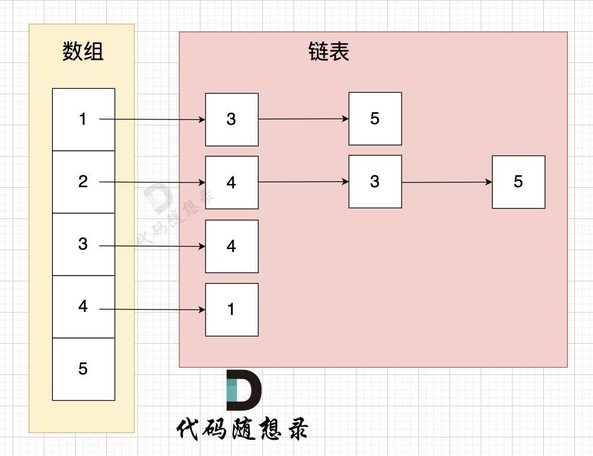

这里表达的图是：

- 节点 1 指向 节点 3 和 节点 5
- 节点 2 指向 节点 4、节点 3、节点 5
- 节点 3 指向 节点 4
- 节点 4 指向节点 1

邻接表的优点：

- 对于稀疏图的存储，只需要存储边，空间利用率高
- 遍历节点连接情况相对容易

缺点：

- 检查任意两个节点间是否存在边，效率相对低，需要 O(V)时间，V 表示某节点连接其他节点的数量。
- 实现相对复杂，不易理解

## 图的遍历方式

图的遍历方式基本是两大类：

- 深度优先搜索（dfs）
- 广度优先搜索（bfs）

## DFS 基础知识

DFS 关键就两点：

- 搜索方向，是认准一个方向搜，直到碰壁之后再换方向
- 换方向是撤销原路径，改为节点链接的下一个路径，回溯的过程。

## 代码框架

正是因为 dfs 搜索可一个方向，并需要回溯，所以用递归的方式来实现是最方便的。

```cpp
void dfs(参数) {
    处理节点
    dfs(图，选择的节点); // 递归
    回溯，撤销处理结果
}
```

## 98. 所有可达路径

[卡码网题目链接（ACM 模式）](https://kamacoder.com/problempage.php?pid=1170)

【题目描述】

给定一个有 n 个节点的有向无环图，节点编号从 1 到 n。请编写一个函数，找出并返回所有从节点 1 到节点 n 的路径。每条路径应以节点编号的列表形式表示。

【输入描述】

第一行包含两个整数 N，M，表示图中拥有 N 个节点，M 条边

后续 M 行，每行包含两个整数 s 和 t，表示图中的 s 节点与 t 节点中有一条路径

【输出描述】

输出所有的可达路径，路径中所有节点的后面跟一个空格，每条路径独占一行，存在多条路径，路径输出的顺序可任意。

如果不存在任何一条路径，则输出 -1。

```java
// 邻接矩阵
import java.util.*;

public class Main{
    static List<Integer> path = new ArrayList<>();
    static List<List<Integer>> result = new ArrayList<>();
    public static void main(String[] args){
        Scanner in = new Scanner(System.in);
        int N = in.nextInt(); // 节点
        int M = in.nextInt(); // 边
        int[][] graph = new int[N+1][N+1];
        for(int i = 0; i < M; i++){
            int s = in.nextInt();
            int t = in.nextInt();
            graph[s][t] = 1;
        }
        path.add(1);
        dfs(graph, 1, N);
        if(result.size() == 0) System.out.println(-1);
        else{
            for(List<Integer> p : result){
                for(int i = 0; i < p.size()-1; i++){
                    System.out.print(p.get(i) + " ");
                }
                System.out.println(p.get(p.size()-1));
            }
        }
        in.close();
    }
    private static void dfs(int[][] graph, int x, int n){
        if(x == n){
            result.add(new ArrayList<>(path));
            return;
        }
        for(int i = 1; i <= n; i++){
            if(graph[x][i] == 1){
                path.add(i);
                dfs(graph, i, n);
                path.remove(path.size()-1);
            }
        }
    }
}
```

```java
// 邻接表
import java.util.*;

public class Main{
    static List<Integer> path = new ArrayList<>();
    static List<List<Integer>> result = new ArrayList<>();
    public static void main(String[] args){
        Scanner in = new Scanner(System.in);
        int N = in.nextInt(); // 节点
        int M = in.nextInt(); // 边
        List<LinkedList<Integer>> graph = new ArrayList<>(N+1);
        for(int i = 0; i <= N; i++){
            graph.add(new LinkedList<>());
        }
        for(int i = 0; i < M; i++){
            int s = in.nextInt();
            int t = in.nextInt();
            graph.get(s).add(t);
        }
        path.add(1);
        dfs(graph, 1, N);
        if(result.size() == 0) System.out.println(-1);
        else{
            for(List<Integer> p : result){
                for(int i = 0; i < p.size()-1; i++){
                    System.out.print(p.get(i) + " ");
                }
                System.out.println(p.get(p.size()-1));
            }
        }
        in.close();
    }
    private static void dfs(List<LinkedList<Integer>> graph, int x, int n){
        if(x == n){
            result.add(new ArrayList<>(path));
            return;
        }
        for(int i : graph.get(x)){
            path.add(i);
            dfs(graph, i, n);
            path.remove(path.size()-1);
        }
    }
}
```

## BSF 基础知识

广搜的搜索方式就适合于解决两个点之间的最短路径问题。

因为广搜是从起点出发，以起始点为中心一圈一圈进行搜索，一旦遇到终点，记录之前走过的节点就是一条最短路。

## 99. 岛屿数量

[卡码网题目链接（ACM 模式）](https://kamacoder.com/problempage.php?pid=1171)

题目描述：

给定一个由 1（陆地）和 0（水）组成的矩阵，你需要计算岛屿的数量。岛屿由水平方向或垂直方向上相邻的陆地连接而成，并且四周都是水域。你可以假设矩阵外均被水包围。

```java
// DFS
import java.util.*;

public class Main{
    public static int[][] dir = {{1,0},{-1,0},{0,1},{0,-1}};
    public static void main(String[] args) {
        Scanner in = new Scanner(System.in);
        int N = in.nextInt();
        int M = in.nextInt();
        int[][] arr = new int[N][M];
        for(int i = 0; i < N; i++){
            for(int j = 0; j < M; j++){
                arr[i][j] = in.nextInt();
            }
        }

        in.close();
        int count = 0;
        boolean[][] visited = new boolean[N][M];
        for(int i = 0; i < N; i++){
            for(int j = 0; j < M; j++){
                if(!visited[i][j] && arr[i][j] == 1){
                    count++;
                    visited[i][j] = true;
                    dfs(visited, i, j, arr);
                }
            }
        }

        System.out.println(count);
    }


    public static void dfs(boolean[][] visited, int x, int y, int[][] arr){
        for(int k = 0; k < 4; k++){
            int next_x = x + dir[k][0];
            int next_y = y + dir[k][1];
            if(next_x < 0 || next_x >= arr.length || next_y < 0 || next_y >= arr[0].length)
                continue;
            if(!visited[next_x][next_y] && arr[next_x][next_y] == 1){
                visited[next_x][next_y] = true;
                dfs(visited, next_x, next_y, arr);
            }

        }
    }
}

```

```java
// BFS
import java.util.*;

public class Main{
    public static int[][] dir = {{1,0},{-1,0},{0,1},{0,-1}};
    public static void main(String[] args) {
        Scanner in = new Scanner(System.in);
        int N = in.nextInt();
        int M = in.nextInt();
        int[][] arr = new int[N][M];
        for(int i = 0; i < N; i++){
            for(int j = 0; j < M; j++){
                arr[i][j] = in.nextInt();
            }
        }

        in.close();
        int count = 0;
        boolean[][] visited = new boolean[N][M];
        for(int i = 0; i < N; i++){
            for(int j = 0; j < M; j++){
                if(!visited[i][j] && arr[i][j] == 1){
                    count++;
                    bfs(visited, i, j, arr);
                }
            }
        }

        System.out.println(count);
    }


    public static void bfs(boolean[][] visited, int x, int y, int[][] arr){
        Queue<int[]> queue = new LinkedList<>();
        queue.add(new int[]{x,y});
        visited[x][y] = true;


        while(!queue.isEmpty()){
            int cur_x = queue.peek()[0];
            int cur_y = queue.poll()[1];
            for(int k = 0; k < 4; k++){
                int next_x = cur_x + dir[k][0];
                int next_y = cur_y + dir[k][1];
                if(next_x < 0 || next_x >= arr.length || next_y < 0 || next_y >= arr[0].length)
                    continue;
                if(!visited[next_x][next_y] && arr[next_x][next_y] == 1){
                    queue.add(new int[]{next_x,next_y});
                    visited[next_x][next_y] = true;
                }
            }
        }
    }
}

```

## 01. 孤岛的总面积

[卡码网：101. 孤岛的总面积](https://kamacoder.com/problempage.php?pid=1173)

题目描述

给定一个由 1（陆地）和 0（水）组成的矩阵，岛屿指的是由水平或垂直方向上相邻的陆地单元格组成的区域，且完全被水域单元格包围。孤岛是那些位于矩阵内部、所有单元格都不接触边缘的岛屿。

现在你需要计算所有孤岛的总面积，岛屿面积的计算方式为组成岛屿的陆地的总数。

输入描述

第一行包含两个整数 N, M，表示矩阵的行数和列数。之后 N 行，每行包含 M 个数字，数字为 1 或者 0。

输出描述

输出一个整数，表示所有孤岛的总面积，如果不存在孤岛，则输出 0。

解答：

```java
// DFS
import java.util.*;

public class Main{
    public static int[][] dir = {{1,0},{-1,0},{0,1},{0,-1}};
    public static int count = 0;
    public static void main(String[] args) {
        Scanner in = new Scanner(System.in);
        int N = in.nextInt();
        int M = in.nextInt();
        int[][] arr = new int[N][M];
        for(int i = 0; i < N; i++){
            for(int j = 0; j < M; j++){
                arr[i][j] = in.nextInt();
            }
        }

        in.close();

        // 从左边界和右边界向中间遍历
        for(int i = 0; i < N; i++){
            if(arr[i][0] == 1) dfs(i, 0, arr);
            if(arr[i][M-1] == 1) dfs(i, M-1, arr);
        }

        // 从上边界和下边界向中间遍历
        for(int j = 0; j < M; j++){ // 遍历上侧和下侧边界
            if(arr[0][j] == 1) dfs(0, j, arr);
            if(arr[N-1][j] == 1) dfs(N-1, j, arr);
        }

        count = 0;

        for(int i = 0; i < N; i++){
            for(int j = 0; j < M; j++){
                if(arr[i][j] == 1) dfs(i, j, arr);
            }
        }

        System.out.println(count);
    }


    public static void dfs(int x, int y, int[][] arr){
        arr[x][y] = 0;
        count++;

        for(int i = 0; i < 4; i++){
            int newX = x + dir[i][0];
            int newY = y + dir[i][1];

            if(newX < 0 || newX >= arr.length || newY < 0 || newY >= arr[0].length)
                continue;

            if(arr[newX][newY] == 1){
                dfs(newX, newY, arr);
            }
        }
    }
}

```

```java
// BFS
import java.util.*;

public class Main{
    public static int[][] dir = {{1,0},{-1,0},{0,1},{0,-1}};
    public static int count = 0;
    public static void main(String[] args) {
        Scanner in = new Scanner(System.in);
        int N = in.nextInt();
        int M = in.nextInt();
        int[][] arr = new int[N][M];
        for(int i = 0; i < N; i++){
            for(int j = 0; j < M; j++){
                arr[i][j] = in.nextInt();
            }
        }

        in.close();
        for(int i = 0; i < N; i++){ // 遍历左侧和右侧边界
            if(arr[i][0] == 1) bfs(i, 0, arr);
            if(arr[i][M-1] == 1) bfs(i, M-1, arr);
        }

        for(int j = 0; j < M; j++){ // 遍历上侧和下侧边界
            if(arr[0][j] == 1) bfs(0, j, arr);
            if(arr[N-1][j] == 1) bfs(N-1, j, arr);
        }

        count = 0;
        for(int i = 0; i < N; i++){
            for(int j = 0; j < M; j++){
                if(arr[i][j] == 1) bfs(i, j, arr);
            }
        }

        System.out.println(count);
    }


    public static void bfs(int x, int y, int[][] arr){
        Queue<int[]> queue = new LinkedList<>();
        count++;
        queue.add(new int[]{x,y});
        arr[x][y] = 0;


        while(!queue.isEmpty()){
            int cur_x = queue.peek()[0];
            int cur_y = queue.poll()[1];
            for(int k = 0; k < 4; k++){
                int next_x = cur_x + dir[k][0];
                int next_y = cur_y + dir[k][1];
                if(next_x < 0 || next_x >= arr.length || next_y < 0 || next_y >= arr[0].length)
                    continue;
                if(arr[next_x][next_y] == 1){
                    count++;
                    queue.add(new int[]{next_x,next_y});
                    arr[next_x][next_y] = 0;
                }
            }
        }
    }
}

```

## 102. 沉没孤岛

[卡码网题目链接（ACM 模式）](https://kamacoder.com/problempage.php?pid=1174)

题目描述：

给定一个由 1（陆地）和 0（水）组成的矩阵，岛屿指的是由水平或垂直方向上相邻的陆地单元格组成的区域，且完全被水域单元格包围。孤岛是那些位于矩阵内部、所有单元格都不接触边缘的岛屿。

现在你需要将所有孤岛“沉没”，即将孤岛中的所有陆地单元格（1）转变为水域单元格（0）。

输入描述：

第一行包含两个整数 N, M，表示矩阵的行数和列数。

之后 N 行，每行包含 M 个数字，数字为 1 或者 0，表示岛屿的单元格。

解答：

#### DFS

```java
import java.util.Scanner;

public class Main{
    public static int[][] dir = {{1,0},{-1,0},{0,1},{0,-1}};
    public static void main(String[] args){
        Scanner scanner = new Scanner(System.in);
        int N = scanner.nextInt();
        int M = scanner.nextInt();
        int[][] grid = new int[N][M];
        for (int i = 0; i < N; i++){
            for (int j = 0; j < M; j++){
                grid[i][j] = scanner.nextInt();
            }
        }


        for (int i = 0; i < N; i++){
            if(grid[i][0] == 1) dfs(grid, i, 0);
            if(grid[i][M-1] == 1) dfs(grid, i, M-1);
        }

        for (int j = 0; j < M; j++){
            if(grid[0][j] == 1) dfs(grid, 0, j);
            if(grid[N-1][j] == 1) dfs(grid, N-1, j);
        }

        for (int i = 0; i < N; i++){
            for (int j = 0; j < M; j++){
                if(grid[i][j] == 1) grid[i][j] = 0;
                else if(grid[i][j] == 2) grid[i][j] = 1;
            }
        }

        for (int i = 0; i < N; i++){
            for (int j = 0; j < M; j++){
                System.out.print(grid[i][j] + " ");
            }
            System.out.println();
        }

        scanner.close();

    }

    private static void dfs(int[][] grid, int x, int y){

        grid[x][y] = 2;

        for(int i = 0; i < 4; i++){
            int next_x = x + dir[i][0];
            int next_y = y + dir[i][1];
            if(next_x >= 0 && next_x < grid.length && next_y >= 0 && next_y < grid[0].length && grid[next_x][next_y] == 1){
                dfs(grid, next_x, next_y);
            }
        }
    }
}
```

## 103. 水流问题

[卡码网题目链接（ACM 模式）](https://kamacoder.com/problempage.php?pid=1175)

题目描述：

现有一个 N × M 的矩阵，每个单元格包含一个数值，这个数值代表该位置的相对高度。矩阵的左边界和上边界被认为是第一组边界，而矩阵的右边界和下边界被视为第二组边界。

矩阵模拟了一个地形，当雨水落在上面时，水会根据地形的倾斜向低处流动，但只能从较高或等高的地点流向较低或等高并且相邻（上下左右方向）的地点。我们的目标是确定那些单元格，从这些单元格出发的水可以达到第一组边界和第二组边界。

解答：

```java
//DFS
import java.util.Scanner;

public class Main{
    public static int[][] dir = {{1,0},{-1,0},{0,1},{0,-1}};
    public static void main(String[] args){
        Scanner scanner = new Scanner(System.in);
        int N = scanner.nextInt();
        int M = scanner.nextInt();
        int[][] grid = new int[N][M];
        for (int i = 0; i < N; i++){
            for (int j = 0; j < M; j++){
                grid[i][j] = scanner.nextInt();
            }
        }
        boolean[][] visited_second = new boolean[N][M];
        boolean[][] visited_first = new boolean[N][M];


        for (int i = 0; i < N; i++){
            dfs(grid, i, 0, visited_first, Integer.MIN_VALUE);
            dfs(grid, i, M-1, visited_second, Integer.MIN_VALUE);
        }

        for(int j = 0; j < M; j++){
            dfs(grid, N-1, j, visited_second, Integer.MIN_VALUE);
            dfs(grid, 0, j, visited_first, Integer.MIN_VALUE);
        }

        for (int i = 0; i < N; i++){
            for (int j = 0; j < M; j++){
                if(visited_second[i][j] && visited_first[i][j]){
                    System.out.println(i + " " + j);
                }
            }
        }

        scanner.close();

    }

    private static void dfs(int[][] grid, int x, int y, boolean[][] visited, int preH){
        if(x < 0 || x >= grid.length || y < 0 || y >= grid[0].length || visited[x][y]) return;

        if(grid[x][y] < preH) return;

        visited[x][y] = true;

        for(int i = 0; i < 4; i++){
            int next_x = x + dir[i][0];
            int next_y = y + dir[i][1];
            dfs(grid, next_x, next_y, visited, grid[x][y]);
        }
    }
}
```

## 104.建造最大岛屿

[卡码网题目链接（ACM 模式）](https://kamacoder.com/problempage.php?pid=1176)

题目描述：

给定一个由 1（陆地）和 0（水）组成的矩阵，你最多可以将矩阵中的一格水变为一块陆地，在执行了此操作之后，矩阵中最大的岛屿面积是多少。

岛屿面积的计算方式为组成岛屿的陆地的总数。岛屿是被水包围，并且通过水平方向或垂直方向上相邻的陆地连接而成的。你可以假设矩阵外均被水包围。

解答：

```java
//DFS
import java.util.Scanner;

public class Main{
    public static int[][] dir = {{1,0},{-1,0},{0,1},{0,-1}};
    public static int res = 0;
    public static int cnt = 0;
    public static void main(String[] args){
        Scanner scanner = new Scanner(System.in);
        int N = scanner.nextInt();
        int M = scanner.nextInt();
        int[][] grid = new int[N][M];
        for (int i = 0; i < N; i++){
            for (int j = 0; j < M; j++){
                grid[i][j] = scanner.nextInt();
            }
        }


        for (int i = 0; i < N; i++){
            for (int j = 0; j < M; j++){
                if(grid[i][j] == 0){
                    boolean[][] visited = new boolean[N][M];
                    grid[i][j] = 1;
                    dfs(grid, i, j, visited);
                    if(cnt > res) res = cnt;
                    cnt = 0;
                    grid[i][j] = 0;
                }
            }
        }

        System.out.println(res == 0 ? N*M : res);

        scanner.close();

    }

    private static void dfs(int[][] grid, int x, int y, boolean[][] visited){
        if(grid[x][y] == 0 || visited[x][y]) return;

        visited[x][y] = true;
        cnt++;

        for(int i = 0; i < 4; i++){
            int next_x = x + dir[i][0];
            int next_y = y + dir[i][1];
            if(next_x < 0 || next_x >= grid.length || next_y < 0 || next_y >= grid[0].length) continue;

            dfs(grid, next_x, next_y, visited);
        }
    }
}
```

## 110. 字符串接龙

[卡码网题目链接（ACM 模式）](https://kamacoder.com/problempage.php?pid=1183)

题目描述

字典 strList 中从字符串 beginStr 和 endStr 的转换序列是一个按下述规格形成的序列：

1. 序列中第一个字符串是 beginStr。
2. 序列中最后一个字符串是 endStr。
3. 每次转换只能改变一个字符。
4. 转换过程中的中间字符串必须是字典 strList 中的字符串。

给你两个字符串 beginStr 和 endStr 和一个字典 strList，找到从 beginStr 到 endStr 的最短转换序列中的字符串数目。如果不存在这样的转换序列，返回 0。

解答：

```java
//DFS
import java.util.*;

public class Main{
    public static void main(String[] args){
        Scanner scanner = new Scanner(System.in);
        int n = scanner.nextInt();
        scanner.nextLine();
        String beginStr = scanner.next();
        String endStr = scanner.next();
        scanner.nextLine();

        List<String> Str = new ArrayList<>();
        Str.add(beginStr);
        Str.add(endStr);
        for(int i = 0; i < n; i++){
            Str.add(scanner.nextLine());
        }
        int cnt = dfs(Str, beginStr, endStr);

        System.out.println(cnt);

        scanner.close();

    }

    private static int dfs(List<String> Str, String beginStr, String endStr){
        int len = 1;
        Set<String> visited = new HashSet<>();
        Set<String> set = new HashSet<>(Str);
        Queue<String> queue = new LinkedList<>();
        visited.add(beginStr);
        queue.add(beginStr);
        queue.add(null);
        while(!queue.isEmpty()){
            String curStr = queue.remove();

            if(curStr == null){
                if(!queue.isEmpty()){
                    len++;
                    queue.add(null);
                }
                continue;
            }

            char[] ss = curStr.toCharArray();
            for(int i = 0; i < ss.length; i++){

                char old = ss[i];
                for(char j = 'a'; j <= 'z'; j++){
                    ss[i] = j;
                    String newStr = new String(ss);
                    if(set.contains(newStr) && !visited.contains(newStr)){
                        queue.add(newStr);
                        visited.add(newStr);
                        if(newStr.equals(endStr)){
                            return len+1;
                        }
                    }
                }
                ss[i] = old;
            }
        }
        return 0;
    }

}
```

## 105.有向图的完全可达性

[卡码网题目链接（ACM 模式）](https://kamacoder.com/problempage.php?pid=1177)

【题目描述】

给定一个有向图，包含 N 个节点，节点编号分别为 1，2，...，N。现从 1 号节点开始，如果可以从 1 号节点的边可以到达任何节点，则输出 1，否则输出 -1。

解答：

```java
import java.util.*;

public class Main{
    public static void main(String[] args){
        Scanner scanner = new Scanner(System.in);
        List<List<Integer>> dir = new ArrayList<>();
        int points = scanner.nextInt();
        int edges = scanner.nextInt();
        for(int i = 0; i < points; i++){
            dir.add(new ArrayList<>());
        }
        for(int i = 0; i < edges; i++){
            int a = scanner.nextInt();
            int b = scanner.nextInt();
            dir.get(a-1).add(b-1);
        }
        boolean[] visited = new boolean[points];
        // dfs(dir, visited, 0);
        bfs(dir, visited, 0);
        for(int i = 0; i < visited.length; i++){
            if(!visited[i]){
                System.out.println(-1);
                return;
            }
        }
        System.out.println(1);

        scanner.close();
    }

    private static void dfs(List<List<Integer>> dir, boolean[] visited, int start){
        if(visited[start]) return;
        visited[start] = true;
        for(int i : dir.get(start)){
            dfs(dir, visited, i);
        }

    }

    private static void bfs(List<List<Integer>> dir, boolean[] visited, int start){
        Deque<Integer> dequeue = new LinkedList<>();
        dequeue.offer(start);
        visited[start] = true;
        while(!dequeue.isEmpty()){
            int cur = dequeue.pollLast();
            for(int i : dir.get(cur)){
                if(!visited[i]){
                    dequeue.offer(i);
                    visited[i] = true;
                }
            }
        }
    }

}
```

## 106. 岛屿的周长

[卡码网题目链接（ACM 模式）](https://kamacoder.com/problempage.php?pid=1178)

题目描述

给定一个由 1（陆地）和 0（水）组成的矩阵，岛屿是被水包围，并且通过水平方向或垂直方向上相邻的陆地连接而成的。

你可以假设矩阵外均被水包围。在矩阵中恰好拥有一个岛屿，假设组成岛屿的陆地边长都为 1，请计算岛屿的周长。岛屿内部没有水域。

解答：

```java
import java.util.*;

public class Main{
    public static void main(String[] args){
        Scanner scanner = new Scanner(System.in);
        int M = scanner.nextInt();
        int N = scanner.nextInt();
        int[][] grid = new int[M][N];
        for(int i = 0; i < M; i++){
            for(int j = 0; j < N; j++){
                grid[i][j] = scanner.nextInt();
            }
        }
        int[][] dir = {{-1,0},{0,1},{1,0},{0,-1}};
        int count = 0;
        for(int i = 0; i < M; i++){
            for(int j = 0; j < N; j++){
                for(int k = 0; k < 4; k++){
                    if(grid[i][j] == 1){
                        int next_x = i + dir[k][0];
                        int next_y = j + dir[k][1];
                        if(next_x < 0 || next_x >= M || next_y < 0 || next_y >= N || grid[next_x][next_y] == 0){
                            count++;
                        }
                    }

                }
            }
        }

        System.out.println(count);
        scanner.close();
    }
}

```

## 并查集理论基础

并查集常用来解决连通性问题，也就是当我们需要判断两个元素是否在同一个集合里的时候，我们就要想到用并查集。

并查集主要有两个功能：

- 将两个元素添加到一个集合中
- 判断两个元素在不在同一个集合

### 原理

- 如何将两个元素添加到同一个集合中？

  可以用有向连通图,只需要用一个一维数组来表示，即：father[A] = B，father[B] = C，此时 A 和 B 有同一个根 C

#### 路径压缩

在实现 find 函数的过程中，通过递归的方式，不断获取 father 数组下标对应的数值，最终找到这个集合的根。

搜索过程像是一个多叉树中从叶子到根节点的过程，如图：

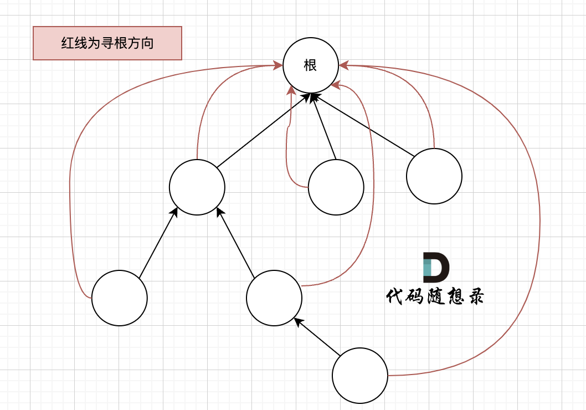

如果这棵多叉树高度很深的话，每次 find 函数 去寻找根的过程就要递归很多次。

我们的目的只需要知道这些节点在同一个根下就可以，所以对这棵多叉树的构造只需要这样就可以了，如图：

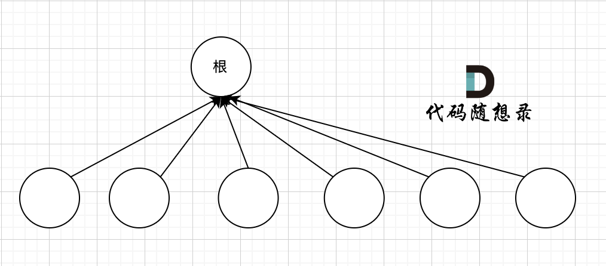

除了根节点其他所有节点都挂载根节点下，这样我们在寻根的时候就很快，只需要一步，如果我们想达到这样的效果，就需要 **路径压缩**，将非根节点的所有节点直接指向根节点,只需要在递归的过程中，让 father[u] 接住 递归函数 find(father[u]) 的返回结果。

##### 代码模板

```cpp
int n = 1005; // n根据题目中节点数量而定，一般比节点数量大一点就好
vector<int> father = vector<int> (n, 0); // C++里的一种数组结构

// 并查集初始化
void init() {
    for (int i = 0; i < n; ++i) {
        father[i] = i;
    }
}
// 并查集里寻根的过程
int find(int u) {
    return u == father[u] ? u : father[u] = find(father[u]); // 路径压缩
}

// 判断 u 和 v是否找到同一个根
bool isSame(int u, int v) {
    u = find(u);
    v = find(v);
    return u == v;
}

// 将v->u 这条边加入并查集
void join(int u, int v) {
    u = find(u); // 寻找u的根
    v = find(v); // 寻找v的根
    if (u == v) return ; // 如果发现根相同，则说明在一个集合，不用两个节点相连直接返回
    father[v] = u;
}
```

#### 按秩（rank）合并

rank 表示树的高度，即树中结点层次的最大值。

例如两个集合（多叉树）需要合并，如图所示：

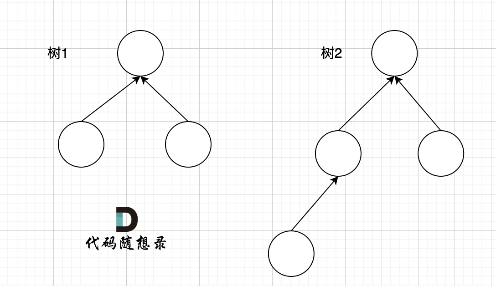

树 1 rank 为 2，树 2 rank 为 3，在 join 函数中，一定是 rank 小的树合入到 rank 大的树，这样可以保证最后合成的树 rank 最小，降低在树上查询的路径长度。

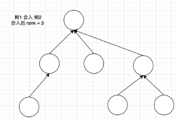

按秩合并的代码如下：

```cpp
int n = 1005; // n根据题目中节点数量而定，一般比节点数量大一点就好
vector<int> father = vector<int> (n, 0); // C++里的一种数组结构
vector<int> rank = vector<int> (n, 1); // 初始每棵树的高度都为1

// 并查集初始化
void init() {
    for (int i = 0; i < n; ++i) {
        father[i] = i;
        rank[i] = 1; // 也可以不写
    }
}
// 并查集里寻根的过程
int find(int u) {
    return u == father[u] ? u : find(father[u]);// 注意这里不做路径压缩
}

// 判断 u 和 v是否找到同一个根
bool isSame(int u, int v) {
    u = find(u);
    v = find(v);
    return u == v;
}

// 将v->u 这条边加入并查集
void join(int u, int v) {
    u = find(u); // 寻找u的根
    v = find(v); // 寻找v的根

    if (rank[u] <= rank[v]) father[u] = v; // rank小的树合入到rank大的树
    else father[v] = u;

    if (rank[u] == rank[v] && u != v) rank[v]++; // 如果两棵树高度相同，则v的高度+1，因为上面 if (rank[u] <= rank[v]) father[u] = v; 注意是 <=
}
```

按秩合并的思路并没有将树形结构尽可能的扁平化，所以在整理效率上是没有路径压缩高的，**直接使用路径压缩的并查集模板就好**。

### 复杂度分析

对路径压缩版并查集来做分析。

- 空间复杂度： O(n) ，申请一个 father 数组。

- 时间复杂度：如果想精确表达出来需要繁琐的数学证明，这里做一个简单的分析思路。

  路径压缩后的并查集时间复杂度在 O(logn)与 O(1)之间，且随着查询或者合并操作的增加，时间复杂度会越来越趋于 O(1)，在第一次查询的时候，相当于是 n 叉树上从叶子节点到根节点的查询过程，时间复杂度是 logn，但路径压缩后，后面的查询操作都是 O(1)，而 join 函数 和 isSame 函数 里涉及的查询操作也是一样的过程。

### 题目

#### 107. 寻找存在的路径

[卡码网题目链接（ACM 模式）](https://kamacoder.com/problempage.php?pid=1179)

题目描述

给定一个包含 n 个节点的无向图中，节点编号从 1 到 n （含 1 和 n ）。

你的任务是判断是否有一条从节点 source 出发到节点 destination 的路径存在。

解答：

```java
import java.util.*;

public class Main{
    public static void main(String[] args){
        Scanner scanner = new Scanner(System.in);
        int points = scanner.nextInt();
        int edges = scanner.nextInt();
        Disjoint disjoint = new Disjoint(points+1);
        for(int i = 0; i < edges; i++){
            disjoint.join(scanner.nextInt(), scanner.nextInt());

        }

        if(disjoint.isSame(scanner.nextInt(), scanner.nextInt())){
            System.out.println(1);
        }
        else{
            System.out.println(0);
        }

        scanner.close();
    }
}

class Disjoint{
    private int[] father;

    public Disjoint(int n){
        father = new int[n];
        for(int i = 0; i < n; i++){
            father[i] = i;
        }
    }

    public int find(int x){
        return father[x] == x ? x : find(father[x]);
    }

    public void join(int x, int y){ // x -> y
        int fx = find(x);
        int fy = find(y);
        father[fx] = fy;
    }

    public boolean isSame(int x, int y){
        return find(x) == find(y);
    }
}

```

#### 108. 冗余连接

[卡码网题目链接（ACM 模式）](https://kamacoder.com/problempage.php?pid=1181)

题目描述

有一个图，它是一棵树，他是拥有 n 个节点（节点编号 1 到 n）和 n - 1 条边的连通无环无向图（其实就是一个线形图），如图：

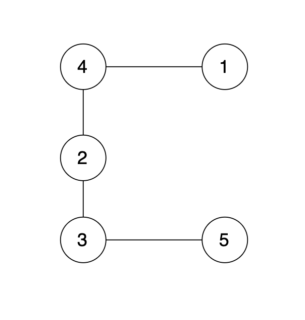

现在在这棵树上的基础上，添加一条边（依然是 n 个节点，但有 n 条边），使这个图变成了有环图，如图

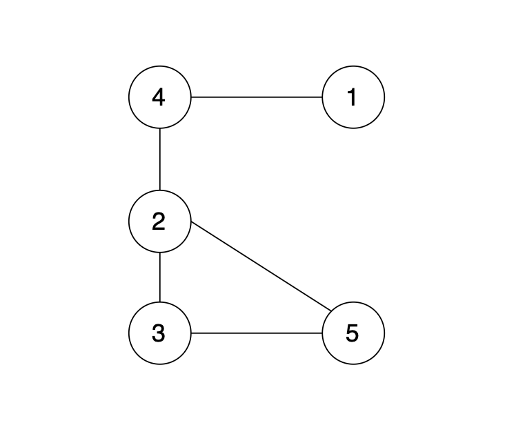

先请你找出冗余边，删除后，使该图可以重新变成一棵树。

解答：

```java
import java.util.*;

public class Main{
    public static void main(String[] args){
        Scanner scanner = new Scanner(System.in);
        int n = scanner.nextInt();
        Disjoint disjoint = new Disjoint(n+1);
        int[] last = new int[2];
        int[] res = new int[2];

        for(int i = 0; i < n; i++){
            last[0] = scanner.nextInt();
            last[1] = scanner.nextInt();

            if(disjoint.isSame(last[0], last[1])){
                res[0] = last[0];
                res[1] = last[1];
            }
            else{
                disjoint.join(last[0], last[1]);
            }
        }
        System.out.println(res[0] + " " + res[1]);

        scanner.close();
    }
}

class Disjoint{
    private int[] father;

    public Disjoint(int n){
        father = new int[n];
        for(int i = 0; i < n; i++){
            father[i] = i;
        }
    }

    public int find(int x){
        return father[x] == x ? x : find(father[x]);
    }

    public void join(int x, int y){ // x -> y
        int fx = find(x);
        int fy = find(y);
        father[fx] = fy;
    }

    public boolean isSame(int x, int y){
        return find(x) == find(y);
    }
}

```

#### 109. 冗余连接 II

[卡码网题目链接（ACM 模式）](https://kamacoder.com/problempage.php?pid=1182)

题目描述

有一种有向树,该树只有一个根节点，所有其他节点都是该根节点的后继。该树除了根节点之外的每一个节点都有且只有一个父节点，而根节点没有父节点。有向树拥有 n 个节点和 n - 1 条边。如图：

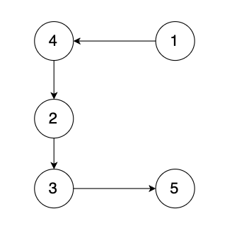

现在有一个有向图，有向图是在有向树中的两个没有直接链接的节点中间添加一条有向边。如图：

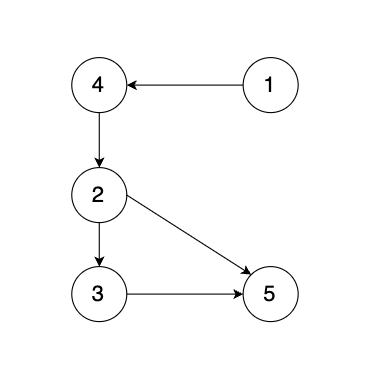

解答：

```java
import java.util.*;

class Disjoint{
    private int[] father;

    public Disjoint(int n){
        father = new int[n];
        for(int i = 0; i < n; i++){
            father[i] = i;
        }
    }
    public int find(int x){
        return father[x] == x ? x : find(father[x]);
    }

    public void join(int x, int y){ // x -> y
        int fx = find(x);
        int fy = find(y);
        father[fx] = fy;
    }

    public boolean isSame(int x, int y){
        return find(x) == find(y);
    }
}

class Edge{
    int start;
    int end;

    public Edge(int start, int end){
        this.start = start;
        this.end = end;
    }
}

class Node{
    int val;
    int in;
    int out;

}


public class Main{
    public static void main(String[] args){
        Scanner scanner = new Scanner(System.in);
        int n = scanner.nextInt();
        Disjoint disjoint = new Disjoint(n+1);
        List<Edge> edges = new ArrayList<>();
        Node[] nodes = new Node[n+1];
        for(int i = 1; i <= n; i++){
            nodes[i] = new Node();
        }

        Integer doubleIn = null;
        for(int i = 0; i < n; i++){
            int s = scanner.nextInt();
            int t = scanner.nextInt();

            edges.add(new Edge(s, t));
            nodes[t].in++;
            if(nodes[t].in >= 2) doubleIn = t;

        }

        Edge res = null;
        if(doubleIn != null){
            List<Edge> doubleInEdges = new ArrayList<>();
            for(Edge edge : edges){
                if(edge.end == doubleIn){
                    doubleInEdges.add(edge);
                }

                if(doubleInEdges.size() == 2) break;
            }

            Edge edge = doubleInEdges.get(1);
            if(isTreeWithExclude(edges, edge, nodes)) res = edge;
            else res = doubleInEdges.get(0);

        }
        else{
            res = RemoveEdge(edges, nodes);
        }


        System.out.println(res.start + " " + res.end);

        scanner.close();
    }
    private static boolean isTreeWithExclude(List<Edge> edges, Edge excludedEdge, Node[] nodes){
        Disjoint disjoint = new Disjoint(nodes.length);
        for(Edge edge : edges){
            if(edge == excludedEdge) continue;

            if(disjoint.isSame(edge.start, edge.end)){
                return false;
            }
            disjoint.join(edge.start, edge.end);
        }

        return true;
    }

    private static Edge RemoveEdge(List<Edge> edges, Node[] nodes){
        Disjoint disjoint = new Disjoint(nodes.length);
        for(Edge edge : edges){
            if(disjoint.isSame(edge.start, edge.end)) return edge;

            disjoint.join(edge.start, edge.end);
        }
        return null;
    }
}


```

## 最小生成树

### prim 算法

最小生成树是所有节点的最小连通子图，即：以最小的成本（边的权值）将图中所有节点链接到一起。

prim 算法是从节点的角度采用贪心的策略每次寻找距离最小生成树最近的节点并加入到最小生成树中。

prim 算法核心就是三步：

1. 选距离生成树最近节点
2. 最近节点加入生成树
3. 更新非生成树节点到生成树的距离（即更新 minDist 数组）

### kruskal 算法

prim 算法是**维护节点**的集合，而 Kruskal 是**维护边**的集合

kruscal 的思路：

- 边的权值排序，因为要优先选最小的边加入到生成树里
- 遍历排序后的边
  - 如果边首尾的两个节点在同一个集合，说明如果连上这条边图中会出现环
  - 如果边首尾的两个节点不在同一个集合，加入到最小生成树，并把两个节点加入同一个集合

在节点数量固定的情况下，图中的边越少，Kruskal 需要遍历的边也就越少。而 prim 算法是对节点进行操作的，节点数量越少，prim 算法效率就越优。

所以在 稀疏图中，用 Kruskal 更优。 在稠密图中，用 prim 算法更优。

> 边数量较少为稀疏图，接近或等于完全图（所有节点皆相连）为稠密图

Prim 算法 时间复杂度为 O(n^2)，其中 n 为节点数量，它的运行效率和图中边树无关，适用稠密图。Kruskal 算法 时间复杂度 为 nlogn，其中 n 为边的数量，适用稀疏图。

### 题目

[卡码网：53. 寻宝](https://kamacoder.com/problempage.php?pid=1053)

题目描述：

在世界的某个区域，有一些分散的神秘岛屿，每个岛屿上都有一种珍稀的资源或者宝藏。国王打算在这些岛屿上建公路，方便运输。

不同岛屿之间，路途距离不同，国王希望你可以规划建公路的方案，如何可以以最短的总公路距离将所有岛屿联通起来。

给定一张地图，其中包括了所有的岛屿，以及它们之间的距离。以最小化公路建设长度，确保可以链接到所有岛屿。

解答：

```java
// prim算法
import java.util.*;

public class Main{
    public static void main(String[] args){
        Scanner scanner = new Scanner(System.in);
        int N = scanner.nextInt();
        int E = scanner.nextInt();

        int[][] edges = new int[N+1][N+1];
        for(int i = 1; i <= N; i++){
            Arrays.fill(edges[i], 10001); // 将所有边权初始化为10001，表示不存在的边
        }

        for(int i = 0; i < E; i++){
            int s = scanner.nextInt();
            int t = scanner.nextInt();
            int w = scanner.nextInt();

            edges[s][t] = w;
            edges[t][s] = w;

        }

        int[] minDist = new int[N+1];
        Arrays.fill(minDist, 10001);

        boolean[] isIntree = new boolean[N+1];


        // prim算法-主循环
        for(int i = 1; i < N; i++){
            int cur = -1;
            int min = Integer.MAX_VALUE;

            for(int j = 1; j <= N; j++){ // 寻找未加入树的节点中距离最近的节点
                if(!isIntree[j] && minDist[j] < min){
                    cur = j;
                    min = minDist[j];
                }
            }

            isIntree[cur] = true;
            for(int j = 1; j <= N; j++){ // 更新各个节点距离生成树的最小距离
                if(!isIntree[j] && edges[cur][j] < minDist[j]){
                    minDist[j] = edges[cur][j];
                }
            }
        }

        int res = 0;
        for(int i = 2; i <= N; i++){
            res += minDist[i];
        }

        System.out.println(res);

        scanner.close();
    }
}
```

```java
// kruskal算法
import java.util.*;

class Edge{
    int start;
    int end;
    int weight;

    public Edge(int start, int end, int weight){
        this.start = start;
        this.end = end;
        this.weight = weight;
    }
}

class DisjointSet{
    private int[] father; // 记录各个节点的父节点

    public DisjointSet(int n){
        father = new int[n];
        for(int i = 0; i < n; i++){
            father[i] = i;
        }
    }

    public int find(int x){
        return x == father[x]? x : (father[x] = find(father[x]));
    }

    public void join(int x, int y){
        father[find(x)] = find(y);
    }

    public boolean isSameSet(int x, int y){
        return find(x) == find(y);
    }
}


public class Main{

    public static void main(String[] args){
        Scanner scanner = new Scanner(System.in);

        int N = scanner.nextInt();
        int E = scanner.nextInt();
        DisjointSet disjointSet = new DisjointSet(N+1);

        List<Edge> edges = new ArrayList<>();

        for(int i = 0; i < E; i++){
            int start = scanner.nextInt();
            int end = scanner.nextInt();
            int weight = scanner.nextInt();
            edges.add(new Edge(start, end, weight));
        }

        edges.sort(Comparator.comparingInt(a -> a.weight)); // 按权重排序

        int res = 0;
        for(Edge edge : edges){ //kruskal算法
            if(!disjointSet.isSameSet(edge.start, edge.end)){
                res += edge.weight;
                disjointSet.join(edge.start, edge.end);
            }
        }

        System.out.println(res);

        scanner.close();
    }
}
```

## 拓扑排序精讲

给出一个 有向图，把这个有向图转成线性的排序 就叫拓扑排序。拓扑排序也要检测这个有向图 是否有环，即存在循环依赖的情况，因为这种情况是不能做线性排序的。

其实只要能在把 有向无环图 进行线性排序 的算法 都可以叫做 拓扑排序。

实现拓扑排序的算法有两种：**卡恩算法**（BFS）和 DFS

### 题目

[卡码网：117. 软件构建](https://kamacoder.com/problempage.php?pid=1191)

题目描述：

某个大型软件项目的构建系统拥有 N 个文件，文件编号从 0 到 N - 1，在这些文件中，某些文件依赖于其他文件的内容，这意味着如果文件 A 依赖于文件 B，则必须在处理文件 A 之前处理文件 B （0 <= A, B <= N - 1）。请编写一个算法，用于确定文件处理的顺序。

解答：

```java
import java.util.*;

public class Main{

    public static void main(String[] args){
        Scanner scanner = new Scanner(System.in);

        int N = scanner.nextInt();
        int E = scanner.nextInt();
        List<List<Integer>> graph = new ArrayList<>();
        int[] inDegree = new int[N]; //记录每个节点的入度
        List<Integer> res = new ArrayList<>();

        for(int i = 0; i < N; i++){
            graph.add(new ArrayList<>());
        }

        for(int i = 0; i < E; i++){
            int start = scanner.nextInt();
            int end = scanner.nextInt();
            inDegree[end]++;
            graph.get(start).add(end);
        }

        Deque<Integer> deque = new LinkedList<>();
        for(int i = 0; i < N; i++){
            if(inDegree[i] == 0){
                deque.offer(i);
            }
        }

        while(!deque.isEmpty()){
            int cur = deque.poll();
            res.add(cur);

            for(int next : graph.get(cur)){
                inDegree[next]--;
                if(inDegree[next] == 0){
                    deque.offer(next);
                }
            }
        }

        if(res.size() != N){ //有环
            System.out.println(-1);
        }
        else{
            for(int i = 0; i < N; i++){
                if(i == N - 1){
                    System.out.print(res.get(i));
                }
                else System.out.print(res.get(i) + " ");

            }
        }

        scanner.close();
    }
}
```

## dijkstra

dijkstra 算法：在有权图（权值非负数）中求从起点到其他节点的最短路径算法。

对于负权值的出现，针对某一个场景不断去修改 dijkstra 的代码，**但最终会发现只是 拆了东墙补西墙**，对 dijkstra 的补充逻辑只能满足某特定场景最短路求解。

dijkstra 算法的注意点：

- dijkstra 算法可以同时求起点到所有节点的最短路径
- 权值不能为负数

dijkstra 算法的步骤：

1. 选择离源点近且未被访问过的节点
2. 将该节点标记为已访问
3. 更新未访问节点到源点的距离（即更新 minDist 数组）

prim 和 dijkstra 很类似，但是 dijkstra 算法的实现更加复杂。**prim 是求非访问节点到最小生成树的最小距离，而 dijkstra 是求非访问节点到源点的最小距离**。

### 题目

[卡码网：47. 参加科学大会](https://kamacoder.com/problempage.php?pid=1047)

【题目描述】

小明是一位科学家，他需要参加一场重要的国际科学大会，以展示自己的最新研究成果。

小明的起点是第一个车站，终点是最后一个车站。然而，途中的各个车站之间的道路状况、交通拥堵程度以及可能的自然因素（如天气变化）等不同，这些因素都会影响每条路径的通行时间。

小明希望能选择一条花费时间最少的路线，以确保他能够尽快到达目的地。

解答：

```java
//朴素版
import java.util.*;

public class Main{

    public static void main(String[] args){
        Scanner scanner = new Scanner(System.in);

        int N = scanner.nextInt();
        int M = scanner.nextInt();

        int[][] graph = new int[N+1][N+1];
        for(int i = 1; i <= N; i++) Arrays.fill(graph[i], Integer.MAX_VALUE);

        for(int i = 0; i < M; i++){
            int s = scanner.nextInt();
            int t = scanner.nextInt();
            int val = scanner.nextInt();
            graph[s][t] = val;
        }

        int start = 1;
        int end = N;

        int[] minDist = new int[N+1];
        Arrays.fill(minDist, Integer.MAX_VALUE);
        minDist[start] = 0;

        boolean[] visited = new boolean[N+1];
        for(int i = 1; i <= N; i++){
            int min = Integer.MAX_VALUE;
            int cur = -1;

            for(int j = 1; j <= N; j++){
                if(!visited[j] && minDist[j] < min){
                    min = minDist[j];
                    cur = j;
                }
            }

            if(cur == -1) break;
            visited[cur] = true;

            for(int j = 1; j <= N; j++){
                if(!visited[j] && graph[cur][j] != Integer.MAX_VALUE && graph[cur][j] + minDist[cur] < minDist[j]){ //非访问节点是因为路径为正，所以可以直接排除
                    minDist[j] = graph[cur][j] + minDist[cur];
                }
            }
        }

        if(minDist[end] == Integer.MAX_VALUE) System.out.println(-1);
        else System.out.println(minDist[end]);
        scanner.close();

    }
}
```

```java
// 堆优化版，自动排序（PriorityQueue）
import java.util.*;

class Edge{
    int to;
    int val;
    public Edge(int to, int val){
        this.to = to;
        this.val = val;
    }
}

class Pair<U, V>{
    public final U first;
    public final V second;
    public Pair(U first, V second){
        this.first = first;
        this.second = second;
    }
}

class MyComparator implements Comparator<Pair<Integer, Integer>>{
    @Override
    public int compare(Pair<Integer, Integer> a, Pair<Integer, Integer> b){
        return Integer.compare(a.second, b.second);
    }
}


public class Main{

    public static void main(String[] args){
        Scanner scanner = new Scanner(System.in);

        int N = scanner.nextInt();
        int M = scanner.nextInt();

        List<List<Edge>> graph = new ArrayList<>();
        for(int i = 0; i < N+1; i++) graph.add(new ArrayList<>());

        for(int i = 0; i < M; i++){
            int s = scanner.nextInt();
            int t = scanner.nextInt();
            int val = scanner.nextInt();
            graph.get(s).add(new Edge(t, val));
        }


        int start = 1;
        int end = N;
        int[] minDist = new int[N+1];
        Arrays.fill(minDist, Integer.MAX_VALUE);
        minDist[start] = 0;

        boolean[] visited = new boolean[N+1];

        PriorityQueue<Pair<Integer, Integer>> pq = new PriorityQueue<>(new MyComparator());

        pq.offer(new Pair<>(start, 0));

        while(!pq.isEmpty()){
            Pair<Integer, Integer> curr = pq.poll();

            if(visited[curr.first]) continue;

            visited[curr.first] = true; // 确定了该点w

            for(Edge e : graph.get(curr.first)){
                if(!visited[e.to] && minDist[e.to] > minDist[curr.first] + e.val){
                    minDist[e.to] = minDist[curr.first] + e.val;
                    pq.offer(new Pair<>(e.to, minDist[e.to]));
                }
            }

        }

        if(minDist[end] == Integer.MAX_VALUE) System.out.println(-1);
        else System.out.println(minDist[end]);

        scanner.close();
    }
}
```

## Bellman_ford 算法

在求单源最短路的方法中，使用 dijkstra 的话，则要求图中边的权值都为正数。

带**负权值**的单源最短路问题，此时就轮到 Bellman_ford 登场了

Bellman_ford 算法的核心思想是**对所有边进行松弛 n-1 次操作**（n 为节点数量），从而求得目标最短路。

**Bellman_ford 队列优化算法**

只需要对 上一次松弛的时候更新过的节点作为出发节点所连接的边 进行松弛就够了。

### 题目

[卡码网：94. 城市间货物运输 I](https://kamacoder.com/problempage.php?pid=1152)

题目描述

某国为促进城市间经济交流，决定对货物运输提供补贴。共有 n 个编号为 1 到 n 的城市，通过道路网络连接，网络中的道路仅允许从某个城市单向通行到另一个城市，不能反向通行。

网络中的道路都有各自的运输成本和政府补贴，道路的权值计算方式为：运输成本 - 政府补贴。

权值为正表示扣除了政府补贴后运输货物仍需支付的费用；权值为负则表示政府的补贴超过了支出的运输成本，实际表现为运输过程中还能赚取一定的收益。

请找出从城市 1 到城市 n 的所有可能路径中，综合政府补贴后的最低运输成本。

如果最低运输成本是一个负数，它表示在遵循最优路径的情况下，运输过程中反而能够实现盈利。

城市 1 到城市 n 之间可能会出现没有路径的情况，同时保证道路网络中不存在任何负权回路。

> 负权回路是指一系列道路的总权值为负，这样的回路使得通过反复经过回路中的道路，理论上可以无限地减少总成本或无限地增加总收益。

```java
import java.util.*;

class Edge{
    int from;
    int to;
    int val;
    public Edge(int from, int to, int val){
        this.from = from;
        this.to = to;
        this.val = val;
    }
}


public class Main{

    public static void main(String[] args){
        Scanner scanner = new Scanner(System.in);

        int N = scanner.nextInt();
        int M = scanner.nextInt();

        List<Edge> graph = new ArrayList<>();

        for(int i = 0; i < M; i++){
            int s = scanner.nextInt();
            int t = scanner.nextInt();
            int val = scanner.nextInt();
            graph.add(new Edge(s, t, val));
        }

        int[] minDist = new int[N+1];
        Arrays.fill(minDist, Integer.MAX_VALUE);
        minDist[1] = 0;

        for(int i = 1; i < N; i++){ // 松弛(N-1)次

            for(Edge edge : graph){
                if(minDist[edge.from] != Integer.MAX_VALUE)
                    minDist[edge.to] = Math.min(minDist[edge.to], minDist[edge.from] + edge.val);
            }
        }

        if(minDist[N] == Integer.MAX_VALUE)
            System.out.println("unconnected");
        else
            System.out.println(minDist[N]);

        scanner.close();

    }
}
```

```java
//Bellman_ford 队列优化算法
import java.util.*;

class Edge{
    int from;
    int to;
    int val;
    public Edge(int from, int to, int val){
        this.from = from;
        this.to = to;
        this.val = val;
    }
}

public class Main{

    public static void main(String[] args){
        Scanner scanner = new Scanner(System.in);

        int N = scanner.nextInt();
        int M = scanner.nextInt();

        List<List<Edge>> graph = new ArrayList<>();
        for(int i = 0; i <= N; i++) graph.add(new ArrayList<>());

        for(int i = 0; i < M; i++){
            int s = scanner.nextInt();
            int t = scanner.nextInt();
            int val = scanner.nextInt();
            graph.get(s).add(new Edge(s, t, val));
        }

        int[] minDist = new int[N+1];
        Arrays.fill(minDist, Integer.MAX_VALUE);
        minDist[1] = 0;

        Deque<Integer> deque = new LinkedList<>();

        deque.offer(1);

        boolean[] isInQueue = new boolean[N+1];
        isInQueue[1] = true;

        // SPFA算法核心：只对上一次松弛的时候更新过的节点关联的边进行松弛操作
        while(!deque.isEmpty()){

            int cur = deque.poll();
            isInQueue[cur] = false;

            for(Edge edge : graph.get(cur)){
                if(minDist[edge.to] > (minDist[cur] + edge.val)){
                    minDist[edge.to] = minDist[cur] + edge.val;
                    if(!isInQueue[edge.to]){
                        deque.offer(edge.to);
                        isInQueue[edge.to] = true;
                    }
                }
            }
        }

        if(minDist[N] == Integer.MAX_VALUE)
            System.out.println("unconnected");
        else
            System.out.println(minDist[N]);

        scanner.close();

    }
}

```

## Bellman_ford 之判断负权回路

[卡码网：95. 城市间货物运输 II](https://kamacoder.com/problempage.php?pid=1153)

【题目描述】

某国为促进城市间经济交流，决定对货物运输提供补贴。共有 n 个编号为 1 到 n 的城市，通过道路网络连接，网络中的道路仅允许从某个城市单向通行到另一个城市，不能反向通行。

网络中的道路都有各自的运输成本和政府补贴，道路的权值计算方式为：运输成本 - 政府补贴。权值为正表示扣除了政府补贴后运输货物仍需支付的费用；

权值为负则表示政府的补贴超过了支出的运输成本，实际表现为运输过程中还能赚取一定的收益。

然而，在评估从城市 1 到城市 n 的所有可能路径中综合政府补贴后的最低运输成本时，存在一种情况：**图中可能出现负权回路**。

负权回路是指一系列道路的总权值为负，这样的回路使得通过反复经过回路中的道路，理论上可以无限地减少总成本或无限地增加总收益。

为了避免货物运输商采用负权回路这种情况无限的赚取政府补贴，算法还需检测这种特殊情况。

请找出从城市 1 到城市 n 的所有可能路径中，综合政府补贴后的最低运输成本。同时能够检测并适当处理负权回路的存在。

城市 1 到城市 n 之间可能会出现没有路径的情况

解答

```java
// Bellman-Ford方法
import java.util.*;

class Edge{
    int from;
    int to;
    int val;
    public Edge(int from, int to, int val){
        this.from = from;
        this.to = to;
        this.val = val;
    }
}

public class Main{

    public static void main(String[] args){
        Scanner scanner = new Scanner(System.in);

        int N = scanner.nextInt();
        int M = scanner.nextInt();

        List<Edge> graph = new ArrayList<>();

        for(int i = 0; i < M; i++){
            int s = scanner.nextInt();
            int t = scanner.nextInt();
            int val = scanner.nextInt();
            graph.add(new Edge(s, t, val));
        }

        int[] minDist = new int[N+1];
        Arrays.fill(minDist, Integer.MAX_VALUE);
        minDist[1] = 0;

        boolean flag = false;

        for(int i = 1; i <= N; i++){ //增加一次松弛操作
            for(Edge e : graph){
                if(i < N){
                    if(minDist[e.from] != Integer.MAX_VALUE && minDist[e.from] + e.val < minDist[e.to]){
                        minDist[e.to] = minDist[e.from] + e.val;
                    }
                }
                else{ //如果加一次松弛操作后，minDist[N]变化，说明有环
                    if(minDist[e.from] != Integer.MAX_VALUE && minDist[e.from] + e.val < minDist[e.to]){
                        flag = true;
                    }
                }
            }
        }

        if(flag) System.out.println("circle");
        else if(minDist[N] == Integer.MAX_VALUE)
            System.out.println("unconnected");
        else
            System.out.println(minDist[N]);

        scanner.close();

    }
}
```

```java
// SPFA方法求解
import java.util.*;

class Edge{
    int from;
    int to;
    int val;
    public Edge(int from, int to, int val){
        this.from = from;
        this.to = to;
        this.val = val;
    }
}

public class Main{

    public static void main(String[] args){
        Scanner scanner = new Scanner(System.in);

        int N = scanner.nextInt();
        int M = scanner.nextInt();

        List<List<Edge>> graph = new ArrayList<>();
        for(int i = 0; i <= N; i++) graph.add(new ArrayList<>());

        for(int i = 0; i < M; i++){
            int s = scanner.nextInt();
            int t = scanner.nextInt();
            int val = scanner.nextInt();
            graph.get(s).add(new Edge(s, t, val));
        }

        int[] minDist = new int[N+1];
        Arrays.fill(minDist, Integer.MAX_VALUE);
        minDist[1] = 0;

        Deque<Integer> deque = new LinkedList<>();

        deque.offer(1);

        boolean[] isInQueue = new boolean[N+1];
        isInQueue[1] = true;

        boolean flag = false;
        int[] cnt = new int[N+1];
        cnt[1]++;
        while(!deque.isEmpty()){

            int cur = deque.poll();
            isInQueue[cur] = false;

            for(Edge edge : graph.get(cur)){
                if(minDist[edge.to] > (minDist[cur] + edge.val)){
                    minDist[edge.to] = minDist[cur] + edge.val;
                    if(!isInQueue[edge.to]){
                        deque.offer(edge.to);
                        isInQueue[edge.to] = true;
                        cnt[edge.to]++;

                        if(cnt[edge.to] == N){ // 正情况下，加入队列的节点数不会超过N，但当加入到队列的节点等于N时，说明找到了环
                            flag = true;
                            while(!deque.isEmpty()) deque.poll();
                            break;
                        }
                    }
                }
            }
        }

        if(flag) System.out.println("circle");
        else if(minDist[N] == Integer.MAX_VALUE)
            System.out.println("unconnected");
        else
            System.out.println(minDist[N]);

        scanner.close();

    }
}
```

## bellman_ford 之单源有限最短路

[卡码网：96. 城市间货物运输 III](https://kamacoder.com/problempage.php?pid=1154)

【题目描述】

某国为促进城市间经济交流，决定对货物运输提供补贴。共有 n 个编号为 1 到 n 的城市，通过道路网络连接，网络中的道路仅允许从某个城市单向通行到另一个城市，不能反向通行。

网络中的道路都有各自的运输成本和政府补贴，道路的权值计算方式为：运输成本 - 政府补贴。

权值为正表示扣除了政府补贴后运输货物仍需支付的费用；

权值为负则表示政府的补贴超过了支出的运输成本，实际表现为运输过程中还能赚取一定的收益。

请计算在最多经过 k 个城市的条件下，从城市 src 到城市 dst 的最低运输成本。

解答：

```java
//bellman_ford一般方法
import java.util.*;

class Edge{
    int from;
    int to;
    int val;
    public Edge(int from, int to, int val){
        this.from = from;
        this.to = to;
        this.val = val;
    }
}

public class Main{
    public static void main(String[] args){
        Scanner scanner = new Scanner(System.in);

        int N = scanner.nextInt();
        int M = scanner.nextInt();

        List<Edge> graph = new ArrayList<>();

        for(int i = 0; i < M; i++){
            int s = scanner.nextInt();
            int t = scanner.nextInt();
            int val = scanner.nextInt();
            graph.add(new Edge(s, t, val));
        }
        int start = scanner.nextInt();
        int end = scanner.nextInt();
        int constraint = scanner.nextInt();

        int[] minDist = new int[N+1];
        Arrays.fill(minDist, Integer.MAX_VALUE);
        minDist[start] = 0;

        int[] minDist_copy = new int[N+1];

        for(int i = 0; i < constraint+1; i++){
            minDist_copy = Arrays.copyOf(minDist, N+1);
            for(Edge e : graph){
                if(minDist_copy[e.from] != Integer.MAX_VALUE && minDist_copy[e.from] + e.val < minDist[e.to]){
                    minDist[e.to] = minDist_copy[e.from] + e.val;
                }
            }
        }

        if(minDist[end] == Integer.MAX_VALUE)
            System.out.println("unreachable");
        else
            System.out.println(minDist[end]);

        scanner.close();
    }
}
```

```java
// SPFA算法
import java.util.*;

class Edge{
    int from;
    int to;
    int val;

    public Edge(){

    }

    public Edge(int to, int val){
        this.to = to;
        this.val = val;
    }

    public Edge(int from, int to, int val){
        this.from = from;
        this.to = to;
        this.val = val;
    }
}

public class Main{
    public static void main(String[] args){
        Scanner scanner = new Scanner(System.in);

        int N = scanner.nextInt();
        int M = scanner.nextInt();

        List<List<Edge>> graph = new ArrayList<>();

        for(int i = 0; i <= N; i++) graph.add(new ArrayList<>());

        for(int i = 0; i < M; i++){
            int s = scanner.nextInt();
            int t = scanner.nextInt();
            int val = scanner.nextInt();
            graph.get(s).add(new Edge(t, val));
        }

        int start = scanner.nextInt();
        int end = scanner.nextInt();
        int constraint = scanner.nextInt();


        int[] minDist = spfa(graph, N, start, constraint);

        if(minDist[end] == Integer.MAX_VALUE)
            System.out.println("unreachable");
        else
            System.out.println(minDist[end]);

        scanner.close();
    }

    public static int[] spfa(List<List<Edge>> graph, int N, int start, int constraint){
        int[] minDist = new int[N+1];
        Arrays.fill(minDist, Integer.MAX_VALUE);
        minDist[start] = 0;

        Queue<Integer> queue = new LinkedList<>();
        queue.offer(start);
        int[] minDist_copy = new int[N+1];

        while(constraint + 1 > 0 && !queue.isEmpty()){ // 限定松弛 constraint+1 次
            int cursize = queue.size();

            while(cursize-- > 0){

                int cur = queue.poll();

                minDist_copy = minDist.clone();

                for(Edge edge : graph.get(cur)){
                    if(minDist[edge.to] > minDist_copy[cur] + edge.val){
                        minDist[edge.to] = minDist_copy[cur] + edge.val;
                        if(!queue.contains(edge.to) && graph.get(edge.to).size() > 0){
                            queue.offer(edge.to);
                        }
                    }
                }
            }
            constraint--;

        }
        return minDist;
    }
}
```

## 多源 BFS

### [1162. 地图分析](https://leetcode.cn/problems/as-far-from-land-as-possible/)

你现在手里有一份大小为 `n x n` 的 网格 `grid`，上面的每个 单元格 都用 `0` 和 `1` 标记好了。其中 `0` 代表海洋，`1` 代表陆地。

请你找出一个海洋单元格，这个海洋单元格到离它最近的陆地单元格的距离是最大的，并返回该距离。如果网格上只有陆地或者海洋，请返回 `-1`。

我们这里说的距离是「曼哈顿距离」（ Manhattan Distance）：`(x0, y0)` 和 `(x1, y1)` 这两个单元格之间的距离是 `|x0 - x1| + |y0 - y1|` 。

解答：

```java
// 单源BFS 时间复杂度:O(n^4)，空间复杂度:O(n^2)，超时
class Solution {
    int[][] grid;
    int n;
    int[][] dir = new int[][]{{0,1},{0,-1},{1,0},{-1,0}};
    public int maxDistance(int[][] _grid) {
        grid = _grid;
        n = grid.length;

        int res = -1;

        for(int i = 0; i < n; i++){
            for(int j = 0; j < n; j++){
                if(grid[i][j] == 0){
                    res = Math.max(res, bfs(i, j));
                }

            }
        }
        return res;
    }

    public int bfs(int i, int j){
        Map<Integer, Integer> map = new HashMap<>();
        Deque<int[]> deque = new ArrayDeque<>();

        deque.offer(new int[]{i,j});

        while(!deque.isEmpty()){
            int[] cur = deque.poll();
            int x = cur[0];
            int y = cur[1];

            int step = map.getOrDefault(x * n + y, 0);

            if(grid[x][y] == 1) return step;

            for(int[] d : dir){
                int next_x = x + d[0];
                int next_y = y + d[1];

                if(next_x >= 0 && next_x < n && next_y >= 0 && next_y < n){
                    int key = next_x * n + next_y;
                    if(!map.containsKey(key)) map.put(key, step + 1);
                    deque.offer(new int[]{next_x, next_y});
                }
            }
        }
        return -1;
    }
}

// 将多源BFS转为单源BFS，优化时间复杂度：O(n^2) ,并且这个海洋肯定是被离他最近的陆地给扩散到的！
class Solution {
    int[][] dir = new int[][]{{0,1},{0,-1},{1,0},{-1,0}};
    public int maxDistance(int[][] grid) {
        int n = grid.length;
        Map<Integer, Integer> map = new HashMap<>();
        Deque<int[]> deque = new ArrayDeque<>();

        int res = -1;

        for(int i = 0; i < n; i++){
            for(int j = 0; j < n; j++){
                if(grid[i][j] == 1){
                    deque.offer(new int[]{i,j});
                }
            }
        }

        while(!deque.isEmpty()){
            int[] cur = deque.poll();
            int x = cur[0];
            int y = cur[1];

            int step = map.getOrDefault(x * n + y, 0);

            for(int[] d : dir){
                int next_x = x + d[0];
                int next_y = y + d[1];

                if(next_x >= 0 && next_x < n && next_y >= 0 && next_y < n && grid[next_x][next_y] == 0){
                    int key = next_x * n + next_y;
                    grid[next_x][next_y] = 1;
                    if(!map.containsKey(key)) map.put(key, step + 1);
                    deque.offer(new int[]{next_x, next_y});
                    res = Math.max(res, step + 1);
                }
            }
        }
        return res;
    }
}

```

### [1765. 地图中的最高点](https://leetcode.cn/problems/map-of-highest-peak/)

给你一个大小为 `m x n` 的整数矩阵 `isWater` ，它代表了一个由 **陆地** 和 **水域** 单元格组成的地图。

- 如果 `isWater[i][j] == 0` ，格子 `(i, j)` 是一个 **陆地** 格子。
- 如果 `isWater[i][j] == 1` ，格子 `(i, j)` 是一个 **水域** 格子。

你需要按照如下规则给每个单元格安排高度：

- 每个格子的高度都必须是非负的。
- 如果一个格子是 **水域** ，那么它的高度必须为 `0` 。
- 任意相邻的格子高度差 **至多** 为 `1` 。当两个格子在正东、南、西、北方向上相互紧挨着，就称它们为相邻的格子。（也就是说它们有一条公共边）

找到一种安排高度的方案，使得矩阵中的最高高度值 **最大** 。

请你返回一个大小为 `m x n` 的整数矩阵 `height` ，其中 `height[i][j]` 是格子 `(i, j)` 的高度。如果有多种解法，请返回 **任意一个** 。

解答：

```java
class Solution {

    public int[][] dir = {{1,0},{-1,0},{0,1},{0,-1}};
    public int[][] highestPeak(int[][] isWater) {
        if(isWater == null) return null;
        int m = isWater.length, n = isWater[0].length;
        int[][] res = new int[m][n];

        Deque<int[]> deque = new LinkedList<>();

        for(int i = 0; i < m; i++){
            for(int j = 0; j < n; j++){
                if(isWater[i][j] == 1){
                    deque.offer(new int[]{i,j});
                }
            }
        }

        while(!deque.isEmpty()){
            int[] cur = deque.poll();
            int x = cur[0], y = cur[1];

            for(int[] d : dir){
                int next_x = x + d[0], next_y = y + d[1];
                if(next_x >= 0 && next_x < m && next_y >= 0 && next_y < n && isWater[next_x][next_y] == 0){
                    isWater[next_x][next_y] = 1;
                    res[next_x][next_y] = res[x][y] + 1;
                    deque.offer(new int[]{next_x, next_y});
                }
            }
        }

        return res;
    }
}

```

## Floyd 算法

**Floyd 算法对边的权值正负没有要求，都可以处理**。

Floyd 算法核心思想是动态规划。

这里分两种情况：

1. 节点 i 到 节点 j 的最短路径经过节点 k

   `grid[i][j][k] = grid[i][k][k - 1] + grid[k][j][k - 1]`

2. 节点 i 到 节点 j 的最短路径不经过节点 k

   `grid[i][j][k] = grid[i][j][k - 1]`

求最短路，自然就是取两种情况的最小值。

### 题目

[卡码网：97. 小明逛公园](https://kamacoder.com/problempage.php?pid=1155)

【题目描述】

小明喜欢去公园散步，公园内布置了许多的景点，相互之间通过小路连接，小明希望在观看景点的同时，能够节省体力，走最短的路径。

给定一个公园景点图，图中有 N 个景点（编号为 1 到 N），以及 M 条双向道路连接着这些景点。每条道路上行走的距离都是已知的。

小明有 Q 个观景计划，每个计划都有一个起点 start 和一个终点 end，表示他想从景点 start 前往景点 end。由于小明希望节省体力，他想知道每个观景计划中从起点到终点的最短路径长度。 请你帮助小明计算出每个观景计划的最短路径长度。

解答：

```java
//dijkstra
import java.util.*;

public class Main{
    public static void main(String[] args){
        Scanner scanner = new Scanner(System.in);

        int N = scanner.nextInt();
        int M = scanner.nextInt();

        int[][] graph = new int[N+1][N+1];
        for(int i = 1; i <= N; i++) Arrays.fill(graph[i], Integer.MAX_VALUE);

        for(int i = 0; i < M; i++){
            int s = scanner.nextInt();
            int t = scanner.nextInt();
            int val = scanner.nextInt();
            graph[s][t] = val;
            graph[t][s] = val;
        }

        int Q = scanner.nextInt();
        int[] start = new int[Q];
        int[] end = new int[Q];


        for(int i = 0; i < Q; i++){
            start[i] = scanner.nextInt();
            end[i] = scanner.nextInt();
        }

        for(int i = 0; i < Q; i++){

            int[] minDist = new int[N+1];
            Arrays.fill(minDist, Integer.MAX_VALUE);
            minDist[start[i]] = 0;
            boolean[] visited = new boolean[N+1];

            for(int k  = 1; k <= N; k++){
                int min_val = Integer.MAX_VALUE;
                int cur = 0;
                for(int j = 1; j <= N; j++){
                    if(!visited[j] && minDist[j] < min_val){
                        min_val = minDist[j];
                        cur = j;
                    }
                }
                visited[cur] = true;

                for(int j = 1; j <= N; j++){
                    if(!visited[j] && graph[cur][j] != Integer.MAX_VALUE && minDist[j] > minDist[cur] + graph[cur][j]){
                        minDist[j] = minDist[cur] + graph[cur][j];
                    }
                }
            }

            if(minDist[end[i]] == Integer.MAX_VALUE)
                System.out.println(-1);
            else
                System.out.println(minDist[end[i]]);
        }

        scanner.close();
    }
}

```

```java
// Floyd 算法
import java.util.*;

public class Main{
    public static void main(String[] args){
        Scanner scanner = new Scanner(System.in);

        int N = scanner.nextInt();
        int M = scanner.nextInt();

        int[][][] graph = new int[N+1][N+1][N+1];
        for(int i = 0; i <= N; i++){
            for(int j = 0; j <= N; j++){
                Arrays.fill(graph[i][j], Integer.MAX_VALUE);
            }

        }

        for(int i = 0; i < M; i++){
            int s = scanner.nextInt();
            int t = scanner.nextInt();
            int val = scanner.nextInt();
            graph[s][t][0] = val;
            graph[t][s][0] = val;
        }

        int Q = scanner.nextInt();
        int[] start = new int[Q];
        int[] end = new int[Q];


        for(int i = 0; i < Q; i++){
            start[i] = scanner.nextInt();
            end[i] = scanner.nextInt();
        }

        int[] res = new int[Q];

        for(int k = 1; k <= N; k++){ // 注意3层循环的顺序
            for(int i = 1; i <= N; i++){
                for(int j = 1; j <= N; j++){
                    if(graph[i][k][k-1] != Integer.MAX_VALUE && graph[k][j][k-1] != Integer.MAX_VALUE)
                        graph[i][j][k] = Math.min(graph[i][j][k-1], graph[i][k][k-1] + graph[k][j][k-1]);
                    else
                        graph[i][j][k] = graph[i][j][k-1];
                }
            }
        }

        for(int i = 0; i < Q; i++){
            if(graph[start[i]][end[i]][N] != Integer.MAX_VALUE)
                System.out.println(graph[start[i]][end[i]][N]);
            else
                System.out.println(-1);
        }
        scanner.close();
    }
}

```

## A \* 算法精讲 （A star 算法）

[卡码网：126. 骑士的攻击](https://kamacoder.com/problempage.php?pid=1203)

题目描述

在象棋中，马和象的移动规则分别是“马走日”和“象走田”。现给定骑士的起始坐标和目标坐标，要求根据骑士的移动规则，计算从起点到达目标点所需的最短步数。

骑士移动规则如图，红色是起始位置，黄色是骑士可以走的地方。

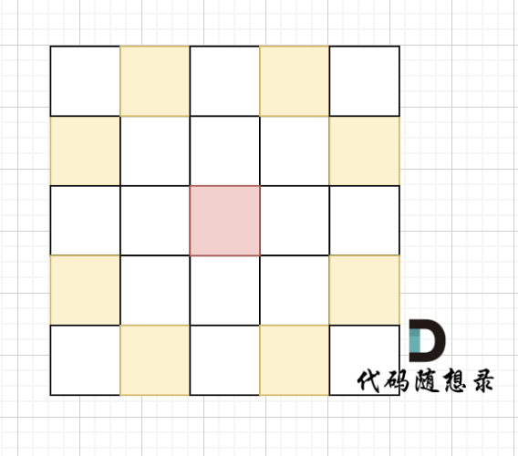

棋盘大小 1000 x 1000（棋盘的 x 和 y 坐标均在 [1, 1000] 区间内，包含边界）

解答：

```java
// astar PriorityQueue会超时
import java.util.*;

class Edge{
    int a1, a2, b1, b2;

    Edge(int a1, int a2, int b1, int b2){
        this.a1 = a1;
        this.a2 = a2;
        this.b1 = b1;
        this.b2 = b2;
    }
}

class Knight{
    int x, y, g, h; // g: 当前步数, h: 估计剩余步数
    Knight(int x, int y, int g, int h){
        this.x = x;
        this.y = y;
        this.g = g;
        this.h = h;
    }
}

class MyComparator implements Comparator<Knight>{
    @Override
    public int compare(Knight o1, Knight o2) {
        return Integer.compare(o1.g + o1.h, o2.g + o2.h);
    }

}

public class Main{
    public static int[][] dir = {{-2,-1},{-1,-2},{1,-2},{2,-1},{-2,1},{-1,2},{1,2},{2,1}};
    public static void main(String[] args){
        Scanner scanner = new Scanner(System.in);

        int N = scanner.nextInt();

        List<Edge> graph = new ArrayList<>();

        for(int i = 1; i <= N; i++){
            int a1 = scanner.nextInt();
            int a2 = scanner.nextInt();
            int b1 = scanner.nextInt();
            int b2 = scanner.nextInt();
            graph.add(new Edge(a1, a2, b1, b2));
        }

        for(Edge e : graph){
            astar(e);
        }

        scanner.close();
    }

    private static void astar(Edge e){

        PriorityQueue<Knight> pq = new PriorityQueue<>(new MyComparator());

        pq.offer(new Knight(e.a1, e.a2, 0, heuristic(e.a1, e.a2, e.b1, e.b2)));

        int[][] visited = new int[1001][1001];
        visited[e.a1][e.a2] = 1;

        while(!pq.isEmpty()){
            Knight cur = pq.poll();
            int curX = cur.x, curY = cur.y, curH = cur.h, curG = cur.g;

            if(curX == e.b1 && curY == e.b2){
                System.out.println(visited[curX][curY]-1);
                return;
            }

            for(int i = 0; i < 8; i++){
                int nextX = curX + dir[i][0];
                int nextY = curY + dir[i][1];
                if(nextX >= 1 && nextX <= 1000 && nextY >= 1 && nextY <= 1000 && visited[nextX][nextY] == 0){
                    pq.offer(new Knight(nextX, nextY, curG + 3, heuristic(nextX, nextY, e.b1, e.b2)));
                    visited[nextX][nextY] = visited[curX][curY] + 1;
                }

            }
        }
    }

    private static int heuristic(int x1, int y1, int x2, int y2) {
        return Math.abs(x1 - x2) + Math.abs(y1 - y2); // 曼哈顿距离作为 A* 估计函数
    }
}
```

```java
import java.util.*;

class Edge{
    int a1, a2, b1, b2;

    Edge(int a1, int a2, int b1, int b2){
        this.a1 = a1;
        this.a2 = a2;
        this.b1 = b1;
        this.b2 = b2;
    }
}

class Knight{
    int x, y, g, h; // g: 当前步数, h: 估计剩余步数
    Knight(int x, int y, int g, int h){
        this.x = x;
        this.y = y;
        this.g = g;
        this.h = h;
    }
}

class MyComparator implements Comparator<Knight>{
    @Override
    public int compare(Knight o1, Knight o2) {
        return ((o1.g + o1.h) - (o2.g + o2.h));
    }

}

public class Main{
    public static int[][] visited = new int[1001][1001];
    public static int[][] dir = {{-2,-1},{-1,-2},{1,-2},{2,-1},{-2,1},{-1,2},{1,2},{2,1}};
    public static void main(String[] args){
        Scanner scanner = new Scanner(System.in);

        int N = scanner.nextInt();

        List<Edge> graph = new ArrayList<>();

        for(int i = 1; i <= N; i++){
            int a1 = scanner.nextInt();
            int a2 = scanner.nextInt();
            int b1 = scanner.nextInt();
            int b2 = scanner.nextInt();
            graph.add(new Edge(a1, a2, b1, b2));
        }

        for(Edge e : graph){
            astar(e);
        }

        scanner.close();
    }

    private static void astar(Edge e){
        PriorityQueue<Knight> pq = new PriorityQueue<>(new MyComparator());
        pq.offer(new Knight(e.a1, e.a2, 0, heuristic(e.a1, e.a2, e.b1, e.b2)));
        for(int[] arr : visited) Arrays.fill(arr, 0);
        visited[e.a1][e.a2] = 1;

        while(!pq.isEmpty()){
            Knight cur = pq.poll();
            int curX = cur.x, curY = cur.y, curG = cur.g;

            if(curX == e.b1 && curY == e.b2){
                System.out.println(visited[curX][curY]-1);
                return;
            }

            for(int i = 0; i < 8; i++){
                int nextX = curX + dir[i][0];
                int nextY = curY + dir[i][1];
                if(nextX >= 1 && nextX <= 1000 && nextY >= 1 && nextY <= 1000 && visited[nextX][nextY] == 0){
                    pq.offer(new Knight(nextX, nextY, curG + 5, heuristic(nextX, nextY, e.b1, e.b2)));
                    visited[nextX][nextY] = visited[curX][curY] + 1;
                }

            }
        }
    }

    private static int heuristic(int x1, int y1, int x2, int y2) {
        return (x1 - x2)*(x1 - x2) + (y1 - y2)*(y1 - y2);
    }
}
```

## 总结

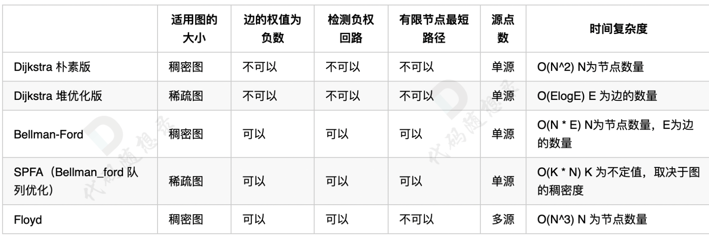

（因为 A \* 属于启发式搜索，和上面最短路算法并不是一类，不适合一起对比)

## 其他

### 841.钥匙和房间

[力扣题目链接](https://leetcode.cn/problems/keys-and-rooms/)

有 N 个房间，开始时你位于 0 号房间。每个房间有不同的号码：0，1，2，...，N-1，并且房间里可能有一些钥匙能使你进入下一个房间。

在形式上，对于每个房间 i 都有一个钥匙列表 rooms[i]，每个钥匙 rooms[i][j] 由 [0,1，...，N-1] 中的一个整数表示，其中 N = rooms.length。 钥匙 rooms[i][j] = v 可以打开编号为 v 的房间。

最初，除 0 号房间外的其余所有房间都被锁住。

你可以自由地在房间之间来回走动。

如果能进入每个房间返回 true，否则返回 false。

解答：

```java
// BFS solution
import java.util.Deque;
import java.util.LinkedList;
import java.util.List;

class Solution {
    public boolean canVisitAllRooms(List<List<Integer>> rooms) {
        if(rooms == null || rooms.size() == 0) return true;
        boolean[] visited = new boolean[rooms.size()];
        Deque<Integer> deque = new LinkedList<>();
        deque.offer(0);
        while(!deque.isEmpty()){
            int cur = deque.poll();
            if(!visited[cur]) {
                for(int n : rooms.get(cur)){
                    if(!visited[n]) deque.offer(n);
                }
                visited[cur] = true;
            }

        }
        for(boolean v : visited) if(!v) return false;
        return true;
    }
}

//DFS(更快)
import java.util.List;
// DFS solution
class Solution {
    public void dfs(List<List<Integer>> rooms, int cur, boolean[] visited){
        if(visited[cur]) return;
        visited[cur] = true;

        for(int i : rooms.get(cur)){
            dfs(rooms, i, visited);
        }
    }
    public boolean canVisitAllRooms(List<List<Integer>> rooms) {
        if(rooms == null || rooms.size() == 0) return true;
        boolean[] visited = new boolean[rooms.size()];

        dfs(rooms, 0, visited);

        for(boolean v : visited) if(!v) return false;
        return true;
    }
}
```

### 127. 单词接龙

[力扣题目链接](https://leetcode.cn/problems/word-ladder/)

字典 wordList 中从单词 beginWord 和 endWord 的 转换序列 是一个按下述规格形成的序列：

- 序列中第一个单词是 beginWord 。
- 序列中最后一个单词是 endWord 。
- 每次转换只能改变一个字母。
- 转换过程中的中间单词必须是字典 wordList 中的单词。
- 给你两个单词 beginWord 和 endWord 和一个字典 wordList ，找到从 beginWord 到 endWord 的 最短转换序列 中的 单词数目 。如果不存在这样的转换序列，返回 0。

解答：

```java
import java.util.Arrays;
import java.util.List;

class Solution {

    public int ladderLength(String beginWord, String endWord, List<String> wordList) {
        if(!wordList.contains(endWord)) return 0;
        int n = wordList.size();
        int[][] graph = new int[n+1][n+1];

        for(int i = 0; i < n; i++){
            for(int j = i+1; j < n; j++){
                if(isAdjacent(wordList.get(i), wordList.get(j))){
                    graph[i][j] = 1;
                    graph[j][i] = 1;
                }
            }
            if(isAdjacent(wordList.get(i), beginWord)){
                graph[i][n] = 1;
                graph[n][i] = 1;
            }
        }

        boolean[] visited = new boolean[n+1];
        int[] MinDist = new int[n+1];
        Arrays.fill(MinDist, Integer.MAX_VALUE);
        MinDist[n] = 1;
        for(int i = 0; i < n+1; i++){
            int min = Integer.MAX_VALUE;
            int cur = -1;
            for(int j = 0; j < n+1; j++){
                if(MinDist[j] < min && !visited[j]){
                    min = MinDist[j];
                    cur = j;
                }
            }
            if(cur == -1) break;
            visited[cur] = true;


            for(int j = 0; j < n+1; j++){
                if(graph[cur][j] == 1){
                    MinDist[j] = Math.min(min + 1, MinDist[j]);
                }
            }
        }

        for(int i = 0; i < n+1; i++){
            if(endWord.equals(wordList.get(i))) return MinDist[i] == Integer.MAX_VALUE ? 0 : MinDist[i];
        }
        return 0;
    }

    public boolean isAdjacent(String word1, String word2){
        if(word1.length() != word2.length()) return false;
        int cnt = 0;
        for(int i = 0; i < word1.length(); i++){
            if(word1.charAt(i)!= word2.charAt(i)){
                cnt++;
                if(cnt > 1) return false;
            }
        }
        return true;
    }
}
```

### 684.冗余连接

[力扣题目链接](https://leetcode.cn/problems/redundant-connection/)

树可以看成是一个连通且 无环 的 无向 图。

给定往一棵 n 个节点 (节点值 1 ～ n) 的树中添加一条边后的图。添加的边的两个顶点包含在 1 到 n 中间，且这条附加的边不属于树中已存在的边。图的信息记录于长度为 n 的二维数组 edges ，edges[i] = [ai, bi] 表示图中在 ai 和 bi 之间存在一条边。

请找出一条可以删去的边，删除后可使得剩余部分是一个有着 n 个节点的树。如果有多个答案，则返回数组 edges 中最后出现的边。

解答：

```java
//b
class Solution {
    private int[] father;
    private int n;
    public void init_disjoint_set(int n){
        father = new int[n+1];
        for(int i = 0; i < n; i++){
            father[i] = i;
        }
    }

    public void union(int x, int y) {
        int fx = find(x);
        int fy = find(y);
        if (fx != fy) {
            father[fx] = fy;
        }
    }

    private int find(int x) {
        if (father[x] == x) {
            return x;
        }
        father[x] = find(father[x]);
        return father[x];
    }

    private boolean isSame(int x, int y) {
        return find(x) == find(y);
    }

    public int[] findRedundantConnection(int[][] edges) {
        n = edges.length;
        init_disjoint_set(n);
        int[] res = new int[2];
        for(int[] edge : edges){
            if(isSame(edge[0], edge[1])) {
                res[0] = edge[0];
                res[1] = edge[1];
            }
            union(edge[0], edge[1]);
        }
        return res;
    }
}
```

### 685.冗余连接 II

[力扣题目链接](https://leetcode.cn/problems/redundant-connection-ii/)

在本问题中，有根树指满足以下条件的 有向 图。该树只有一个根节点，所有其他节点都是该根节点的后继。该树除了根节点之外的每一个节点都有且只有一个父节点，而根节点没有父节点。

输入一个有向图，该图由一个有着 n 个节点（节点值不重复，从 1 到 n）的树及一条附加的有向边构成。附加的边包含在 1 到 n 中的两个不同顶点间，这条附加的边不属于树中已存在的边。

结果图是一个以边组成的二维数组 edges 。 每个元素是一对 [ui, vi]，用以表示 有向 图中连接顶点 ui 和顶点 vi 的边，其中 ui 是 vi 的一个父节点。

返回一条能删除的边，使得剩下的图是有 n 个节点的有根树。若有多个答案，返回最后出现在给定二维数组的答案。

解答：

```java
class Solution {
    private int[] father;
    private int n;

    public void initDisJoint(int n){
        father = new int[n];
        for(int i = 0; i < n; i++){
            father[i] = i;
        }
    }

    public void union(int x, int y) {
        int fx = find(x);
        int fy = find(y);
        if (fx != fy) {
            father[fx] = fy;
        }
    }

    public int find(int x) {
        if (father[x] == x) {
            return x;
        }
        father[x] = find(father[x]);
        return father[x];
    }

    public boolean isSame(int x, int y) {
        return find(x) == find(y);
    }

    public int[] findRedundantDirectedConnection(int[][] edges) {
        int[] inDegree = new int[edges.length+1];
        int temp = 0;
        int[] twoinDegree = new int[2];
        for(int i = 0; i < edges.length; i++){
            inDegree[edges[i][1]]++;
            if(inDegree[edges[i][1]] > 1) {
                temp = edges[i][1];
                twoinDegree[1] = i;
                break;
            }
        }

        for(int i = 0; i < edges.length; i++){
            if(edges[i][1] == temp){
                twoinDegree[0] = i;
                break;
            }
        }

        if(twoinDegree[1] != 0) {
            if (isTreeRemoveEdge(edges, twoinDegree[1])) return edges[twoinDegree[1]];
            else return edges[twoinDegree[0]];
        }
        else{
            return detectCycle(edges);
        }
    }


    public boolean isTreeRemoveEdge(int[][] edges, int deletingEdge){
        initDisJoint(edges.length+1);
        for(int i = 0; i < edges.length; i++){
            if(i == deletingEdge) continue;
            if(isSame(edges[i][0], edges[i][1])) return false;
            union(edges[i][1], edges[i][0]);
        }
        return true;
    }

    public int[] detectCycle(int[][] edges) {
        initDisJoint(edges.length+1);
        int[] res = new int[2];
        for(int i = 0; i < edges.length; i++){
            if(isSame(edges[i][0], edges[i][1])){
                res[0] = edges[i][0];
                res[1] = edges[i][1];
            }
            union(edges[i][1], edges[i][0]);
        }
        return res;
    }
}
```
