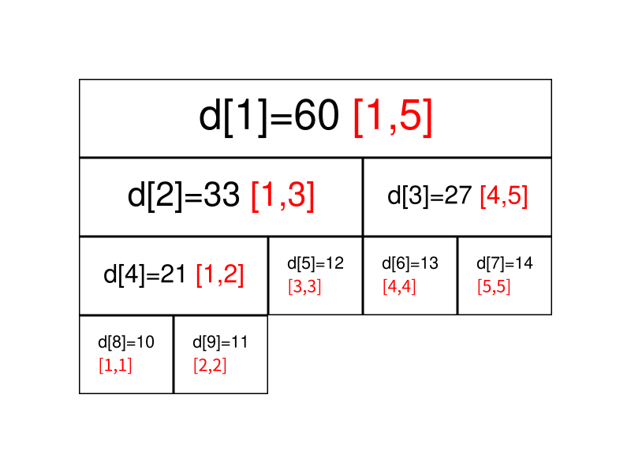
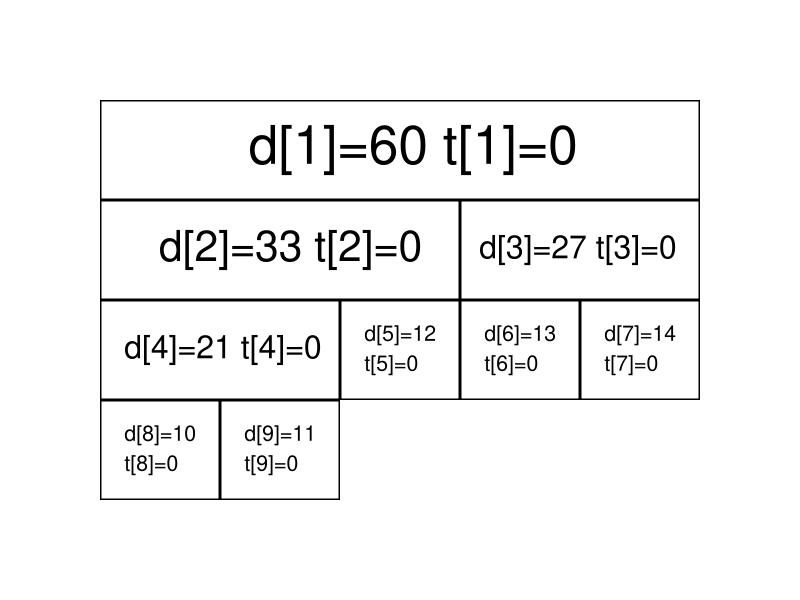
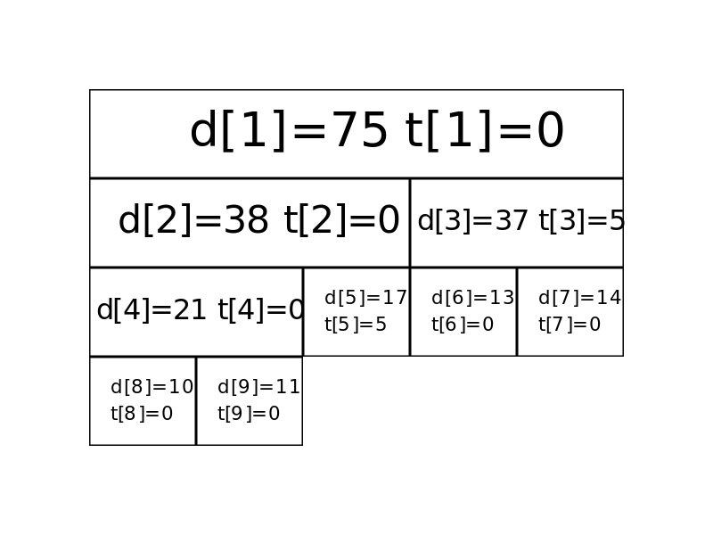
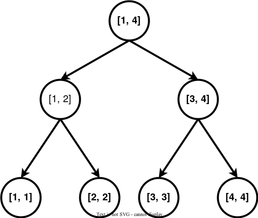
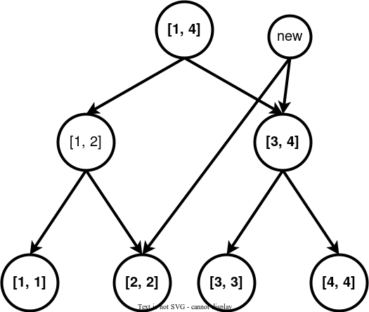

# 高级数据结构

## 线段树

线段树是用来维护 **区间信息** 的数据结构。

线段树可以在的时间复杂度内实现单点修改、区间修改、区间查询（区间求和，求区间最大值，求区间最小值）等操作。

### 线段树的基本结构与建树

线段树将每个长度不为 1 的区间划分成左右两个区间递归求解，把整个线段划分为一个树形结构，通过合并左右两区间信息来求得该区间的信息。这种数据结构可以方便的进行大部分的区间操作。

有个大小为 5 的数组$a=\{10, 11,12,13,14\}$，要将其转化为线段树，有以下做法：设线段树的根节点编号为 1，用数组 d 来保存我们的线段树，$d_i$用来保存线段树上编号为 i 的节点的值(这里每个节点所维护的值就是这个节点所表示的区间总和)。

我们先给出这棵线段树的形态，如图所示：


图中每个节点中用红色字体标明的区间，表示该节点管辖的 a 数组上的位置区间。如$d_1$所管辖的区间就是$[1,5](a_1,a_2,\cdots,a_5 )$，即$d_1$所保存的值是$a_1+a_2+\cdots+a_5$

通过观察不难发现，$d_i$的左叶子节点就是$d_{2\times i}$，右叶子节点就是$d_{2\times i+1}$。如果$d_i$表示的是区间$[s,t]$的话，那么左叶子节点表示的是区间$[s,\frac{s+t}{2}]$，右叶子表示的是区间$[\frac{s+t}{2}+1,t]$

在实现时，我们考虑递归建树。设当前的根节点为 p ，如果根节点管辖的区间长度已经是 1 ，则可以直接根据 a 数组上相应位置的值初始化该节点。否则我们将该区间从中点处分割为两个子区间，分别进入左右子节点递归建树，最后合并两个子节点的信息。

**实现**

此处给出代码实现，可参考注释理解：

```python
def build(s, t, p):
    # 对 [s,t] 区间建立线段树,当前根的编号为 p
    if s == t:
        d[p] = a[s]
        return
    m = s + ((t - s) >> 1)
    # 移位运算符的优先级小于加减法，所以加上括号
    # 如果写成 (s + t) >> 1 可能会超出 int 范围
    build(s, m, p * 2)
    build(m + 1, t, p * 2 + 1)
    # 递归对左右区间建树
    d[p] = d[p * 2] + d[(p * 2) + 1]
```

关于线段树的空间：如果采用堆式存储（ 2p 是 p 的左叶子，2p+1 是 p 的右叶子），若有 n 个叶子结点，则 d 数组的范围最大为$2^{\left \lceil \log n \right \rceil +1}$

分析：容易知道线段树的深度是$\left \lceil \log n \right \rceil $的，则在堆式储存情况下叶子节点（包括无用的叶子节点）数量为$2^{\left \lceil \log n \right \rceil }$个，又由于其为一棵完全二叉树，则其总节点个数$2^{\left \lceil \log n \right \rceil +1}-1$。当然如果你懒得计算的话可以直接把数组长度设为 4n ，因为$\frac{2^{\left \lceil \log n \right \rceil}-1 }{n}$的最大值在$n=2^{x+2}+1(x\in N_+)$时取到，此时节点数为 $2^{\left \lceil \log n \right \rceil +1}-1=2^{x+2}-1=4n-5$

而堆式存储存在无用的叶子节点，可以考虑使用内存池管理线段树节点，每当需要新建节点时从池中获取。自底向上考虑，必有每两个底层节点合并为一个上层节点，因此可以类似哈夫曼树地证明，如果有 n 个叶子节点，这样的线段树总共有 2n-1 个节点。其空间效率优于堆式存储，并且是可能的最优情况。

### 线段树的区间查询

区间查询，比如求区间$[l,r]$的总和（即$a_l+a_{l+1}+\cdots+a_r$)、求区间最大值/最小值等操作。



如果要查询的区间为$[3,5]$，此时不能直接获取区间的值，但是可 $[3,5]$ 以拆成 $[3,3]$和$[4,5]$，可以通过合并这两个区间的答案来求得这个区间的答案。

一般地，如果要查询的区间是$[l,r]$，则可以将其拆成最多为个$O(\log n)$ **极大**的区间，合并这些区间即可求出的$[l,r]$答案。

**实现**

```python
def getsum(l, r, s, t, p):
    # [l, r] 为查询区间, [s, t] 为当前节点包含的区间, p 为当前节点的编号
    if l <= s and t <= r:
        return d[p]  # 当前区间为询问区间的子集时直接返回当前区间的和
    m = s + ((t - s) >> 1)
    sum = 0
    if l <= m:
        sum = sum + getsum(l, r, s, m, p * 2)
    # 如果左儿子代表的区间 [s, m] 与询问区间有交集, 则递归查询左儿子
    if r > m:
        sum = sum + getsum(l, r, m + 1, t, p * 2 + 1)
    # 如果右儿子代表的区间 [m + 1, t] 与询问区间有交集, 则递归查询右儿子
    return sum
```

### 线段树的区间修改与懒惰标记

如果要求修改区间$[l,r]$，把所有包含在区间中$[l,r]$的节点都遍历一次、修改一次，时间复杂度无法承受。我们这里要引入一个叫做 **「懒惰标记」** 的东西。

懒惰标记，简单来说，就是通过延迟对节点信息的更改，从而减少可能不必要的操作次数。每次执行修改时，我们通过打标记的方法表明该节点对应的区间在某一次操作中被更改，但不更新该节点的子节点的信息。实质性的修改则在下一次访问带有标记的节点时才进行。

仍然以最开始的图为例，我们将执行若干次给区间内的数加上一个值的操作。我们现在给每个节点增加一个$t_i$，表示该节点带的标记值。

最开始时的情况是这样的（为了节省空间，这里不再展示每个节点管辖的区间）：



现在我们准备给$[3,5]$上的每个数都加上 5。

我们直接在这两个节点上进行修改，并给它们打上标记：



虽然子节点修改目前还没进行，但当我们要查询这两个子节点的信息时，我们会利用标记修改这两个子节点的信息，使查询的结果依旧准确。

接下来我们查询一下$[4,4]$区间上各数字的和。

我们通过递归找到$[4,5]$区间，发现该区间并非我们的目标区间，且该区间上还存在标记。这时候就到标记下放的时间了。我们将该区间的两个子区间的信息更新，并清除该区间上的标记。


**实现**

```python
def update(l, r, c, s, t, p):
    # [l, r] 为修改区间, c 为被修改的元素的变化量, [s, t] 为当前节点包含的区间, p
    # 为当前节点的编号
    if l <= s and t <= r:
        d[p] = d[p] + (t - s + 1) * c
        b[p] = b[p] + c
        return
    # 当前区间为修改区间的子集时直接修改当前节点的值, 然后打标记, 结束修改
    m = s + ((t - s) >> 1)
    if b[p] and s != t:
        # 如果当前节点的懒标记非空, 则更新当前节点两个子节点的值和懒标记值
        d[p * 2] = d[p * 2] + b[p] * (m - s + 1)
        d[p * 2 + 1] = d[p * 2 + 1] + b[p] * (t - m)
        # 将标记下传给子节点
        b[p * 2] = b[p * 2] + b[p]
        b[p * 2 + 1] = b[p * 2 + 1] + b[p]
        # 清空当前节点的标记
        b[p] = 0
    if l <= m:
        update(l, r, c, s, m, p * 2)
    if r > m:
        update(l, r, c, m + 1, t, p * 2 + 1)
    d[p] = d[p * 2] + d[p * 2 + 1]
```

区间查询（区间求和）：

```python
def getsum(l, r, s, t, p):
    # [l, r] 为查询区间, [s, t] 为当前节点包含的区间, p为当前节点的编号
    if l <= s and t <= r:
        return d[p]
    # 当前区间为询问区间的子集时直接返回当前区间的和
    m = s + ((t - s) >> 1)
    if b[p]:
        # 如果当前节点的懒标记非空, 则更新当前节点两个子节点的值和懒标记值
        d[p * 2] = d[p * 2] + b[p] * (m - s + 1)
        d[p * 2 + 1] = d[p * 2 + 1] + b[p] * (t - m)
        # 将标记下传给子节点
        b[p * 2] = b[p * 2] + b[p]
        b[p * 2 + 1] = b[p * 2 + 1] + b[p]
        # 清空当前节点的标记
        b[p] = 0
    sum = 0
    if l <= m:
        sum = getsum(l, r, s, m, p * 2)
    if r > m:
        sum = sum + getsum(l, r, m + 1, t, p * 2 + 1)
    return sum
```

如果你是要实现区间修改为某一个值而不是加上某一个值的话，代码如下：

```python
def update(l, r, c, s, t, p):
    if l <= s and t <= r:
        d[p] = (t - s + 1) * c
        b[p] = c
        v[p] = 1
        return
    m = s + ((t - s) >> 1)
    if v[p]:
        d[p * 2] = b[p] * (m - s + 1)
        d[p * 2 + 1] = b[p] * (t - m)
        b[p * 2] = b[p * 2 + 1] = b[p]
        v[p * 2] = v[p * 2 + 1] = 1
        v[p] = 0
    if l <= m:
        update(l, r, c, s, m, p * 2)
    if r > m:
        update(l, r, c, m + 1, t, p * 2 + 1)
    d[p] = d[p * 2] + d[p * 2 + 1]


def getsum(l, r, s, t, p):
    if l <= s and t <= r:
        return d[p]
    m = s + ((t - s) >> 1)
    if v[p]:
        d[p * 2] = b[p] * (m - s + 1)
        d[p * 2 + 1] = b[p] * (t - m)
        b[p * 2] = b[p * 2 + 1] = b[p]
        v[p * 2] = v[p * 2 + 1] = 1
        v[p] = 0
    sum = 0
    if l <= m:
        sum = getsum(l, r, s, m, p * 2)
    if r > m:
        sum = sum + getsum(l, r, m + 1, t, p * 2 + 1)
    return sum
```

### 动态开点线段树

最初只建立一个根结点代表整个区间，结点只有在有需要的时候才被创建。

单次操作的时间复杂度是不变的，为$O(\log n)$。由于每次操作都有可能创建并访问全新的一系列结点，因此 m 次单点操作后结点的数量规模是$O(m\log n)$。最多也只需要 2n-1 个结点，没有浪费。

**单点修改**

```cpp
// root 表示整棵线段树的根结点；cnt 表示当前结点个数
int n, cnt, root;
int sum[n * 2], ls[n * 2], rs[n * 2];

// 用法：update(root, 1, n, x, f); 其中 x 为待修改节点的编号
void update(int& p, int s, int t, int x, int f) {  // 引用传参
  if (!p) p = ++cnt;  // 当结点为空时，创建一个新的结点
  if (s == t) {
    sum[p] += f;
    return;
  }
  int m = s + ((t - s) >> 1);
  if (x <= m)
    update(ls[p], s, m, x, f);
  else
    update(rs[p], m + 1, t, x, f);
  sum[p] = sum[ls[p]] + sum[rs[p]];  // pushup
}
```

**区间询问**

```cpp
// 用法：query(root, 1, n, l, r);
int query(int p, int s, int t, int l, int r) {
  if (!p) return 0;  // 如果结点为空，返回 0
  if (s >= l && t <= r) return sum[p];
  int m = s + ((t - s) >> 1), ans = 0;
  if (l <= m) ans += query(ls[p], s, m, l, r);
  if (r > m) ans += query(rs[p], m + 1, t, l, r);
  return ans;
}
```

区间修改也是一样的，不过下放标记时要注意如果缺少孩子，就直接创建一个新的孩子。或者使用标记永久化技巧。

### 一些优化

这里总结几个线段树的优化：

- 在叶子节点处无需下放懒惰标记，所以懒惰标记可以不下传到叶子节点。
- 下放懒惰标记可以写一个专门的函数 `pushdown`，从叶子节点更新当前节点也可以写一个专门的函数 `maintain`（或者对称地用 `pushup`），降低代码编写难度。
- 标记永久化：如果确定懒惰标记不会在中途被加到溢出（即超过了该类型数据所能表示的最大范围），那么就可以将标记永久化。标记永久化可以避免下传懒惰标记，只需在进行询问时把标记的影响加到答案当中，从而降低程序常数。具体如何处理与题目特性相关，需结合题目来写。这也是树套树和可持久化数据结构中会用到的一种技巧。

### 线段树合并

我们不可能真的每次建满一颗新的线段树，因此我们需要使用上文的动态开点线段树。

线段树合并的过程本质上相当暴力：

假设两颗线段树为 A 和 B，我们从 1 号节点开始递归合并。

递归到某个节点时，如果 A 树或者 B 树上的对应节点为空，直接返回另一个树上对应节点，这里运用了动态开点线段树的特性。

如果递归到叶子节点，我们合并两棵树上的对应节点。

最后，根据子节点更新当前节点并且返回。

> 线段树合并的复杂度
>
> 显然，对于两颗满的线段树，合并操作的复杂度是$O(n\log n)$的。但实际情况下使用的常常是权值线段树，总点数和的 n 规模相差并不大。并且合并时一般不会重复地合并某个线段树，所以我们最终增加的点数大致是$n\log n$级别的。这样，总的复杂度就是级别$O(n\log n)$的。当然，在一些情况下，可并堆可能是更好的选择。

**实现**

```cpp
int merge(int a, int b, int l, int r) {
  if (!a) return b;
  if (!b) return a;
  if (l == r) {
    // do something...
    return a;
  }
  int mid = (l + r) >> 1;
  tr[a].l = merge(tr[a].l, tr[b].l, l, mid);
  tr[a].r = merge(tr[a].r, tr[b].r, mid + 1, r);
  pushup(a);
  return a;
}
```

#### [题目](https://leetcode.cn/problems/my-calendar-i/description/)

由于存在「懒标记」，线段树的插入和查询都是 logn 的，因此我们在单次操作的时候，最多会创建数量级为 logn 的点，因此空间复杂度为 O(mlogn)，而不是 O(4∗n)，而开点数的预估需不能仅仅根据 logn 来进行，还要对常熟进行分析，才能得到准确的点数上界。

动态开点相比于原始的线段树实现，本质仍是使用「满二叉树」的形式进行存储，只不过是按需创建区间，如果我们是按照连续段进行查询或插入，最坏情况下仍然会占到 4∗n 的空间，因此盲猜 logn 的常数在 4 左右，保守一点可以直接估算到 6，因此我们可以估算点数为 6∗m∗logn，其中 n=1e9 和 m=1e3 分别代表值域大小和查询次数。

当然一个比较实用的估点方式可以「尽可能的多开点数」，利用题目给定的空间上界和我们创建的自定义类（结构体）的大小，尽可能的多开（ Java 的 128M 可以开到 $5\times 10^6$ 以上）。

解答：

```java
class MyCalendar {
    class Node{ // l,r are the left and right child, lazy is the lazy value, num is the sum of the used spacetime
        int l, r, lazy, num;
    }

    private int N = (int)1e9, M = 120010, cnt = 1; // N is the maximum time, M is 6 * m * log(N), cnt is the current number of nodes
    private Node[] tr = new Node[M];

    public MyCalendar() {

    }

    public boolean book(int startTime, int endTime) { // [startTime, endTime)
        if(verifyRange(startTime, endTime-1, 0, N+1, 1) > 0){
            return false;
        }
        rangeadd(1, startTime, endTime-1, 0, N+1, 1);
        return true;
    }

    public int verifyRange(int start, int end, int s, int t, int p){ // [start, end], s, t are the range of the current node, p is the index of the current node
        if(start <= s && t <= end) return tr[p].num; // if the current node is in the range, return the sum of the used spacetime
        nodeCreat(p);
        pushdown(p, t - s + 1);
        int mid = s + (t - s) / 2;
        int res = 0;
        if(start <= mid) res = verifyRange(start, end, s, mid, tr[p].l);
        if(end > mid) res += verifyRange(start, end, mid + 1, t, tr[p].r);
        return res;
    }

    public void nodeCreat(int p){ // create the child nodes if they are not created
        if(tr[p] == null) tr[p] = new Node();
        if(tr[p].l == 0){
            tr[p].l = cnt++;
            tr[tr[p].l] = new Node();
        }

        if(tr[p].r == 0){
            tr[p].r = cnt++;
            tr[tr[p].r] = new Node();
        }
    }

    public void pushdown(int p, int len){ // push down the lazy value to the child nodes
        if(tr[p].lazy!= 0){
            tr[tr[p].l].lazy += tr[p].lazy;
            tr[tr[p].r].lazy += tr[p].lazy;
            tr[tr[p].l].num += tr[p].lazy * (len - len/2);
            tr[tr[p].r].num += tr[p].lazy * (len/2);
            tr[p].lazy = 0;
        }
    }
    public void pushup(int p){ // push up the sum of the used spacetime to the parent node
        tr[p].num = tr[tr[p].l].num + tr[tr[p].r].num;
    }

    public void rangeadd(int val, int start, int end, int s, int t, int p){  // add val to the range [start, end]
        if(start <= s && t <= end){
            tr[p].num += val * (t - s + 1);
            tr[p].lazy += val;
            return;
        }
        nodeCreat(p);
        pushdown(p, t - s + 1);
        int mid = s + (t - s) / 2;
        if(start <= mid) rangeadd(val, start, end, s, mid, tr[p].l);
        if(end > mid) rangeadd(val, start, end, mid + 1, t, tr[p].r);
        pushup(p);
    }
}
```

### 线段树分裂

线段树分裂实质上是线段树合并的逆过程。线段树分裂只适用于有序的序列，无序的序列是没有意义的，常用在动态开点的权值线段树。

注意当分裂和合并都存在时，我们在合并的时候必须回收节点，以避免分裂时会可能出现节点重复占用的问题。

从一颗区间为$[1,N]$的线段树中分裂出$[l,r]$，建一颗新的树：

从 1 号结点开始递归分裂，当节点不存在或者代表的区间$[s,t]$与没$[l,r]$有交集时直接回溯。

当$[l,r]$与有$[s,t]$交集时需要开一个新结点。

当$[s,t]$包含于$[l,r]$时，需要将当前结点直接接到新的树下面，并把旧边断开。

**实现**

```cpp
void split(int &p, int &q, int s, int t, int l, int r) {
  if (t < l || r < s) return;
  if (!p) return;
  if (l <= s && t <= r) {
    q = p;
    p = 0;
    return;
  }
  if (!q) q = New();
  int m = s + t >> 1;
  if (l <= m) split(ls[p], ls[q], s, m, l, r);
  if (m < r) split(rs[p], rs[q], m + 1, t, l, r);
  push_up(p);
  push_up(q);
}
```

### 线段树优化建图

在建图连边的过程中，我们有时会碰到这种题目，一个点向一段连续的区间中的点连边或者一个连续的区间向一个点连边，如果我们真的一条一条连过去，那一旦点的数量多了复杂度就爆炸了，这里就需要用线段树的区间性质来优化我们的建图了。

下面是一个线段树。



每个节点都代表了一个区间，假设我们要向区间$[2,4]$连边。



在一些题目中，还会出现一个区间连向一个点的情况，则我们将上面第一张图的有向边全部反过来即可，上面的树叫做入树，下面这个叫做出树。


### 拓展 - 猫树

众所周知线段树可以支持高速查询某一段区间的信息和，比如区间最大子段和，区间和，区间矩阵的连乘积等等。

但是有一个问题在于普通线段树的区间询问在某些毒瘤的眼里可能还是有些慢了。

简单来说就是线段树建树的时候需要做$O(n)$次合并操作，而每一次区间询问需要做$O(\log n)$次合并操作，询问区间和这种东西的时候还可以忍受，但是当我们需要询问区间线性基这种合并复杂度高达$O(\log^2w)$的信息的话，此时就算是做$O(\log n)$次合并有些时候在时间上也是不可接受的。

而所谓「猫树」就是一种不支持修改，仅仅支持快速区间询问的一种静态线段树。

构造一棵这样的静态线段树需要$O(n\log n)$次合并操作，但是此时的查询复杂度被加速至次$O(1)$合并操作。

在处理线性基这样特殊的信息的时候甚至可以将复杂度降至$O(n\log^2w)$。

**原理**

在查询$[l,r]$这段区间的信息和的时候，将线段树树上代表的$[l,l]$节点和代表这段$[r,r]$区间的节点在线段树上的 LCA 求出来，设这个节点代表的 p 区间为$[L,R]$,会发现一些非常有趣的性质：

1. $[L,R]$这个区间一定包含$[l,r]$。显然，因为它既是的祖 l 先又是的 r 祖先。
2. $[l,r]$这个区间一定跨越$[L,R]$的中点。由于 p 是 l 和 r 的 LCA，这意味着 p 的左叶子是 l 的祖先而不是 r 的祖先， p 的右叶子是 r 的祖先而不是 l 的祖先。因此， l 一定在$[L,mid]$这个区间内，r 一定在$(mid,R]$这个区间内。

有了这两个性质，我们就可以将询问的复杂度降至$O(1)$了。

**实现**

建树的时候对于线段树树上的一个节点，设它代表的区间为$(l,r]$。

不同于传统线段树在这个节点里只保留$[l,r]$的和，我们在这个节点里面额外保存$(l,mid]$的后缀和数组和$(mid,r]$的前缀和数组。

这样的话建树的复杂度为$T(n)=2T(n/2)+O(n)=O(n\log n)$同理空间复杂度也从原来的$O(n)$变成了$O(n\log n)$。

下面是最关键的**询问**了。

如果我们询问的区间是$[l,r]$，那么我们把代表 $[l,l]$的节点和代表$[r,r]$的节点的 LCA 求出来，记为 p 。

根据刚才的两个性质，$l,r$在所 p 包含的区间之内并且一定跨越了的 p 中点。

这意味这一个非常关键的事实是我们可以使用 p 里面的前缀和数组和后缀和数组，将$[l,r]$拆成$[l,mid]+(mid,r]$从而拼出来$[l,r]$这个区间。

而这个过程仅仅需要$O(1)$次合并操作！

不过我们好像忽略了点什么？

似乎求 LCA 的复杂度似乎还不是$O(1)$，暴力求是的$O(\log n)$，倍增法则是的$O(\log \log n)$，转 ST 表的代价又太大……

### 堆式建树

具体来将我们将这个序列补成 2 的整次幂，然后建线段树。

此时我们发现线段树上两个节点的 LCA 编号，就是两个节点二进制编号的最长公共前缀 LCP。

稍作思考即可发现发现在 x 和 y 的二进制下 `lcp(x,y)=x>>log[x^y]`。

所以我们预处理一个 `log` 数组即可轻松完成求 LCA 的工作。

这样我们就构建了一个猫树。

由于建树的时候涉及到求前缀和和求后缀和，所以对于线性基这种虽然合并是$O(\log^2w)$但是求前缀和却是$O(n\log n)$的信息，使用猫树可以将静态区间线性基从$O(n\log^2w + m\log^2w\log n)$优化至$O(n\log n\log w + m\log^2w)$的复杂度。

### Java 线段树模版（4n 内存）

Java 的泛型由于存在擦除，因此在编译后实际上并不能拿到类型信息，所有的类型都是基类，导致不能实现算数运算，在限定`Number`的情况下，可以使用`double`值计算结果，需要在外部调用后进行类型转换。

可以区间加/求和的线段树模板：

```java
import java.util.Arrays;

public class SegTreeLazyRangeAdd<T extends Number> {
    private double[] tree;
    private double[] lazy;
    private T[] arr;
    private int n, n4, root, end;

    public SegTreeLazyRangeAdd(T[] v) {
        n = v.length;
        n4 = 4 * n;
        tree = new double[n4];
        lazy = new double[n4];
        arr = v;
        root = 1;
        end = n - 1;
        buildTree(0, end, 1);
        arr = null;
    }

    private void buildTree(int s, int t, int p) {
        if(t == s){
            tree[p] = arr[s].doubleValue();
            return;
        }
        int m = s +  (t - s) / 2;
        buildTree(s, m, 2 * p);
        buildTree(m + 1, t, 2 * p + 1);
        tree[p] = tree[2 * p] + tree[2 * p + 1];
    }

    public double getsum(int l, int r){
        return getsum(l, r, 0, end, root);
    }

    public double getsum(int l, int r, int s, int t, int p){
        if(l <= s && t <= r){
            return tree[p];
        }
        int m = s +  (t - s) / 2;
        double sum = 0;
        if(lazy[p]!= 0){
            tree[2 * p] += (m - s + 1) * lazy[p];
            tree[2 * p + 1] += (t - m) * lazy[p];
            lazy[2 * p] += lazy[p];
            lazy[2 * p + 1] += lazy[p];
            lazy[p] = 0;
        }
        if(l <= m){
            sum += getsum(l, r, s, m, 2 * p);
        }
        if(r > m){
            sum += getsum(l, r, m + 1, t, 2 * p + 1);
        }
        return sum;
    }

    public void rangeAdd(int l, int r, double val){
        rangeAdd(l, r, val, 0, end, root);
    }
    public void rangeAdd(int l, int r, double val, int s, int t, int p){
        if(l <= s && t <= r){
            tree[p] += (t - s + 1) * val;
            lazy[p] += val;
            return;
        }

        int m = s +  (t - s) / 2;
        if(lazy[p]!= 0 && s != t){
            tree[2 * p] += (m - s + 1) * val;
            tree[2 * p + 1] += (t - m) * val;
            lazy[2 * p] += val;
            lazy[2 * p + 1] += val;
            lazy[p] = 0;
        }
        if(l <= m){
            rangeAdd(l, r, val, s, m, 2 * p);
        }
        if(r > m){
            rangeAdd(l, r, val, m + 1, t, 2 * p + 1);
        }
        tree[p] = tree[2 * p] + tree[2 * p + 1];
    }

    public void rangeSet(int l, int r, double val){
        rangeSet(l, r, val, 0, end, root);
    }
    public void rangeSet(int l, int r, double val, int s, int t, int p){
        if(l <= s && t <= r){
            Arrays.fill(lazy, s, t + 1, 0);
            tree[p] = (t - s + 1) * val;
            lazy[p] = val;
            return;
        }
        int m = s +  (t - s) / 2;
        rangeSet(l, r, val, s, m, 2 * p);
        rangeSet(l, r, val, m + 1, t, 2 * p + 1);
        tree[p] = tree[2 * p] + tree[2 * p + 1];
    }

}

```

### [Booking Concert Tickets in Groups](https://leetcode.cn/problems/booking-concert-tickets-in-groups/description)

将每一排座位看成一个整体，可将两种操作总结如下：

- gather：在前 maxRow 排中，找第一个还能至少有 k 个空座位的排，预定 k 个连续的座位。如果有这样的排，返回编号，以及在预定前有多少非空座位；如果没有这样的排，返回空列表。
- scatter：在前 maxRow 个排中预定总量为 k 的座位。从左到右选择有空座位的排依次占座。如果无法预定总量为 k 的座位，则不执行操作，并返回 false；否则执行操作，并返回 true。

解答：

```java
class BookMyShow {
    private int n, m;
    private int[] min;
    private long[] sum;

    public BookMyShow(int n, int m) {
        this.n = n;
        this.m = m;
        min = new int[4*n];
        sum = new long[4*n];
    }

    public int[] gather(int k, int maxRow) {
        int row = findFirst(k, maxRow, 0, n-1, 1);
        if(row == -1) return new int[0];
        update(row, k, 0, n-1, 1);
        return new int[]{row, (int)getsum(row, row, 0, n-1, 1)-k};
    }

    public boolean scatter(int k, int maxRow) {
        if(getsum(0, maxRow, 0, n-1, 1) <= (long)(maxRow + 1) * m - k){
            int i = findFirst(1, n-1, 0, n-1, 1);
            while(k > 0){
                int left = Math.min(k, m - (int)getsum(i, i, 0, n-1, 1));
                k -= left;
                update(i, left, 0, n-1, 1);
                i++;
            }
            return true;
        }
        return false;
    }

    public int findFirst(int k, int maxRow, int s, int t, int p){ // find the first row with space >= k
        if((m - min[p]) < k || maxRow < s) return -1;
        if(s == t){
            return s;
        }
        int mid = s + (t - s) / 2;
        if((m - min[2*p]) >= k){
            return findFirst(k, maxRow, s, mid, 2*p);
        }
        if(maxRow > mid){
            return findFirst(k, maxRow, mid+1, t, 2*p+1);
        }
        return -1;
    }

    public long getsum(int l, int r, int s, int t, int p) { // get the sum of [l, r]
        if(l <= s && r >= t) return sum[p];
        int mid = s + (t - s) / 2;
        long res = 0;
        if(l <= mid) res += getsum(l, r, s, mid, 2*p);
        if(r > mid) res += getsum(l, r, mid+1, t, 2*p+1);
        return res;
    }

    public void update(int i, int val, int s, int t, int p) { // update the min and sum of index i
        if(i < s || i > t) return;
        if(s == t){
            min[p] += val;
            sum[p] += val;
            return;
        }
        int mid = s + (t - s) / 2;
        update(i, val, s, mid, 2*p);
        update(i, val, mid+1, t, 2*p+1);

        min[p] = Math.min(min[2*p], min[2*p+1]);
        sum[p] = sum[2*p] + sum[2*p+1];
    }
}

```

## 字典树
