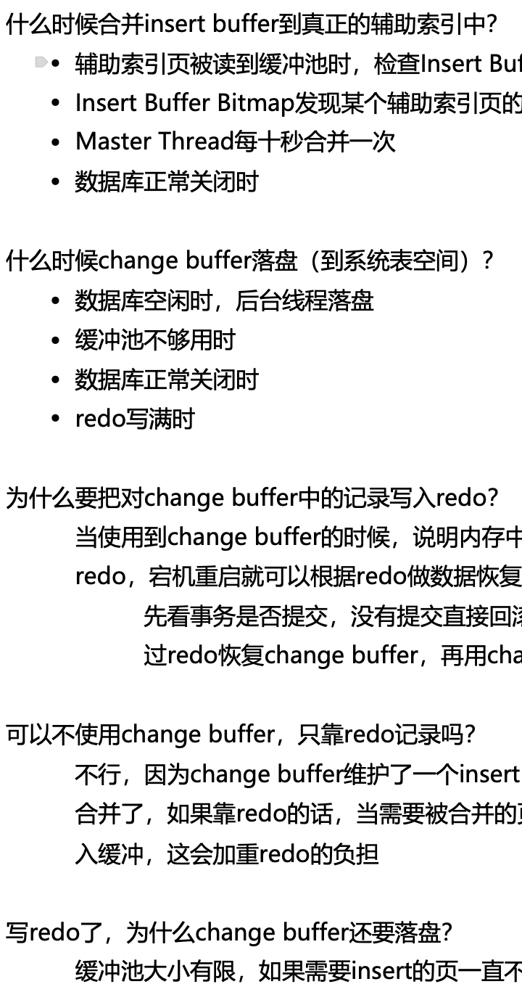

## 大学规划

### 校招

* 校园招聘，难度比社招（社会招聘）简单，要求更低，主要是企业面向应届生的招聘，大学生主要的就业机会。

* 优先级：暑期实习 > 秋招 > 秋招补录 > 春招 > 春招补录，反正越晚开优先级越低。因为现在秋招时间越来越提前，提前批好像已经几乎没有了，不做考虑，但如果有看到，可以去投

### 大学时间线

以2022年入学的四年本科、2023年入学的三年研究生为例，均为26届应届生

* 大一上（2022.9 - 2023.1）

* 大一下（2023.2 - 2023.6）

* 大二上/研一上（2023.9 - 2024.1）

  * 上面这段时间沉淀技术为主

* 大二下/研一下（2024.2 - 2024.6）

  * 推荐三四月份可以开始投日常

* 大二暑假（2024.7 - 2024.8）

  * 八月底，九月初 一定要把握这次机会投日常，日常实习hc最多的时候

* 大三上/研二上（2024.9 - 2025.1）

  * 卷实习，每段实习三个月就够了，如果是核心部门，可以多呆一会，但是日常实习很难接触到核心部门，最好能卷在暑期实习前卷出两段实习

* 大三下/研二下（2025.2 - 2025.6）

  * 二月底，三月初 各厂陆续开放暑期实习，一定早投，看了哪家开了立马投，晚投没机会

* 大三暑假（2025.7 - 2025.8）

  * 七月底，八月初 各厂陆续开放秋招笔试面试（比如美团25届秋招就是2024年7月29号开启的，算是打响25届秋招第一枪），一定早投，早投有机会，晚投没机会

* 大四上/研三上（2025.9 - 2026.1）

  * 12月份部分公司可能开放秋招补录，但不要过分依赖这个，属于是吃别人挑剩下的，机会少部门差

  * 秋招拿到offer的话，可以gap休息一年了，准备毕设

  * 没拿到offer的话，如果觉得自己只是差一点或者是研究生的话，可以备战春招；如果觉得自己差很多，可以准备来年的考研，给自己判个死缓，延长一下自己的应届生身份

* 大四下/研三下（2026.2 - 2026.6）

  * 二、三月 各厂陆续开放春招，也是最后一个校招机会，错过这次就没校招机会，等毕业后失去应届生身份，就只能社招（更没就业机会）

### 是否读研

* 学历不行（普通双非本且0实习(Java推荐211起步，双非本也有机会，但较少)）

* 时间不够（比如大一大二在玩，大三才开始学）

* 岗位需要学历（比如算法/一些央企国企）

* 个人对科研感兴趣

* 其它情况都没读研的必要了，读研性价比极低：导师压榨三年不如三年工作经验，赌遇到好导师不如去买彩票

### 竞赛/开源

* 不推荐任何竞赛：

  * 水赛：没用，有时间搞这个不如沉淀技术，找个实习，水赛包括各种建模啥的，看着就没用，蓝桥杯也不建议，性价比不如沉淀技术。

  * 真正有含金量的比赛：比如ACM，需要非常高的天赋+大量的努力才有结果，除非你真的觉得你是搞这个的天才并且能在一定程度上证明你的天赋，否则不建议搞，不如沉淀技术刷实习。

* 开源：

  * 有机会的话能参与到开源项目肯定是非常不错的经历，但不推荐那种xx系统的业务开源项目，最好是某些著名中间件的开源项目，比如RocketMQ，Seata，Dubbo等，需要对开源社区有浓厚的兴趣。

## 实习

### 分类

实习在广义上分为日常实习和暑期实习，一些厂可能有不同的情况，比如腾讯统一叫“长期实习”，京东又有个京东Young，字节又有日常和ByteInter......但是广义上是可以分成日常实习和暑期实习的。

* 日常实习

  * 就是我们普遍上说的公司开放的实习生岗位，一年365天全年可投，全年可以入职，可以在暑期入职，也可以在寒假入职，也可以在上课时入职，和时间没有强绑定关系。所以在暑假这个时间段实习的日常实习，就是叫日常实习，不叫暑期实习。

  * 大一大二大三大四都可以投

* 暑期实习

  * 一般指的是在大三下/研二下时，公司专门开放给大三下/研二下的实习生招聘，只能让大三下或者研二下的学生投递，其它人不能投递。比如26年毕业的学生，就是在你25年过完年后，开学的时候（此时大三下），就陆续开放暑期实习让你们投递了。一般是2月\~4月开放投递岗位。

  * 面试通过后，可以直接去实习，也可以等到大三暑期再去实习，一般是推荐直接去实习，因为暑期实习一般来说是有转正的，而转正一般是要有一定条件的，比如说美团的转正前提要求你得实习多少多少天，所以推荐提前实习。提前去实习还能早点接触业务，为转正答辩做好准备。

### 投递

日常实习是五分运气+三分信息差+两分实力，所以早投容错高，用时间去弥补运气，你投两天约不到一个面的概率肯定比你投两个月约不到面的概率要大很多。

* 内推

  * 内推就是公司鼓励员工内部介绍优秀人才进入公司，可以说是内部推荐，但是不代表保送，你用了别人的内推码、内推链接，仍然需要面试，而且难度不会有变化。所以内推一点用没有，与其关注这个，不如好好沉淀技术。

  * 但是有两种内推是有用的

    * 一种是你能联系到你的内推人，并且人家愿意帮你忙，别人可以帮你询问HR你的进度，可以push一下HR推进进度，但是这种情况很少，因为你的内推人大概率也联系不到HR。

    * 还有一种是组内内推，这种一般不用内推码，而是直接把简历发给内推人，内推人直接把你简历给组内leader看，leader看了说还行，就安排面试，这种一般是某组组内缺人了，然后鼓励组员手动帮忙推荐人进来，概率也比较小。

* 投递渠道

  * 官网

    * 大厂推荐这个，因为你在其它地方投递的话，也大概率兜兜转转最后让你去官网投递，搜索引擎直接搜xx招聘，或者是xx实习生招聘，就能找到对应公司的投递官网，比如“腾讯招聘”。

  * boss/实习僧/牛客等等其它第三方网站

    * 一般是投小厂，很难约面，需要海投。投递时打招呼的第一句话就要说明你的优势，不要在吗起手，不然HR都懒得点进你的对话框，直接表明身份，学历好的直接说自己92学历，有大厂实习经历的直接说。不要问在吗，我对这个岗位感兴趣之类的话，你这种话HR一天收到几千个。

### 去不去

* 小厂去不去

  * 如果没实习经历，且时间充足（大一 大二 大三上），可以去，因为第一段起步是难的，尽量把握每个机会，不要挑三拣四了，但是可以横向对比小厂的业务，选择去哪家。

  * 如果没实习经历，且已经大三下了，学历好且技术到位的话推荐冲暑期实习；学历差的话，推荐还是去小厂，然后好好准备秋招。

  * 如果有实习经历，且时间充足（大一 大二），如果找不到大厂实习的话，可以再刷一段小厂，但这时候要有随时跑路的准备，仍要继续投大厂。

  * 如果有实习经历，且已经大三下了，推荐冲暑期实习，不要再去小厂了。冲不到暑期那就好好沉淀技术准备秋招。

* 部门不匹配去不去

  * 如果面到测开、客户端、前端这些不匹配的，并且没实习经历的，测开可以去，但是去了得包装成后端产出，不要写测开。客户端和前端这两个和后端跳度太大了，不建议去。

* 薪资太烂去不去

  * 薪资太低需要付费实习，即收入小于支出，不建议去，一个是因为连生活最低成本都保不住了，去了也是很痛苦，基本静不下心实习。还有一个是因为给出这种薪资的厂还指望过去学到什么。

### 怎么去

* 学校不放实习

  * 首先要知道，学校节奏慢，内容落后，在学校学不到东西的。而且等你老老实实从学校学完，你面对的是有两三段大厂实习的选手，而你默默在简历上写着三年班委经验，高等数学90多分......你怎么和别人竞争？所以一定要润出去实习。

  * 有课程/查寝跑不出去，首先是实习的话不要弄得人尽皆知，范围控制在只有你室友知道（如果室友相处不行，室友也不要告诉），并且和你室友说不要外传。然后找人代课，加一些学校的二手群，发信息找人长期代课，如果是一些老师不点名啥的课，甚至不需要找人代课。如果有签到啥的，那就八仙过海，总会有办法的。不要继续保持传统的学生的迂腐的思维，整天想着上课咋办，课算个屁，自己的前途才是最重要的。

  * 如果被发现了，导员要求回去。可以直接和父母沟通，告诉他们学校没用，我要出去实习，说服父母观念，然后让父母和导员去对线，就说父母都答应孩子出去，学校别管这事了，可以签安全协议什么的，但这些都要偷偷进行，不要扩大影响，相当于跟学校私底下互相给个台阶。

  * 如果还是不行，可以暗度陈仓，和公司请假回去老实几天，再出去实习。

  * 反正就是八仙过海，不要给自己找各种理由，总会有办法的。最大的障碍也许不是学校，是你的勇气，你的传统思想。

* 租房

  * 租房推荐直接看这个视频https://www.bilibili.com/video/BV1K4421U79y/

### 干什么

* 产出

  * 首先你要知道，日常实习绝大多数都不是核心业务、核心部门，你过去就是去做dirty work、crud(增删改查)的，所以你想要写出一段好的实习，你需要包装你的产出，包装可以是看同事有亮点的代码，直接吃透然后拿过来说是自己的，也可以是对你自己的代码产出添油加醋，还可以是凭空捏造产出

  * 还可以用ai辅助你包装产出，反正部门和业务不行的话，不要傻傻的直接交代，实习90%的产出是需要包装的。

  * 每天去上班到岗位上的想法就是，要偷产出要偷产出要偷产出，去哪偷去哪偷去哪偷

* 没时间沉淀技术？

  * 实习工作了之后没时间、没心情学习是很正常的，大家最关键的是正确心态看待这件事，不要为此感到焦虑，然后也尽量在周末学学吧

### 其它

* 深度和多段实习如何选择

  * 如果时间多，推荐卷多段实习，每段实习三个月左右足够了。

  * 如果时间不多，来不及多段，可以卷一段深入的实习，或者是实习的部门业务较为核心，也可以深入实习，实习久一点，但不推荐超过六个月，太久了也没必要。

## 简历

后面会具体出一期视频详细介绍，这里只是简要概括

### 推荐网站

* 一个是codecv（https://codecv.top/）功能强大，diy程度高，免费用户也能完全够用，是我目前在用的。推荐制作简历的新手，入门级。缺点是如果简历内容太多，智能一页可能也一页塞不下而强制两页。

* 另一个是github上开源的制作网站（https://windrunnermax.github.io/CanvasEditor/ ）完全免费，非常非常高的diy化，推荐有一定制作简历的经验后可以去捣鼓玩一下。缺点是需要自己diy化，需要自己本身有一定的审美，上手难度较大，但是功能没有任何问题，我个人觉得是简历制作功能最强大的网页。

### 简历内容

* 核心逻辑：简单明确，突出重点和你的价值点，花里胡哨的东西尽量少搞点。

* 哪些写/哪些不写：什么担任班长团支书，什么数模这些竞赛其实没必要写，会让HR觉得你没东西了。

* 顺序：教育经历、开源经历、实习经历、项目经历、专业技能

## 面试

### 流程

* 一般是你投递多个部门后，如果某个部门看上的简历，你的简历会被这个部门锁住，其它部门不能面你，然后如果看上你的这个部门一直不推进进度，等于你在这个公司就被锁流程了，算是半个废了，不过一般来说一直锁住的概率比较小，可能锁个十天半个月后，就释放了。

* 实习的话一般大厂是两轮技术，部分厂有HR面。小厂实习可能就一轮技术就是了。

* 秋招的话一般是三轮技术面+HR面。小厂秋招不太清楚，没了解过，应该也是至少两轮技术。

* 每次面完快的话可能十分钟就有结果，慢的话可能三四天，四五天。

### 内容

* 项目

  * 由你简历上介绍的点开始发问，然后引申，比如为什么你这里要这样，会不会有什么问题，可不可以用xxx方案，你还能想出什么方案等等，这些问题都要提前准备好

* 八股

  * Java八股四大件，面试重灾区：MySQL、Redis、JUC、JVM。然后一个小件就是MQ（RocketMQ/Kafka）

  * 腾讯字节喜欢问操作系统和计算机网络

* 算法

  * 力扣hot100得能秒背出来的程度，大厂面试一般是ACM模式，可以去https://kamacoder.com/练习

  * 一般不会规定说多少分钟多少分钟之内做出来，一般就是直接让你做，你要是一卡一卡的，面试官就知道你不会了。应该就会把你叫停了，我目前为止都做出来了，基本都是hot100原题。

  * 得熟悉API，平时刷题在力扣上刷，不要去Idea刷然后复制过来。刷的多了就熟悉API了

* 反问

  * 问自己没答出来的点，如果不问，面完再去搜，可能你搜出来的不是面试官想听的，如果太多没答出来，挑一些更难答的反问。

  * 问工作地点，问业务（要表现出自己想去的意愿），求建议这些都可以。

  * 问进度，总共有几轮面试，面试推进的节奏（多久出结果）

  * 大厂不要问薪资，薪资基本都能在网上搜到，直接问显得你不会搜索信息。而且面试官可能都不清楚实习生薪资。

* HR面

  * 基本就是问你遇到的挑战，职业规划，解决问题啥啥的，正常交流就行

### 其它

* 面评

  * 面评就是面完后面试官面完你后，在系统里给你写一些评价，后来的面试官，不只是你这次投递的面试官，包括你后续投递这个公司其它岗位的面试官，都能看到前面面试官给你留的面评，比如你实习的面评在你秋招时，也会被看到。

  * 大厂里面，除了字节特别看重面评，其它厂虽然有面评，但一般不会太看，所以面字节需要谨慎一些。

* 表达

  * 其实就是多听多说，多听就是听听别人如何进行的面试，听得多了就知道对于那些常见八股，或者是语言表达上，别人是如何处理的，然后从中学习。多说就是可以找个没人的地方，说给自己听，一定要用嘴巴说出口，在心中默念效果就大打折扣。具体说的内容其实就是找篇面经，对于上面的八股，假装自己在说给面试官听，然后录音下来复盘，看看自己是哪里卡壳了，哪里不熟，然后再解决问题。

## 学习

### 学习时长

* 没有标准的规定，别人一天能学10小时，不代表你能一天学10小时；别人一天10小时效率可能顶你20小时，也可能只顶你10分钟，不要在意别人学多久，也不要和别人对比学习时长，没有一点意义，找到适合自己学习的时长与节奏就行，每个人情况不一样，需要学习的时间也不一样，根据自己的情况来，时间来不及就多学点，时间充足就稳步学习，牢固基础

### 如何学

* 深度 vs 广度：先广度，扩展自己的知识面，先把技术栈学完，此时不求甚解，大概了解即可，学完后开始进行深度学习，对于每个技术栈，了解对应的八股考察点，自己再在学习的过程中去思考，为什么这里要这样，可不可以那样，这样会有什么问题吗等等，不断给自己提问，不断发散自己的思维，比如这是我在学到mysql里的change buffer时不断给自己追问的思考

在思考这些内容后，我会以各种渠道去寻找答案。也许这些八股在面试时不会被问到，但是我们重点其实是说在学习过程中带有思考，养成一种思维习惯。

* 学习资料来源（具体路线以后单独出视频）

  * 面经：牛客网，bilibili上的一些up的面经分享，小林coding公众号的面经专栏......

  * 八股：各大八股网站或资料(小林，二哥，pdai，javaguide，hollis，极客时间等等)，各大博客网站(csdn，腾讯云社区，阿里云社区，稀土掘金等等)

  * 算法：力扣，b站 灵茶山艾府 的算法基础精讲系列视频

  * 书籍：《深入理解Java虚拟机-第三版》（强推）、《MySQL技术内幕-InnoDB存储引擎》（强推）、《Java并发编程的艺术》（推荐）、《码农翻身》（当故事看，推荐）、《网络是怎样连接的-户根勤》（强推）

* 学习过程

  * 一个是之前说的学习中主动思考，还有一个是要学会做笔记，把学下来的东西记下来，一个是整理自己的输出，另一个是方便自己之后去复习，然后这里就涉及到学了忘的情况。其实学了忘是很正常的，我也忘，所以我们不要焦虑这件事，而是应该思考如何解决，其实解决方案有两个，一个是学习过程中要充分理解，而不是背诵性记忆，还有一个是做笔记然后定期复盘。

  * 记笔记的形式依照自己的喜好来即可，推荐的软件有OneNote、飞书、语雀

  * 复习频率也是按照自己的情况来，忘得快的都定期多看几遍，记忆好的频次可以降低一些，复习一遍的速度也是慢慢提上来的，比如我最先复习我的笔记一遍需要六七天，现在只需要两天时间，越熟肯定越快

  * 然后是如何保持学习积极性，有的人可能看了我的视频后头两天是学的，然后就抛之脑后了。我觉得要保持一个良好的学习状态，得有个长期的目标，确认自己的目标是什么，比如说要进大厂，因为薪资高，想赚钱，或者说要去wlb work life balance的厂，想有自己的时间，而这些选择权，都需要你有足够的实力拿到offer才可以，这是一个点，确认自己想要什么，作为目标。然后下一个点是正确看待这件事，就是很少很少有人能做到一年下来每天都保证积极性，所以有那么一段时间消极很正常的，我也有不想学的时候，所以得正确看到这件事，不要过于焦虑执着。然后其他点的话其实能展开说很多，但都是一些网上的大家都在老生常谈的东西，我个人的话其实觉得分享这两点就够了，一个是明确目标，一个是正确看待，其实最重要的执行权还是在你手上，其他人说再多老生常谈的东西其实都是我们从小听到大的老东西了。都没什么用，毕竟说了你也大概率听听，过两天就忘了。

## 个人经验分享

### 正确认知

* 如果确定走就业路线的计算机的话，建议提前自学，然后润出学校去找实习，不要乖乖待学校跟学校进度，没用！

* 明确你要干什么，路线要清晰，要有执行力，做事前需要先整体再细节

### 我的大学

* 大一上：学习C语言，迷茫，不知道方向，盲目地跟着学校学习，不知道该就业还是读研，不知道如何选择。

* 大一寒假

  * 了解到Java，确定走Java的就业路线，完全不再考虑读研的事，送我保研都不去。

* 大一下：

  * 学习Java，但这时候其实并没有学得很快，五一劳动节才刚学完Javase，也就是Java基础语法，然后学完MySQL，大一下结束了。

* 大一暑假：

  * 学完JavaWeb、Spring、SpringMVC、Mybatis、Redis、SpringBoot、JUC、JVM、SpringCloud、RocketMQ，基本上Java的技术栈就学完了，我这里的学习指的是看完视频。

* 大二上：

  * 开始刷力扣

  * 写项目，这里写的是慕课网上的12306，用来练手，但不建议大家写（除非你时间充足，然后以学习为目的的去写，不建议花费时间超过两周）。

  * 参加七牛云的1024创作节比赛，拿到小奖和面试机会，但是面试没过，因为七牛云是用go的，所以没问我java相关技术，问我计算机网络那些了（甚至问我有没有动手抓过网络包）。

  * 然后开始学习操作系统和计算机网络，我这里看的是小林coding的。

* 大二寒假：

  * 再看了下动力节点老杜的Spring、Mybatis视频，因为黑马在这块的视频介绍的其实不太行。

  * 然后学了下Netty。

  * 学习设计模式。

  * 开始坚持刷力扣的每日一题。

* **大二下**：

  * 自己总结了一下目前为止学过的东西，全部用自己的话总结了一遍到自己的笔记上面，最突飞猛进的阶段，把前面学习的所有东西全部融会贯通了，这个阶段整理的笔记一直影响到我现在，我现在复习都是依赖于这个阶段总结的笔记知识点。其主要内容，差不多就是我看了各个网站的八股，然后把里面不会的、不熟的的内容，按照自己的话、自己的理解总结了一遍。

  * 然后写马丁的12306，这个12306更为推荐。

  * 写完项目后投递各厂的实习岗位。5月份

  * 面试来我们学校宣讲的“保融科技”公司，宣讲完当场笔试，然后第二天一轮群面(八九个人，除了我都是25届的研究生或本科生)后确定offer，这个其实是面向25届的暑期实习，但面试官说我表现出色，破例给我这个机会。准备暑假去这家公司实习。

  * 美团突然给面试机会，两轮面试通过后，接受美团offer，拒绝保融的offer。

* 大二暑假：

  * 美团实习

  * 复习Netty、自研网关项目

* 大三上：

  * 回到学校，继续投简历，面试快手、小红书、得物，最终去小红书实习。

* 大三寒假：

  * 小红书远程办公

  * 走亲戚

  * 面试腾讯，接受腾讯offer

* 大三下：

  * 腾讯实习

* 总结：

  * 其实可以看到，我就是个普通人，高中没有基础，大一上迷迷茫茫，没有高人指点带路，我的大学经历也就是比正常人提前“醒悟”，开始得早，并不算天赋选手，没有竞赛，没有证书。

  * 在实习后，基本是没什么时间学习沉淀了，所以建议大家早期好好沉淀技术，打牢基础。

  * 八股的话，我主要是在大二下的时候，集中整理了我的所有所学知识，是**量变引起质变的转折点**，从此以后我的八股直接复习我的笔记就行了

  * 项目的话，按照时间顺序，我是做了5个项目：

    * 黑马点评（黑马Redis课程里内含的项目，Java最好的入门项目，没有之一）

    * 慕课网上的12306（学习可用）

    * 自己设计并实现的Web端短视频项目，即仿抖音项目（七牛云1024创作节比赛用）

    * 马丁的12306（进阶项目，想了解的可以后台问我）

    * 自研的网关项目。

  * 算法的话，我是大二上开始刷的，大二寒假开始坚持每日一题。

